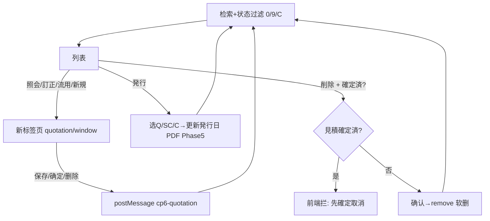

# 御見積一覧 单页面操作 SOP（手把手版）

> **用途**：给**业务用户照着点、培训老师照着讲、测试人员照着拆用例**的单页面手册。比模块总册更细、更口语。
> **页面**：御見積一覧（MSBBPA040 · 御見積書 MSBBPA030 的检索台账 · 销售管理 MSBB · 模块总册 §5.4）　**前端**：`views/erp/QuotationListView.vue`　**API**：`api/erp/quotation.ts`(`getList`/`issue`/`remove`)　**后端**：`Erp/QuotationController.GetList` → `QuotationService.GetPageListAsync`
> **基准**：分支 `feat/wfs-inbox-core`，2026-06-28，均实测真实代码（核对 `docs/codemap-erp/03-御見積-quotation.md`）。查不到的标 `待业务确认` / `代码未发现`。
> **样例数据**：御見積書No `QTN2026060001-01`、客户 `C0001`(A社)、拠点 `BASE01`、状态 未承認/承認済/見積確定済。

---

## 1. 页面一句话说明

**御見積一覧，就是销售用来"找報価单、按状态(未承認/承認済/見積確定済)筛、再打开去改/复制/发行/删"的台账页——它支持 No区间/発行日/拠点/担当/客户/案件/品名+状态多选检索；行操作用**新页签**打开御見積書(照会/訂正/流用)，还能直接**発行**帳票和**删除**；其中**確定済的御見積不让删**(要先去確定取消)，删除是论理删除(软删)。**

---

## 2. 这个页面在业务流程中的位置

```
上游(报价单)                本页面(检索台账+状态过滤)                  下游(新页签/动作)
──────────────       ──────────────────────────────       ────────────────────────
御見積書(束ね/確定/発行) ──→ 御見積一覧 MSBBPA040               照会/訂正/流用/新規 → 御見積書编辑页
                            检索+状态(0未承認/9承認済/C確定済)   発行 → Q/SC/C 帳票(直接在列表发)
                            行操作/発行/软删                    削除 → 论理删除(確定済拦截)
                                                               └ 存/删后 postMessage 回刷列表
```

- **上游**：【御見積書】建/確定/発行后的記録。
- **本页面**：多条件检索+状态多选筛，看初行/合計金额与综合状态；行操作开新页签编辑，或直接发行/删除。
- **下游**：① 照会/訂正/流用/新規 都在新标签页打开御見積書；② 列表可直接【発行】出帳票(Q/SC/C)；③ 删除=论理删除。
- **关键认知**：① 行操作开**新标签页**(window.open)，编辑细节见 `01-03-御見積書`；② **状态过滤**用 0(未承認)/9(承認済)/C(見積確定済) 多选；③ **確定済御見積前端就拦着不让删**——提示先確定取消；④ 删除=**软删**不可复旧；⑤ 新页签存/删会 postMessage 让列表**自动刷新**。

---

## 3. 谁使用这个页面

| 角色 | 使用目的 | 常用操作 | 权限要求 | 注意事项 |
|---|---|---|---|---|
| 销售/营业担当 | 找报价、改/复制/发行 | 检索、訂正、発行 | 见積查看/编辑(`[Authorize]`，细粒度`待业务确认`) | 改在新页签 |
| 销售主管 | 按状态盯确定/审批进度 | 状态过滤、照会 | 查看 | 0/9/C筛 |
| 销售内勤 | 发行帳票、删错档 | 発行、削除 | 发行/删除权限 | 確定済禁删 |
| 报价复核 | 看合计/状态 | 检索、照会 | 查看 | 只读 |
| 测试/UAT | 验检索/状态/発行/删除拦截 | 全流程 | 登录 | 確定済删除拦截 |

> 📌 **权限现状**：`QuotationController` 标 `[Authorize]`；编辑/发行/删除细粒度授权 `待业务确认`。

---

## 4. 操作前准备（不准备好，下面会卡住）

| 准备项 | 为什么需要 | 不满足会怎样 | 去哪里维护/确认 | 测试关注点 |
|---|---|---|---|---|
| 系统已有御見積書 | 列表才有内容 | 查询空 | 先建御見積書 | 空结果 |
| 浏览器允许新标签页 | 行操作开新页签 | 提示被拦截 | 浏览器设置 | 拦截 |
| 懂三种状态含义 | 状态过滤要选对 | 筛错 | 见§9 | 状态 |
| 知道確定済不能删 | 误删確定報価 | 删被拦 | 见§7/§10 | 删除拦截 |
| 发行要选帳票 | 発行弹框选Q/SC/C | 选不对 | 见§7 | 发行 |

---

## 5. 页面区域说明

| 区域 | 页面位置 | 用户要做什么 | 注意事项 |
|---|---|---|---|
| 检索区 | 顶部 | 填No区间/発行日/拠点/担当/客户/案件/品名 + 勾状态 | 都非必填 |
| 状态过滤 | 检索区内(复选框) | 勾 未承認(0)/承認済(9)/見積確定済(C) | 多选 |
| 工具按钮区 | 检索区内 | 検索 / クリア / 新規 | 新規开新页签 |
| 结果列表 | 中部(桌面表格/移动卡片) | 看报价、排序、行操作 | 双击行=照会 |
| 行操作区 | 每行右侧(固定列) | 照会/訂正/流用/発行/削除 | 確定済删除被拦 |
| 分页区 | 列表下方 | 翻页/改每页 | 10/20/50/100 |

---

## 6. 字段填写说明（口语版）

### 6.1 检索条件（怎么填）

| 字段 | 字段名 | 怎么填 | 必填 | 注意 |
|---|---|---|---|---|
| 御見積書No(从~至) | `qtnNoFrom~qtnNoTo` | No区间 | 否 | 区间 |
| 発行日(范围) | `issueDateFrom~To` | 日期区间 | 否 | from≤to |
| 拠点 | `baseCd` | 下拉选 | 否 | 全部=不限 |
| 担当 | `staffCd` | 输担当CD | 否 | — |
| 得意先 | `customerCd` | 客户CD | 否 | — |
| 親案件 | `projectNoParent` | 案件号 | 否 | — |
| 品名 | `customerProductName1` | 品名 | 否 | — |
| 状态 | `statuses[]` | 勾 0未承認/9承認済/C見積確定済 | 否 | 多选；不勾=全部 |

### 6.2 列表列（怎么看）

| 列 | 字段 | 含义 | 排序 |
|---|---|---|---|
| 御見積書No | `qtnNo` | 报价编号 | 可(固定列) |
| 発行日 | `qtnIssueDate` | 発行日期(发行后填) | 可 |
| 拠点/担当/得意先CD·名 | base/staff/customer | 归属 | 可 |
| 親/子案件 | projectNoParent/Child | 案件 | 可 |
| 品名1 | `itemName1` | 首品名 | 否 |
| 初行数量/単価/金額 | firstQuantity/UnitPrice/Amount | 第一明细 | 否 |
| 合計金額 | `totalAmount` | 报价合计 | 可 |
| 状态 | `status` | 未承認/承認済/見積確定済(tag) | 否 |
| 操作 | — | 照会/訂正/流用/発行/削除 | — |

> 本页是查询页，**无内联编辑表单**(建/改在新页签的御見積書)。

---

## 7. 按钮操作说明

| 按钮 | 何时点 | 系统做什么 | 成功后 | 失败处理 | 测试关注点 |
|---|---|---|---|---|---|
| 検索 | 设好条件 | 调 getList(剔空串+状态过滤) | 列表出结果+总数 | 0件→空 | 检索/状态 |
| クリア | 重查 | 清所有条件+状态重查 | 条件清空 | — | 重置 |
| 新規 | 建新报价 | window.open `/quotation/window?op=new` | 新标签页打开御見積書 | 被拦→提示 | 新建 |
| (双击行)/照会 | 看某単 | 新页签 op=view | 新标签照会 | 拦截提示 | 跳转 |
| (行)訂正 | 改某単 | 新页签 op=edit | 新标签编辑 | 拦截提示 | 跳转 |
| (行)流用 | 复制某単 | 新页签 op=copy | 新标签复制 | 拦截提示 | 跳转 |
| (行)発行 | 发某単帳票 | 弹框选Q/SC/C→issue→更新発行日 | "発行しました:文件名"、刷新 | 取消→无动作；PDF Phase5 | 发行 |
| (行)削除 | 删某単 | **確定済→前端拦提示先確定取消**；否则确认→remove(软删) | 提示删除、刷新 | 確定済被拦 | 删除拦截 |
| (表头)排序 | 按列排 | onSortChange 重查 | 列表重排 | — | 排序 |
| (分页) | 翻页/改每页 | 重查 | 翻页 | — | 10/20/50/100 |

> ⚠️ **確定済删除拦截**(前端)：点删除时若该行状态=`見積確定済`，**前端直接拦**提示"確定済の御見積書は削除できません。先に確定取消してください"(不调后端)。要删先到御見積書【確定取消】。
> ⚠️ **删除=论理删除(软删)**——非確定済的确认后软删、不可复旧。
> ⚠️ **発行真实 PDF 为 Phase 5 待实现**——当前仅更新発行日+返回文件名(详见 01-03 §8 场景四)。

---

## 8. 标准业务操作 SOP（照着点）

### 场景一：多条件检索 + 状态过滤
- **业务背景**：销售要看 A社未确定的报价。
- **使用样例数据**：客户 C0001；状态勾【未承認】。
- **前置条件**：① 登录有查看权限；② 有御見積数据。
- **详细操作步骤**：
  1. 打开【销售管理 → 御見積一覧】。
  2. 填【得意先】C0001，按需填 No区间/発行日/拠点。
  3. 在【状态】勾【未承認】(也可多勾 承認済/見積確定済)。
  4. 点【検索】→ 看列表与总件数。
  5. 需要时排序/分页。
- **完成后检查**：① 结果符合条件与所勾状态；② 状态tag颜色对(确定済绿/承認済黄/未承認灰)。
- **异常处理**：不勾状态=全部；0件→空。
- **可拆测试用例**：TC-M04-QTNL-002/003/004/009/010。

### 场景二：照会/訂正/流用打开御見積書（新页签）
- **业务背景**：复核或改某报价。
- **使用样例数据**：QTN2026060001-01。
- **前置条件**：查到该报价。
- **详细操作步骤**：
  1. 查到目标行，双击或点【照会】(只读)/【訂正】(改)/【流用】(复制)。
  2. 新标签页打开御見積書对应操作(束ね/確定/発行见 01-03)。
  3. 存完回列表标签页——已**自动刷新**。
- **完成后检查**：① 新页签正确载入；② 存完列表反映。
- **异常处理**：新页签被拦→允许本站新页签。
- **可拆测试用例**：TC-M04-QTNL-011/012/013/014/020。

### 场景三：在列表直接发行帳票
- **业务背景**：报价确定了，直接从列表发给客户。
- **使用样例数据**：QTN2026060001-01。
- **前置条件**：报价已存(通常已確定)。
- **详细操作步骤**：
  1. 查到目标行，点【発行】。
  2. 弹框输 `Q,SC,C`(Q=御見積書/SC=提出用計算書/C=計算書，逗号分隔)。
  3. 确认→ 更新発行日+返回文件名，提示"発行しました:文件名"，列表刷新。
- **完成后检查**：① 発行日列更新；② 文件名符合所选。
- **异常处理**：**真实PDF为Phase5待实现**(只更発行日+文件名)；取消→无动作。
- **可拆测试用例**：TC-M04-QTNL-015/016。

### 场景四：删除未確定报价（软删）
- **业务背景**：作废一张未确定的报价。
- **使用样例数据**：状态=未承認/承認済 的报价。
- **前置条件**：非確定済。
- **详细操作步骤**：1) 点【削除】；2) 确认弹窗"論理削除・復旧不可"→确定；3) 软删、提示、刷新。
- **完成后检查**：① 列表默认查不到；② IsDeleted=1。
- **异常处理**：误删→开发带 includeDeleted 找回(`待业务确认`)。
- **可拆测试用例**：TC-M04-QTNL-017。

### 场景五：删除確定済报价被拦截（前端）
- **业务背景**：误删了已确定的报价。
- **使用样例数据**：状态=見積確定済 的报价。
- **前置条件**：报价已確定。
- **详细操作步骤**：
  1. 对確定済行点【削除】。
  2. 系统**前端直接拦**，提示"確定済の御見積書は削除できません。先に確定取消してください"(不弹确认、不调后端)。
  3. 要删→到御見積書【確定取消】解锁后再删。
- **完成后检查**：① 確定済删除被前端拦；② 提示要先確定取消；③ DB 未变。
- **异常处理**：先確定取消(01-03 场景三)再删。
- **可拆测试用例**：TC-M04-QTNL-018/019。

### 场景六：新页签保存后列表自动刷新（postMessage）
- **业务背景**：验证编辑/确定/发行后台账更新。
- **使用样例数据**：任一报价。
- **前置条件**：从本列表打开新页签。
- **详细操作步骤**：1) 訂正/確定打开新页签；2) 操作并保存；3) 切回列表观察。
- **完成后检查**：① 列表自动刷新；② 新状态/值反映。
- **异常处理**：跨源/被拦→手动検索。
- **可拆测试用例**：TC-M04-QTNL-021/022。

### 场景七：移动端卡片操作
- **业务背景**：手机查报价。
- **使用样例数据**：—。
- **前置条件**：窄屏。
- **详细操作步骤**：1) 窄屏→卡片列表；2) 点卡片照会；3) 卡片内訂正/流用/発行/削除。
- **完成后检查**：① 卡片视图正常；② 操作可用(确定済删除仍拦)。
- **异常处理**：—。
- **可拆测试用例**：TC-M04-QTNL-023。

---

## 9. 状态变化说明

> 列表的"状态"是御見積综合状态文案，由双标志位算出(见 01-03)；本页只**展示+过滤**，不改状态。

| 状态(综合) | 用户看到 | 含义 | 能否在本页删 | 下一步 |
|---|---|---|---|---|
| 未承認 | 灰 tag | EstimateCheckFlg=0 且 未確定 | 能(软删) | 訂正/確定 |
| 承認済 | 黄 tag | EstimateCheckFlg=9 且 未確定 | 能(软删) | 確定登録 |
| 見積確定済 | 绿 tag | MasterConfirmFlg=9 | **不能(前端拦)** | 先確定取消再删 |
| (软删) | — | IsDeleted=1 | — | — |



---

## 10. 按钮不可用 / 灰色 / 不出现原因

| 按钮 | 何时不可用/被拦 | 为什么 | 怎么处理 | 测试关注点 |
|---|---|---|---|---|
| 行操作 | 未定位行 | 需先找到行 | 检索定位 | — |
| 新页签打开 | 浏览器拦弹窗 | 浏览器策略 | 允许本站新页签 | 拦截 |
| 削除(確定済行) | 状态=見積確定済 | 前端拦(确定锁定) | 先確定取消 | 删除拦截 |
| 删除(无权限) | 无删除权 | 权限`待确认` | 申请权限 | 权限 |
| 排序 | 部分列不可排 | 仅sortable列 | — | — |

---

## 11. 常见错误与处理

| 错误/现象 | 可能原因 | 用户处理方法 | 是否需要管理员 | 测试关注点 |
|---|---|---|---|---|
| 列表无数据 | 条件过严/状态没勾对 | 放宽条件/调状态 | 否 | 空结果 |
| 新页签没打开 | 浏览器拦截 | 允许本站新页签 | 否 | 拦截 |
| 確定済删不掉 | 前端拦(确定锁) | 先確定取消再删 | 否 | 删除拦截 |
| 删了想找回 | 软删 | 开发带includeDeleted(`待确认`) | 是 | 软删恢复 |
| 改完列表没变 | postMessage未触发/跨源 | 手动検索 | 否 | 刷新 |
| 発行没出PDF | 真实PDF Phase5待实现 | 当前只更発行日+文件名 | 是(开发) | 发行 |
| 状态筛不出 | 没勾或勾错 | 勾对应0/9/C | 否 | 状态 |
| 权限不足 | 无编辑/发行/删除权 | 申请权限 | 是 | 权限`待确认` |
| 网络/接口异常 | 后端/网络 | 稍后重试 | 是(运维) | 异常 |

---

## 12. 操作完成后的检查清单

| 操作 | 当前页面检查 | 新页签(御見積書)检查 | 数据状态 | 测试关注点 |
|---|---|---|---|---|
| 检索+状态过滤 | 结果符合条件与状态 | — | — | 状态 |
| 照会/訂正/流用/新規 | 新页签打开对应操作 | 正确载入/新建(01-03) | — | 跳转 |
| 列表発行 | 発行日更新、提示文件名 | — | qtnIssueDate | 发行 |
| 新页签存/删 | 列表自动刷新 | 报价已存/删 | 新状态 | postMessage |
| 删除未確定 | 提示、行消失 | — | IsDeleted=1 | 软删 |
| 删除確定済 | 前端拦提示 | — | DB未变 | 拦截 |

---

## 13. 页面级测试用例（≥25 条，可执行）

> 编号 `TC-M04-QTNL-xxx`；数据用样例。测试人员补"实际结果/是否通过/缺陷编号"。

| 用例编号 | 用例名称 | 优先级 | 前置条件 | 测试数据 | 操作步骤 | 预期结果 | 备注 |
|---|---|---|---|---|---|---|---|
| TC-M04-QTNL-001 | 页面打开 | P1 | 有权限 | — | 进入 | 检索区+默认列表 | — |
| TC-M04-QTNL-002 | 按No区间检索 | P0 | 有数据 | QTN..~QTN.. | 填区间→検索 | 命中区间内 | 检索 |
| TC-M04-QTNL-003 | 按客户检索 | P0 | 有数据 | C0001 | 填客户→検索 | 均属C0001 | — |
| TC-M04-QTNL-004 | 状态过滤未承認 | P0 | 各状态数据 | ☑0 | 勾未承認→検索 | 仅未承認 | 状态 |
| TC-M04-QTNL-005 | 状态过滤確定済 | P0 | 有確定済 | ☑C | 勾見積確定済→検索 | 仅確定済 | 状态 |
| TC-M04-QTNL-006 | 状态多选 | P1 | 各状态 | ☑0☑9 | 勾两个→検索 | 两类都出 | 多选 |
| TC-M04-QTNL-007 | 不勾状态=全部 | P1 | 各状态 | 不勾 | 検索 | 全状态出 | 默认 |
| TC-M04-QTNL-008 | 発行日范围 | P1 | 有数据 | 日期范围 | 选日期→検索 | 范围内 | 范围 |
| TC-M04-QTNL-009 | クリア重置 | P2 | 已填条件 | — | クリア | 条件+状态清空重查 | 重置 |
| TC-M04-QTNL-010 | 排序+分页 | P1 | 多数据 | 按合計 | 排序/翻页 | 正确 | 排序分页 |
| TC-M04-QTNL-011 | 双击照会 | P1 | 有单 | QTN..01 | 双击行 | 新页签view | 跳转 |
| TC-M04-QTNL-012 | 照会按钮 | P1 | 有单 | — | 点照会 | 新页签view | 跳转 |
| TC-M04-QTNL-013 | 訂正打开 | P0 | 有单 | — | 点訂正 | 新页签edit | 跳转 |
| TC-M04-QTNL-014 | 流用打开 | P1 | 有单 | — | 点流用 | 新页签copy | 跳转 |
| TC-M04-QTNL-015 | 列表発行 | P1 | 有单 | Q,SC,C | 点発行选帳票 | 発行日更新+文件名 | 发行 |
| TC-M04-QTNL-016 | 発行PDF Phase5 | P2 | — | — | 看是否出PDF | 仅日期+文件名`待实现` | PDF |
| TC-M04-QTNL-017 | 删除未確定软删 | P0 | 未確定单 | QTN..02 | 削除确认 | 软删、列表刷新查不到 | 软删 |
| TC-M04-QTNL-018 | 確定済删除拦截 | P0 | 確定済单 | QTN..01 | 削除 | 前端拦提示先確定取消、不调后端 | 删除拦截 |
| TC-M04-QTNL-019 | 確定取消后可删 | P1 | 確定済→取消 | — | 确定取消后删 | 可软删 | 解锁删 |
| TC-M04-QTNL-020 | 新規打开 | P1 | — | — | 点新規 | 新页签new | 新建 |
| TC-M04-QTNL-021 | 訂正存回刷 | P1 | 訂正中 | — | 新页签存→回列表 | 列表自动刷新 | postMessage |
| TC-M04-QTNL-022 | 删除回刷 | P1 | 新页签删 | — | 新页签删→回列表 | 列表自动刷新 | postMessage |
| TC-M04-QTNL-023 | 移动端卡片 | P3 | 移动端 | — | 窄屏打开 | 卡片+操作可用 | 响应式 |
| TC-M04-QTNL-024 | 初行数量/単価/金額显示 | P2 | 有明细 | — | 看列 | 初行三值正确 | 投影 |
| TC-M04-QTNL-025 | 状态tag颜色 | P2 | 各状态 | — | 看状态列 | 未灰/承認済黄/確定済绿 | UI |
| TC-M04-QTNL-026 | 担当名tooltip | P3 | 有担当名 | — | 悬浮担当 | 显担当名 | UI |
| TC-M04-QTNL-027 | 新页签被拦提示 | P2 | 浏览器拦截 | — | 点操作 | 提示允许新页签 | 拦截 |
| TC-M04-QTNL-028 | 跨源消息忽略 | P3 | 异源 | — | 异源message | 忽略不刷 | 安全 |
| TC-M04-QTNL-029 | 权限不足 | P2 | 无权账号 | — | 找编辑/发行/删除 | `待业务确认`(隐藏/拒绝) | 权限 |
| TC-M04-QTNL-030 | 网络异常 | P2 | 断网 | — | 検索/删除 | 友好错误可重试 | 异常 |

---

## 14. 培训讲解建议

| 讲解顺序 | 讲什么 | 演示动作 | 用户容易误解的点 |
|---|---|---|---|
| 1 | 这页是报价台账(查/开/发/删) | 展示 §2 流程图 | 以为能内联改 |
| 2 | 状态过滤0/9/C | 演示勾未承認/確定済 | 不懂三状态 |
| 3 | 行操作开新标签页 | 点訂正看新页签 | 找不到内联编辑 |
| 4 | 列表直接発行 | 点発行选Q/SC/C | 以为只能详情页发 |
| 5 | 確定済不能删(要先取消) | 演示删除拦截 | 想强删确定報価 |
| 6 | 删除=软删 | 演示论理删除 | 当成物删 |
| 7 | 存完自动回刷 | 新页签存→看列表刷 | 以为要手刷 |
| 8 | 发行PDF待实现 | — | 以为出真实PDF |

---

## 15. 与模块级手册的关系

本单页 SOP 对应模块总册 `docs/manuals/user-training/01-销售管理MSBB-最详细用户操作培训手册.md`：

| 本SOP章节 | 对应总册章节 |
|---|---|
| §1/§2 定位与流程 | 总册 §3、§5.4.1 |
| §4 操作前准备 | 总册 §5.4.1a |
| §6 字段(检索/状态/列表) | 总册 §5.4.1b + §5.4.5/5.4.6 |
| §7 按钮 | 总册 §5.4.9 |
| §8 SOP | 总册 §5.4.1e |
| §9 状态(综合/拦截) | 总册 §5.4.10 |
| §10 灰按钮 | 总册 §5.4.1c |
| §12 完成后检查 | 总册 §5.4.1d |
| §13 测试用例 | 总册 §7.1 |
| §14 培训讲解 | 总册 §13 |

> 配套：编辑目标 `01-03-御見積書-单页面操作SOP`(新页签打开的页，束ね/確定/発行/確定取消)。

---

## 16. 代码与文档来源

| 类型 | 路径 | 用途 |
|---|---|---|
| 前端页面 | `cp6.web/src/views/erp/QuotationListView.vue` | 检索/状态过滤/列表/发行/软删/确定済删除拦截/移动卡片 |
| API | `cp6.web/src/api/erp/quotation.ts`(`getList`/`issue`/`remove`) | 查询/发行/软删 |
| 类型 | `cp6.web/src/types/erp/quotation.ts`(QuotationListItem/QuotationQuery，statuses[0/9/C]) | 查询/列表行/状态 |
| 路由 | `cp6.web/src/router/index.ts`(`/quotation-list`；新页签 `/quotation/window`) | 路径/新页签 |
| 后端 Controller | `CP6.WebApi/Controllers/Erp/QuotationController.cs`(GetList/Issue/Delete) | 端点 |
| Service | `CP6.Core/Services/Erp/QuotationService.cs`(GetPageListAsync状态组合过滤/IssueAsync/DeleteAsync确定済拒绝) | 查询/发行/软删 |
| 编辑页 | `cp6.web/src/views/erp/QuotationView.vue` | 新页签打开的御見積書 |
| 模块总册 | `docs/manuals/user-training/01-销售管理MSBB-最详细用户操作培训手册.md` | 上级手册 §5.4 |
| 同级SOP | `docs/manuals/user-training/sales-msbb-pages/01-03-御見積書-单页面操作SOP.md` | 编辑目标页 |
| 逐行源码手册 | `docs/codemap-erp/03-御見積-quotation.md`(§列表查询 状态组合过滤) | 代码级实现 |
| 页面盘点表 | `docs/manuals/user-training/00-用户操作手册页面盘点表.md` | 页面索引(序号4) |

---

## 最后更新来源

- 代码：见 §16（QuotationListView + quotation.ts/types 逐文件实测；后端以 `docs/codemap-erp/03-御見積-quotation.md` 2026-06-22 实测为据：状态组合过滤 0/9/C、确定済拒绝删除）
- 文档：模块总册 §5.4(待补)、`docs/codemap-erp/03-御見積-quotation.md`、页面盘点表
- 基准：分支 `feat/wfs-inbox-core`，盘点日 2026-06-28
- 诚实标注：**確定済御見積前端拦截删除**(后端 DeleteAsync 也拒绝 MSG-004)；删除为**论理删除(软删)**；**発行真实PDF Phase5待实现**；恢复路径与细粒度权限 `待业务确认`
</content>
