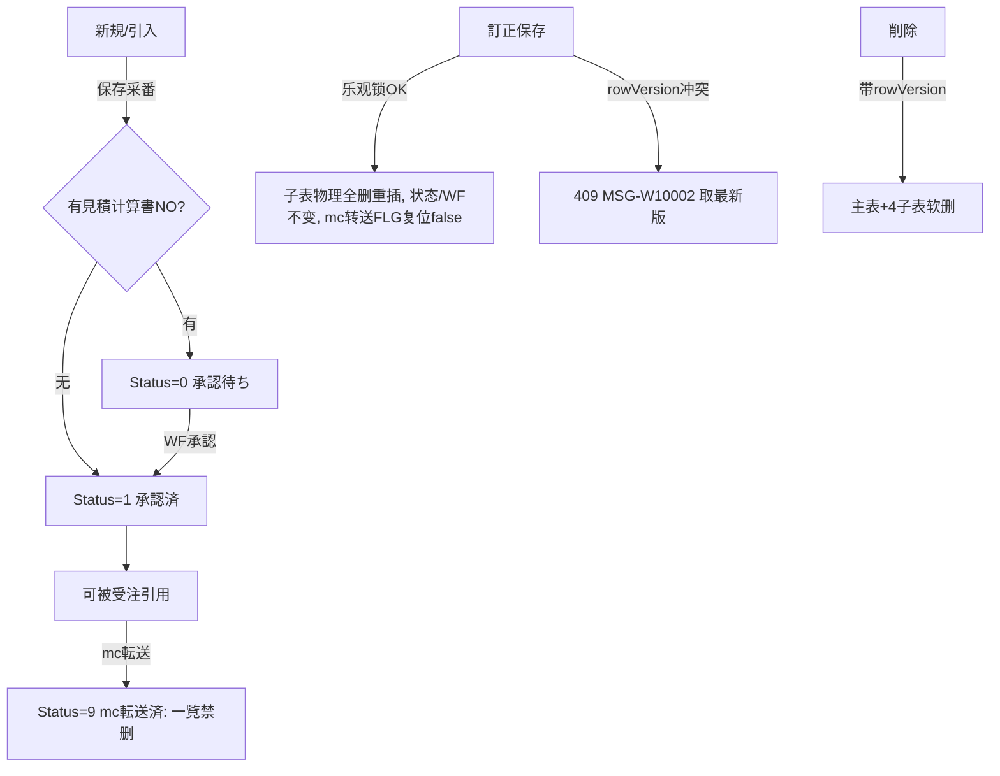

# 製品マスタ 单页面操作 SOP（手把手版）

> **用途**：给**业务用户照着点、培训老师照着讲、测试人员照着拆用例**的单页面手册。比模块总册更细、更口语。
> **页面**：製品マスタ（MSBBPA050 · 销售管理 MSBB · 模块总册 §5.5）　**前端**：`views/erp/ProductMasterView.vue`（独立窗口 `/product/window`，store `stores/productMaster.ts`，冲突处理 `composables/useProductConflictHandler.ts`）　**API**：`api/erp/product.ts`　**后端**：`Erp/ProductController` → `ProductService`
> **基准**：分支 `feat/wfs-inbox-core`，2026-06-28，均实测真实代码（核对 `docs/codemap-erp/04-製品マスタ-product.md`）。查不到的标 `待业务确认` / `代码未发现`。
> **样例数据**：客户 `C0001`(A社)、製品コード `PRD2026060001 0001`（保存系统采番=品目CD+行番枝番）、引入源 見積計算書 `EMC2026060001-01` / 御見積書 `QTN2026060001-01`。

---

## 1. 页面一句话说明

**製品マスタ，就是把一个产品"从客户品名、规格、工程、材料(BOM)到分量段单价"一次性建档的 5 步向导页——它一张主档可带多行部材(亲+子)、4 张子表(工程/材料/ロット単価/連産品)，能从御見積書或見積計算書直接引入部材；保存即系统采番製品コード；改用乐观锁防并发，冲突会弹"取最新版"窗。它是受注、BOM、生产、库存的产品源头主数据。**

---

## 2. 这个页面在业务流程中的位置

```
上游(引入源)                     本页面(5 步向导)                          下游(被谁引用)
──────────────         ──────────────────────────────────         ────────────────
御見積書(束ね确定)  ──引入──→  製品マスタ MSBBPA050                       受注入力(选製品建单)
見積計算書(算价)    ──引入──→   ①部材一覧 ②基本情報 ③工程情報            BOM/MRP(用量·工程)
                              ④材料設定(BOM) ⑤ロット別単価               WMS 库存(製品コード)
                              連産品(工程内popup·比率合计1.0)            生产(工程/标准工时)
                              采番 PRD · WF承認 · 乐观锁
```

- **上游**：可从【御見積書】(by-quotation) 或【見積計算書】(by-estimate-calc) **引入部材一覧**，省去重输。
- **本页面**：5 步向导建/改一个产品主档(一张主表+多行部材+4子表)，保存采番製品コード；按是否带見積計算書NO 走 WF 承認。
- **下游**：受注入力按製品コード建单；工程/材料(BOM)供 MES 生产与 MRP 用量；ロット別単価供算价/报价；製品コード贯穿 WMS 库存。
- **关键认知**：① **5 步一次提交**——5 页数据在前端 store 里攒齐，保存时打成一个 DTO；② **更新和删除的子表处理不同**：訂正保存=子表**物理全删再重插**；削除=子表**软删**(都不可逆地影响子表，但机制不同)；③ **乐观锁**冲突会弹专属窗"取最新版→重存"；④ **mc転送済/被引用**的製品在一覧不让删(本编辑页删除带 rowVersion)；⑤ 本页**不直接触发 MES/WMS/Bridge**(那是受注)。

---

## 3. 谁使用这个页面

| 角色 | 使用目的 | 常用操作 | 权限要求 | 注意事项 |
|---|---|---|---|---|
| 销售/营业担当 | 报价确定后建产品档 | 引入→5步→保存 | 编辑权限(`[Authorize]`，细粒度`待业务确认`) | 部材一覧不能空 |
| 技术/工务 | 维护工程/材料BOM | 工程情報/材料設定 | 编辑权限 | 連産品比率合计1.0 |
| 价格管理 | 维护分量段单价 | ロット別単価 | 编辑权限 | 数量须升序 |
| 主数据管理员 | 审/改/删产品档 | 訂正/削除/承認 | 删除/承認权限`待确认` | mc転送済禁删 |
| 测试/UAT | 验5步/子表/乐观锁 | 全流程 | 登录 | 必填/比率/升序 |

> 📌 **权限现状**：`ProductController` 标 `[Authorize]`；承認(WF)/删除的细粒度操作点授权 `待业务确认`。

---

## 4. 操作前准备（不准备好，下面会卡住）

| 准备项 | 为什么需要 | 不满足会怎样 | 去哪里维护/确认 | 测试关注点 |
|---|---|---|---|---|
| 客户(取引先)已建 | 基本情報顧客必填 | 填不出客户 | 取引先マスタ | 必填 |
| (可选)有御見積/見積计算書可引入 | 一键带出部材一覧 | 只能手输部材 | 御見積一覧/見積計算一覧 | 引入 |
| 工程/材料/原紙/印刷 码表齐 | 工程·材料行下拉来源 | 选不出 | 通用码表 | 主数据 |
| 連産品比率心里有数 | 比率合计须=1.0 | 校验拦截 | 工艺确认 | 比率1.0 |
| ロット数量段规划好 | 须升序 | 校验拦截 | 价格策略 | 升序 |
| 改/删/看前先有製品コード | 这些操作针对已存档 | 提示先读込 | 先建保存或读込 | 无cd |
| mc転送/被引用情况清楚 | 删除会被拦 | 一覧禁删 | 看 mc転送FLG | 删除拦截 |

---

## 5. 页面区域说明

| 区域 | 页面位置 | 用户要做什么 | 注意事项 |
|---|---|---|---|
| 操作种别条 | 顶部 | 看/切 新規/訂正/流用/照会/削除 + 製品コード + 状态 | 无cd时多数禁用 |
| 步骤条 | 操作条下 | 看当前在第几步(5步) | 可前后跳步 |
| Step① 部材一覧 | 步骤内容 | 维护亲+子部材行、引入、看各部材状态 | 不能空(E10007) |
| Step② 基本情報 | 步骤内容 | 70+字段：客户/品名/規格/材質印刷/尺寸/分类/单位等 | customerCd/品名1/setRatio必填 |
| Step③ 工程情報 | 步骤内容 | 工程行(仕様/工时/製造順)+連産品popup | 連産品比率合计1.0 |
| Step④ 材料設定 | 步骤内容 | 材料BOM行(工程/材料/类型) | 三字段必填 |
| Step⑤ ロット別単価 | 步骤内容 | 分量段当前/新单价 | 数量升序 |
| 底部按钮条 | 页面底 | 上/下一步、保存、削除、复制、关闭 | 按操作种别显隐 |
| 乐观锁冲突弹窗 | 保存/删除冲突时 | "取最新版"→重读 | 见§8场景七 |

---

## 6. 字段填写说明（口语版）

### 6.1 操作种别（5 种）

| 操作种别 | 值 | 用途 | 关键 |
|---|---|---|---|
| 新規 New | 10 | 建新产品 | 全可编辑、保存采番 |
| 訂正 Edit | 20 | 改已存 | 主键只读；子表全删全插；乐观锁 |
| 流用 Copy | 50 | 复制建新 | 部材>100拒(E10107)、状态清零、裁1行亲 |
| 照会 View | 40 | 只读查看 | 全只读 |
| 削除 Delete | 30 | 软删 | 带rowVersion；mc転送済一覧禁删 |

### 6.2 Step① 部材一覧（一行=一个部材：亲或子）

| 字段 | 含义 | 怎么用 | 注意 |
|---|---|---|---|
| 行No `rowNo` | 部材行号 | 行1=亲(ParentChildDiv=0)，行2+=子(=1) | 行1为主档 |
| 製品コード `productCd` | 该部材编码 | 保存后采番回填 | 品目CD+行番 |
| 見積計算書No/御見積書No | 引入来源 | 引入时带入；**有見積计算書NO→走WF承認(Status=0)** | 决定承認路径 |
| 親/子/材質案件No | 案件号 | 引入/手填 | — |
| 顧客品名1/2 | 客户称呼 | 引入/手填 | — |
| 状态 `status` | 0未作成/1承認待ち/9承認済or mc転送済 | 只读 | 见§9 |
| 引入按钮 | 从御見積/見積计算書引入 | 一键带出部材一覧 | 主链②③④接力 |

> 📌 **部材一覧不能空**(E10007)；新建时若空，后端默认补 1 行亲部材。

### 6.3 Step② 基本情報（70+ 字段，关键必填）

| 字段(label) | 字段名 | 必填 | 怎么填 | 填错影响 |
|---|---|---|---|---|
| 顧客コード | `customerCd` | 是 | 输客户 | 归属错 |
| 顧客品名1 | `customerItemName1` | 是 | 客户称呼品名 | 对客名缺 |
| セット比率 | `setRatio` | 是(>0) | 套件构成比率 | ≤0被拦 |
| セット製品CD/名 | `setProductCd/Name` | 否 | 套件主品 | — |
| 親子区分 | `parentChildDiv` | 否(自动) | 0亲/1子 | — |
| 規格类: 材質印刷尺寸 | sheetFlute/paperCdF·C·B/printCd*/emboss*/maker*/blade*/sheetDim* | 否 | 纸器規格 | 工程/算料 |
| 戦略商品区分1~10 | `strategicDivs[10]` | 否 | 勾选 | 标签 |
| FSC/环保用量 | fscProductDiv/各usageG | 否 | 环保 | 合规 |
| 分类大中小 | productCatBig/Mid/Sml | 否 | 分类 | — |
| 数量単位/単価単位 | qtyUnit/unitPriceUnit | 否 | 单位 | **受注後不可改(isReadOnlyByOrder)** |
| 運賃請求/出荷/サンプル等 | freightBilling/fixedShipment/salesSample | 否 | 物流销售属性 | — |
| 各类備考 | printNote/mfgNote/slipNote/deliveryNote/shipNote1·2 | 否 | 备注 | — |

> ⚠️ **受注後锁定**：数量単位/単価単位 当该製品已被受注引用后，由服务端判定 `isReadOnlyByOrder=true` 锁住不可改。

### 6.4 Step③ 工程情報 + 連産品（popup）

| 元素 | 含义 | 怎么用 | 注意 |
|---|---|---|---|
| 工程行 | 一行=一道工程 | 工程CD/作業/機械or外注/工程仕様01~10 | 空→W20011(confirm可续) |
| A2 标准工时 | `setupHour`段取/`cycleTime`单件/`standardCrewSize`人数 | 供成本/CRP | 人数空按1 |
| 製造順優先1~8 | `manufOrderPrios[8]` | 排产优先 | — |
| 版No/消耗品/購入価/ロス率/リードタイム | 工程辅助 | — | — |
| 連産品(popup) | 工程内一料多产(トムソン 0600/0601/0602) | 填連産品名/`qtyRatio`比率/`nextProcessCd`次工程 | **比率合计须=1.0(±0.0001)** |

> 📌 **連産品**：同一道工程(如トムソン裁切)一次产出多个产品，按 `qtyRatio` 比率把产出/成本分摊；所有連産品比率合计必须 = 1.0。

### 6.5 Step④ 材料設定（BOM）

| 字段 | 含义 | 必填 | 注意 |
|---|---|---|---|
| 工程CD `processCd` | 该材料用于哪道工程 | 是 | — |
| 材料CD `materialCd` | 材料编码 | 是 | — |
| 材料类型 `materialTypeDiv` | 1仕掛/2連産/3原料/4印刷原紙 | 是 | 分类 |
| 支給区分/支給単価 | supplyDiv/supplyPrice | 否 | 客供料 |

> 📌 **缺口**：材料行的 MRP 用量字段(UsageType/UnitUsage/UsageUnit) **本页(PA050)未提供输入**，应由 MRP/P1 侧维护 → `代码未发现`(本页通道)。

### 6.6 Step⑤ ロット別単価

| 字段 | 含义 | 注意 |
|---|---|---|
| 数量 `lotQty` | 分量段数量 | **须升序** |
| 現/新 セット·単価·枝価 | current/new SetPrice/UnitPrice/BranchPrice | 改定用 |
| 現/新 適用日 | 各 PriceDate/BranchDate | 价格生效日 |
| 購入価/価格適用基準 | purchasePrice/priceApplyBasis | — |

> 📌 ロット別単価为空 → W20016(confirm 可续)。

---

## 7. 按钮操作说明

| 按钮 | 何时点 | 系统做什么 | 成功后 | 失败处理 | 测试关注点 |
|---|---|---|---|---|---|
| 読込 | 非新規输cd后 | 按製品コード拉主档+4子表 | 5步载入 | 查无→404；只读模式可带includeDeleted | 加载/404 |
| 引入(御見積/見積计算書) | Step① | 调by-quotation/by-estimate-calc转部材一覧 | 部材行带出 | — | 引入 |
| 上/下一步 | 各步 | 切步(可跳步)，保存前统一校验 | 切步 | — | 跳步 |
| 保存 | New/Edit/Copy | 跑全校验→New/Copy create采番、Edit update(乐观锁+子表全删全插) | 采番cd、转訂正、通知父列表 | 校验失败→提示；409→冲突窗 | 采番/乐观锁 |
| 削除 | Delete态 | 带rowVersion软删主表+4子表软删 | 提示成功 | mc転送(一覧)拦；409→冲突窗 | 软删/锁定 |
| 流用(复制) | 列表/切流用 | copy源(部材>100拒E10107)、状态清零 | 载入副本、转訂正 | E10107 | 复制上限 |
| 仕掛チェック | (辅助) | check-wip(mc無→Level0) | 结果level | — | wip |
| CSV出力 | 列表(MSBBPA060) | export.csv全量(BOM+UTF8) | 下载 | — | CSV |
| 关闭/戻る | 任意 | 独立窗关窗；普通返回 | 返回 | — | — |

> ⚠️ **更新 vs 删除子表**：訂正保存时 4 子表**物理全删再重插**(RemoveRange→重新Add)；削除时 4 子表**软删**(IsDeleted=true)。两者不同，勿混。
> ⚠️ **乐观锁**：訂正/削除回送 rowVersion；后端 `UPDATE...WHERE RowVersion=@original` 命中 0 行→409 `MSG-W10002`→前端弹"取最新版"。

---

## 8. 标准业务操作 SOP（照着点）

### 场景一：从御見積書引入部材一覧并建产品档（主流程）
- **业务背景**：报价确定后，要把这单产品建成正式製品マスタ。
- **使用样例数据**：御見積 QTN2026060001-01、客户 C0001。
- **前置条件**：① 登录有编辑权限；② 有确定的御見積；③ 客户/码表齐。
- **详细操作步骤**：
  1. 从【御見積一覧】点"製品マスタ作成"打开本页(独立窗口，URL 带 quotationNo)，或本页 Step① 点【引入·御見積書】。
  2. **Step① 部材一覧**：系统把御見積明细转成部材行(行1亲+子部材)。
  3. **Step② 基本情報**：填顧客コード C0001、顧客品名1、セット比率(>0)及規格/分类/单位等。
  4. **Step③ 工程情報**：加工程行、填工程仕様/标准工时；如有連産品打开 popup 填名+比率(合计1.0)。
  5. **Step④ 材料設定**：加材料BOM行(工程CD/材料CD/材料类型必填)。
  6. **Step⑤ ロット別単価**：填分量段(数量升序)与单价。
  7. 点【保存】→ 跑全校验→采番製品コード、转訂正、通知父列表。
- **完成后检查**：① 得到製品コード；② 5 子表落库；③ 一覧能查到；④ 带見積计算書NO 的状态=待WF承認(0)。
- **异常处理**：部材空→E10007(error)；工程空→W20011(可续)；ロット空→W20016(可续)；比率≠1.0/数量非升序→校验拦截。
- **可拆测试用例**：TC-M04-PRD-001~010、020。

### 场景二：手工新建产品档（不引入）
- **业务背景**：内部产品，不走報价直接建档。
- **使用样例数据**：客户 C0001、新建空白。
- **前置条件**：登录、客户已建。
- **详细操作步骤**：
  1. 打开本页(op=new)，操作种别"新規"。
  2. Step① 手工加部材行(至少 1 行亲)。
  3. Step②~⑤ 逐步填(同场景一)。
  4. 【保存】。
- **完成后检查**：① 采番；② **无見積计算書NO → 状态=1 承認済**(直接生效，不走WF)。
- **异常处理**：部材空→E10007。
- **可拆测试用例**：TC-M04-PRD-011/012/021。

### 场景三：訂正已存产品（子表全删全插 + 乐观锁）
- **业务背景**：工程/材料/单价要调整。
- **使用样例数据**：製品 PRD2026060001 0001。
- **前置条件**：产品存在、有编辑权限。
- **详细操作步骤**：
  1. 操作种别【訂正】，输製品コード【読込】。
  2. 改 Step③ 工程/Step④ 材料/Step⑤ 单价。
  3. 【保存】→ 后端校验 rowVersion→子表物理全删再重插。
- **完成后检查**：① 改动落库；② 子表为重建后的最新集；③ rowVersion 前进；④ 状态/WF承認不变、mc転送FLG复位。
- **异常处理**：他人已改→409 弹"取最新版"(见场景七)。
- **可拆测试用例**：TC-M04-PRD-013/014/022/023。

### 场景四：照会查看 / 連産品比率校验体验
- **业务背景**：复核工程連産品比率。
- **使用样例数据**：含連産品工程的产品。
- **前置条件**：产品存在。
- **详细操作步骤**：
  1. 【照会】读込→全只读浏览 5 步。
  2. 切【訂正】，Step③ 打开連産品 popup，故意把比率合计改成 ≠1.0。
  3. 保存→校验拦截提示比率须合计 1.0。
- **完成后检查**：① 照会全只读；② 比率≠1.0 被拦。
- **异常处理**：修正比率至 1.0 再存。
- **可拆测试用例**：TC-M04-PRD-024/025。

### 场景五：流用(复制)建相似产品
- **业务背景**：照搬相似产品改尺寸建新档。
- **使用样例数据**：源 PRD2026060001 0001。
- **前置条件**：有源产品、部材≤100。
- **详细操作步骤**：
  1. 操作种别【流用】(或列表コピー)。
  2. 系统复制源(裁为1行亲、状态清零、清PK/rowVersion)、转訂正。
  3. 改要变的→【保存】得新製品コード。
- **完成后检查**：① 新cd；② 状态=0/未承認重置；③ 源不变。
- **异常处理**：部材>100→E10107(一次最多复制100件部材)。
- **可拆测试用例**：TC-M04-PRD-015/016。

### 场景六：删除产品（软删）与 mc転送拦截
- **业务背景**：作废一个未被引用的产品。
- **使用样例数据**：未mc転送 PRD...。
- **前置条件**：产品存在、未mc転送/未被引用。
- **详细操作步骤**：
  1. 操作种别【削除】读込→点【削除】(带rowVersion)。
  2. 系统软删主表 + 4 子表软删。
  3. (对比)在【製品マスタ一覧】对 mc転送済的产品点删除→被前置拦截。
- **完成后检查**：① 一覧默认查不到(软删)；② mc転送済删除被拦。
- **异常处理**：409→冲突窗；被引用的处理`待业务确认`。
- **可拆测试用例**：TC-M04-PRD-017/018/026。

### 场景七：保存遇乐观锁冲突（取最新版）
- **业务背景**：两人同改同一产品。
- **使用样例数据**：PRD...，两端打开。
- **前置条件**：两端都在訂正。
- **详细操作步骤**：
  1. A、B 都读込同一製品コード。
  2. A 先改并保存(rowVersion 前进)。
  3. B 改并保存→ 409，弹专属窗"[MSG-W10002] 排他制御エラー…他のユーザーが先に更新…"。
  4. B 点【最新版を取得】→ 系统重读拉回最新数据+rowVersion，提示"再保存一次"。
  5. B 重做改动再保存成功。
- **完成后检查**：① B 收到冲突弹窗非静默覆盖；② 取最新版后基于最新再存。
- **异常处理**：B 点取消则放弃本次。
- **可拆测试用例**：TC-M04-PRD-023/027。

---

## 9. 状态变化说明

> **主档** `status`(ProductDto.status)：`0 承認待ち / 1 承認済 / 9 mc転送済`，由建档来源驱动并配合 WF 承認；删除走软删。
> ⚠️ 注意：**部材行** `status`(Step① ProductMemberDto.status)编码不同=`0 未作成 / 1 承認待ち / 9 承認済or mc転送済`（§6.2 描述的是部材行）。两个 status 别混。

| 主档状态 | 用户看到 | 含义 | 怎么来的 | 下一步 |
|---|---|---|---|---|
| 0 承認待ち | 灰 | 带見積计算書NO建档，等WF承認 | 创建时有 EstimateCalcNo(WfApprovalFlg=false) | WF承認→1 |
| 1 承認済 | 绿 | 无見積计算書NO直接承認 / 或WF承認完 | 创建无 EstimateCalcNo(=true)，或0经WF承認 | 可被受注引用 |
| 9 mc転送済 | — | 已 mc 転送(对接旧mcframe) | mc転送动作 | **一覧禁删** |
| (软删) | — | IsDeleted=1(主表+子表) | 削除 | — |



---

## 10. 按钮不可用 / 灰色 / 不出现原因

| 按钮/字段 | 何时不可用/不出现 | 为什么 | 怎么处理 | 测试关注点 |
|---|---|---|---|---|
| 訂正/流用/照会/削除 | 无製品コード | 针对已存档 | 先新規保存或读込 | 无cd |
| 主键字段(訂正) | 訂正态 | 主键只读 | 用流用建新 | 主键锁 |
| 所有字段(照会/削除) | 只读态 | 保护 | 切訂正 | 只读 |
| 数量単位/単価単位 | 製品已被受注引用 | isReadOnlyByOrder | 不可改(业务铁律) | 受注後锁 |
| 保存 | 照会/削除态 | 只读无保存 | 切編集/新規 | 显隐 |
| 削除(一覧) | mc転送済 | 已転送禁删 | 先处理转送 | 删除拦截 |
| 連産品比率保存 | 合计≠1.0 | 比率校验 | 调到合计1.0 | 比率 |
| ロット保存 | 数量非升序 | 升序校验 | 排升序 | 升序 |
| 复制 | 部材>100 | E10107上限 | 减部材 | 上限 |

---

## 11. 常见错误与处理

| 错误/提示 | 可能原因 | 用户处理方法 | 是否需要管理员 | 测试关注点 |
|---|---|---|---|---|
| E10007 部材一覧空 | 没有部材行 | 加≥1行亲部材 | 否 | 必填 |
| W20011 工程为空 | 没填工程 | 确认后可续/补工程 | 否 | 警告续 |
| W20016 ロット別单价空 | 没填单价段 | 确认后可续/补单价 | 否 | 警告续 |
| 顧客/品名1/比率必填 | 基本情報缺 | 补必填(比率>0) | 否 | 必填 |
| 連産品比率≠1.0 | 比率合计不对 | 调到合计1.0(±0.0001) | 否 | 比率 |
| 材料行三字段缺 | 工程/材料/类型未填 | 补齐 | 否 | BOM必填 |
| ロット数量非升序 | 段数量乱序 | 改升序 | 否 | 升序 |
| MSG-W10002 冲突(409) | 他人已改(rowVersion) | 弹窗取最新版重存 | 否 | 乐观锁 |
| E10107 复制部材>100 | 一次复制太多 | 减到≤100 | 否 | 上限 |
| 404 製品マスタ未登録 | 读込cd不存在 | 核对製品コード | 否 | 404 |
| mc転送済不能删 | mcTransferFlg=true(已转送) | 先处理转送(`待业务确认`) | 是 | 删除拦截 |
| 删了被受注/BOM引用的产品 | **本页删除仅 mc転送 拦截，見積/受注/BOM/库存参照检查未实装(代码未发现)** | 删前人工确认未被引用 | 是(业务) | 参照拦截缺口 |
| 数量単位改不了 | 受注後锁定 | 业务铁律不可改 | 是(业务) | 受注後锁 |
| 权限不足 | 无编辑/承認/删除权 | 申请权限 | 是 | 权限`待确认` |

---

## 12. 操作完成后的检查清单

| 操作 | 当前页面检查 | 製品マスタ一覧检查 | 下游(受注/BOM/库存)检查 | 数据状态 | 测试关注点 |
|---|---|---|---|---|---|
| 引入建档 | 部材一覧带出、5步可填 | — | — | 来源NO记录 | 引入 |
| 保存(有見積计算書NO) | 采番cd、状态待WF | 列表出现、状态0 | — | Status=0,WfApprovalFlg=false | WF |
| 保存(无見積计算書NO) | 采番cd、状态承認済 | 列表出现、状态1 | 可被受注选 | Status=1 | 自动承認 |
| 訂正保存 | 改动落、rowVersion前进 | 列表反映 | BOM/工程更新 | 子表物理重建 | 全删全插 |
| 流用 | 新cd、状态清零 | 新档入列表 | — | 源不变 | 复制 |
| 削除 | reset | 默认查不到 | 引用方需注意 | 主+子软删 | 软删 |

> 📌 本页**不触发** MES/WMS/Bridge——无需到注文追溯/工单/出库验证。

---

## 13. 页面级测试用例（≥25 条，可执行）

> 编号 `TC-M04-PRD-xxx`；数据用样例。测试人员补"实际结果/是否通过/缺陷编号"。

| 用例编号 | 用例名称 | 优先级 | 前置条件 | 测试数据 | 操作步骤 | 预期结果 | 备注 |
|---|---|---|---|---|---|---|---|
| TC-M04-PRD-001 | 页面打开默认新規 | P1 | 有权限 | op=new | 打开 | 新規态、Step①、cd空 | — |
| TC-M04-PRD-002 | 御見積引入部材 | P0 | 有御見積 | QTN..01 | 引入御見積 | 部材一覧带出 | 引入 |
| TC-M04-PRD-003 | 見積计算書引入 | P1 | 有見積 | EMC..01 | 引入見積 | 部材带出 | 引入 |
| TC-M04-PRD-004 | 部材空拦截 | P0 | — | 清空部材 | 保存 | E10007 error | 必填 |
| TC-M04-PRD-005 | 基本情報必填 | P0 | — | 缺顧客 | 保存 | 提示必填 | 必填 |
| TC-M04-PRD-006 | setRatio>0 | P1 | — | setRatio=0 | 保存 | 拦截 | 必填 |
| TC-M04-PRD-007 | 工程空警告续 | P1 | — | 无工程 | 保存 | W20011 confirm后续 | 警告 |
| TC-M04-PRD-008 | 连产品比率1.0 | P0 | 有連産品 | 比率合计≠1 | 保存 | 拦截须=1.0 | 比率 |
| TC-M04-PRD-009 | 材料三字段必填 | P1 | 有材料行 | 缺材料类型 | 保存 | 拦截 | BOM |
| TC-M04-PRD-010 | ロット升序 | P1 | 有ロット | 数量乱序 | 保存 | 拦截须升序 | 升序 |
| TC-M04-PRD-011 | 手工新建保存 | P0 | 客户齐 | 手填5步 | 保存 | 采番、状态1承認済 | 自动承認 |
| TC-M04-PRD-012 | 带見積NO状态0 | P0 | 引入見積 | EMC..01 | 保存 | Status=0待WF | WF |
| TC-M04-PRD-013 | 訂正读取主键锁 | P0 | 有档 | PRD.. | 訂正读込 | 主键只读 | 编辑 |
| TC-M04-PRD-014 | 訂正子表全删全插 | P0 | 有子表 | 改工程 | 保存 | 子表重建为最新集 | 全删全插 |
| TC-M04-PRD-015 | 流用复制 | P1 | 有源 | PRD.. | 流用 | 裁1行亲、状态清零、转訂正 | 复制 |
| TC-M04-PRD-016 | 复制部材>100 | P2 | 源部材多 | >100 | 流用 | E10107拒 | 上限 |
| TC-M04-PRD-017 | 编辑器删除软删 | P0 | 有档 | PRD.. | 削除 | 主+子软删 | 软删 |
| TC-M04-PRD-018 | mc転送済禁删 | P0 | mc転送済 | PRD.. | 一覧删除 | 前置拦截 | 删除拦截 |
| TC-M04-PRD-019 | 受注後单位锁 | P1 | 已被受注 | — | 改数量单位 | isReadOnlyByOrder禁改 | 受注後锁 |
| TC-M04-PRD-020 | 5步跳步 | P2 | — | — | 直接跳Step3 | 可跳、保存时统一校验 | 跳步 |
| TC-M04-PRD-021 | 照会只读 | P1 | 有档 | PRD.. | 照会读込 | 全只读无保存 | 只读 |
| TC-M04-PRD-022 | 采番格式 | P1 | 保存 | — | 看cd | 品目CD+行番枝番 | 采番 |
| TC-M04-PRD-023 | 乐观锁冲突弹窗 | P0 | 两端同档 | PRD.. | A存→B存 | B弹MSG-W10002取最新版 | 乐观锁 |
| TC-M04-PRD-024 | 取最新版恢复 | P1 | 冲突中 | — | 点取最新版 | 重读最新rowVersion | 恢复 |
| TC-M04-PRD-025 | 連産品popup | P1 | Step3 | — | 开連産品popup | 填名/比率/次工程 | 連産品 |
| TC-M04-PRD-026 | 仕掛チェック | P2 | — | PRD.. | check-wip | mc無→Level0 | wip |
| TC-M04-PRD-027 | 404读込不存在 | P2 | — | 错cd | 读込 | 404製品マスタ未登録 | 404 |
| TC-M04-PRD-028 | 独立窗口op驱动 | P2 | popup | ?op=edit&cd=.. | 打开 | 载入对应操作 | popup |
| TC-M04-PRD-029 | 保存通知父列表 | P2 | popup | — | 保存 | postMessage刷新列表 | popup |
| TC-M04-PRD-030 | 不触发下游 | P1 | 保存后 | — | 查注文追溯 | 无MES/WMS/Bridge | 边界 |
| TC-M04-PRD-031 | 移动端5步 | P3 | 移动端 | — | 窄屏走流程 | sticky底部、步骤可用 | 响应式 |
| TC-M04-PRD-032 | MRP用量字段缺 | P3 | — | — | 找用量输入 | 本页无(代码未发现) | 缺口 |
| TC-M04-PRD-033 | 网络异常 | P2 | 断网 | — | 保存 | 友好错误可重试 | 异常 |

---

## 14. 培训讲解建议

| 讲解顺序 | 讲什么 | 演示动作 | 用户容易误解的点 |
|---|---|---|---|
| 1 | 这页是产品建档源头(5步向导) | 展示 §2 流程图 | 以为只是登记 |
| 2 | 部材一覧=亲+子，可引入 | 引入御見積看带出 | 部材空就保存 |
| 3 | 5步一次提交 | 走5步保存 | 以为每步单独存 |
| 4 | 連産品比率合计1.0 | popup填比率 | 比率不凑1.0 |
| 5 | 材料BOM三必填 | 填材料行 | 漏材料类型 |
| 6 | 訂正子表全删全插/删除软删 | 演示两种 | 混淆两种删 |
| 7 | 乐观锁取最新版 | 制造409演示 | 静默覆盖误解 |
| 8 | WF承認(有見積NO才走) | 对比状态0/1 | 以为都要审 |
| 9 | mc転送済/受注後锁 | 演示禁删/锁单位 | 想强删强改 |

---

## 15. 与模块级手册的关系

本单页 SOP 对应模块总册 `docs/manuals/user-training/01-销售管理MSBB-最详细用户操作培训手册.md`：

| 本SOP章节 | 对应总册章节 |
|---|---|
| §1/§2 定位与5步流程 | 总册 §3、§5.5.1 |
| §4 操作前准备 | 总册 §5.5.1a |
| §6 字段(5步/4子表) | 总册 §5.5.1b + §5.5.5/5.5.6 |
| §7 按钮 | 总册 §5.5.9 |
| §8 SOP | 总册 §5.5.1e |
| §9 状态(WF/软删) | 总册 §5.5.10 |
| §10 灰按钮 | 总册 §5.5.1c |
| §12 完成后检查 | 总册 §5.5.1d |
| §13 测试用例 | 总册 §7.1 |
| §14 培训讲解 | 总册 §13 |

> 配套：上游 `01-03-御見積書`/`01-01-見積計算書`(引入源)、入口 `01-06-製品マスタ一覧`(CSV/mc転送删除拦截)。

---

## 16. 代码与文档来源

| 类型 | 路径 | 用途 |
|---|---|---|
| 前端编辑器(5步壳) | `cp6.web/src/views/erp/ProductMasterView.vue` | 5步向导/操作矩阵/保存/删除/校验 |
| 5步子组件 | `cp6.web/src/views/erp/product/Step1TargetSelect/Step2BasicInfo/Step3ProcessInfo/Step4MaterialSetting/Step5LotPriceOther.vue` | 各步表单+连产品popup |
| 列表 | `cp6.web/src/views/erp/ProductMasterListView.vue` | 检索/CSV/mc転送删除拦截 |
| Store | `cp6.web/src/stores/productMaster.ts` | 5页state/buildDto/loadFromDto/rowVersion |
| 冲突处理 | `cp6.web/src/composables/useProductConflictHandler.ts` | 409乐观锁弹窗"取最新版" |
| API | `cp6.web/src/api/erp/product.ts` | getList/getByCd/create/update/remove/copy/next-seq/by-quotation/by-estimate-calc/check-wip/export |
| 类型 | `cp6.web/src/types/erp/productMaster.ts` | ProductDto+5子表DTO+OperationType+WipCheck |
| 路由 | `cp6.web/src/router/index.ts`(`/product`、`/product/window`) | 主页/独立窗口 |
| 后端 Controller | `CP6.WebApi/Controllers/Erp/ProductController.cs`(GetList/Get/Create/Update(409)/Delete/Copy/next-seq/by-*/check-wip/export) | 端点；404/MSG-W10002 |
| Service | `CP6.Core/Services/Erp/ProductService.cs`(CreateAsync采番/UpdateAsync乐观锁+ReplaceChildren物理删/DeleteAsync软删/CopyAsync E10107) | 全逻辑 |
| 实体-主表 | `CP6.Entity/DomainModels/Erp/ProductMaster.cs`(製品コード=品目CD+枝番;Status/WfApprovalFlg/McTransferFlg) | 主+导航 |
| 实体-4子表 | `ProductProcess.cs`/`ProductMaterial.cs`(materialTypeDiv)/`ProductLotPrice.cs`/`ProductCoProduct.cs`(連産品) | 工程/材料/单价/連産品 |
| 采番 | `CP6.Core/Services/Common/DocNumber.cs`(`NextAsync(db,"PRD")`) | 製品コード |
| DTO | `CP6.Entity/DTOs/Erp/ProductDto.cs` | 主+5子表 |
| 模块总册 | `docs/manuals/user-training/01-销售管理MSBB-最详细用户操作培训手册.md` | 上级手册 §5.5 |
| 逐行源码手册 | `docs/codemap-erp/04-製品マスタ-product.md` | 代码级实现(5页/子表/乐观锁/采番 实证) |
| 页面盘点表 | `docs/manuals/user-training/00-用户操作手册页面盘点表.md` | 页面索引(序号5) |

---

## 最后更新来源

- 代码：见 §16（ProductMasterView/store/types/useProductConflictHandler 实测；后端以 `docs/codemap-erp/04-製品マスタ-product.md` 2026-06-22 实测为据）
- 文档：模块总册 §5.5(待补)、`docs/codemap-erp/04-製品マスタ-product.md`、页面盘点表
- 基准：分支 `feat/wfs-inbox-core`，盘点日 2026-06-28
- 诚实标注：材料行 MRP 用量字段本页通道 `代码未发现`(应MRP侧维护)；**删除仅 mc転送 拦截，見積/受注/BOM/库存参照检查未实装(`代码未发现`)**；主档status与部材行status编码不同(§9)；细粒度权限 `待业务确认`；本页不触发MES/WMS/Bridge已显式说明
</content>
