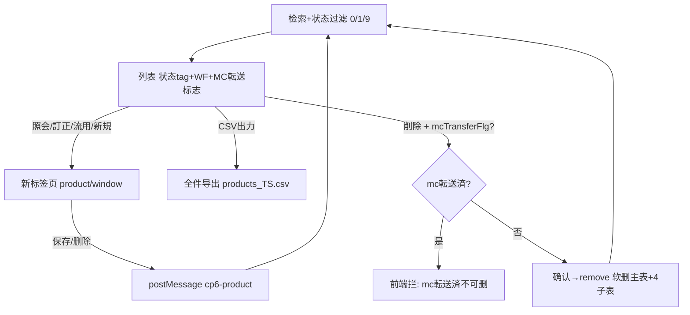

# 製品マスタ一覧 单页面操作 SOP（手把手版）

> **用途**：给**业务用户照着点、培训老师照着讲、测试人员照着拆用例**的单页面手册。比模块总册更细、更口语。
> **页面**：製品マスタ一覧（MSBBPA060 · 製品マスタ MSBBPA050 的检索台账 · 销售管理 MSBB · 模块总册 §5.6）　**前端**：`views/erp/ProductMasterListView.vue`　**API**：`api/erp/product.ts`(`getList`/`exportCsv`/`remove`)　**后端**：`Erp/ProductController.GetList`/`ExportCsv`/`Delete`
> **基准**：分支 `feat/wfs-inbox-core`，2026-06-28，均实测真实代码（核对 `docs/codemap-erp/04-製品マスタ-product.md`）。查不到的标 `待业务确认` / `代码未发现`。
> **样例数据**：製品コード `PRD2026060001 0001`、セット製品CD、客户 `C0001`(A社)、見積計算書 `EMC2026060001-01` / 御見積書 `QTN2026060001-01`。

---

## 1. 页面一句话说明

**製品マスタ一覧，就是销售/主数据管理员用来"找产品档、看承認/WF/mc転送状态、导出 CSV、再打开去改/复制/删"的台账页——它支持多条件(製品CD区间/セット/客户/案件/見積/品名/設計提案/更新日)+状态多选检索；行操作用**新页签**打开製品マスタ；可一键**CSV全件导出**；删除是论理删除，**mc転送済的产品不让删**(前端就拦)。**

---

## 2. 这个页面在业务流程中的位置

```
上游(产品档)               本页面(检索台账+CSV)                   下游(新页签/动作)
──────────────       ──────────────────────────────       ────────────────────────
製品マスタ(建/改/WF承認) ──→ 製品マスタ一覧 MSBBPA060            照会/訂正/流用/新規 → 製品マスタ编辑页
                            检索+状态过滤+WF/MC転送标志           CSV出力 → products_TS.csv(全件)
                            行操作/CSV/软删                       削除 → 论理删除(mc転送済拦截)
                                                                 └ 存/删后 postMessage 回刷列表
```

- **上游**：【製品マスタ】建/改/WF承認后的記録。
- **本页面**：多条件+状态检索，看承認状态/WF标志/mc転送标志/更新日；行操作开新页签编辑；可 CSV 全件导出。
- **下游**：① 照会/訂正/流用/新規 都在新标签页打开製品マスタ(5步向导，见 01-05)；② CSV 导出全件给外部；③ 删除=论理删除。
- **关键认知**：① 行操作开**新标签页**(window.open `/product/window`)；② **CSV 出力是全件**(忽略分页，按当前检索条件)；③ **mc転送済产品前端就拦着不让删**(提示"mc転送済の製品は削除できません")；④ 删除=**软删**不可复旧；⑤ 列表的"状态"标签语义见 §9 注意(与编辑器 create 逻辑存在不一致，已标注)。

---

## 3. 谁使用这个页面

| 角色 | 使用目的 | 常用操作 | 权限要求 | 注意事项 |
|---|---|---|---|---|
| 销售/营业担当 | 找产品、改/复制 | 检索、訂正、流用 | 见積/产品查看·编辑(`[Authorize]`，细粒度`待业务确认`) | 改在新页签 |
| 主数据管理员 | 维护/删/导出产品档 | 検索、削除、CSV | 删除/导出权限 | mc転送済禁删 |
| 生产/工务 | 查产品工程/BOM(只读) | 照会 | 查看 | 进编辑页看 |
| 采购/库存 | 按製品コード对照 | 检索 | 查看 | — |
| 测试/UAT | 验检索/CSV/删除拦截 | 全流程 | 登录 | mc転送删除拦截 |

> 📌 **权限现状**：`ProductController` 标 `[Authorize]`；编辑/导出/删除细粒度授权 `待业务确认`。

---

## 4. 操作前准备（不准备好，下面会卡住）

| 准备项 | 为什么需要 | 不满足会怎样 | 去哪里维护/确认 | 测试关注点 |
|---|---|---|---|---|
| 系统已有製品マスタ | 列表才有内容 | 查询空 | 先建製品マスタ | 空结果 |
| 浏览器允许新标签页 | 行操作开新页签 | 提示被拦截 | 浏览器设置 | 拦截 |
| 浏览器允许下载 | CSV 导出 | 导不出 | 浏览器设置 | 导出 |
| 知道 mc転送済不能删 | 误删已转送档 | 删被拦 | 看 MC転送 标志列 | 删除拦截 |
| 知道改在新页签 | 找不到内联编辑 | 想在本页改 | 见§7 | 跳转 |

---

## 5. 页面区域说明

| 区域 | 页面位置 | 用户要做什么 | 注意事项 |
|---|---|---|---|
| 检索区 | 顶部 | 填製品CD区间/セット/客户/案件/見積/品名/設計提案/更新日 + 勾状态 | 都非必填 |
| 状态过滤 | 检索区内(复选框) | 勾 0未承認/1承認待/9承認済・転送済 | 多选 |
| 工具按钮区 | 检索区内 | 検索 / クリア / 新規 / CSV出力 | 新規/操作开新页签 |
| 结果列表 | 中部表格 | 看产品、状态/WF/MC転送标志、排序、行操作 | 双击行=照会 |
| 行操作区 | 每行右侧(固定列) | 照会/訂正/流用/削除 | mc転送済删除被拦 |
| 分页区 | 列表下方 | 翻页/改每页 | 10/20/50/100 |

---

## 6. 字段填写说明（口语版）

### 6.1 检索条件（怎么填）

| 字段 | 字段名 | 怎么填 | 必填 | 注意 |
|---|---|---|---|---|
| 製品CD(从~至) | `productCdFrom~To` | 製品コード区间 | 否 | 区间 |
| セット製品CD | `setProductCd` | 套件主品CD | 否 | — |
| 得意先CD | `customerCd` | 客户CD | 否 | — |
| 親/子案件 | `projectNoParent/Child` | 案件号 | 否 | — |
| 御見積書NO | `quotationNo` | 御見積号 | 否 | 引入来源 |
| 計算書NO | `estimateCalcNo` | 見積计算書号 | 否 | 引入来源 |
| 顧客品名1/2 | `customerItemName1/2` | 品名 | 否 | — |
| 設計提案NO | `designProposalNo` | 设计提案号 | 否 | — |
| 更新日(范围) | `modifyDateFrom~To` | 日期区间 | 否 | from≤to |
| 状态 | `statuses[]` | 勾 0未承認/1承認待/9承認済・転送済 | 否 | 多选；不勾=全部 |

### 6.2 列表列（怎么看）

| 列 | 字段 | 含义 | 排序 |
|---|---|---|---|
| 製品コード | `productCd` | 产品编码 | 可(固定列) |
| セット製品CD/品名 | setProductCd/Name | 套件主品 | 可 |
| 得意先CD/名 | customerCd/Name | 客户 | 可 |
| 顧客品名1/2 | customerItemName1/2 | 品名 | 可 |
| 親/子案件 | projectNoParent/Child | 案件 | 可 |
| 御見積書NO/計算書NO | quotationNo/estimateCalcNo | 引入来源 | 可 |
| 状态 | `status` | 0未承認/1承認待/9承認済・転送済(tag) | 可 |
| WF | `wfApprovalFlg` | WF承認标志(绿✔/-) | 否 |
| MC転送 | `mcTransferFlg` | mc転送标志(蓝🔗/-)→**有则不可删** | 否 |
| 更新日 | `modifyDate` | 最终更新 | 可 |
| 操作 | — | 照会/訂正/流用/削除 | — |

> 本页是查询页，**无内联编辑表单**(建/改在新页签的製品マスタ 5 步向导)。

---

## 7. 按钮操作说明

| 按钮 | 何时点 | 系统做什么 | 成功后 | 失败处理 | 测试关注点 |
|---|---|---|---|---|---|
| 検索 | 设好条件 | 调 getList(剔空串+状态过滤) | 列表出结果+总数 | 0件→空 | 检索/状态 |
| クリア | 重查 | 清所有条件+状态重查 | 条件清空 | — | 重置 |
| 新規 | 建新产品 | window.open `/product/window?op=new` | 新标签页打开製品マスタ | 被拦→提示 | 新建 |
| CSV出力 | 导出当前结果 | exportCsv(当前条件，**去分页=全件**)→下载 `products_YYYYMMDDHHmmss.csv` | 浏览器下载、提示完了 | 拦截→允许下载 | 导出全件 |
| (双击行)/照会 | 看某产品 | 新页签 op=view | 新标签照会 | 拦截提示 | 跳转 |
| (行)訂正 | 改某产品 | 新页签 op=edit | 新标签编辑 | 拦截提示 | 跳转 |
| (行)流用 | 复制某产品 | 新页签 op=copy | 新标签复制 | 拦截提示 | 跳转 |
| (行)削除 | 删某产品 | **mc転送済→前端拦提示**；否则确认→remove(软删) | 提示删除、刷新 | mc転送済被拦 | 删除拦截 |
| (表头)排序 | 按列排 | onSortChange 重查 | 列表重排 | — | 排序 |
| (分页) | 翻页/改每页 | 重查 | 翻页 | — | 10/20/50/100 |

> ⚠️ **mc転送済删除拦截**(前端)：点删除时若该行 `mcTransferFlg=true`，**前端直接拦**提示"mc転送済の製品は削除できません"(不弹确认、不调后端)。
> ⚠️ **删除=论理删除(软删)**——非mc転送済的确认后软删、不可复旧(后端连主表+4子表同步软删，见 01-05)。
> ⚠️ **CSV 是全件导出**——按当前检索条件、忽略分页(去掉 page/pageSize)，不是只导当前页。

---

## 8. 标准业务操作 SOP（照着点）

### 场景一：多条件检索 + 状态过滤
- **业务背景**：主数据管理员要看 A社未承認的产品。
- **使用样例数据**：客户 C0001；状态勾【未承認】。
- **前置条件**：① 登录有查看权限；② 有产品数据。
- **详细操作步骤**：
  1. 打开【销售管理 → 製品マスタ一覧】。
  2. 填【得意先CD】C0001，按需填製品CD区间/案件/見積NO等。
  3. 在【状态】勾【未承認】(可多勾)。
  4. 点【検索】→ 看列表、状态/WF/MC転送标志、总件数。
  5. 排序/分页。
- **完成后检查**：① 结果符合条件与状态；② WF/MC転送标志正确显示。
- **异常处理**：不勾状态=全部；0件→空。
- **可拆测试用例**：TC-M04-PRDL-002/003/004/009/010。

### 场景二：照会/訂正/流用打开製品マスタ（新页签）
- **业务背景**：复核或改某产品档。
- **使用样例数据**：PRD2026060001 0001。
- **前置条件**：查到该产品。
- **详细操作步骤**：
  1. 查到目标行，双击或点【照会】(只读)/【訂正】(改)/【流用】(复制)。
  2. 新标签页打开製品マスタ 5 步向导对应操作(见 01-05)。
  3. 存完回列表标签页——已**自动刷新**。
- **完成后检查**：① 新页签正确载入；② 存完列表反映。
- **异常处理**：新页签被拦→允许本站新页签。
- **可拆测试用例**：TC-M04-PRDL-011/012/013/014/020。

### 场景三：CSV 全件导出
- **业务背景**：导出 A社产品清单给外部。
- **使用样例数据**：当前查询条件(C0001)。
- **前置条件**：已检索出结果。
- **详细操作步骤**：
  1. 先按场景一查出目标结果。
  2. 点【CSV出力】。
  3. 浏览器下载 `products_YYYYMMDDHHmmss.csv`(BOM+UTF-8)。
  4. 打开核对。
- **完成后检查**：① CSV 内容=当前查询条件的**全件**(非仅当前页)；② 中/日文不乱码(UTF-8)。
- **异常处理**：下载被拦→允许下载。
- **可拆测试用例**：TC-M04-PRDL-015/016。

### 场景四：删除产品（软删）
- **业务背景**：作废一个未被转送的产品。
- **使用样例数据**：MC転送=-(未转送) 的产品。
- **前置条件**：非 mc転送済。
- **详细操作步骤**：1) 点【削除】；2) 确认"論理削除・復旧不可"→确定；3) 软删(主表+4子表)、提示、刷新。
- **完成后检查**：① 列表默认查不到；② IsDeleted=1；③ 子表同步软删。
- **异常处理**：误删→开发带 includeDeleted 找回(`待业务确认`)。
- **可拆测试用例**：TC-M04-PRDL-017。

### 场景五：删除 mc転送済产品被拦截（前端）
- **业务背景**：误删了已转送的产品。
- **使用样例数据**：MC転送=🔗(已转送) 的产品。
- **前置条件**：mcTransferFlg=true。
- **详细操作步骤**：
  1. 对 mc転送済行点【削除】。
  2. 系统**前端直接拦**，提示"mc転送済の製品は削除できません"(不弹确认、不调后端)。
- **完成后检查**：① mc転送済删除被前端拦；② DB 未变。
- **异常处理**：确需删除的处理`待业务确认`(先解转送等)。
- **可拆测试用例**：TC-M04-PRDL-018/019。

### 场景六：新页签保存后列表自动刷新（postMessage）
- **业务背景**：验证编辑后台账更新。
- **使用样例数据**：任一产品。
- **前置条件**：从本列表打开新页签。
- **详细操作步骤**：1) 訂正打开新页签；2) 改后保存；3) 切回列表观察。
- **完成后检查**：① 列表自动刷新；② 新值/状态反映。
- **异常处理**：跨源/被拦→手动検索。
- **可拆测试用例**：TC-M04-PRDL-021/022。

### 场景七：按引入来源(御見積/見積计算書)反查产品
- **业务背景**：从一张御見積找它生成的产品。
- **使用样例数据**：御見積書NO QTN2026060001-01。
- **前置条件**：该御見積已建过产品。
- **详细操作步骤**：1) 填【御見積書NO】(或計算書NO)；2) 検索；3) 看命中产品。
- **完成后检查**：① 命中关联该来源的产品。
- **异常处理**：查无→确认是否已建产品。
- **可拆测试用例**：TC-M04-PRDL-023/024。

---

## 9. 状态变化说明

> 本页是台账，列出产品的承認状态、WF标志、mc転送标志；本页只**展示+过滤+软删**，不改状态。

| 列表状态标签 | 用户看到 | 含义(本列表口径) | 能否在本页删 |
|---|---|---|---|
| 未承認(0) | 灰 tag | 未承認/未登録 | 能(软删) |
| 承認待(1) | 黄 tag | 承認待ち(WF中) | 能(软删) |
| 承認済・転送済(9) | 绿 tag | 承認済 / mc転送済 | 看 MC転送 标志：**mc転送済禁删** |
| WF 标志 | 绿✔/- | wfApprovalFlg(WF承認过) | — |
| MC転送 标志 | 蓝🔗/- | mcTransferFlg(已转送)→**有则禁删** | — |
| (软删) | — | IsDeleted=1(主+子) | — |

> ⚠️ **状态语义注意(诚实标注)**：本**列表**的状态标签按 `0未承認 / 1承認待 / 9承認済・転送済` 显示；但**编辑器 create 逻辑**(见 01-05/codemap)是"有見積計算書NO→Status=0(待WF) / 无→Status=1(承認済)"，DTO 注释又作"0承認待ち/1承認済/9mc転送済"——三处对 status 数值的语义描述**不完全一致**。具体以业务确认为准 → `待业务确认`。删除拦截真正看的是独立的 **MC転送标志(mcTransferFlg)**，与 status 数值无关，这点是明确的。



---

## 10. 按钮不可用 / 灰色 / 不出现原因

| 按钮 | 何时不可用/被拦 | 为什么 | 怎么处理 | 测试关注点 |
|---|---|---|---|---|
| 行操作 | 未定位行 | 需先找到行 | 检索定位 | — |
| 新页签打开 | 浏览器拦弹窗 | 浏览器策略 | 允许本站新页签 | 拦截 |
| 削除(mc転送済行) | mcTransferFlg=true | 前端拦(已转送) | 先处理转送(`待确认`) | 删除拦截 |
| CSV出力 | (浏览器层)下载被拦 | 浏览器策略 | 允许下载 | — |
| 删除(无权限) | 无删除权 | 权限`待确认` | 申请权限 | 权限 |

---

## 11. 常见错误与处理

| 错误/现象 | 可能原因 | 用户处理方法 | 是否需要管理员 | 测试关注点 |
|---|---|---|---|---|
| 列表无数据 | 条件过严/状态没勾对 | 放宽条件/调状态 | 否 | 空结果 |
| 新页签没打开 | 浏览器拦截 | 允许本站新页签 | 否 | 拦截 |
| mc転送済删不掉 | 前端拦(已转送) | 先处理转送(`待确认`) | 是 | 删除拦截 |
| 删了想找回 | 软删 | 开发带includeDeleted(`待确认`) | 是 | 软删恢复 |
| CSV只想要当前页却全导了 | CSV=全件设计 | 缩小检索条件再导 | 否 | 全件 |
| CSV乱码 | 编码/Excel设置 | UTF-8打开 | 否 | 编码 |
| 改完列表没变 | postMessage未触发/跨源 | 手动検索 | 否 | 刷新 |
| 状态标签看不懂 | 语义跨页不一致 | 以业务确认为准(§9) | 是(业务) | 状态语义 |
| 权限不足 | 无编辑/导出/删除权 | 申请权限 | 是 | 权限`待确认` |
| 网络/接口异常 | 后端/网络 | 稍后重试 | 是(运维) | 异常 |

---

## 12. 操作完成后的检查清单

| 操作 | 当前页面检查 | 新页签(製品マスタ)检查 | 数据状态 | 测试关注点 |
|---|---|---|---|---|
| 检索+状态过滤 | 结果符合条件与状态 | — | — | 状态 |
| 照会/訂正/流用/新規 | 新页签打开对应操作 | 正确载入/新建(01-05) | — | 跳转 |
| CSV出力 | 下载文件 | — | 内容=查询全件 | 导出 |
| 新页签存/删 | 列表自动刷新 | 产品已存/删 | 新值/状态 | postMessage |
| 删除非转送 | 提示、行消失 | — | 主+子IsDeleted=1 | 软删 |
| 删除 mc転送済 | 前端拦提示 | — | DB未变 | 拦截 |

---

## 13. 页面级测试用例（≥25 条，可执行）

> 编号 `TC-M04-PRDL-xxx`；数据用样例。测试人员补"实际结果/是否通过/缺陷编号"。

| 用例编号 | 用例名称 | 优先级 | 前置条件 | 测试数据 | 操作步骤 | 预期结果 | 备注 |
|---|---|---|---|---|---|---|---|
| TC-M04-PRDL-001 | 页面打开 | P1 | 有权限 | — | 进入 | 检索区+默认列表 | — |
| TC-M04-PRDL-002 | 製品CD区间检索 | P0 | 有数据 | PRD..~PRD.. | 填区间→検索 | 命中区间 | 检索 |
| TC-M04-PRDL-003 | 按客户检索 | P0 | 有数据 | C0001 | 填客户→検索 | 均属C0001 | — |
| TC-M04-PRDL-004 | 状态过滤 | P0 | 各状态 | ☑未承認 | 勾状态→検索 | 仅该状态 | 状态 |
| TC-M04-PRDL-005 | 状态多选 | P1 | 各状态 | ☑0☑9 | 多勾→検索 | 两类都出 | 多选 |
| TC-M04-PRDL-006 | 不勾状态=全部 | P1 | 各状态 | 不勾 | 検索 | 全状态出 | 默认 |
| TC-M04-PRDL-007 | 更新日范围 | P1 | 有数据 | 日期范围 | 选日期→検索 | 范围内 | 范围 |
| TC-M04-PRDL-008 | 按見積/御見積反查 | P1 | 有引入产品 | QTN/EMC | 填来源NO→検索 | 命中关联产品 | 反查 |
| TC-M04-PRDL-009 | クリア重置 | P2 | 已填条件 | — | クリア | 条件+状态清空重查 | 重置 |
| TC-M04-PRDL-010 | 排序+分页 | P1 | 多数据 | 按更新日 | 排序/翻页 | 正确 | 排序分页 |
| TC-M04-PRDL-011 | 双击照会 | P1 | 有产品 | PRD.. | 双击行 | 新页签view | 跳转 |
| TC-M04-PRDL-012 | 照会按钮 | P1 | 有产品 | — | 点照会 | 新页签view | 跳转 |
| TC-M04-PRDL-013 | 訂正打开 | P0 | 有产品 | — | 点訂正 | 新页签edit | 跳转 |
| TC-M04-PRDL-014 | 流用打开 | P1 | 有产品 | — | 点流用 | 新页签copy | 跳转 |
| TC-M04-PRDL-015 | CSV全件导出 | P1 | 有结果 | 当前条件 | CSV出力 | 下载products_TS.csv=全件 | 导出 |
| TC-M04-PRDL-016 | CSV编码 | P2 | 有日文 | — | 打开CSV | UTF-8不乱码 | 编码 |
| TC-M04-PRDL-017 | 删除非转送软删 | P0 | 未转送产品 | PRD.. | 削除确认 | 软删(主+子)、刷新查不到 | 软删 |
| TC-M04-PRDL-018 | mc転送済删除拦截 | P0 | mc転送済 | PRD.. | 削除 | 前端拦提示不可删、不调后端 | 删除拦截 |
| TC-M04-PRDL-019 | MC転送标志显示 | P1 | 有转送/未转送 | — | 看MC転送列 | 转送🔗/未转送- | 标志 |
| TC-M04-PRDL-020 | 新規打开 | P1 | — | — | 点新規 | 新页签new | 新建 |
| TC-M04-PRDL-021 | 訂正存回刷 | P1 | 訂正中 | — | 新页签存→回列表 | 列表自动刷新 | postMessage |
| TC-M04-PRDL-022 | 删除回刷 | P1 | 新页签删 | — | 新页签删→回列表 | 列表自动刷新 | postMessage |
| TC-M04-PRDL-023 | WF标志显示 | P2 | WF承認/未 | — | 看WF列 | 承認✔/未- | 标志 |
| TC-M04-PRDL-024 | 状态tag颜色 | P2 | 各状态 | — | 看状态列 | 未承認灰/承認待黄/承認済绿 | UI |
| TC-M04-PRDL-025 | 状态语义跨页一致性 | P2 | — | — | 对照编辑器status | 标注不一致(`待业务确认`) | 诚实标注 |
| TC-M04-PRDL-026 | 新页签被拦提示 | P2 | 浏览器拦截 | — | 点操作 | 提示允许新页签 | 拦截 |
| TC-M04-PRDL-027 | 跨源消息忽略 | P3 | 异源 | — | 异源message | 忽略不刷 | 安全 |
| TC-M04-PRDL-028 | 顾客品名超长 | P2 | 长品名 | — | 看列 | 省略+悬浮 | UI |
| TC-M04-PRDL-029 | 权限不足 | P2 | 无权账号 | — | 找编辑/导出/删除 | `待业务确认`(隐藏/拒绝) | 权限 |
| TC-M04-PRDL-030 | 网络异常 | P2 | 断网 | — | 検索/导出/删除 | 友好错误可重试 | 异常 |

---

## 14. 培训讲解建议

| 讲解顺序 | 讲什么 | 演示动作 | 用户容易误解的点 |
|---|---|---|---|
| 1 | 这页是产品台账(查/开/导/删) | 展示 §2 流程图 | 以为能内联改 |
| 2 | 多条件+状态过滤 | 演示按客户+状态查 | 不懂状态 |
| 3 | WF/MC転送 两个标志列 | 指标志 | 把标志和status混 |
| 4 | 行操作开新标签页 | 点訂正看新页签 | 找不到内联编辑 |
| 5 | CSV是全件导出 | 导出核对 | 以为只导当前页 |
| 6 | mc転送済不能删 | 演示删除拦截 | 想强删转送档 |
| 7 | 删除=软删(连子表) | 演示论理删除 | 当成物删 |
| 8 | 状态语义跨页注意 | 指§9标注 | 以为完全一致 |

---

## 15. 与模块级手册的关系

本单页 SOP 对应模块总册 `docs/manuals/user-training/01-销售管理MSBB-最详细用户操作培训手册.md`：

| 本SOP章节 | 对应总册章节 |
|---|---|
| §1/§2 定位与流程 | 总册 §3、§5.6.1 |
| §4 操作前准备 | 总册 §5.6.1a |
| §6 字段(检索/状态/列表) | 总册 §5.6.1b + §5.6.5/5.6.6 |
| §7 按钮 | 总册 §5.6.9 |
| §8 SOP | 总册 §5.6.1e |
| §9 状态(标志/软删) | 总册 §5.6.10 |
| §10 灰按钮 | 总册 §5.6.1c |
| §12 完成后检查 | 总册 §5.6.1d |
| §13 测试用例 | 总册 §7.1 |
| §14 培训讲解 | 总册 §13 |

> 配套：编辑目标 `01-05-製品マスタ-单页面操作SOP`(新页签打开的 5 步向导页，含 mc転送/软删/乐观锁)。

---

## 16. 代码与文档来源

| 类型 | 路径 | 用途 |
|---|---|---|
| 前端页面 | `cp6.web/src/views/erp/ProductMasterListView.vue` | 检索/状态过滤/WF·MC転送标志/CSV/软删/mc転送删除拦截 |
| API | `cp6.web/src/api/erp/product.ts`(`getList`/`exportCsv`/`remove`) | 查询/CSV/软删 |
| 类型 | `cp6.web/src/types/erp/productMaster.ts`(ProductListItemDto/ProductQuery，statuses[0/1/9]) | 查询/列表行/状态 |
| 路由 | `cp6.web/src/router/index.ts`(`/product-list`；新页签 `/product/window`) | 路径/新页签 |
| 后端 Controller | `CP6.WebApi/Controllers/Erp/ProductController.cs`(GetList/ExportCsv/Delete) | 端点 |
| Service | `CP6.Core/Services/Erp/ProductService.cs`(GetPageListAsync/ExportCsvAsync全件BOM/DeleteAsync主+子软删) | 查询/CSV/软删 |
| 编辑页 | `cp6.web/src/views/erp/ProductMasterView.vue` | 新页签打开的製品マスタ(5步) |
| 模块总册 | `docs/manuals/user-training/01-销售管理MSBB-最详细用户操作培训手册.md` | 上级手册 §5.6 |
| 同级SOP | `docs/manuals/user-training/sales-msbb-pages/01-05-製品マスタ-单页面操作SOP.md` | 编辑目标页 |
| 逐行源码手册 | `docs/codemap-erp/04-製品マスタ-product.md`(§列表查询/CSV/删除拦截) | 代码级实现 |
| 页面盘点表 | `docs/manuals/user-training/00-用户操作手册页面盘点表.md` | 页面索引(序号6) |

---

## 最后更新来源

- 代码：见 §16（ProductMasterListView + product.ts/types 逐文件实测；后端以 `docs/codemap-erp/04-製品マスタ-product.md` 2026-06-22 实测为据：mc転送删除拦截、CSV全件、软删主+子）
- 文档：模块总册 §5.6(待补)、`docs/codemap-erp/04-製品マスタ-product.md`、页面盘点表
- 基准：分支 `feat/wfs-inbox-core`，盘点日 2026-06-28
- 诚实标注：**mc転送済前端拦截删除**(看 mcTransferFlg)；删除为**论理删除(软删，主表+4子表)**；**CSV 全件导出**(忽略分页)；**列表 status 标签语义(0未承認/1承認待/9承認済・転送済)与编辑器 create 逻辑/DTO 注释不完全一致** → `待业务确认`；恢复路径与细粒度权限 `待业务确认`
</content>
