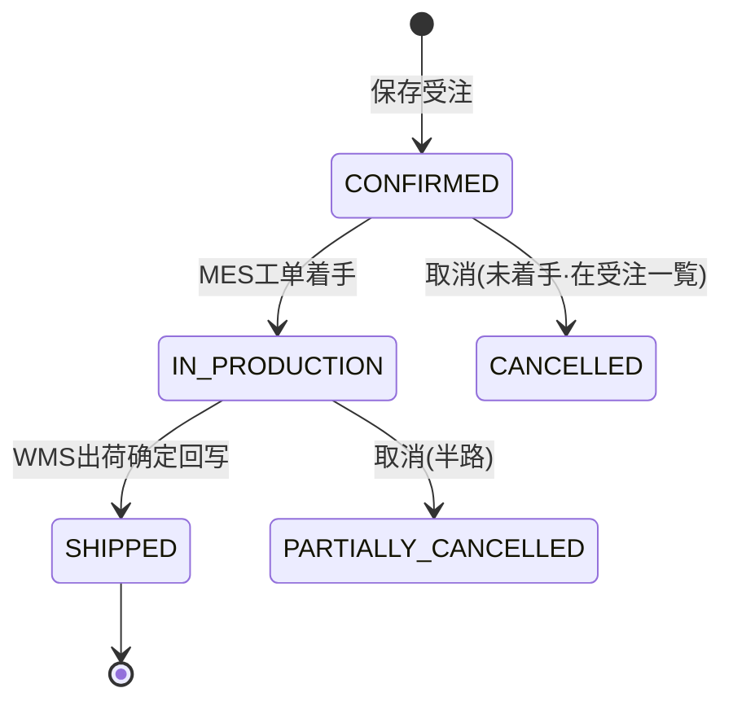

# 受注入力 单页面操作 SOP（手把手版）

> **用途**：给**业务用户照着点、培训老师照着讲、测试人员照着拆用例**的单页面手册。比模块总册更细、更口语。
> **页面**：受注入力（销售管理 MSBB · 模块总册 §5.7）　**前端**：`views/erp/OrderEntryView.vue`（+ `order/Step1HeaderAndDetails.vue` / `Step2BasicInfo.vue` / `Step3ProcessInfo.vue`）　**API**：`api/erp/order.ts`　**后端**：`Erp/OrderController`
> **基准**：分支 `feat/wfs-inbox-core`，2026-06-28，均实测真实代码。查不到的标 `待业务确认` / `代码未发现`。
> **样例数据**：沿用模块总册 §0 —— 客户 `C0001`(A社)、製品 `PRD2026070001`(A社向け5号BC楞4色箱)、数量 5000、客先納期 2026-07-10、受注号 `WO20260701000001`（系统采番）。

---

## 1. 页面一句话说明

**受注入力，就是销售人员把客户的正式订单录进系统的页面；而且——按下"保存"那一刻，系统会自动去 MES 排生产工单、去 WMS 开出荷指示，所以这张"保存"不是普通保存，是"开始干活"的开关。**

---

## 2. 这个页面在业务流程中的位置

```
上游(必须先有)            本页面                 下游(保存后自动/后续)
─────────────         ───────────          ──────────────────────
取引先マスタ(客户)  ┐                      ┌→ MES 製造指図(工单)     自动展开
製品マスタ(产品)    ├→  受注入力录入订单 ─保存→├→ WMS 製品出荷指示       自动生成
御見積/見積計算(报价)┘   (头+明细+工程材料)     ├→ 注文追溯(Bridge事件)   可查
                                            ├→ 应收/OTD/Backorder报表 后续
                                            └→ (后续)拣货→梱包→出荷→回写ShipStatus
```

- **上游**：先有客户（取引先マスタ）、产品（製品マスタ，且工程/材料完整）、报价（御見積/見積計算，非强制但常见）。
- **本页面**：录入一笔正式销售订单（一笔受注 = 1 个头部 + N 行明细 + 每行的构成/工程/材料）。
- **下游（保存后）**：MES 自动展开製造指図、WMS 自动生成製品出荷指示；可在注文追溯看联动是否成功；后续影响应收、准时交付率(OTD)、未出荷台账(Backorder)。
- **保存后的业务影响**：**订单一旦保存即驱动生产与出货**，不是录入草稿。录错=驱动错误的生产/出货，后果比一般主数据严重。

---

## 3. 谁使用这个页面

| 角色 | 使用目的 | 常用操作 | 权限要求 | 注意事项 |
|---|---|---|---|---|
| 销售人员 | 录入/修改客户订单 | 登録、訂正、引入製品、保存 | 受注录入权限(`[Authorize]`，细粒度`待业务确认`) | 保存即触发下游，先核对客户/产品/数量 |
| 销售主管 | 与信超限决策、复核 | 与信确认续行、参照 | 主管权限`待业务确认` | 与信超限弹窗由主管判断 |
| 生产计划员 | 追踪订单是否转成工单 | （本页只读/不操作）到 MES/注文追溯查 | 查看权限 | 不在本页改数据 |
| 仓库人员 | 查出荷指示来源 | （下游）到 WMS 出庫指示查 | 查看权限 | 不在本页改数据 |
| 财务人员 | 关注受注金额→应收 | （只读）看金额/币种 | 查看权限 | 金额由数量×单价自动 |

---

## 4. 操作前准备（不准备好，下面会卡住）

| 准备项 | 为什么需要 | 不满足会怎样 | 去哪里维护/确认 | 测试关注点 |
|---|---|---|---|---|
| 客户已在取引先建档 | 得意先CD 必填、与信/回写依赖 | 选不到客户、保存报必填 | 取引先マスタ | 客户存在性 |
| 製品已在製品マスタ建档 | 明细按製品CD引入63字段 | 引入不到、明细不全 | 製品マスタ | 产品存在性 |
| 製品工程/材料/ロット単価完整 | 影响工单展开与价格带出 | 工单材料缺、价格为空 | 製品マスタ Step3/4/5 | 子表完整性 |
| 客先納期明确 | 与合计LT比对 | 纳期<LT 提示不可达 | 与客户/生产确认 | 纳期LT校验 |
| 知道"保存即触发MES/WMS" | 防误触发生产 | 误下单驱动生产 | 本SOP §1/§8 | 业务认知 |
| 当前用户有受注录入权限 | 无权不能保存 | 进不来/存不了 | PUB 权限配置 | 权限`待业务确认` |
| 需特値时有主管确认 | 特价是受控操作 | 价格不合规 | 销售流程 | 特值审批 |
| 外币订单已有汇率 | 受注冻结汇率 | 汇率缺失 | 為替レート | 多币种 |

---

## 5. 页面区域说明

| 区域 | 页面位置 | 用户要做什么 | 注意事项 |
|---|---|---|---|
| 操作种别区 | 顶部右侧单选 | 选 登録/訂正/削除/参照 | 无单号时除"登録"外都灰 |
| 状态标签区 | 顶部左侧 | 看 自動採番/転送済/mc連携 标签 | "転送済"是mc状态，非生命周期 |
| 步骤条 | 顶部下方 | 看当前在 Step1/2/3 | 移动端紧凑显示 |
| 检索区 | 步骤条下(仅订正/参照态) | 输 Web受注NO 或 手配NO1 读込 | 新建模式不显示 |
| 受注表头区 | Step1 上半 | 填客户/受注区分/纳期等头部 | 受注区分影响后续可编辑性 |
| 明细行区(部材一覧) | Step1 下半表格 | 加明细、引入製品、填数量 | 至少1行才能下一步 |
| 构成/工程/材料区 | Step2/Step3 | 核对/调整选中明细行的构成与工程材料 | 构成仅特定受注区分可改 |
| 底部按钮区 | 页面最下(移动端吸底) | 上一步/下一步/保存/削除/クリア | 按操作种别显隐 |
| 引入/选择弹窗 | 点搜索按钮弹出 | 选客户、选製品 | picker 来自主数据 |
| 错误提示区 | 字段下方/顶部消息 | 看红字/Toast 提示 | 按提示补填 |

---

## 6. 字段填写说明（口语版：到底怎么填）

> 控件：下拉=系统给选项；搜索按钮=弹 picker 选主数据；数值=直接输。

| 字段 | 用户怎么填 | 示例 | 谁提供这个值 | 填错会怎样 | 保存后能否改 | 下游影响 | 测试关注点 |
|---|---|---|---|---|---|---|---|
| 受注区分 | 下拉选订单类型 | 加工製品 | 销售判断 | 选错→构成能不能改、行能不能复制都跟着错 | 可改(mc转送后慎改) | 影响工单类型/构成可编辑 | 9选项、联动 |
| 得意先CD | 点搜索选客户，别手打名字 | C0001 | 销售/取引先 | 选错客户→生产出货给错人、应收错 | 可改 | 与信、出荷回写、应收 | picker、必填 |
| 製品CD(明细) | 点明细行搜索选产品 | PRD2026070001 | 销售/製品マスタ | 选错→带出错构成/工程/材料 | 可改 | **MES工单、构成、材料** | 引入63字段 |
| 顧客品名 | 引入带出，可改对客叫法 | A社向け5号箱 | 客户/製品 | 不影响生产，但单据难认 | 可改 | 单据/发票显示 | — |
| 数量(明细) | 直接输客户订购量 | 5000 | 客户 | 填0→报必填；填错→生产/出货量错 | 可改(出荷后慎改) | **工单量、出荷量、金额** | >0、算金额 |
| 単位 | 引入带出 | 枚 | 製品マスタ | 单位错→数量含义错 | 可改 | 全链计量 | — |
| 客先納期 | 选日期 | 2026-07-10 | 客户 | 早于LT→提示不可达 | 可改 | 加工予定日逆算 | 纳期LT |
| 出荷日時 | 输 YYYY/MM/DD HH:MM | 2026-07-09 10:00 | 销售/物流 | 影响加工予定日逆算 | 可改 | 工程予定日 | 格式 |
| 特値 | 想自己定价就勾上 | ☑ | 销售/主管 | 不勾就改不了单价 | 可改 | 单价是否可编辑 | 联动 |
| 個別単価 | **勾了特値才能改**，否则用主数据价 | 120 | 销售/主管 | 改错→应收金额错 | 可改 | 金额、应收 | 特值才可改 |
| セット単価 | 同上，套单价时用 | — | 销售/主管 | 同上 | 可改 | 金额、应收 | — |
| 売価区分 | 选 1个别/2套 | 1 | 销售/製品 | 决定金额按哪种单价算 | 可改 | **金额算法** | 算法分支 |
| 金額 | **不用填，系统自动算**(数量×对应单价) | 600000 | 系统 | — | 只读 | 应收 | 自动计算 |
| 手配NO1 | **不用填，系统采番** | 系统生成 | 系统 | — | 只读 | 全链追踪 | 采番 |
| ShipStatus | **不用填，出荷后系统回写** | 0→9 | 系统 | — | 只读 | 取消闸门(≥5不可取消) | 回写 |
| Status(mc) | **不用填**，0未転送/9転送済 | 0 | 系统 | — | 只读 | mc连携 | — |
| OrderStatus(生命周期) | **本页不显示**(CONFIRMED等) | — | 系统 | — | 只读 | 取消/状态判断 | **代码现状：本页不显示** |
| 構成(段/原紙/印刷)(Step2) | 引入带出，**仅シート/原紙/輪切可改** | BC/K280 | 製品/技术 | 改错→生产用错材质 | 视受注区分 | MES/采购成本 | 构成可编辑区分 |
| 工程/材料(Step3) | 引入带出，可微调 | — | 製品/技术 | 改错→工单工艺/材料错 | 可改 | MES工单 | 引入/编辑 |

> 📌 **三个状态别搞混**：①`Status`(0/9)=mc转送，页面顶部显示；②`ShipStatus`(0/5/9)=出荷进度；③`OrderStatus`(生命周期 CONFIRMED…)=**本页不显示，要去受注一覧/注文追溯看**。

---

## 7. 按钮操作说明

| 按钮 | 用户什么时候点 | 点了以后系统会做什么 | 成功后用户看到什么 | 失败时怎么处理 | 测试关注点 |
|---|---|---|---|---|---|
| 新規 | 要建新订单 | 清空表单进新建态 | 空白表单、顶部"自動採番"标签 | 有未保存改动会先提示 | 脏数据提示 |
| 読込 | 要改/看已有订单 | 按 Web受注NO 或 手配NO1 拉数据 | 表单填满该订单 | 号不存在→提示 | 二者任一 |
| (明细行)製品搜索引入 | 给某明细行选产品 | 调 `lookupProductMaster`，带出63字段 | 该行品名/单位/构成/工程/材料填好 | 製品不存在→提示 | 引入完整 |
| (工具栏)引入 | 按セット製品CD整套引部材 | 调 `lookupBySetProductCd`，**清空现明细重填** | 明细变成该套部材行 | — | **会清空已填明细** |
| 行追加 | 手动加一行明细 | 新增空明细行 | 多一行 | — | — |
| 行削除 | 删掉选中明细行 | 移除该行 | 少一行 | 未选行不可删 | — |
| 行コピー | 复制选中明细行 | 复制一行 | 多一相同行 | **仅受注区分=原紙(40)可用** | 区分限制 |
| ▲ / ▼ | 调明细行顺序 | 上移/下移 | 行序变化 | 首/末行对应方向灰 | — |
| 前へ / 次へ | 在三步间切换 | 切步(下一步前校验明细≥1) | 切到目标步 | 校验不过不能下一步 | 明细非空 |
| (Step3)製品工程/材料引入 | 给选中明细引工程/材料 | 调 `lookupProductProcesses/Materials` | 工程/材料表填入 | — | 引入 |
| **保存** | 头+明细填好、确认无误 | **校验→与信チェック→create/update→自动触发MES工单+WMS出荷指示** | 顶部出 Web受注NO、转编辑态、成功提示 | 见 §11；与信超限弹确认 | **核心：校验/与信/Bridge** |
| 削除 | 要逻辑删除该订单记录 | 软删(IsDeleted=true) | 提示删除、清空 | 并发409→取最新 | 软删；≠取消 |
| クリア | 放弃当前录入 | 清空(脏检查确认) | 表单清空 | — | 脏提示 |
| (窗口模式)关闭 | 弹窗模式用完 | window.close | 关窗 | — | standalone |

> ⚠️ **本页有"削除"(逻辑删除订单记录)，没有"取消"(反向解锁工单/出库)**。要撤销已触发生产的订单，请到**受注一覧 → 取消**（探查→反向级联），不要在本页删除。详见模块总册 §5.8。

---

## 8. 标准业务操作 SOP（照着点）

### 场景一：新增加工製品受注并触发 MES/WMS（主流程）
- **业务背景**：A社正式下单 5号 BC楞 4色箱 5000 个，交期 2026-07-10。
- **使用样例数据**：受注区分=加工製品；得意先 C0001；製品 PRD2026070001；数量 5000；纳期 2026-07-10。
- **前置条件**：① 登录有受注权限；② C0001、PRD2026070001 已建档且製品工程/材料完整；③ 客户与信足。
- **详细操作步骤**：
  1. 打开【销售管理 → 受注入力】（默认"登録"模式，顶部显示"自動採番"）。
  2. Step1 表头：【受注区分】下拉选"加工製品"。
  3. 【得意先CD】点搜索按钮 → 在弹窗选 `C0001` → 确定。
  4. 【受注日】选今天；【客先納期】选 `2026-07-10`；【売価区分】按製品(如 1 个别)。
  5. 明细：点【行追加】新增一行。
  6. 在该行【製品CD】点搜索 → 选 `PRD2026070001`（系统自动带出品名/単位/构成/工程/材料）。
  7. 在该行【数量】输 `5000`。（如需特价：勾【特値】再改【個別単価】，否则用带出价。）
  8. （可选）点【次へ】到 Step2 核对构成、到 Step3 核对工程/材料。
  9. 点【保存】。
  10. 如弹"与信超限"框：主管确认后点【确定】续行，或【取消】中止。
  11. 记下顶部生成的 **Web受注NO**（如 `WO20260701000001`）。
  12. 打开【受注一覧】，按客户或号查询，确认能查到。
  13. 打开【注文追溯】，输入该 Web受注NO，查看时间线。
  14. 打开【MES 製造指図一覧】，按 WebOrderNo 查，确认工单已生成。
  15. 打开【WMS 出庫指示一覧】，确认製品出荷指示已生成。
- **完成后检查**：① Web受注NO 已生成；② 受注一覧可查；③ 注文追溯有 MES/WMS `OnOrderCreated` 等 **SUCCESS** 事件，失败/死信=0；④ MES 工单存在；⑤ WMS 出荷指示存在；⑥ ShipStatus=0 未出荷。
- **异常处理**：见 §11；保存成功但下游无事件/有 FAILED → 见场景六。
- **可拆测试用例**：TC-M04-ORDER-002/003/024/025/026（新增/引入/触发MES/触发WMS/追溯）。

### 场景二：录入特値（特价）订单
- **业务背景**：A社大单议价，单价低于标准价，需手动定价。
- **使用样例数据**：製品 PRD2026070001；数量 10000；個別単価 ¥110(低于标准¥120)；特值理由：大单议价。
- **前置条件**：主管已同意该特价。
- **详细操作步骤**：1) 同场景一录头+明细引製品；2) 在明细行**勾选【特値】**；3) 此时【個別単価】变为可编辑，输 `110`；4) 确认【金額】自动按 数量×特价 重算；5) 保存。
- **完成后检查**：① 金额=10000×110；② 该明细特値标志=1；③（如有特价审批）走相应审批`待业务确认`。
- **异常处理**：未勾特値时单价灰、改不了 → 先勾特値。
- **可拆测试用例**：TC-M04-ORDER-012/013/015（特値订单/未勾特値单价锁/金额算法）。

### 场景三：修改未出荷订单
- **业务背景**：客户保存后追加数量，订单尚未出荷。
- **使用样例数据**：`WO20260701000001`，数量 5000→8000。
- **前置条件**：订单存在、未出荷（ShipStatus=0；出荷后改动需评估）。
- **详细操作步骤**：1) 操作种别选"訂正"；2) 检索区输 Web受注NO（或手配NO1）→【読込】；3) 改明细【数量】为 8000；4) 保存。
- **完成后检查**：① 改动落库；② 数量变化是否同步影响工单/出荷指示——到注文追溯/MES/WMS 确认；③ 若改动触发新联动事件，应为 SUCCESS。
- **异常处理**：并发 409 `W10002` → 取最新版重改；已出荷的订单改动须谨慎（可能与已出荷数冲突）。
- **可拆测试用例**：TC-M04-ORDER-018/028/032（订正/并发/下游一致）。

### 场景四：保存失败的处理
- **业务背景**：录入有误，保存被拦。
- **使用样例数据**：故意留空客户/受注区分/明细 productCd；数量填 0。
- **前置条件**：在新建态。
- **详细操作步骤**：1) 不填【得意先CD】保存→看提示；2) 不选【受注区分】保存；3) 不加任何明细保存；4) 明细不填【製品CD】保存；5) 数量填 `0` 保存。
- **完成后检查**：分别提示 `E10022`(必填)、`E10009`(明细空)、平文"得意先CDは必須"/"登録する明細がありません" 等；**均不落库**。
- **异常处理**：按提示补填后重存。
- **可拆测试用例**：TC-M04-ORDER-005~011（各必填/数量0/客户不存在/製品不存在）。

### 场景五：确认从製品带出的构成/工程/材料
- **业务背景**：销售不改生产数据，但要确认引入的构成/工程/材料是否正确，错了会让 MES 生产用错。
- **使用样例数据**：PRD2026070001。
- **前置条件**：已引入製品到明细行。
- **详细操作步骤**：1) Step1 选中该明细行；2) 点【次へ】到 Step2 看【構成情報】(段/原紙F·C·B/印刷)；3) 到 Step3 看【工程】与【材料】；4) 若构成明显错且受注区分=シート/原紙/輪切(20/40/80)可改，否则联系技术改製品マスタ。
- **完成后检查**：构成/工程/材料与客户要求一致；不一致且本页不可改的，回製品マスタ修正。
- **异常处理**：受注区分非 20/40/80 时构成只读 → 不在本页改，去製品マスタ。
- **可拆测试用例**：TC-M04-ORDER-022/023（构成可编辑/只读区分）。

### 场景六：保存后发现 MES/WMS 没有生成
- **业务背景**：保存成功但下游没动静。
- **使用样例数据**：刚保存的 Web受注NO。
- **前置条件**：受注已保存。
- **详细操作步骤**：
  1. **先到【注文追溯】**输该 Web受注NO 查询，**不要急着重新建单**。
  2. 看事件状态：`SUCCESS`(成功)/`PENDING`(待重试)/`SKIPPED`(业务跳过)/`FAILED`(失败待重试)/`DEAD`(死信)。
  3. 若是 PENDING → 稍等系统自动重试。
  4. 若是 FAILED/DEAD → 看 message、点【复制关联ID】。
  5. 到【WMS Bridge 健康看板】按关联ID 手动补偿/重试（详见模块手册 10）。
  6. 仍失败 → 联系运维/管理员，**切勿重复建订单**（会产生重复工单/出荷指示）。
- **完成后检查**：补偿后重新追溯应转 SUCCESS；下游工单/出荷指示出现。
- **异常处理**：完全无事件 → 可能 Bridge 被关停（appsettings）或未触发，找管理员确认。
- **可拆测试用例**：TC-M04-ORDER-026/027（追溯SUCCESS/FAILED排查）。

---

## 9. 状态变化说明

| 状态 | 用户看到什么 | 代表什么意思 | 可以做什么 | 不能做什么 | 下一步 |
|---|---|---|---|---|---|
| OrderStatus=CONFIRMED | (本页不显示，受注一覧/追溯可见) | 受注已确定(创建后) | 订正、取消 | — | 转 生产中/出荷済/取消 |
| OrderStatus=IN_PRODUCTION | 同上不显示 | 已展开工单/生产中 | 取消(可能半路) | — | 出荷済/部分取消 |
| OrderStatus=SHIPPED | 同上不显示 | 已出荷 | — | **取消(会被拒)** | 完结/退货 |
| OrderStatus=CANCELLED / PARTIALLY_CANCELLED | 同上不显示 | (部分)取消 | — | — | — |
| ShipStatus=0 | 明细状态 | 未出荷 | 可取消 | — | 5/9 |
| ShipStatus=5 | 明细状态 | 部分出荷 | 取消受限 | — | 9 |
| ShipStatus=9 | 明细状态 | 出荷済 | — | **取消(Rejected)** | 完结 |
| Status=0 | 顶部无"転送済" | mc 未転送 | 正常操作 | — | 9 |
| Status=9 | 顶部"転送済"标签 | mc 已転送 | 慎改 | — | — |

> **代码现状**：`OrderStatus` 生命周期状态**不在受注入力页直接显示**，需在【受注一覧】或【注文追溯】查看。本页顶部"転送済"是 `Status`(mc 转送)，请勿与生命周期状态混淆。



---

## 10. 按钮不可用 / 灰色原因

| 按钮/字段 | 什么时候不可用 | 为什么不可用 | 用户怎么处理 | 测试关注点 |
|---|---|---|---|---|
| 訂正/削除/参照(操作种别) | 没有 Web受注NO 时 | 没有可操作的订单对象 | 先【読込】一张已有订单 | 无号禁用 |
| 全部输入框 | 参照/削除模式 | 这两模式只读 | 切"登録/訂正" | 模式只读 |
| 個別単価/セット単価(明细) | 该行未勾【特値】 | 默认用主数据价，防乱改价 | 先勾特値 | 特值联动 |
| 構成情報(Step2) | 受注区分≠20/40/80 | 仅シート/原紙/輪切允许在受注侧改构成 | 改受注区分或去製品マスタ改 | 构成可编辑 |
| 行コピー | 受注区分≠原紙(40) | 仅原紙订单允许复制行 | — | 区分限制 |
| 行削除/▲▼ | 未选明细行/首末行 | 无对象/已到边界 | 先选行 | — |
| 下一步 | 明细行数<1 | 受注必须有明细 | 先【行追加】或【引入】 | 明细非空 |
| 製品带出(构成/工程/材料) | 未选製品CD | 没有产品就没有可带出的数据 | 先在明细选製品CD | 引入前置 |

---

## 11. 常见错误与处理

| 错误/提示 | 可能原因 | 用户处理方法 | 是否需要管理员 | 测试关注点 |
|---|---|---|---|---|
| 保存失败(红字) | 必填空/明细空/校验不过 | 按提示补填 | 否 | 校验 |
| `E10022` 必填 | 客户/受注区分/行製品CD 空 | 补这几项 | 否 | E10022 |
| `E10009` / "登録する明細がありません" | 没有明细行 | 至少加1行明细 | 否 | E10009 |
| "得意先CDは必須" | 客户没选 | 选客户 | 否 | 必填 |
| 找不到客户 | 客户未建档/编码错 | 去取引先マスタ建/核对 | 是(建档) | 客户存在 |
| 找不到製品 | 产品未建档/编码错 | 去製品マスタ建/核对 | 是(建档) | 产品存在 |
| 数量不合法 | 填0或负 | 填正数 | 否 | 数量>0 |
| 单价改不了 | 未勾特値 | 先勾特値 | 否 | 特值 |
| 与信超限弹窗 | 客户与信不足 | 主管确认续行或调额度 | 是(主管/额度) | 与信 |
| 纳期提示不可达 | 客先納期 < 合计LT | 与生产确认/调纳期 | 否 | 纳期LT |
| "更新済"/409冲突 | 并发(W10002) | 取最新版重做 | 否 | 乐观锁 |
| 保存成功但无工单/出荷指示 | Bridge失败/关停 | 查注文追溯→Bridge健康看板，**勿重复建单** | 是(运维) | Bridge |
| 权限不足/进不来 | 无受注权限 | 申请权限 | 是 | 权限`待确认` |
| 网络/接口异常 | 后端/网络问题 | 稍后重试、保留录入 | 是(运维) | 异常恢复 |

---

## 12. 操作完成后的检查清单（保存后必做）

| 操作 | 当前页面检查 | 受注一覧检查 | 注文追溯检查 | MES检查 | WMS检查 | 数据状态检查 | 测试关注点 |
|---|---|---|---|---|---|---|---|
| 保存新受注 | 顶部出现 Web受注NO、转编辑态、成功提示 | 按客户/号能查到 | 出现 MES/WMS `OnOrderCreated` SUCCESS | 製造指図一覧有对应工单 | 出庫指示一覧有製品出荷指示 | ShipStatus=0；OrderStatus=CONFIRMED(追溯/一覧看) | 闭环冒烟 |
| 订正受注 | 改动反映在表单 | 列表数据更新 | 若触发新事件应SUCCESS | 数量变则工单同步`待确认` | 出荷指示同步`待确认` | RowVersion更新 | 改后联动 |
| 删除受注 | 提示删除、清空 | 列表不再显示 | (历史事件保留) | (已展开工单需另处理) | 同左 | IsDeleted=true | 软删；删≠取消 |
| 发现FAILED/DEAD | — | — | 标红、message有因、复制关联ID | — | Bridge健康看板补偿 | 事件状态 | 失败处理 |

---

## 13. 页面级测试用例（≥25 条，可执行）

> 编号 `TC-M04-ORDER-xxx`；数据用 §0 样例。测试人员补"实际结果/是否通过/缺陷编号"。

| 用例编号 | 用例名称 | 优先级 | 前置条件 | 测试数据 | 操作步骤 | 预期结果 | 下游检查 | 备注 |
|---|---|---|---|---|---|---|---|---|
| TC-M04-ORDER-001 | 页面打开默认新建 | P1 | 有权限 | — | 进入受注入力 | 默认登録态、顶部"自動採番"、检索区不显示 | — | — |
| TC-M04-ORDER-002 | 正常新增加工製品受注 | P0 | 主数据齐 | C0001/PRD2026070001/5000 | 填头+引製品+数量→保存 | 生成WO号、转编辑态 | 见004/005 | 核心 |
| TC-M04-ORDER-003 | 明细按製品CD引入63字段 | P1 | PRD已建 | PRD2026070001 | 明细行选製品CD | 品名/单位/构成/工程/材料带出 | — | 引入 |
| TC-M04-ORDER-004 | セット引入清空重填明细 | P1 | セット製品已建 | セット製品CD | 已有明细后点工具栏【引入】 | 现明细被清空、按部材重填 | — | 引入清空 |
| TC-M04-ORDER-005 | 必填-客户空 | P0 | 新建 | 不选客户 | 保存 | E10022/"得意先CDは必須" | 不落库 | — |
| TC-M04-ORDER-006 | 必填-受注区分空 | P0 | 新建 | 不选区分 | 保存 | E10022/"受注区分は必須" | 不落库 | — |
| TC-M04-ORDER-007 | 必填-行製品CD空 | P0 | 有明细 | 行不填製品CD | 保存 | E10022 | 不落库 | — |
| TC-M04-ORDER-008 | 明细为空保存 | P0 | 新建 | 无明细 | 保存 | E10009/"登録する明細がありません" | 不落库 | — |
| TC-M04-ORDER-009 | 数量为0 | P0 | 有明细 | 数量=0 | 保存 | 拦截(数量须>0) | 不落库 | — |
| TC-M04-ORDER-010 | 客户不存在 | P1 | — | 不存在客户码 | picker搜不到/手工填 | 选不到/校验失败 | — | 客户存在性 |
| TC-M04-ORDER-011 | 製品不存在 | P1 | — | 不存在製品码 | 明细引入 | 引入失败/提示 | — | 产品存在性 |
| TC-M04-ORDER-012 | 特値订单 | P0 | 主管同意 | 特値☑/个别价110 | 勾特値→改价→保存 | 金额按特价、特値=1 | — | 特价 |
| TC-M04-ORDER-013 | 未勾特値单价锁定 | P1 | 有明细 | 不勾特値 | 试改个别单价 | 单价不可编辑 | — | 联动 |
| TC-M04-ORDER-014 | 单价异常值 | P2 | 勾特値 | 负数/超大 | 改价保存 | `待业务确认`(是否有上下限校验) | — | 待确认 |
| TC-M04-ORDER-015 | 金额自动计算 | P1 | 有明细 | 数量×单价 | 改数量/单价 | 金额按売価区分自动算 | — | 算法 |
| TC-M04-ORDER-016 | 纳期<LT提示 | P1 | 製品有LT | 纳期早于今天+LT | 填纳期保存 | 平文提示"明細{No}:LT不足" | — | 纳期LT |
| TC-M04-ORDER-017 | 与信超限确认 | P1 | 超额客户 | 大额订单 | 保存 | 弹与信确认框 | — | 与信 |
| TC-M04-ORDER-018 | 订正未出荷订单 | P1 | 订单未出荷 | 数量5000→8000 | 訂正→读込→改→存 | 落库成功 | 联动同步`待确认` | — |
| TC-M04-ORDER-019 | 手配NO1载入 | P1 | 已有单 | 手配NO1 | 检索区输手配NO1→読込 | 拉出对应受注 | — | 载入 |
| TC-M04-ORDER-020 | 行コピー(原紙40) | P2 | 区分=原紙 | 选行 | 行コピー | 复制出新行 | — | — |
| TC-M04-ORDER-021 | 行コピー非原紙禁用 | P2 | 区分≠40 | 选行 | 看行コピー | 按钮灰 | — | 区分限制 |
| TC-M04-ORDER-022 | 构成可编辑(シート20) | P2 | 区分=20 | 改原紙/印刷 | Step2改构成 | 可改并保存 | MES用新构成 | — |
| TC-M04-ORDER-023 | 构成只读(非20/40/80) | P2 | 区分=10 | — | Step2看构成 | 只读 | — | — |
| TC-M04-ORDER-024 | 保存触发MES工单 | P0 | Bridge启用 | 场景一数据 | 保存后查MES | 製造指図一覧出现工单 | MES | 闭环 |
| TC-M04-ORDER-025 | 保存触发WMS出荷指示 | P0 | Bridge启用 | 场景一数据 | 保存后查WMS | 出庫指示一覧出现出荷指示 | WMS | 闭环 |
| TC-M04-ORDER-026 | 注文追溯SUCCESS | P0 | 已保存 | WO号 | 注文追溯查 | MES/WMS事件SUCCESS、失败/死信=0 | — | 可观测 |
| TC-M04-ORDER-027 | Bridge FAILED/DEAD排查 | P1 | 人为造障 | 失败WO | 追溯查→看message→复制ID | FAILED标红、可补偿 | Bridge健康看板 | 失败处理 |
| TC-M04-ORDER-028 | 并发冲突 | P2 | 两端打开同单 | 同单 | 先后保存 | 后者409 W10002 | — | 乐观锁 |
| TC-M04-ORDER-029 | 权限不足 | P2 | 无权账号 | — | 进页面/保存 | `待业务确认`(隐藏/拒绝) | — | 权限 |
| TC-M04-ORDER-030 | 灰按钮-无号禁用 | P2 | 新建无号 | — | 看訂正/削除/参照 | 灰 | — | — |
| TC-M04-ORDER-031 | 刷新后数据仍在 | P1 | 已保存 | WO号 | 刷新/重新读込 | 数据仍在 | — | 落库 |
| TC-M04-ORDER-032 | 下游数据一致性 | P0 | 已触发 | 数量5000 | 比对受注数量与工单/出荷指示量 | 数量一致 | MES/WMS | 一致性 |
| TC-M04-ORDER-033 | 删除受注(软删) | P1 | 有单 | WO号 | 削除→读込→删除 | 列表消失、IsDeleted=true | — | 删≠取消 |
| TC-M04-ORDER-034 | 窗口模式打开 | P2 | — | /order/window | 独立窗口打开 | 无侧边栏正常录入 | — | standalone |
| TC-M04-ORDER-035 | 参照只读 | P2 | 有单 | WO号 | 参照→读込 | 整页只读、无保存 | — | — |

---

## 14. 培训讲解建议

| 讲解顺序 | 讲什么 | 演示动作 | 用户容易误解的点 |
|---|---|---|---|
| 1 | 这页是"订单录入+启动生产出货"的开关 | 展示 §2 流程图 | 以为保存只是存草稿 |
| 2 | 操作前必须先有客户/产品 | 演示选不到客户/产品的后果 | 现场临时建错主数据 |
| 3 | 录头部→加明细→引製品→填数量 | 完整走场景一到第9步 | 忘了至少要1行明细 |
| 4 | 保存=触发下游 | 保存后依次开 受注一覧/注文追溯/MES/WMS | 保存后不去确认下游 |
| 5 | 特値才能改价 | 勾/不勾特値对比 | 直接想改单价 |
| 6 | 出荷后不能随便改 | 讲 ShipStatus 与改动风险 | 出荷后改数量 |
| 7 | 下游失败怎么办 | 演示注文追溯FAILED→Bridge健康看板 | **失败后重复建单** |
| 8 | 删除≠取消 | 讲本页削除 vs 受注一覧取消 | 用删除来"撤单" |

---

## 15. 与模块级手册的关系

本单页 SOP 对应模块总册 `docs/manuals/user-training/01-销售管理MSBB-最详细用户操作培训手册.md`：

| 本SOP章节 | 对应总册章节 |
|---|---|
| §1/§2 定位与流程 | 总册 §1、§3、§5.7.1 |
| §0样例数据(沿用) | 总册 §0 本手册使用的培训样例数据 |
| §4 操作前准备 | 总册 §5.7.1a 业务前置检查清单 |
| §6 字段填写 | 总册 §5.7.1b 关键字段业务填写口径 + §5.7.7/5.7.8 字段表 |
| §7 按钮 | 总册 §5.7.9 按钮功能说明 |
| §8 SOP | 总册 §5.7.1e 详细操作场景(本SOP更细化) |
| §9 状态 | 总册 §5.7.10 状态流转说明 |
| §10 灰按钮 | 总册 §5.7.1c 灰按钮/不可操作说明 |
| §12 完成后检查 | 总册 §5.7.1d 完成后检查点与下游验证 |
| §13 测试用例 | 总册 §7.1 可执行测试用例(本SOP页面级更全) |
| §14 培训讲解 | 总册 §13 培训讲解脚本 |

---

## 16. 代码与文档来源

| 类型 | 路径 | 用途 |
|---|---|---|
| 前端页面 | `cp6.web/src/views/erp/OrderEntryView.vue` | 页面壳/区域/按钮 |
| 子组件 | `cp6.web/src/views/erp/order/Step1HeaderAndDetails.vue`、`Step2BasicInfo.vue`、`Step3ProcessInfo.vue` | 表头/明细/构成/工程/材料 |
| 关联组件 | `cp6.web/src/views/erp/OrderCancelDialog.vue`(取消，在受注一覧用)、`MasterReferenceDialog`(客户/製品picker) | 引入/取消 |
| API 封装 | `cp6.web/src/api/erp/order.ts` | create/update/remove/getByWebOrderNo/lookup*/creditCheck/calcLeadTime 等 |
| 类型 | `cp6.web/src/types/erp/order.ts` | OrderDto/OrderDetailDto/OrderQueryDto/OrderCancelResult 等 |
| 路由 | `cp6.web/src/router/index.ts`(`/order`,`/order/window`,`/order?webOrderNo=`) | 进入路径 |
| 后端 Controller | `CP6.WebApi/Controllers/Erp/OrderController.cs`(`[Route("api/orders")]`) | 路由/校验/取消 |
| Service | `CP6.Core/Services/Erp/OrderService.cs`(CreateAsync/UpdateAsync/CancelAsync/CheckCredit/CheckDeliveryLeadTime) | 业务逻辑/状态机 |
| Entity | `CP6.Entity/DomainModels/Erp/Order.cs`、`OrderDetail.cs`、`OrderProcess.cs`、`OrderProcessNote.cs`、`OrderMaterial.cs` | 数据模型 |
| DTO | `CP6.Entity/DTOs/Erp/OrderDto.cs`(含 OrderOperationType 枚举)、`OrderCancelDto.cs`(CancelOutcome) | 请求/操作枚举 |
| Enum/常量 | `OrderLifecycleStatus`/`CancelOutcome`(内联于实体/DTO)；`CP6.Entity/Enums` 目录存在性`待确认` | 状态枚举 |
| 跨模块 Hook | `CP6.Core/Services/Mes/MesBridgeHook.cs`、`Wms/WmsBridgeHook.cs`、`Wms/ErpBridgeHook.cs` | 闭环触发 |
| 模块总册 | `docs/manuals/user-training/01-销售管理MSBB-最详细用户操作培训手册.md` | 上级手册 |
| 页面盘点表 | `docs/manuals/user-training/00-用户操作手册页面盘点表.md` | 页面索引(序号7) |
| 逐行源码手册 | `docs/codemap-erp/05-受注-order.md` | 代码级实现 |

---

## 最后更新来源

- 代码：见 §16（OrderEntryView+3子组件、order.ts、OrderController、Order/OrderDetail/OrderProcess/OrderMaterial、BridgeHooks，逐文件实测）
- 文档：模块总册 §5.7、`docs/codemap-erp/05-受注-order.md`、页面盘点表
- 基准：分支 `feat/wfs-inbox-core`，盘点日 2026-06-28
- 不确定项均标 `待业务确认`；本页不显示 OrderStatus 等"代码现状"已显式标注
