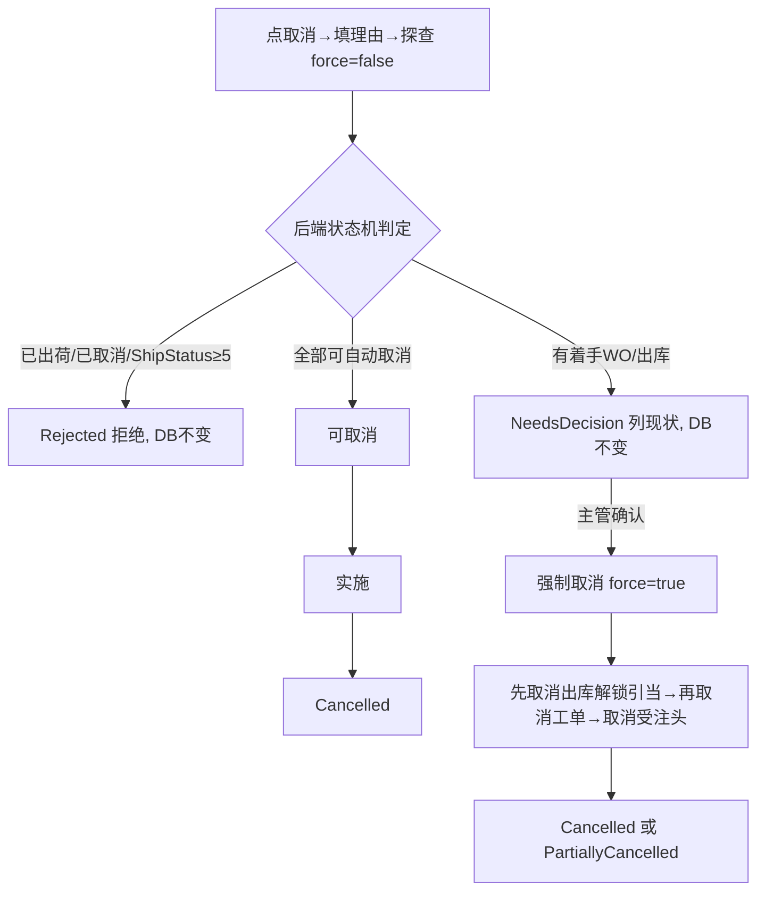

# 受注一覧 单页面操作 SOP（手把手版）

> **用途**：给**业务用户照着点、培训老师照着讲、测试人员照着拆用例**的单页面手册。比模块总册更细、更口语。
> **页面**：受注一覧（销售管理 MSBB · 模块总册 §5.8）　**前端**：`views/erp/OrderListView.vue`（取消弹窗 `views/erp/OrderCancelDialog.vue`）　**API**：`api/erp/order.ts`　**后端**：`Erp/OrderController`
> **基准**：分支 `feat/wfs-inbox-core`，2026-06-28，均实测真实代码。查不到的标 `待业务确认` / `代码未发现`。
> **样例数据**：沿用模块总册 §0 —— 客户 `C0001`(A社)、製品 `PRD2026070001`、受注号 `WO20260701000001`（系统采番）、拠点 `BASE01`。

---

## 1. 页面一句话说明

**受注一覧，就是销售用来"找订单、看订单状态、导出订单、撤订单"的台账页；其中"取消"这个动作很重——它不是删一行记录，而是会去探查并反向解锁 MES 工单、WMS 出庫/出荷指示，已经出荷的订单还不让取消。**

---

## 2. 这个页面在业务流程中的位置

```
上游(数据来源)            本页面                  下游(取消时反向/跳转)
─────────────         ───────────           ──────────────────────
受注入力(已建订单) ──→  受注一覧(查询/导出/取消)  ┬→ 詳細  → 受注入力(订正/参照)
                       (明细粒度列表)           ├→ 追溯  → 注文追溯(看Bridge事件)
                                              └→ 取消  → 探查→反向取消 MES工单 / WMS出庫指示
                                                          (已出荷→拒绝)
```

- **上游**：受注入力创建的订单（本页是这些订单的查询/管理台账）。
- **本页面**：按多条件检索受注（**明细粒度**：一行=一条明细）、看状态、导出 CSV、对订单执行取消。
- **下游/跳转**：① 詳細→受注入力查看/订正；② 追溯→注文追溯看联动事件；③ **取消→反向级联**：先取消可取消的 WMS 出庫指示（解锁库存引当）→再取消可取消的 MES 工单→取消受注头。
- **关键认知**：本页的"**取消**"是**业务撤单**，会影响生产/库存；它和受注入力里的"**削除**(软删记录)"是两回事（见 §7 / §11）。

---

## 3. 谁使用这个页面

| 角色 | 使用目的 | 常用操作 | 权限要求 | 注意事项 |
|---|---|---|---|---|
| 销售人员 | 查订单、导出、看进展 | 查询、CSV、詳細、追溯 | 受注查看权限(`[Authorize]`，细粒度`待业务确认`) | 取消通常由主管做 |
| 销售主管 | 撤单决策 | 取消(探查→强制) | 取消权限`待业务确认` | 取消前先"探查"看影响 |
| 生产计划员 | 确认订单是否被撤 | （只读）看状态/追溯 | 查看权限 | 不在本页改生产数据 |
| 仓库人员 | 确认出荷指示是否被取消 | （下游）到 WMS 查 | 查看权限 | — |
| 财务人员 | 看订单金额/币种 | （只读）查询/导出 | 查看权限 | 金额只读 |

---

## 4. 操作前准备（不准备好，下面会卡住）

| 准备项 | 为什么需要 | 不满足会怎样 | 去哪里维护/确认 | 测试关注点 |
|---|---|---|---|---|
| 系统里已有受注数据 | 列表才有内容可查 | 查询空 | 先到受注入力建单 | 空结果 |
| 取消前先弄清订单是否已出荷 | 已出荷不能取消 | 取消被拒(Rejected) | 看 ShipStatus / 追溯 | 已出荷拒绝 |
| 取消前了解关联工单/出库状态 | 半路订单要决策 | 误强制取消 | 取消弹窗"探查"先看现状 | 半路决策 |
| 有取消权限(高风险) | 取消会影响生产/库存 | 无权不能撤单 | PUB 权限配置 | 权限`待确认` |
| 浏览器允许下载 | CSV 导出 | 导不出 | 浏览器设置 | 导出 |
| 检索范围合理 | 范围过大慢/截断、过小漏 | 超时/E10013 截断 | 缩小客户/日期 | 大结果集 |

---

## 5. 页面区域说明

| 区域 | 页面位置 | 用户要做什么 | 注意事项 |
|---|---|---|---|
| 基础检索区 | 顶部 | 填拠点/客户区间/受注区分/受注日·納期范围 | 范围条件需 FROM≤TO |
| 高级检索区 | 检索区内可折叠(`高级检索`) | 填手配NO/注文書/製品CD/构成相关/勾选过滤 | 默认折叠，纸器特化条件多 |
| 工具按钮区 | 检索区下 | 検索 / クリア / CSV出力 | — |
| 结果统计区 | 列表上方 | 看总件数 Tag | — |
| 结果列表区 | 中部表格(桌面)/卡片(移动) | 看订单、点行操作 | 明细粒度，一行=一明细 |
| 行操作区 | 每行右侧(固定列) | 詳細 / 追溯 / 取消 | 取消为危险操作(红) |
| 分页区 | 列表下方 | 翻页/改每页条数 | 每页 50/100/200 |
| 取消弹窗 | 点"取消"弹出 | 三步：填理由→探查→(决策)强制取消 | 见 §8 场景四~六 |

---

## 6. 字段填写说明（口语版：查询怎么填 + 列表怎么看）

### 6.1 查询条件字段（怎么填）

| 字段 | 用户怎么填 | 示例 | 是否必填 | 数据来源 | 填错/注意 | 测试关注点 |
|---|---|---|---|---|---|---|
| 拠点 `baseCd` | 输据点代码 | BASE01 | 否 | 输入 | — | — |
| 得意先(从~至) `customerCd~customerCdTo` | 输客户区间，单客户两端填同值 | C0001~C0001 | 否 | 输入 | 区间倒置查不到 | 区间 |
| 受注区分 `orderType` | 输区分码 | 10(加工製品) | 否 | 输入 | — | — |
| 受注日(从~至) `orderDateFrom/To` | 选日期范围 | 2026-07-01~31 | 否 | 日期 | **FROM≤TO(E10036)** | 范围边界 |
| 納期(从~至) `deliveryDateFrom/To` | 选交期范围 | — | 否 | 日期 | FROM≤TO | 范围 |
| 手配NO1(从~至) `haibaiNo1From/To` | 高级区，输手配号区间 | — | 否 | 输入 | — | — |
| 注文書NO `orderSheetNo` | 高级区，客户订单号 | — | 否 | 输入 | — | — |
| 製品CD `productCd` | 高级区，产品代码 | PRD2026070001 | 否 | 输入 | — | — |
| 顧客品名/シート段/原紙CD/印刷CD/エンボスCD/メーカCD/運送会社 | 高级区，纸器特化精确查 | BC / K280 | 否 | 输入 | — | 纸器条件 |
| 預り売上のみ `onlyConsignedSales` | 高级区，勾选只看寄售 | ☑ | 否 | 勾选 | — | 过滤 |
| mc未転送のみ `onlyMcUntransferred` | 高级区，勾选只看未転送 | ☑ | 否 | 勾选 | — | 过滤 |

> 📌 **代码现状**：后端 `OrderQueryDto` 还支持更多参数（salesPersonCd、haibaiNo2/3、itemCd、各分类、approvalStatus、includeDeleted、maxRows 等），但**当前页面未提供输入框** → `待业务确认`是否后续铺开。

### 6.2 列表列（怎么看）

| 列 | 业务含义 | 怎么看 | 是否可排序 | 注意 |
|---|---|---|---|---|
| 行No `rowNo` | 行号 | 序号 | 否 | — |
| 得意先CD/名 | 客户 | — | CD可排序 | — |
| 担当 `salesPersonName` | 销售负责人 | — | 否 | — |
| 注文書NO/手配NO1/不適合手配NO/注文NO(mc) | 各类单号 | 追踪用 | 部分可排序 | — |
| 受注日/客先納期 | 日期 | — | 部分可排序 | — |
| 製品CD | 产品 | — | 可排序 | — |
| CP品名/構成 | シート受注显示构成名/其他显示CP品名 | — | 否 | 按受注区分变 |
| 段/表中裏構成 | 构成快照 | — | 部分可排序 | — |
| 数量/単位/個別単価/セット単価/受注金額 | 金额信息 | 右对齐 | 可排序 | 金额=自动 |
| 通貨 | 币种(默认JPY) | 非JPY显 `@汇率` | 否 | 多币种 |
| 預り売上 | 寄售标志 | =1显绿色✔图标 | 否 | — |
| 伝票備考 `slipNote` | 备注 | — | 可排序 | — |
| 操作 | 詳細/追溯/取消 | 三个按钮 | 否 | 取消=红 |

> 本页是查询/列表页，**没有新增/编辑表单**（建单在受注入力）；只有"取消弹窗"里要填**取消理由**（必填，最多200字）。

---

## 7. 按钮操作说明

| 按钮 | 用户什么时候点 | 点了以后系统会做什么 | 成功后用户看到什么 | 失败时怎么处理 | 测试关注点 |
|---|---|---|---|---|---|
| 検索 | 设好条件要查 | 调 `searchList`，按条件分页返回 | 列表出结果、总件数Tag | 0件→提示 `E10008` | 条件组合 |
| クリア | 想重查 | 清空所有条件 | 条件清空 | — | 重置 |
| CSV出力 | 要导出当前结果 | 调 `exportListCsv`→下载 `orders_YYYY-MM-DD.csv` | 浏览器下载文件 | 浏览器拦截→允许下载 | 导出一致 |
| (排序) 表头 | 想按某列排 | `onSortChange` 传 sortField/sortOrder 重查 | 列表重排 | — | 排序 |
| (分页) | 翻页/改每页 | 重查对应页 | 翻页 | — | 分页(50/100/200) |
| (行)詳細 | 看/改这张订单 | 跳 `/order?webOrderNo=...` | 进受注入力载入该单 | — | 跳转 |
| (行)追溯 | 查这张单的联动事件 | 跳 `/erp/order-trace?webOrderNo=...` | 进注文追溯 | — | 跳转 |
| (行)取消 | 要撤这张订单 | 打开 OrderCancelDialog(三步) | 弹取消窗 | 见取消弹窗 | 取消状态机 |
| (取消窗)探查 | 填完理由先探查 | 调 `cancel(no,reason,false)`，**不改数据**，返回可否取消 | 直接结果或列出关联WO/出库现状 | 理由空→拦截 | 探查不改库 |
| (取消窗)強制取消 | 看清现状后实施 | 调 `cancel(no,reason,true)`，反向级联取消 | 结果页(Cancelled/部分) | — | 强制实施 |

> ⚠️ **PDF/伝票发行**：后端 `OrderController` 有 `POST /api/orders/report` 端点（当前为简易版，返回 txt 非真实 PDF），但**受注一覧页未见"发行/打印"按钮** → 本页 PDF 输出 `代码未发现(本页按钮)` / `待业务确认`是否需要。CSV 导出本页支持。
>
> ⚠️ **本页只有"取消"，没有"删除"**：撤单走取消（反向级联）；"削除"(软删记录)在受注入力。详见 §11。

---

## 8. 标准业务操作 SOP（照着点）

### 场景一：按 Web受注NO / 客户 / 日期查询订单
- **业务背景**：销售要查 A社本月的订单。
- **使用样例数据**：得意先 C0001~C0001；受注日 2026-07-01~2026-07-31。
- **前置条件**：① 登录有受注查看权限；② 系统已有受注数据。
- **详细操作步骤**：
  1. 打开【销售管理 → 受注一覧】。
  2. 【得意先(从)】输 `C0001`、【得意先(至)】输 `C0001`。
  3. 【受注日(从)】选 `2026-07-01`、【受注日(至)】选 `2026-07-31`。
  4. （可选）展开【高级检索】，填【製品CD】或勾【預り売上のみ】等。
  5. 点【検索】。
  6. 看列表与顶部"总件数"。
  7. 需要时点表头列排序、用底部分页翻页。
- **完成后检查**：① 结果都属 C0001 且在日期范围内；② 总件数与列表一致；③ 排序/分页正常。
- **异常处理**：0 件 → 提示 `E10008`(放宽条件)；受注日 FROM>TO → `E10036`(调正范围)；结果过多被截断 → `E10013`(缩小范围)。
- **可拆测试用例**：TC-M04-ORDERLIST-002/003/004/010/011（基础/组合/高级/边界/空）。

### 场景二：查看订单并打开受注入力订正或参照
- **业务背景**：客户来电改单，销售要打开订单订正。
- **使用样例数据**：`WO20260701000001`。
- **前置条件**：能查到该订单。
- **详细操作步骤**：
  1. 按场景一查到目标订单行。
  2. 点该行【詳細】→ 系统跳到受注入力并载入该单（`/order?webOrderNo=...`）。
  3. 在受注入力把操作种别切"訂正"改数量并保存（详见 01-07 SOP §8 场景三）；只看则用"参照"。
  4. 返回受注一覧；如要查联动，点该行【追溯】跳注文追溯。
- **完成后检查**：① 詳細正确载入该订单；② 改动在受注入力保存后落库；③ 追溯能看到该单 MES/WMS 事件。
- **异常处理**：跳转后无数据 → 核对 WebOrderNo；订正/参照细节见 01-07。
- **可拆测试用例**：TC-M04-ORDERLIST-012/013（详情跳转/追溯跳转）。

### 场景三：导出 CSV（PDF 待确认）
- **业务背景**：导出 A社订单给财务对账。
- **使用样例数据**：当前查询条件（C0001 / 本月）。
- **前置条件**：已检索出结果。
- **详细操作步骤**：1) 先按场景一查出目标结果；2) 点【CSV出力】；3) 浏览器下载 `orders_YYYY-MM-DD.csv`；4) 打开核对。
- **完成后检查**：① CSV 内容=当前查询条件的结果（非仅当前页）；② 列与界面一致；③ 中文/日文不乱码(UTF-8)。
- **异常处理**：下载被拦截 → 允许下载；**PDF/伝票发行本页无按钮**（后端有简易端点）→ 需要时联系开发(`待业务确认`)。
- **可拆测试用例**：TC-M04-ORDERLIST-014/015（CSV一致/PDF待确认）。

### 场景四：取消未着手订单，并验证 MES/WMS 反向解锁
- **业务背景**：A社在生产前撤单，订单工单尚未着手、出库尚未拣货。
- **使用样例数据**：未着手订单 `WO20260701000001`（工单≤発行、出库≤引当）；取消理由"客户撤单"。
- **前置条件**：① 订单未出荷(ShipStatus=0)；② 有取消权限。
- **详细操作步骤**：
  1. 查到该订单行，点【取消】。
  2. 在弹窗 Step1 输入【取消理由】"客户撤单"。
  3. 点【探查】（系统 force=false，**不改数据**，只看能不能取消）。
  4. 若返回"可全部取消"，确认实施（或进入决策步点【強制取消】）。
  5. 看结果页 Outcome=**Cancelled**。
  6. 关弹窗，到受注一覧重新查该单确认状态。
  7. 到【注文追溯】输 WO号，确认有取消相关事件。
  8. 到【MES 製造指図一覧】确认对应工单已取消。
  9. 到【WMS 出庫指示一覧】确认出荷指示已取消、**库存引当已解锁**。
- **完成后检查**：① Outcome=Cancelled；② OrderStatus=CANCELLED(一覧/追溯可见)；③ MES 工单取消；④ WMS 出库取消+引当解锁。
- **异常处理**：取消理由空→拦截；探查返回"需决定"(NeedsDecision)→见场景六。
- **可拆测试用例**：TC-M04-ORDERLIST-016/017/018/019/020/021（理由必填/探查/执行/MES/WMS/追溯）。

### 场景五：取消已出荷订单被拒绝（用户该怎么办）
- **业务背景**：已出荷订单被误点取消。
- **使用样例数据**：ShipStatus≥5 的订单。
- **前置条件**：订单已出荷/有出荷实绩。
- **详细操作步骤**：1) 查到该订单点【取消】；2) 输理由；3) 点【探查】。
- **完成后检查**：① Outcome=**Rejected**、DB 未变；② 提示 `PA-MSG-CANCEL-002/003`(出荷済/有出荷实绩不可取消)。
- **异常处理**：**已出荷的订单不能用取消撤单**——若客户要退货，应走**退货流程(WMS RMA → 信用单 CreditNote)**，不要在此强行取消，也不要去受注入力删除。
- **可拆测试用例**：TC-M04-ORDERLIST-024/025（已出荷拒绝/已取消拒绝）。

### 场景六：取消半路订单（生产中 / 部分取消）
- **业务背景**：部分工序已着手或部分已拣货，客户仍要撤。
- **使用样例数据**：半路订单（部分 WO 已 inProgress、部分 Outbound 已 picking）。
- **前置条件**：未出荷。
- **详细操作步骤**：
  1. 点【取消】→输理由→【探查】。
  2. 系统返回 **NeedsDecision**，进入决策步，列出：关联工单表（工单号/状态/能否自动取消）+ 关联出库表（出库号/状态/能否自动取消）。
  3. 主管看清哪些能自动取消、哪些已着手不能。
  4. 点【強制取消】(force=true)。
  5. 系统先取消可取消的出库(解锁对应引当)→再取消可取消的工单→取消受注头。
  6. 看结果 Outcome=**PartiallyCancelled**。
- **完成后检查**：① 可取消项已取消、已着手项保留；② 引当部分解锁；③ MES/WMS 现状与决策一致。
- **异常处理**：着手过深无法自动取消的部分需人工与生产协调处理。
- **可拆测试用例**：TC-M04-ORDERLIST-022/023（NeedsDecision/PartiallyCancelled）。

---

## 9. 状态变化说明

> 取消相关状态由后端取消状态机产生；列表/追溯反映订单生命周期，工单/出库状态决定能否自动取消。

| 状态/结果 | 用户看到什么 | 代表什么意思 | 可以做什么 | 不能做什么 | 下一步 |
|---|---|---|---|---|---|
| 取消结果 Cancelled | 结果页✔成功 | 关联工单/出库全部成功取消 | 关闭、复查 | — | 订单完结(取消) |
| 取消结果 PartiallyCancelled | 结果页⚠ | force=true 后部分取消(着手项保留) | 关闭、人工处理剩余 | — | 协调生产 |
| 取消结果 NeedsDecision | 决策步列现状 | 有着手项，DB未变，等决定 | 看现状→强制取消 | — | 强制取消/放弃 |
| 取消结果 Rejected | 结果页⚠ | 已取消/已出荷/有出荷实绩，不可取消 | 走退货 | 取消 | RMA退货 |
| WO 状态(决策步显示) | 0草稿/1确定/2発行/3生产中/4完了/9取消 | 工单进度 | ≤発行(2)可自动取消 | 生产中(3)起不可 | — |
| 出库状态(决策步显示) | 0草稿/1确定/2引当/3拣货/4完了/9取消 | 出库进度 | ≤引当(2)可自动取消 | 拣货(3)起不可 | — |
| 订单 ShipStatus | 列表/追溯 | 0未/5一部/9出荷済 | 0时可取消 | **≥5取消被拒** | — |
| 订单 OrderStatus | (一覧/追溯，非本列表内联) | CONFIRMED/IN_PRODUCTION/SHIPPED/CANCELLED/PARTIALLY_CANCELLED | — | 已SHIPPED不可取消 | — |



---

## 10. 按钮不可用 / 灰色原因

| 按钮/字段 | 什么时候不可用/被拦截 | 为什么 | 用户怎么处理 | 测试关注点 |
|---|---|---|---|---|
| (行)詳細/追溯/取消 | 未选到行 | 需先定位某行 | 在列表找到目标行 | — |
| (取消窗)探查 | 取消理由为空 | 理由必填(审计) | 先填理由 | 必填 |
| (取消窗)強制取消 | 探查结果为 Rejected | 已出荷/已取消不可取消 | 改走退货流程 | Rejected |
| 取消(整体结果) | 订单已出荷(ShipStatus≥5)/已取消 | 业务铁律：出荷后不能撤 | 退货(RMA) | 已出荷拒绝 |
| CSV出力 | (浏览器层)下载被拦 | 浏览器策略 | 允许下载 | — |
| PDF/发行 | 本页无此按钮 | `代码未发现`本页发行按钮 | 需要时联系开发 | 待确认 |

---

## 11. 常见错误与处理

| 错误/提示 | 可能原因 | 用户处理方法 | 是否需要管理员 | 测试关注点 |
|---|---|---|---|---|
| 列表无数据 | 条件过严/无数据 | 放宽条件 | 否 | E10008 |
| `E10008` 0件 | 没有符合条件的订单 | 调条件 | 否 | 空结果 |
| `E10036` FROM>TO | 日期/数量区间倒置 | 调正范围 | 否 | 边界 |
| `E10013` 结果截断 | 结果超上限 | 缩小范围 | 否 | 大结果集 |
| 取消理由必填 | 没填理由 | 补理由 | 否 | 必填 |
| 取消被拒(Rejected) | 已出荷/已取消(`PA-MSG-CANCEL-001/002/003`) | 走退货流程 | 是(业务) | 已出荷拒绝 |
| 取消提示"需决定" | 有工单/出库已着手 | 看清现状再强制取消 | 是(主管) | 半路 |
| 取消不存在订单 | 号错/已被删 | 核对 WebOrderNo | 否 | 404(`PA-MSG-CANCEL-404`) |
| CSV 打不开/乱码 | 编码/Excel设置 | 用UTF-8打开 | 否 | 导出编码 |
| 提示并发冲突 | 两人同时操作同单 | 刷新后重试 | 否 | 并发 |
| 权限不足/看不到取消 | 无取消权限 | 申请权限 | 是 | 权限`待确认` |
| 网络/接口异常 | 后端/网络 | 稍后重试 | 是(运维) | 异常恢复 |
| 误把"取消"当"删除" | 概念混淆 | 撤单用取消、删错单记录用受注入力削除 | 否 | 删≠取消 |

---

## 12. 操作完成后的检查清单

| 操作 | 当前页面检查 | 受注一覧/详情检查 | 注文追溯检查 | MES检查 | WMS检查 | 数据状态检查 | 测试关注点 |
|---|---|---|---|---|---|---|---|
| 检索 | 结果符合条件、总件数对 | — | — | — | — | — | 条件 |
| CSV导出 | 下载文件 | 内容=查询结果(全件) | — | — | — | — | 导出一致 |
| 取消成功(Cancelled) | 结果页✔ | 订单状态=已取消 | 有取消相关事件 | 製造指図一覧该工单取消 | 出庫指示取消+引当解锁 | OrderStatus=CANCELLED | 反向解锁 |
| 取消半路(PartiallyCancelled) | 结果页⚠ | 部分取消 | 部分事件 | 可取消工单取消、着手保留 | 可取消出库取消 | PARTIALLY_CANCELLED | 部分实施 |
| 取消被拒(Rejected) | 结果页⚠ | 订单状态不变 | 无变化 | 工单不变 | 出库不变 | 无变化 | 已出荷拒绝 |

---

## 13. 页面级测试用例（≥25 条，可执行）

> 编号 `TC-M04-ORDERLIST-xxx`；数据用 §0 样例。测试人员补"实际结果/是否通过/缺陷编号"。

| 用例编号 | 用例名称 | 优先级 | 前置条件 | 测试数据 | 操作步骤 | 预期结果 | 下游检查 | 备注 |
|---|---|---|---|---|---|---|---|---|
| TC-M04-ORDERLIST-001 | 页面打开 | P1 | 有权限 | — | 进入受注一覧 | 检索区+空/默认列表正常渲染 | — | — |
| TC-M04-ORDERLIST-002 | 按客户查询 | P0 | 有数据 | C0001~C0001 | 填客户→検索 | 结果均属C0001 | — | — |
| TC-M04-ORDERLIST-003 | 受注日范围查询 | P0 | 有数据 | 2026-07-01~31 | 填日期→検索 | 结果在范围内 | — | — |
| TC-M04-ORDERLIST-004 | 高级检索 | P1 | 有数据 | 製品CD/原紙CD | 展开高级→填→検索 | 命中 | — | 纸器条件 |
| TC-M04-ORDERLIST-005 | 預り売上のみ过滤 | P2 | 有寄售单 | ☑預り | 勾选→検索 | 仅寄售 | — | — |
| TC-M04-ORDERLIST-006 | mc未転送のみ过滤 | P2 | 有未転送 | ☑mc未転送 | 勾选→検索 | 仅未転送 | — | — |
| TC-M04-ORDERLIST-007 | 重置クリア | P2 | 已填条件 | — | 点クリア | 条件清空 | — | — |
| TC-M04-ORDERLIST-008 | 分页 | P1 | 多数据 | 每页50/100/200 | 改每页/翻页 | 数据正确 | — | — |
| TC-M04-ORDERLIST-009 | 排序 | P2 | 多数据 | 按数量列 | 点表头 | 排序生效 | — | — |
| TC-M04-ORDERLIST-010 | FROM>TO边界 | P2 | — | 受注日倒置 | 検索 | E10036 | — | — |
| TC-M04-ORDERLIST-011 | 空结果 | P1 | — | 不存在条件 | 検索 | E10008提示 | — | — |
| TC-M04-ORDERLIST-012 | 打开详情 | P1 | 有单 | WO号 | 点詳細 | 跳受注入力载入 | — | — |
| TC-M04-ORDERLIST-013 | 打开追溯 | P1 | 有单 | WO号 | 点追溯 | 跳注文追溯 | — | — |
| TC-M04-ORDERLIST-014 | CSV导出一致 | P1 | 有结果 | 当前条件 | CSV出力 | 内容=查询结果(全件) | — | 导出 |
| TC-M04-ORDERLIST-015 | PDF/发行 | P3 | — | — | 找发行按钮 | `代码未发现`本页按钮(后端有简易端点) | — | 待确认 |
| TC-M04-ORDERLIST-016 | 取消-理由必填 | P1 | 有单 | 空理由 | 取消→直接探查 | 拦截需填理由 | — | 必填 |
| TC-M04-ORDERLIST-017 | 取消探查(未着手) | P0 | 未着手单 | 理由 | 取消→填理由→探查 | 返回可取消，DB不变 | — | 探查不改库 |
| TC-M04-ORDERLIST-018 | 取消执行成功 | P0 | 未着手单 | 理由 | 探查→实施 | Outcome=Cancelled | — | — |
| TC-M04-ORDERLIST-019 | 取消后MES检查 | P0 | 已取消 | WO号 | 查MES製造指図 | 工单取消 | MES | 反向 |
| TC-M04-ORDERLIST-020 | 取消后WMS检查 | P0 | 已取消 | WO号 | 查WMS出庫指示 | 出库取消+引当解锁 | WMS | 反向 |
| TC-M04-ORDERLIST-021 | 取消后注文追溯检查 | P1 | 已取消 | WO号 | 查注文追溯 | 有取消相关事件 | 追溯 | — |
| TC-M04-ORDERLIST-022 | 取消半路NeedsDecision | P1 | 半路单 | 理由 | 探查 | 返回NeedsDecision+现状表 | — | 半路 |
| TC-M04-ORDERLIST-023 | 取消半路强制 | P1 | 半路单 | 理由 | 探查→强制取消 | PartiallyCancelled | MES/WMS部分 | 部分实施 |
| TC-M04-ORDERLIST-024 | 取消已出荷拒绝 | P0 | ShipStatus≥5 | 理由 | 探查 | Rejected, PA-MSG-CANCEL-002/003 | 无变化 | 边界 |
| TC-M04-ORDERLIST-025 | 取消已取消拒绝 | P1 | 已取消单 | 理由 | 探查 | Rejected, PA-MSG-CANCEL-001 | — | — |
| TC-M04-ORDERLIST-026 | 取消不存在订单 | P2 | — | 错号 | 取消 | 404 PA-MSG-CANCEL-404 | — | — |
| TC-M04-ORDERLIST-027 | 权限不足 | P2 | 无权账号 | — | 进页面/找取消 | `待业务确认`(隐藏/拒绝) | — | 权限 |
| TC-M04-ORDERLIST-028 | 并发取消同单 | P2 | 两端打开 | 同单 | 先后取消 | 后者冲突/已取消提示 | — | 并发 |
| TC-M04-ORDERLIST-029 | 大结果集截断 | P2 | 海量数据 | 超maxRows | 宽条件検索 | E10013截断提示 | — | — |
| TC-M04-ORDERLIST-030 | 移动端卡片 | P3 | 移动端 | — | 窄屏打开 | 卡片视图+操作可用 | — | 响应式 |
| TC-M04-ORDERLIST-031 | 网络异常 | P2 | 断网/后端停 | — | 検索/取消 | 友好错误、可重试 | — | 异常 |
| TC-M04-ORDERLIST-032 | 删除vs取消区分 | P1 | — | — | 本页找"删除" | 本页只有"取消"无"删除" | — | 概念区分 |

---

## 14. 培训讲解建议

| 讲解顺序 | 讲什么 | 演示动作 | 用户容易误解的点 |
|---|---|---|---|
| 1 | 这页是订单台账(查/导/撤) | 展示 §2 流程图 | 以为只是查询页 |
| 2 | 多条件查询(基础+高级) | 演示按客户+日期查 | 区间 FROM/TO 填反 |
| 3 | 詳細/追溯两个跳转 | 点詳細进受注入力、点追溯进注文追溯 | 直接在列表想改单 |
| 4 | CSV 导出 | 导出对账 | 以为只导当前页 |
| 5 | 取消=撤单(重点) | 走"探查→看现状→强制取消" | **把取消当成删一行** |
| 6 | 取消会反向影响生产/库存 | 取消后开 MES/WMS 看 | 取消后不验证下游 |
| 7 | 已出荷不能取消 | 演示 Rejected | 出荷后还想取消 |
| 8 | 删除 vs 取消 | 对比受注入力削除 | 用删除来撤单 |

---

## 15. 与模块级手册的关系

本单页 SOP 对应模块总册 `docs/manuals/user-training/01-销售管理MSBB-最详细用户操作培训手册.md`：

| 本SOP章节 | 对应总册章节 |
|---|---|
| §1/§2 定位与流程 | 总册 §3、§5.8.1 |
| §0样例数据(沿用) | 总册 §0 |
| §4 操作前准备 | 总册 §5.8.1a 业务前置检查清单 |
| §6 字段(查询/列表) | 总册 §5.8.1b + §5.8.5/5.8.6 |
| §7 按钮 | 总册 §5.8.9 |
| §8 SOP | 总册 §5.8.1e（本SOP更细化） |
| §9 状态(取消状态机) | 总册 §5.8.10 |
| §10 灰按钮 | 总册 §5.8.1c |
| §12 完成后检查 | 总册 §5.8.1d |
| §13 测试用例 | 总册 §7.1（本SOP页面级更全） |
| §14 培训讲解 | 总册 §13 |

---

## 16. 代码与文档来源

| 类型 | 路径 | 用途 |
|---|---|---|
| 前端页面 | `cp6.web/src/views/erp/OrderListView.vue` | 检索/列表/分页/行操作 |
| 关联组件 | `cp6.web/src/views/erp/OrderCancelDialog.vue` | 取消三步状态机 |
| API 封装 | `cp6.web/src/api/erp/order.ts` | searchList/exportListCsv/cancel 等 |
| 类型 | `cp6.web/src/types/erp/order.ts` | OrderQueryDto/OrderListItemDto/OrderCancelResult |
| 路由 | `cp6.web/src/router/index.ts`(`/order-list`；跳 `/order?webOrderNo=`、`/erp/order-trace?webOrderNo=`) | 路径/跳转 |
| 后端 Controller | `CP6.WebApi/Controllers/Erp/OrderController.cs`(`list`/`list/export.csv`/`{no}/cancel`/`report`) | 查询/导出/取消 |
| Service | `CP6.Core/Services/Erp/OrderService.cs`(SearchOrdersAsync/ExportListCsvAsync/CancelAsync) | 查询/取消状态机 |
| 取消DTO | `CP6.Entity/DTOs/Erp/OrderCancelDto.cs`(CancelOutcome：Cancelled/NeedsDecision/Rejected/PartiallyCancelled) | 取消结果 |
| 取消Hook | `CP6.Core/Services/...IOrderCancelBridgeHook`(反向级联 Outbound→WorkOrder) | 反向解锁 |
| Entity | `CP6.Entity/DomainModels/Erp/Order.cs`(OrderStatus/ShipStatus/OrderLifecycleStatus) | 状态 |
| 模块总册 | `docs/manuals/user-training/01-销售管理MSBB-最详细用户操作培训手册.md` | 上级手册 §5.8 |
| 同级SOP | `docs/manuals/user-training/sales-msbb-pages/01-07-受注入力-单页面操作SOP.md` | 詳細跳转目标页 |
| 页面盘点表 | `docs/manuals/user-training/00-用户操作手册页面盘点表.md` | 页面索引(序号8) |
| 逐行源码手册 | `docs/codemap-erp/05-受注-order.md` | 代码级实现 |

---

## 最后更新来源

- 代码：见 §16（OrderListView、OrderCancelDialog、order.ts、OrderController、OrderService、OrderCancelDto、Order 实体，逐文件实测）
- 文档：模块总册 §5.8、`docs/codemap-erp/05-受注-order.md`、页面盘点表
- 基准：分支 `feat/wfs-inbox-core`，盘点日 2026-06-28
- 不确定项均标 `待业务确认`；PDF发行本页按钮 `代码未发现`；删除≠取消已显式区分
