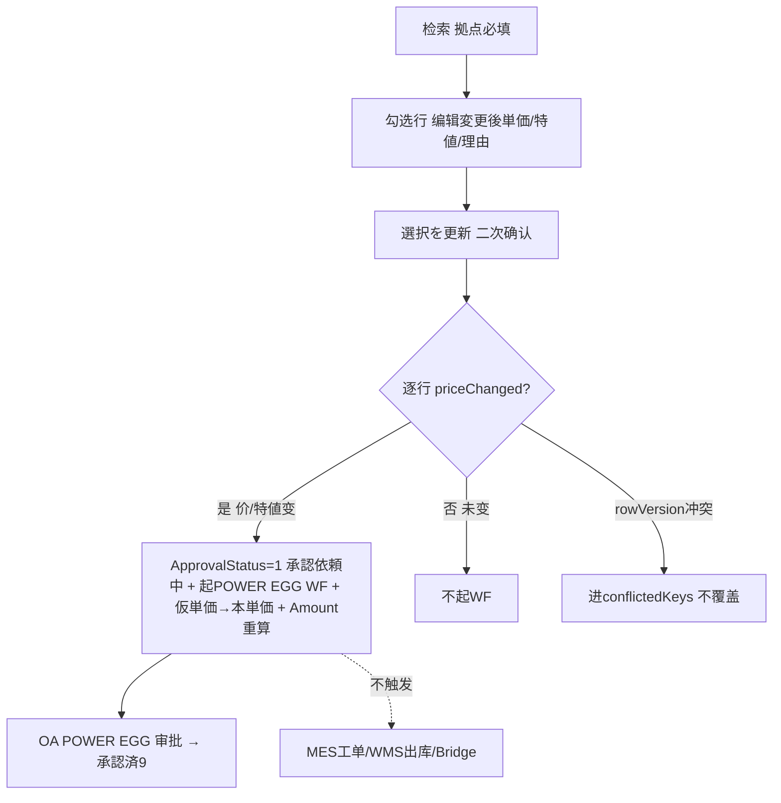

# 単価訂正 单页面操作 SOP（手把手版）

> **用途**：给**业务用户照着点、培训老师照着讲、测试人员照着拆用例**的单页面手册。比模块总册更细、更口语。
> **页面**：単価訂正（MSBBPA090 · 销售管理 MSBB · 模块总册 §5.9）　**前端**：`views/erp/OrderPriceCorrectionView.vue`　**API**：`api/erp/order.ts`(`searchPriceCorrection`/`batchUpdatePrice`)　**后端**：`Erp/OrderController` → `OrderService.BatchUpdatePriceAsync`
> **基准**：分支 `feat/wfs-inbox-core`，2026-06-28，均实测真实代码（核对 `docs/codemap-erp/05-受注-order.md` §単価订正）。查不到的标 `待业务确认` / `代码未发现`。
> **样例数据**：拠点 `BASE01`、客户 `C0001`(A社)、受注 `WO20260701000001`、製品 `PRD2026070001`、個別単価変更前 `100` → 変更後 `95`。

---

## 1. 页面一句话说明

**単価訂正，就是销售在不重开受注入力的前提下，批量把一批受注明细的"単価改一改"的网格页——你按拠点等条件查出明细、勾选要改的行、直接在格子里填"変更後単価+改价理由"、一次提交；只要单价真的变了，系统就把该明细置"承認依頼中"并起一张 POWER EGG 审批流；它只改 ERP 受注金额、不碰 MES 工单和 WMS 库存。**

---

## 2. 这个页面在业务流程中的位置

```
上游(已建订单)                  本页面(批量改价网格)                     下游
──────────────         ────────────────────────────────         ────────────────────
受注入力/受注一覧 ──→  単価訂正 MSBBPA090                          POWER EGG WF 审批
 (已有受注明细)         检索(拠点必填)→勾选行→                      ↑ 承認依頼中→承認済
                       填変更後単価+特値+改价理由→批量提交           受注金额更新(Amount重算)
                       priceChanged→起WF+ApprovalStatus=1          注文追溯(无Bridge事件)
                       仮単価→本単価确定                            财务AR(改价影响应收`待确认`)
                       ✗不触发MES/WMS Bridge
```

- **上游**：受注入力/受注一覧已建好的受注明细。
- **本页面**：按拠点(必填)等条件查出明细→勾选→格子里改"変更後個別/セット単価+特値+改价理由"→一次批量提交。
- **下游**：① 改了价的明细置"承認依頼中"并**起 POWER EGG 审批流**(到 OA 待办去审)；② 受注金额按新单价重算；③ 仮単価被改后转"本単価"(确定)。
- **关键认知**：① **只起 POWER EGG WF 审批，绝不触发 MES/WMS Bridge**——和受注入力保存(会起工单/出库)根本不同；② **必须先勾选行才能编辑**该行的変更後単価/特値/理由；③ 批量提交带**行级 rowVersion 乐观锁**，冲突的行进 `conflictedKeys` 不阻断其他行；④ **拠点(baseCd)是检索必填**。

---

## 3. 谁使用这个页面

| 角色 | 使用目的 | 常用操作 | 权限要求 | 注意事项 |
|---|---|---|---|---|
| 销售/营业担当 | 批量调订单单价 | 检索、勾选、改价、提交 | 改价权限(`[Authorize]`，细粒度`待业务确认`) | 改价起审批 |
| 销售主管/审批人 | 审改价申请 | (到OA)审 POWER EGG WF | WF审批权限 | 本页不审，去待办 |
| 内勤 | 把仮単価确定为本単価 | 勾仮単価行改价提交 | 改价权限 | onlyProvisional筛选 |
| 财务 | 关注改价对应收影响 | (只读)看金额 | 查看 | AR影响`待确认` |
| 测试/UAT | 验批量改价/WF/乐观锁 | 全流程 | 登录 | 拠点必填/冲突 |

> 📌 **权限现状**：`OrderController` 标 `[Authorize]`；改价细粒度操作点授权 `待业务确认`。

---

## 4. 操作前准备（不准备好，下面会卡住）

| 准备项 | 为什么需要 | 不满足会怎样 | 去哪里维护/确认 | 测试关注点 |
|---|---|---|---|---|
| 填拠点(baseCd) | 检索必填 | 提示拠点未指定(E10022) | 检索框输拠点 | E10022 |
| 系统已有受注明细 | 才有可改的行 | 查询空(E10008) | 先建受注 | 空结果 |
| 改价范围(条件)合理 | 范围过大被截断 | E10013件数上限 | 缩小条件 | E10013 |
| 改价理由想好 | 审计/审批依据 | (后端校验`待确认`) | 业务确认 | 理由 |
| 了解改价要走审批 | 改价非即时生效 | 误以为改完即定 | 知道起WF | 审批认知 |
| 区分改价≠改数量/改产品 | 本页只改单价/特値 | 想改别的项 | 去受注入力 | 范围 |

---

## 5. 页面区域说明

| 区域 | 页面位置 | 用户要做什么 | 注意事项 |
|---|---|---|---|
| 检索条件区 | 顶部 | 填拠点(必填)/客户区间/受注日/手配NO/製品/品名/数量·金额区间/仮単価のみ | 拠点必填 |
| 工具按钮区 | 检索区内 | 検索 / クリア / 選択を更新(N) | 选0行时"更新"禁用 |
| 统计区 | 列表上方 | 看合计件数 + 选中件数 | — |
| 结果网格 | 中部表格 | 看状态/単価前后/勾选/改价 | 选中行才可编辑格子 |
| 単価変更格 | 网格内 | 填変更後個別/セット単価、特値、改价理由 | 仅选中行可编辑 |
| 分页区 | 列表下方 | 翻页/改每页 | 50/100/200 |
| 确认弹窗 | 提交时 | "N件単価訂正実行确认" | 二次确认 |

---

## 6. 字段填写说明（口语版）

### 6.1 检索条件（怎么填）

| 字段 | 字段名 | 怎么填 | 必填 | 注意 |
|---|---|---|---|---|
| 拠点 | `baseCd` | 输据点码 | **是** | 空→E10022 |
| 売上担当 | `salesPersonCd` | 输担当 | 否 | — |
| 得意先(从~至) | `customerCd~customerCdTo` | 客户区间 | 否 | FROM≤TO |
| 受注日(从~至) | `orderDateFrom/To` | 日期范围 | 否 | FROM≤TO(E10036) |
| 納期(从~至) | `deliveryDateFrom/To` | 日期范围 | 否 | FROM≤TO |
| 手配NO1 | `haibaiNo1` | 手配号 | 否 | — |
| 注文書NO | `orderSheetNo` | 客户订单号 | 否 | — |
| 製品CD | `productCd` | 产品 | 否 | — |
| 顧客品名 | `customerItemName` | 品名 | 否 | — |
| 数量(从~至) | `qtyFrom/To` | 数量区间 | 否 | FROM≤TO(E10036) |
| 金額(从~至) | `amountFrom/To` | 金额区间 | 否 | FROM≤TO(E10036) |
| 仮単価のみ | `onlyProvisional` | 勾=只看仮単価 | 否 | 筛仮単価 |

### 6.2 结果网格列（怎么看/怎么改）

| 列 | 含义 | 可改 | 注意 |
|---|---|---|---|
| 选择框 | 勾选要改的行 | — | **勾了才能编辑该行格子** |
| 状態 `approvalStatus` | 未 / 承認依頼中(1) / 承認済(9) | 否 | 改价后置1 |
| 得意先CD/名·担当·注文書NO·手配NO1·製品CD·品名 | 订单信息 | 否 | 定位 |
| 受注日/客先納期/数量/単位 | 订单数量信息 | 否 | — |
| 個別単価(変更前) `individualUnitPriceBefore` | 改前个别单价 | 否 | 对照 |
| セット単価(変更前) `setUnitPriceBefore` | 改前套件单价 | 否 | 对照 |
| **個別単価(変更後)** `individualUnitPriceAfter` | 改后个别单价 | 是(选中) | 初值=变更前 |
| **セット単価(変更後)** `setUnitPriceAfter` | 改后套件单价 | 是(选中) | 初值=变更前 |
| 特値 `specialPriceFlg` | 特价标志 | 是(选中) | 0/1 |
| 仮単価 `provisionalPriceFlg` | 仮单价(橙⚠图标) | 否 | 改价后转本単价 |
| 単価変更理由 `priceChangeReason` | 改价原因 | 是(选中) | 审计/审批 |
| 金額 `amount` | 行金额 | 否(自动) | 提交后按新价重算 |

> 📌 **变更後单价初值=变更前**(后端 SearchPriceCorrectionsAsync 把 `...After` 初始化为 Before)，你只需改要变的行。

---

## 7. 按钮操作说明

| 按钮 | 何时点 | 系统做什么 | 成功后 | 失败处理 | 测试关注点 |
|---|---|---|---|---|---|
| 検索 | 填好条件 | 调 searchPriceCorrection(拠点必填) | 网格出结果+合计件数 | 拠点空→E10022；0件→E10008；超上限→E10013 | 检索/必填 |
| クリア | 重查 | 清条件(留分页)+清结果+清选中 | 条件清空 | — | 重置 |
| (勾选行) | 要改某些行 | 选中→该行変更後単価/特値/理由可编辑 | 选中件数Tag、格子可编辑 | — | 选中才可改 |
| 選択を更新(N) | 改完要提交 | 二次确认→batchUpdatePrice(选中行after价/特値/理由/rowVersion) | "更新X件/WF起票Y件"，有冲突列keys，重查 | 选0行禁用→E10009；409冲突→conflictedKeys | 批量/WF/冲突 |
| (分页) | 翻页/改每页 | 重查 | 翻页 | — | 50/100/200 |

> ⚠️ **提交逻辑**：对每个选中行，只要 個別/セット単価 或 特値 真的变了(priceChanged)，就把该明细置 `承認依頼中`(ApprovalStatus=1) 并**起一张 POWER EGG 审批流**(无金额阈值，任何变化都起票)；同时 `仮単価→本単価(ProvisionalPriceFlg=false)`、金额按新单价重算。没变的行不起WF。
> ⚠️ **只起 POWER EGG WF，不触发 MES/WMS Bridge**——改价不会去碰工单/出库(与受注入力保存不同)。
> ⚠️ **POWER EGG WF 当前为 NoOp 桩**(`NoOpPowerEggWorkflowService` 仅写日志，真实 HTTP 对接需实环境 DI 差替)→ ApprovalStatus 会置 1，但实际审批流转 `待实环境对接`；承認后经 MSLAB0020 批处理反映至 mcframe7/财务。
> ⚠️ **不拦已出荷**：改价检索/提交**没有 ShipStatus 过滤**——已出荷/已确定订单也能改价(与受注一覧"取消"的已出荷拦截不同)。

---

## 8. 标准业务操作 SOP（照着点）

### 场景一：批量下调一批订单单价并起审批（主流程）
- **业务背景**：A社谈了降价，要把本月若干订单的个别单价从 100 改到 95。
- **使用样例数据**：拠点 BASE01、客户 C0001、受注日本月；個別単価 100→95；理由"客户降价协议"。
- **前置条件**：① 登录有改价权限；② 有受注明细。
- **详细操作步骤**：
  1. 打开【销售管理 → 単価訂正】。
  2. 填【拠点】BASE01(必填)、【得意先】C0001、【受注日】本月。
  3. 点【検索】→ 网格出明细、看合计件数。
  4. 勾选要改的行(可多选)。
  5. 在选中行的【個別単価(変更後)】填 95，【単価変更理由】填"客户降价协议"。
  6. 点【選択を更新(N)】→ 弹"N件単価訂正実行"确认→确定。
  7. 看提示"更新:X件 / WF起票:Y件"；若有冲突看 keys。
  8. 到【OA 待办/POWER EGG】审这批改价申请。
- **完成后检查**：① 提示更新件数；② 改了的行状态=承認依頼中；③ 金额按 95 重算；④ OA 有对应审批；⑤ 注文追溯**无**改价 Bridge 事件(本页不起Bridge)。
- **异常处理**：拠点空→E10022；0件→E10008；冲突行→conflictedKeys(刷新重做这些行)。
- **可拆测试用例**：TC-M04-PC-001~008、020。

### 场景二：把仮単価确定为本単価
- **业务背景**：之前下单时是仮単価，现在价格定了要确定。
- **使用样例数据**：勾【仮単価のみ】筛出仮単価明细。
- **前置条件**：有仮単価明细。
- **详细操作步骤**：
  1. 检索时勾【仮単価のみ】+拠点→検索。
  2. 网格里仮単価行有橙色⚠图标。
  3. 勾选这些行，填確定后的単価+理由。
  4. 提交→ 系统把 ProvisionalPriceFlg 置 false(转本単価)，价变则起WF。
- **完成后检查**：① 仮単価标记消失(转本単価)；② 价变的起审批；③ 金额重算。
- **异常处理**：同场景一。
- **可拆测试用例**：TC-M04-PC-009/010/021。

### 场景三：只改特値标志（不改数字单价）
- **业务背景**：把某些行标记/取消"特値"。
- **使用样例数据**：勾行改特値。
- **前置条件**：有明细。
- **详细操作步骤**：1) 检索→勾行；2) 改【特値】勾选(0/1)，単价不动；3) 提交。
- **完成后检查**：① 特値变化也算 priceChanged→起WF、置承認依頼中；② 没改任何价/特値的行不起WF。
- **异常处理**：同上。
- **可拆测试用例**：TC-M04-PC-011/012。

### 场景四：批量提交遇并发（两种情形要分清）
- **业务背景**：有人同时动了其中几行。
- **使用样例数据**：选中多行，其中部分被他人删/改。
- **前置条件**：并发场景。
- **详细操作步骤**：
  1. 检索→选多行→改价→提交。
  2. **情形A·明细已被删/找不到**：这些行进 `conflictedKeys`、其余照常更新，整体返回成功并列出 conflictedKeys。
  3. **情形B·rowVersion 真冲突**(行还在但被他人改过)：SaveChanges 检测到→抛 `DbUpdateConcurrencyException`→**整批 409(W10002)回滚**(本次提交全部不生效)。
  4. 看提示：A 情形"更新X件 + 競合:keys"；B 情形 409 排他错误。
  5. 重新检索拉最新，再重做。
- **完成后检查**：① A：非冲突行已更新、conflictedKeys 列出找不到的；② B：整批回滚、需重查重做；③ 重查后基于最新值。
- **异常处理**：A 对 conflictedKeys 行确认是否被删；B 整批刷新后重做。
- **可拆测试用例**：TC-M04-PC-013/022/023。

### 场景五：检索边界与空结果
- **业务背景**：条件填得太宽/太窄/区间倒置。
- **使用样例数据**：受注日/数量/金额 FROM>TO；或极宽条件。
- **前置条件**：—。
- **详细操作步骤**：
  1. 不填拠点直接检索→E10022。
  2. 受注日 FROM>TO→E10036。
  3. 极宽条件→可能 E10013 件数上限。
  4. 不存在条件→E10008 空结果。
- **完成后检查**：① 各错误码正确提示；② 不会崩。
- **异常处理**：按提示调条件。
- **可拆测试用例**：TC-M04-PC-024/025/026/027。

### 场景六：确认改价不触发 MES/WMS（与受注入力区别）
- **业务背景**：核对改价只动金额、不动生产/库存。
- **使用样例数据**：已改价的订单。
- **前置条件**：改价已提交。
- **详细操作步骤**：
  1. 改价提交后，到【注文追溯】输该受注号。
  2. 确认时间线**没有**因改价产生的 MES/WMS Bridge 事件。
  3. 到 MES 工单/WMS 出库确认未因改价变化。
- **完成后检查**：① 注文追溯无改价相关 Bridge 事件；② 工单/出库不变；③ 仅 ERP 受注金额变。
- **异常处理**：若误期望联动→属正常(本页只起 POWER EGG WF)。
- **可拆测试用例**：TC-M04-PC-028/029。

---

## 9. 状态变化说明

> 改价后明细进入 POWER EGG 审批；状态由 `approvalStatus` 表示。本页只"起票"，审批在 OA。

| 状态 | 用户看到 | 含义 | 谁处理 | 下一步 |
|---|---|---|---|---|
| 未(0/空) | 灰 Tag | 未改/未起审批 | — | 可改价 |
| 承認依頼中(1) | 橙 Tag | 改价已提交、POWER EGG 审批中 | 审批人(OA) | 审批 |
| 承認済(9) | 绿 Tag | 审批通过 | — | 价生效 |
| 仮単価 | 橙⚠图标 | 单价暂定 | — | 改价→转本単価 |



---

## 10. 按钮不可用 / 灰色 / 不出现原因

| 按钮/字段 | 何时不可用 | 为什么 | 怎么处理 | 测试关注点 |
|---|---|---|---|---|
| 選択を更新 | 未选任何行 | 无目标(selectedRows=0) | 先勾行 | 选0禁用 |
| 行内変更後単价/特値/理由 | 该行未勾选 | 只允许选中行编辑 | 先勾该行 | 选中才可改 |
| 検索 | 拠点空 | 拠点必填 | 填拠点 | E10022 |
| 仮単価列 | 任意 | 只读标志(橙⚠) | 改价后自动转 | — |
| 状態/金額列 | 任意 | 系统态/自动算 | — | — |

---

## 11. 常见错误与处理

| 错误/提示 | 可能原因 | 用户处理方法 | 是否需要管理员 | 测试关注点 |
|---|---|---|---|---|
| E10022 拠点未指定 | 检索没填拠点 | 填拠点再检索 | 否 | 必填 |
| E10008 0件 | 条件无匹配 | 放宽条件 | 否 | 空结果 |
| E10013 件数上限 | 检索结果过多 | 缩小条件 | 否 | 截断 |
| E10036 FROM>TO | 日期/数量/金额区间倒置 | 调正范围 | 否 | 边界 |
| E10009 未选择 | 没勾行就提交 | 先勾行 | 否 | 无选择 |
| W10002 整批冲突(409) | 行被他人先改(rowVersion真冲突)→整批回滚 | 刷新重做整批 | 否 | 乐观锁 |
| conflictedKeys 列出某些行 | 这些明细已被删/找不到(非rowVersion冲突) | 确认是否被删 | 否 | 明细不存在 |
| 改完没生效 | 改价要审批(承認依頼中)；且WF当前NoOp桩 | 去OA审；实环境对接前流转`待实环境` | 是(审批人) | 审批/NoOp |
| 想改数量/产品改不了 | 本页只改单价/特値 | 去受注入力改 | 否 | 范围 |
| 期望联动MES没动 | 改价不起Bridge | 属正常 | 否 | 不动MES |
| 已出荷订单也能改价 | **本页无ShipStatus拦截** | 业务上注意已出荷改价影响(`待业务确认`) | 是(业务) | 不拦已出荷 |
| 改价理由没填也能提交 | 改价理由**前后端均非必填** | 建议仍填(审计) | 否 | 理由可选 |
| 权限不足 | 无改价权限 | 申请权限 | 是 | 权限`待确认` |
| 改价对应收没动 | **无AR/财务自动回写(代码未发现)**；经承認→MSLAB0020批→mcframe7 | 与财务确认反映路径 | 是(财务) | AR无自动回写 |

---

## 12. 操作完成后的检查清单

| 操作 | 当前页面检查 | 受注一覧/详情检查 | 注文追溯检查 | MES/WMS检查 | OA/财务检查 | 测试关注点 |
|---|---|---|---|---|---|---|
| 检索 | 结果符合条件、合计件数对 | — | — | — | — | 条件 |
| 批量改价提交 | 更新件数、状态承認依頼中 | 受注金额按新价 | **无改价Bridge事件** | **工单/出库不变** | OA有审批/AR影响`待确认` | 改价 |
| 仮単価确定 | 仮单价标记消失 | 本单价确定 | — | — | — | 仮→本 |
| 冲突行 | conflictedKeys列出 | 冲突行未变 | — | — | — | 乐观锁 |

> 📌 **核心区别**：受注入力保存会触发 MES/WMS(去注文追溯能看到Bridge事件)；**単価訂正只起 POWER EGG WF 审批，注文追溯不会有改价相关Bridge事件**。

---

## 13. 页面级测试用例（≥25 条，可执行）

> 编号 `TC-M04-PC-xxx`；数据用样例。测试人员补"实际结果/是否通过/缺陷编号"。

| 用例编号 | 用例名称 | 优先级 | 前置条件 | 测试数据 | 操作步骤 | 预期结果 | 备注 |
|---|---|---|---|---|---|---|---|
| TC-M04-PC-001 | 页面打开 | P1 | 有权限 | — | 进入 | 检索区+空网格 | — |
| TC-M04-PC-002 | 拠点必填 | P0 | — | 不填拠点 | 検索 | E10022 | 必填 |
| TC-M04-PC-003 | 按拠点+客户检索 | P0 | 有数据 | BASE01+C0001 | 検索 | 网格出明细+合计件数 | 检索 |
| TC-M04-PC-004 | 仮単価のみ筛选 | P1 | 有仮単価 | ☑仮単価 | 検索 | 仅仮単価行(橙⚠) | 筛选 |
| TC-M04-PC-005 | 勾选才可编辑 | P0 | 有数据 | — | 未勾改格子 | 格子禁用；勾后可改 | 选中态 |
| TC-M04-PC-006 | 改个别单价提交 | P0 | 有数据 | 100→95+理由 | 勾→改→提交 | 确认弹窗→更新X件/WF起票Y件 | 主流程 |
| TC-M04-PC-007 | 改价起审批 | P0 | 改了价 | — | 提交后看状态 | 改行=承認依頼中(1) | WF |
| TC-M04-PC-008 | 金额重算 | P0 | 改了价 | qty×新价 | 提交后看金额 | Amount按新单价 | 重算 |
| TC-M04-PC-009 | 仮単価转本単価 | P1 | 仮単価行 | 改价 | 提交 | ProvisionalPriceFlg=false | 仮→本 |
| TC-M04-PC-010 | onlyProvisional提交 | P1 | 仮単価 | — | 筛仮単价改价 | 仮标记消失 | — |
| TC-M04-PC-011 | 只改特値 | P1 | 有数据 | 特値0→1 | 改特値不改价 | 也算priceChanged起WF | 特値 |
| TC-M04-PC-012 | 未改任何不起WF | P1 | 有数据 | 不改值 | 勾选直接提交 | 该行不起WF(wf=0) | 边界 |
| TC-M04-PC-013 | 部分行乐观锁冲突 | P0 | 并发 | 多行 | A先改→B提交 | 非冲突更新、冲突进conflictedKeys | 乐观锁 |
| TC-M04-PC-014 | 未选提交拦截 | P1 | — | 不勾 | 提交 | 按钮禁用/E10009 | 无选择 |
| TC-M04-PC-015 | 确认弹窗取消 | P2 | 选中行 | — | 提交→取消 | 不执行 | 二次确认 |
| TC-M04-PC-016 | クリア重置 | P2 | 已填条件 | — | クリア | 条件/结果/选中清空 | 重置 |
| TC-M04-PC-017 | 分页 | P1 | 多数据 | 50/100/200 | 翻页/改每页 | 数据正确 | 分页 |
| TC-M04-PC-018 | 变更後初值=变更前 | P1 | 有数据 | — | 检索后看后值 | After初值=Before | 初值 |
| TC-M04-PC-019 | 多行批量 | P1 | 多数据 | 勾多行 | 批量改 | 多行一次更新 | 批量 |
| TC-M04-PC-020 | 套件单价一括 | P2 | セット订单 | NO.1'套件 | 改セット单价 | 同WebOrderNo全明细更新 | 套件一括 |
| TC-M04-PC-021 | 状态Tag颜色 | P2 | 各状态 | — | 看状态列 | 未灰/依頼中橙/承認済绿 | UI |
| TC-M04-PC-022 | 冲突keys提示 | P1 | 冲突 | — | 提交 | warning列conflictedKeys | 冲突 |
| TC-M04-PC-023 | 冲突后重做 | P1 | 冲突过 | — | 刷新重做冲突行 | 基于最新成功 | 恢复 |
| TC-M04-PC-024 | 空结果 | P1 | — | 不存在条件 | 検索 | E10008 | 空 |
| TC-M04-PC-025 | 受注日FROM>TO | P2 | — | 倒置 | 検索 | E10036 | 边界 |
| TC-M04-PC-026 | 数量/金额FROM>TO | P2 | — | 倒置 | 検索 | E10036 | 边界 |
| TC-M04-PC-027 | 件数上限 | P2 | 海量 | 极宽条件 | 検索 | E10013 | 截断 |
| TC-M04-PC-028 | 不触发MES | P0 | 改价后 | WO号 | 查注文追溯 | 无改价Bridge事件 | 不动MES |
| TC-M04-PC-029 | 工单/出库不变 | P1 | 改价后 | WO号 | 查MES/WMS | 工单/出库不变 | 不动MES |
| TC-M04-PC-030 | AR影响 | P2 | 改价后 | — | 查应收 | AR回写`待业务确认` | 下游 |
| TC-M04-PC-031 | 权限不足 | P2 | 无权账号 | — | 改价 | `待业务确认`(隐藏/拒绝) | 权限 |
| TC-M04-PC-032 | 网络异常 | P2 | 断网 | — | 检索/提交 | 友好错误可重试 | 异常 |
| TC-M04-PC-033 | 已出荷可改价 | P1 | 已出荷订单 | ShipStatus≥5 | 检索→改价提交 | 不拦截、可改(无ShipStatus过滤) | 不拦已出荷 |
| TC-M04-PC-034 | 改价理由可选 | P2 | 有数据 | 不填理由 | 勾行改价不填理由提交 | 允许提交(非必填) | 理由可选 |
| TC-M04-PC-035 | rowVersion冲突整批回滚 | P0 | 行被他人改 | 旧rowVersion | A改→B提交 | 整批409 W10002回滚 | 乐观锁整批 |

---

## 14. 培训讲解建议

| 讲解顺序 | 讲什么 | 演示动作 | 用户容易误解的点 |
|---|---|---|---|
| 1 | 这页是批量改价网格(不重开受注) | 展示 §2 流程图 | 以为要逐单进受注入力改 |
| 2 | 拠点必填+条件检索 | 演示E10022 | 忘填拠点 |
| 3 | 勾选才能编辑该行 | 勾/不勾对比 | 直接改格子改不动 |
| 4 | 改価后起POWER EGG审批 | 提交看承認依頼中 | 以为改完即生效 |
| 5 | 仮単価→本単価 | 筛仮単价改价 | 不懂仮単価 |
| 6 | 不触发MES/WMS(关键区别) | 改价后看注文追溯无Bridge | 期望联动生产 |
| 7 | 批量乐观锁冲突 | 制造冲突看keys | 以为全成功 |
| 8 | 改价≠改数量/产品 | 对比受注入力 | 想在此改别的 |

---

## 15. 与模块级手册的关系

本单页 SOP 对应模块总册 `docs/manuals/user-training/01-销售管理MSBB-最详细用户操作培训手册.md`：

| 本SOP章节 | 对应总册章节 |
|---|---|
| §1/§2 定位与流程 | 总册 §3、§5.9.1 |
| §4 操作前准备 | 总册 §5.9.1a |
| §6 字段(检索/网格) | 总册 §5.9.1b + §5.9.5/5.9.6 |
| §7 按钮 | 总册 §5.9.9 |
| §8 SOP | 总册 §5.9.1e |
| §9 状态(审批/仮単価) | 总册 §5.9.10 |
| §10 灰按钮 | 总册 §5.9.1c |
| §12 完成后检查 | 总册 §5.9.1d |
| §13 测试用例 | 总册 §7.1 |
| §14 培训讲解 | 总册 §13 |

> 配套：上游 `01-07-受注入力`/`01-08-受注一覧`(订单来源)、`01-10-注文追溯`(验证不起Bridge)。

---

## 16. 代码与文档来源

| 类型 | 路径 | 用途 |
|---|---|---|
| 前端页面 | `cp6.web/src/views/erp/OrderPriceCorrectionView.vue` | 检索/网格/勾选改价/批量提交 |
| API | `cp6.web/src/api/erp/order.ts`(`searchPriceCorrection`/`batchUpdatePrice`) | 查询/批量改价 |
| 类型 | `cp6.web/src/types/erp/order.ts`(OrderPriceCorrectionQueryDto/ItemDto/UpdateDto/BatchResultDto) | DTO(updatedCount/wfRequestedCount/conflictedKeys) |
| 路由 | `cp6.web/src/router/index.ts`(`/order-price-correction`) | 路径 |
| 后端 Controller | `CP6.WebApi/Controllers/Erp/OrderController.cs`(`GET /orders/price-correction/list`、`PUT /orders/price-correction/batch`，409 W10002) | 端点 |
| Service | `CP6.Core/Services/Erp/OrderService.cs`(`SearchPriceCorrectionsAsync`/`BatchUpdatePriceAsync`/`PostPowerEggWorkflowAsync`) | 检索/批量改价/起WF |
| WF服务 | `CP6.Core/Services/Erp/IPowerEggWorkflowService.cs`(`RequestPriceCorrectionAsync`；当前 `NoOpPowerEggWorkflowService` 仅日志) | 起票POWER EGG(NoOp桩) |
| 实体 | `CP6.Entity/DomainModels/Erp/Order.cs`(IndividualUnitPrice/SetUnitPrice/SpecialPriceFlg/ProvisionalPriceFlg/ApprovalStatus/Amount) | 受注明细单价/状态 |
| 模块总册 | `docs/manuals/user-training/01-销售管理MSBB-最详细用户操作培训手册.md` | 上级手册 §5.9 |
| 逐行源码手册 | `docs/codemap-erp/05-受注-order.md`(§単価订正 PA090) | 代码级实现(批量改价/起WF/不动MES 实证) |
| 页面盘点表 | `docs/manuals/user-training/00-用户操作手册页面盘点表.md` | 页面索引(序号9) |

---

## 最后更新来源

- 代码：见 §16（OrderPriceCorrectionView + order.ts/types 实测；后端以 `docs/codemap-erp/05-受注-order.md` §単価订正 2026-06-22 实测为据：BatchUpdatePriceAsync 起 POWER EGG WF、ProvisionalPriceFlg=false、Amount重算、行级rowVersion、conflictedKeys）
- 文档：模块总册 §5.9(待补)、`docs/codemap-erp/05-受注-order.md`、页面盘点表
- 基准：分支 `feat/wfs-inbox-core`，盘点日 2026-06-28
- 诚实标注(经 Explore 核对)：**単価訂正只起 POWER EGG WF，不触发 MES/WMS Bridge**(实证)；**POWER EGG WF 当前为 NoOp 桩(仅日志，真实HTTP待实环境DI)**；改价理由**前后端均非必填**(可选)；**无ShipStatus拦截→已出荷也能改价**；**无AR/财务自动回写(代码未发现)**，反映经承認→MSLAB0020批→mcframe7；conflictedKeys=明细不存在 vs rowVersion真冲突→整批409；已出荷改价/AR反映的业务口径与细粒度权限 `待业务确认`
</content>
