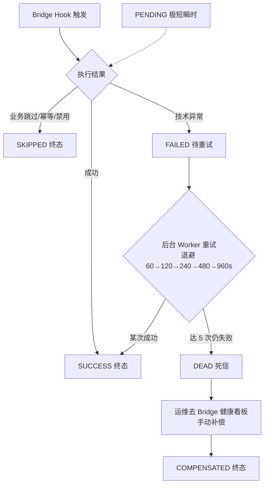

# 注文追溯 单页面操作 SOP（手把手版）

> **用途**：给**业务/运维用户照着点、培训老师照着讲、测试人员照着拆用例**的单页面手册。比模块总册更细、更口语。
> **页面**：注文追溯（销售管理 MSBB · 模块总册 §5.10）　**前端**：`views/erp/OrderTraceView.vue`　**API**：`api/erp/orderTrace.ts`　**后端**：`Erp/OrderTraceController` → `OrderTraceService`
> **基准**：分支 `feat/wfs-inbox-core`，2026-06-28，均实测真实代码。查不到的标 `待业务确认` / `代码未发现`。
> **样例数据**：沿用模块总册 §0 —— 客户 `C0001`(A社)、製品 `PRD2026070001`、受注号 `WO20260701000001`（系统采番）、对应工单 `MO...`、出库号 `OB...`、拠点 `BASE01`。

---

## 1. 页面一句话说明

**注文追溯，就是把"一张受注单从受注 → MES 工单 → WMS 出库 → 出荷回写"这条跨模块联动链上发生的每一次 Bridge 事件，按时间线一条条摊给你看的"病历表"页；它是只读诊断页——只查不改，上面的成功/失败/死信数字告诉你"这张订单的联动有没有出问题"，真正的"补偿/重放"动作不在这页做，而是去 Bridge 健康看板(M07)。**

---

## 2. 这个页面在业务流程中的位置

```
上游(事件来源)                         本页面                       下游(发现失败后去哪)
──────────────────────────       ─────────────────         ────────────────────────
受注入力/受注一覧(订单)                注文追溯                    ① 看明白链路→无需动作
  保存/取消时触发 Bridge Hook ──→     (按 Web受注NO            ② 发现 FAILED→等 Worker 自动重试
MES 工单展开/発行/完工        ──→      聚合事件时间线,          ③ 发现 DEAD(死信)→去【Bridge健康看板】
WMS 出库指示/拣货/出荷確定    ──→      只读, 不改数据)             /wms/bridge-health 做手动补偿
  每一步写一条 IntegrationEvent
```

- **上游（事件是怎么来的）**：受注、工单、出库这些单据在关键节点（建单/発行/完工/出荷/取消）会调用 **Bridge Hook**，每调用一次就往 `T_IntegrationEvent` 表写一条事件记录（成功/跳过/失败）。本页**不产生**事件，只是把它们**读出来按时间线展示**。
- **本页面**：输入一个 **Web受注NO**，后端把这张订单**及其衍生的工单号、出库号**全找出来，再把这些单号相关的所有 Bridge 事件按时间排好，配上"成功/失败/死信"统计，画成时间线给你看。
- **下游/跳转**：本页**只读**。看到红色的 **FAILED/DEAD** 时——`FAILED` 一般由后台 Worker 自动重试（最多 5 次、退避 60→120→240→480→960 秒）；重试用尽变 **DEAD（死信）**，才需要人工，去 **Bridge 健康看板(`/wms/bridge-health`)** 点"补偿"把它标成 `COMPENSATED`。
- **关键认知**：① **这页不能改任何东西**（没有任何写按钮）；② 它和"受注一覧的取消"、"Bridge 健康看板的补偿"是三回事——追溯=看、取消=撤单、补偿=运维兜底；③ 时间线一行 = 一次 Bridge Hook 调用，`源模块 → 目标模块 + Hook 名` 告诉你"谁通知了谁"。

---

## 3. 谁使用这个页面

| 角色 | 使用目的 | 常用操作 | 权限要求 | 注意事项 |
|---|---|---|---|---|
| 销售人员 | 确认这张单的工单/出库有没有正常联动起来 | 查询、看时间线 | 登录即可(`[Authorize]`，细粒度`待业务确认`) | 只读，看不懂的红条找运维 |
| 生产计划员 | 受注为什么没展开成工单？ | 查询、看 ERP→MES 事件状态 | 登录 | 看 `OnOrderCreatedAsync(ERP→MES)` 那条 |
| 仓库人员 | 出荷为什么没回写 ERP？ | 查询、看 WMS→ERP 事件 | 登录 | 看 `OnShipmentConfirmedAsync` 那条 |
| 运维/IT 支持 | 排障：哪条 Hook 失败、失败原因 | 查询、按链分组、复制 CorrelationId、读 message | 登录 | 死信去 Bridge 健康看板补偿 |
| 测试/UAT 人员 | 验证闭环 E2E 是否全 SUCCESS | 查询、核对 summary 数字 | 登录 | 失败数应为 0 |
| 客服/主管 | 向客户解释订单卡在哪一环 | 查询、看时间线 | 登录 | 不在本页处理，转对应模块 |

> 📌 **权限现状**：后端 `OrderTraceController` 仅标 `[Authorize]`（登录即可访问），**未见**按操作点的细粒度授权 → 是否要限定到"销售/运维"角色标 `待业务确认`。

---

## 4. 操作前准备（不准备好，下面会卡住）

| 准备项 | 为什么需要 | 不满足会怎样 | 去哪里维护/确认 | 测试关注点 |
|---|---|---|---|---|
| 手上有一个正确的 Web受注NO | 本页按受注号查 | 输错查不到(404) | 受注一覧复制，或点"追溯"带过来 | 号错→404 |
| 该订单确实已建过（未被物理删） | 找不到订单直接 404 | 提示订单不存在 | 受注一覧确认订单在 | 已删/不存在 |
| 想看联动事件，得订单已经"动过" | 刚建还没跑 Hook 时时间线可能为空 | 时间线空白 | 等几秒/确认 Bridge 已启用 | 空时间线 |
| 看懂"成功/失败/死信"的含义 | 否则看到红条不知所措 | 误判/误操作 | 见本 SOP §9 状态表 | 状态理解 |
| 死信要补偿的，有 Bridge 健康看板权限 | 补偿不在本页 | 看到死信无从下手 | 去 `/wms/bridge-health` | 补偿入口 |
| 知道 Bridge 是否被禁用 | 禁用时事件会是 SKIPPED 而非真的跑了 | 误以为联动成功 | appsettings `*Bridge:Enabled` | Skipped 语义 |

---

## 5. 页面区域说明

| 区域 | 页面位置 | 用户要做什么 | 注意事项 |
|---|---|---|---|
| 标题与检索条 | 顶部 | 输 Web受注NO、点检索、点刷新(圆形🔄) | 回车=检索 |
| 订单摘要卡 | 检索条下（查到才显示） | 看受注号/客户名/受注日 | 无结果时不显示此卡 |
| KPI 统计条 | 摘要卡右侧 | 看 总事件/成功/失败/死信/链路数 | 失败>0、死信>0 显红 |
| 时间线面板头 | 摘要卡下方 | 看 `BRIDGE_HOOK` 标签 + （事件>20时）"按关联链分组"开关 | 开关仅在事件多时出现 |
| 时间线主体 | 面板内 | 逐条看事件：模块路由/Hook 名/单号/状态/消息 | 一行=一次 Hook 调用 |
| 关联链分组(可选) | 事件>20 时折叠分组 | 按 CorrelationId 折叠展开看每条业务链 | 默认展开前 3 组 |
| 空状态 | 无事件时 | 看到"暂无事件"空图 | 订单存在但没联动事件时出现 |

---

## 6. 字段填写说明（口语版：查询怎么填 + 时间线怎么看）

### 6.1 查询条件字段（怎么填）

| 字段 | 用户怎么填 | 示例 | 是否必填 | 数据来源 | 填错/注意 | 测试关注点 |
|---|---|---|---|---|---|---|
| Web受注NO `webOrderNo` | 输完整受注号，回车或点检索 | WO20260701000001 | 是(空则不查) | 受注一覧复制/跳转带入 | 号错→404；首尾空格会被 trim | 必填/404/空格 |

> 📌 本页**只有一个查询框**（Web受注NO）。从受注一覧点"追溯"进来时，受注号通过 URL `?webOrderNo=...` 自动带入并立即查询，无需手输。

### 6.2 KPI 统计条（怎么看）

| 指标 | 业务含义 | 怎么看 | 异常信号 |
|---|---|---|---|
| 总事件 `totalEvents` | 这张单相关的 Bridge 事件总条数 | 数字 | 0=没联动过(见§11) |
| 成功 `successCount` | 状态=SUCCESS 的条数 | 绿色 | — |
| 失败 `failedCount` | 状态=FAILED 的条数 | **>0 显红** | >0=有事件待重试 |
| 死信 `deadCount` | 状态=DEAD 的条数 | **>0 显红** | **>0=需人工补偿** |
| 链路数 `distinctChains` | 不同 CorrelationId 的数量(几条业务链) | 黄色 | 正常 1 条订单≈1~数条链 |

### 6.3 时间线每行（怎么看）

| 元素 | 业务含义 | 怎么看 | 注意 |
|---|---|---|---|
| 时间戳 `eventTime` | 事件发生时间 | 行左侧 | 按时间升序排 |
| 源模块→目标模块 | 谁通知了谁(ERP/MES/WMS) | 两个标签+箭头 | 区分同名 Hook 的关键 |
| Hook 名 `hookName` | 哪一类联动 | 加粗文字 | 见下方 Hook 速查表 |
| 单号 `sourceNo → targetNo` | 源单号→目标单号(成功时填) | 中部 | 目标为空=未生成下游单 |
| 状态标签 `status` | 成功/跳过/失败/死信/补偿 | 右上彩标 | 见§9状态表 |
| 消息 `message` | 失败原因(取自 LastError) | 灰字，超80字省略+悬浮全文 | 成功时多为"-" |
| 复制按钮 | 复制 CorrelationId | 行右下 | 排障时给开发用 |

> **Hook 名速查表**（实际存的是方法名，靠"源→目标"区分同名）：

| 源→目标 | Hook 名 | 业务含义 |
|---|---|---|
| ERP→MES | `OnOrderCreatedAsync` | 受注创建 → 制造工单展开 |
| ERP→WMS | `OnOrderCreatedAsync` | 受注创建 → 出荷指示生成 |
| MES→WMS | `OnWorkOrderIssuedAsync` | 工单発行 → 材料出库指示 |
| MES→WMS | `OnProductionCompletedAsync` | 完工 → 完成品入库 |
| WMS→ERP | `OnShipmentConfirmedAsync` | 出荷確定 → ERP 累计出荷数回写 |
| WMS→ERP | `OnReturnConfirmedAsync` | RMA 返品 → 信用单 CreditNote |
| ERP→MES/WMS | `OnOrderCancelledAsync` | 受注取消 → 级联取消工单/出库 |

> 本页**没有任何编辑表单**——是纯查询+只读时间线页。

---

## 7. 按钮操作说明

| 按钮 | 用户什么时候点 | 点了以后系统会做什么 | 成功后用户看到什么 | 失败时怎么处理 | 测试关注点 |
|---|---|---|---|---|---|
| 检索 | 输好受注号要查 | 调 `GET /api/order-trace/{webOrderNo}`，URL 写入 `?webOrderNo=` 后加载 | 摘要卡+KPI+时间线 | 404→订单不存在提示 | 查询/404 |
| 刷新(圆形🔄) | 想重新拉最新事件 | 用当前框里的号重查(`reload`) | 时间线刷新 | — | 重新加载 |
| 回车 | 框里输完直接回车 | 等价于点检索 | 同检索 | — | 回车触发 |
| 按关联链分组(开关) | 事件>20想分链看 | 把时间线按 CorrelationId 折叠成多组 | 折叠分组(默认展开前3组) | — | 分组(>20才有) |
| 复制 CorrelationId | 要把链路ID发给开发排障 | 写入剪贴板 | "已复制"提示 | 剪贴板不可用→弹出ID供手抄 | 复制 |
| (悬浮)消息全文 | 失败消息被截断 | 悬浮 tooltip 显全文 | 完整错误 | — | 长消息 |

> ⚠️ **本页没有"补偿/重放/重试"按钮**：失败事件的自动重试由后台 Worker 跑；死信的手动补偿在 **Bridge 健康看板(`/wms/bridge-health`)** 的"补偿"按钮（`POST /api/bridge-health/compensate/{eventId}`）。本页只负责"看"。→ 本页补偿按钮 `代码未发现`（设计如此）。

---

## 8. 标准业务操作 SOP（照着点）

### 场景一：从受注一覧"追溯"按钮进来，确认订单联动正常
- **业务背景**：销售刚在受注入力建了单，想确认 MES 工单、WMS 出库有没有正常被触发。
- **使用样例数据**：受注号 `WO20260701000001`。
- **前置条件**：① 登录；② 该订单已建并已触发过 Bridge（建单后几秒内）。
- **详细操作步骤**：
  1. 打开【销售管理 → 受注一覧】，按条件查到 `WO20260701000001` 那一行。
  2. 点该行【追溯】→ 系统跳到注文追溯，URL 自动带 `?webOrderNo=WO20260701000001` 并立即加载。
  3. 看**订单摘要卡**：受注号/客户名(A社)/受注日是否对得上。
  4. 看 **KPI 统计条**：失败=0、死信=0 即联动健康。
  5. 看**时间线**：应能看到 `ERP→MES OnOrderCreatedAsync`（工单展开）、`ERP→WMS OnOrderCreatedAsync`（出荷指示）等条目，状态绿色 SUCCESS。
- **完成后检查**：① 摘要客户/日期=该订单；② 失败、死信均 0；③ 时间线有 ERP→MES、ERP→WMS 成功事件。
- **异常处理**：时间线空 → 见场景七；有红条 → 见场景四。
- **可拆测试用例**：TC-M04-TRACE-002/003/010/011。

### 场景二：直接输入 Web受注NO 查询（不从列表进）
- **业务背景**：运维收到工单，只知道受注号，要直接排查。
- **使用样例数据**：`WO20260701000001`。
- **前置条件**：登录；知道受注号。
- **详细操作步骤**：
  1. 打开【销售管理 → 注文追溯】（或直接访问 `/erp/order-trace`）。
  2. 在顶部【Web受注NO】框输 `WO20260701000001`。
  3. 按回车或点【检索】。
  4. URL 变成 `?webOrderNo=WO20260701000001`，下方出现摘要+时间线。
  5. 需要最新数据时点圆形【刷新】重拉。
- **完成后检查**：① 查到对应订单；② URL 已带受注号（可收藏/分享链接）。
- **异常处理**：框空点检索→不发起查询(无动作)；号错→404"订单不存在"。
- **可拆测试用例**：TC-M04-TRACE-001/004/012/013。

### 场景三：读懂一条完整闭环（全 SUCCESS）
- **业务背景**：UAT 要验证"受注→工单→材料出库→完工入库→出荷回写"整链跑通。
- **使用样例数据**：已走完整流程的订单 `WO20260701000001`。
- **前置条件**：该订单已完成出荷。
- **详细操作步骤**：
  1. 查到该订单的追溯。
  2. 自上而下逐条核对时间线（按时间升序）：
     - `ERP→MES OnOrderCreatedAsync`（受注→工单）SUCCESS，targetNo=工单号；
     - `ERP→WMS OnOrderCreatedAsync`（受注→出荷指示）SUCCESS；
     - `MES→WMS OnWorkOrderIssuedAsync`（工单発行→材料出库）SUCCESS；
     - `MES→WMS OnProductionCompletedAsync`（完工→完成品入库）SUCCESS；
     - `WMS→ERP OnShipmentConfirmedAsync`（出荷確定→回写）SUCCESS。
  3. 核对 KPI：成功数=总数、失败=0、死信=0。
  4. （事件多时）打开"按关联链分组"，确认同一 CorrelationId 串起整条链。
- **完成后检查**：① 5 类关键事件都在且 SUCCESS；② targetNo 都已回填下游单号；③ 失败/死信=0。
- **异常处理**：缺某一环 → 那一环 Hook 没触发/被 Skipped，去对应模块查；某环 FAILED → 场景四。
- **可拆测试用例**：TC-M04-TRACE-014/015/016/021。

### 场景四：发现失败/死信事件，定位原因并转去补偿
- **业务背景**：客户反映订单出荷没回写，KPI 死信=1。
- **使用样例数据**：含一条 `WMS→ERP OnShipmentConfirmedAsync` 状态 DEAD 的订单。
- **前置条件**：登录；（补偿步）有 Bridge 健康看板访问权限。
- **详细操作步骤**：
  1. 查到该订单，看到 KPI **死信** 标红=1。
  2. 在时间线找到那条红色 **DEAD** 事件。
  3. 读它的 **消息(message)**——是失败原因（取自最后一次异常），超长悬浮看全文。
  4. 点该行【复制 CorrelationId】，把链路 ID 记下。
  5. **FAILED**（非 DEAD）：一般无需动作，后台 Worker 会自动重试（最多 5 次、退避递增）；隔几分钟点【刷新】看是否转 SUCCESS。
  6. **DEAD**（死信，重试已用尽）：到【WMS → Bridge 健康看板(`/wms/bridge-health`)】，按 CorrelationId/事件找到该死信，点【补偿】把它标 `COMPENSATED`（并按消息做对应的人工修数）。
  7. 回本页【刷新】，确认该事件转为 COMPENSATED（或重试成功后 SUCCESS）。
- **完成后检查**：① 已读懂失败原因；② FAILED 等到自动重试成功 / DEAD 已在看板补偿；③ 刷新后死信数下降。
- **异常处理**：补偿后业务数据仍不对 → 按 message 做人工修正（如手工回写出荷数），再标补偿；无补偿权限→找运维。
- **可拆测试用例**：TC-M04-TRACE-017/018/019/020/026。

### 场景五：事件很多时，按关联链分组 + 复制 CorrelationId 排障
- **业务背景**：一张大单衍生多工单/多出库，时间线几十条，要顺着一条链看。
- **使用样例数据**：事件数>20 的订单。
- **前置条件**：该订单事件>20（否则不出现分组开关）。
- **详细操作步骤**：
  1. 查到该订单，时间线超过 20 条时系统**自动开启**"按关联链分组"，默认展开前 3 组。
  2. 每个折叠组标题=缩略 CorrelationId(`前8…后8`)+该链事件数。
  3. 展开目标链，顺着 ERP→MES→WMS 看这一条业务链的每一步状态。
  4. 锁定问题事件后点【复制 CorrelationId】给开发，开发可按完整 ID 在日志/库里精确捞这条链。
  5. 需要时关掉分组开关，回到全量时间线总览。
- **完成后检查**：① 分组按 CorrelationId 正确切分；② 复制的是完整 ID 非缩略；③ 链内顺序符合时间。
- **异常处理**：事件≤20 时无分组开关（属正常）；某些旧事件 CorrelationId 为空→归入"无关联"组。
- **可拆测试用例**：TC-M04-TRACE-022/023/024。

### 场景六：追溯一张被取消的订单，确认级联反向事件
- **业务背景**：受注一覧里取消了订单，要确认 MES/WMS 反向取消事件已记录。
- **使用样例数据**：已取消订单 `WO20260701000001`。
- **前置条件**：该订单已在受注一覧执行过取消（探查→强制取消）。
- **详细操作步骤**：
  1. 查到该订单追溯。
  2. 在时间线找 `OnOrderCancelledAsync`（取消级联）相关事件，看其状态。
  3. 对照受注一覧的取消结果（Cancelled/PartiallyCancelled）与这里的事件是否一致。
  4. 配合到 MES 製造指図一覧、WMS 出庫指示一覧核对实际单据状态。
- **完成后检查**：① 有取消级联事件；② 状态与取消结果吻合；③ 下游单据状态一致（详见 01-08 受注一覧 SOP §8 场景四~六）。
- **异常处理**：取消事件 FAILED/DEAD → 同场景四走补偿；本页只看，不在此重做取消。
- **可拆测试用例**：TC-M04-TRACE-025/027。

### 场景七：查不到订单 / 时间线为空，区分两种情况
- **业务背景**：运维查某单一片空白，要判断是"号错"还是"还没联动"。
- **使用样例数据**：A) 不存在的号 `WO99999999999999`；B) 刚建未跑 Hook 的订单。
- **前置条件**：登录。
- **详细操作步骤**：
  1. **情况A（订单不存在/已物理删）**：输错号→检索→提示"订单不存在"(404)，不显摘要卡。→ 核对 Web受注NO 是否正确、是否被删。
  2. **情况B（订单存在但时间线空）**：摘要卡正常显示，但时间线显示"暂无事件"空图。→ 可能：① 刚建单，Hook 还没写入（等几秒刷新）；② Bridge 被禁用，事件以 SKIPPED 落库（确认 appsettings `*Bridge:Enabled`）；③ 该订单确实未触发任何联动。
- **完成后检查**：① 能区分 404(无订单) vs 空时间线(有订单无事件)；② 情况B 刷新后事件出现/确认确属 Skipped。
- **异常处理**：长时间仍空且应有事件 → 查 Bridge 配置与后台 Worker 是否运行（运维）。
- **可拆测试用例**：TC-M04-TRACE-004/008/009/028。

---

## 9. 状态变化说明

> 时间线每条事件的 `status` 由 Bridge Hook 写入、后台 Worker 推进。本页只**展示**状态，不改状态。

| 状态 | 用户看到什么 | 代表什么意思 | 谁来处理 | 下一步 |
|---|---|---|---|---|
| PENDING | 灰色⚠ | 事件已写、Hook 业务方法尚未跑完（极短窗口） | 系统(瞬时) | 刷新后多半已变 SUCCESS/FAILED |
| SUCCESS | 绿色✔ | 联动成功，targetNo 已回填 | — | 无需动作 |
| SKIPPED | 灰色ℹ | 业务规则跳过（幂等命中/目标已存在/Bridge禁用 NoOp）— 终态不重试 | — | 正常，确认是否预期 |
| FAILED | 红色✖ | 技术异常，**待 Worker 自动重试** | 后台 Worker | 等重试(最多5次,退避递增)；刷新观察 |
| DEAD | 红色✖ | 重试用尽（达 MaxAttempts=5）转死信 — **需人工** | 运维(Bridge健康看板) | 去看板【补偿】+人工修数 |
| COMPENSATED | 信息色 | 运维已手动补偿完毕 — 终态 | 运维(已处理) | 确认业务数据已对 |



> 📌 本页 KPI 的"成功/失败/死信"= 时间线里对应状态事件的计数；"链路数"= 不同 CorrelationId 的去重数。

---

## 10. 按钮不可用 / 灰色 / 不出现原因

| 按钮/元素 | 什么时候不可用/不出现 | 为什么 | 用户怎么处理 | 测试关注点 |
|---|---|---|---|---|
| 检索 | Web受注NO 框为空 | 空号不发起查询(直接 return) | 先输受注号 | 空号无动作 |
| 摘要卡 | 未查到订单(404) | 没有订单数据不渲染 | 核对受注号 | 404 不显卡 |
| "按关联链分组"开关 | 事件 ≤ 20 条 | 少量事件无需分组(canGroup=false) | 直接看全量时间线 | 阈值20 |
| 时间线内容 | 订单存在但无事件 | 没有 IntegrationEvent | 见§8场景七(等/查配置) | 空时间线 |
| 复制 CorrelationId | 该事件 CorrelationId 为空 | 旧事件可能无链路ID | 用单号+时间定位 | 空ID |
| 补偿/重放 | 本页**永远没有** | 设计上本页只读，补偿在 Bridge 健康看板 | 去 `/wms/bridge-health` | 无写按钮 |

---

## 11. 常见错误与处理

| 错误/现象 | 可能原因 | 用户处理方法 | 是否需要管理员 | 测试关注点 |
|---|---|---|---|---|
| 提示"订单不存在"(404) | 受注号输错/订单被物理删 | 核对 Web受注NO | 否 | 404 |
| 摘要正常但时间线空 | 刚建未跑 Hook / Bridge 禁用 / 确无联动 | 刷新等待 / 查 `*Bridge:Enabled` | 是(查配置) | 空时间线 |
| KPI 失败>0 | 有 FAILED 事件待重试 | 等 Worker 自动重试，刷新观察 | 否 | FAILED 重试 |
| KPI 死信>0 | 有 DEAD 事件，重试用尽 | 去 Bridge 健康看板补偿+人工修数 | 是(运维) | DEAD 补偿 |
| 看到 SKIPPED 以为成功了 | 幂等命中/目标已存在/Bridge禁用 | 确认是否预期跳过 | 否(业务判断) | Skipped 语义 |
| 时间线顺序看着乱 | 多链交错(按时间排非按链) | 打开"按关联链分组"分链看 | 否 | 分组 |
| 同名 Hook 分不清 | OnOrderCreatedAsync 既 ERP→MES 又 ERP→WMS | 看"源→目标"模块标签区分 | 否 | 同名区分 |
| 复制 CorrelationId 没反应 | 浏览器剪贴板被禁 | 用弹出的 ID 手抄 | 否 | 剪贴板降级 |
| 刷新后死信还在 | 死信不会自动恢复 | 必须人工补偿(看板) | 是(运维) | 死信不自愈 |
| 权限/看不到页面 | 未登录/无访问 | 登录；细粒度`待业务确认` | 是 | 权限 |
| 网络/接口异常 | 后端/网络 | 稍后刷新重试 | 是(运维) | 异常恢复 |

---

## 12. 操作完成后的检查清单

| 操作 | 当前页面检查 | 受注一覧/详情检查 | MES 检查 | WMS 检查 | Bridge健康看板检查 | 测试关注点 |
|---|---|---|---|---|---|---|
| 查询追溯 | 摘要=该订单、时间线有事件 | 受注号一致 | — | — | — | 查询 |
| 验证闭环健康 | 失败=0、死信=0、关键事件全SUCCESS | 订单状态合理 | 工单已展开 | 出库/出荷正常 | — | E2E 健康 |
| 发现 FAILED | 红条+message可读 | — | — | — | 队列中有该事件 | 重试 |
| 发现 DEAD→补偿后 | 刷新后转 COMPENSATED、死信数-1 | — | 视message人工修 | 视message人工修 | 死信→已补偿 | 补偿闭环 |
| 追溯取消单 | 有取消级联事件 | 取消结果一致 | 工单取消 | 出库取消+引当解锁 | 取消事件无死信 | 反向 |

---

## 13. 页面级测试用例（≥25 条，可执行）

> 编号 `TC-M04-TRACE-xxx`；数据用 §0 样例。测试人员补"实际结果/是否通过/缺陷编号"。

| 用例编号 | 用例名称 | 优先级 | 前置条件 | 测试数据 | 操作步骤 | 预期结果 | 下游检查 | 备注 |
|---|---|---|---|---|---|---|---|---|
| TC-M04-TRACE-001 | 页面打开(空) | P1 | 有权限 | 直接进页 | 不输号进入 | 仅检索条、无摘要、时间线空状态 | — | — |
| TC-M04-TRACE-002 | 列表"追溯"跳入 | P0 | 有订单 | WO号 | 受注一覧点追溯 | 跳本页且URL带webOrderNo、自动加载 | — | 跳转 |
| TC-M04-TRACE-003 | 手输受注号查询 | P0 | 有订单 | WO20260701000001 | 输号→检索 | 显摘要+KPI+时间线 | — | — |
| TC-M04-TRACE-004 | 不存在订单404 | P0 | — | WO99999999999999 | 输错号→检索 | 提示订单不存在、不显摘要 | — | 404 |
| TC-M04-TRACE-005 | 空号不发起查询 | P2 | — | 空 | 清空→点检索 | 无网络请求/无动作 | — | 空号 |
| TC-M04-TRACE-006 | 受注号首尾空格 | P2 | 有订单 | " WO...001 " | 带空格输入 | trim后正常查到 | — | 容错 |
| TC-M04-TRACE-007 | 回车触发检索 | P2 | 有订单 | WO号 | 框内回车 | 等价检索 | — | — |
| TC-M04-TRACE-008 | 订单存在但无事件 | P1 | 刚建未跑Hook | 新建WO | 查询 | 摘要显示、时间线空图 | — | 空时间线 |
| TC-M04-TRACE-009 | Bridge禁用→Skipped | P2 | *Bridge:Enabled=false | WO号 | 查询 | 事件为SKIPPED而非SUCCESS | 确认配置 | Skipped |
| TC-M04-TRACE-010 | 摘要字段正确 | P1 | 有订单 | WO号 | 查询 | 受注号/客户名(A社)/受注日正确 | — | — |
| TC-M04-TRACE-011 | 客户名回退显示 | P2 | 客户主数据缺 | 无BP记录 | 查询 | 客户名回退显示客户CD | — | 回退 |
| TC-M04-TRACE-012 | URL带号直达 | P1 | 有订单 | ?webOrderNo=WO号 | 直接访问URL | 自动加载该单 | — | 深链 |
| TC-M04-TRACE-013 | 刷新按钮 | P1 | 已查出 | WO号 | 点圆形刷新 | 重新拉取最新事件 | — | 重载 |
| TC-M04-TRACE-014 | 完整闭环全SUCCESS | P0 | 已出荷单 | WO号 | 查询核对 | 5类关键事件均SUCCESS | MES/WMS | E2E |
| TC-M04-TRACE-015 | targetNo回填 | P1 | 成功联动 | WO号 | 看时间线 | 成功事件targetNo有下游单号 | — | — |
| TC-M04-TRACE-016 | KPI计数正确 | P0 | 有事件 | WO号 | 看KPI | 成功+失败+跳过+死信=总数 | — | 计数 |
| TC-M04-TRACE-017 | FAILED显红 | P0 | 含失败事件 | WO号 | 查询 | 失败数标红、红条可见 | — | — |
| TC-M04-TRACE-018 | FAILED自动重试 | P0 | 含FAILED | WO号 | 等待→刷新 | Worker重试后转SUCCESS或仍FAILED | — | 重试 |
| TC-M04-TRACE-019 | DEAD死信显红 | P0 | 含死信 | WO号 | 查询 | 死信数标红 | — | — |
| TC-M04-TRACE-020 | DEAD去看板补偿 | P0 | 含死信 | eventId | 看板补偿→回本页刷新 | 该事件转COMPENSATED、死信-1 | Bridge看板 | 补偿闭环 |
| TC-M04-TRACE-021 | 失败消息可读 | P1 | 含失败 | WO号 | 看message | 显失败原因、长则悬浮全文 | — | message |
| TC-M04-TRACE-022 | >20事件自动分组 | P1 | 事件>20 | 大单WO号 | 查询 | 自动按链分组、展开前3组 | — | 分组 |
| TC-M04-TRACE-023 | ≤20无分组开关 | P2 | 事件≤20 | 小单WO号 | 查询 | 不出现分组开关、全量时间线 | — | 阈值 |
| TC-M04-TRACE-024 | 复制CorrelationId | P1 | 有事件 | WO号 | 点复制 | 复制完整ID、提示已复制 | — | — |
| TC-M04-TRACE-025 | 追溯取消单级联事件 | P1 | 已取消单 | WO号 | 查询 | 有OnOrderCancelledAsync事件 | MES/WMS取消 | 反向 |
| TC-M04-TRACE-026 | 同名Hook靠模块区分 | P2 | 有联动 | WO号 | 看ERP→MES/ERP→WMS两条OnOrderCreated | 靠源→目标标签区分 | — | 同名 |
| TC-M04-TRACE-027 | 取消结果与事件一致 | P1 | 已取消单 | WO号 | 对照取消结果 | 事件状态与Cancelled/Partial吻合 | 受注一覧 | — |
| TC-M04-TRACE-028 | 空ID事件归无关联组 | P2 | 旧事件无ID | WO号 | 分组查看 | 空CorrelationId归"无关联"组 | — | — |
| TC-M04-TRACE-029 | 剪贴板禁用降级 | P3 | 浏览器禁剪贴板 | WO号 | 点复制 | 弹出ID供手抄、不报错 | — | 降级 |
| TC-M04-TRACE-030 | 移动端响应式 | P3 | 移动端 | WO号 | 窄屏打开 | 检索条/摘要/事件纵向堆叠可用 | — | 响应式 |
| TC-M04-TRACE-031 | 时间升序排列 | P2 | 多事件 | WO号 | 看时间线 | 按eventTime升序 | — | 排序 |
| TC-M04-TRACE-032 | 只读无写按钮 | P1 | — | WO号 | 全页找写操作 | 无任何改/删/补偿按钮 | — | 只读铁律 |
| TC-M04-TRACE-033 | 网络异常 | P2 | 断网/后端停 | WO号 | 检索 | 友好错误、可刷新重试 | — | 异常 |

---

## 14. 培训讲解建议

| 讲解顺序 | 讲什么 | 演示动作 | 用户容易误解的点 |
|---|---|---|---|
| 1 | 这页是"订单联动病历表"(只读诊断) | 展示 §2 流程图 | 以为能在这页改/重试 |
| 2 | 怎么进来(列表追溯 / 手输号) | 从受注一覧点追溯 | 不知道还能直接输号 |
| 3 | 看懂 KPI 五个数字 | 指失败=0、死信=0 | 把 SKIPPED 当失败/当成功 |
| 4 | 看懂时间线一行(源→目标+Hook+状态) | 逐行讲一条闭环 | 同名 Hook 分不清方向 |
| 5 | 五种状态含义(重点 FAILED/DEAD) | 对照 §9 状态表 | FAILED 就慌着找人 |
| 6 | 失败了去哪处理 | FAILED 等重试、DEAD 去看板补偿 | 想在本页点补偿 |
| 7 | 大单按链分组+复制ID给开发 | 演示分组与复制 | 复制了缩略ID给开发 |
| 8 | 追溯取消单看反向事件 | 对照受注一覧取消结果 | 在本页重做取消 |

---

## 15. 与模块级手册的关系

本单页 SOP 对应模块总册 `docs/manuals/user-training/01-销售管理MSBB-最详细用户操作培训手册.md`：

| 本SOP章节 | 对应总册章节 |
|---|---|
| §1/§2 定位与流程 | 总册 §3 闭环流程、§5.10.1 |
| §0样例数据(沿用) | 总册 §0 |
| §4 操作前准备 | 总册 §5.10.1a 业务前置检查清单 |
| §6 字段(查询/时间线/KPI) | 总册 §5.10.1b + §5.10.5/5.10.6 |
| §7 按钮 | 总册 §5.10.9 |
| §8 SOP | 总册 §5.10.1e（本SOP更细化） |
| §9 状态(事件状态机) | 总册 §5.10.10 |
| §10 灰按钮 | 总册 §5.10.1c |
| §12 完成后检查 | 总册 §5.10.1d |
| §13 测试用例 | 总册 §7.1（本SOP页面级更全） |
| §14 培训讲解 | 总册 §13 |

> 跨模块：本页与 **M07 闭环集成** 的 `SOP-M07-01 Bridge健康看板` 紧密配套——追溯=按单看，健康看板=全局看+补偿。

---

## 16. 代码与文档来源

| 类型 | 路径 | 用途 |
|---|---|---|
| 前端页面 | `cp6.web/src/views/erp/OrderTraceView.vue` | 检索/摘要/KPI/时间线/分组/复制 |
| API 封装 | `cp6.web/src/api/erp/orderTrace.ts` | `orderTraceApi.get(webOrderNo)` |
| 类型 | `cp6.web/src/types/erp/orderTrace.ts` | OrderTrace/Summary/TimelineItem/Status |
| 路由 | `cp6.web/src/router/index.ts`(`/erp/order-trace`) | 路径/query webOrderNo |
| 跳转来源 | `cp6.web/src/views/erp/OrderListView.vue`(`goTrace`) | 受注一覧"追溯"按钮 |
| 后端 Controller | `CP6.WebApi/Controllers/Erp/OrderTraceController.cs`(`GET /api/order-trace/{webOrderNo}`，`[Authorize]`) | 查询入口/404 |
| Service | `CP6.Core/Services/Erp/OrderTraceService.cs`(`GetAsync` 聚合 Order+WorkOrder+OutboundOrder+IntegrationEvent) | 时间线拼装 |
| 接口 | `CP6.Core/Services/Erp/IOrderTraceService.cs` | 服务契约 |
| Trace DTO | `CP6.Entity/DTOs/Erp/OrderTraceDto.cs`(OrderTraceDto/SummaryDto/TimelineItemDto) | 返回结构 |
| 事件实体 | `CP6.Entity/DomainModels/Integration/IntegrationEvent.cs`(`T_IntegrationEvent` + IntegrationEventStatus 常量) | 事件表/状态机 |
| Hook 基底 | `CP6.Core/Services/Integration/BridgeHookBase.cs`(`PersistEventAsync`) | 事件写入 |
| Hook 实现 | `CP6.Core/Services/Mes/MesBridgeHook.cs`、`Wms/WmsBridgeHook.cs`、`Wms/ErpBridgeHook.cs`、`Integration/OrderCancelBridgeHook.cs` | 各联动 Hook |
| 重试 Worker | `CP6.WebApi/BackgroundServices/IntegrationEventRetryWorker.cs`(扫 Failed/退避重试/转 DeadLetter) | 自动重试 |
| 重试配置 | `CP6.Core/Options/IntegrationEventOptions.cs`(MaxAttempts=5、Backoff[60,120,240,480,960]、Poll=60s) | 退避策略 |
| 死信告警 | `CP6.Core/Services/Integration/DeadLetterNotifier.cs`(SignalR + Sys_OperLog) | 死信通知 |
| 补偿端点 | `CP6.WebApi/Controllers/Integration/BridgeHealthController.cs`(`POST /api/bridge-health/compensate/{eventId}`) | **手动补偿(不在本页)** |
| 健康看板服务 | `CP6.Core/Services/Integration/BridgeHealthService.cs`(24h 指标聚合) | Bridge 健康 |
| 同级SOP | `docs/manuals/user-training/sales-msbb-pages/01-08-受注一覧-单页面操作SOP.md` | "追溯"按钮来源页 |
| 模块总册 | `docs/manuals/user-training/01-销售管理MSBB-最详细用户操作培训手册.md` | 上级手册 §5.10 |
| 逐行源码手册 | `docs/codemap-erp/05-受注-order.md`(§跨模块联动专讲/出荷回写专讲) | 代码级实现 |
| 设计规格 | `docs/PHASE6_SPEC.md` | IntegrationEvent/重试/死信设计 |
| 页面盘点表 | `docs/manuals/user-training/00-用户操作手册页面盘点表.md` | 页面索引(序号10) |

---

## 最后更新来源

- 代码：见 §16（OrderTraceView、orderTrace.ts、OrderTraceController、OrderTraceService、OrderTraceDto、IntegrationEvent 实体+状态机、BridgeHookBase、各 BridgeHook、IntegrationEventRetryWorker、IntegrationEventOptions、BridgeHealthController，逐文件实测）
- 文档：模块总册 §5.10(待补)、`docs/codemap-erp/05-受注-order.md`、`docs/PHASE6_SPEC.md`、页面盘点表
- 基准：分支 `feat/wfs-inbox-core`，盘点日 2026-06-28
- 不确定项均标 `待业务确认`（细粒度权限）；本页补偿按钮 `代码未发现`（设计为只读，补偿在 Bridge 健康看板 M07）；追溯≠取消≠补偿 已显式区分
</content>
</invoke>
