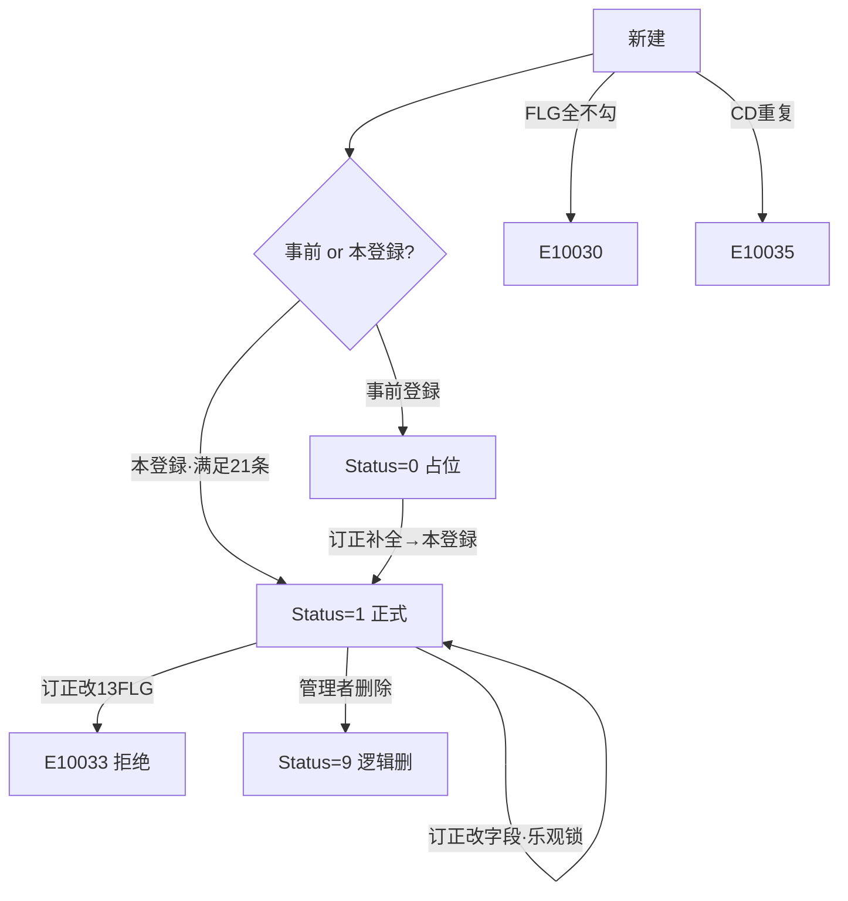

# 取引先マスタ 单页面操作 SOP（手把手版）

> **用途**：给**业务用户照着点、培训老师照着讲、测试人员照着拆用例**的单页面手册。比模块总册更细、更口语。
> **页面**：取引先マスタ（MSBBPA110 · 销售管理 MSBB · 模块总册 §5.11）　**前端**：`views/erp/BusinessPartnerView.vue`（10 个 Tab 子组件 `views/erp/bp/*Tab.vue`，store `stores/businessPartner.ts`）　**API**：`api/erp/businessPartner.ts`　**后端**：`Erp/BusinessPartnerController` → `BusinessPartnerService`
> **基准**：分支 `feat/wfs-inbox-core`，2026-06-28，均实测真实代码（核对 `docs/codemap-erp/01-取引先-businesspartner.md`）。查不到的标 `待业务确认` / `代码未发现`。
> **样例数据**：取引先CD `C0001`(A社·客户)、拠点 `BASE01`、勾【得意先FLG】(+売掛/請求/入金)、营业担当 `S001`。

---

## 1. 页面一句话说明

**取引先マスタ，就是建/维护"客户·供应商·收付款方"这类合作伙伴主数据的页——它是所有销售单据(見積/御見積/受注)的顾客来源，缺它整条链建不起来；一条取引先靠 9 个"属性 FLG"决定它扮演哪些角色(得意先/売掛先/請求先/入金先/納品先/発注先/買掛先/支払予定/支払先)，勾哪个 FLG 就启用哪个 Tab、并要求该角色的关联必填；支持"事前登録(占位)→本登録(正式)"两阶段，删除**只有管理者**能做(且是逻辑删)。**

---

## 2. 这个页面在业务流程中的位置

```
上游(无)                  本页面(主数据建档)                        下游(被谁引用)
─────────       ──────────────────────────────────       ────────────────────
拠点/担当/银行    取引先マスタ MSBBPA110                       見積/御見積/受注 顾客来源
 等基础主数据 ─→  9属性FLG勾选→启用对应Tab→各角色关联必填        財務 AP/AR(收付款条件)
                 事前登録(Status=0)→本登録(Status=1)           采购 発注先/支払
                 删除=管理者限定·逻辑删                         ✗不触发MES/WMS
```

- **上游**：拠点/担当者/银行/税码等基础主数据(各 Tab 字段的下拉来源)。
- **本页面**：建/改一条取引先，按它要扮演的角色勾属性 FLG、补各 Tab 关联必填、事前或本登録保存。
- **下游**：① 見積/御見積/受注 的"顧客コード"来源；② 财务 AR/AP 的收付款条件；③ 采购的発注先/支払先。
- **关键认知**：① **属性 FLG 是核心**——决定角色、Tab 可见、条件必填；② **本登録后 13 个 FLG 变更不可**(改→E10033)；③ **删除限管理者**(roleId=1)且为逻辑删；④ 本功能是"反范例"(Service 直注 DbContext、业务键 BpCd 是字符串非 Guid，见 codemap)；⑤ 本页**不触发 MES/WMS/Bridge**(纯主数据)。

---

## 3. 谁使用这个页面

| 角色 | 使用目的 | 常用操作 | 权限要求 | 注意事项 |
|---|---|---|---|---|
| 主数据管理员 | 建/改/删取引先 | 全部 | 删除限 Roles=1,Admin | 唯一能删的角色 |
| 销售内勤 | 建/改客户(得意先) | 事前/本登録、订正 | `[Authorize]` | 删除按钮灰 |
| 财务 | 维护收付款条件 | 订正(請求/入金/支払 Tab) | 同上 | 締日/银行 |
| 采购 | 维护供应商(発注先) | 订正(発注先 Tab) | 同上 | 発注先パターン |
| 测试/UAT | 验 FLG 联动/必填/删除限 | 全流程 | 登录 | 21条校验 |

> 📌 **权限现状**：`BusinessPartnerController` 标 `[Authorize]`；**删除端点额外 `[Authorize(Roles="1,Admin")]`**(唯一带角色限制)；其余细粒度授权 `待业务确认`。

---

## 4. 操作前准备（不准备好，下面会卡住）

| 准备项 | 为什么需要 | 不满足会怎样 | 去哪里维护/确认 | 测试关注点 |
|---|---|---|---|---|
| 取引先CD 命名规则 | 业务键唯一、新建后不可改 | 重复→E10035 | 先查重(check-exists) | 重复CD |
| 想清楚扮演哪些角色 | 决定勾哪些属性FLG | 全不勾→E10030 | 业务定位 | FLG必选 |
| 取引先名/拠点CD 备齐 | 基础必填 | 保存拦E10022 | 拠点主数据 | 必填 |
| 各角色关联主数据(売掛先/請求先/银行/支払先等) | FLG=ON 时条件必填 | 对应漏填→E10022 | 相关主数据 | 21条 |
| 邮编/电话/FAX 格式、締日范围 | 正则/值域校验 | E10031/E10032 | 按规范 | 格式 |
| 是不是管理者(要删) | 删除限 roleId=1 | 删除按钮灰/403 | 找管理员 | 角色 |

---

## 5. 页面区域说明

| 区域 | 页面位置 | 用户要做什么 | 注意事项 |
|---|---|---|---|
| 操作种别区 | 顶部 | 选 事前登録/本登録/订正/参照/删除 + 状态tag | 订正/参照/删除须先读取 |
| 基础栏 | 顶部 | 填 取引先CD/取引先名/拠点CD + 读取 | CD仅事前/本登録可编;读取按钮订正/参照/删除用 |
| 基本情報 Tab | Tab区(常显) | 略称/法人番号/住所/TEL/FAX/分类/**9属性FLG勾选** | FLG在此勾 |
| 9 动态 Tab | Tab区(FLG门控) | 得意先/売掛先/請求先/入金先/納品先/発注先/買掛先/支払予定/支払先 | 对应FLG=ON才出现 |
| 底部按钮 | 页面底 | クリア / 登録(保存) / 削除 | 删除仅删除态+管理者 |
| 独立窗口 | popup `/business-partner/window?bpCd=&mode=` | 同上 | **无postMessage回刷(代码未发现)** |

---

## 6. 字段填写说明（口语版）

### 6.1 操作种别（5 种）

| 操作种别 | 值 | 用途 | 关键 |
|---|---|---|---|
| 事前登録 PreRegister | 5 | 先占编码/资料未齐 | 保存 Status=0;CD/名可编 |
| 本登録 Register | 10 | 正式建档 | 保存 Status=1;全FLG关联必填 |
| 订正 Edit | 20 | 改已存 | 须先读取;CD只读;**13 FLG不可改** |
| 参照 View | 40 | 只读查看 | 须先读取;全只读 |
| 削除 Delete | 30 | 逻辑删 | 须先读取;**限管理者**;Status=9 |

### 6.2 基础必填（常时必填）

| 字段 | 字段名 | 怎么填 | 校验 |
|---|---|---|---|
| 取引先CD | `bpCd` | 业务键、唯一 | 重复E10035;事前/本登録可编、订正只读 |
| 取引先名 | `bpName` | 正式名称 | 必填E10022 |
| 拠点CD | `baseCd` | 归属据点 | 必填E10022 |

### 6.3 属性 FLG（9 主 + 4 補助，决定角色/Tab/必填）

| FLG | 字段名 | 角色含义 | 启用Tab | ON时关联必填 |
|---|---|---|---|---|
| 得意先 | `customerFlg` | 客户 | 得意先 | 売掛先CD + 営業担当 + 業務担当 |
| 売掛先 | `accountsReceivableFlg` | 应收挂账 | 売掛先 | 請求先CD |
| 請求先 | `billingFlg` | 开票 | 請求先 | 入金先CD |
| 入金先 | `receiptFlg` | 收款 | 入金先 | — |
| 納品先 | `deliveryFlg` | 收货 | 納品先 | 物流グループCD |
| 発注先 | `supplierFlg` | 供应商 | 発注先 | パターン+買掛先+仕入金额端数+仕入税额端数+支給積送+ロット分割(6项) |
| 買掛先 | `accountsPayableFlg` | 应付挂账 | 買掛先 | 支払予定管理先CD |
| 支払予定管理先 | `paymentScheduleFlg` | 付款计划 | 支払予定 | 支払先CD + 担当部門(+締日/税/遅延条件) |
| 支払先 | `paymentFlg` | 付款方 | 支払先 | — |
| (補助)与信管理 | `creditMgmtFlg` | 与信 | — | — |
| (補助)メーカ | `makerFlg` | 厂商 | — | OFF→清 fscCertificationDiv |
| (補助)有償支給 | `paidSupplyFlg` | 有偿支给 | (発注先内) | supplier+ON→3支給端数 |
| (補助)買戻義務 | `rebuyObligationFlg` | 买回义务 | — | supplier+paidSupply+ON→支給税CD |

> 📌 **至少勾 1 个属性 FLG**，否则 E10030。

### 6.4 各 Tab 关键字段（节选）

| Tab | 关键字段 | 说明 |
|---|---|---|
| 基本情報(常显) | bpAbbrev略称/stdCoCd標準企業/ein法人番号/zipCd/addr1~4/tel/fax/areaCd/bpClass01~10分類/salesAnalysis1~3 + 9属性FLG | 格式校验E10031 |
| 得意先(customer) | parentCustomerCd親/accountsReceivableCd売掛先/creditMgmtCd/salesPostingDiv売上計上/slitterBilling/printMinBilling/laminate/deliveryCalc… (40+字段) | 客户销售/计算/配送规则 |
| 売掛先(ar) | billingCd請求先/billingName | 2字段 |
| 請求先(billing) | receiptCd入金先/billingClosingDay1締日/billingPrintDiv/electronicBilling/billing住所 | 締日1~31/99 |
| 入金先(receipt) | bankCd/bankBranchCd/remittanceAccount/collectionDiv集金/collectionPlannedDay/receipt住所 | 银行收款 |
| 納品先(delivery) | logisticsGroupCd物流グループ/deliveryDept/deliveryContact/truckLengthLimit/deliveryTimeFrom~To | 配送 |
| 発注先(supplier) | supplierPattern(1原材料/2資材/3副資材/4購買品/5外注品/9他)/subcontractTargetFlg/purchaseTaxCd/supplierCalendarCd/fscCertificationDiv | パターン=5外注品联动 |
| 買掛先(ap) | paymentScheduleCd支払予定管理先 | 1字段 |
| 支払予定(paySch) | paymentCd支払先/paymentScheduleDeptCd担当部門/paidEachTimeFlg都度/paymentClosingDay1締日/batchPaymentScheduleFlg | 付款计划 |
| 支払先(payment) | (取引先CD自身=支払先,详情集约到买掛/支払予定Tab) | 提示性 |

### 6.5 字段联动（Store 自动规则，容易踩）

| 规则 | 说明 | 触发 |
|---|---|---|
| supplierPattern='5'外注品 | 才启用 subcontractTargetFlg/paidSupplyFlg/rebuyObligationFlg + supplyPostingDiv='2' | 选パターン |
| makerFlg=OFF | 清空 fscCertificationDiv | 关メーカFLG |
| paidSupplyFlg=OFF | 清空有偿支给相关字段 | 关有偿支给 |

---

## 7. 按钮操作说明

| 按钮 | 何时点 | 系统做什么 | 成功后 | 失败处理 | 测试关注点 |
|---|---|---|---|---|---|
| 读取 | 订正/参照/删除前 | 按取引先CD加载(getByCd) | 各Tab载入、存original守卫 | 查无→E10008(code=404) | 加载 |
| 登録(事前登録) | 资料未齐先占位 | create?preRegister=true | Status=0、转订正 | CD空E10022/重复E10035/FLG全不勾E10030 | 事前 |
| 登録(本登録) | 正式建档 | create?preRegister=false / 订正→update | Status=1/更新、(新建)转订正 | 21条必填E10022/格式E10031/締日E10032/FLG改E10033/冲突E10034 | 本登録/校验 |
| 削除 | 删除态+管理者 | 二确认→DELETE(body rowVersion) | 逻辑删 IsDeleted=1/Status=9、reset | 非管理者→按钮灰/403;冲突E10034 | 角色/软删 |
| クリア | 重来 | 清表单(有改动先确认) | 清空 | — | 防脏 |
| 操作种别(单选) | 切操作 | 切;订正/参照/删除须先读取 | 字段可编性变 | 未读取切这些→提示先读取 | 状态机 |

> ⚠️ **两阶段登録**：事前登録(Status=0)只需基础+FLG，占编码；本登録(Status=1)要满足全部 21 条关联必填。事前→订正补全→本登録。
> ⚠️ **13 FLG 变更不可**：本登録后订正改 9 属性FLG 或 4 補助FLG(与信/メーカ/有償支給/買戻義務)→ E10033。
> ⚠️ **删除限管理者**：删除按钮 `:disabled="!hasLoaded || !isAdmin"`(isAdmin=localStorage user.roleId===1)；后端 `[Authorize(Roles="1,Admin")]` 双重把关。
> ⚠️ **独立窗口无回刷**：`/business-partner/window` 保存后**无 postMessage 通知列表**(代码未发现)→列表需手动刷新。

---

## 8. 标准业务操作 SOP（照着点）

### 场景一：新建一个"客户(得意先)"并本登録（主流程）
- **业务背景**：A社要做客户，建客户主数据供后续报价/受注用。
- **使用样例数据**：取引先CD C0001、取引先名 A社、拠点 BASE01、勾【得意先】(+売掛/請求/入金)。
- **前置条件**：① 有拠点/担当/売掛先等主数据；② 有编辑权限。
- **详细操作步骤**：
  1. 打开【销售管理 → 取引先マスタ】，操作种别"本登録"(或先事前登録)。
  2. 填 取引先CD C0001、取引先名 A社、拠点 BASE01。
  3. **基本情報 Tab** 勾【得意先FLG】(按需勾売掛先/請求先/入金先)——勾后对应 Tab 出现。
  4. 进【得意先 Tab】补 売掛先CD + 営業担当 S001 + 業務担当(customerFlg 关联必填)。
  5. 進【売掛先/請求先/入金先 Tab】各补关联必填(請求先CD/入金先CD/締日/银行…)。
  6. 点【登録】(本登録)→ Status=1、得到取引先、转订正。
  7. 到【見積計算書/受注入力】确认顾客下拉能选到 C0001。
- **完成后检查**：① Status=1；② 見積/受注 可引用 C0001；③ 各 Tab 关联齐。
- **异常处理**：CD重复E10035；FLG全不勾E10030；漏关联必填E10022；格式E10031。
- **可拆测试用例**：TC-M04-BP-001~008、020。

### 场景二：事前登録占位 → 后续补全本登録
- **业务背景**：先占编码，资料还没齐。
- **使用样例数据**：先填基础+勾FLG，选【事前登録】。
- **前置条件**：有基础信息。
- **详细操作步骤**：1) 新建填 CD/名/拠点+勾FLG；2) 选【事前登録】登録(Status=0)；3) 资料齐后【订正】读取→补各Tab关联必填→选【本登録】登録(Status=1)。
- **完成后检查**：① 事前→Status=0(列表"事前登録")；② 本登録→Status=1。
- **异常处理**：本登録时关联必填仍缺→E10022。
- **可拆测试用例**：TC-M04-BP-009/010/021。

### 场景三：建一个"供应商(発注先)"并体验パターン联动
- **业务背景**：建外注加工供应商。
- **使用样例数据**：勾【発注先FLG】，発注先パターン=5外注品。
- **前置条件**：有税码/カレンダ等。
- **详细操作步骤**：
  1. 新建→勾【発注先FLG】→出现発注先 Tab。
  2. 选 supplierPattern=5(外注品)→ 系统联动启用 下請対象/有償支給/買戻義務 + supplyPostingDiv=2。
  3. 补 発注先 6 项关联必填(パターン/買掛先/仕入金额端数/仕入税额端数/支給積送/ロット分割)。
  4. (有偿支给时)补 3 支給端数；(+买回义务)补 支給税CD。
  5. 本登録。
- **完成后检查**：① 联动字段按パターン启用；② 供应商可被采购引用。
- **异常处理**：6 项必填缺→E10022。
- **可拆测试用例**：TC-M04-BP-011/012/022。

### 场景四：订正时改"变更不可FLG"被拦
- **业务背景**：误把已锁定的属性FLG改了。
- **使用样例数据**：本登録后的取引先。
- **前置条件**：已本登録。
- **详细操作步骤**：1) 订正读取；2) 试改某属性FLG(如关掉得意先)；3) 登録→E10033 被拦。
- **完成后检查**：① 被拦、原FLG保留；② UI 也有变更警告。
- **异常处理**：确需变更属性→走线下流程/重建(`待业务确认`)。
- **可拆测试用例**：TC-M04-BP-013/023。

### 场景五：删除取引先（仅管理者，逻辑删）
- **业务背景**：作废错建的取引先。
- **使用样例数据**：未被引用的取引先；管理者账号(roleId=1)。
- **前置条件**：管理者；产品未被単据引用。
- **详细操作步骤**：
  1. 管理者【删除】态读取该取引先。
  2. 点【削除】→二次确认→ DELETE(带 rowVersion)。
  3. 逻辑删 IsDeleted=1/Status=9、页面 reset。
  4. (对比)普通账号：删除按钮灰、点不动。
- **完成后检查**：① 默认列表查不到；② 非管理者删除按钮灰/403。
- **异常处理**：被見積/受注引用的处理`待业务确认`；冲突E10034。
- **可拆测试用例**：TC-M04-BP-014/015/024。

### 场景六：参照只读 + 乐观锁冲突
- **业务背景**：复核或并发改同一取引先。
- **使用样例数据**：已存取引先，两端打开。
- **前置条件**：—。
- **详细操作步骤**：1)【参照】读取→全只读浏览各Tab；2) 两端【订正】读取同一CD；3) A 先改并登録(rowVersion前进)；4) B 改并登録→409，弹"是否重取最新"；5) B 重取再改再存。
- **完成后检查**：① 参照全只读；② B 收到 409 提示(E10034)非静默覆盖。
- **异常处理**：B 重取最新后基于最新再存。
- **可拆测试用例**：TC-M04-BP-016/025。

---

## 9. 状态变化说明

> 取引先核心状态 `status`：0 事前登録 → 1 本登録 → 9 削除(逻辑删)；并叠加操作种别×字段可编性。

| 状态 | 用户看到 | 含义 | 怎么来的 | 下一步 |
|---|---|---|---|---|
| 0 事前登録 | info tag | 占位、资料未齐 | 事前登録保存 | 订正补全→本登録 |
| 1 本登録 | success tag | 正式可用 | 本登録保存 / 事前→本登録 | 被単据引用 |
| 9 削除 | danger tag | 逻辑删 | 管理者删除 | — |



---

## 10. 按钮不可用 / 灰色 / 不出现原因

| 按钮/字段 | 何时不可用 | 为什么 | 怎么处理 | 测试关注点 |
|---|---|---|---|---|
| 削除 | 非管理者(roleId≠1)/未读取 | 删除限 Roles=1,Admin | 找管理员 | 角色限定 |
| 订正/参照/删除 单选 | 未读取数据 | 这些针对已存 | 先读取 | 须读取 |
| 取引先CD(订正态) | 订正时 | 业务键不可改 | 重建 | 主键锁 |
| 13 属性/補助FLG(订正) | 本登録后 | 变更不可(E10033) | 不可改 | FLG守卫 |
| 某 Tab | 对应属性FLG未勾 | Tab门控 | 先勾FLG | FLG联动 |
| 発注先联动字段 | パターン≠5外注品 | Store规则未启用 | 选パターン=5 | 联动 |
| 登録 | 参照/删除态 | 只读/删除态无登録 | 切事前/本登録/订正 | 显隐 |

---

## 11. 常见错误与处理

| 错误/提示 | 可能原因 | 用户处理方法 | 是否需要管理员 | 测试关注点 |
|---|---|---|---|---|
| E10022 必填缺 | 基础(名/拠点)或FLG关联必填漏 | 按提示补对应Tab | 否 | 21条必填 |
| E10030 属性未选 | 9 FLG 全不勾 | 至少勾1个角色 | 否 | FLG必选 |
| E10031 格式不符 | 邮编/电话/FAX 正则不符 | 按规范填 | 否 | 格式 |
| E10032 締日越界 | 締日不在1~31或99 | 改到合法值 | 否 | 締日 |
| E10035 CD已存在 | 取引先CD重复 | 换CD/先查重 | 否 | 重复 |
| E10033 FLG不可改 | 本登録后改13FLG | 不可改、必要时重建 | 否(业务) | FLG守卫 |
| E10034 冲突(409) | 他人已改(rowVersion) | 弹框重取最新再改 | 否 | 乐观锁 |
| E10008 查无 | 读取的CD不存在 | 核对取引先CD | 否 | 404 |
| 删除按钮灰/403 | 非管理者 | 找管理员删 | 是 | 角色 |
| 见積/受注选不到客户 | 取引先未本登録/未勾得意先 | 本登録+勾得意先 | 否 | 主数据可用 |
| 独立窗口存完列表没刷新 | 无postMessage(代码未发现) | 手动刷新列表 | 否 | 无回刷 |
| 权限不足 | 无编辑权 | 申请权限 | 是 | 权限`待确认` |

---

## 12. 操作完成后的检查清单

| 操作 | 当前页面检查 | 取引先一覧检查 | 下游(見積/受注/财务)检查 | 数据状态 | 测试关注点 |
|---|---|---|---|---|---|
| 事前登録 | Status=0、得CD | 列表"事前登録" | — | Status=0 | 两阶段 |
| 本登録 | Status=1、转订正 | 列表"本登録" | 見積/受注顾客可选;财务收付款条件可用 | Status=1 | 主数据可用 |
| 订正 | 改动落、CD不变 | 列表反映 | 下游引用更新 | rowVersion前进 | 乐观锁 |
| 删除(管理者) | reset | 默认查不到 | 被引用方注意 | IsDeleted=1/Status=9 | 软删 |

> 📌 本页**不触发** MES/WMS/Bridge——无需到注文追溯/工单/出库验证。

---

## 13. 页面级测试用例（≥25 条，可执行）

> 编号 `TC-M04-BP-xxx`；数据用样例。测试人员补"实际结果/是否通过/缺陷编号"。

| 用例编号 | 用例名称 | 优先级 | 前置条件 | 测试数据 | 操作步骤 | 预期结果 | 备注 |
|---|---|---|---|---|---|---|---|
| TC-M04-BP-001 | 页面打开 | P1 | 有权限 | — | 进入 | 操作种别+基本情報Tab、FLG区 | — |
| TC-M04-BP-002 | 客户本登録 | P0 | 主数据齐 | C0001+得意先FLG | 填+勾+补→本登録 | Status=1 | 主流程 |
| TC-M04-BP-003 | FLG全不勾 | P0 | — | 不勾FLG | 登録 | E10030 | FLG必选 |
| TC-M04-BP-004 | 基础必填缺 | P0 | — | 缺取引先名 | 登録 | E10022 | 必填 |
| TC-M04-BP-005 | 得意先关联必填 | P0 | 勾得意先 | 缺売掛先CD/担当 | 登録 | E10022 | 21条 |
| TC-M04-BP-006 | 重复CD | P1 | 已有C0001 | C0001 | 新建登録 | E10035 | 重复 |
| TC-M04-BP-007 | 邮编/电话格式 | P1 | — | 错格式 | 登録 | E10031 | 格式 |
| TC-M04-BP-008 | 締日越界 | P2 | 勾請求先 | 締日=40 | 登録 | E10032 | 締日 |
| TC-M04-BP-009 | 事前登録 | P1 | — | 少填 | 事前登録 | Status=0 | 两阶段 |
| TC-M04-BP-010 | 事前→本登録 | P1 | 事前态 | 补全 | 订正→本登録 | Status 0→1 | 转正 |
| TC-M04-BP-011 | 供应商パターン联动 | P1 | 勾発注先 | パターン=5 | 选パターン | 联动启用下請/有償支給/买回 | 联动 |
| TC-M04-BP-012 | 発注先6项必填 | P0 | 勾発注先 | 缺端数div | 登録 | E10022 | 21条 |
| TC-M04-BP-013 | 改变更不可FLG | P1 | 本登録后 | 改属性FLG | 订正登録 | E10033 | FLG守卫 |
| TC-M04-BP-014 | 管理者删除 | P0 | 管理者+有档 | C0001 | 删除确认 | 逻辑删IsDeleted=1/Status=9 | 软删 |
| TC-M04-BP-015 | 非管理者删除拦 | P1 | 普通账号 | — | 看删除按钮 | 灰/403 | 角色 |
| TC-M04-BP-016 | 参照只读 | P1 | 有档 | C0001 | 参照读取 | 全只读、无登録 | 只读 |
| TC-M04-BP-017 | 9 Tab FLG门控 | P1 | — | 勾不同FLG | 勾FLG | 对应Tab出现/消失 | Tab联动 |
| TC-M04-BP-018 | 订正CD只读 | P1 | 有档 | — | 订正读取 | 取引先CD不可改 | 主键锁 |
| TC-M04-BP-019 | makerFlg关清fsc | P2 | 有fsc值 | 关メーカ | 关FLG | fscCertificationDiv清空 | 联动 |
| TC-M04-BP-020 | 多角色一并建 | P1 | — | 勾得意先+発注先 | 同时建客户+供应商 | 两套Tab都出+各必填 | 多角色 |
| TC-M04-BP-021 | 有償支給联动 | P2 | 発注先+pattern5 | 勾有償支給 | 勾FLG | 启用支給端数;关→清 | 联动 |
| TC-M04-BP-022 | 买回义务支給税CD | P2 | supplier+paidSupply | 勾买回义务 | 登録 | 需支給税CD(E10022) | 21条 |
| TC-M04-BP-023 | 补助FLG也不可改 | P2 | 本登録后 | 改与信/メーカ | 订正登録 | E10033 | FLG守卫 |
| TC-M04-BP-024 | 删除并发冲突 | P2 | 两端 | 同档 | A改→B删 | E10034 | 乐观锁 |
| TC-M04-BP-025 | 订正乐观锁 | P1 | 两端订正 | 同档 | A存→B存 | 409弹重取(E10034) | 乐观锁 |
| TC-M04-BP-026 | 读取不存在CD | P2 | — | 错CD | 读取 | E10008 | 404 |
| TC-M04-BP-027 | 独立窗口无回刷 | P2 | popup | — | window存→看列表 | 列表不自动刷(代码未发现postMessage) | 无回刷 |
| TC-M04-BP-028 | 不触发下游 | P1 | 保存后 | — | 查注文追溯 | 无MES/WMS/Bridge | 边界 |
| TC-M04-BP-029 | 本登録后可被受注引用 | P0 | 本登録客户 | C0001 | 受注入力选顾客 | 能选到C0001 | 主数据可用 |
| TC-M04-BP-030 | 防脏离开确认 | P2 | 有改动 | — | 切操作/クリア | 弹未保存确认 | 防脏 |
| TC-M04-BP-031 | 网络异常 | P2 | 断网 | — | 登録 | 友好错误可重试 | 异常 |

---

## 14. 培训讲解建议

| 讲解顺序 | 讲什么 | 演示动作 | 用户容易误解的点 |
|---|---|---|---|
| 1 | 这页是所有单据的客户/供应商源头 | 展示 §2 流程图 | 以为是普通登记 |
| 2 | 属性FLG=角色开关 | 勾不同FLG看Tab变 | 不勾FLG就保存 |
| 3 | FLG关联必填(21条) | 勾得意先看必填 | 漏关联项 |
| 4 | 事前登録vs本登録 | 演示两阶段 | 不懂占位 |
| 5 | 供应商パターン联动 | パターン=5启用支给 | 联动字段 |
| 6 | 本登録后FLG不可改 | 演示E10033 | 想随意改角色 |
| 7 | 删除限管理者+逻辑删 | 普通账号看灰按钮 | 想自己删/以为物删 |
| 8 | 不触发MES/WMS | 对比受注 | 以为联动 |

---

## 15. 与模块级手册的关系

本单页 SOP 对应模块总册 `docs/manuals/user-training/01-销售管理MSBB-最详细用户操作培训手册.md` **§5.11 取引先マスタ**：

| 本SOP章节 | 对应总册章节 |
|---|---|
| §1/§2 定位与流程 | 总册 §5.11.1 |
| §4 操作前准备 | 总册 §5.11.1a |
| §6 字段(FLG/Tab) | 总册 §5.11.1b + §5.11.6/5.11.7 |
| §7 按钮 | 总册 §5.11.9 |
| §8 SOP | 总册 §5.11.1e |
| §9 状态(0/1/9) | 总册 §5.11.10 |
| §10 灰按钮 | 总册 §5.11.1c |
| §12 完成后检查 | 总册 §5.11.1d |
| §13 测试用例 | 总册 §5.11.14 |
| §14 培训讲解 | 总册 §13 |

> 配套：检索入口 `01-S02-取引先一覧-单页面操作SOP`(待出)；下游 `01-01-見積計算書`/`01-07-受注入力`(用取引先做顾客)。

---

## 16. 代码与文档来源

| 类型 | 路径 | 用途 |
|---|---|---|
| 前端主页 | `cp6.web/src/views/erp/BusinessPartnerView.vue` | 操作种别/10Tab/FLG门控/保存删除 |
| Tab 子组件 | `cp6.web/src/views/erp/bp/{BasicInfo,Customer,Ar,Billing,Receipt,Delivery,Supplier,Ap,PaySch,Payment}Tab.vue` | 各角色字段 |
| Store | `cp6.web/src/stores/businessPartner.ts` | 操作种别状态机/FLG联动/dirty·original守卫/isAdmin |
| API | `cp6.web/src/api/erp/businessPartner.ts` | getByCd/checkExists/create/update/remove/search/exportCsv |
| 类型 | `cp6.web/src/types/erp/businessPartner.ts` | BusinessPartnerDto(170+字段)/BpOperationType/BpQueryDto/BpListItemDto |
| 路由 | `cp6.web/src/router/index.ts`(`/business-partner`、`/business-partner/window`) | 主页/独立窗口 |
| 后端 Controller | `CP6.WebApi/Controllers/Erp/BusinessPartnerController.cs`(7端点；`Delete` 带 `[Authorize(Roles="1,Admin")]`) | 端点/角色限定 |
| Service | `CP6.Core/Services/Erp/BusinessPartnerService.cs`(直注DbContext/21条Validate/CheckFlgChange/CreateAsync事前本登録/DeleteAsync逻辑删) | 业务逻辑(反范例) |
| 实体 | `CP6.Entity/DomainModels/Erp/BusinessPartner.cs`(T_WebBusinessPartner，业务键BpCd/9属性FLG/13变更不可FLG) | 主数据 |
| DTO | `CP6.Entity/DTOs/Erp/BusinessPartnerDto.cs` | DTO/Query/ListItem |
| 模块总册 | `docs/manuals/user-training/01-销售管理MSBB-最详细用户操作培训手册.md` §5.11 | 上级手册 |
| 逐行源码手册 | `docs/codemap-erp/01-取引先-businesspartner.md` | 代码级实现(反范例/21校验/FLG守卫/管理者删除 实证) |
| 页面盘点表 | `docs/manuals/user-training/00-用户操作手册页面盘点表.md` | 页面索引 |

---

## 最后更新来源

- 代码：见 §16（BusinessPartnerView + 10 Tab + store + types 实测；后端以 `docs/codemap-erp/01-取引先-businesspartner.md` 2026-06-22 实测为据：21条校验/FLG守卫E10033/管理者删除/事前本登録/乐观锁E10034）
- 文档：模块总册 §5.11、`docs/codemap-erp/01-取引先-businesspartner.md`、页面盘点表
- 基准：分支 `feat/wfs-inbox-core`，盘点日 2026-06-28
- 诚实标注：**删除限管理者(Roles=1,Admin)**；**本登録后13 FLG变更不可(E10033)**；**独立窗口无postMessage回刷(代码未发现)**；被引用取引先删除影响与细粒度权限 `待业务确认`；本功能"反范例"(直注DbContext/业务键BpCd)；本页不触发MES/WMS/Bridge
</content>
