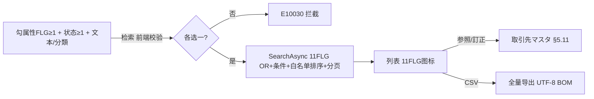

# 取引先一覧 单页面操作 SOP（手把手版）

> **用途**：给**主数据/销售用户照着点、培训老师照着讲、测试人员照着拆用例**的单页面手册。比模块总册更细、更口语。
> **页面**：取引先一覧（MSBBPA120 · 取引先マスタ 的检索台账 · 销售管理 MSBB · 模块总册 §5.17）　**前端**：`views/erp/BusinessPartnerListView.vue`(列表用页内 query 不用 store)　**API**：`api/erp/businessPartner.ts`(`search`/`exportCsv`)　**后端**：`Erp/BusinessPartnerController` → `BusinessPartnerService.SearchAsync`
> **基准**：分支 `feat/wfs-inbox-core`，2026-06-28，均实测真实代码（核对 `docs/codemap-erp/01-取引先-businesspartner.md`）。查不到的标 `待业务确认` / `代码未发现`。
> **样例数据**：勾【得意先FLG】+【本登録】、客户 `C0001`(A社)、担当 `S001`。

---

## 1. 页面一句话说明

**取引先一覧，就是按角色/状态/各种条件找取引先的检索台账页——你先勾"想找哪种角色"(11 个属性 FLG，如得意先/発注先…，OR 关系)和"状态"(事前登録/本登録)，再加 CD/名/法人番号/住所/担当/分類 等条件，查出取引先列表；可 CSV 全量导出，点行"参照/訂正"跳到取引先マスタ编辑页。**注意检索强制"属性 FLG / 状态 至少各选一"，否则不让查(E10030)。**

---

## 2. 这个页面在业务流程中的位置

```
上游(主数据)              本页面(检索台账)                       下游(跳转)
─────────────       ──────────────────────────       ────────────────
取引先マスタ(§5.11) ─→  取引先一覧 MSBBPA120                参照/訂正→取引先マスタ编辑(§5.11)
 建/改的取引先          11属性FLG(OR)+状态+文本+分類检索       CSV 全量导出(给外部)
                       "FLG/状态至少各选一"(E10030)
                       列表(11 FLG图标)
```

- **上游**：【取引先マスタ §5.11】建/改的取引先。
- **本页面**：按属性 FLG + 状态 + 文本/分類检索取引先台账，看 11 个角色 FLG 图标。
- **下游**：参照/訂正跳到取引先マスタ编辑(§5.11)；CSV 全量导出。
- **关键认知**：① **检索强制"属性 FLG / 状态 至少各选一"**(E10030 前端拦)；② 11 属性 FLG 是 **OR** 关系(勾几个=找扮演其中任一角色的)；③ 本页**只检索**，建/改/删在取引先マスタ；④ CSV 是**全量**(按检索条件、忽略分页)。

---

## 3. 谁使用这个页面

| 角色 | 使用目的 | 常用操作 | 权限要求 | 注意事项 |
|---|---|---|---|---|
| 主数据管理员 | 检索/导出取引先 | 检索/CSV/訂正 | `[Authorize]`，细粒度`待业务确认` | FLG/状态各选一 |
| 销售内勤 | 找客户改 | 检索/参照/訂正 | 同上 | 改在编辑页 |
| 财务/采购 | 找收付款方/供应商 | 检索(勾对应FLG) | 同上 | 角色FLG |
| 测试/UAT | 验FLG筛/E10030/CSV | 全流程 | 登录 | 至少各选一 |

> 📌 **权限现状**：`BusinessPartnerController` 标 `[Authorize]`；细粒度授权 `待业务确认`。

---

## 4. 操作前准备（不准备好，下面会卡住）

| 准备项 | 为什么需要 | 不满足会怎样 | 去哪里维护/确认 | 测试关注点 |
|---|---|---|---|---|
| 至少选 1 个属性 FLG | FLG 做 OR 过滤 | E10030 拦、不查 | 勾≥1 属性 | E10030 |
| 至少选 1 个状态 | 事前/本登録筛 | E10030 拦 | 勾≥1 状态 | E10030 |
| 检索范围合理 | 件数上限 | E10013 | 缩范围 | E10013 |
| 浏览器允许下载 | CSV 导出 | 导不出 | 浏览器设置 | 导出 |
| 系统有取引先 | 列表才有内容 | 空 | 先在取引先マスタ建 | 空 |

---

## 5. 页面区域说明

| 区域 | 页面位置 | 用户要做什么 | 注意事项 |
|---|---|---|---|
| 属性 FLG 筛 | 检索区 | 勾 11 个属性 FLG(OR) | **至少 1** |
| 状态筛 | 检索区 | 勾 事前登録/本登録 | **至少 1** |
| 文本检索 | 检索区 | 填 登録日范围/bpCd/bpName/法人番号/住所/TEL/担当 | 模糊/精确 |
| 详细检索(折叠) | 检索区内 | 填 bpClass01~10 取引先分類 | 默认折叠 |
| 工具区 | 检索区 | 検索 / CSV出力 | — |
| 结果列表 | 中部 | 看取引先 + 11 FLG 图标 + status；行参照/訂正 | 选中高亮 |

---

## 6. 字段填写说明（口语版）

### 6.1 检索条件

| 字段 | 字段名 | 怎么填 | 必填 |
|---|---|---|---|
| 属性 FLG(11) | `include*`(Customer/AccountsReceivable/Billing/Receipt/Delivery/CreditMgmt/Supplier/AccountsPayable/PaymentSchedule/Payment/Maker) | 勾要找的角色(OR) | **至少1(E10030)** |
| 状态 | `includePreRegistered/includeRegistered` | 勾 事前登録/本登録 | **至少1(E10030)** |
| 登録日 from/to | `registeredDateFrom/To` | 范围 | 否 |
| 取引先CD/名/略称 | `bpCd/bpName` | 模糊 | 否 |
| 法人番号/標準企業 | `ein/stdCoCd` | 模糊 | 否 |
| 郵便番号/住所/TEL | `zipCd/addr/tel` | 模糊(addr 对 Addr1~4 OR) | 否 |
| 営業/業務担当 | `salesStaffCd/businessStaffCd` | 精确 | 否 |
| 取引先分類 | `bpClass01~10` | 折叠详细、精确 | 否 |

### 6.2 列表列

| 列 | 含义 | 注意 |
|---|---|---|
| status | 0事前登録/1本登録/9削除 | 着色 |
| bpCd/bpName/略称 | 取引先 | — |
| 営業/業務担当 | 担当 | — |
| 法人番号/標準企業/住所 | 信息 | — |
| 11 FLG 图标 | 得/売/請/入/納/信/発/買/予/払/メ | ○/- |
| 登録日/登録担当 | 审计 | — |
| 操作 | 参照/訂正 | 跳取引先マスタ |

> 本页**无录入表单**；建/改在取引先マスタ(§5.11)。

---

## 7. 按钮操作说明

| 按钮 | 何时点 | 系统做什么 | 成功后 | 失败处理 | 测试关注点 |
|---|---|---|---|---|---|
| 検索 | 设好条件 | 前端校验"FLG/状态各≥1"→search(11 FLG OR+条件+白名单排序+分页) | 列表+件数 | 未各选一→E10030;0件→E10008;过多→E10013 | E10030/检索 |
| CSV出力 | 导出 | exportCsv(同条件全量)→下载 `business-partners_YYYY-MM-DD.csv`(UTF-8 BOM,FLG ○/空) | 浏览器下载 | 拦截→允许 | 全量导出 |
| (行)参照 | 看某取引先 | 跳 `/business-partner?bpCd=&mode=view` | 进取引先マスタ只读 | — | 跳转 |
| (行)訂正 | 改某取引先 | 跳 `/business-partner?bpCd=&mode=edit` | 进取引先マスタ编辑 | — | 跳转 |
| (表头)排序 | 按列排 | 白名单排序(BpSortMap,默认 bpCd 升序,防注入) | 重排 | — | 排序 |
| (分页) | 翻页 | 重查 | 翻页 | — | 分页 |

> ⚠️ **"属性 FLG / 状态 至少各选一"**：检索前前端校验，缺任一→E10030 拦截不发请求。
> ⚠️ **11 属性 FLG 是 OR**：勾多个=找扮演其中任一角色的取引先(不是 AND)。

---

## 8. 标准业务操作 SOP（照着点）

### 场景一：找所有"客户(得意先)"本登録取引先并导出（主流程）
- **业务背景**：导出客户清单给营销。
- **使用样例数据**：勾【得意先FLG】+【本登録】。
- **前置条件**：① 登录；② 有取引先。
- **详细操作步骤**：1) 进【取引先一覧】;2) 勾属性 FLG=得意先;3) 勾状态=本登録;4)(可选)填 担当/分類;5)【検索】;6) 看结果与 FLG 图标;7)【CSV出力】导出。
- **完成后检查**：① 结果均含得意先 FLG、状态本登録；② CSV 含全量(非仅当前页)、FLG 显 ○/空。
- **异常处理**：FLG/状态没勾→E10030；过多→E10013(缩范围)；0件→E10008。
- **可拆测试用例**：TC-M04-BPL-001~006、020。

### 场景二：多角色 OR 检索（客户或供应商）
- **业务背景**：找既是客户又是供应商的合作方。
- **使用样例数据**：勾【得意先】+【発注先】+【本登録】。
- **前置条件**：有相应取引先。
- **详细操作步骤**：1) 勾得意先 + 発注先(OR);2) 勾本登録;3)【検索】;4) 结果=扮演其中任一角色的取引先。
- **完成后检查**：① 命中得意先或発注先(OR)；② FLG 图标对应。
- **异常处理**：—。
- **可拆测试用例**：TC-M04-BPL-007/008。

### 场景三：FLG/状态未选被拦(E10030)
- **业务背景**：直接点检索没勾 FLG/状态。
- **使用样例数据**：不勾任何 FLG/状态。
- **前置条件**：—。
- **详细操作步骤**：1) 不勾→点【検索】;2) 系统前端拦提示"属性FLG/状态至少各选一";3) 不发请求。
- **完成后检查**：① E10030 拦截；② 不查。
- **异常处理**：补勾 FLG+状态。
- **可拆测试用例**：TC-M04-BPL-009/010/011。

### 场景四：文本/分類精细检索
- **业务背景**：按客户名/担当/分類找。
- **使用样例数据**：bpName 关键字 + 担当 S001 + bpClass01。
- **前置条件**：勾了 FLG+状态。
- **详细操作步骤**：1) 勾 FLG+状态;2) 填 bpName/担当/展开详细填 bpClass01;3)【検索】。
- **完成后检查**：① 文本模糊命中、担当/分類精确；② Addr 对 Addr1~4 OR 模糊。
- **异常处理**：过多→E10013。
- **可拆测试用例**：TC-M04-BPL-012/013/014。

### 场景五：参照/訂正打开取引先マスタ
- **业务背景**：从列表改某取引先。
- **使用样例数据**：某取引先行。
- **前置条件**：查到行。
- **详细操作步骤**：1) 检索定位;2) 点【参照】(只读)或【訂正】(改);3) 跳 `/business-partner?bpCd=&mode=` 取引先マスタ(§5.11)。
- **完成后检查**：① 跳对应取引先编辑/参照；② 改在那页(§5.11)。
- **异常处理**：—。
- **可拆测试用例**：TC-M04-BPL-015/016。

### 场景六：排序与分页
- **业务背景**：大结果集排序翻页。
- **使用样例数据**：多取引先。
- **前置条件**：有结果。
- **详细操作步骤**：1) 点表头排序(白名单,默认 bpCd 升序);2) 底部翻页。
- **完成后检查**：① 排序生效(白名单防注入)；② 分页正确。
- **异常处理**：—。
- **可拆测试用例**：TC-M04-BPL-017/018。

---

## 9. 状态变化说明

> 本页只读检索；status 同取引先マスタ(0事前登録/1本登録/9削除)。

| status | 含义 | 着色 | 测试关注点 |
|---|---|---|---|
| 0 | 事前登録 | info | 状态筛 |
| 1 | 本登録 | success | 状态筛 |
| 9 | 削除 | danger | 软删 |



---

## 10. 按钮不可用 / 灰色 / 不出现原因

| 元素 | 何时不可用/被拦 | 为什么 | 怎么处理 | 测试关注点 |
|---|---|---|---|---|
| 検索 | FLG或状态未选 | E10030 至少各选一 | 各勾≥1 | E10030 |
| CSV | (浏览器层)下载被拦 | 浏览器策略 | 允许下载 | — |
| 排序 | 非白名单列 | 防注入 | 用白名单列 | 排序 |

---

## 11. 常见错误与处理

| 错误/提示 | 可能原因 | 用户处理方法 | 是否需要管理员 | 测试关注点 |
|---|---|---|---|---|
| E10030 至少各选一 | FLG或状态未选 | 各勾≥1 | 否 | E10030 |
| E10008 0件 | 条件无匹配 | 放宽 | 否 | 空 |
| E10013 件数上限 | 结果过多 | 缩范围 | 否 | 截断 |
| 想在列表改 | 本页只检索 | 訂正跳取引先マスタ | 否 | 只读 |
| CSV乱码 | 编码/Excel | UTF-8 打开 | 否 | 编码 |
| FLG筛没起作用 | FLG 是 OR 不是 AND | 知悉 OR 语义 | 否 | OR |
| 权限不足 | 无查看权 | 申请权限 | 是 | 权限`待确认` |
| 网络/接口异常 | 后端/网络 | 稍后重试 | 是(运维) | 异常 |

---

## 12. 操作完成后的检查清单

| 操作 | 当前页面检查 | 取引先マスタ检查 | 数据状态 | 测试关注点 |
|---|---|---|---|---|
| 检索 | 结果符合FLG/状态/条件 | — | — | 过滤 |
| 参照/訂正 | 跳取引先マスタ对应模式 | §5.11编辑/参照 | — | 跳转 |
| CSV | 下载文件 | — | 全量、FLG○/空 | 导出 |

> 📌 本页**只读检索**、不触发联动。

---

## 13. 页面级测试用例（≥25 条，可执行）

> 编号 `TC-M04-BPL-xxx`；数据用样例。测试人员补"实际结果/是否通过/缺陷编号"。

| 用例编号 | 用例名称 | 优先级 | 前置条件 | 测试数据 | 操作步骤 | 预期结果 | 备注 |
|---|---|---|---|---|---|---|---|
| TC-M04-BPL-001 | 页面打开 | P1 | 有权限 | — | 进入 | 检索区(FLG/状态/文本) | — |
| TC-M04-BPL-002 | 得意先FLG筛 | P0 | 有数据 | ☑得意先+本登録 | 検索 | 均含得意先FLG | FLG |
| TC-M04-BPL-003 | 状态本登録筛 | P0 | 各状态 | ☑本登録 | 検索 | 仅本登録 | 状态 |
| TC-M04-BPL-004 | 事前登録筛 | P1 | 有事前 | ☑事前登録 | 検索 | 仅事前登録 | 状态 |
| TC-M04-BPL-005 | 多FLG OR | P1 | 有数据 | ☑得意先☑発注先 | 検索 | OR命中 | OR |
| TC-M04-BPL-006 | CSV全量导出 | P1 | 有结果 | — | CSV出力 | 全量、FLG○/空、UTF-8 | 导出 |
| TC-M04-BPL-007 | 供应商筛 | P1 | 有发注先 | ☑発注先+本登録 | 検索 | 仅发注先 | FLG |
| TC-M04-BPL-008 | 收付款方筛 | P2 | 有数据 | ☑請求先/入金先 | 検索 | 对应角色 | FLG |
| TC-M04-BPL-009 | FLG未选拦 | P0 | — | 不勾FLG | 検索 | E10030 | 至少各选一 |
| TC-M04-BPL-010 | 状态未选拦 | P0 | 勾FLG | 不勾状态 | 検索 | E10030 | 至少各选一 |
| TC-M04-BPL-011 | 都未选拦 | P0 | — | 都不勾 | 検索 | E10030 | 至少各选一 |
| TC-M04-BPL-012 | bpName模糊 | P1 | 勾FLG/状态 | 名关键字 | 検索 | 模糊命中 | 文本 |
| TC-M04-BPL-013 | 住所OR模糊 | P2 | — | 住所关键字 | 検索 | Addr1~4 OR命中 | 文本 |
| TC-M04-BPL-014 | bpClass分類 | P2 | — | bpClass01 | 展开详细→検索 | 精确命中 | 分類 |
| TC-M04-BPL-015 | 参照跳转 | P1 | 有行 | — | 点参照 | 跳取引先マスタ view | 跳转 |
| TC-M04-BPL-016 | 訂正跳转 | P0 | 有行 | — | 点訂正 | 跳取引先マスタ edit | 跳转 |
| TC-M04-BPL-017 | 排序白名单 | P2 | 多数据 | 按bpName | 点表头 | 排序生效(防注入) | 排序 |
| TC-M04-BPL-018 | 分页 | P1 | 多数据 | — | 翻页 | 正确 | 分页 |
| TC-M04-BPL-019 | 空结果 | P1 | — | 不存在条件 | 検索 | E10008 | 空 |
| TC-M04-BPL-020 | 件数上限 | P2 | 海量 | 宽条件 | 検索 | E10013 | 截断 |
| TC-M04-BPL-021 | 11 FLG图标 | P2 | 有数据 | — | 看FLG列 | ○/- 对应角色 | UI |
| TC-M04-BPL-022 | status着色 | P2 | 各状态 | — | 看status | 事前info/本登録success/削除danger | UI |
| TC-M04-BPL-023 | 担当精确 | P2 | — | S001 | 検索 | 精确命中 | 文本 |
| TC-M04-BPL-024 | 登録日范围 | P2 | — | 范围 | 検索 | 范围内 | 范围 |
| TC-M04-BPL-025 | 权限不足 | P2 | 无权账号 | — | 进页面 | `待业务确认`(隐藏/拒绝) | 权限 |
| TC-M04-BPL-026 | 网络异常 | P2 | 断网 | — | 検索/导出 | 友好错误可重试 | 异常 |

---

## 14. 培训讲解建议

| 讲解顺序 | 讲什么 | 演示动作 | 用户容易误解的点 |
|---|---|---|---|
| 1 | 这页按角色/状态找取引先 | 展示 §2 流程图 | 以为能在这建 |
| 2 | FLG/状态至少各选一 | 故意不勾看E10030 | 直接点检索 |
| 3 | 11 FLG 是 OR | 勾多个看结果 | 以为AND |
| 4 | 文本/分類精细查 | 填名/担当/分類 | — |
| 5 | 参照/訂正跳编辑 | 点訂正跳§5.11 | 找内联编辑 |
| 6 | CSV 全量导出 | 导出 | 以为只导当前页 |

---

## 15. 与模块级手册的关系

本单页 SOP 对应模块总册 `docs/manuals/user-training/01-销售管理MSBB-最详细用户操作培训手册.md` **§5.17 取引先一覧**：

| 本SOP章节 | 对应总册章节 |
|---|---|
| §1/§2 定位与流程 | 总册 §5.17.1 |
| §4 操作前准备 | 总册 §5.17.1a |
| §6 字段(FLG/状态/文本) | 总册 §5.17.1b + §5.17.5/5.17.6 |
| §7 按钮 | 总册 §5.17.9 |
| §8 SOP | 总册 §5.17.1e |
| §9 状态(0/1/9) | 总册 §5.17.10 |
| §10 灰按钮 | 总册 §5.17.1c |
| §12 完成后检查 | 总册 §5.17.1d |
| §13 测试用例 | 总册 §5.17.14 |
| §14 培训讲解 | 总册 §13 |

> 配套：编辑目标 `01-S01-取引先マスタ-单页面操作SOP`(参照/訂正跳转的页)。

---

## 16. 代码与文档来源

| 类型 | 路径 | 用途 |
|---|---|---|
| 前端页面 | `cp6.web/src/views/erp/BusinessPartnerListView.vue` | 11FLG/状态/文本检索/CSV/参照訂正(页内query不用store) |
| API | `cp6.web/src/api/erp/businessPartner.ts`(`search`→`GET /business-partners/list`/`exportCsv`→`GET /export-csv`) | 检索/导出 |
| 类型 | `cp6.web/src/types/erp/businessPartner.ts`(BpQueryDto 11 include*+文本+bpClass01~10/BpListItemDto) | DTO |
| 路由 | `cp6.web/src/router/index.ts`(`/business-partner-list`；跳 `/business-partner?bpCd=&mode=`) | 路径/跳转 |
| 后端 Controller | `CP6.WebApi/Controllers/Erp/BusinessPartnerController.cs`(Search/ExportCsv) | 端点 |
| Service | `CP6.Core/Services/Erp/BusinessPartnerService.cs`(`SearchAsync` 软删/11FLG OR/状态/模糊/Addr OR/精确/E10013件数上限/白名单排序;`ExportListCsvAsync` 全量UTF-8 BOM) | 检索/导出 |
| 排序白名单 | `CP6.Core/Services/Common/QuerySort.cs`(BpSortMap 防注入) | 排序 |
| 编辑页 | `cp6.web/src/views/erp/BusinessPartnerView.vue` | 参照/訂正目标(§5.11) |
| 模块总册 | `docs/manuals/user-training/01-销售管理MSBB-最详细用户操作培训手册.md` §5.17 | 上级手册 |
| 同级SOP | `docs/manuals/user-training/sales-msbb-pages/01-S01-取引先マスタ-单页面操作SOP.md` | 编辑目标页 |
| 逐行源码手册 | `docs/codemap-erp/01-取引先-businesspartner.md`(§列表查询/CSV E10030/E10013) | 代码级实现 |
| 页面盘点表 | `docs/manuals/user-training/00-用户操作手册页面盘点表.md` | 页面索引 |

---

## 最后更新来源

- 代码：见 §16（BusinessPartnerListView + businessPartner.ts/types 实测；后端以 `docs/codemap-erp/01-取引先-businesspartner.md` 2026-06-22 实测为据：11FLG OR/E10030至少各选一/E10013件数上限/白名单排序/CSV全量）
- 文档：模块总册 §5.17、`docs/codemap-erp/01-取引先-businesspartner.md`、页面盘点表
- 基准：分支 `feat/wfs-inbox-core`，盘点日 2026-06-28
- 诚实标注：**检索强制"属性FLG/状态至少各选一"(E10030 前端拦)**；**11 属性 FLG 为 OR**；CSV 全量(忽略分页);本页只检索(建/改/删在取引先マスタ §5.11);排序白名单防注入;细粒度权限 `待业务确认`
</content>
