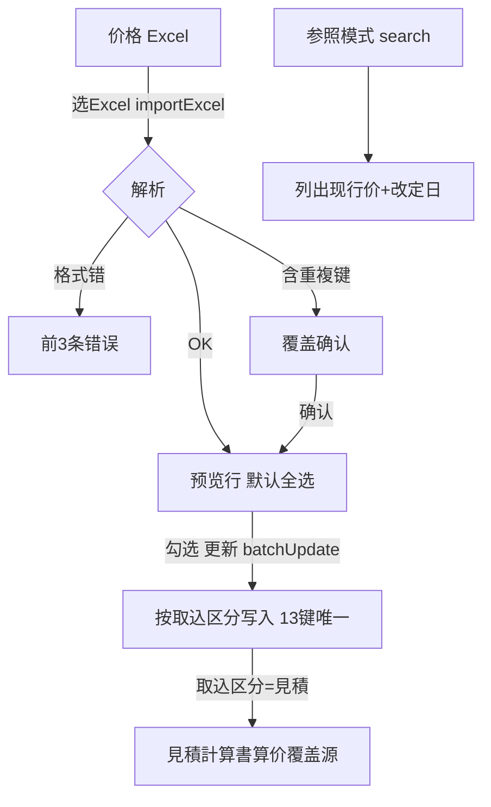

# シート単価マスタ 单页面操作 SOP（手把手版）

> **用途**：给**业务用户照着点、培训老师照着讲、测试人员照着拆用例**的单页面手册。比模块总册更细、更口语。
> **页面**：シート単価マスタ（MSBBPA130 · 销售管理 MSBB · 模块总册 §5.12）　**前端**：`views/erp/SheetUnitPriceView.vue`　**API**：`api/erp/sheetUnitPrice.ts`　**后端**：`Erp/SheetUnitPriceController` → `SheetUnitPriceService`
> **基准**：分支 `feat/wfs-inbox-core`，2026-06-28，均实测真实代码（无独立 codemap，算价引用核对 `docs/codemap-erp/02-見積計算-estimatecalc.md` 与 SOP-M04-01）。查不到的标 `待业务确认` / `代码未发现`。
> **样例数据**：基準日 今天、拠点 `BASE01`、取込区分 `見積`、得意先 `C0001`(A社)、シート・フルート `BC`、原紙(F) `K280`、単価 `30`、改定日 今天。

---

## 1. 页面一句话说明

**シート単価マスタ，就是维护"纸板单价"的价格主数据页——它是【見積計算書】算价的价格来源；一条价格靠 13 项复合键(拠点+営業担当+得意先+シート・フルート+原紙/印刷/エンボス 各 F/C/B 三层)唯一定位，带単価和改定日(生效日)；维护方式是 **Excel 批量导入**(不是逐行手录)：选基準日/拠点/取込区分(標準 or 見積)→上传 Excel→预览(重複自动检出可覆盖)→勾选→批量更新；另有"参照"模式按客户/担当查现行价。**

---

## 2. 这个页面在业务流程中的位置

```
上游(价格表)              本页面(价格主数据·Excel导入)                  下游(谁用)
──────────────       ────────────────────────────────       ────────────────────
价格 Excel ──导入──→  シート単価マスタ MSBBPA130                  見積計算書 算价
                      13复合键+単価+改定日                       ↑ 取込区分=見積(PA130)
                      取込区分: 標準 / 見積(算价覆盖源)            按 客户+フルート+原紙F
                      Excel导入→预览→批量更新 / 参照查现价         当日最新改定 覆盖原紙単価
                      ✗不触发MES/WMS
```

- **上游**：价格管理整理的纸板价 Excel。
- **本页面**：Excel 批量导入(或参照查询)纸板价；按 13 复合键唯一、带改定日。
- **下游**：【見積計算書】Step3 算价时，**取込区分=見積(見積用)** 的价是算价覆盖源——按 `客户+シート・フルート+原紙(F)` 命中当日最新改定价，覆盖默认原紙単価(详见 SOP-M04-01 §6.4)。
- **关键认知**：① 维护=**Excel 批量导入**，非手工录；② **13 项复合键**决定价格唯一，重複导入会提示覆盖；③ **取込区分 標準/見積**两套，**見積用**才是算价覆盖源；④ **改定日**决定算价取"当日最新有效价"；⑤ 改价**只影响后续算价**，不回算已有見積/受注(`待业务确认`)；⑥ 本页**不触发 MES/WMS/Bridge**。

---

## 3. 谁使用这个页面

| 角色 | 使用目的 | 常用操作 | 权限要求 | 注意事项 |
|---|---|---|---|---|
| 价格管理/营业管理 | 维护纸板价 | Excel导入/参照 | `[Authorize]`，细粒度`待业务确认` | 取込区分选对 |
| 销售 | 查某客户现价 | 参照 | 查看 | 只读 |
| 算价相关(見積担当) | 确认算价用的价 | 参照核对 | 查看 | 见積用价 |
| 测试/UAT | 验导入/复合键/算价引用 | 全流程 | 登录 | 13键唯一 |

> 📌 **权限现状**：`SheetUnitPriceController` 标 `[Authorize]`；细粒度授权 `待业务确认`。

---

## 4. 操作前准备（不准备好，下面会卡住）

| 准备项 | 为什么需要 | 不满足会怎样 | 去哪里维护/确认 | 测试关注点 |
|---|---|---|---|---|
| 基準日/拠点 填好 | 导入/查询必填 | E10022 拦 | 先填 | 必填 |
| 取込区分选对(標準/見積) | 决定写哪套(見積=算价源) | 写错套算价不变 | 业务确认 | 区分 |
| Excel 符合模板列 | 解析才成功 | 解析错误(前3条) | 用正确模板 | 解析 |
| 13 复合键齐全 | 唯一定位 | 匹配不到/重复 | 价格表 | 复合键 |
| 浏览器允许上传 | 选 Excel | 选不了 | 浏览器设置 | 上传 |
| 了解会覆盖既有 | 重複→覆盖确认 | 误覆盖 | 看确认框 | 覆盖 |

---

## 5. 页面区域说明

| 区域 | 页面位置 | 用户要做什么 | 注意事项 |
|---|---|---|---|
| 条件区 | 顶部 | 填基準日(必填)/拠点(必填)/取込区分(標準·見積)/操作种别(取込·参照) | 必填两项 |
| 取込区(register) | 取込模式显示 | 选 Excel(.xls/.xlsx) | 仅取込模式 |
| 参照区(view) | 参照模式显示 | 填得意先/営業担当→表示 | 仅参照模式 |
| 工具区 | 网格上方 | 总件数Tag / 全選 / 更新(N) / クリア | 全選·更新仅取込 |
| 结果网格 | 中部表格 | 看13复合键+単価+改定日(取込模式带勾选列) | 取込可勾选批量 |

---

## 6. 字段填写说明（口语版）

### 6.1 条件字段

| 字段 | 字段名 | 怎么填 | 必填 | 注意 |
|---|---|---|---|---|
| 基準日 | `baseDate` | 选日期(默认今天) | 是 | 空→E10022 |
| 拠点 | `baseCd` | 输据点 | 是 | 空→E10022 |
| 取込区分 | `importDiv` | 标準 / 見積(单选) | — | 見積=算价覆盖源 |
| 操作种别 | `opType` | 取込(导入) / 参照(查看) | — | 切换模式 |
| 得意先(参照) | `customerCd` | 客户CD | 否 | 参照过滤 |
| 営業担当(参照) | `salesStaffCd` | 担当CD | 否 | 参照过滤 |

### 6.2 13 项复合键（唯一定位一条价格 · DB 唯一索引 `UX_SheetUnitPrice_Pk13`）

| # | 字段 | 含义 |
|---|---|---|
| 1 | `revisionDate` | **改定日(生效日)** |
| 2 | `baseCd` | 拠点 |
| 3 | `customerCd` | 得意先 |
| 4 | `sheetFlute` | シート・フルート(楞型) |
| 5 | `paperCdF` | 原紙(表F) |
| 6 | `printCdF` | 印刷(表F) |
| 7 | `embossCdF` | エンボス(表F) |
| 8 | `paperCdC` | 原紙(中C) |
| 9 | `printCdC` | 印刷(中C) |
| 10 | `embossCdC` | エンボス(中C) |
| 11 | `paperCdB` | 原紙(裏B) |
| 12 | `printCdB` | 印刷(裏B) |
| 13 | `embossCdB` | エンボス(裏B) |

> ⚠️ **改定日是复合键第 1 位**——同一规格不同改定日 = 不同记录(价格历史)；算价取"改定日≤基准日的最新 1 条"。**営業担当 `salesStaffCd` 不在复合键内**(仅网格参考表示)。唯一性由 DB 唯一索引 `UX_SheetUnitPrice_Pk13` 保证。

### 6.3 价格字段

| 字段 | 字段名 | 含义 | 注意 |
|---|---|---|---|
| 単価 | `unitPrice` | 该规格纸板单价 | 算价用 |
| 改定日 | `revisionDate` | 价格生效日 | 算价取"当日最新改定" |

> 📌 价格**不在页面手输**——通过 Excel 导入(13复合键+単価+改定日 在 Excel 里);页面只做"导入预览→勾选→批量更新"与"参照查询"。

---

## 7. 按钮操作说明

| 按钮 | 何时点 | 系统做什么 | 成功后 | 失败处理 | 测试关注点 |
|---|---|---|---|---|---|
| 选Excel(取込) | 导入价格 | importExcel(file,基準日,拠点,取込区分)→解析+重複检出→预览(默认全选) | 网格出预览行、提示N件 | 基準日/拠点空→E10022;解析错→前3条;重複→覆盖确认 | 导入/解析/重複 |
| 全選 | 选全部 | 勾/取消全部行 | 勾选数变 | — | 批量 |
| (行)勾选 | 选要更新的 | 选中纳入批量 | — | — | 选择 |
| 更新(N) | 批量写入 | 二确认→batchUpdate(取込区分,rows) | 提示更新N件、清空 | 未选→E10009 | 更新 |
| 表示(参照) | 查现行价 | search(基準日/拠点/客户/担当) | 网格列出现价 | 必填缺→E10022;0件→E10008 | 查询 |
| クリア | 清空 | 清网格/选择/参照条件 | 清空 | — | 重置 |

> ⚠️ **Excel 导入流程**：选 Excel → 后端解析按 13 复合键组织 → 有重複(键已存在)弹"覆盖确认" → 预览行默认全选 → 勾选 → 【更新】批量写入(按取込区分写標準/見積套)。
> ⚠️ **取込区分=見積** 写入的价才是【見積計算書】算价的覆盖源(PA130)；標準套用途差异 `待业务确认`。

---

## 8. 标准业务操作 SOP（照着点）

### 场景一：Excel 批量导入見積用シート単価（主流程）
- **业务背景**：价格表更新，把見積用纸板价批量导入。
- **使用样例数据**：基準日今天、拠点 BASE01、取込区分=見積、价格 Excel(含13复合键+単価+改定日)。
- **前置条件**：① 有正确模板 Excel；② 有价格管理权限。
- **详细操作步骤**：
  1. 打开【销售管理 → シート単価マスタ】。
  2. 填【基準日】今天、【拠点】BASE01；【取込区分】选【見積】；【操作种别】选【取込】。
  3. 点【Excel选择】选价格 Excel→系统解析、预览(默认全选)。
  4. 若提示重複→确认【覆盖】(或取消)。
  5. 核对预览行，取消不需要的勾。
  6. 点【更新(N)】→二确认→批量写入。
  7. 到【見積計算書】对该客户该规格算价→确认用新价。
- **完成后检查**：① 提示更新N件；② 見積算价(見積用)按新价(覆盖原紙単価)。
- **异常处理**：基準日/拠点空→E10022；解析错→前3条错误；重複→覆盖确认；未勾更新→E10009。
- **可拆测试用例**：TC-M04-SUP-001~007、020。

### 场景二：参照查询某客户现行价
- **业务背景**：核对 A社某规格现价。
- **使用样例数据**：得意先 C0001。
- **前置条件**：有现行价。
- **详细操作步骤**：1) 填基準日/拠点；2)【操作种别】选【参照】；3) 填得意先 C0001(可加営業担当)；4)【表示】→网格列出现价+改定日。
- **完成后检查**：① 列出 C0001 各规格现价；② 与算价取值一致。
- **异常处理**：0件→E10008；必填缺→E10022。
- **可拆测试用例**：TC-M04-SUP-008/009/021。

### 场景三：重複价格覆盖确认
- **业务背景**：导入的 Excel 含已存在的复合键。
- **使用样例数据**：与现有键相同的行。
- **前置条件**：库里已有同复合键价。
- **详细操作步骤**：1) 导入含重複的 Excel；2) 系统检出重複→弹"同じデータが登録されています。上書きしますか"；3) 选确认→预览含覆盖项；4) 更新→覆盖旧价。
- **完成后检查**：① 重複项被覆盖为新価/新改定日；② 取消则不导入。
- **异常处理**：取消覆盖→预览清空。
- **可拆测试用例**：TC-M04-SUP-010/022。

### 场景四：標準 vs 見積用 两套分开维护
- **业务背景**：標準価与見積用价不同，分开管理。
- **使用样例数据**：同复合键、不同取込区分。
- **前置条件**：—。
- **详细操作步骤**：1) 取込区分=標準 导入一套；2) 取込区分=見積 导入另一套；3) 参照分别查。
- **完成后检查**：① 两套各自独立；② 見積算价只用見積用套(`待业务确认`两套精确用途)。
- **异常处理**：—。
- **可拆测试用例**：TC-M04-SUP-011/023。

### 场景五：导入解析错误处理
- **业务背景**：Excel 格式/列不符。
- **使用样例数据**：错误格式 Excel。
- **前置条件**：—。
- **详细操作步骤**：1) 选错误 Excel；2) 系统返回解析错误→显示前 3 条错误；3) 修正 Excel 重导。
- **完成后检查**：① 错误前3条可见；② 不会写入脏数据。
- **异常处理**：按错误提示修模板。
- **可拆测试用例**：TC-M04-SUP-012/024。

### 场景六：确认算价引用(下游验证)
- **业务背景**：验证改价后算价生效。
- **使用样例数据**：见積用价改后，見積計算書算同规格。
- **前置条件**：見積用价已更新。
- **详细操作步骤**：1) 更新見積用价；2) 到見積計算書填同 客户+フルート+原紙(F)；3) Step3 再計算→看標準原価/見積単価。
- **完成后检查**：① 算价用了当日最新見積用价(覆盖默认原紙単価)；② 改定日早于/等于算价基准日才生效。
- **异常处理**：没生效→查改定日/取込区分(`待业务确认`匹配规则细节)。
- **可拆测试用例**：TC-M04-SUP-025/026。

---

## 9. 状态变化说明

> 价格主数据无业务状态机；关键机制是 **改定日(生效日)** + **取込区分(標準/見積)** + **13复合键唯一**。

| 机制 | 含义 | 对下游影响 | 测试关注点 |
|---|---|---|---|
| 13复合键唯一 | 一组键一条价 | 重複导入→覆盖 | 唯一/覆盖 |
| 改定日 revisionDate | 价格生效日 | 算价取"当日最新改定" | 生效日 |
| 取込区分 見積 | 算价覆盖源(PA130) | 見積計算書算价覆盖原紙単価 | 算价引用 |
| 取込区分 標準 | 標準套 | 用途差异`待确认` | 区分 |



---

## 10. 按钮不可用 / 灰色 / 不出现原因

| 按钮/区域 | 何时不可用/不出现 | 为什么 | 怎么处理 | 测试关注点 |
|---|---|---|---|---|
| Excel选择/全選/更新 | 参照模式 | 仅取込模式有 | 切取込 | 模式 |
| 得意先/営業担当 | 取込模式 | 仅参照模式有 | 切参照 | 模式 |
| 更新 | 取込后无勾选 | 无目标 | 先勾行 | E10009 |
| 选Excel | 基準日/拠点未填 | 解析需上下文 | 先填 | E10022 |

---

## 11. 常见错误与处理

| 错误/提示 | 可能原因 | 用户处理方法 | 是否需要管理员 | 测试关注点 |
|---|---|---|---|---|
| E10022 必填缺(前端) | 基準日/拠点未填(前端拦) | 补填再操作 | 否 | 必填 |
| W10001 必填(后端) | 基準日/拠点空(后端校验) | 补填 | 否 | 必填 |
| E10097 文件读取失败 | Excel 格式不对(非xlsx) | 用正确 xlsx 模板 | 否 | 解析 |
| E10098 列数不符 | 列数≠13 | 用13列模板 | 否 | 列数 |
| E10021 必須項空 | 某行某列空(报行/列) | 补该单元格 | 否 | 空值 |
| E10099 単価非数值 | 単価列非数字 | 改成数值 | 否 | 类型 |
| E10100 マスタ存在なし | 得意先CD 在主数据查无(报行/列/值) | 先建取引先 | 否 | 主数据 |
| 重複提示 | 复合键已存在(HasDuplicates,非API错) | 确认覆盖/取消 | 否 | 重複 |
| E10009 未选 | 取込后未勾 | 勾要更新的行 | 否 | 批量 |
| E10008 无结果 | 参照无现价 | 调条件/确认有价 | 否 | 空 |
| 算价没用新价 | 改定日>基准日未生效/取込区分非見積/键不匹配 | 确认改定日≤基准日+見積用+键;到見積点【再計算】 | 是(业务) | 算价引用 |
| 批量更新覆盖了别人的改动 | batchUpdate=UPSERT **无乐观锁** | 协调避免同时改同键 | 是 | 并发覆盖风险 |
| 標準/見積用混 | 取込区分选错 | 重导对应套 | 是 | 区分 |
| 权限不足 | 无价格管理权 | 申请权限 | 是 | 权限`待确认` |
| 网络/上传异常 | 后端/网络 | 稍后重试 | 是(运维) | 异常 |

---

## 12. 操作完成后的检查清单

| 操作 | 当前页面检查 | 見積計算書检查 | 数据状态 | 测试关注点 |
|---|---|---|---|---|
| Excel导入更新 | 提示更新N件、网格清空 | 算价(見積用)用新价 | 13键唯一、改定日 | 算价引用 |
| 参照查询 | 列出现价+改定日 | 与算价取值一致 | — | 一致 |
| 重複覆盖 | 覆盖项为新価 | 算价用覆盖后价 | 旧价被覆盖 | 覆盖 |

> 📌 本页**不触发** MES/WMS/Bridge；改价**只影响后续算价**，不回算已有見積/受注(`待业务确认`)。

---

## 13. 页面级测试用例（≥25 条，可执行）

> 编号 `TC-M04-SUP-xxx`；数据用样例。测试人员补"实际结果/是否通过/缺陷编号"。

| 用例编号 | 用例名称 | 优先级 | 前置条件 | 测试数据 | 操作步骤 | 预期结果 | 备注 |
|---|---|---|---|---|---|---|---|
| TC-M04-SUP-001 | 页面打开 | P1 | 有权限 | — | 进入 | 条件区+取込模式默认 | — |
| TC-M04-SUP-002 | 基準日/拠点必填 | P0 | — | 不填 | 选Excel | E10022 | 必填 |
| TC-M04-SUP-003 | Excel导入预览 | P0 | 模板正确 | 价格Excel | 选Excel | 预览行+提示N件+默认全选 | 导入 |
| TC-M04-SUP-004 | 取込区分=見積 | P0 | — | 見積 | 导入見積套 | 写見積用 | 区分 |
| TC-M04-SUP-005 | 13复合键显示 | P1 | 有数据 | — | 看网格 | 13键列齐(拠点~エンボスB) | 复合键 |
| TC-M04-SUP-006 | 批量更新 | P0 | 有预览 | 勾选 | 更新 | 二确认→更新N件 | 更新 |
| TC-M04-SUP-007 | 未勾更新拦 | P1 | 有预览 | 不勾 | 更新 | E10009 | 批量 |
| TC-M04-SUP-008 | 参照查询 | P0 | 有现价 | C0001 | 参照→表示 | 列出现价+改定日 | 查询 |
| TC-M04-SUP-009 | 参照0件 | P1 | — | 不存在 | 参照→表示 | E10008 | 空 |
| TC-M04-SUP-010 | 重複覆盖确认 | P1 | 已有同键 | 重複Excel | 导入 | 弹覆盖确认 | 重複 |
| TC-M04-SUP-011 | 標準/見積分开 | P2 | — | 同键不同区分 | 各导一套 | 两套独立 | 区分 |
| TC-M04-SUP-012 | 解析错误 | P2 | 错格式 | 错误Excel | 选Excel | 前3条错误提示 | 解析 |
| TC-M04-SUP-013 | 全選/全不选 | P2 | 有预览 | — | 切全選 | 全勾/全不勾 | 批量 |
| TC-M04-SUP-014 | 单行勾选 | P2 | 有预览 | 勾部分 | 勾选 | 仅勾选纳入更新 | 选择 |
| TC-M04-SUP-015 | クリア重置 | P2 | 有数据 | — | クリア | 网格/选择/条件清 | 重置 |
| TC-M04-SUP-016 | 取込/参照切换 | P1 | — | — | 切模式 | 对应区域显隐 | 模式 |
| TC-M04-SUP-017 | 改定日显示 | P2 | 有数据 | — | 看改定日列 | 日期正确 | 生效日 |
| TC-M04-SUP-018 | 単価格式 | P3 | 有数据 | — | 看単価列 | 格式化右对齐 | UI |
| TC-M04-SUP-019 | 覆盖取消 | P2 | 重複 | — | 覆盖→取消 | 不导入、预览清空 | 取消 |
| TC-M04-SUP-020 | 大批量导入 | P2 | 大Excel | 多行 | 导入更新 | 全部处理 | 批量 |
| TC-M04-SUP-021 | 参照带担当过滤 | P2 | 有数据 | C0001+S001 | 参照 | 按担当过滤 | 过滤 |
| TC-M04-SUP-022 | 重複覆盖后算价 | P1 | 覆盖过 | — | 算价 | 用覆盖后价 | 算价引用 |
| TC-M04-SUP-023 | 見積用才覆盖算价 | P1 | 標準/見積 | — | 标準导入后算价 | 算价不用標準套 | 区分 |
| TC-M04-SUP-024 | 错误不写脏 | P1 | 解析错 | — | 导入错误 | 不落库 | 健壮 |
| TC-M04-SUP-025 | 算价引用新价 | P0 | 見積用更新 | 同规格 | 見積計算書再算 | 用最新見積用价 | 算价引用 |
| TC-M04-SUP-026 | 改定日生效边界 | P2 | 不同改定日 | — | 改基準日算价 | 取≤基准日的最新改定 | 生效日 |
| TC-M04-SUP-027 | 不触发下游 | P1 | 更新后 | — | 查注文追溯/工单 | 无MES/WMS/Bridge | 边界 |
| TC-M04-SUP-028 | 不回算已有見積 | P2 | 改价后 | — | 看已存見積 | 旧見積价不变(`待确认`) | 不回算 |
| TC-M04-SUP-029 | 权限不足 | P2 | 无权账号 | — | 导入 | `待业务确认`(隐藏/拒绝) | 权限 |
| TC-M04-SUP-030 | 网络异常 | P2 | 断网 | — | 导入/查询 | 友好错误可重试 | 异常 |

---

## 14. 培训讲解建议

| 讲解顺序 | 讲什么 | 演示动作 | 用户容易误解的点 |
|---|---|---|---|
| 1 | 这页是算价的价格源 | 展示 §2 流程图 | 以为和算价无关 |
| 2 | 维护=Excel批量导入 | 演示选Excel导入 | 想逐行手录 |
| 3 | 13复合键唯一 | 看网格13列 | 键不全→匹配不到 |
| 4 | 取込区分標準/見積 | 切区分 | 见積用才覆盖算价 |
| 5 | 重複覆盖 | 导重複看确认 | 怕误覆盖 |
| 6 | 改定日决定生效 | 讲当日最新改定 | 以为立即全用 |
| 7 | 算价引用验证 | 改价后算价对比 | 不验证下游 |
| 8 | 不回算已有見積 | — | 以为旧見積也变 |

---

## 15. 与模块级手册的关系

本单页 SOP 对应模块总册 `docs/manuals/user-training/01-销售管理MSBB-最详细用户操作培训手册.md` **§5.12 シート単価マスタ**：

| 本SOP章节 | 对应总册章节 |
|---|---|
| §1/§2 定位与流程 | 总册 §5.12.1 |
| §4 操作前准备 | 总册 §5.12.1a |
| §6 字段(13复合键/价) | 总册 §5.12.1b + §5.12.6 |
| §7 按钮 | 总册 §5.12.9 |
| §8 SOP | 总册 §5.12.1e |
| §9 状态(改定日/区分) | 总册 §5.12.10 |
| §10 灰按钮 | 总册 §5.12.1c |
| §12 完成后检查 | 总册 §5.12.1d |
| §13 测试用例 | 总册 §5.12.14 |
| §14 培训讲解 | 总册 §13 |

> 配套：下游 `01-01-見積計算書-单页面操作SOP`(算价引用本页見積用价 §6.4)。

---

## 16. 代码与文档来源

| 类型 | 路径 | 用途 |
|---|---|---|
| 前端页面 | `cp6.web/src/views/erp/SheetUnitPriceView.vue` | 条件/Excel导入/预览批量/参照/13键网格 |
| API | `cp6.web/src/api/erp/sheetUnitPrice.ts`(`importExcel`/`search`/`batchUpdate`) | 导入/查询/批量更新 |
| 类型 | `cp6.web/src/types/erp/sheetUnitPrice.ts`(SheetUnitPriceDto/SheetPriceQueryDto/SheetPriceImportDiv) | DTO/取込区分 |
| 路由 | `cp6.web/src/router/index.ts`(`/sheet-unit-price`) | 路径 |
| 后端 Controller | `CP6.WebApi/Controllers/Erp/SheetUnitPriceController.cs`(`GET /sheet-unit-prices/list`、`POST /import`、`PUT /batch-update`；**无 DELETE/单条编辑端点**) | 端点 |
| Service | `CP6.Core/Services/Erp/SheetUnitPriceService.cs`(`SearchAsync` 取込区分切表+12键分组取最新改定/`ImportExcelAsync` 7步校验E10097~E10100/`BatchUpdateAsync` 按13键UPSERT无乐观锁) | 业务逻辑 |
| 实体+唯一索引 | `CP6.Entity/DomainModels/Erp/SheetUnitPrice.cs`(`T_SheetUnitPrice`標準/`T_SheetUnitPriceEstimate`見積用) + `CP6Context.cs` 唯一索引 `UX_SheetUnitPrice_Pk13`(13键) | 13键唯一 |
| 算价引用 | `CP6.Core/Services/Erp/EstimateCalcService.cs`(`CalculateAsync` 查 `SheetUnitPriceEstimates` 按 客户+フルート+原紙F + RevisionDate≤today OrderByDesc 最新1条，优先于通用码Paper) | 見積用价覆盖源(PA130) |
| 模块总册 | `docs/manuals/user-training/01-销售管理MSBB-最详细用户操作培训手册.md` §5.12 | 上级手册 |
| 算价关联 | `docs/codemap-erp/02-見積計算-estimatecalc.md` + `sales-msbb-pages/01-01-見積計算書-单页面操作SOP.md` §6.4 | 算价侧引用 |
| 页面盘点表 | `docs/manuals/user-training/00-用户操作手册页面盘点表.md` | 页面索引 |

---

## 最后更新来源

- 代码：见 §16（SheetUnitPriceView + sheetUnitPrice.ts/types 实测；后端 Controller/Service/唯一索引/算价引用经 Explore 核对实证；**无独立 codemap**，并记于 `docs/codemap-erp/02-見積計算` 与 README）
- 文档：模块总册 §5.12、`docs/codemap-erp/02-見積計算-estimatecalc.md`、页面盘点表
- 基准：分支 `feat/wfs-inbox-core`，盘点日 2026-06-28
- 诚实标注(经 Explore 核对)：维护=**Excel 批量导入**(无UI直编/删除端点;软删需管理者直SQL)；**13项复合键含改定日(RevisionDate第1位)、不含営業担当**，DB唯一索引 `UX_SheetUnitPrice_Pk13` 保证唯一(重複→覆盖确认)；**見積用(Estimate,T_SheetUnitPriceEstimate)价才是算价覆盖源**(改定日≤基准日最新1条,优先于通用码),標準套(T_SheetUnitPrice)見積不用、用途差异`待业务确认`；改价**不自动回算**已有見積/受注,**手动【再計算】才反映**新价(受注复制见積価不变)；**batchUpdate=UPSERT 无乐观锁**(并发覆盖风险);本页不触发MES/WMS/Bridge
</content>
