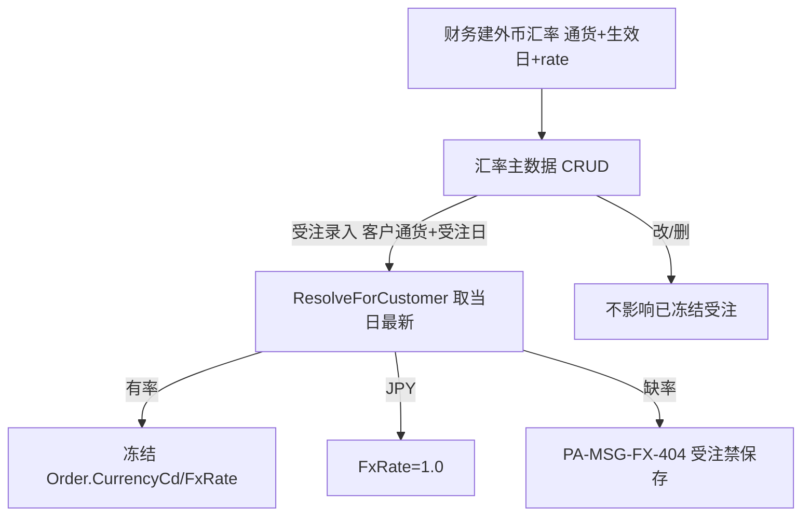

# 為替レート FxRate 单页面操作 SOP（手把手版）

> **用途**：给**财务/价格管理用户照着点、培训老师照着讲、测试人员照着拆用例**的单页面手册。比模块总册更细、更口语。
> **页面**：為替レート FxRate（汇率 · 销售管理 MSBB · 模块总册 §5.16）　**前端**：`views/erp/FxRateView.vue`　**API**：`api/erp/fxRate.ts`　**后端**：`Erp/FxRateController` → `FxRateService`
> **基准**：分支 `feat/wfs-inbox-core`，2026-06-28，均实测真实代码（经 Explore 核对）。查不到的标 `待业务确认` / `代码未发现`。
> **样例数据**：基轴 `JPY`、通货 `USD`、生效日 今天、汇率 `150.000000`(外币1=Rate JPY)、客户 `C0001`(A社)。

---

## 1. 页面一句话说明

**為替レート，就是维护外币汇率的主数据页——基轴是日元 JPY，你为 USD/EUR 这些外币按"生效日"录一条条汇率(外币 1 单位 = Rate 日元，6 位小数)；受注录入外币单时，系统会按"客户的通货 + 受注日"取**当日最新汇率**冻结进那张受注，之后改汇率也不影响已冻结的旧单。它是完整 CRUD(列表+弹框)，但**不能给 JPY 建汇率**(基轴恒为 1.0)。**

---

## 2. 这个页面在业务流程中的位置

```
上游(无)            本页面(汇率主数据 CRUD)                      下游(冻结)
─────────       ──────────────────────────────       ────────────────────
财务定汇率 ──→  為替レート FxRate                          受注入力(外币单)
               基轴JPY;外币按生效日建汇率(6位小数)         ↑ 按 客户通货+受注日
               列表+弹框 CRUD;通货过滤                     取当日最新汇率冻结
               不能给JPY建;软删                            Order.CurrencyCd/FxRate
                                                          缺率→PA-MSG-FX-404禁保存
```

- **上游**：财务确定的外币汇率。
- **本页面**：为各外币按生效日维护汇率(CRUD)。
- **下游**：【受注入力】录外币单时，系统按"客户通货 + 受注日"调 `ResolveForCustomerAsync` 取**当日最新汇率**冻结进 `Order.CurrencyCd/FxRate`；JPY 单 FxRate 恒 1.0。
- **关键认知**：① **基轴 JPY**——不能给 JPY 建汇率(PA-MSG-FX-002)，JPY 单 FxRate=1.0；② 汇率含义 = **外币 1 单位 = Rate 日元**(6位小数)；③ **生效日**决定受注取"当日最新"(rateDate≤受注日的最新一条)；④ 改/删汇率**不影响已冻结**的受注 FxRate；⑤ 缺该日汇率→受注保存被拒(PA-MSG-FX-404)。

---

## 3. 谁使用这个页面

| 角色 | 使用目的 | 常用操作 | 权限要求 | 注意事项 |
|---|---|---|---|---|
| 财务/价格管理 | 维护汇率 | 新建/编辑/删除 | `[Authorize]`，细粒度`待业务确认` | 仅外币 |
| 销售(外币单) | 看现行汇率 | 查看 | 同上 | 受注会冻结 |
| 测试/UAT | 验 CRUD/冻结/缺率 | 全流程 | 登录 | FX错误码 |

> 📌 **权限现状**：`FxRateController` 标 `[Authorize]`；细粒度授权 `待业务确认`。

---

## 4. 操作前准备（不准备好，下面会卡住）

| 准备项 | 为什么需要 | 不满足会怎样 | 去哪里维护/确认 | 测试关注点 |
|---|---|---|---|---|
| 通货CD(ISO 4217 3字) | 唯一标识币种 | 必填PA-MSG-FX-001 | 填3字币种 | 必填 |
| 确认非基轴JPY | JPY无需汇率 | 拒PA-MSG-FX-002 | 仅外币建 | 基轴 |
| 汇率>0 | 有效值 | 拒PA-MSG-FX-003 | 填正数 | 正数 |
| 生效日(rateDate) | 算"当日最新" | 取不到 | 填生效日 | 生效日 |
| 客户通货已设(下游) | 受注按客户通货取 | 取不到/默认JPY | 取引先得意先Tab | 冻结 |

---

## 5. 页面区域说明

| 区域 | 页面位置 | 用户要做什么 | 注意事项 |
|---|---|---|---|
| 检索/工具区 | 顶部 | 通货CD过滤 + 刷新 + 新建；显基轴 JPY 标签 | 即时过滤 |
| 列表 | 中部 | 看 通货/生效日/汇率(6位)/备注 + 编辑·删除 | 按通货ASC/日期DESC |
| 新建·编辑弹框 | 点新建/编辑 | 填 通货/生效日/汇率/备注 | 校验 |
| 删除确认 | 点删除 | 确认"通货/日期删除" | 软删 |

---

## 6. 字段填写说明（口语版）

### 6.1 检索条件

| 字段 | 字段名 | 怎么填 | 必填 |
|---|---|---|---|
| 通货CD | `currencyCd` | 输币种过滤(即时) | 否 |

### 6.2 列表列

| 列 | 字段 | 含义 | 注意 |
|---|---|---|---|
| 通货CD | `currencyCd` | 币种 | 3字 |
| 生效日 | `rateDate` | 汇率生效日 | — |
| 汇率 | `rate` | 外币1=Rate JPY | 6位小数 |
| 备注 | `remarks` | ≤200字 | — |
| 操作 | — | 编辑/删除 | — |

### 6.3 新建/编辑表单字段

| 字段 | 字段名 | 怎么填 | 必填 | 校验 |
|---|---|---|---|---|
| 通货CD | `currencyCd` | 3字母(自动大写) | 是 | 非JPY(FX-002) |
| 生效日 | `rateDate` | 选日期(默认今天) | 是 | — |
| 汇率 | `rate` | 数字(min0,精度6,step0.5) | 是 | >0(FX-003) |
| 备注 | `remarks` | ≤200字 | 否 | — |

> 主键=GUID(id);业务复合键=通货CD+生效日(同币种同日一条)。

---

## 7. 按钮操作说明

| 按钮 | 何时点 | 系统做什么 | 成功后 | 失败处理 | 测试关注点 |
|---|---|---|---|---|---|
| 新建 | 加新汇率 | 弹框→create(自动GUID/creator) | 列表新增 | 通货空FX-001/JPY FX-002/汇率≤0 FX-003 | 建 |
| 编辑 | 改汇率 | 弹框→update(改rate/remarks/rateDate/currencyCd) | 列表更新 | 同上 | 改 |
| 删除 | 删汇率 | 确认→remove(软删IsDeleted) | 行消失 | 不存在FX-NOTFOUND | 软删 |
| 刷新 | 重载 | list | 刷新 | — | — |
| (通货过滤) | 找某币种 | 即时过滤list | 仅该币种 | — | 过滤 |

> ⚠️ **不能给 JPY 建汇率**：基轴 JPY 恒为 1.0，建/改 JPY 汇率被拒(PA-MSG-FX-002)。
> ⚠️ **改/删不影响已冻结**：受注录入时已把汇率冻结进 `Order.FxRate`，此后改/删汇率主数据，旧受注的冻结值不变。

---

## 8. 标准业务操作 SOP（照着点）

### 场景一：新建一个外币汇率（主流程）
- **业务背景**：USD 汇率更新到 150。
- **使用样例数据**：通货 USD、生效日今天、汇率 150.000000。
- **前置条件**：有价格管理权限。
- **详细操作步骤**：1) 进【為替レート】;2) 点【新建】;3) 弹框填 通货 USD(自动大写)、生效日今天、汇率 150;4) 保存。
- **完成后检查**：① 列表出现 USD/今天/150.000000；② USD 受注按当日最新取此价。
- **异常处理**：通货空→FX-001；填 JPY→FX-002；汇率 0→FX-003。
- **可拆测试用例**：TC-M04-FX-001~005、020。

### 场景二：受注录入冻结汇率（下游验证）
- **业务背景**：建 USD 受注，验证汇率冻结。
- **使用样例数据**：通货 USD 的客户、受注日今天。
- **前置条件**：该客户通货=USD、今天有 USD 汇率。
- **详细操作步骤**：1) 受注入力选该客户;2) 系统按客户通货+受注日 ResolveForCustomer 取当日最新 USD 汇率;3) 冻结进 Order.CurrencyCd=USD/FxRate=150;4) 保存受注。
- **完成后检查**：① 受注 FxRate=当日最新；② 之后改 USD 汇率，该受注 FxRate 不变。
- **异常处理**：今天无 USD 汇率→PA-MSG-FX-404 受注禁保存→先来本页建汇率。
- **可拆测试用例**：TC-M04-FX-006/007/021。

### 场景三：JPY 单不取汇率（恒 1.0）
- **业务背景**：内销 JPY 单。
- **使用样例数据**：通货 JPY 客户。
- **前置条件**：—。
- **详细操作步骤**：1) 受注选 JPY 客户;2) 系统 FxRate=1.0(不查汇率主表)。
- **完成后检查**：① JPY 单 FxRate=1.0；② 本页给 JPY 建汇率被拒。
- **异常处理**：—。
- **可拆测试用例**：TC-M04-FX-008/009。

### 场景四：编辑/删除汇率（软删）
- **业务背景**：录错改正/作废。
- **使用样例数据**：某 USD 汇率行。
- **前置条件**：有该汇率。
- **详细操作步骤**：1) 点【编辑】改 rate/生效日/备注→保存;2) 或点【删除】确认→软删。
- **完成后检查**：① 编辑落库；② 删除后软删消失(已冻结受注不变)。
- **异常处理**：删不存在→FX-NOTFOUND。
- **可拆测试用例**：TC-M04-FX-010/011/012。

### 场景五：按生效日取"当日最新"
- **业务背景**：同币种多生效日，验证取最新。
- **使用样例数据**：USD 6/1=148、6/15=150。
- **前置条件**：有多条 USD 汇率。
- **详细操作步骤**：1) 建 USD 6/1=148、6/15=150;2) 受注日 6/20→取 6/15 的 150;3) 受注日 6/10→取 6/1 的 148。
- **完成后检查**：① 取 rateDate≤受注日的最新一条；② 边界正确。
- **异常处理**：受注日早于所有汇率→缺率 FX-404。
- **可拆测试用例**：TC-M04-FX-013/014。

### 场景六：通货过滤
- **业务背景**：只看 USD 汇率历史。
- **使用样例数据**：通货 USD。
- **前置条件**：有 USD 数据。
- **详细操作步骤**：1) 检索框输 USD;2) 列表即时过滤;3) 看 USD 各生效日(日期DESC)。
- **完成后检查**：仅 USD、按日期降序。
- **异常处理**：—。
- **可拆测试用例**：TC-M04-FX-015。

---

## 9. 状态变化说明

> 无业务状态机；核心是 **基轴 JPY + 生效日取当日最新 + 受注冻结 + 软删**。

| 机制 | 含义 | 测试关注点 |
|---|---|---|
| 基轴 JPY | JPY FxRate=1.0、不建汇率 | 基轴 |
| 生效日 rateDate | 受注取 rateDate≤受注日的最新 | 生效日 |
| 受注冻结 | 受注日取当日最新写 Order.FxRate | 冻结 |
| 软删 IsDeleted | 删除=软删,不影响已冻结 | 软删 |



---

## 10. 按钮不可用 / 灰色 / 不出现原因

| 元素 | 何时不可用 | 为什么 | 怎么处理 | 测试关注点 |
|---|---|---|---|---|
| 给JPY建/改汇率 | 通货=JPY | 基轴无需(FX-002) | 仅建外币 | 基轴 |
| 保存 | 通货空/汇率≤0 | 校验 | 补正 | 校验 |
| 删除 | (随时可,软删) | — | — | — |

---

## 11. 常见错误与处理

| 错误/提示 | 错误码 | 用户处理方法 | 是否需要管理员 | 测试关注点 |
|---|---|---|---|---|
| 通货必填 | PA-MSG-FX-001 | 填通货CD | 否 | 必填 |
| 给JPY建汇率 | PA-MSG-FX-002 | 仅外币建 | 否 | 基轴 |
| 汇率≤0 | PA-MSG-FX-003 | 填正数 | 否 | 正数 |
| 受注缺该日汇率 | PA-MSG-FX-404 | 先来本页建当日汇率 | 是(财务) | 冻结 |
| 删/改不存在 | PA-MSG-FX-NOTFOUND | 核对 | 否 | — |
| 改汇率旧单没变 | (设计如此) | 已冻结不回算,属正常 | 否 | 冻结不变 |
| 权限不足 | — | 申请权限 | 是 | 权限`待确认` |
| 网络/接口异常 | — | 稍后重试 | 是(运维) | 异常 |

---

## 12. 操作完成后的检查清单

| 操作 | 当前页面检查 | 受注检查 | 数据状态 | 测试关注点 |
|---|---|---|---|---|
| 新建/编辑汇率 | 列表反映 | 后续受注按当日最新取 | id GUID/通货+日期唯一 | CRUD |
| 删除 | 软删消失 | 已冻结受注 FxRate 不变 | IsDeleted=1 | 软删 |
| 受注冻结(下游) | — | Order.CurrencyCd/FxRate 冻结 | JPY=1.0 | 冻结 |

> 📌 本页**不触发** MES/WMS/Bridge;改/删汇率不回算已有受注。

---

## 13. 页面级测试用例（≥25 条，可执行）

> 编号 `TC-M04-FX-xxx`；数据用样例。测试人员补"实际结果/是否通过/缺陷编号"。

| 用例编号 | 用例名称 | 优先级 | 前置条件 | 测试数据 | 操作步骤 | 预期结果 | 备注 |
|---|---|---|---|---|---|---|---|
| TC-M04-FX-001 | 页面打开 | P1 | 有权限 | — | 进入 | 列表+基轴JPY标签 | — |
| TC-M04-FX-002 | 新建外币汇率 | P0 | — | USD/今天/150 | 新建→保存 | 列表新增 | CRUD |
| TC-M04-FX-003 | 通货必填 | P1 | — | 空通货 | 保存 | PA-MSG-FX-001 | 必填 |
| TC-M04-FX-004 | 给JPY建拒 | P0 | — | JPY | 保存 | PA-MSG-FX-002 | 基轴 |
| TC-M04-FX-005 | 汇率≤0拒 | P1 | — | rate=0 | 保存 | PA-MSG-FX-003 | 正数 |
| TC-M04-FX-006 | 受注冻结汇率 | P0 | USD客户+今天有率 | — | 建USD受注 | FxRate=当日最新 | 冻结 |
| TC-M04-FX-007 | 受注缺率拒 | P0 | 今天无USD率 | — | 建USD受注 | PA-MSG-FX-404禁保存 | 冻结 |
| TC-M04-FX-008 | JPY单FxRate=1.0 | P0 | JPY客户 | — | 建JPY受注 | FxRate=1.0 | 基轴 |
| TC-M04-FX-009 | JPY不查主表 | P1 | JPY | — | 建JPY受注 | 不查汇率主表 | 基轴 |
| TC-M04-FX-010 | 编辑汇率 | P1 | 有汇率 | 改rate | 编辑保存 | 落库 | 改 |
| TC-M04-FX-011 | 删除软删 | P1 | 有汇率 | — | 删除确认 | IsDeleted、消失 | 软删 |
| TC-M04-FX-012 | 删不存在 | P2 | — | 错id | 删除 | FX-NOTFOUND | — |
| TC-M04-FX-013 | 取当日最新 | P0 | 多生效日 | 6/1=148,6/15=150 | 受注6/20 | 取6/15=150 | 生效日 |
| TC-M04-FX-014 | 早日期取旧率 | P1 | 多生效日 | — | 受注6/10 | 取6/1=148 | 生效日 |
| TC-M04-FX-015 | 通货过滤 | P1 | 多币种 | USD | 输USD | 仅USD,日期DESC | 过滤 |
| TC-M04-FX-016 | 6位小数 | P2 | — | 150.123456 | 看汇率 | 6位小数显示 | 精度 |
| TC-M04-FX-017 | 通货自动大写 | P2 | — | usd | 输入 | 转USD | 大写 |
| TC-M04-FX-018 | 生效日默认今天 | P2 | — | — | 新建 | 默认今天 | 默认 |
| TC-M04-FX-019 | 备注200字 | P3 | — | 长备注 | 填 | ≤200 | 长度 |
| TC-M04-FX-020 | 改汇率旧单不变 | P1 | 已冻结受注 | — | 改USD率 | 旧受注FxRate不变 | 冻结不变 |
| TC-M04-FX-021 | 客户通货来源 | P1 | — | — | 建受注 | 按客户得意先通货 | 冻结 |
| TC-M04-FX-022 | 复合键唯一 | P2 | — | 同币同日 | 重建 | 同币同日一条(覆盖/拒`待确认`) | 唯一 |
| TC-M04-FX-023 | 列表排序 | P2 | 多数据 | — | 看列表 | 通货ASC/日期DESC | 排序 |
| TC-M04-FX-024 | 权限不足 | P2 | 无权账号 | — | 新建 | `待业务确认`(隐藏/拒绝) | 权限 |
| TC-M04-FX-025 | 网络异常 | P2 | 断网 | — | 保存 | 友好错误可重试 | 异常 |

---

## 14. 培训讲解建议

| 讲解顺序 | 讲什么 | 演示动作 | 用户容易误解的点 |
|---|---|---|---|
| 1 | 这页维护外币汇率 | 展示 §2 流程图 | 以为给JPY也建 |
| 2 | 基轴JPY、汇率含义 | 讲外币1=Rate日元 | 方向反 |
| 3 | 生效日取当日最新 | 多生效日演示 | 以为立即全用 |
| 4 | 受注冻结汇率 | 建外币受注看FxRate | 以为受注跟着改 |
| 5 | 缺率受注禁保存 | 演示FX-404 | 不懂为何拦 |
| 6 | 改/删不影响旧单 | 改率看旧单 | 以为回算 |
| 7 | JPY单恒1.0 | — | — |

---

## 15. 与模块级手册的关系

本单页 SOP 对应模块总册 `docs/manuals/user-training/01-销售管理MSBB-最详细用户操作培训手册.md` **§5.16 為替レート FxRate**：

| 本SOP章节 | 对应总册章节 |
|---|---|
| §1/§2 定位与流程 | 总册 §5.16.1 |
| §4 操作前准备 | 总册 §5.16.1a |
| §6 字段(汇率/表单) | 总册 §5.16.1b + §5.16.6/5.16.7 |
| §7 按钮 | 总册 §5.16.9 |
| §8 SOP | 总册 §5.16.1e |
| §9 状态(基轴/冻结) | 总册 §5.16.10 |
| §10 灰按钮 | 总册 §5.16.1c |
| §12 完成后检查 | 总册 §5.16.1d |
| §13 测试用例 | 总册 §5.16.14 |
| §14 培训讲解 | 总册 §13 |

> 配套：下游 `01-07-受注入力`(冻结 CurrencyCd/FxRate);多币种受注。

---

## 16. 代码与文档来源

| 类型 | 路径 | 用途 |
|---|---|---|
| 前端页面 | `cp6.web/src/views/erp/FxRateView.vue` | CRUD列表+弹框/通货过滤 |
| API | `cp6.web/src/api/erp/fxRate.ts`(`list`/`resolve`/`create`/`update`/`remove`) | CRUD+汇率解析 |
| 类型 | `cp6.web/src/types/erp/fxRate.ts`(FxRate) | DTO |
| 路由 | `cp6.web/src/router/index.ts`(`/erp/fx-rate`) | 路径 |
| 后端 Controller | `CP6.WebApi/Controllers/Erp/FxRateController.cs`(`GET /erp/fx-rate`/`/resolve`/`POST`/`PUT {id}`/`DELETE {id}`) | 端点 |
| Service | `CP6.Core/Services/Erp/FxRateService.cs`(ResolveForCustomerAsync/ResolveRateAsync rateDate≤asOf最新/基轴1.0/CRUD软删/校验FX-001~003) | 业务逻辑 |
| 实体 | `CP6.Entity/DomainModels/Erp/FxRate.cs`(CurrencyCd/RateDate/Rate(18,6)/Remarks;FxConstants.BaseCurrency=JPY) | 汇率 |
| 受注关联 | `CP6.Entity/DomainModels/Erp/Order.cs`(CurrencyCd默认JPY/FxRate默认1.0,受注冻结) | 多币种受注 |
| 模块总册 | `docs/manuals/user-training/01-销售管理MSBB-最详细用户操作培训手册.md` §5.16 | 上级手册 |
| 页面盘点表 | `docs/manuals/user-training/00-用户操作手册页面盘点表.md` | 页面索引 |

---

## 最后更新来源

- 代码：见 §16（FxRateView + fxRate.ts/types + FxRateService/Order 经 Explore 核对实测）
- 文档：模块总册 §5.16、页面盘点表
- 基准：分支 `feat/wfs-inbox-core`，盘点日 2026-06-28
- 诚实标注(经 Explore 核对)：**基轴 JPY**(不建汇率、单恒FxRate=1.0);汇率=外币1=Rate日元(6位小数);**受注按客户通货+受注日取当日最新(rateDate≤受注日)冻结**进 Order.CurrencyCd/FxRate;缺率→PA-MSG-FX-404 受注禁保存;**改/删汇率不影响已冻结受注**;错误码 PA-MSG-FX-001/002/003/404/NOTFOUND;同币种同生效日复合键重建行为(覆盖/拒) `待业务确认`;细粒度权限 `待业务确认`
</content>
