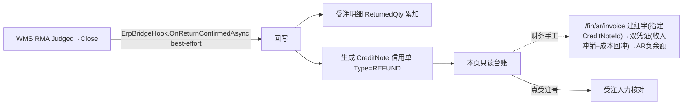

# 信用单 CreditNote 单页面操作 SOP（手把手版）

> **用途**：给**业务/财务用户照着点、培训老师照着讲、测试人员照着拆用例**的单页面手册。比模块总册更细、更口语。
> **页面**：信用单 CreditNote（クレジットノート · 销售管理 MSBB · 模块总册 §5.13）　**前端**：`views/erp/CreditNoteListView.vue`　**API**：`api/erp/creditNote.ts`　**后端**：`Erp/CreditNoteController` → `CreditNoteService`
> **基准**：分支 `feat/wfs-inbox-core`，2026-06-28，均实测真实代码（RMA→信用单链路核对 `docs/codemap-erp/05-受注-order.md` §出荷実績回写专讲 OnReturnConfirmedAsync）。查不到的标 `待业务确认` / `代码未发现`。
> **样例数据**：客户 `C0001`(A社)、受注 `WO20260701000001`、RMA号 `RMA...`、信用单NO `CN20260628-A1B2`(格式 `CN{yyyyMMdd}-{GUID4}`)、类型 `REFUND`、事由"客户退货"。

---

## 1. 页面一句话说明

**信用单，就是"客户退货后用来调整应收的那张凭据"的只读台账页——它**不在这页手工建**，而是由 **WMS 的 RMA(返品)确定** 时自动回写产生(同时把退货数累加到受注明细)；你在这页按客户/受注号/类型(退款REFUND/换货EXCHANGE/报废SCRAP)/日期检索，看每张信用单的金额、关联受注/RMA号、退货事由，点受注号还能跳回受注查原单。**

---

## 2. 这个页面在业务流程中的位置

```
上游(退货来源)                      本页面(只读台账)                     下游
─────────────────────         ────────────────────         ────────────────────
WMS RMA(返品确定) ──回写──→  信用单 CreditNote                  财务调整应收(AR)
 ErpBridgeHook                列表检索:客户/受注/类型/日期         ↑ 据信用单金额
 OnReturnConfirmedAsync       看金额/类型/受注/RMA/事由            受注 ReturnedQty 累加
 → 累加受注ReturnedQty         点受注号→跳受注入力                 (本页只读,不再触发联动)
 → 产生 CreditNote
```

- **上游**：【WMS RMA(返品)】确定时，经 Bridge Hook `ErpBridgeHook.OnReturnConfirmedAsync` 自动回写——累加受注明细 `ReturnedQty` + 生成 CreditNote。
- **本页面**：**只读**检索这些信用单；按客户/受注号/类型/日期查。
- **下游**：财务据信用单金额调整应收(AR 具体链路 `待业务确认`)；点受注号跳受注核对原单。
- **关键认知**：① 本页**纯只读**——无新建/编辑/删除，退货要走 WMS RMA；② 信用单**由 RMA 自动产生**——RMA Close 时回写**硬编码类型 = REFUND**(EXCHANGE/SCRAP 枚举预留但**无自动生成逻辑**，代码未发现)；③ 关联**受注号 + RMA号**双向可溯，但 webOrderNo/amount **可能为空**(amount 当前 API 返回 null，待财务凭证关联)；④ **AR 调整是财务手工动作**：财务在【应收发票 /fin/ar/invoice】建红字(指定 CreditNoteId)→自动生成"收入冲销+成本回冲"双凭证、AR 余额转负(不是本页/RMA 自动调应收)。

---

## 3. 谁使用这个页面

| 角色 | 使用目的 | 常用操作 | 权限要求 | 注意事项 |
|---|---|---|---|---|
| 财务 | 据信用单调应收 | 检索、核对金额 | `[Authorize]`，细粒度`待业务确认` | AR链路`待确认` |
| 销售/客服 | 查客户退货处理 | 检索、跳受注 | 同上 | 退货走WMS |
| 销售主管 | 看退货金额汇总 | 检索、类型过滤 | 同上 | 只读 |
| 测试/UAT | 验 RMA→信用单链 | 检索 | 登录 | 链路/金额 |

> 📌 **权限现状**：`CreditNoteController` 标 `[Authorize]`；细粒度授权 `待业务确认`。

---

## 4. 操作前准备（不准备好，下面会卡住）

| 准备项 | 为什么需要 | 不满足会怎样 | 去哪里维护/确认 | 测试关注点 |
|---|---|---|---|---|
| 已有 RMA 返品确定 | 信用单由RMA产生 | 列表空 | 先在 WMS 走 RMA 返品 | RMA前置 |
| 知道这是只读台账 | 本页不能建/改/删 | 找不到新建 | 退货走 WMS RMA | 只读 |
| 懂三种类型含义 | REFUND/EXCHANGE/SCRAP | 误读处理 | 见§9 | 类型 |
| 检索条件合理 | 范围影响结果 | 查不到/过多 | 调条件 | 条件 |

---

## 5. 页面区域说明

| 区域 | 页面位置 | 用户要做什么 | 注意事项 |
|---|---|---|---|
| 标题 | 顶部 | — | — |
| 检索区 | 顶部卡片 | 填客户/受注号/类型/日期范围 | 都非必填 |
| 工具区 | 列表上方 | 看总件数Tag | — |
| 结果列表 | 中部(桌面表格/移动卡片) | 看信用单、点受注号跳转 | 只读 |
| 分页区 | 列表下方 | 翻页/改每页 | 50/100/200 |

---

## 6. 字段填写说明（口语版）

### 6.1 检索条件（怎么填）

| 字段 | 字段名 | 怎么填 | 必填 | 注意 |
|---|---|---|---|---|
| 客户 | `customerCd` | 客户CD | 否 | — |
| 受注NO | `webOrderNo` | 受注号 | 否 | — |
| 类型 | `type` | ALL/REFUND退款/EXCHANGE换货/SCRAP报废 | 否 | 下拉 |
| 日期(从) | `dateFrom` | 发行日起 | 否 | — |
| 日期(至) | `dateTo` | 发行日止 | 否 | — |

### 6.2 列表列（怎么看）

| 列 | 字段 | 业务含义 | 注意 |
|---|---|---|---|
| 发行日 | `issueDate` | 信用单发行日 | — |
| 信用单NO | `creditNoteNo` | 编号 | 系统采番 |
| 受注NO | `webOrderNo` | 关联受注 | **可点跳受注** |
| RMA号 | `rmaNo` | 关联返品单 | 来源 |
| 客户 | `customerName/customerCd` | 客户 | — |
| 类型 | `type` | REFUND/EXCHANGE/SCRAP(着色tag) | 见§9 |
| 产品 | `productCd` | 退货产品 | — |
| 数量 | `qty` | 退货数量 | 右对齐 |
| 金额 | `amount` | 调应收金额 | 右对齐 |
| 事由 | `reason` | 退货原因 | >50字截断+tooltip |

> 本页是只读台账，**无表单录入**(信用单由 WMS RMA 回写产生)。

---

## 7. 按钮操作说明

| 按钮 | 何时点 | 系统做什么 | 成功后 | 失败处理 | 测试关注点 |
|---|---|---|---|---|---|
| 検索 | 设好条件 | 调 search 分页返回 | 列表出结果+总数 | 0件→空 | 检索 |
| リセット | 重查 | 清条件重查 | 条件清空 | — | 重置 |
| (受注NO链接) | 看原受注 | 跳 `/order?webOrderNo=` | 进受注入力载入 | — | 跳转 |
| (分页) | 翻页/改每页 | 重查 | 翻页 | — | 50/100/200 |

> ⚠️ **本页无新建/编辑/删除/导出按钮**——纯只读台账。信用单由 **WMS RMA 返品确定** 自动产生(`ErpBridgeHook.OnReturnConfirmedAsync`)；要"建"信用单，去 WMS 走 RMA 退货流程。

---

## 8. 标准业务操作 SOP（照着点）

### 场景一：退货后查信用单并核对应收（主流程）
- **业务背景**：A社退货，WMS 已走完 RMA，财务要核对信用单以调应收。
- **使用样例数据**：客户 C0001、类型 REFUND、日期本月。
- **前置条件**：① WMS RMA 返品已确定；② 有查看权限。
- **详细操作步骤**：
  1. 打开【销售管理 → 信用单】。
  2. 填【客户】C0001、【类型】REFUND、【日期】本月。
  3. 点【検索】→ 列表出对应信用单。
  4. 看金额/类型/事由/RMA号。
  5. 点【受注NO】跳受注入力核对原单与退货数。
  6. 财务据信用单金额调整应收(AR 链路 `待业务确认`)。
- **完成后检查**：① 信用单金额=退货金额；② 受注明细 ReturnedQty 已累加；③ RMA号可溯。
- **异常处理**：查不到→确认 RMA 是否已确定/放宽条件。
- **可拆测试用例**：TC-M04-CN-001~006、020。

### 场景二：按类型筛选（退款/换货/报废）
- **业务背景**：分别看不同处理类型的退货。
- **使用样例数据**：类型 = REFUND / EXCHANGE / SCRAP。
- **前置条件**：有各类型信用单。
- **详细操作步骤**：1) 选【类型】=REFUND→検索；2) 换 EXCHANGE/SCRAP 再查；3) 看着色 tag(退款黄/换货蓝/报废红)。
- **完成后检查**：① 仅该类型；② tag 颜色对。
- **异常处理**：某类型空→该客户无此类退货。
- **可拆测试用例**：TC-M04-CN-007/008/009。

### 场景三：按受注号反查该单所有信用单
- **业务背景**：某受注多次退货，查它的全部信用单。
- **使用样例数据**：受注 WO20260701000001。
- **前置条件**：该受注有退货。
- **详细操作步骤**：1) 填【受注NO】→検索；2) 看该受注的信用单列表；3) 点受注号跳回核对。
- **完成后检查**：① 列出该受注全部信用单；② 合计金额对应退货。
- **异常处理**：无→该受注未退货。
- **可拆测试用例**：TC-M04-CN-010/011。

### 场景四：跳受注核对原单
- **业务背景**：从信用单回看原受注。
- **使用样例数据**：任一含受注号的信用单。
- **前置条件**：信用单有受注号。
- **详细操作步骤**：1) 查到信用单；2) 点【受注NO】链接；3) 跳 `/order?webOrderNo=` 受注入力载入。
- **完成后检查**：① 跳到对应受注；② 退货数与受注 ReturnedQty 一致。
- **异常处理**：无受注号→不可跳(RMA非受注来源的`待确认`)。
- **可拆测试用例**：TC-M04-CN-012/013。

### 场景五：确认"只读"——退货必须走 WMS RMA
- **业务背景**：用户想直接在此建信用单。
- **使用样例数据**：—。
- **前置条件**：—。
- **详细操作步骤**：1) 在本页找新建/编辑/删除按钮；2) 确认没有；3) 退货改去 WMS RMA 流程。
- **完成后检查**：① 本页纯只读；② 退货闭环=WMS RMA→回写信用单。
- **异常处理**：误以为能建→引导到 WMS RMA(手册06)。
- **可拆测试用例**：TC-M04-CN-014/015。

### 场景六：移动端卡片查看
- **业务背景**：手机上查退货信用单。
- **使用样例数据**：—。
- **前置条件**：窄屏。
- **详细操作步骤**：1) 窄屏打开→卡片列表；2) 看每张信用单卡(No/日期/类型/受注/RMA/客户/金额/事由)；3) 点受注号跳转。
- **完成后检查**：① 卡片视图正常；② 跳转可用。
- **异常处理**：—。
- **可拆测试用例**：TC-M04-CN-016。

---

## 9. 状态变化说明

> 本页只读，无业务状态机操作；核心是"信用单类型"与"RMA→信用单→受注ReturnedQty/应收"的来源链。

| 类型 | 用户看到 | 业务含义 | 是否由RMA自动生成 | 测试关注点 |
|---|---|---|---|---|
| REFUND 退款 | 黄 tag | 退货退款 | **是(RMA回写硬编码REFUND)** | 退款 |
| EXCHANGE 换货 | 蓝 tag | 换货 | 否(枚举预留,无自动生成逻辑) | 枚举 |
| SCRAP 报废 | 红 tag | 退货报废 | 否(枚举预留,无自动生成逻辑) | 枚举 |

> ⚠️ **实际产生的信用单类型恒为 REFUND**(RMA Close 回写硬编码)；EXCHANGE/SCRAP 是枚举预留、当前**无自动生成路径**(代码未发现)，且本页无手工建入口→实务中列表多为 REFUND。
> ⚠️ **金额 `amount` 当前 API 返回 null**——金额需财务红字凭证关联后体现，本页金额列可能为空(`待业务确认`金额来源)。



---

## 10. 按钮不可用 / 灰色 / 不出现原因

| 元素 | 何时不可用/不出现 | 为什么 | 怎么处理 | 测试关注点 |
|---|---|---|---|---|
| 新建/编辑/删除 | 永远没有 | 本页只读、信用单由RMA产生 | 退货走 WMS RMA | 只读 |
| 受注NO链接 | 该信用单无受注号 | 非受注来源 | — | 空受注号 |
| 检索 | (随时可点) | — | — | — |

---

## 11. 常见错误与处理

| 错误/现象 | 可能原因 | 用户处理方法 | 是否需要管理员 | 测试关注点 |
|---|---|---|---|---|
| 查不到信用单 | RMA未确定/条件过严 | 确认 WMS RMA 已确定；放宽条件 | 是(查RMA) | RMA前置 |
| 想新建信用单 | 本页只读 | 退货走 WMS RMA | 否 | 只读 |
| 金额列空白 | **amount 当前 API 返回 null**(待财务红字凭证关联) | 以财务红字凭证金额为准 | 是(财务) | 金额null |
| 受注号点不动/为空 | 该信用单无受注号(RMA 原出库未解析到 WebOrderNo) | 看 RMA 来源 | 否 | 空受注号 |
| 应收没动 | **AR 红字需财务手工建**(非自动) | 财务在 /fin/ar/invoice 建红字指定 CreditNoteId | 是(财务) | AR手工 |
| 列表全是 REFUND | RMA 回写硬编码 REFUND;换货/报废无自动生成 | 属正常(代码未发现EXCHANGE/SCRAP生成) | 否 | 类型固定 |
| 类型含义不清 | REFUND/EXCHANGE/SCRAP | 见§9 | 否 | 类型 |
| 权限不足 | 无查看权 | 申请权限 | 是 | 权限`待确认` |
| 网络/接口异常 | 后端/网络 | 稍后重试 | 是(运维) | 异常 |

---

## 12. 操作完成后的检查清单

| 操作 | 当前页面检查 | 受注检查 | WMS RMA检查 | 财务AR检查 | 测试关注点 |
|---|---|---|---|---|---|
| RMA后查信用单 | 列表出现该信用单 | 受注 ReturnedQty 累加 | RMA已确定 | 据金额调应收(`待确认`) | RMA→信用单链 |
| 类型筛选 | 仅该类型 | — | — | — | 类型 |
| 跳受注 | 跳 `/order` | 载入原受注 | — | — | 跳转 |

> 📌 本页只读、**不再触发** MES/WMS/Bridge(信用单本身是 RMA 回写的结果)。

---

## 13. 页面级测试用例（≥25 条，可执行）

> 编号 `TC-M04-CN-xxx`；数据用样例。测试人员补"实际结果/是否通过/缺陷编号"。

| 用例编号 | 用例名称 | 优先级 | 前置条件 | 测试数据 | 操作步骤 | 预期结果 | 备注 |
|---|---|---|---|---|---|---|---|
| TC-M04-CN-001 | 页面打开 | P1 | 有权限 | — | 进入 | 检索区+列表 | — |
| TC-M04-CN-002 | RMA后产生信用单 | P1 | RMA已确定 | — | 退货后查 | 列表出现信用单 | RMA链 |
| TC-M04-CN-003 | 按客户检索 | P0 | 有数据 | C0001 | 填客户→検索 | 均属C0001 | 检索 |
| TC-M04-CN-004 | 按受注号检索 | P0 | 有数据 | WO号 | 填受注→検索 | 该受注信用单 | 检索 |
| TC-M04-CN-005 | 按日期范围 | P1 | 有数据 | 本月 | 选日期→検索 | 范围内 | 范围 |
| TC-M04-CN-006 | 组合检索 | P1 | 有数据 | 客户+类型 | 多条件 | 全满足 | 组合 |
| TC-M04-CN-007 | 类型REFUND过滤 | P1 | 有退款 | REFUND | 选类型 | 仅退款(黄tag) | 类型 |
| TC-M04-CN-008 | 类型EXCHANGE过滤 | P2 | 有换货 | EXCHANGE | 选类型 | 仅换货(蓝tag) | 类型 |
| TC-M04-CN-009 | 类型SCRAP过滤 | P2 | 有报废 | SCRAP | 选类型 | 仅报废(红tag) | 类型 |
| TC-M04-CN-010 | 受注反查全部信用单 | P1 | 多次退货 | WO号 | 填受注→検索 | 该受注全部信用单 | 反查 |
| TC-M04-CN-011 | 金额核对 | P1 | 有信用单 | — | 看金额 | =退货金额 | 金额 |
| TC-M04-CN-012 | 跳受注 | P1 | 有受注号 | — | 点受注NO | 跳/order载入 | 跳转 |
| TC-M04-CN-013 | 无受注号不可跳 | P2 | 无受注号信用单 | — | 看受注号列 | 无链接 | 空受注号 |
| TC-M04-CN-014 | 只读无新建 | P1 | — | — | 找新建/编辑/删除 | 无(只读) | 只读 |
| TC-M04-CN-015 | 退货走WMS RMA | P2 | — | — | 想建信用单 | 引导WMS RMA | 闭环 |
| TC-M04-CN-016 | 移动端卡片 | P3 | 移动端 | — | 窄屏打开 | 卡片+跳转可用 | 响应式 |
| TC-M04-CN-017 | 重置 | P2 | 已填条件 | — | リセット | 条件清空重查 | 重置 |
| TC-M04-CN-018 | 分页 | P1 | 多数据 | 50/100/200 | 翻页/改每页 | 正确 | 分页 |
| TC-M04-CN-019 | 空结果 | P1 | — | 不存在条件 | 検索 | 列表空 | 空 |
| TC-M04-CN-020 | RMA→ReturnedQty | P0 | RMA确定 | WO号 | 查受注 | ReturnedQty累加 | 回写 |
| TC-M04-CN-021 | RMA号显示 | P2 | 有数据 | — | 看RMA号列 | 显来源RMA | 溯源 |
| TC-M04-CN-022 | 事由超长 | P2 | 长事由 | — | 看事由列 | >50字省略+tooltip | UI |
| TC-M04-CN-023 | 类型tag颜色 | P2 | 各类型 | — | 看类型列 | 退款黄/换货蓝/报废红 | UI |
| TC-M04-CN-024 | AR调整(下游) | P2 | 有信用单 | — | 查应收 | 据金额调整(`待业务确认`) | AR链路 |
| TC-M04-CN-025 | 数量/金额格式 | P3 | 有数据 | — | 看列 | 格式化右对齐 | 格式 |
| TC-M04-CN-026 | 权限不足 | P2 | 无权账号 | — | 进页面 | `待业务确认`(隐藏/拒绝) | 权限 |
| TC-M04-CN-027 | 网络异常 | P2 | 断网 | — | 検索 | 友好错误可重试 | 异常 |

---

## 14. 培训讲解建议

| 讲解顺序 | 讲什么 | 演示动作 | 用户容易误解的点 |
|---|---|---|---|
| 1 | 这页是退货调应收的凭据台账 | 展示 §2 流程图 | 以为能在这建信用单 |
| 2 | 信用单由 WMS RMA 自动产生 | 讲 RMA→回写 | 想手工建 |
| 3 | 三种类型 REFUND/EXCHANGE/SCRAP | 类型过滤 | 类型含义 |
| 4 | 受注/RMA 双向溯源 | 点受注号跳转 | 不知能跳 |
| 5 | RMA 累加受注 ReturnedQty | 对照受注 | 退货数去哪了 |
| 6 | 财务据此调应收 | 讲 AR(`待确认`) | 以为自动调 |
| 7 | 退货闭环=WMS RMA | 引导 WMS | 在ERP找退货 |

---

## 15. 与模块级手册的关系

本单页 SOP 对应模块总册 `docs/manuals/user-training/01-销售管理MSBB-最详细用户操作培训手册.md` **§5.13 信用单 CreditNote**：

| 本SOP章节 | 对应总册章节 |
|---|---|
| §1/§2 定位与流程 | 总册 §5.13.1 |
| §4 操作前准备 | 总册 §5.13.1a |
| §6 字段(检索/列表) | 总册 §5.13.1b + §5.13.5/5.13.6 |
| §7 按钮 | 总册 §5.13.9 |
| §8 SOP | 总册 §5.13.1e |
| §9 状态(类型) | 总册 §5.13.10 |
| §10 灰按钮 | 总册 §5.13.1c |
| §12 完成后检查 | 总册 §5.13.1d |
| §13 测试用例 | 总册 §5.13.14 |
| §14 培训讲解 | 总册 §13 |

> 配套：上游 WMS RMA(手册 `06-...WMS` 退货)、闭环回写 `10-ERP-MES-WMS闭环集成`(OnReturnConfirmedAsync)、受注 `01-07-受注入力`。

---

## 16. 代码与文档来源

| 类型 | 路径 | 用途 |
|---|---|---|
| 前端页面 | `cp6.web/src/views/erp/CreditNoteListView.vue` | 检索/只读列表/类型过滤/跳受注/移动卡片 |
| API | `cp6.web/src/api/erp/creditNote.ts`(`search` → `POST /api/credit-note/search`) | 查询 |
| 类型 | `cp6.web/src/types/erp/creditNote.ts`(CreditNoteListItem/CreditNoteQuery/CreditNoteType) | DTO/类型枚举 |
| 路由 | `cp6.web/src/router/index.ts`(`/erp/credit-note`；跳 `/order?webOrderNo=`) | 路径/跳转 |
| 后端 Controller | `CP6.WebApi/Controllers/Erp/CreditNoteController.cs`(`POST /api/credit-note/search` 唯一端点) | 查询(无建/改/删) |
| Service | `CP6.Core/Services/Erp/CreditNoteService.cs`(`SearchAsync` 查询+BusinessPartner join客户名) | 查询 |
| 回写来源 | `CP6.Core/Services/Wms/ErpBridgeHook.cs:136-232`(`OnReturnConfirmedAsync`：RMA Close→OrderDetail.ReturnedQty累加+生成CreditNote(Type=REFUND硬编码,No=CN{yyyyMMdd}-{GUID4}),best-effort幂等) | RMA→信用单链 |
| RMA调用点 | `CP6.Core/Services/Wms/RmaService.cs`(`CloseAsync` Judged→Closed后调ErpBridge) | 触发 |
| AR红字(手工) | `CP6.Core/Services/Fin/ArInvoiceService.cs`(`CreateCreditMemoAsync`：财务POST/fin/ar/invoice指定CreditNoteId→IsCreditMemo红字+收入冲销/成本回冲双凭证) | 应收调整 |
| 实体 | `CP6.Entity/DomainModels/Erp/CreditNote.cs`(CreditNoteType REFUND/EXCHANGE/SCRAP) + `ArInvoice.CreditNoteId/IsCreditMemo` | 信用单/AR关联 |
| 模块总册 | `docs/manuals/user-training/01-销售管理MSBB-最详细用户操作培训手册.md` §5.13 | 上级手册 |
| 闭环回写专讲 | `docs/codemap-erp/05-受注-order.md`(§出荷実績回写专讲 OnReturnConfirmedAsync) | RMA→信用单代码级 |
| 页面盘点表 | `docs/manuals/user-training/00-用户操作手册页面盘点表.md` | 页面索引 |

---

## 最后更新来源

- 代码：见 §16（CreditNoteListView + creditNote.ts/types 实测；RMA→信用单回写以 `ErpBridgeHook.OnReturnConfirmedAsync` 与 order codemap 为据）
- 文档：模块总册 §5.13、`docs/codemap-erp/05-受注-order.md`、页面盘点表
- 基准：分支 `feat/wfs-inbox-core`，盘点日 2026-06-28
- 诚实标注(经 Explore 核对)：本页**纯只读台账**(唯一端点 `POST /api/credit-note/search`)，**信用单由 WMS RMA Close 回写自动产生**(无手工建/改/删)；**实际类型恒为 REFUND**(RMA硬编码)，EXCHANGE/SCRAP枚举预留**无自动生成逻辑**(代码未发现)；**金额 amount 当前 API 返回 null**(待财务红字凭证关联)；**AR 调整=财务手工**在 `/fin/ar/invoice` 建红字(指定 CreditNoteId)→收入冲销+成本回冲双凭证→AR 负余额(已实证,非待定)；受注号/webOrderNo 可空(RMA 原出库未解析时);本页不触发联动
</content>
