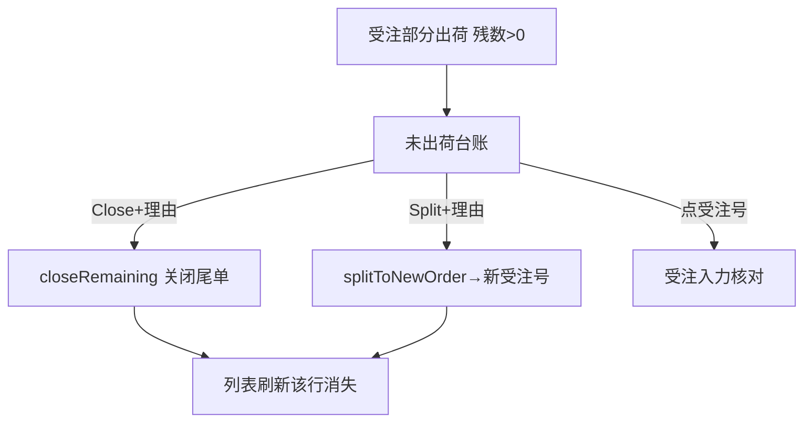

# 未出荷 Backorder 单页面操作 SOP（手把手版）

> **用途**：给**销售/跟单用户照着点、培训老师照着讲、测试人员照着拆用例**的单页面手册。比模块总册更细、更口语。
> **页面**：未出荷 Backorder（バックオーダー · 销售管理 MSBB · 模块总册 §5.14）　**前端**：`views/erp/BackorderListView.vue`　**API**：`api/erp/backorder.ts`　**后端**：`Erp/BackorderController` → `BackorderService`
> **基准**：分支 `feat/wfs-inbox-core`，2026-06-28，均实测真实代码（后端机制以 Explore 核对为准）。查不到的标 `待业务确认` / `代码未发现`。
> **样例数据**：客户 `C0001`(A社)、受注 `WO20260701000001`、明细No `1`、受注数 `10000`、出荷済 `7000`、残数 `3000`。

---

## 1. 页面一句话说明

**未出荷 Backorder，就是销售用来"盯哪些订单还没发齐"的跟单台账页——它把出荷没完成、还有残数(受注数−出荷済数>0)的受注明细列出来，显示残数和最終出荷日；并给两个跟单动作：**残数クローズ(Close)**=剩余不发了、关掉这条；**分割(Split)**=把残数拆成一张新受注继续跟。每个动作都要填理由。**

---

## 2. 这个页面在业务流程中的位置

```
上游(部分出荷的受注)            本页面(跟单台账)                      下游(动作)
─────────────────────       ──────────────────────       ────────────────────
受注→WMS出荷(部分发) ──→  未出荷 Backorder                   Close 残数クローズ→关闭尾单
 受注数>出荷済数,残数>0      检索:客户/日期                     Split 分割→生成新受注承接残数
                          列:受注/製品/受注数/出荷済/残数      点受注号→跳受注核对
                          残数クローズ / 分割(各填理由)
```

- **上游**：受注经 WMS 部分出荷后，仍有未发齐的残数。
- **本页面**：列出残数>0 的受注明细，盯尾单；可对单条做 Close(放弃剩余) 或 Split(残数拆新单)。
- **下游**：Close 关闭该未出荷；Split 生成新受注号承接残数；点受注号跳受注核对。
- **关键认知**(经 Explore 核对)：① **残数 remainingQty = 受注数 − 出荷済数 − Backorder数**，>0 即未发齐；② 台账过滤=**残数>0 且受注处于开放状态**(Confirmed/InProduction/PartiallyCancelled)，**不是**简单按 ShipStatus<9；③ **Close 残数クローズ** = 把该明细置 **ShipStatus=9 + backorderQty=remainingQty**(关闭尾单、剩余计入backorder)；**Split 分割** = 生成新受注号、残数转入新受注继续跟(返回 newWebOrderNo)；④ 两动作都**必填理由**(≤100字)；⑤ 非开放状态/已关闭/无残数的明细禁操作(后端拦)。

---

## 3. 谁使用这个页面

| 角色 | 使用目的 | 常用操作 | 权限要求 | 注意事项 |
|---|---|---|---|---|
| 销售/跟单 | 盯尾单、催发齐 | 检索、Close、Split | `[Authorize]`，细粒度`待业务确认` | 理由必填 |
| 销售主管 | 决策放弃/续跟 | Close/Split | 同上 | 影响受注 |
| 生产计划员 | 看哪些缺货没发 | 检索(只读) | 查看 | — |
| 测试/UAT | 验残数/Close/Split | 全流程 | 登录 | 理由必填 |

> 📌 **权限现状**：`BackorderController` 标 `[Authorize]`；Close/Split 的细粒度授权 `待业务确认`。

---

## 4. 操作前准备（不准备好，下面会卡住）

| 准备项 | 为什么需要 | 不满足会怎样 | 去哪里维护/确认 | 测试关注点 |
|---|---|---|---|---|
| 有未发齐的受注 | 台账才有内容 | 列表空 | 先有部分出荷的受注 | 空 |
| Close/Split 理由想好 | 必填(审计) | 理由空被拦 | 业务确认 | 必填 |
| 懂 Close vs Split | 一个放弃一个续跟 | 误操作 | 见§9 | 概念 |
| 了解动作影响受注 | 非纯只读 | 误关/误拆 | 见§7 | 影响 |

---

## 5. 页面区域说明

| 区域 | 页面位置 | 用户要做什么 | 注意事项 |
|---|---|---|---|
| 标题 | 顶部 | — | — |
| 检索区 | 顶部卡片 | 填客户/日期范围 + 检索/重置/刷新 | 都非必填 |
| 统计区 | 列表上方 | 看总件数Tag | — |
| 结果列表 | 中部(桌面表格/移动卡片) | 看残数、点受注号跳转、行操作 | 残数橙色强调 |
| 行操作 | 每行右侧(固定列) | Close 残数クローズ / Split 分割 | 各弹框填理由 |
| 操作弹框 | 点 Close/Split 弹出 | 填理由→确认 | 理由必填≤100字 |

---

## 6. 字段填写说明（口语版）

### 6.1 检索条件

| 字段 | 字段名 | 怎么填 | 必填 |
|---|---|---|---|
| 客户 | `customerCd` | 客户CD | 否 |
| 日期(从) | `dateFrom` | 起 | 否 |
| 日期(至) | `dateTo` | 止 | 否 |

### 6.2 列表列（怎么看）

| 列 | 字段 | 含义 | 注意 |
|---|---|---|---|
| 受注NO | `webOrderNo` | 受注 | **可点跳受注** |
| 客户 | `customerName/customerCd` | 客户 | — |
| 明细No | `detailNo` | 受注明细行 | — |
| 製品CD | `productCd` | 产品 | — |
| 受注数 | `orderedQty` | 订购数量 | 右对齐 |
| 出荷済数 | `shippedQty` | 已发数量 | 右对齐 |
| Backorder数 | `backorderQty` | 缺货数 | 右对齐 |
| **残数** | `remainingQty` | 未发齐数量 | **橙色强调,跟单核心** |
| 最終出荷日 | `lastShipDate` | 上次出荷日 | 跟单参考 |
| 操作 | — | Close / Split | 各需理由 |

### 6.3 动作弹框

| 字段 | 字段名 | 怎么填 | 必填 |
|---|---|---|---|
| 理由 | `reason` | Close/Split 原因(≤100字) | **是** |

> 本页**无新增表单**;Close/Split 弹框只填理由。

---

## 7. 按钮操作说明

| 按钮 | 何时点 | 系统做什么 | 成功后 | 失败处理 | 测试关注点 |
|---|---|---|---|---|---|
| 検索 | 设好条件 | 调 queue 返回未出荷列表 | 列表+总件数 | 0件→空 | 检索 |
| リセット | 重查 | 清条件重查 | 条件清空 | — | 重置 |
| 刷新(圆形) | 重载 | 重查 | 刷新 | — | 刷新 |
| (受注NO链接) | 看受注 | 跳 `/order?webOrderNo=` | 进受注入力 | — | 跳转 |
| Close 残数クローズ | 剩余不发了 | 弹框填理由→closeRemaining(关闭残数) | 提示已关闭、刷新 | 理由空→拦截 | 关闭 |
| Split 分割 | 残数改期续跟 | 弹框填理由→splitToNewOrder(拆新单) | 提示新受注号、刷新 | 理由空→拦截 | 分割 |

> ⚠️ **Close vs Split**：Close=放弃剩余、关闭这条未出荷；Split=把残数拆成一张**新受注**继续跟(返回 `newWebOrderNo`)。两者都**必填理由**。
> ⚠️ **本页非纯只读**——Close/Split 会改受注(关闭尾单/生成新单)，精确机制(出荷状态/新单字段) `待业务确认`(后端为准)。

---

## 8. 标准业务操作 SOP（照着点）

### 场景一：跟未发齐的尾单（主流程）
- **业务背景**：销售要盯 A社哪些单没发齐。
- **使用样例数据**：客户 C0001、日期本月。
- **前置条件**：① 有部分出荷的受注；② 有查看权限。
- **详细操作步骤**：1) 进【未出荷】;2) 填客户/日期→検索;3) 看残数列(橙色);4) 点受注号跳受注核对原单与出荷。
- **完成后检查**：① 列出残数>0 的明细；② 残数=受注数−出荷済数。
- **异常处理**：空→无未发齐/放宽条件。
- **可拆测试用例**：TC-M04-BO-001~005、020。

### 场景二：残数クローズ(放弃剩余)
- **业务背景**：剩余 3000 只不再发了，关掉这条。
- **使用样例数据**：残数 3000 的行；理由"客户取消剩余"。
- **前置条件**：该行残数>0。
- **详细操作步骤**：1) 点该行【Close 残数クローズ】;2) 弹框填【理由】"客户取消剩余";3) 确认→关闭。
- **完成后检查**：① 提示已关闭、列表刷新该行消失；② 受注尾单关闭(出荷状态机制`待确认`)。
- **异常处理**：理由空→拦截。
- **可拆测试用例**：TC-M04-BO-006/007/008。

### 场景三：分割残数为新受注
- **业务背景**：剩余改期续发，拆新单继续跟。
- **使用样例数据**：残数 3000 的行；理由"剩余改下月交"。
- **前置条件**：该行残数>0。
- **详细操作步骤**：1) 点该行【Split 分割】;2) 填【理由】;3) 确认→系统生成新受注号(提示 newWebOrderNo)。
- **完成后检查**：① 提示新受注号；② 新受注承接残数(字段`待确认`)；③ 列表刷新。
- **异常处理**：理由空→拦截。
- **可拆测试用例**：TC-M04-BO-009/010/011。

### 场景四：从未出荷跳受注核对
- **业务背景**：从尾单回看原受注。
- **使用样例数据**：任一未出荷行。
- **前置条件**：—。
- **详细操作步骤**：1) 点【受注NO】链接；2) 跳 `/order?webOrderNo=` 受注入力载入；3) 核对受注数/出荷状态。
- **完成后检查**：① 跳对应受注；② 出荷状态与残数一致。
- **异常处理**：—。
- **可拆测试用例**：TC-M04-BO-012。

### 场景五：理由必填校验
- **业务背景**：Close/Split 不填理由。
- **使用样例数据**：空理由。
- **前置条件**：—。
- **详细操作步骤**：1) 点 Close/Split；2) 不填理由直接确认；3) 被拦提示理由必填。
- **完成后检查**：① 拦截；② 不执行。
- **异常处理**：补理由。
- **可拆测试用例**：TC-M04-BO-013/014。

### 场景六：移动端卡片操作
- **业务背景**：手机上跟尾单。
- **使用样例数据**：—。
- **前置条件**：窄屏。
- **详细操作步骤**：1) 窄屏→卡片列表(残数tag);2) 看出荷済/受注数;3) 卡片内 Close/Split。
- **完成后检查**：① 卡片视图正常；② 操作可用。
- **异常处理**：—。
- **可拆测试用例**：TC-M04-BO-015。

---

## 9. 状态变化说明

> 本页核心是残数与两个跟单动作；动作对受注的精确状态变化以后端为准(`待业务确认`)。

| 动作 | 用户看到 | 含义 | 对受注影响(实证) | 测试关注点 |
|---|---|---|---|---|
| (列出) | 残数>0 行 | 未发齐(开放状态) | — | 残数 |
| Close 残数クローズ | 行消失 | 放弃剩余、关闭尾单 | 该明细 **ShipStatus=9 + backorderQty=remainingQty** | 关闭 |
| Split 分割 | 提示新受注号 | 残数拆新受注 | **生成新受注、残数转入新单**(newWebOrderNo) | 分割 |



---

## 10. 按钮不可用 / 灰色 / 不出现原因

| 按钮 | 何时不可用 | 为什么 | 怎么处理 | 测试关注点 |
|---|---|---|---|---|
| Close/Split 确认 | 理由空 | 理由必填 | 填理由 | 必填 |
| 行操作 | 未定位行 | 需找到行 | 检索定位 | — |
| 受注NO链接 | (随时可点) | — | — | — |

---

## 11. 常见错误与处理

| 错误/现象 | 可能原因 | 用户处理方法 | 是否需要管理员 | 测试关注点 |
|---|---|---|---|---|
| 列表空 | 无未发齐/条件严 | 放宽条件 | 否 | 空 |
| 理由必填 | Close/Split 没填理由 | 补理由 | 否 | 必填 |
| Close/Split 分不清 | 概念混淆 | Close放弃(ShipStatus=9)/Split续跟(新单) | 否 | 概念 |
| 操作被拒"状态不可" | 受注非开放状态(已取消/已完结) | 仅开放状态(Confirmed/InProduction/PartiallyCancelled)可操作 | 是(业务) | 状态闸 |
| 操作被拒"已关闭" | 该明细已 Close 过 | 重复操作保护 | 否 | 重复保护 |
| 操作被拒"无残数" | remainingQty≤0 | 无未出荷数不可操作 | 否 | 无残数 |
| 残数对不上 | 受注数−出荷済数−backorder数 | 核对受注/出荷/backorder | 是 | 残数公式 |
| 权限不足 | 无 Close/Split 权 | 申请权限 | 是 | 权限`待确认` |
| 网络/接口异常 | 后端/网络 | 稍后重试 | 是(运维) | 异常 |

---

## 12. 操作完成后的检查清单

| 操作 | 当前页面检查 | 受注检查 | WMS出荷检查 | 数据状态 | 测试关注点 |
|---|---|---|---|---|---|
| 检索 | 残数>0 明细 | — | — | — | 查询 |
| Close | 行消失、提示已关闭 | 受注尾单关闭(`待确认`) | — | 出荷状态(`待确认`) | 关闭 |
| Split | 提示新受注号 | 新受注承接残数 | — | 新单(`待确认`) | 分割 |
| 跳受注 | 跳 /order | 原受注核对 | 出荷状态一致 | — | 跳转 |

---

## 13. 页面级测试用例（≥25 条，可执行）

> 编号 `TC-M04-BO-xxx`；数据用样例。测试人员补"实际结果/是否通过/缺陷编号"。

| 用例编号 | 用例名称 | 优先级 | 前置条件 | 测试数据 | 操作步骤 | 预期结果 | 备注 |
|---|---|---|---|---|---|---|---|
| TC-M04-BO-001 | 页面打开 | P1 | 有权限 | — | 进入 | 检索区+未出荷列表 | — |
| TC-M04-BO-002 | 按客户检索 | P0 | 有数据 | C0001 | 填客户→検索 | 均属C0001 | 检索 |
| TC-M04-BO-003 | 按日期范围 | P1 | 有数据 | 本月 | 选日期→検索 | 范围内 | 范围 |
| TC-M04-BO-004 | 残数显示 | P0 | 有数据 | — | 看残数列 | 残数=受注数−出荷済数,橙色 | 残数 |
| TC-M04-BO-005 | 出荷済/受注数 | P1 | 有数据 | — | 看列 | 已发/订购正确 | 数量 |
| TC-M04-BO-006 | Close弹框 | P1 | 有残数行 | — | 点Close | 弹框含目标+理由框 | 关闭 |
| TC-M04-BO-007 | Close理由空拦 | P1 | Close弹框 | 空理由 | 确认 | 拦截需理由 | 必填 |
| TC-M04-BO-008 | Close成功 | P0 | 有残数行 | 理由 | 填理由→确认 | 提示已关闭、行消失 | 关闭 |
| TC-M04-BO-009 | Split弹框 | P1 | 有残数行 | — | 点Split | 弹框 | 分割 |
| TC-M04-BO-010 | Split理由空拦 | P1 | Split弹框 | 空理由 | 确认 | 拦截 | 必填 |
| TC-M04-BO-011 | Split成功 | P0 | 有残数行 | 理由 | 填理由→确认 | 提示新受注号、刷新 | 分割 |
| TC-M04-BO-012 | 跳受注 | P1 | 有数据 | WO号 | 点受注NO | 跳/order载入 | 跳转 |
| TC-M04-BO-013 | Close必填校验 | P1 | — | — | Close空理由 | 拦截 | 必填 |
| TC-M04-BO-014 | Split必填校验 | P1 | — | — | Split空理由 | 拦截 | 必填 |
| TC-M04-BO-015 | 移动端卡片 | P3 | 移动端 | — | 窄屏打开 | 卡片+操作可用 | 响应式 |
| TC-M04-BO-016 | 重置 | P2 | 已填条件 | — | リセット | 条件清空重查 | 重置 |
| TC-M04-BO-017 | 刷新 | P2 | 已查 | — | 点刷新 | 重载 | 刷新 |
| TC-M04-BO-018 | 空结果 | P1 | — | 不存在条件 | 検索 | 列表空提示 | 空 |
| TC-M04-BO-019 | 最終出荷日 | P2 | 有数据 | — | 看列 | 显上次出荷日/- | 日期 |
| TC-M04-BO-020 | Close后受注状态 | P1 | Close过 | WO号 | 查受注 | 尾单关闭(`待确认`) | 状态 |
| TC-M04-BO-021 | Split后新单 | P1 | Split过 | 新号 | 查新受注 | 承接残数(`待确认`) | 新单 |
| TC-M04-BO-022 | 多行跟单 | P2 | 多数据 | — | 看列表 | 多条未出荷 | 列表 |
| TC-M04-BO-023 | 理由超长截断 | P3 | — | 100+字 | 填理由 | ≤100字限制 | 长度 |
| TC-M04-BO-024 | 数量格式 | P3 | 有数据 | — | 看数量列 | 格式化右对齐 | 格式 |
| TC-M04-BO-025 | 权限不足 | P2 | 无权账号 | — | 找Close/Split | `待业务确认`(隐藏/拒绝) | 权限 |
| TC-M04-BO-026 | 网络异常 | P2 | 断网 | — | 检索/操作 | 友好错误可重试 | 异常 |

---

## 14. 培训讲解建议

| 讲解顺序 | 讲什么 | 演示动作 | 用户容易误解的点 |
|---|---|---|---|
| 1 | 这页盯没发齐的尾单 | 展示 §2 流程图 | 以为只是查询 |
| 2 | 残数=受注数−出荷済数 | 指残数列 | 不懂残数 |
| 3 | Close=放弃剩余 | 演示Close | 当成删订单 |
| 4 | Split=拆新单续跟 | 演示Split看新号 | 不懂分割 |
| 5 | 理由必填 | 故意空理由 | 不填理由 |
| 6 | 跳受注核对 | 点受注号 | — |
| 7 | 动作影响受注 | 讲Close/Split机制(`待确认`) | 以为只读 |

---

## 15. 与模块级手册的关系

本单页 SOP 对应模块总册 `docs/manuals/user-training/01-销售管理MSBB-最详细用户操作培训手册.md` **§5.14 未出荷 Backorder**：

| 本SOP章节 | 对应总册章节 |
|---|---|
| §1/§2 定位与流程 | 总册 §5.14.1 |
| §4 操作前准备 | 总册 §5.14.1a |
| §6 字段(检索/列表/理由) | 总册 §5.14.1b + §5.14.5/5.14.6 |
| §7 按钮 | 总册 §5.14.9 |
| §8 SOP | 总册 §5.14.1e |
| §9 状态(Close/Split) | 总册 §5.14.10 |
| §10 灰按钮 | 总册 §5.14.1c |
| §12 完成后检查 | 总册 §5.14.1d |
| §13 测试用例 | 总册 §5.14.14 |
| §14 培训讲解 | 总册 §13 |

> 配套：上游 `01-07-受注入力`/`01-08-受注一覧`(受注来源)；出荷在 WMS(手册06)。

---

## 16. 代码与文档来源

| 类型 | 路径 | 用途 |
|---|---|---|
| 前端页面 | `cp6.web/src/views/erp/BackorderListView.vue` | 检索/列表/残数/Close/Split/移动卡片 |
| API | `cp6.web/src/api/erp/backorder.ts`(`queue`→`GET /backorder/queue`/`closeRemaining`→`POST /backorder/{no}/{detailNo}/close-remaining`/`splitToNewOrder`→`.../split-to-new-order`) | 查询/关闭/分割 |
| 类型 | `cp6.web/src/types/erp/backorder.ts`(BackorderQueueItem/Query/ActionRequest/ActionResult) | DTO |
| 路由 | `cp6.web/src/router/index.ts`(`/erp/backorder`；跳 `/order?webOrderNo=`) | 路径/跳转 |
| 后端 Controller | `CP6.WebApi/Controllers/Erp/BackorderController.cs`(queue/close-remaining/split-to-new-order，404/400) | 端点 |
| Service | `CP6.Core/Services/Erp/BackorderService.cs`(残数=Quantity−ShippedQty−BackorderQty>0 + 开放状态过滤/Close置ShipStatus=9+backorderQty/Split生成新受注+客户名批量补) | 业务逻辑 |
| 实体 | `CP6.Entity/DomainModels/Erp/Order.cs`(OrderDetail OrderedQty/ShippedQty/ShipStatus/LastShipDate) | 受注明细 |
| 模块总册 | `docs/manuals/user-training/01-销售管理MSBB-最详细用户操作培训手册.md` §5.14 | 上级手册 |
| 受注源码手册 | `docs/codemap-erp/05-受注-order.md` | 受注/出荷状态 |
| 页面盘点表 | `docs/manuals/user-training/00-用户操作手册页面盘点表.md` | 页面索引 |

---

## 最后更新来源

- 代码：见 §16（BackorderListView + backorder.ts/types 实测；后端 ShipStatus<9 过滤/残数/Close/Split 机制以 Explore 核对为准，未确认处标 `待业务确认`）
- 文档：模块总册 §5.14、`docs/codemap-erp/05-受注-order.md`、页面盘点表
- 基准：分支 `feat/wfs-inbox-core`，盘点日 2026-06-28
- 诚实标注(经 Explore 核对)：**残数 remainingQty = 受注数 − 出荷済数 − Backorder数**;台账过滤=残数>0 **且受注开放状态**(Confirmed/InProduction/PartiallyCancelled);**Close=该明细置 ShipStatus=9 + backorderQty=remainingQty**(关闭尾单)、**Split=生成新受注承接残数**(返回newWebOrderNo),两者必填理由;非开放状态/已关闭/无残数明细禁操作(后端拦);细粒度权限 `待业务确认`
</content>
