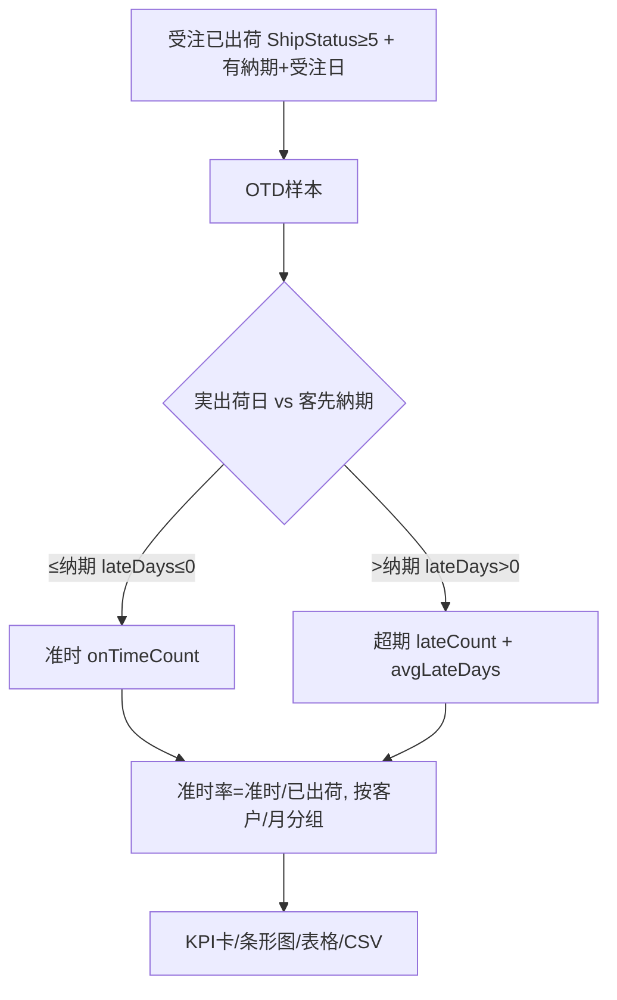

# OTD 准时交付报表 单页面操作 SOP（手把手版）

> **用途**：给**销售/管理层看、培训老师讲、测试人员拆用例**的单页面手册。比模块总册更细、更口语。
> **页面**：OTD 准时交付报表（On-Time Delivery · 销售管理 MSBB · 模块总册 §5.15）　**前端**：`views/erp/OtdReportView.vue`　**API**：`api/erp/otdReport.ts`　**后端**：`Erp/OtdReportController` → `OtdReportService`
> **基准**：分支 `feat/wfs-inbox-core`，2026-06-28，均实测真实代码（经 Explore 核对）。查不到的标 `待业务确认` / `代码未发现`。
> **样例数据**：日期范围 近90天、分组 `客户`、客户 `C0001`(A社)。

---

## 1. 页面一句话说明

**OTD 准时交付报表，就是衡量"我们发货准不准时"的 KPI 报表——在一段期间里，把已出荷的受注拿来看：实际出荷日 ≤ 客先納期就算"准时"，超过就算"超期"；它给你准时率、超期单数、平均超期天数，可按客户或月份分组，配 KPI 卡 + 条形图 + 表格，还能导出 CSV。它是销售闭环验收的核心 KPI，纯只读。**

---

## 2. 这个页面在业务流程中的位置

```
上游(出荷实绩)                  本页面(KPI 报表)                     下游
─────────────────────       ──────────────────────       ────────────────
受注(客先納期) + WMS出荷  ──→  OTD 准时交付报表                   管理层决策/KPI考核
 (ShipStatus≥5,实出荷日)       准时=実出荷日≤納期               (只读,不改业务)
                             按客户/月分组,准时率/超期/平均超期
                             KPI卡+条形图+表格+CSV导出
```

- **上游**：受注的客先納期 + WMS 出荷产生的实际出荷日(ShipStatus≥5)。
- **本页面**：聚合算准时率(准时数/已出荷数)、超期数、平均超期天数，按客户/月份分组展示。
- **下游**：管理层据 OTD 做考核/改善决策；本页**纯只读**不改业务。
- **关键认知**：① **准时 = 実出荷日 ≤ 客先納期**(lateDays≤0)；② 只统计 **ShipStatus≥5(已出荷)且有客先納期/受注日** 的受注；③ 日期范围按**受注日**聚合(非出荷日)；④ 实际出荷日取 `Order.ActualShipDate`，没有则取明细最大 `LastShipDate`。

---

## 3. 谁使用这个页面

| 角色 | 使用目的 | 常用操作 | 权限要求 | 注意事项 |
|---|---|---|---|---|
| 销售管理/管理层 | 看交付 KPI、考核 | 检索、分组、导出 | `[Authorize]`，细粒度`待业务确认` | 口径理解 |
| 销售 | 看自己客户准时率 | 检索(按客户) | 同上 | — |
| 运营/改善 | 找超期严重的客户/月 | 检索、看条形图 | 同上 | avgLateDays |
| 测试/UAT | 验 OTD 计算口径 | 全流程 | 登录 | 准时判定 |

> 📌 **权限现状**：`OtdReportController` 标 `[Authorize]`；细粒度授权 `待业务确认`。

---

## 4. 操作前准备（不准备好，下面会卡住）

| 准备项 | 为什么需要 | 不满足会怎样 | 去哪里维护/确认 | 测试关注点 |
|---|---|---|---|---|
| 有已出荷受注(ShipStatus≥5) | OTD 样本 | 报表空 | 先有出荷实绩 | 空 |
| 受注有客先納期+受注日 | 计算准时需納期 | 该单不计入 | 受注录入填納期 | 口径 |
| 日期范围合理 | 聚合范围(按受注日) | 漏/多 | 调范围 | 范围 |
| 浏览器允许下载 | CSV 导出 | 导不出 | 浏览器设置 | 导出 |
| 懂准时口径 | 否则误读 | 误判 | 见§9 | 口径 |

---

## 5. 页面区域说明

| 区域 | 页面位置 | 用户要做什么 | 注意事项 |
|---|---|---|---|
| 检索区 | 顶部 | 选日期范围/分组(客户·月份)/客户 + 検索/重置/CSV导出 | 日期默认近90天 |
| KPI 卡区 | 检索区下 | 看 总准时率(绿)/总出荷数/超期数(红) | 3 张卡 |
| 条形图区 | KPI下 | 看 Top12 分组准时率(横向条形,降序) | 色梯度好绿/警黄/差红 |
| 表格区 | 图下 | 看全分组数据(含准时率进度条) | 完整明细 |

---

## 6. 字段填写说明（口语版）

### 6.1 检索条件

| 字段 | 字段名 | 怎么填 | 必填 | 默认 |
|---|---|---|---|---|
| 日期(从~至) | `dateFrom/dateTo` | 选范围(按受注日) | 否 | 近90天 |
| 分组 | `groupBy` | 客户 / 月份 | — | 客户 |
| 客户 | `customerCd` | 客户过滤 | 否 | — |

### 6.2 KPI 与分组行（怎么看）

| 指标/列 | 字段 | 含义 | 怎么看 |
|---|---|---|---|
| 总准时率 | `onTimeRate` | 准时数/已出荷数(0~1) | 显百分比、绿色卡 |
| 总出荷数 | `totalShippedOrders` | 已出荷受注数 | 卡 |
| 超期数 | `lateCount` | 超期单数 | 红色卡 |
| 准时数 | `onTimeCount` | 准时单数 | — |
| 平均超期 | `avgLateDays` | 仅超期单平均超期天数 | 2位小数 |
| 分组标签 | `groupLabel` | 客户名 / yyyy-MM | 行/条形 |

> 本页是只读报表，**无录入表单**。

---

## 7. 按钮操作说明

| 按钮 | 何时点 | 系统做什么 | 成功后 | 失败处理 | 测试关注点 |
|---|---|---|---|---|---|
| 検索 | 设好条件 | 调 summary 算 OTD | KPI卡+条形图+表格 | 0数据→空 | 查询 |
| リセット | 重查 | 清条件重查 | 重置 | — | 重置 |
| CSV导出 | 要导出 | 调 export-csv→下载(UTF-8 BOM,含全行+KPI) | 浏览器下载 | 拦截→允许下载 | 导出 |

> ⚠️ **准时率口径**：筛选 ShipStatus≥5(已出荷)+有客先納期+有受注日的受注 → 按 `実出荷日 − 客先納期 = lateDays`，≤0 算准时 → `准时率 = 准时数 / 已出荷数`(四舍五入到万分位)；超期单(lateDays>0)计入超期数与平均超期。

---

## 8. 标准业务操作 SOP（照着点）

### 场景一：看本季度准时交付率（主流程）
- **业务背景**：管理层季度复盘交付 KPI。
- **使用样例数据**：日期范围本季、分组=客户。
- **前置条件**：① 有出荷实绩；② 受注有納期。
- **详细操作步骤**：1) 进【OTD报表】(默认近90天);2) 调日期范围、分组=客户;3)【検索】;4) 看 准时率卡(绿)/总出荷/超期卡(红);5) 看条形图找准时率低的客户。
- **完成后检查**：① 准时率=准时数/已出荷数；② 超期单 lateDays>0；③ 条形图按准时率降序。
- **异常处理**：空→放宽范围/确认有出荷。
- **可拆测试用例**：TC-M04-OTD-001~006、020。

### 场景二：按月份看交付趋势
- **业务背景**：看月度准时率趋势。
- **使用样例数据**：分组=月份。
- **前置条件**：跨月数据。
- **详细操作步骤**：1) 分组选【月份】→検索;2) 表格/条形按 yyyy-MM 分组;3) 找准时率下滑的月。
- **完成后检查**：① 各月一行(yyyy-MM)；② 趋势可见。
- **异常处理**：—。
- **可拆测试用例**：TC-M04-OTD-007/008。

### 场景三：导出 CSV 给报告
- **业务背景**：把 OTD 数据导出做月报。
- **使用样例数据**：当前查询结果。
- **前置条件**：已检索出数据。
- **详细操作步骤**：1) 先検索;2)【CSV导出】;3) 浏览器下载;4) 打开核对(含各分组行+KPI汇总)。
- **完成后检查**：① CSV含全部分组行+KPI；② UTF-8 不乱码。
- **异常处理**：下载被拦→允许。
- **可拆测试用例**：TC-M04-OTD-009/010。

### 场景四：定位超期严重的客户
- **业务背景**：找交付最差的客户改善。
- **使用样例数据**：分组=客户、看 avgLateDays。
- **前置条件**：有超期数据。
- **详细操作步骤**：1) 分组=客户→検索;2) 看条形图最低准时率/表格最大平均超期;3) 锁定客户。
- **完成后检查**：① 准时率最低的客户在条形图底；② avgLateDays 高=超期重。
- **异常处理**：—。
- **可拆测试用例**：TC-M04-OTD-011/012。

### 场景五：理解口径——哪些受注计入
- **业务背景**：核对为什么某单没进 OTD。
- **使用样例数据**：未出荷/无納期的受注。
- **前置条件**：—。
- **详细操作步骤**：1) 确认该单 ShipStatus≥5(已出荷)?;2) 有客先納期?有受注日?;3) 缺任一则不计入。
- **完成后检查**：① 只有已出荷+有納期/受注日的计入；② 未出荷/无納期排除。
- **异常处理**：要计入→补納期/完成出荷。
- **可拆测试用例**：TC-M04-OTD-013/014/021。

### 场景六：单客户筛选
- **业务背景**：只看 A社 OTD。
- **使用样例数据**：客户 C0001。
- **前置条件**：—。
- **详细操作步骤**：1) 填客户 C0001→検索;2) 看该客户 KPI/明细。
- **完成后检查**：仅 C0001 数据。
- **异常处理**：—。
- **可拆测试用例**：TC-M04-OTD-015。

---

## 9. 状态变化说明

> 本页是只读报表，无业务状态机；核心是**准时判定口径**。

| 概念 | 计算 | 说明 |
|---|---|---|
| 计入样本 | ShipStatus≥5 且 有客先納期 且 有受注日 | 已出荷+有納期才算 |
| 実出荷日 | Order.ActualShipDate 否则 明细最大 LastShipDate | 取值优先级 |
| lateDays | 実出荷日 − 客先納期 | ≤0 准时 / >0 超期 |
| onTimeRate | round(准时数/已出荷数, 4) | 万分位 |
| avgLateDays | 仅超期单平均 | 2位小数 |



---

## 10. 按钮不可用 / 灰色 / 不出现原因

| 元素 | 何时不可用 | 为什么 | 怎么处理 | 测试关注点 |
|---|---|---|---|---|
| (无写操作) | — | 纯只读报表 | — | 只读 |
| CSV导出 | (浏览器层)下载被拦 | 浏览器策略 | 允许下载 | — |
| 分组维度 | 仅 客户/月份 两种 | 固定 | 选其一 | 分组 |

---

## 11. 常见错误与处理

| 错误/现象 | 可能原因 | 用户处理方法 | 是否需要管理员 | 测试关注点 |
|---|---|---|---|---|
| 报表空 | 范围无已出荷数据 | 放宽范围/确认有出荷 | 否 | 空 |
| 某单没计入 | 未出荷/无客先納期/无受注日 | 补納期或完成出荷 | 是(业务) | 口径 |
| 准时率看着不对 | 出荷日/納期口径 | 核对 ActualShipDate vs 納期 | 是 | 口径 |
| CSV乱码 | 编码/Excel | UTF-8 打开 | 否 | 编码 |
| 想看出荷日聚合 | 本页按受注日聚合 | 知悉口径(`待业务确认`是否需出荷日维度) | 是(业务) | 聚合维度 |
| 权限不足 | 无查看权 | 申请权限 | 是 | 权限`待确认` |
| 网络/接口异常 | 后端/网络 | 稍后重试 | 是(运维) | 异常 |

---

## 12. 操作完成后的检查清单

| 操作 | 当前页面检查 | 关联检查 | 测试关注点 |
|---|---|---|---|
| 检索 | KPI卡+条形图+表格 | 与受注出荷实绩一致 | 口径 |
| 分组切换 | 客户/月份分组正确 | — | 分组 |
| CSV导出 | 下载文件 | 内容=全分组行+KPI | 导出 |
| 单客户筛选 | 仅该客户 | — | 过滤 |

> 📌 本页**只读**、不触发任何联动。

---

## 13. 页面级测试用例（≥25 条，可执行）

> 编号 `TC-M04-OTD-xxx`；数据用样例。测试人员补"实际结果/是否通过/缺陷编号"。

| 用例编号 | 用例名称 | 优先级 | 前置条件 | 测试数据 | 操作步骤 | 预期结果 | 备注 |
|---|---|---|---|---|---|---|---|
| TC-M04-OTD-001 | 页面打开默认 | P1 | 有权限 | — | 进入 | 默认近90天+KPI/图/表 | — |
| TC-M04-OTD-002 | 准时率计算 | P0 | 有数据 | 期间 | 検索 | 准时率=准时/已出荷 | 口径 |
| TC-M04-OTD-003 | 超期数计算 | P0 | 有超期 | — | 検索 | lateDays>0计超期 | 超期 |
| TC-M04-OTD-004 | 平均超期 | P1 | 有超期 | — | 看avgLateDays | 仅超期单平均(2位) | 平均 |
| TC-M04-OTD-005 | KPI卡颜色 | P2 | — | — | 看卡 | 准时率绿/超期红 | UI |
| TC-M04-OTD-006 | 条形图降序 | P2 | 多分组 | — | 看条形 | 准时率降序+色梯度 | 图 |
| TC-M04-OTD-007 | 按客户分组 | P0 | 有数据 | 客户 | 分组=客户 | 按客户聚合 | 分组 |
| TC-M04-OTD-008 | 按月份分组 | P1 | 跨月 | 月份 | 分组=月份 | yyyy-MM行 | 分组 |
| TC-M04-OTD-009 | CSV导出 | P1 | 有结果 | — | CSV导出 | 含全行+KPI | 导出 |
| TC-M04-OTD-010 | CSV编码 | P2 | 有日文 | — | 打开CSV | UTF-8不乱码 | 编码 |
| TC-M04-OTD-011 | 定位低准时客户 | P1 | 多客户 | — | 看条形/表 | 最低在底 | 改善 |
| TC-M04-OTD-012 | 平均超期高客户 | P2 | 有超期 | — | 看avgLateDays | 高=超期重 | — |
| TC-M04-OTD-013 | 仅已出荷计入 | P0 | 含未出荷 | — | 検索 | 未出荷不计入 | 口径 |
| TC-M04-OTD-014 | 无納期不计入 | P1 | 无納期单 | — | 検索 | 不计入 | 口径 |
| TC-M04-OTD-015 | 单客户筛选 | P1 | 有数据 | C0001 | 填客户 | 仅C0001 | 过滤 |
| TC-M04-OTD-016 | 日期范围 | P1 | 有数据 | 改范围 | 検索 | 按受注日聚合 | 范围 |
| TC-M04-OTD-017 | 默认近90天 | P2 | — | — | 进入 | 默认范围 | 默认 |
| TC-M04-OTD-018 | 重置 | P2 | 已填 | — | リセット | 重置 | 重置 |
| TC-M04-OTD-019 | 空结果 | P1 | 无数据期间 | — | 検索 | 空/0 | 空 |
| TC-M04-OTD-020 | 実出荷日取值 | P1 | — | — | 核对 | ActualShipDate否则明细最大LastShipDate | 取值 |
| TC-M04-OTD-021 | 准时边界(=納期) | P1 | 出荷日=納期 | — | 検索 | lateDays=0算准时 | 边界 |
| TC-M04-OTD-022 | 表格进度条 | P3 | 有数据 | — | 看表 | 准时率进度条 | UI |
| TC-M04-OTD-023 | 只读 | P2 | — | — | 找写操作 | 无(纯报表) | 只读 |
| TC-M04-OTD-024 | 权限不足 | P2 | 无权账号 | — | 进页面 | `待业务确认`(隐藏/拒绝) | 权限 |
| TC-M04-OTD-025 | 网络异常 | P2 | 断网 | — | 検索/导出 | 友好错误可重试 | 异常 |
| TC-M04-OTD-026 | 大数据量 | P2 | 海量 | 宽范围 | 検索 | 正常聚合 | 性能 |

---

## 14. 培训讲解建议

| 讲解顺序 | 讲什么 | 演示动作 | 用户容易误解的点 |
|---|---|---|---|
| 1 | 这页是交付准时率 KPI | 展示 §2 流程图 | 以为是订单查询 |
| 2 | 准时口径(实出荷日≤納期) | 讲 lateDays | 不懂准时定义 |
| 3 | 哪些单计入(已出荷+納期) | 讲过滤 | 以为全部受注 |
| 4 | 按客户/月分组 | 切分组 | — |
| 5 | KPI卡+条形图读法 | 指准时率/超期 | 颜色含义 |
| 6 | 导出 CSV | 导出做月报 | — |
| 7 | 按受注日聚合 | — | 以为按出荷日 |

---

## 15. 与模块级手册的关系

本单页 SOP 对应模块总册 `docs/manuals/user-training/01-销售管理MSBB-最详细用户操作培训手册.md` **§5.15 OTD 准时交付报表**：

| 本SOP章节 | 对应总册章节 |
|---|---|
| §1/§2 定位与流程 | 总册 §5.15.1 |
| §4 操作前准备 | 总册 §5.15.1a |
| §6 字段(检索/KPI) | 总册 §5.15.1b + §5.15.5/5.15.6 |
| §7 按钮 | 总册 §5.15.9 |
| §8 SOP | 总册 §5.15.1e |
| §9 状态(口径) | 总册 §5.15.10 |
| §12 完成后检查 | 总册 §5.15.1d |
| §13 测试用例 | 总册 §5.15.14 |
| §14 培训讲解 | 总册 §13 |

> 配套：上游受注 `01-07-受注入力`(納期来源)、出荷在 WMS(手册06)、闭环 `10-ERP-MES-WMS闭环集成`。

---

## 16. 代码与文档来源

| 类型 | 路径 | 用途 |
|---|---|---|
| 前端页面 | `cp6.web/src/views/erp/OtdReportView.vue` | 检索/KPI卡/条形图/表格/CSV |
| API | `cp6.web/src/api/erp/otdReport.ts`(`summary`→`POST /otd-report/summary`/`exportCsv`→`POST /otd-report/export-csv`) | 汇总/导出 |
| 类型 | `cp6.web/src/types/erp/otdReport.ts`(OtdReportQuery/Summary/RowDto) | DTO |
| 路由 | `cp6.web/src/router/index.ts`(`/erp/otd-report`) | 路径 |
| 后端 Controller | `CP6.WebApi/Controllers/Erp/OtdReportController.cs`(summary/export-csv) | 端点 |
| Service | `CP6.Core/Services/Erp/OtdReportService.cs`(ShipStatus≥5+納期+受注日过滤/lateDays=実出荷日−納期/onTimeRate round4/avgLateDays/按客户·月分组) | OTD计算 |
| 实体 | `CP6.Entity/DomainModels/Erp/Order.cs`(ShipStatus/ActualShipDate/CustomerDeliveryDate/OrderDate;OrderDetail.LastShipDate) | 受注/出荷 |
| DTO | `CP6.Entity/DTOs/Erp/OtdReportDto.cs` | Query/Summary/Row |
| 模块总册 | `docs/manuals/user-training/01-销售管理MSBB-最详细用户操作培训手册.md` §5.15 | 上级手册 |
| 受注源码手册 | `docs/codemap-erp/05-受注-order.md` | 受注/出荷状态 |
| 页面盘点表 | `docs/manuals/user-training/00-用户操作手册页面盘点表.md` | 页面索引 |

---

## 最后更新来源

- 代码：见 §16（OtdReportView + otdReport.ts/types + OtdReportService 经 Explore 核对实测）
- 文档：模块总册 §5.15、`docs/codemap-erp/05-受注-order.md`、页面盘点表
- 基准：分支 `feat/wfs-inbox-core`，盘点日 2026-06-28
- 诚实标注(经 Explore 核对)：**准时=実出荷日≤客先納期**(lateDays≤0)；样本=**ShipStatus≥5 + 有客先納期 + 有受注日**;实出荷日取 ActualShipDate 否则明细最大 LastShipDate;**日期范围按受注日聚合**(非出荷日);准时率 round 万分位、avgLateDays 仅超期单平均;纯只读报表不触发联动;是否需"按出荷日聚合"维度 `待业务确认`;细粒度权限 `待业务确认`
</content>
