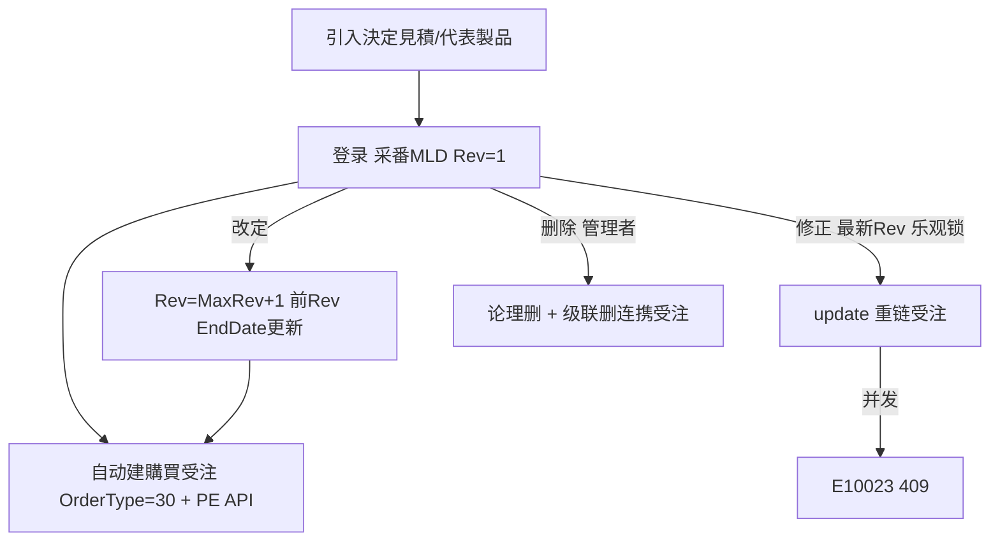

# 版型・木型 PlateMold 单页面操作 SOP（手把手版）

> **用途**：给**工务/版型管理/销售用户照着点、培训老师照着讲、测试人员照着拆用例**的单页面手册。比模块总册更细、更口语。
> **页面**：版型・木型 PlateMold（MSBBPA140 编辑 + PA160 一覧 · 销售管理 MSBB · 模块总册 §5.18）　**前端**：`views/erp/PlateMoldView.vue`(编辑 `/plate-mold`)、`PlateMoldListView.vue`(一覧 `/plate-mold-list`)　**API**：`api/erp/plateMold.ts`　**后端**：`Erp/PlateMoldController` → `PlateMoldService`
> **基准**：分支 `feat/wfs-inbox-core`，2026-06-28，均实测真实代码（经 Explore 核对）。查不到的标 `待业务确认` / `代码未发现`。
> **样例数据**：版型No `MLD2606000001`(采番 MLD+年月+4桁)、改訂 `1`、代表製品 `PRD2026070001`、客户 `C0001`(A社)、供应商、決定見積 `EMC...`。

---

## 1. 页面一句话说明

**版型・木型，就是维护印版/木型(トムソン抜き型/印刷版等)主数据的页——你按"决定見積/代表製品"引入构成，建一条版型(系统采番 MLD…，改訂 Rev 从 1 起)，记它的名称/種別/工程/尺寸/打数(使用次数)/限界打数/置场/供应商/日程；登录或改定时系统会**自动生成一张購買受注**去采购这块版型。一覧页可多条件检索、发行标签、导出 CSV。**注意：这是 ERP 版型主数据，和 WMS 的"版型在庫"是两回事。**

---

## 2. 这个页面在业务流程中的位置

```
上游(引入源)                  本页面(版型主数据)                       下游(自动建单)
─────────────────         ──────────────────────────         ────────────────────
决定見積/代表製品 ──引入──→  版型・木型 PlateMold                    購買受注(自动)
 (构成/尺寸)                 编辑(登录/改定/修正/删除/参照)            ↑ T_Order OrderType=30購買品
                            采番 MLD;改訂 Rev 管理                   + OrderDetail(118项)
                            一覧(检索/标签/CSV/picker)               PE API 连携外部
                                                                  (删除→级联删该受注)
```

- **上游**：从【決定見積(by-estimate-calc)】或【代表製品(by-product)】引入构成/尺寸。
- **本页面**：编辑页建/改/删版型(采番 MLD、改訂 Rev)；一覧页检索/标签/导出。
- **下游**：**版型登录/改定/修正会自动生成一张購買受注**(去采购这块版型) + PE API 连携外部系统；删除级联论理删该受注。
- **关键认知**：① **ERP 版型主数据 ≠ WMS 版型在庫**(`/wms/plate-mold-stock` 是库存)；② 主键 = **版型No(wdPtnNo) + 改訂(wdRev)**；③ 操作种别 5 种：登录/改定(MaxRev+1)/修正(仅最新Rev,乐观锁)/删除(管理者论理删)/参照；④ **登录/改定/修正自动建購買受注**；⑤ 一覧 `onlyLatestRev` 默认只看最新改訂。

---

## 3. 谁使用这个页面

| 角色 | 使用目的 | 常用操作 | 权限要求 | 注意事项 |
|---|---|---|---|---|
| 工务/版型管理 | 建/改/查版型 | 登录/改定/修正/参照/标签 | `[Authorize]`，细粒度`待业务确认` | 自动建采购单 |
| 版型管理员 | 删版型 | 删除(管理者) | 删除限`待业务确认` | 级联删受注 |
| 销售 | 查产品版型 | 一覧检索/参照 | 同上 | — |
| 测试/UAT | 验改訂/受注连携/乐观锁 | 全流程 | 登录 | 受注连携 |

> 📌 **权限现状**：`PlateMoldController` 标 `[Authorize]`；删除是否限管理者 `待业务确认`(参考取引先模式)。

---

## 4. 操作前准备（不准备好，下面会卡住）

| 准备项 | 为什么需要 | 不满足会怎样 | 去哪里维护/确认 | 测试关注点 |
|---|---|---|---|---|
| 区分 ERP 版型 vs WMS 版型在庫 | 两功能不同 | 找错页 | ERP主数据/WMS库存 | 区分 |
| 有决定見積/代表製品(引入) | 引入构成省手输 | 只能手填 | 御見積/製品マスタ | 引入 |
| 必填:拠点/決定見積/版型名/客户/代表製品/适用开始日/供应商 | 登录必填 | 保存被拦 | 备齐 | 必填 |
| 改/删前先有版型No | 这些操作针对已存 | 提示先读 | 一覧或读込 | 无cd |
| 懂登录会自动建采购单 | 非纯主数据 | 误以为只登记 | 见§7 | 受注连携 |

---

## 5. 页面区域说明

| 区域 | 页面位置 | 用户要做什么 | 注意事项 |
|---|---|---|---|
| 操作种别区(编辑页) | 顶部 | 选 登录/改定/修正/参照/删除 | 改定/修正/参照/删除须先读 |
| Tab(编辑页) | 主体 | 基本情報/構成情報/添付情報(8勾)/必要物(9数量)/履歴 | 履歴看各Rev |
| 底部(编辑页) | 页底 | ラベル発行/購買発注書(PE)/保存/クリア | — |
| 检索区(一覧) | 顶部 | 多条件(基础+折叠詳細)+onlyLatestRev | FROM≤TO |
| 列表(一覧) | 主体 | 看版型多列、勾発行、詳細跳编辑 | 选中高亮 |
| 工具(一覧) | 检索区 | 表示/クリア/CSV/Label(N)/picker | — |

---

## 6. 字段填写说明（口语版）

### 6.1 操作种别（5 种，编辑页）

| 操作种别 | 值 | 用途 | 关键 |
|---|---|---|---|
| 登录 Register | 10 | 建新版型 | 采番MLD、Rev=1、自动建采购单 |
| 改定 Revise | 20 | 出新改訂版 | Rev=MaxRev+1、前Rev EndDate自动更新、版型名RO |
| 修正 Edit | 30 | 改最新Rev | 仅最新Rev、乐观锁(E10023 409) |
| 删除 Delete | 40 | 论理删 | 管理者、级联删连携受注 |
| 参照 View | 50 | 只读 | — |

### 6.2 关键字段（编辑页 基本情報）

| 字段 | 字段名 | 必填 | 说明 |
|---|---|---|---|
| 版型No+改訂 | `wdPtnNo`+`wdRev` | 自动 | 采番MLD;主键 |
| 拠点 | `baseCd` | 是 | — |
| 決定見積No | `decisionEstimateNo` | 是 | 引入源 |
| 版型名 | `vrsnName` | 是 | 改定/修正时RO |
| 得意先 | `customerCd` | 是 | — |
| 代表製品 | `representativeProductCd` | 是 | 引入构成 |
| 适用开始日 | `stDate` | 是 | 改定自动续EndDate |
| 供应商 | `supplierCd` | 是 | 自动建采购单去这家 |
| 工程 | `processCd` | 否 | 0300フレキソ/0450オフセット/0600トムソン/0650箔押→自动定種別 |
| 売上可否 | `earningsCd` | 否 | 1可/2不可/3商品込/4社内/5後報 |
| 打数/限界打数 | `wdQty`/`limitWdQty` | 否(打数系统加) | 寿命管理 |
| 构成(段/原紙/印刷/エンボス/メーカ F·C·B)/尺寸/付数/個数/色数 | — | 否 | 引入/手填 |
| 決定価格/仕入予定 | `decisionAmount`/`purchaseAmount` | 否 | 采购单价 |
| 置場/棚 | `placeCd`/`shelfLineCd` | 否(系统管理disabled) | — |

### 6.3 一覧检索条件
基础:拠点/担当/适用开始日/手配No/案件/版型No(区间)/名称/種別/新版/客户/代表製品/工程/供应商/置場/棚位 + 折叠詳細(打数·限界打数·最終使用·入荷·廃棄予定·返却予定·返却日 区间) + onlyLatestRev(默认勾)。FROM≤TO→E10036。

---

## 7. 按钮操作说明

| 按钮 | 何时点 | 系统做什么 | 成功后 | 失败处理 | 测试关注点 |
|---|---|---|---|---|---|
| 引入(決定見積/代表製品) | 登录时 | by-estimate-calc/by-product 带出构成 | 字段带出 | — | 引入 |
| 保存(登录) | 建版型 | create:采番MLD+Rev=1+**自动建購買受注**+PE API | 得版型No、转修正 | 必填缺→拦 | 采番/受注连携 |
| 保存(改定) | 出新Rev | revise:Rev=MaxRev+1+前Rev EndDate更新+建受注 | 新Rev | 未来日Rev已存→Error | 改定 |
| 保存(修正) | 改最新Rev | update:乐观锁+重链受注+PE | 更新 | 非最新Rev/409 E10023 | 乐观锁 |
| 删除 | 删版型 | 论理删+级联论理删连携受注+PE删 | 删除 | 管理者限`待确认`;409 | 级联删 |
| ラベル発行 | 出标签 | label(targets)→标签CSV | 下载 | 未选E10010 | 标签 |
| 表示(一覧) | 检索 | search分页 | 列表 | FROM>TO E10036;0件E10008 | 检索 |
| CSV出力 | 导出 | export.csv全量 | 下载 plate-molds_日期.csv | — | 导出 |
| 詳細(行) | 看版型 | 跳 `/plate-mold?wdPtnNo=&rev=&mode=view` | 编辑页只读 | — | 跳转 |
| 選択返却(picker) | 他页选版型 | ?picker=1 选行带 wdPtnNo/rev 回 | 返回 | 未选E10009 | picker |

> ⚠️ **登录/改定/修正会自动生成購買受注**：系统建 T_Order(OrderType=30 購買品)+OrderDetail(118项)去采购该版型，并经 PE API 连携外部；版型号写进采购明细。删除时级联论理删该受注。
> ⚠️ **改訂 Rev 管理**：登录 Rev=1；改定 Rev=MaxRev+1 且前 Rev 的 EndDate 自动设为新 Rev 的开始日前一天；修正只改最新 Rev(乐观锁)。

---

## 8. 标准业务操作 SOP（照着点）

### 场景一：从决定見積引入建一块版型（主流程）
- **业务背景**：报价确定后建トムソン抜き型。
- **使用样例数据**：決定見積 EMC…、代表製品 PRD2026070001、供应商。
- **前置条件**：① 有决定見積/代表製品；② 编辑权限。
- **详细操作步骤**：1) 进【版型・木型】操作种别"登录";2) 按決定見積/代表製品引入构成;3) 填必填(拠点/版型名/客户/代表製品/适用开始日/供应商)+工程;4)【保存】→采番 MLD、Rev=1、自动建購買受注、转修正。
- **完成后检查**：① 得版型No(MLD…)；② 自动生成的購買受注(OrderType=30)存在；③ 履歴 Rev=1。
- **异常处理**：必填缺→拦；引入查无→核对見積/製品。
- **可拆测试用例**：TC-M04-PM-001~006、020。

### 场景二：改定出新版（Rev+1）
- **业务背景**：版型修模出新改訂。
- **使用样例数据**：已存版型 MLD…。
- **前置条件**：有版型。
- **详细操作步骤**：1) 操作"改定"读现版;2) 改尺寸/构成(版型名RO);3)【保存】→ Rev=MaxRev+1、前Rev EndDate自动更新、建受注。
- **完成后检查**：① 新Rev生成；② 前Rev EndDate=新Rev开始日−1；③ 履歴含两Rev。
- **异常处理**：未来日Rev已存→Error。
- **可拆测试用例**：TC-M04-PM-007/008/021。

### 场景三：修正最新版（乐观锁）
- **业务背景**：改最新Rev的小错。
- **使用样例数据**：最新Rev。
- **前置条件**：是最新Rev。
- **详细操作步骤**：1) 操作"修正"读最新Rev;2) 改;3)【保存】→乐观锁校验。
- **完成后检查**：① 仅最新Rev可改；② 落库、重链受注。
- **异常处理**：非最新Rev→Error；并发→E10023 409 取最新重存。
- **可拆测试用例**：TC-M04-PM-009/010/022。

### 场景四：一覧检索 + 发行标签
- **业务背景**：找版型、贴标签。
- **使用样例数据**：客户/代表製品/onlyLatestRev。
- **前置条件**：有版型。
- **详细操作步骤**：1) 进【版型・木型一覧】填条件(可展折叠詳細)→【表示】;2) 看版型多列;3) 勾発行行→【ラベル発行(N)】下载标签CSV;4) 点【詳細】跳编辑参照。
- **完成后检查**：① 结果符合；② 标签含勾选版型。
- **异常处理**：区间倒置E10036；0件E10008；标签未勾E10010。
- **可拆测试用例**：TC-M04-PM-011~015。

### 场景五：删除版型（级联删采购单）
- **业务背景**：作废错建版型。
- **使用样例数据**：某版型(管理者)。
- **前置条件**：管理者。
- **详细操作步骤**：1) 操作"删除"读版型;2) 确认→论理删;3) 系统级联论理删连携購買受注(无其他明细则连头删)+PE删。
- **完成后检查**：① 版型软删；② 连携受注一并论理删。
- **异常处理**：管理者限`待确认`；409。
- **可拆测试用例**：TC-M04-PM-016/017。

### 场景六：picker 选版型带回
- **业务背景**：他页要选版型。
- **使用样例数据**：?picker=1。
- **前置条件**：picker模式。
- **详细操作步骤**：1) picker打开一覧;2) 选行;3)【選択返却】带 wdPtnNo/rev 回呼出元。
- **完成后检查**：返回选中版型。
- **异常处理**：未选E10009。
- **可拆测试用例**：TC-M04-PM-018。

---

## 9. 状态变化说明

> 主键 版型No+改訂；status 0未転送/9 MC転送済；改訂 Rev 链(登录1→改定 MaxRev+1)；登录/改定/修正自动建采购受注。

| 操作 | 含义 | 对版型/受注影响 | 测试关注点 |
|---|---|---|---|
| 登录 | 新建 Rev=1 | 采番MLD+自动建購買受注 | 采番/受注 |
| 改定 | 新 Rev | Rev+1+前Rev EndDate更新+建受注 | 改定 |
| 修正 | 改最新Rev | 乐观锁+重链受注 | 乐观锁 |
| 删除 | 论理删 | 软删+级联删连携受注 | 级联 |



---

## 10. 按钮不可用 / 灰色 / 不出现原因

| 按钮/字段 | 何时不可用 | 为什么 | 怎么处理 | 测试关注点 |
|---|---|---|---|---|
| 改定/修正/参照/删除 | 未读版型 | 针对已存 | 先读/一覧詳細 | 无cd |
| 版型名 | 改定/修正态 | 改定后名不可改 | 用登录新建 | 名RO |
| 置場/棚/打数 | 任何时候 | 系统管理(disabled) | 由系统更新 | — |
| ラベル発行 | 未勾行 | 无目标E10010 | 勾行 | 标签 |
| 選択返却 | picker未选 | E10009 | 选行 | picker |

---

## 11. 常见错误与处理

| 错误/提示 | 可能原因 | 用户处理方法 | 是否需要管理员 | 测试关注点 |
|---|---|---|---|---|
| 找错WMS版型在庫 | 两功能混 | ERP主数据 vs WMS库存 | 否 | 区分 |
| 必填缺 | 拠点/版型名/客户等漏 | 补必填 | 否 | 必填 |
| E10023 修正冲突(409) | 他人已改最新Rev | 取最新重存 | 否 | 乐观锁 |
| 改定未来日已存 | 该日Rev已建 | 调日期 | 否 | 改定 |
| E10036 | 区间倒置 | 调正 | 否 | 区间 |
| E10008 0件 | 条件无匹配 | 放宽 | 否 | 空 |
| E10010 标签无选 | 未勾 | 勾行 | 否 | 标签 |
| 删了采购单也没了 | 级联删连携受注 | 属正常(设计) | 否 | 级联 |
| 权限不足/删除拦 | 无权/非管理者 | 申请权限 | 是 | 权限`待确认` |

---

## 12. 操作完成后的检查清单

| 操作 | 当前页面检查 | 一覧检查 | 購買受注检查 | 数据状态 | 测试关注点 |
|---|---|---|---|---|---|
| 登录 | 采番MLD、转修正 | 一覧出现 | 自动建OrderType=30受注 | Rev=1/Status=0 | 受注连携 |
| 改定 | 新Rev、履歴2条 | onlyLatestRev看新 | 建受注 | 前Rev EndDate更新 | 改定 |
| 修正 | 改动落 | 反映 | 重链受注 | rowVersion前进 | 乐观锁 |
| 删除 | 软删 | 查不到 | 连携受注一并论理删 | IsDeleted=1 | 级联 |

---

## 13. 页面级测试用例（≥25 条，可执行）

> 编号 `TC-M04-PM-xxx`；数据用样例。测试人员补"实际结果/是否通过/缺陷编号"。

| 用例编号 | 用例名称 | 优先级 | 前置条件 | 测试数据 | 操作步骤 | 预期结果 | 备注 |
|---|---|---|---|---|---|---|---|
| TC-M04-PM-001 | 编辑页打开 | P2 | 有权限 | — | 进入 | 操作种别+Tab | — |
| TC-M04-PM-002 | 决定見積引入 | P2 | 有見積 | EMC.. | 引入 | 构成带出 | 引入 |
| TC-M04-PM-003 | 代表製品引入 | P2 | 有製品 | PRD.. | 引入 | 构成带出 | 引入 |
| TC-M04-PM-004 | 登录采番 | P1 | 必填齐 | 样例 | 保存 | 采番MLD、Rev=1 | 采番 |
| TC-M04-PM-005 | 必填校验 | P1 | — | 缺版型名 | 保存 | 拦截 | 必填 |
| TC-M04-PM-006 | 登录建购买单 | P1 | 登录 | — | 保存后查受注 | 自动建OrderType=30 | 受注连携 |
| TC-M04-PM-007 | 改定Rev+1 | P1 | 有版型 | MLD.. | 改定保存 | Rev=MaxRev+1 | 改定 |
| TC-M04-PM-008 | 前Rev EndDate | P1 | 改定 | — | 看前Rev | EndDate=新Rev始−1 | 改定 |
| TC-M04-PM-009 | 修正最新Rev | P1 | 最新Rev | — | 修正保存 | 仅最新可改 | 修正 |
| TC-M04-PM-010 | 修正乐观锁 | P1 | 两端 | — | A改→B改 | E10023 409 | 乐观锁 |
| TC-M04-PM-011 | 一覧检索 | P2 | 有数据 | 客户/製品 | 表示 | 命中 | 检索 |
| TC-M04-PM-012 | 折叠詳細检索 | P2 | 有数据 | 打数区间 | 展开→表示 | 命中 | 检索 |
| TC-M04-PM-013 | onlyLatestRev | P2 | 多Rev | ☑ | 表示 | 仅最新Rev | 过滤 |
| TC-M04-PM-014 | 标签発行 | P2 | 有结果 | 勾行 | ラベル発行 | 标签CSV | 标签 |
| TC-M04-PM-015 | CSV导出 | P2 | 有结果 | — | CSV出力 | 全量 | 导出 |
| TC-M04-PM-016 | 删除级联 | P1 | 有版型 | MLD.. | 删除确认 | 软删+连携受注删 | 级联 |
| TC-M04-PM-017 | 删除权限 | P2 | 普通账号 | — | 删除 | 管理者限`待确认` | 权限 |
| TC-M04-PM-018 | picker返回 | P3 | picker=1 | — | 选行→返却 | 带wdPtnNo/rev回 | picker |
| TC-M04-PM-019 | 詳細跳转 | P2 | 有行 | — | 点詳細 | 跳编辑view | 跳转 |
| TC-M04-PM-020 | 工程定種別 | P2 | — | 0600 | 选工程 | 種別自动设 | 联动 |
| TC-M04-PM-021 | 履歴各Rev | P2 | 多Rev | — | 看履歴Tab | 列各Rev | 履歴 |
| TC-M04-PM-022 | 区间FROM>TO | P2 | — | 倒置 | 表示 | E10036 | 区间 |
| TC-M04-PM-023 | vs WMS版型在庫 | P2 | — | — | 对比/wms/plate-mold-stock | 不同功能/表 | 区分 |
| TC-M04-PM-024 | 标签未勾 | P2 | — | 不勾 | ラベル発行 | E10010 | 标签 |
| TC-M04-PM-025 | 空结果 | P2 | — | 不存在 | 表示 | E10008 | 空 |
| TC-M04-PM-026 | 权限不足 | P2 | 无权账号 | — | 进页面 | `待业务确认` | 权限 |

---

## 14. 培训讲解建议

| 讲解顺序 | 讲什么 | 演示动作 | 用户容易误解的点 |
|---|---|---|---|
| 1 | 这页是版型主数据 | 展示 §2 流程图 | 与WMS版型在庫混 |
| 2 | 引入決定見積/代表製品 | 引入构成 | 全手输 |
| 3 | 采番MLD+改訂Rev | 登录/改定 | Rev含义 |
| 4 | 登录自动建采购单 | 保存后看受注 | 以为只登记 |
| 5 | 改定 vs 修正 | 演示两者 | 混淆 |
| 6 | 删除级联删采购单 | 演示 | 怕删错 |
| 7 | 一覧标签/CSV/picker | 演示 | — |

---

## 15. 与模块级手册的关系

本单页 SOP 对应模块总册 `docs/manuals/user-training/01-销售管理MSBB-最详细用户操作培训手册.md` **§5.18 版型・木型**：

| 本SOP章节 | 对应总册章节 |
|---|---|
| §1/§2 定位与流程 | 总册 §5.18.1 |
| §4 操作前准备 | 总册 §5.18.1a |
| §6 字段(操作种别/字段) | 总册 §5.18.1b + §5.18.5/5.18.6 |
| §7 按钮 | 总册 §5.18.9 |
| §8 SOP | 总册 §5.18.1e |
| §9 状态(Rev/受注连携) | 总册 §5.18.10 |
| §13 测试用例 | 总册 §5.18.14 |

> 配套：WMS 版型在庫(手册06)、上游決定見積 `01-03-御見積書`/`01-01-見積計算書`、製品マスタ `01-05`。

---

## 16. 代码与文档来源

| 类型 | 路径 | 用途 |
|---|---|---|
| 前端编辑页 | `cp6.web/src/views/erp/PlateMoldView.vue` | 操作种别/5Tab/登录改定修正删除 |
| 前端一覧 | `cp6.web/src/views/erp/PlateMoldListView.vue` | 检索/标签/CSV/picker/詳細 |
| Store/类型 | `cp6.web/src/stores/plateMold.ts`、`types/erp/plateMold.ts`(PlateMoldDto/QueryDto/ListItem/OperationType) | 状态/DTO |
| API | `cp6.web/src/api/erp/plateMold.ts`(next-seq/by-estimate-calc/by-product/{no}/history/create/revise/update/remove/list/export.csv/label) | 全端点 |
| 路由 | `cp6.web/src/router/index.ts`(`/plate-mold`、`/plate-mold-list`) | 路径 |
| 后端 Controller | `CP6.WebApi/Controllers/Erp/PlateMoldController.cs`(11端点) | 端点 |
| Service | `CP6.Core/Services/Erp/PlateMoldService.cs`(采番MLD/CreateAsync+CreatePlateMoldOrderAsync受注连携/ReviseAsync/UpdateAsync乐观锁/DeleteAsync级联+PE API) | 业务逻辑 |
| 实体 | `CP6.Entity/DomainModels/Erp/PlateMold.cs`(T_PlateMold,PK WdPtnNo+WdRev,90+字段) | 主数据 |
| 受注连携 | `Order.cs`/`OrderDetail.cs`(OrderType=30購買品,自动生成) | 采购单 |
| WMS版型在庫(区分) | `CP6.Entity/DomainModels/Wms/PlateMoldStock.cs`、`Controllers/Wms/PlateMoldController.cs` | 不同功能 |
| 模块总册 | `docs/manuals/user-training/01-销售管理MSBB-最详细用户操作培训手册.md` §5.18 | 上级手册 |
| 页面盘点表 | `docs/manuals/user-training/00-用户操作手册页面盘点表.md` | 页面索引 |

---

## 最后更新来源

- 代码：见 §16（PlateMoldView/ListView + plateMold.ts/types + PlateMoldService 经 Explore 核对实测）
- 文档：模块总册 §5.18、页面盘点表
- 基准：分支 `feat/wfs-inbox-core`，盘点日 2026-06-28
- 诚实标注(经 Explore 核对)：**ERP 版型主数据 ≠ WMS 版型在庫**;采番 **MLD**(MLD+年月+4桁);主键 版型No+改訂Rev;**登录/改定/修正自动生成購買受注(T_Order OrderType=30,118项)+PE API连携**,删除级联论理删该受注;改定 Rev=MaxRev+1+前Rev EndDate自动更新;修正仅最新Rev+乐观锁 E10023(409);删除管理者限/级联 `待业务确认`(角色限定细节);细粒度权限 `待业务确认`
</content>
