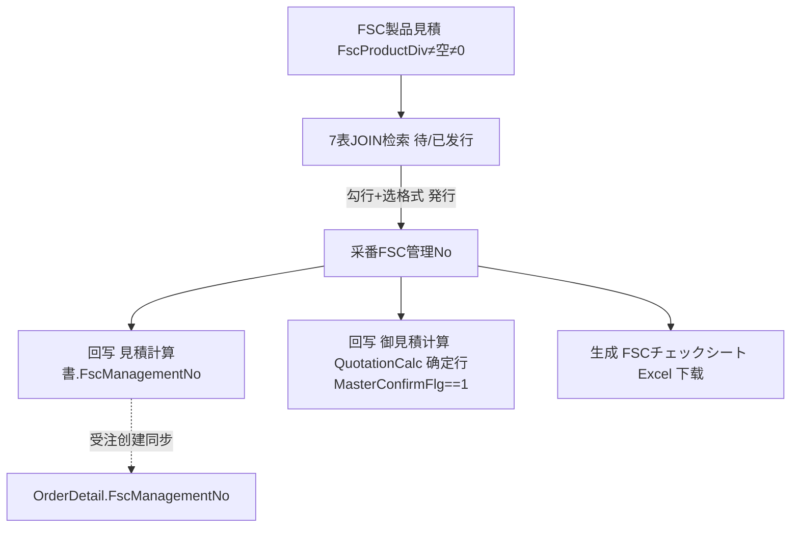

# FSC チェック 单页面操作 SOP（手把手版）

> **用途**：给**环境/品质/销售内勤用户照着点、培训老师照着讲、测试人员照着拆用例**的单页面手册。比模块总册更细、更口语。
> **页面**：FSC チェック FscChecklist（MSBBPA100 · 销售管理 MSBB · 模块总册 §5.19）　**前端**：`views/erp/FscChecklistView.vue`　**API**：`api/erp/fsc.ts`　**后端**：`Erp/FscChecklistController` → `FscChecklistService`
> **基准**：分支 `feat/wfs-inbox-core`，2026-06-28，均实测真实代码（经 Explore 核对）。查不到的标 `待业务确认` / `代码未发现`。
> **样例数据**：拠点 `BASE01`、客户 `C0001`(A社)、御見積書 `QTN2026060001-01`、見積計算書 `EMC2026060001-01`、FSC製品区分 `1`(社外)、FSC管理No `FSC…`。

---

## 1. 页面一句话说明

**FSC チェック，就是给"FSC(森林认证)製品"发行检查表(チェックシート)的页——它按拠点/御見積/客户检索出 FSC 製品的待发行清单(只有見積計算書标了 FSC 製品区分的才进来)，你勾选要发的、选一个输出格式，批量"発行"就生成 FSC チェックシート Excel 下载，同时系统给每张采番一个 **FSC 管理No** 并回写到見積計算書/御見積。它是检索+批量发行页，不是逐条编辑。**

---

## 2. 这个页面在业务流程中的位置

```
上游(FSC製品見積)                本页面(检索+批量发行)                  下游(回写)
─────────────────────       ──────────────────────────       ────────────────────
見積計算書/御見積书      ──→  FSC チェック MSBBPA100              FSC管理No 回写
 (FscProductDiv≠空≠0)        检索FSC製品待发行清单                ├ 見積計算書.FscManagementNo
                            选格式+勾行→批量発行                  └ 御見積计算(确定行MasterConfirmFlg==1)
                            采番FSC管理No+生成チェックシートExcel   受注 OrderDetail.FscManagementNo
                                                                 (受注创建时从Estimate同步)
```

- **上游**：標了 **FSC 製品区分** 的見積計算書(FscProductDiv≠空且≠'0')+ 关联御見積。
- **本页面**：检索 FSC 製品待发行清单→选格式+勾行→批量发行 Excel + 采番 FSC 管理No。
- **下游**：发行回写 FSC 管理No 到見積計算書 + 御見積计算(仅确定行 MasterConfirmFlg==1)；受注的 FSC 管理No 在受注创建时从 Estimate 同步(本页不直接改受注)。
- **关键认知**：① 只有 **FSC 製品**(見積 FscProductDiv≠空≠'0')才进清单；② **拠点(baseCd)是检索必填**、**输出フォーマット是发行必填**；③ 发行=**批量采番 FSC 管理No + 生成 Excel**；④ 回写到見積計算書/御見積(确定行)；⑤ 本页是**检索+发行**，无逐条编辑。

---

## 3. 谁使用这个页面

| 角色 | 使用目的 | 常用操作 | 权限要求 | 注意事项 |
|---|---|---|---|---|
| 环境/品质 | 发行 FSC 检查表 | 检索/发行 | `[Authorize]`，细粒度`待业务确认` | FSC 合规 |
| 销售内勤 | 给 FSC 客户备检查表 | 检索/发行 | 同上 | 拠点必填 |
| 测试/UAT | 验检索/发行/采番回写 | 全流程 | 登录 | 回写 |

> 📌 **权限现状**：`FscChecklistController` 标 `[Authorize]`；细粒度授权 `待业务确认`。

---

## 4. 操作前准备（不准备好，下面会卡住）

| 准备项 | 为什么需要 | 不满足会怎样 | 去哪里维护/确认 | 测试关注点 |
|---|---|---|---|---|
| 拠点(baseCd) | 检索必填 | E10022 | 填拠点 | 必填 |
| 输出フォーマット | 发行必填 | E10022 | 选格式 | 必填 |
| 見積是 FSC 製品 | 才进清单 | 查不到 | 見積设 FscProductDiv | 过滤 |
| 发行先勾行 | 批量目标 | 无对象 | 勾≥1行 | 勾选 |
| 浏览器允许下载 | Excel 下载 | 出不来 | 浏览器设置 | 下载 |

---

## 5. 页面区域说明

| 区域 | 页面位置 | 用户要做什么 | 注意事项 |
|---|---|---|---|
| 检索区 | 顶部 | 拠点(必填)/担当/御見積作成日·NO范围/客户/案件 | 拠点必填 |
| 状态筛 | 检索区 | 勾 未發行(默认)/發行済 | 多选 |
| 格式选择 | 检索区 | 选输出フォーマット(发行用) | 发行必填 |
| 工具 | 检索区 | 検索 / クリア / 発行(N) | 发行需勾行 |
| 结果列表 | 中部 | 看 FSC 製品(品名/金额/状态)、勾发行、看 FSC管理No | — |

---

## 6. 字段填写说明（口语版）

### 6.1 检索条件

| 字段 | 字段名 | 怎么填 | 必填 |
|---|---|---|---|
| 拠点 | `baseCd` | 输拠点 | **是(E10022)** |
| 担当 | `staffCd` | 担当CD | 否 |
| 御見積作成日 from/to | `issueDateFrom/To` | 范围 | 否 |
| 御見積NO from/to | `qtnNoFrom/To` | 区间 | 否 |
| 客户 | `customerCd` | 客户CD | 否 |
| 案件 | `projectNo` | 案件号 | 否 |
| 状态 | `includeUnissued/includeIssued` | 未發行(默认)/發行済 | 否 |
| 输出フォーマット | `formatName` | 选模板 | 发行必填(E10022) |

### 6.2 列表列

| 列 | 字段 | 含义 |
|---|---|---|
| 担当/客户/案件 | staff/customer/project | 归属 |
| 御見積NO/作成日 | qtnNo/qtnIssueDate | 来源 |
| 顧客品名1/2 | customerItemName1/2 | 品名(明细引入) |
| 数量/単価/金额/合计 | quantity/unitPrice/amount/totalAmount | 金额 |
| status | status | 确认/未确认 |
| 发行☑ | issue | 勾发行 |
| FSC管理No | fscManagementNo | 已发行显示 |
| 發行済 | issuedLabel | badge |
| FSC製品区分 | fscProductDiv | 1社外/2社內/3マーク無し |

> 本页**无编辑表单**;只检索+勾选发行。

---

## 7. 按钮操作说明

| 按钮 | 何时点 | 系统做什么 | 成功后 | 失败处理 | 测试关注点 |
|---|---|---|---|---|---|
| 検索 | 设好条件 | 7表JOIN查FSC製品(FscProductDiv≠空≠0)+未/已发行筛 | 列表 | 拠点空→E10022;件数→E10013;0件→提示 | 检索/必填 |
| クリア | 重查 | 清条件 | 重置 | — | 重置 |
| 発行(N) | 批量发行 | 确认→采番FSC管理No+回写EstimateCalc/QuotationCalc(确定行)+生成Excel下载 | 提示发行N件、Excel下载、重查 | 格式空/未勾→拦 | 发行/采番 |
| (下载已发行) | 重下 | download/{fscManagementNo} | 下载 | 无→null | 下载 |

> ⚠️ **发行做三件事**：① 采番 **FSC 管理No**(FSC+序号)；② 回写 見積計算書.FscManagementNo + 御見積计算 QuotationCalc.FscManagementNo(**仅确定行 MasterConfirmFlg==1**)；③ 按所选格式生成 FSC チェックシート Excel(模板缺时降级 plain-text)。
> ⚠️ **拠点检索必填、格式发行必填**(E10022)。

---

## 8. 标准业务操作 SOP（照着点）

### 场景一：批量发行 FSC 检查表（主流程）
- **业务背景**：A社是 FSC 客户，要给其 FSC 製品发检查表。
- **使用样例数据**：拠点 BASE01、客户 C0001、未發行、选格式。
- **前置条件**：① 有 FSC 製品見積；② 有发行权限。
- **详细操作步骤**：1) 进【FSC チェック】;2) 填拠点 BASE01(必填)、客户 C0001、御見積条件;3) 勾【未發行】;4) 选输出フォーマット;5)【検索】;6) 勾要发的行;7)【発行(N)】→确认"N件发行"→采番 FSC 管理No + 下载 Excel。
- **完成后检查**：① 提示发行 N 件、Excel 下载；② 見積計算書/御見積(确定行)回写 FSC 管理No；③ 列表对应行显发行済+FSC管理No。
- **异常处理**：拠点/格式空→E10022；件数过多→E10013；查不到→见積非 FSC 製品。
- **可拆测试用例**：TC-M04-FSC-001~007、020。

### 场景二：只看 FSC 製品(过滤验证)
- **业务背景**：核对只有 FSC 製品进清单。
- **使用样例数据**：FscProductDiv 各值。
- **前置条件**：—。
- **详细操作步骤**：1) 检索;2) 确认列表全是 FscProductDiv≠空≠'0' 的見積。
- **完成后检查**：① 非 FSC(空/'0')不进清单；② 区分 1社外/2社內/3マーク無し 显示。
- **异常处理**：—。
- **可拆测试用例**：TC-M04-FSC-008/009。

### 场景三：查已发行 + 重下载
- **业务背景**：重下之前发行的检查表。
- **使用样例数据**：勾【發行済】。
- **前置条件**：有已发行。
- **详细操作步骤**：1) 勾【發行済】→検索;2) 看 FSC 管理No;3) 下载已发行(download/{fscManagementNo})。
- **完成后检查**：① 已发行可见 + 可重下；② 模板缺时再生成(`待确认`)。
- **异常处理**：无→null。
- **可拆测试用例**：TC-M04-FSC-010/011。

### 场景四：发行回写到御見積确定行
- **业务背景**：验证回写只更新确定行。
- **使用样例数据**：含确定/未确定的御見積计算行。
- **前置条件**：御見積有确定行(MasterConfirmFlg==1)。
- **详细操作步骤**：1) 发行;2) 查御見積计算行 FscManagementNo;3) 仅 MasterConfirmFlg==1 行被回写。
- **完成后检查**：① 确定行回写 FSC 管理No；② 未确定行不回写。
- **异常处理**：—。
- **可拆测试用例**：TC-M04-FSC-012/021。

### 场景五：必填校验
- **业务背景**：不填拠点/格式。
- **使用样例数据**：空拠点 / 空格式。
- **前置条件**：—。
- **详细操作步骤**：1) 不填拠点→検索→E10022;2) 不选格式→発行→E10022。
- **完成后检查**：① 拠点必填(检索)；② 格式必填(发行)。
- **异常处理**：补必填。
- **可拆测试用例**：TC-M04-FSC-013/014。

---

## 9. 状态变化说明

> 本页核心是"未發行→发行(采番回写)"；无复杂状态机。

| 状态 | 含义 | 测试关注点 |
|---|---|---|
| 未發行 | FscManagementNo 空 | 默认筛 |
| 發行済 | FscManagementNo 已采番 | 显FSC管理No |
| 回写 | 見積計算書 + 御見積计算(确定行)FscManagementNo | 回写 |



---

## 10. 按钮不可用 / 灰色 / 不出现原因

| 按钮 | 何时不可用 | 为什么 | 怎么处理 | 测试关注点 |
|---|---|---|---|---|
| 検索 | 拠点空 | 拠点必填(E10022) | 填拠点 | 必填 |
| 発行 | 格式空 或 未勾行 | 必填/无目标 | 选格式+勾行 | 必填/勾选 |
| (无编辑/删除) | — | 检索+发行页 | — | 只读编辑 |

---

## 11. 常见错误与处理

| 错误/提示 | 错误码 | 用户处理方法 | 是否需要管理员 | 测试关注点 |
|---|---|---|---|---|
| 拠点必填 | E10022 | 填拠点 | 否 | 必填 |
| 格式必填(发行) | E10022 | 选输出フォーマット | 否 | 必填 |
| 件数上限 | E10013 | 缩范围 | 否 | 截断 |
| FROM>TO | E10036(前端) | 调正范围 | 否 | 区间 |
| 查不到 FSC | — | 見積设 FscProductDiv(非空非0) | 是(业务) | 过滤 |
| 模板缺 | (降级) | plain-text fallback(`待确认`) | 是(开发) | 模板 |
| 回写没动御見積 | 仅确定行回写 | 确认御見積计算 MasterConfirmFlg==1 | 是 | 回写 |
| 权限不足 | — | 申请权限 | 是 | 权限`待确认` |

---

## 12. 操作完成后的检查清单

| 操作 | 当前页面检查 | 見積計算書检查 | 御見積检查 | 受注检查 | 测试关注点 |
|---|---|---|---|---|---|
| 检索 | FSC製品待发行清单 | FscProductDiv≠空≠0 | — | — | 过滤 |
| 发行 | 发行N件+Excel+发行済 | FscManagementNo回写 | QuotationCalc(确定行)回写 | (受注创建时同步) | 采番/回写 |

> 📌 本页**不直接改受注**；受注 FSC 管理No 在受注创建时从 Estimate 同步。

---

## 13. 页面级测试用例（≥25 条，可执行）

> 编号 `TC-M04-FSC-xxx`；数据用样例。测试人员补"实际结果/是否通过/缺陷编号"。

| 用例编号 | 用例名称 | 优先级 | 前置条件 | 测试数据 | 操作步骤 | 预期结果 | 备注 |
|---|---|---|---|---|---|---|---|
| TC-M04-FSC-001 | 页面打开 | P2 | 有权限 | — | 进入 | 检索区+状态筛+格式 | — |
| TC-M04-FSC-002 | 拠点必填 | P1 | — | 空拠点 | 検索 | E10022 | 必填 |
| TC-M04-FSC-003 | 检索FSC製品 | P2 | 有FSC見積 | BASE01 | 検索 | FSC製品清单 | 检索 |
| TC-M04-FSC-004 | 未發行筛 | P2 | 各状态 | ☑未發行 | 検索 | 仅未发行 | 筛 |
| TC-M04-FSC-005 | 发行批量 | P2 | 有清单 | 勾行+格式 | 発行 | 采番+Excel下载 | 发行 |
| TC-M04-FSC-006 | 格式必填发行 | P1 | 勾行 | 空格式 | 発行 | E10022 | 必填 |
| TC-M04-FSC-007 | 发行回写 | P2 | 发行 | — | 查見積計算書 | FscManagementNo回写 | 回写 |
| TC-M04-FSC-008 | 仅FSC製品 | P2 | 含非FSC | — | 検索 | 非FscProductDiv不进 | 过滤 |
| TC-M04-FSC-009 | FSC区分显示 | P3 | — | — | 看区分列 | 1社外/2社內/3マーク無し | UI |
| TC-M04-FSC-010 | 已发行筛 | P3 | 有已发行 | ☑發行済 | 検索 | 显FSC管理No | 已发行 |
| TC-M04-FSC-011 | 下载已发行 | P3 | 已发行 | fscNo | download | 下载Excel | 下载 |
| TC-M04-FSC-012 | 回写仅确定行 | P2 | 御見積有确定行 | — | 发行→查御見積计算 | 仅MasterConfirmFlg==1回写 | 回写 |
| TC-M04-FSC-013 | 拠点空检索拦 | P1 | — | 空 | 検索 | E10022 | 必填 |
| TC-M04-FSC-014 | 格式空发行拦 | P1 | 勾行 | 空格式 | 発行 | E10022 | 必填 |
| TC-M04-FSC-015 | 未勾发行拦 | P2 | 不勾 | — | 発行 | 无对象拦 | 勾选 |
| TC-M04-FSC-016 | 件数上限 | P2 | 海量 | 宽条件 | 検索 | E10013 | 截断 |
| TC-M04-FSC-017 | FROM>TO | P2 | — | 倒置 | 検索 | E10036 | 区间 |
| TC-M04-FSC-018 | 御見積NO区间 | P2 | — | NO区间 | 検索 | 命中 | 检索 |
| TC-M04-FSC-019 | 客户/案件筛 | P2 | — | C0001 | 検索 | 命中 | 检索 |
| TC-M04-FSC-020 | 采番FSC管理No | P2 | 发行 | — | 看FSC管理No | FSC+序号 | 采番 |
| TC-M04-FSC-021 | 受注同步FSC | P2 | 发行后建受注 | — | 查OrderDetail | FscManagementNo同步 | 同步 |
| TC-M04-FSC-022 | 模板缺降级 | P3 | 无模板 | — | 发行 | plain-text fallback(`待确认`) | 模板 |
| TC-M04-FSC-023 | 重置 | P3 | 已填 | — | クリア | 重置 | 重置 |
| TC-M04-FSC-024 | 空结果 | P2 | 无FSC | — | 検索 | 空/提示 | 空 |
| TC-M04-FSC-025 | 权限不足 | P2 | 无权账号 | — | 进页面 | `待业务确认` | 权限 |
| TC-M04-FSC-026 | 网络异常 | P2 | 断网 | — | 检索/发行 | 友好错误可重试 | 异常 |

---

## 14. 培训讲解建议

| 讲解顺序 | 讲什么 | 演示动作 | 用户容易误解的点 |
|---|---|---|---|
| 1 | 这页发 FSC 检查表 | 展示 §2 流程图 | 以为逐条编辑 |
| 2 | 只 FSC 製品进清单 | 讲 FscProductDiv | 全部見積 |
| 3 | 拠点/格式必填 | 故意空看E10022 | 漏填 |
| 4 | 批量发行=采番+Excel | 发行下载 | — |
| 5 | 回写見積/御見積(确定行) | 查回写 | 以为全回写 |
| 6 | 受注创建时同步FSC | — | 以为本页改受注 |

---

## 15. 与模块级手册的关系

本单页 SOP 对应模块总册 `docs/manuals/user-training/01-销售管理MSBB-最详细用户操作培训手册.md` **§5.19 FSC チェック**：

| 本SOP章节 | 对应总册章节 |
|---|---|
| §1/§2 定位与流程 | 总册 §5.19.1 |
| §4 操作前准备 | 总册 §5.19.1a |
| §6 字段(检索/列表) | 总册 §5.19.1b + §5.19.5/5.19.6 |
| §7 按钮 | 总册 §5.19.9 |
| §8 SOP | 总册 §5.19.1e |
| §9 状态(发行/回写) | 总册 §5.19.10 |
| §13 测试用例 | 总册 §5.19.14 |

> 配套：上游 `01-01-見積計算書`(FSC製品区分)/`01-03-御見積書`(确定行回写);受注 `01-07`。

---

## 16. 代码与文档来源

| 类型 | 路径 | 用途 |
|---|---|---|
| 前端页面 | `cp6.web/src/views/erp/FscChecklistView.vue` | 检索+批量发行 |
| API | `cp6.web/src/api/erp/fsc.ts`(`list`/`formats`/`issue`/`download`) | 检索/格式/发行/下载 |
| 类型 | `cp6.web/src/types/erp/fsc.ts`(FscChecklistQuery/Item/IssueRequest/IssueResult/Format) | DTO |
| 路由 | `cp6.web/src/router/index.ts`(`/fsc-checklist`) | 路径 |
| 后端 Controller | `CP6.WebApi/Controllers/Erp/FscChecklistController.cs`(`GET /list`/`/formats`/`POST /issue`/`GET /download/{no}`) | 端点 |
| Service | `CP6.Core/Services/Erp/FscChecklistService.cs`(SearchAsync 7表JOIN+FscProductDiv过滤/IssueAsync 采番FSC+回写EstimateCalc·QuotationCalc(确定行)+Excel) | 业务逻辑 |
| 实体 | `CP6.Entity/DomainModels/Erp/FscChecklist.cs`(T_FscChecklist,PK FscManagementNo) | 发行履历 |
| 联动源 | `EstimateCalc.cs`(FscProductDiv/FscManagementNo)、`QuotationCalc.cs`(MasterConfirmFlg/FscManagementNo)、`OrderDetail.cs`(FscManagementNo) | FSC联动 |
| 模块总册 | `docs/manuals/user-training/01-销售管理MSBB-最详细用户操作培训手册.md` §5.19 | 上级手册 |
| 页面盘点表 | `docs/manuals/user-training/00-用户操作手册页面盘点表.md` | 页面索引 |

---

## 最后更新来源

- 代码：见 §16（FscChecklistView + fsc.ts/types + FscChecklistService 经 Explore 核对实测）
- 文档：模块总册 §5.19、页面盘点表
- 基准：分支 `feat/wfs-inbox-core`，盘点日 2026-06-28
- 诚实标注(经 Explore 核对)：**检索+批量发行页**(非CRUD);仅 **FSC 製品**(見積 FscProductDiv≠空≠'0')进清单(7表JOIN);**拠点检索必填、输出フォーマット发行必填**(E10022);发行=**采番FSC管理No+生成Excel+回写**見積計算書·御見積计算(**仅确定行MasterConfirmFlg==1**);受注FSC管理No由受注创建时从Estimate同步(本页不直接改受注);模板缺时plain-text降级 `待业务确认`;细粒度权限 `待业务确认`</content>
