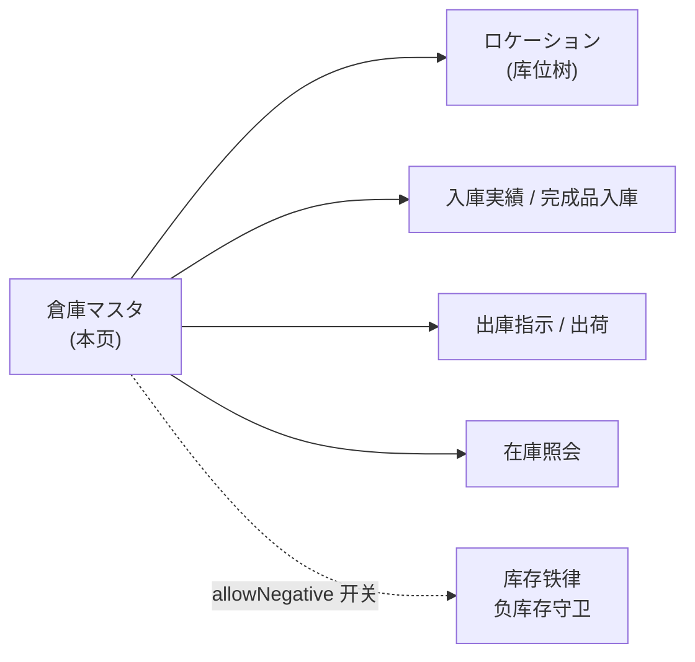
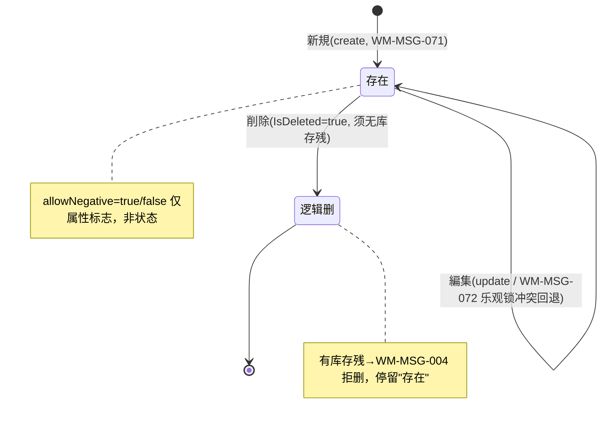

# 倉庫マスタ 单页面操作 SOP（手把手版）

> **用途**：给**仓库管理员/主数据维护员操作、培训老师讲、测试人员拆用例**。比模块总册（`03-库存物流WMS` §5.1）更细。
> **页面**：倉庫マスタ（WM010 · 库存物流 WMS）　**路由**：`/wms/warehouse`　**前端**：`views/wms/WarehouseListView.vue`　**API**：`api/wms/warehouse.ts warehouseApi`　**后端**：`Wms/WarehouseController`（**直注 `CP6Context`，无 Service 层**）
> **基准**：分支 `feat/wfs-inbox-core`，2026-06-29；后端实测 `docs/codemap-wms/01-库存核心-铁律.md`（2026-06-22 权威），UI 经 agent 实读 view。
> **样例数据**：倉庫 `W01`（类型 3 完成品）、`W02`（类型 1 原材料）、管理者 `OP01`。

---

## 1. 页面一句话说明

**倉庫マスタ，就是维护"仓库主档"的地方——新建/编辑/删除一个仓库，给它定编码、名称、类型（原材料/半製品/完成品/不良品/外注）、管理者、地址，以及一个高危开关 `負在庫許可`。** 它是整个 WMS 的地基：所有库位、入庫、出庫、库存都挂在仓库下，仓库必须先存在。⚠️ 特别之处：**这个页面的增删改查不走库存铁律的 Service 层，是 Controller 直接操作数据库**——它是"库存数量变动必经 `IStockMovementService`"这条铁律的**对照例外**。

---

## 2. 这个页面在业务流程中的位置

- **上游**：无（仓库是主数据起点）。
- **本页**：维护仓库主档。
- **下游**：所有库位、入出庫、库存照会都要求"仓必须先存在"；`allowNegative` 开关直接决定该仓的库存变动是否放行负库存（影响 `IStockMovementService` 的守卫判定）。

---

## 3. 谁使用这个页面

| 角色 | 用途 |
|---|---|
| 仓库管理员 | 建仓、改仓属性、停用（逻辑删）仓库 |
| 主数据维护员 | 统一编码规则、维护管理者/地址、设置负库存许可 |

---

## 4. 操作前准备

- [ ] 确定仓库**编码规则**（如 `W01`/`W02`）——CD 一经创建**不可修改**。
- [ ] 明确**仓库类型**：1 原材料 / 2 半製品 / 3 完成品 / 4 不良品 / 5 外注。
- [ ] 明确是否要开 **`負在庫許可`**——这是高危开关，默认关，开错可超卖出负库存。
- [ ] 准备管理者 CD（如 `OP01`）、拠点 CD、地址（均可空）。

---

## 5. 页面区域说明

| 区域 | 内容 |
|---|---|
| 搜索卡 | 倉庫CD（输入）/ 倉庫タイプ（下拉 1~5）/ 拠点CD（输入）+「検索」「新規」按钮 |
| 列表表格 | 7 列：倉庫CD / 倉庫名 / タイプ(tag) / 拠点CD / 管理者CD / 負在庫許可(tag 或 —) / 住所；右固定操作列（編集 / 削除） |
| 编辑弹窗 | 560px；标题随动作变（倉庫新規 / 倉庫編集）；8 字段；底部「保存」「取消」 |

---

## 6. 字段填写说明（口语版）

**搜索区**：倉庫CD（模糊匹配 `Contains`）、倉庫タイプ（精确）、拠点CD（精确）；空着点检索=列出全部未删仓库。

**编辑弹窗**（8 字段）：

| 字段 | 控件（上限） | 必填 | 怎么填 | 填错影响 |
|---|---|---|---|---|
| 倉庫CD（warehouseCd） | 输入(≤10) | 是（**仅视觉星号**） | 唯一编码（如 `W01`）；**编辑时禁改**（`:disabled="!!editing.id"`，灰掉不可点） | 空/重复→后端 `WM-MSG-001`（前端无校验，照样发请求由后端拒） |
| 倉庫名（warehouseName） | 输入(≤100) | 是（**仅视觉星号**） | 业务名（如「完成品倉庫」） | 空→后端拒（前端不拦） |
| 倉庫タイプ（warehouseType） | 下拉(1~5) | 否（默认 1） | 1 原材料/2 半製品/3 完成品/4 不良品/5 外注 | ⚠️ **列表 tag 配色：2 半製品 与 3 完成品同为绿色（success），肉眼难分** |
| 拠点CD（baseCd） | 输入(≤10) | 否 | 多基地时填 | — |
| 管理者CD（managerCd） | 输入(≤20) | 否 | 如 `OP01` | — |
| 住所（addressText） | 输入(≤200) | 否 | 仓库地址（列表超长省略 tooltip） | — |
| **負在庫許可（allowNegative）** | 开关 | 否（默认 false） | **高危**：开=该仓允许出现负库存（放行库存铁律的负库存守卫） | 误开→可超卖、出现负库存 |
| 備考（remarks） | 文本域 | 否 | 自由说明 | — |

> ⚠️ **盲点**：必填的 `required` **只是视觉星号**，`onSave` **没有前端必填校验**——空 CD/空名也会发出请求，由后端兜底拒绝（不是前端弹错）。

---

## 7. 按钮操作说明

| 按钮 | 何时出现 | 点了会怎样 |
|---|---|---|
| 検索 | 搜索卡常显 | 按条件加载未删仓库列表（`warehouseApi.search`） |
| 新規 | 搜索卡常显 | 开空弹窗（默认 类型=1、allowNegative=false、无 id） |
| 編集（行） | 每行常显 | 开弹窗带入该行（**CD 输入框灰掉禁改**） |
| 削除（行） | 每行常显 | 二次确认→`warehouseApi.delete`（**逻辑删**，非物理删） |
| 保存（弹窗） | — | 有 id 走 `update`、无 id 走 `create`；成功 toast `wms.common.success`（通用"成功"，**非** WM-MSG 码）→关弹窗→刷新列表 |
| 取消（弹窗） | — | 关弹窗不保存 |

> 后端 create 成功返回 `WM-MSG-071`、update 成功无业务码，但前端**统一只显通用"成功"toast**，不显 WM-MSG 码。

---

## 8. 标准业务操作 SOP（照着点）

### 场景一：新建完成品仓 W01（主流程）
- **背景**：上线初始化，建第一个完成品仓。
- **样例数据**：倉庫CD `W01`、倉庫名「完成品倉庫」、类型 3 完成品、管理者 `OP01`。
- **前置**：有仓库主数据维护权限；CD 规则已定。
- **步骤**：1) 点「新規」；2) 倉庫CD 填 `W01`；3) 倉庫名填「完成品倉庫」；4) 倉庫タイプ选「完成品(3)」；5) 管理者CD 填 `OP01`；6) `負在庫許可` 保持关；7)「保存」。
- **完成后检查**：toast"成功"；列表出现 `W01` 一行，タイプ tag=绿色（完成品），負在庫許可列显 `—`；可在其下建库位/做入庫。
- **异常**：CD 空/重复→`WM-MSG-001`；名空→后端拒。
- **可拆用例**：TC-M06-WAREHOUSE-001~004。

### 场景二：新建原材料仓 W02
- **背景**：再建一个原材料仓。
- **样例数据**：倉庫CD `W02`、倉庫名「原材料倉庫」、类型 1 原材料、管理者 `OP01`。
- **前置**：同场景一。
- **步骤**：新規→填 `W02`+名称+类型选「原材料(1)」+管理者 `OP01`→保存。
- **完成后检查**：列表出现 `W02`，タイプ tag=蓝色（primary/原材料）；与 W01（绿色）配色明显不同。
- **异常**：CD `W02` 已存在→`WM-MSG-001`。
- **可拆用例**：TC-M06-WAREHOUSE-005、006。

### 场景三：编辑仓库——验证 CD 禁改
- **背景**：W01 换管理者、改名，但**编码不能改**。
- **样例数据**：W01 改名「完成品メイン倉庫」、管理者改 `OP02`。
- **前置**：W01 已存在。
- **步骤**：检索出 W01→点「編集」→**观察倉庫CD 输入框已灰掉不可改**→改倉庫名/管理者CD→保存。
- **完成后检查**：列表 W01 名称/管理者更新；CD 不变。
- **异常**：想改 CD→输入框禁用无法编辑（设计如此）。
- **可拆用例**：TC-M06-WAREHOUSE-007、008。

### 场景四：开启 `負在庫許可` 高危开关
- **背景**：某外注仓业务上允许暂时负库存（高危，需谨慎）。
- **样例数据**：新建/编辑某仓，打开 `負在庫許可`。
- **前置**：明确业务确实需要放行负库存。
- **步骤**：新規/編集→打开 `負在庫許可` 开关→保存。
- **完成后检查**：列表该仓「負在庫許可」列显**橙色 tag「許可」**（其余仓显 `—`）；该仓后续库存 OUT 即使超量也**不被负库存守卫拦**（`IStockMovementService` 读 `Warehouse.AllowNegative`）。
- **异常**：误开→可超卖；应及时关回。
- **可拆用例**：TC-M06-WAREHOUSE-009、010、011。

### 场景五：删除仓库——有库存残被拒
- **背景**：想停用一个仓，但仓里还有物理库存。
- **样例数据**：W01（其下某库位 `PhysicalQty != 0`）。
- **前置**：W01 下有库存残。
- **步骤**：W01 行点「削除」→确认。
- **完成后检查**：被后端拒，返回 `WM-MSG-004`（有物理库存残不可删）；W01 仍在列表。先清空库存再删。
- **异常**：库存清零后再删→逻辑删成功（`IsDeleted=true`，列表不再显示，但数据保留）。
- **可拆用例**：TC-M06-WAREHOUSE-012、013、014。

### 场景六：乐观锁冲突（两人同时编辑）
- **背景**：A、B 两人同时打开 W02 编辑。
- **样例数据**：W02 被并发更新。
- **前置**：W02 存在；两个会话都已打开编辑弹窗。
- **步骤**：A 先保存成功（`RowVersion` 变化）→B 再用旧版本保存。
- **完成后检查**：B 保存被拒，后端 `409 WM-MSG-072`（乐观锁）；B 需重新检索取最新再改。
- **异常**：更新一个**已不存在**（已被删）的仓→`WM-MSG-070`。
- **可拆用例**：TC-M06-WAREHOUSE-015、016。

### 场景七：检索与类型过滤
- **背景**：仓库多，按条件找。
- **样例数据**：按 倉庫CD `W0`、タイプ「完成品(3)」。
- **前置**：已有多个仓。
- **步骤**：搜索卡填倉庫CD（模糊）或选タイプ或填拠点CD→「検索」。
- **完成后检查**：列表只显命中项；已逻辑删的仓不出现（`Where(!IsDeleted)`）。
- **异常**：无匹配→空列表。
- **可拆用例**：TC-M06-WAREHOUSE-017、018、019。

---

## 9. 状态变化说明

> 倉庫**无业务状态机**，只有"存在/逻辑删"两态 + `allowNegative` 标志。

---

## 10. 按钮不可用 / 灰色原因

| 现象 | 原因 |
|---|---|
| 编辑弹窗倉庫CD 输入框灰掉 | 处于编辑态（`:disabled="!!editing.id"`），CD 禁改 |
| 削除点了没删 | 有物理库存残（`PhysicalQty != 0`）→`WM-MSG-004`，须先清库存 |
| 保存点了报错但前端没拦 | 空 CD/空名→`onSave` 无前端必填校验，发请求由后端拒（`WM-MSG-001`/后端兜底） |
| 列表看不到刚删的仓 | 逻辑删 `IsDeleted=true`，`search` 带 `Where(!IsDeleted)` |

---

## 11. 常见错误与处理

| 错误 | 原因 | 处理 |
|---|---|---|
| `WM-MSG-001` | 倉庫CD 空 / 重复 | 填唯一非空 CD |
| `WM-MSG-070` | 更新时仓库不存在（已被删/CD 错） | 重新检索确认 CD |
| `WM-MSG-072`（409） | 乐观锁冲突（并发编辑，`RowVersion` 不匹配） | 重新检索取最新再改 |
| `WM-MSG-004` | 删除有物理库存残的仓 | 先清空该仓库存再删 |
| 想改 CD 改不了 | CD 编辑禁改（设计如此） | 删旧建新（注意库存残） |
| 误开 `負在庫許可` 导致超卖 | 高危开关被打开 | 编辑关回开关 |
| 空 CD/名也发了请求 | 前端无必填校验（仅视觉星号） | 看后端返回的 WM-MSG 码补填 |

> ⚠️ **UX 缺口**：`WM-MSG-xxx` 错误码**无前端 i18n 词条，裸码直接显示给用户**（codemap-wms 关键发现 5）。

---

## 12. 操作完成后的检查清单

- [ ] 新建：列表出现该仓，タイプ tag 配色正确（1 蓝/2·3 绿/4 红/5 灰，**2·3 同绿需核对实际类型值**）。
- [ ] 编辑：名称/管理者等更新，**倉庫CD 不变**（禁改）。
- [ ] `負在庫許可`=开 时，列表显橙色「許可」tag；确认这是业务真需要（影响负库存守卫）。
- [ ] 删除：有库存残被 `WM-MSG-004` 拦；无库存残时逻辑删（列表消失、数据保留）。
- [ ] 并发编辑：后提交方收到 `WM-MSG-072`（409）并已重取最新。

---

## 13. 页面级测试用例（≥25 条，可执行）

> 编号 `TC-M06-WAREHOUSE-xxx`；数据用样例（W01 类型3 / W02 类型1 / 管理者 OP01）。

| 用例编号 | 用例名称 | 优先级 | 前置条件 | 测试数据 | 操作步骤 | 预期结果 | 下游检查 | 备注 |
|---|---|---|---|---|---|---|---|---|
| TC-M06-WAREHOUSE-001 | 新建完成品仓 W01 | P0 | 有维护权限 | W01/完成品倉庫/类型3/OP01 | 新規→填→保存 | toast 成功、列表出现 W01 | 可在其下建库位 | 主流程 |
| TC-M06-WAREHOUSE-002 | 倉庫CD 空 | P0 | 新建弹窗 | CD 空 | 保存 | 后端拒 `WM-MSG-001`（前端不拦） | 不落库 | 无前端校验 |
| TC-M06-WAREHOUSE-003 | 倉庫CD 重复 | P0 | W01 已存在 | CD=W01 再建 | 保存 | `WM-MSG-001` | 不落库 | — |
| TC-M06-WAREHOUSE-004 | 倉庫名空 | P0 | 新建弹窗 | 名空 | 保存 | 后端拒（前端不拦） | 不落库 | 无前端校验 |
| TC-M06-WAREHOUSE-005 | 新建原材料仓 W02 | P1 | — | W02/原材料倉庫/类型1/OP01 | 新規→填→保存 | 列表出现 W02、tag 蓝色 | — | — |
| TC-M06-WAREHOUSE-006 | W02 重复创建被拒 | P1 | W02 已存在 | CD=W02 | 保存 | `WM-MSG-001` | 不落库 | — |
| TC-M06-WAREHOUSE-007 | 编辑改名/管理者 | P1 | W01 存在 | 改名+管理者OP02 | 編集→改→保存 | 列表更新、CD 不变 | — | — |
| TC-M06-WAREHOUSE-008 | 编辑时 CD 禁改 | P0 | W01 存在 | — | 編集→看 CD 框 | CD 输入框灰掉不可改 | — | `:disabled="!!editing.id"` |
| TC-M06-WAREHOUSE-009 | 开启 allowNegative | P0 | 某仓存在 | 开关=开 | 編集→开→保存 | 列表显橙色「許可」tag | 负库存守卫被放行 | 高危 |
| TC-M06-WAREHOUSE-010 | 关闭 allowNegative | P1 | 仓 allowNegative=开 | 开关=关 | 編集→关→保存 | 列表该列显 `—` | 守卫恢复拦截 | — |
| TC-M06-WAREHOUSE-011 | allowNegative 默认关 | P1 | 新建弹窗 | 默认 | 新規看开关 | 默认 false | — | openCreate 默认 |
| TC-M06-WAREHOUSE-012 | 删有库存残仓被拒 | P0 | W01 下有库存残 | W01 | 削除→确认 | `WM-MSG-004` | W01 仍在 | PhysicalQty!=0 |
| TC-M06-WAREHOUSE-013 | 删空仓成功(逻辑删) | P0 | 仓无库存残 | 空仓 | 削除→确认 | 成功、列表消失 | IsDeleted=true 数据保留 | 逻辑删 |
| TC-M06-WAREHOUSE-014 | 删除二次确认 | P1 | 任意仓 | — | 削除 | 弹确认框含 CD | 取消则不删 | — |
| TC-M06-WAREHOUSE-015 | 乐观锁冲突 | P1 | 两会话编辑 W02 | 并发保存 | A 先存→B 旧版存 | B 收 `409 WM-MSG-072` | B 重取最新 | RowVersion |
| TC-M06-WAREHOUSE-016 | 更新不存在的仓 | P2 | 仓已被删 | 旧 CD | 更新 | `WM-MSG-070` | — | — |
| TC-M06-WAREHOUSE-017 | 按 CD 模糊检索 | P1 | 有多仓 | CD=W0 | 検索 | 命中 W01/W02 | — | Contains |
| TC-M06-WAREHOUSE-018 | 按类型过滤 | P1 | 有多仓 | タイプ=完成品3 | 検索 | 只显类型3 仓 | — | 精确 |
| TC-M06-WAREHOUSE-019 | 已删仓不出现 | P1 | 有逻辑删仓 | — | 検索 | 删除仓不在列表 | Where(!IsDeleted) | — |
| TC-M06-WAREHOUSE-020 | 类型 tag 配色 | P2 | 各类型仓 | 1~5 | 看列表 tag | 1蓝/2绿/3绿/4红/5灰 | — | **2·3 同绿难分**(`待业务确认`) |
| TC-M06-WAREHOUSE-021 | 拠点CD 过滤 | P2 | 仓有 baseCd | baseCd | 検索 | 精确命中 | — | — |
| TC-M06-WAREHOUSE-022 | 住所超长省略 | P3 | 仓住所超长 | 长地址 | 看列表 | 省略+tooltip | — | show-overflow-tooltip |
| TC-M06-WAREHOUSE-023 | 取消编辑不保存 | P2 | 弹窗已改 | — | 改→取消 | 关弹窗、数据不变 | — | — |
| TC-M06-WAREHOUSE-024 | 创建成功提示码 | P2 | 新建 | W03 | 保存 | 前端显通用"成功"(非 WM-MSG-071) | 后端返回 071 | 码不透出 |
| TC-M06-WAREHOUSE-025 | maxlength 限制 | P3 | 新建弹窗 | 超长 CD/名 | 输入 | CD≤10/名≤100 截断 | — | — |
| TC-M06-WAREHOUSE-026 | WM-MSG 裸码显示 | P2 | 触发错误 | — | 触发 WM-MSG-001 | 错误码裸显(无 i18n) | — | UX 缺口 |
| TC-M06-WAREHOUSE-027 | 无 Service 直操 DbContext | P2 | — | — | （后端核对） | Controller 直注 CP6Context | 铁律对照例外 | 设计现状 |
| TC-M06-WAREHOUSE-028 | 列表默认加载 | P2 | 进入页面 | — | onMounted | 自动 reload 全部 | — | — |
| TC-M06-WAREHOUSE-029 | 权限不足 | P2 | 无权账号 | — | 进页面/保存 | 待业务确认(隐藏/拒绝) | — | 权限 |
| TC-M06-WAREHOUSE-030 | 网络异常 | P2 | 断网 | — | 保存 | 友好错误可重试 | — | — |

---

## 14. 培训讲解建议

| 顺序 | 讲什么 | 演示 | 易误解点 |
|---|---|---|---|
| 1 | 这页是 WMS 地基（仓必须先存在） | §2 流程图 | 以为可跳过直接建库位 |
| 2 | CD 一旦建好不能改 | 編集看灰掉的 CD 框 | 想"改编码" |
| 3 | 类型 5 选 1 + tag 配色坑 | 建 W01/W02 看绿/蓝 | **2 半製品与 3 完成品同绿，靠 tag 分不出** |
| 4 | `負在庫許可` 是高危开关 | 开→列表橙 tag | 以为只是个标志、随手开 |
| 5 | 删除=逻辑删 + 有库存残拒删 | 删带库存仓看 WM-MSG-004 | 以为彻底删掉了 |
| 6 | 这页不走库存铁律 Service | 讲 Controller 直操 DbContext | 以为和库存变动一样有铁律 |
| 7 | 错误码裸显、无前端必填校验 | 空 CD 保存看裸码 | 以为前端会先拦 |

---

## 15. 与模块级手册的关系

对应 `03-库存物流WMS-最详细用户操作培训手册.md` §5.1（5.1.1~5.1.14）。页面清单见 §4（WM010 / `/wms/warehouse` / P1 / 写 CRUD）；坑点统一提醒见 §5 开篇（铁律例外、WM-MSG 裸码、RowVersion 乐观锁）。下游 §5.2 ロケーション同属 WM010 无 Service 层。

---

## 16. 代码与文档来源

| 层 | 文件 |
|---|---|
| 逐行源码手册 | `docs/codemap-wms/01-库存核心-铁律.md`（权威，含"倉庫 CRUD"专章） |
| 前端 view | `cp6.web/src/views/wms/WarehouseListView.vue`（实读） |
| API | `cp6.web/src/api/wms/warehouse.ts`（`warehouseApi` search/get/create/update/delete） |
| 类型 | `cp6.web/src/types/wms/wms.ts`（`Warehouse` 接口，`warehouseType` 注释 1~5、`allowNegative`） |
| 后端 | `Controllers/Wms/WarehouseController.cs`（`[Route("api/wms/warehouse")][Authorize]`，**直注 `CP6Context`，无 Service 层**；Search/Create/Update/Delete） |
| 实体 | `DomainModels/Wms/Warehouse.cs`（`T_Warehouse`，`AllowNegative` 决定负库存放行；`BaseBizEntity.RowVersion [Timestamp]` 乐观锁） |
| 铁律对照 | `Services/Wms/IStockMovementService.cs` / `StockMovementService.cs`（负库存守卫读 `Warehouse.AllowNegative`，本页是其对照例外） |

---

## 最后更新来源

- 代码：见 §16（codemap-wms 01 倉庫 CRUD 专章 + WarehouseListView.vue 实读 + warehouse.ts/wms.ts 类型）。
- 基准：分支 `feat/wfs-inbox-core`，2026-06-29（codemap 2026-06-22 实测）。
- 覆盖：16 节 / 7 场景 / 30 用例（TC-M06-WAREHOUSE-001~030）。
- 诚实标注：类型 tag 2·3 同绿是否需区分配色=`待业务确认`；权限粒度=`待业务确认`。
