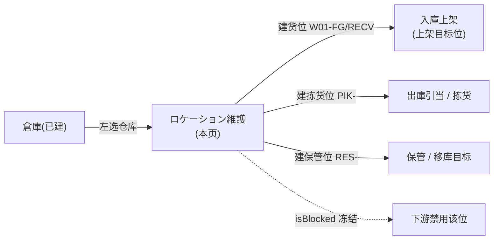

# ロケーション（库位）单页面操作 SOP（手把手版）

> **用途**：给**仓库管理员操作、培训老师讲、测试人员拆用例**。比模块总册（`03-库存物流WMS` §5.2）更细。
> **页面**：ロケーション（Location · WM010 · 库位主数据）　**路由**：`/wms/location`　**前端**：`views/wms/LocationListView.vue`　**API**：`api/wms/warehouse.ts`（`getLocationTree/createLocation/updateLocation/deleteLocation`）　**后端**：`Wms/WarehouseController`（**直注 DbContext，无 Service 层**）
> **基准**：分支 `feat/wfs-inbox-core`，2026-06-29；后端实测 `docs/codemap-wms/01-库存核心-铁律.md`（2026-06-22 权威），UI 经实读 view（`LocationListView.vue`，UI 已实装，覆盖 codemap 旧标注「前端未实现」）。
> **样例数据**：倉庫 `W01`；库位 `W01-FG`（完成品位）/`RECV`（收货暂存）/`PIK-A-01`（拣货位）/`RES-C-01`（保管位），层级取 5（ビン）。

---

## 1. 页面一句话说明

**ロケーション，就是给某一个仓库维护"库位（货位）"的地方——左边点选一个仓库，右边就维护这个仓库下的所有库位；每个库位有 5 阶层（ゾーン→通道→货架→层→ビン）、坐标 X/Y/Z、容量、可拣货/冻结开关、条码。** 它建出来的库位，就是后面入庫上架、引当拣货、移库保管时"东西放在哪格"的目标位。

> ⚠️ 库位与倉庫一样**没有 Service 层**，前端直连 `WarehouseController` 操作数据库；本页只管主数据，**不碰库存数量**（库存数量只走库存铁律 `IStockMovementService`）。

---

## 2. 这个页面在业务流程中的位置



- **上游**：倉庫（必须先建好仓库，否则左卡为空、右边没法维护）。
- **本页**：维护该仓库下的库位主数据。
- **下游**：入庫上架货位、出庫引当/拣货位（`PIK-`）、保管/移库目标位（`RES-`）；`isBlocked` 冻结的位被下游禁用。

---

## 3. 谁使用这个页面

| 角色 | 用途 |
|---|---|
| 仓库管理员 | 建库位、调容量/坐标、冻结/解冻、删空库位 |
| 库管员 | 配条码、调整可拣货标志（配合 RF 作业） |

---

## 4. 操作前准备

- [ ] 目标**仓库已建**（在 5.1 倉庫页建好），否则左卡无可选行。
- [ ] 想清库位编码规则（如 `W01-FG`/`PIK-A-01`）与**层级**（1 ゾーン~5 ビン，默认 5）。
- [ ] 若要建层级树，先建父位（如 ゾーン）再建子位，并准备好父库位CD。
- [ ] 明确该位是否可拣货、是否一上来就冻结、容量上限（0=無制限）、是否要条码。

---

## 5. 页面区域说明

| 区域 | 内容 |
|---|---|
| 左·仓库卡（span6） | 标题「倉庫一覧」+「更新（刷新）」按钮（常显）；表格列：CD / 仓库名 / 类型；**单选高亮**当前行 |
| 右·库位卡（span18） | 标题「ロケーション一覧 — W01 仓库名」+「+ 新規」/「更新」按钮（**未选仓→灰**）；三态空提示；库位表 8 列 |
| 库位表列 | 库位CD(180) / 显示名(min160) / 层级 tag(100) / 上级库位(160) / 坐标(X,Y,Z)(120) / 容量(100，0 显「無制限」) / 标志 tag(120，不可拣货/冻结) / 条码(140) / 操作(編集·削除，140) |
| 编辑弹窗 | 540px；标题随动作变（库位新規/库位编辑）；11 个字段（X/Y/Z 整数坐标） |

> 右卡两态空提示：未选仓→"请先选择仓库"；选了仓但无库位→"该仓库暂无库位"。

---

## 6. 字段填写说明（口语版）

**编辑弹窗**（新規/编辑共用，按 `isNew` 切换可改性）：

| 字段 | 控件 | 必填 | 怎么填 | 填错影响 |
|---|---|---|---|---|
| 库位CD（locationCd） | 输入(≤30) | **是** | 唯一编码，如 `W01-FG`；**编辑时禁改**（`:disabled="!isNew"`） | 空→前端 warning 拦截（`onSave` 仅校验此项非空） |
| 倉庫CD（warehouseCd） | 输入 | — | 自动带入选中仓（`W01`），**弹窗内永远禁用** | 改不了，新建时由所选仓决定 |
| 上级库位（parentLocationCd） | 输入(≤30) | 否 | 建层级树用，填父位CD（如 ゾーン位） | 父不存在→裸文本错误；父冻结→`WM-MSG-003` |
| 层级（locationLevel） | 下拉(1~5) | 否(默认5) | 1 ゾーン / 2 通道 / 3 货架 / 4 层 / 5 ビン | UI 只到 5；后端 `>5`→`WM-MSG-002`（5 段封顶） |
| 显示名（locationName） | 输入(≤100) | 否 | 库位中文/日文名 | 仅展示 |
| 坐标 X / Y / Z | 数字(整数) | 否 | **仅整数**（precision 0，填小数自动取整），地图/动线用 | — |
| 容量（capacityQty） | 数字(≥0,2 位小数) | 否(默认0) | **0=無制限**；>0 为该位容量上限 | 0 列表显「無制限」 |
| 允许品种（allowedProductType） | 输入(≤50) | 否 | 限定可放品种类型（提示性，存档用） | — |
| 可拣货（isPickable） | 开关 | 否(默认 on) | 关→该位不可被拣货引当 | 关后列表显「不可拣货」info tag |
| 冻结（isBlocked） | 开关 | 否(默认 off) | 开→冻结该位，下游禁用 | 开后列表显「冻结」红 tag |
| 条码（barcode） | 输入(≤50) | 否 | RF 扫码用 | — |

> **新規默认值**（`openCreate`）：`locationCd=空`、`warehouseCd=选中仓`、`locationLevel=5`、`capacityQty=0`、`isPickable=true`、`isBlocked=false`。其余字段空。

---

## 7. 按钮操作说明

| 按钮 | 位置 | 启用条件 | 点了会怎样 |
|---|---|---|---|
| 更新（左·刷新仓库） | 左卡头 | 常显 | `loadWarehouses` 重拉仓库列表 |
| 选仓库行 | 左卡表格 | 常显 | `onWarehouseChange`：高亮该行 + `loadLocations` 拉该仓库位 |
| + 新規 | 右卡头 | **未选仓→灰**（`:disabled="!selectedWh"`） | 开弹窗，带默认值（仓=选中仓、层级5、容量0、可拣货） |
| 更新（右·刷新库位） | 右卡头 | **未选仓→灰** | `loadLocations` 重拉当前仓库位 |
| 編集（行） | 库位表 | 每行 | 克隆该行进弹窗，CD/仓库CD 禁改 |
| 削除（行） | 库位表 | 每行 | 二次确认→`deleteLocation`；有库存残→`WM-MSG-004` 拒删 |
| 保存（弹窗） | 弹窗脚 | 常显 | `onSave`：CD 空→warning；`isNew` 走 `createLocation`，否则走 `updateLocation`；成功 toast + 刷新 |
| 取消（弹窗） | 弹窗脚 | 常显 | 关弹窗不提交 |

> ⚠️ `isNew` **不是**靠"打开方式"判断，而是用启发式：**当前库位列表里是否已有这个 CD**（`!locations.some(l => l.locationCd === editing.locationCd)`）。这埋了一个盲点，见 §8 场景六 / §11。

---

## 8. 标准业务操作 SOP（照着点）

### 场景一：新建一个货位（主流程）
- **背景**：W01 仓库新增一个完成品货位 `W01-FG`。
- **样例数据**：倉庫 `W01`、库位 `W01-FG`、层级 5（ビン）、容量 0（無制限）、可拣货 on。
- **前置**：W01 已建。
- **步骤**：1) 左卡点选 `W01`（右卡加载该仓库位）；2) 右卡「+ 新規」；3) 弹窗填库位CD=`W01-FG`、层级=5、（视需要）显示名/坐标/条码；4) 容量留 0=無制限、可拣货保持 on；5)「保存」。
- **完成后检查**：toast 成功；走 `createLocation`（POST `/wms/warehouse/location`）；列表出现 `W01-FG`，容量列显「無制限」，标志列显「—」。
- **异常**：CD 空→前端 warning；CD 与列表已有重复→见场景六（盲点）。
- **用例**：TC-M06-LOCATION-004、005、006、016。

### 场景二：建库位层级树（父子）
- **背景**：先建 ゾーン，再在其下建通道/货架，体现 5 阶层 + parentLocationCd。
- **样例数据**：`ZONE-A`（层级1）→ `AISLE-A`（层级2，父=`ZONE-A`）→ `PIK-A-01`（层级5，父=`AISLE-A`）。
- **步骤**：1) 选 W01；2) 新規建 `ZONE-A`（层级=1，不填父）；3) 新規建 `AISLE-A`（层级=2，上级库位=`ZONE-A`）；4) 新規建 `PIK-A-01`（层级=5，上级库位=`AISLE-A`）。
- **检查**：子位「上级库位」列指向父；层级 tag 正确显示 ゾーン/通道/ビン。
- **异常**：父库位不存在→裸文本错误；后端硬塞 `层级>5`→`WM-MSG-002`（5 段封顶）。
- **用例**：TC-M06-LOCATION-010、011、012、014。

### 场景三：编辑库位（CD 与仓库CD 禁改）
- **背景**：给 `PIK-A-01` 改容量、补条码，但编码不动。
- **步骤**：1) 选 W01；2) 行「編集」`PIK-A-01`；3) 看到库位CD 框灰、倉庫CD 框灰（改不了）；4) 改容量=100、条码=`BC-PIK-A-01`；5)「保存」。
- **检查**：走 `updateLocation`（PUT `/wms/warehouse/location/PIK-A-01`，`isNew=false`）；列表容量显 100、条码列更新。
- **用例**：TC-M06-LOCATION-007、008、009、026。

### 场景四：冻结 / 取消可拣货
- **背景**：`RES-C-01` 保管位临时冻结；某拣货位暂停可拣。
- **步骤**：1) 行「編集」目标位；2) 冻结开关 on（或可拣货开关 off）；3)「保存」。
- **检查**：列表标志列显「冻结」红 tag（或「不可拣货」info tag）；下游引当/拣货禁用该位；恢复时关冻结/开可拣货再保存即清 tag。
- **用例**：TC-M06-LOCATION-018、019、020。

### 场景五：删除库位（有库存残被拒）
- **背景**：清理空库位；有库存的位删不掉。
- **步骤**：1) 行「削除」一个**无库存残**的位（如新建未用的 `RES-C-01`）→确认→成功软删（列表消失）；2) 再「削除」一个**有库存残**的位（如已入完成品的 `W01-FG`）→确认。
- **检查**：空位 `deleteLocation` 成功（软删 `IsDeleted=true`）；有库存残→后端 `WM-MSG-004` 拒删，库位保留。
- **异常**：`WM-MSG-004` 为裸码（无前端 i18n 映射，由全局 http 拦截器抛出，文案 `待业务确认`）；删除确认弹窗点「取消」则不删。
- **用例**：TC-M06-LOCATION-021、022、023。

### 场景六：重复 CD 静默覆盖（⚠️ 重大盲点，待业务确认）
- **背景**：仓管在**新規**弹窗里，手输了一个**当前列表里已存在**的库位CD。
- **样例数据**：列表已有 `W01-FG`；在新規弹窗里又输 `W01-FG`。
- **步骤**：1) 选 W01（列表已含 `W01-FG`）；2)「+ 新規」；3) 库位CD 填 `W01-FG`、改一些字段；4)「保存」。
- **检查/盲点**：`isNew` 计算式（`LocationListView.vue:137`）发现 `W01-FG` 已在列表→**翻 false**→`onSave`（`:201-205`）改走 `updateLocation`，**静默覆盖**已存在的 `W01-FG`，**不报 `WM-MSG-001` 重复**、也无任何冲突提示。用户以为"新建了一个"，实则**改写了旧库位**。
- **处置**：标 `待业务确认`——前端应在新規路径用"是否新建意图"而非"CD 是否已存在"判 create/update。培训时务必提示：新建前先确认 CD 不与现有重复。
- **用例**：TC-M06-LOCATION-024、025。

### 场景七：未选仓库时按钮置灰
- **背景**：刚进页面还没点仓库。
- **步骤**：进 `/wms/location`，先不点左卡任何仓库。
- **检查**：右卡「+ 新規」「更新」都灰（`:disabled="!selectedWh"`）；右卡区显示"请先选择仓库"空提示；点任一仓库后按钮亮、库位加载。
- **用例**：TC-M06-LOCATION-003、028、029。

---

## 9. 状态变化说明

> 库位**没有真正的状态机**，只有两个标志（可拣货 / 冻结）+ 软删。

```mermaid
stateDiagram-v2
  [*] --> 可用位: 新建(isPickable=true,isBlocked=false)
  可用位 --> 不可拣: isPickable=false
  不可拣 --> 可用位: isPickable=true
  可用位 --> 冻结: isBlocked=true
  冻结 --> 可用位: isBlocked=false
  可用位 --> 已删除: 削除(无库存残)
  冻结 --> 已删除: 削除(无库存残)
  note right of 已删除: 软删 IsDeleted=true;有库存残→WM-MSG-004 拒删
```

- 可拣货 / 冻结互相独立，可同时存在（一个位既冻结又不可拣货）。
- 删除为**逻辑删**（`IsDeleted=true`），不是物理删；有库存残（`PhysicalQty != 0`）拒删。

---

## 10. 按钮不可用 / 灰色原因

| 现象 | 原因 |
|---|---|
| 右卡「+ 新規」「更新」灰 | **未选仓库**（`:disabled="!selectedWh"`）——先点左卡一个仓库 |
| 弹窗库位CD 框灰 | **编辑态**（`isNew=false`，`:disabled="!isNew"`）——CD 不可改 |
| 弹窗倉庫CD 框灰 | **永远禁用**——仓由所选仓库决定，弹窗内改不了 |
| 层级下拉只有 1~5 | 系统 5 段封顶（`levelMap` 仅 5 项），无第 6 级 |
| 坐标只能填整数 | `el-input-number :precision="0"`，填小数自动取整 |
| 找不到"批量导入/树形拖拽" | 现状未提供，库位逐个新規/編集维护 |

---

## 11. 常见错误与处理

| 错误 | 原因 | 处理 |
|---|---|---|
| 保存无反应/warning | 库位CD 空（`onSave` 仅校验此项） | 填库位CD |
| `WM-MSG-001`（CD 重复） | `createLocation` 撞到库内已存在 CD（**仅当列表 stale/并发**时才走到 create 路径） | 刷新列表、换 CD |
| `WM-MSG-002`（层级>5） | 层级超 5（UI 下拉到 5，后端兜底） | 用 1~5 |
| `WM-MSG-003`（父冻结） | 上级库位处于冻结（isBlocked） | 先解冻父位或换父位 |
| 父库位不存在（裸文本） | parentLocationCd 填了不存在的 CD | 核对父位CD/先建父位 |
| `WM-MSG-004`（有库存残拒删） | 库位上还有库存（`PhysicalQty != 0`） | 先移库/清库存再删 |
| **新建后旧库位被改写、无提示** | `isNew` 启发式：新建 CD 与现有重复→走 update 静默覆盖 | 见 §8 场景六，标 `待业务确认`；建前核对 CD 唯一 |
| WM-MSG 码裸显（无中文/日文） | WM-MSG 系列**无前端 i18n 映射**（codemap 发现 #5） | 现状裸码，`待业务确认` 是否补 i18n |

---

## 12. 操作完成后的检查清单

- [ ] 新建/编辑成功 toast；列表刷新出现/更新该库位行。
- [ ] 容量 0 显「無制限」，>0 显具体数值；坐标为整数三元组 `(X,Y,Z)`，无坐标显「—」。
- [ ] 层级 tag 正确（ゾーン/通道/货架/层/ビン）；上级库位列指向正确父位。
- [ ] 标志列：冻结显红 tag、不可拣货显 info tag、正常显「—」。
- [ ] 删除后库位从列表消失（软删）；有库存残时被 `WM-MSG-004` 挡住、库位仍在。
- [ ] ⚠️ 新建场景**特别核对**：新建的 CD 是否真的"新增"了一行（防场景六静默覆盖）。

---

## 13. 页面级测试用例（≥25 条，可执行）

> 编号 `TC-M06-LOCATION-xxx`；样例倉庫 `W01`、库位 `W01-FG`/`RECV`/`PIK-A-01`/`RES-C-01`。

| 用例编号 | 用例名称 | 优先级 | 前置条件 | 测试数据 | 操作步骤 | 预期结果 | 下游检查 | 备注 |
|---|---|---|---|---|---|---|---|---|
| TC-M06-LOCATION-001 | 进页加载仓库列表 | P1 | 已建仓库 | W01 | 进 `/wms/location` | 左卡列出仓库（CD/名/类型） | — | onMounted→loadWarehouses |
| TC-M06-LOCATION-002 | 选仓库加载库位 | P1 | W01 有库位 | W01 | 点选 W01 | 右卡列该仓库位 + 左卡行高亮 | — | getLocationTree |
| TC-M06-LOCATION-003 | 未选仓右按钮灰 | P0 | 刚进页 | — | 不选仓看右卡 | 「新規」「更新」灰 + "请先选仓库"提示 | — | :disabled=!selectedWh |
| TC-M06-LOCATION-004 | 新建货位主流程 | P0 | 选 W01 | W01-FG/层级5/容量0 | 新規→填→保存 | createLocation 成功，列表出现 W01-FG | — | 核心 |
| TC-M06-LOCATION-005 | CD 空保存拦截 | P0 | 新規弹窗 | locationCd 空 | 直接保存 | 前端 warning，不提交 | 不落库 | onSave 仅校验 CD |
| TC-M06-LOCATION-006 | 新規默认值 | P2 | 选 W01 | — | 开新規弹窗 | 仓=W01、层级=5、容量=0、可拣货 on、冻结 off | — | openCreate |
| TC-M06-LOCATION-007 | 编辑 CD 禁改 | P0 | 有库位 | PIK-A-01 | 編集看 CD 框 | 库位CD 框灰不可改 | — | :disabled=!isNew |
| TC-M06-LOCATION-008 | 编辑仓库CD 禁改 | P1 | 有库位 | 任意 | 編集看倉庫CD | 永远灰不可改 | — | disabled 常量 |
| TC-M06-LOCATION-009 | 编辑保存走 update | P0 | 有库位 | 改容量100 | 編集→改→保存 | updateLocation(cd) 成功 | — | isNew=false |
| TC-M06-LOCATION-010 | 层级下拉 5 项 | P2 | 弹窗 | — | 开层级下拉 | 1ゾーン/2通道/3货架/4层/5ビン | — | levelMap |
| TC-M06-LOCATION-011 | 层级>5 被拒 | P1 | 后端 | level=6（绕UI） | 提交 level6 | WM-MSG-002（5 段封顶） | 不落库 | UI 到 5，后端兜底 |
| TC-M06-LOCATION-012 | 建父子层级树 | P1 | 选 W01 | ZONE-A(L1)→AISLE-A(L2,父=ZONE-A) | 依次新規 | 子位上级库位列指向父 | — | parentLocationCd |
| TC-M06-LOCATION-013 | 父库位冻结被拒 | P1 | 父位 isBlocked | 父=冻结位 | 建子位→保存 | WM-MSG-003（父冻结） | 不落库 | — |
| TC-M06-LOCATION-014 | 父库位不存在 | P2 | 选 W01 | 父=不存在CD | 保存 | 裸文本错误 | 不落库 | 后端裸文本 |
| TC-M06-LOCATION-015 | 坐标仅整数 | P2 | 弹窗 | X=1.5 | 填 X=1.5 | 自动取整（precision 0） | — | el-input-number |
| TC-M06-LOCATION-016 | 容量0=無制限 | P1 | 有库位容量0 | 容量=0 | 看列表容量列 | 显「無制限」 | — | >0?value:無制限 |
| TC-M06-LOCATION-017 | 容量>0 显数值 | P2 | 容量100 | 100 | 看列表 | 显 100 | — | — |
| TC-M06-LOCATION-018 | 冻结开关 | P1 | 有库位 | isBlocked on | 編集→冻结→保存 | 列表显「冻结」红 tag | 下游禁用该位 | — |
| TC-M06-LOCATION-019 | 不可拣货开关 | P1 | 有库位 | isPickable off | 編集→关→保存 | 列表显「不可拣货」info tag | 拣货引当排除 | — |
| TC-M06-LOCATION-020 | 正常位无标志 | P2 | 可拣货+未冻结 | — | 看标志列 | 显「—」 | — | — |
| TC-M06-LOCATION-021 | 删除空库位 | P0 | 无库存残 | RES-C-01 | 削除→确认 | deleteLocation 软删，列表消失 | — | IsDeleted=true |
| TC-M06-LOCATION-022 | 删除有库存残被拒 | P0 | 有库存 | W01-FG 有库存 | 削除→确认 | WM-MSG-004（裸码），不删 | 库位保留 | 全局拦截器抛 |
| TC-M06-LOCATION-023 | 取消删除 | P2 | 任意库位 | — | 削除→取消 | 不删，无变化 | — | catch 吞 |
| TC-M06-LOCATION-024 | 重复CD静默覆盖盲点 | P1 | W01-FG 已存在 | 新規填 W01-FG | 新規→填已存CD→保存 | isNew 翻 false→走 updateLocation 静默覆盖，无 WM-MSG-001 | 原库位被改写 | ⚠️待业务确认 重大盲点 |
| TC-M06-LOCATION-025 | 重复CD后端拒(stale) | P2 | 列表 stale/并发 | createLocation 撞库内已存CD | 列表未含该CD时 createLocation | WM-MSG-001（重复） | 不落库 | 仅 stale/并发触发 |
| TC-M06-LOCATION-026 | 条码填写 | P2 | 弹窗 | barcode=BC001 | 填条码→保存 | 列表条码列显示 BC001 | RF 扫码用 | — |
| TC-M06-LOCATION-027 | 显示名/允许品种 | P3 | 弹窗 | name/allowedType | 填→保存 | 显示名列更新，允许品种存档 | — | allowedProductType 仅存 |
| TC-M06-LOCATION-028 | 切换仓库刷新库位 | P2 | 多仓 | W01→W02 | 切选另一仓 | 右卡换成该仓库位 | — | onWarehouseChange |
| TC-M06-LOCATION-029 | 空仓库提示 | P2 | 选无库位仓 | 空仓 | 选该仓 | 显"该仓库暂无库位" | — | locations.length===0 |
| TC-M06-LOCATION-030 | WM-MSG 码裸显 | P2 | 触发 WM-MSG | — | 触发 002/003/004 | 裸码无 i18n 映射 | — | codemap 发现 #5 |

---

## 14. 培训讲解建议

| 顺序 | 讲什么 | 演示 | 易误解点 |
|---|---|---|---|
| 1 | 这页"左选仓库、右建库位" | §5 区域图 + 选 W01 | 没选仓库时新規是灰的 |
| 2 | 5 阶层与层级树 | §8 场景二建 ゾーン→通道→ビン | 以为层级随便填（封顶 5） |
| 3 | 容量 0 = 無制限 | 容量留 0 看列表 | 把 0 当"放不下" |
| 4 | 坐标只能整数 | 填 1.5 自动取整 | 想填小数精确坐标 |
| 5 | 可拣货 / 冻结两个开关 | §8 场景四冻结显红 tag | 以为冻结=删除 |
| 6 | 删除是软删 + 有货拒删 | §8 场景五 WM-MSG-004 | 以为能强删带货的位 |
| 7 | ⚠️ 新建前核对 CD 唯一 | §8 场景六静默覆盖盲点 | 重复 CD 以为新建实则改写旧位 |

---

## 15. 与模块级手册的关系

对应 `03-库存物流WMS-最详细用户操作培训手册.md` **§5.2 ロケーション**（含 5.2.1~5.2.14）：业务目的(5.2.1)、流程位置(5.2.2)、字段说明(5.2.6)、按钮(5.2.7)、校验/错误码(5.2.8)、状态(5.2.10)、注意事项(5.2.12 重复 CD 静默覆盖盲点)、测试点汇总(5.2.14)。本页把总册 §5.2 拆成可照点的 7 场景 + 30 用例。

---

## 16. 代码与文档来源

| 层 | 文件 |
|---|---|
| 逐行源码手册 | `docs/codemap-wms/01-库存核心-铁律.md`（权威，Location CRUD 段 + 错误码表 + 关键发现） |
| 前端 view | `cp6.web/src/views/wms/LocationListView.vue`（实读：isNew 启发式 :137、onSave :196-210、openCreate :182-189、levelMap :147-153） |
| 前端 API | `cp6.web/src/api/wms/warehouse.ts`（`getLocationTree/createLocation/updateLocation/deleteLocation`） |
| 前端类型 | `cp6.web/src/types/wms/wms.ts`（`WmsLocation` :68-83） |
| 前端路由 | `cp6.web/src/router/index.ts:133`（`/wms/location`→LocationListView） |
| 后端 | `Controllers/Wms/WarehouseController.cs`（GetTree :107-115、CreateLocation :117-140、Update/Delete；**直注 DbContext 无 Service 层**） |
| 实体 | `DomainModels/Wms/Location.cs`（`T_Location`，PK LocationCd、自引用 ParentLocationCd、LocationLevel 1ゾーン~5ビン、IsPickable/IsBlocked、Barcode） |
| 错误码 | WM-MSG-001/002/003/004（`WarehouseController:51/123,125,130,96/178`） |

---

## 最后更新来源

- 代码：见 §16（codemap-wms 01 + `LocationListView.vue`/`warehouse.ts`/`wms.ts`/`router` 实读 + 总册 §5.2 对齐）。
- 基准：分支 `feat/wfs-inbox-core`，2026-06-29（codemap 2026-06-22）。UI 已实装，覆盖 codemap 旧标注「前端未实现」。
- 覆盖：16 节 / 7 场景 / 30 用例（TC-M06-LOCATION-001~030）。
- 诚实标注：①WM-MSG 系列裸码无前端 i18n 映射（codemap 发现 #5）；②重复 CD 静默覆盖为前端 `isNew` 启发式盲点（`LocationListView.vue:137,201-205`，`待业务确认`）；③倉庫/Location CRUD 无 Service 层、直操 DbContext。
