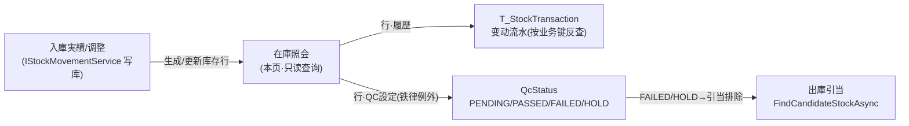
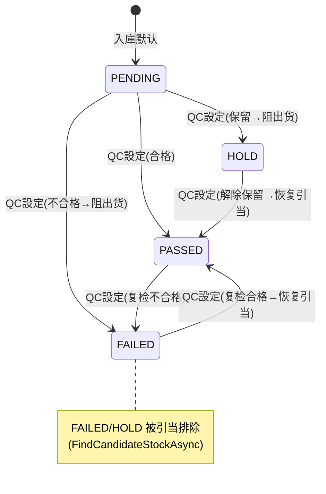

# 在庫照会 单页面操作 SOP（手把手版）

> **用途**：给**仓库管理员/库管员查库存、品保设 QC 状态、培训老师讲、测试人员拆用例**。比模块总册（`03-库存物流WMS` §5.3）更细。
> **页面**：在庫照会（StockQuery · WM020 · 核心 · 库存物流 WMS）　**路由**：`/wms/stock`　**前端**：`views/wms/StockQueryView.vue`　**API**：`api/wms/stock.ts stockApi`（search / history / setQcStatus）　**后端**：`Wms/StockController`（照会·履历）+ `Wms/StockQcController` → `StockQcService.SetStockQcStatusAsync`
> **基准**：分支 `feat/wfs-inbox-core`，2026-06-29；后端权威 `docs/codemap-wms/01-库存核心-铁律.md`（2026-06-22 实测），UI 经实读 view。
> **样例数据**：製品 `PRD2026070001`、倉庫 `W01`、库位 `RES-C-01`/`W01-FG`、LotNo `LOT2026070001`、客户 `CUST-A`、单価 `¥120`。

---

## 1. 页面一句话说明

**在庫照会，就是按"仓库 / 库位 / 品番 / 批次"查实时库存三数量（物理 / 引当 / 可用）的中枢——它只读，看库存看变动履历都在这里；唯一能"改"的是单条库存的 QC 检验状态（PENDING/PASSED/FAILED/HOLD），而 QC 设置是库存铁律的合法例外（只改属性标志、三数量一动不动、不发流水）。** 三数量恒等式 `可用 = 物理 − 引当` 由系统每次变动末尾强制重算，**可用永远不能手填**；可用<0 时红字加粗预警。

---

## 2. 这个页面在业务流程中的位置

- **上游**：入庫実績 / 在庫調整 / 棚移動经 `IStockMovementService` 写出库存行——本页**不产生**库存，只照会。
- **本页**：查三数量、看履历、设 QC 状态。
- **下游**：QC 设为 FAILED/HOLD 会被出庫引当（`FindCandidateStockAsync` 的 `QcStatus∉{Failed,Hold}` 过滤）排除，影响能不能出货。

---

## 3. 谁使用这个页面

| 角色 | 用途 |
|---|---|
| 仓库管理员 / 库管员 | 按条件查实时库存、对账、看变动履历溯源 |
| 品保 / 品质担当 | 对单条库存设 QC 状态（判 FAILED 阻出货 / 改 PASSED 放行） |
| 采购 / 销售 | 查可用库存、查 VMI 客供（寄售）库存 |

---

## 4. 操作前准备

- [ ] 仓库 / 库位主数据已建，且已有入庫产生的库存（否则查无数据）。
- [ ] 业务唯一键四列概念清楚：`倉庫CD + 库位CD + 品番CD + LotNo`（无批管理时 `LotNo=""` 空字符串，**非 null**）。
- [ ] 记牢恒等式 `可用 = 物理 − 引当`，**可用永不手填**，每次库存变动末尾强制重算。
- [ ] 要设 QC 状态前想清下游影响：标 **FAILED / HOLD 即被出库引当排除**，只 PENDING / PASSED 可引当。

---

## 5. 页面区域说明

| 区域 | 内容 |
|---|---|
| 检索卡 | inline 表单：倉庫CD / 库位CD / 品番CD / LotNo（4 个文本框）+ 所有者(ownerType 下拉 SELF/CUSTOMER)+ `hasStockOnly` 复选（默认勾）+「検索」「クリア」 |
| 结果列表卡 | total 标签 + 13 列表格（倉庫/库位/品番/LotNo/物理/引当/**可用**/単位/有効期限/所有者/标志/QC/操作）+ 分页器 50/100/200 |
| 操作列（行右固定） | 每行两个 link 按钮：「履歴」「QC設定」 |
| QC 设置弹窗 | 520px：顶部只读摘要（品番/Lot/仓库/库位/当前 QC tag）+ 新状态单选（4 选 1）+ 事由 textarea（≤200 字）+ 取消/确认 |
| 履历弹窗 | 900px：descriptions（品番/Lot/仓库/库位）+ 流水表（時刻/類型 tag/数量/関連No/担当/備考） |

---

## 6. 字段填写说明（口语版）

**检索区**（全部可空；点「検索」生效，回车不触发）：

| 字段 | 怎么填 | 说明 |
|---|---|---|
| 倉庫CD（warehouseCd） | 如 `W01` | 精确匹配 |
| 库位CD（locationCd） | 如 `RES-C-01` | 精确匹配 |
| 品番CD（productCd） | 如 `PRD2026070001` | **模糊匹配**（Contains） |
| LotNo（lotNo） | 如 `LOT2026070001` | 精确匹配 |
| 所有者（ownerType） | SELF=自社 / CUSTOMER=客供(VMI) | 看寄售库存选 CUSTOMER |
| hasStockOnly | 默认勾选=只看有库存行（`PhysicalQty≠0`）；取消→含 0 库存行 | 复选框 |

**QC 设置弹窗**（仅 2 个可填字段）：

| 字段 | 怎么填 | 填错影响 |
|---|---|---|
| 新状态（qcNewStatus） | 4 选 1：PENDING/PASSED/FAILED/HOLD | **必选**（不选确认灰）；选 FAILED/HOLD→该批被引当排除 |
| 事由（qcReason） | ≤200 字，**可空** | 留痕用，空也能提交 |

> 列表所有数量列（物理/引当/可用）**永久只读**，本页不在此改数量。

---

## 7. 按钮操作说明

| 按钮 | 位置 | 点了会怎样 | 启用条件 |
|---|---|---|---|
| 検索 | 检索卡 | `stockApi.search(query)` 重新拉列表 | 常显（loading 时转圈） |
| クリア | 检索卡 | 清空 4 文本框 + ownerType，`hasStockOnly` **复位 true**，page=1，并重查 | 常显 |
| 履歴（行） | 操作列 | `stockApi.history(row.id, 365)` 开 900px 弹窗看流水 | 每行都有 |
| QC設定（行） | 操作列 | 开 QC 弹窗，新状态预填为该行当前 QC 状态 | 每行都有 |
| 取消（弹窗） | QC 弹窗 | 关弹窗不保存 | 保存中（`qcSaving`）灰 |
| 确认（弹窗） | QC 弹窗 | `setQcStatus(id, status, reason)`→成功 toast→局部更新该行 QC tag + 全列表 reload | **`!qcNewStatus`（未选新状态）时灰** |

> 弹窗打开时新状态已预填当前 QC 值，故确认按钮默认可点；只有当新状态为空（理论态）才灰。

---

## 8. 标准业务操作 SOP（照着点）

### 场景一：按条件查在库三数量（主流程）
- **业务背景**：库管员要核对某品番在某仓的实时库存。
- **样例数据**：倉庫 `W01`、品番 `PRD2026070001`。
- **前置条件**：该品番已有入庫库存行。
- **详细步骤**：1) 检索卡填倉庫 `W01` + 品番 `PRD2026070001`；2) 保持 hasStockOnly 勾选；3) 点「検索」。
- **完成后检查**：命中行显示物理/引当/可用三数量；`可用 = 物理 − 引当` 成立；total 标签显示命中条数。
- **异常处理**：查无数据→确认是否真有库存 / 是否误勾 hasStockOnly 把 0 库存行过滤了。
- **可拆测试用例**：TC-M06-STOCK-001、002、003、004、024。

### 场景二：可用<0 负库存红字预警
- **业务背景**：发现某库存可用为负（引当超物理或异常）。
- **样例数据**：品番 `PRD2026070001`、库位 `RES-C-01`，物理 100 / 引当 120 → 可用 −20。
- **前置条件**：存在 `AvailableQty<0` 的库存行（多见于允许负库存的仓或异常）。
- **详细步骤**：1) 检索定位该行；2) 看「可用」列。
- **完成后检查**：可用列数字**红色加粗**（class `neg`，颜色 `#f56c6c`、font-weight 600）；据此排查是否仓库 `AllowNegative=true` 或引当异常。
- **异常处理**：负库存非本页能改，须走在庫調整 / 出庫流程修正（本页只读）。
- **可拆测试用例**：TC-M06-STOCK-005、006。

### 场景三：看变动履历溯源
- **业务背景**：要追这条库存"怎么变成现在这个数量"的全部流水。
- **样例数据**：品番 `PRD2026070001`、库位 `RES-C-01`、LotNo `LOT2026070001`。
- **前置条件**：该库存行有历史交易（IN/OUT/...）。
- **详细步骤**：1) 在结果行点「履歴」；2) 弹窗顶看四列业务键摘要；3) 看下方流水表（時刻降序）。
- **完成后检查**：履历按**业务唯一键四列**（倉庫+库位+品番+LotNo）反查 `T_StockTransaction`（**不靠外键**，证明 Txn 是唯一真实源）；默认拉**近 365 天**（硬编码，无天数选择器）；交易类型显示 IN/OUT/RSV/UNRSV/MOVE/ADJ。
- **异常处理**：交易类型是**裸英文码**（无 i18n 翻译，现状）；超 365 天的流水看不到（无更早入口）。
- **可拆测试用例**：TC-M06-STOCK-007、008、009、010。

### 场景四：QC 判 FAILED 阻出货
- **业务背景**：品保检验某批不合格，要禁止它被出货引当。
- **样例数据**：品番 `PRD2026070001`、LotNo `LOT2026070001`、库位 `RES-C-01`、事由「外观不良」。
- **前置条件**：该批当前 QC=PENDING 或 PASSED。
- **详细步骤**：1) 行「QC設定」开弹窗；2) 新状态选 `FAILED`；3) 事由填「外观不良」（可空）；4) 点确认。
- **完成后检查**：成功 toast；该行 QC 列 tag 变红（FAILED）；**三数量不动、不产生 Txn**（铁律例外）；去出庫指示做引当时，`FindCandidateStockAsync` 的 `QcStatus∉{Failed,Hold}` 过滤会**排除该批**→不可出货。
- **异常处理**：新状态非法值→`WM-MSG-QC-001`；Stock 不存在→`WM-MSG-QC-404`。
- **可拆测试用例**：TC-M06-STOCK-011、012、013、014、020。

### 场景五：解除 HOLD/FAILED 恢复可引当
- **业务背景**：复检合格或解除保留，让该批重新可出货。
- **样例数据**：品番 `PRD2026070001`、LotNo `LOT2026070001`，当前 QC=HOLD 或 FAILED。
- **前置条件**：该批 QC 为 FAILED / HOLD。
- **详细步骤**：1) 行「QC設定」；2) 新状态改回 `PASSED`（或 PENDING）；3) 确认。
- **完成后检查**：QC tag 变绿（PASSED）；`StockQcStatus.IsAllocatable`=PENDING/PASSED→该批恢复可被引当出货。
- **异常处理**：同场景四错误码。
- **可拆测试用例**：TC-M06-STOCK-015、016、021。

### 场景六：VMI 客供（寄售）库存核对
- **业务背景**：核对客户寄售（VMI）在我方仓的库存。
- **样例数据**：所有者选 CUSTOMER、客户 `CUST-A`。
- **前置条件**：存在 `ownerType=CUSTOMER` 的库存行。
- **详细步骤**：1) 检索卡所有者下拉选 `CUSTOMER`；2) 点「検索」。
- **完成后检查**：命中行「所有者」列显黄色 tag（VMI）；自社库存(SELF) 该列显「—」。
- **异常处理**：客供库存不能在本页改归属（只读照会）。
- **可拆测试用例**：TC-M06-STOCK-017、018。

### 场景七：QC 事由可空 / 未选状态灰按钮
- **业务背景**：验证 QC 弹窗的校验边界。
- **样例数据**：任一库存行。
- **前置条件**：进入 QC 弹窗。
- **详细步骤**：1) 开 QC 弹窗（新状态默认预填当前值）；2) 不填事由直接确认；3) 另测：若新状态被清空，看确认按钮。
- **完成后检查**：事由空也能成功提交（事由可空）；`!qcNewStatus` 时确认按钮灰（防空提交）。
- **异常处理**：—
- **可拆测试用例**：TC-M06-STOCK-019、022、023。

---

## 9. 状态变化说明

> 本页**不改库存数量**（数量由 `IStockMovementService` 在别的页面变动）。本页唯一可变的是 QC 状态。

- QC 四状态**无固定单向流转**，由人工 / MES QC 接缝任意设置（PENDING↔PASSED↔FAILED↔HOLD）。
- 可引当判定：`IsAllocatable` = PENDING / PASSED → 可引当；FAILED / HOLD → 阻断。

---

## 10. 按钮不可用 / 灰色原因

| 现象 | 原因 |
|---|---|
| QC 弹窗·确认灰 | `!qcNewStatus`（未选新状态）；弹窗预填当前值故一般可点 |
| QC 弹窗·取消灰 | 保存中（`qcSaving=true`），防并发 |
| 检索按钮转圈不可点 | `loading=true`（上次查询未回） |
| 找不到"改数量"按钮 | 照会页**只读**，数量变动须走入出庫 / 在庫調整 / 棚移動 |
| 找不到批量 QC / 调整 / 移库入口 | 本页无；`stockApi` 虽有 apply/move/transactions/按工单批量 QC，但**本页未挂入口**（通用入口供其他模块/手工调） |

---

## 11. 常见错误与处理

| 错误 / 现象 | 原因 | 处理 |
|---|---|---|
| `WM-MSG-QC-001` | QC 新状态非 PENDING/PASSED/FAILED/HOLD（非法值） | 选合法状态 |
| `WM-MSG-QC-404` | 目标 Stock 不存在（已删 / id 错） | 刷新列表重选行 |
| 新状态空报裸文本 | 提交时 newStatus 为空 | 选一个状态 |
| 查无数据 | 误勾 hasStockOnly 过滤了 0 库存行 / 条件过严 | 取消 hasStockOnly 或放宽条件 |
| 可用红字看不懂 | 可用<0（负库存） | 排查仓 AllowNegative / 引当异常，走调整修正 |
| 履历交易类型看不懂 | 显示裸英文码 IN/OUT/RSV/UNRSV/MOVE/ADJ（无 i18n） | 对照：IN 入/OUT 出/RSV 引当/UNRSV 解引当/MOVE 移库/ADJ 调整 |
| 设了 QC 但库存数量没变 | 设计如此——QC 是铁律例外，只改属性不动数量 | 正常，无需处理 |

---

## 12. 操作完成后的检查清单（下游验证）

- [ ] 查询：命中行三数量正确，`可用 = 物理 − 引当`；可用<0 时红字加粗。
- [ ] **设 QC=FAILED/HOLD 后**：① 该行 QC 列 tag 变色（FAILED 红 / HOLD 黄）；② **三数量不变、不新增 Txn**（去履历核对无新流水）；③ 去出庫指示做引当，该批被 `FindCandidateStockAsync`（`QcStatus∉{Failed,Hold}`）**排除**→不可出货。
- [ ] **设 QC=PASSED 后**：该批恢复可被引当（IsAllocatable=true）。
- [ ] 履历：点行「履歴」核对该业务键的 `T_StockTransaction` 全时序流水（按四列反查，不靠外键）。
- [ ] VMI：所有者 CUSTOMER 行「所有者」列显黄 tag；recall 行「标志」列显红 tag。

---

## 13. 页面级测试用例（≥25 条，可执行）

> 编号 `TC-M06-STOCK-xxx`；数据用样例。

| 用例编号 | 用例名称 | 优先级 | 前置条件 | 测试数据 | 操作步骤 | 预期结果 | 下游检查 | 备注 |
|---|---|---|---|---|---|---|---|---|
| TC-M06-STOCK-001 | 按倉庫查库存 | P0 | W01 有库存 | 倉庫 W01 | 填倉庫→検索 | 命中 W01 全库存行 | — | — |
| TC-M06-STOCK-002 | 品番模糊检索 | P1 | 有该品番 | PRD2026 | 填品番→検索 | Contains 命中 | — | productCd 模糊 |
| TC-M06-STOCK-003 | 三数量恒等式 | P0 | 有库存行 | PRD2026070001 | 検索看三列 | 可用=物理−引当 | — | 一致性 |
| TC-M06-STOCK-004 | hasStockOnly 过滤 0 库存 | P1 | 有 0 库存行 | 默认勾选 | 検索 | 不含 PhysicalQty=0 行 | — | 默认行为 |
| TC-M06-STOCK-005 | 可用<0 红字加粗 | P1 | 有负可用行 | 物理100/引当120 | 検索看可用列 | 可用 −20 红色加粗(class neg) | — | 负库存预警 |
| TC-M06-STOCK-006 | 可用≥0 不变红 | P2 | 正常库存 | 物理100/引当20 | 検索看可用列 | 可用 80 黑字 | — | — |
| TC-M06-STOCK-007 | 打开履历 | P0 | 行有流水 | PRD2026070001 | 点「履歴」 | 弹窗显四列摘要+流水表 | — | — |
| TC-M06-STOCK-008 | 履历按四列反查 | P1 | 有同品番多库位 | 倉庫+库位+品番+Lot | 点「履歴」 | 仅本业务键流水(不混库位) | T_StockTransaction | 不靠外键 |
| TC-M06-STOCK-009 | 履历默认 365 天 | P2 | 有>365天旧流水 | — | 点「履歴」 | 仅近 365 天 | — | 硬编码无选择器 |
| TC-M06-STOCK-010 | 交易类型裸码显示 | P2 | 有 IN/OUT 流水 | — | 看履历类型列 | 显 IN/OUT/RSV/UNRSV/MOVE/ADJ 英文 | — | 无 i18n |
| TC-M06-STOCK-011 | QC 设 FAILED | P0 | QC=PENDING | FAILED+事由 | QC設定→FAILED→确认 | toast+QC tag 变红 | 引当排除 | 核心 |
| TC-M06-STOCK-012 | 设 QC 三数量不变 | P0 | 有库存行 | FAILED | QC設定→确认 | 物理/引当/可用不变 | 履历无新 Txn | 铁律例外 |
| TC-M06-STOCK-013 | 设 QC 不发 Txn | P0 | 有库存行 | HOLD | QC設定→确认后看履历 | 无新增流水记录 | T_StockTransaction | 铁律例外 |
| TC-M06-STOCK-014 | FAILED 引当排除 | P0 | 该批 FAILED | PRD2026070001 | 去出庫引当 | 该批不被选中 | FindCandidateStockAsync | 下游 |
| TC-M06-STOCK-015 | FAILED→PASSED 恢复 | P1 | 该批 FAILED | PASSED | QC設定→PASSED→确认 | QC tag 变绿 | 可再引当 | — |
| TC-M06-STOCK-016 | HOLD→PASSED 恢复 | P1 | 该批 HOLD | PASSED | QC設定→PASSED→确认 | IsAllocatable 恢复 | 可再引当 | — |
| TC-M06-STOCK-017 | VMI 客供检索 | P1 | 有 CUSTOMER 行 | ownerType=CUSTOMER | 选所有者→検索 | 命中客供库存 | — | VMI |
| TC-M06-STOCK-018 | 所有者列黄 tag | P2 | CUSTOMER 行 | — | 看所有者列 | CUSTOMER 显黄 tag、SELF 显「—」 | — | — |
| TC-M06-STOCK-019 | QC 事由可空提交 | P1 | QC 弹窗 | 事由空 | 选状态→不填事由→确认 | 提交成功 | — | 事由可空 |
| TC-M06-STOCK-020 | QC 非法状态 | P1 | — | 非法值 | 提交非法 newStatus | WM-MSG-QC-001 | 不落库 | 后端校验 |
| TC-M06-STOCK-021 | Stock 不存在 | P2 | id 已删 | 错 stockId | 设 QC | WM-MSG-QC-404 | — | — |
| TC-M06-STOCK-022 | 新状态空确认灰 | P2 | QC 弹窗清空状态 | 无状态 | 看确认按钮 | 按钮灰(`!qcNewStatus`) | — | 防空提交 |
| TC-M06-STOCK-023 | 弹窗预填当前状态 | P2 | 行 QC=PASSED | — | 开 QC 弹窗 | 新状态默认选中 PASSED | — | 默认可点 |
| TC-M06-STOCK-024 | クリア重置 | P2 | 已填条件 | — | 点クリア | 清条件+hasStockOnly 复位 true+重查 | — | — |
| TC-M06-STOCK-025 | 分页切换 | P2 | >50 条 | pageSize 100 | 改每页/翻页 | 重新拉对应页 | — | 50/100/200 |
| TC-M06-STOCK-026 | recall 红 tag | P2 | 有 recall 行 | recallFlag=true | 看标志列 | 显红色 recall tag | — | — |
| TC-M06-STOCK-027 | QC tag 配色 | P3 | 各 QC 状态行 | — | 看 QC 列 | PASSED绿/FAILED红/HOLD黄/PENDING灰 | — | qcTagOf |
| TC-M06-STOCK-028 | 照会页只读无改数量 | P1 | 有库存 | — | 找改数量入口 | 无（须走入出庫/调整） | — | 只读 |
| TC-M06-STOCK-029 | 本页无批量 QC 入口 | P2 | — | — | 找批量/按工单 QC | 本页无入口 | — | 盲点(待业务确认是否需要) |
| TC-M06-STOCK-030 | 权限不足 | P2 | 无权账号 | — | 进页面/设 QC | 待业务确认(隐藏/拒绝) | — | 权限 |
| TC-M06-STOCK-031 | 网络异常 | P2 | 断网 | — | 设 QC 确认 | 友好错误可重试(`Network error`) | — | catch 分支 |

---

## 14. 培训讲解建议

| 顺序 | 讲什么 | 演示 | 易误解点 |
|---|---|---|---|
| 1 | 这页是库存查询的中枢、只读 | §2 流程图 | 以为能在这改库存数量 |
| 2 | 三数量与恒等式 | 物理/引当/可用三列 | 以为可用能手填 |
| 3 | 可用<0 红字=负库存预警 | 找一条负可用行 | 红字误当系统出错 |
| 4 | 履历=唯一真实源、按四列反查 | 点「履歴」 | 以为靠外键 / 想看 1 年前 |
| 5 | QC 是铁律的合法例外 | 设 FAILED 后看数量没变 | 以为设 QC 会动库存 |
| 6 | FAILED/HOLD→阻出货 | 设 FAILED 再去引当 | 不知道会影响出货 |
| 7 | 交易类型裸码 / 本页无批量入口 | 看履历英文码 | 误以为缺功能（实为现状/盲点） |

---

## 15. 与模块级手册的关系

对应 `03-库存物流WMS-最详细用户操作培训手册.md` §5.3 在庫照会（含 5.3.1a~1e）。模块手册 §3 库存铁律、§5.3 为本页提供后端权威口径；本页 SOP 是 §5.3 的手把手细化（≥7 场景 / ≥25 用例）。

---

## 16. 代码与文档来源

| 层 | 文件 |
|---|---|
| 逐行源码手册 | `docs/codemap-wms/01-库存核心-铁律.md`（权威，2026-06-22 实测） |
| 模块手册 | `docs/manuals/user-training/03-库存物流WMS-最详细用户操作培训手册.md` §5.3 |
| 前端 view | `cp6.web/src/views/wms/StockQueryView.vue` |
| API/类型 | `cp6.web/src/api/wms/stock.ts`（search/history/setQcStatus）、`cp6.web/src/types/wms/wms.ts`（Stock/StockTransaction/StockQcStatusKey） |
| 后端·照会/履历 | `Controllers/Wms/StockController.cs`（search · `/{stockId}/history` 按业务 UK 四列反查 + `TxnDateTime>=since` 降序） |
| 后端·QC（铁律例外） | `Controllers/Wms/StockQcController.cs` → `Services/Wms/StockQcService.cs SetStockQcStatusAsync`（只改 QcStatus + Modifier，不发 Txn） |
| 库存铁律核心 | `Services/Wms/IStockMovementService.cs` / `StockMovementService.cs`（ApplyAsync 末尾 `AvailableQty = PhysicalQty − AllocatedQty` 强制重算；本页**不调用**） |
| 引当排除接缝 | `FindCandidateStockAsync`（过滤 `QcStatus∉{Failed,Hold}`，见出庫篇） |
| 实体 | `DomainModels/Wms/Stock.cs`（业务 UK 4 列 + 三数量 decimal(21,8) + QcStatus 默认 PENDING）、`StockTransaction.cs`（INSERT only） |

---

## 最后更新来源

- 代码：见 §16（codemap-wms 01 铁律 + StockQueryView.vue 实读 + stock.ts/wms.ts 类型 + 模块手册 §5.3）。
- 基准：分支 `feat/wfs-inbox-core`，2026-06-29（codemap 2026-06-22）。
- 覆盖：16 节 / 7 场景 / 31 用例（TC-M06-STOCK-001~031）。
- 诚实标注：交易类型裸码无 i18n（现状）；本页无批量 QC / apply / move / transactions 入口（盲点，`待业务确认`是否需挂）；QC=FAILED→引当排除联动以出庫篇 `FindCandidateStockAsync` 为准；权限/网络异常用例待业务确认具体表现。
