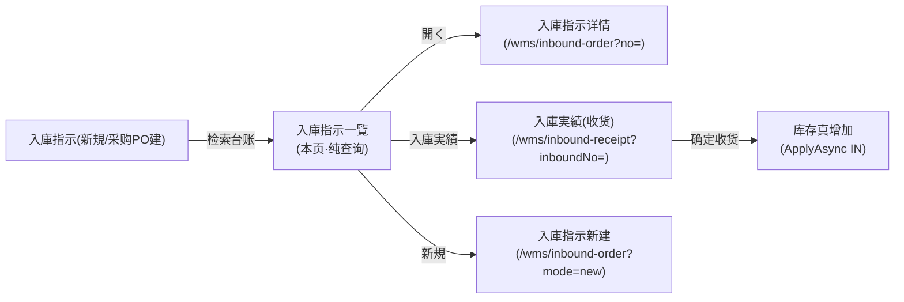
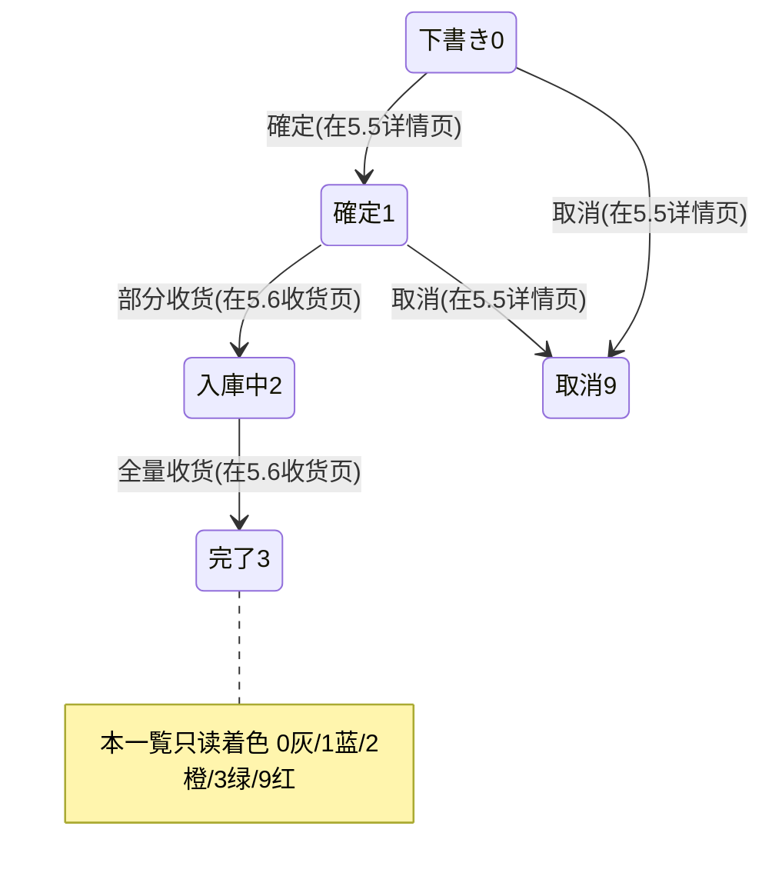

# 入庫指示一覧 单页面操作 SOP（手把手版）

> **用途**：给**库管员/采购操作、培训老师讲、测试人员拆用例**。比模块总册（`03-库存物流WMS` §5.4）更细。
> **页面**：入庫指示一覧（WM030 · 库存物流 WMS）　**路由**：`/wms/inbound-order-list`　**前端**：`views/wms/InboundOrderListView.vue`　**API**：`api/wms/inboundOrder.ts inboundOrderApi.search`　**后端**：`Wms/InboundOrderController.Search` → `InboundService.SearchOrdersAsync`
> **基准**：分支 `feat/wfs-inbox-core`，2026-06-29；后端实测 `docs/codemap-wms/02-入庫.md`（2026-06-22 权威），UI 经 agent 实读 view。
> **样例数据**：入庫指示 `IN2026070001`、仕入先 `SUP01`、倉庫 `W01`、製品 `PRD2026070001`。

---

## 1. 页面一句话说明

**入庫指示一覧，就是入庫予定（入庫指示单）的台账查询屏——按 6 个条件检索清单，看状态/类型一眼着色，然后跳去「開く」看详情、或跳去「入庫実績」收货。** 它**只查询、只导航，本身不写任何库存、不改任何单据状态**。

---

## 2. 这个页面在业务流程中的位置

- **上游**：已存在的入庫指示（手工新規或采购 GR 委托自动建）。
- **本页**：纯检索 + 导航的台账入口，**无库存触达、无状态迁移**。
- **下游**：「開く」→详情（5.5）；「入庫実績」→收货页（5.6，库存真正在那里增加）；「新規」→开单。

---

## 3. 谁使用这个页面

| 角色 | 用途 |
|---|---|
| 库管员 | 查入庫予定、跳收货、跟进到货进度 |
| 采购担当 | 核对采购 PO 对应入庫予定状态 |
| 测试/培训 | 验证检索、状态/类型着色、行导航 |

---

## 4. 操作前准备

- [ ] 已有入庫指示数据（手工新規或采购收货委托自动建）。
- [ ] 想清楚要查的维度：入庫指示No / 仕入先CD / 倉庫 / 状態 / 入荷予定区间。
- [ ] 知道目标单的状态——**「入庫実績」按钮对任何状态都显示，但只有 確定(1)/入庫中(2) 单到收货页才能真收货**。

---

## 5. 页面区域说明

| 区域 | 内容 |
|---|---|
| 检索卡（inline 表单） | 6 个条件横排：入庫指示No / 仕入先CD / 倉庫 / 状態(下拉) / 入荷予定 From / 入荷予定 To + 「検索」按钮 + 「新規」按钮 |
| 结果表 | `el-table`，最大高 600px、border/stripe；8 数据列（含状态 tag、类型）+ 操作列；`pageSize:100` **固定取 100 条，页面无分页器** |
| 行操作列（fixed right） | 每行两个 link 按钮：「開く」「入庫実績」 |

**结果表 8 数据列**：入庫指示No / 状態(tag) / タイプ / 仕入先名 / PO No / 入荷予定日 / 倉庫 / 登録日。

---

## 6. 字段填写说明（口语版）

**检索条件**（全部可空，空=不限；点「検索」才发起查询，进页面 onMounted 已自动查一次）：

| 条件 | 控件 | 怎么填 | 说明 |
|---|---|---|---|
| 入庫指示No | 输入框(clearable) | 如 `IN2026070001` | 入庫指示单号，模糊/精确视后端 |
| 仕入先CD | 输入框(clearable) | 如 `SUP01` | 供应商代码 |
| 倉庫 | 输入框(clearable) | 如 `W01` | 仓库代码 |
| 状態 | 下拉(clearable) | 下书き/確定/入庫中/完了/取消 | 选项来自 statusMap，传 Number 值 |
| 入荷予定 From | 日期(`YYYY-MM-DD`) | 如 2026-07-01 | 入荷予定日区间起 |
| 入荷予定 To | 日期(`YYYY-MM-DD`) | 如 2026-07-31 | 入荷予定日区间止 |

> 结果列**全为只读展示**，本页没有任何可编辑字段。状态列 tag 着色、类型列文字映射，都是只读渲染。

---

## 7. 按钮操作说明

| 按钮 | 位置 | 点了会怎样 |
|---|---|---|
| 検索 | 检索卡 | 带当前 6 条件调 `inboundOrderApi.search`，刷新结果表（`loading` 期间禁用） |
| 新規 | 检索卡 | 跳 `/wms/inbound-order?mode=new` 开新单（去 5.5） |
| 開く | 行操作列 | 跳 `/wms/inbound-order?no=IN2026070001` 看/编该单详情（5.5） |
| 入庫実績 | 行操作列 | 跳 `/wms/inbound-receipt?inboundNo=IN2026070001` 去收货（5.6）；**本按钮对任何状态行都显示，无状态门控** |

> 行操作列两个按钮**对每一行恒显**（含下书き/取消/完了单），不随状态隐藏；真正的状态校验在目标页（详情页 `editable=status===0`、收货页参照模式要求 確定/入庫中）才发生。

---

## 8. 标准业务操作 SOP（照着点）

### 场景一：按入庫指示No精确查 + 開く（主流程）
- **背景**：知道单号，要看这张入庫予定的明细。
- **样例数据**：入庫指示 `IN2026070001`。
- **步骤**：1) 检索卡填「入庫指示No = IN2026070001」；2) 点「検索」；3) 结果表命中该行；4) 点行「開く」。
- **完成后检查**：跳到 `/wms/inbound-order?no=IN2026070001`，详情页加载该单头+明细。
- **用例**：TC-M06-INLIST-001、002、015。

### 场景二：组合检索（仕入先 + 倉庫 + 状態 + 入荷予定区间）
- **背景**：查某供应商、某仓、某状态、某到货月的入庫予定。
- **样例数据**：仕入先 `SUP01`、倉庫 `W01`、状態 確定、入荷予定 2026-07-01 ~ 2026-07-31。
- **步骤**：填 4~6 个条件→点「検索」。
- **检查**：只返回同时满足所有条件、入荷予定落在区间内的行；条件留空=该维度不限。
- **用例**：TC-M06-INLIST-003、004、005、006。

### 场景三：状态过滤 + 类型/状态着色识别
- **背景**：只看「入庫中（部分入庫）」的单，并靠颜色快速分辨。
- **步骤**：状態下拉选「入庫中」→検索；看结果表状态 tag 颜色、类型列文字。
- **检查**：状态 tag——0下書き灰(info)/1確定蓝(primary)/2入庫中橙(warning)/3完了绿(success)/9取消红(danger)；类型——1購買/2外注戻/3返品/9その他。
- **用例**：TC-M06-INLIST-007、008、009、010。

### 场景四：从台账去收货（入庫実績导航）
- **背景**：一张已確定单到货了，要收货。
- **样例数据**：`IN2026070001`（状态=確定 或 入庫中）。
- **步骤**：检索到该行→点行「入庫実績」。
- **检查**：跳 `/wms/inbound-receipt?inboundNo=IN2026070001`，进入参照模式收货页（库存真增加发生在那一页确定时，不在本页）。
- **用例**：TC-M06-INLIST-011、012。

### 场景五：对非可收货单点「入庫実績」（盲点·无状态门控）
- **背景**：误对下書き/取消/完了单点了「入庫実績」。
- **步骤**：找一张下書き(0) 或 取消(9) 单→点行「入庫実績」。
- **检查**：本页**照样跳转**（按钮无门控）；到收货页参照取込时才被校验拦截——来源状态须 確定(1)/入庫中(2)，否则报 `WM-MSG-043`。
- **用例**：TC-M06-INLIST-013、014。

### 场景六：超 100 条截断（盲点·无分页器）
- **背景**：满足条件的入庫予定超过 100 条。
- **步骤**：用宽松条件（全空）検索，命中量预期 >100。
- **检查**：`pageSize:100` 固定，结果表**最多显示 100 行且无分页器/无翻页**，第 101 条起看不到；需收紧检索条件才能定位。
- **用例**：TC-M06-INLIST-016、017。

### 场景七：新規开单导航
- **背景**：要建一张新入庫予定。
- **步骤**：点检索卡「新規」。
- **检查**：跳 `/wms/inbound-order?mode=new`，进入空白新建表单（去 5.5）。
- **用例**：TC-M06-INLIST-018。

---

## 9. 状态变化说明

> 本页**不改任何状态**；下表仅说明结果列 tag 的着色含义（状态由 5.5/5.6 推进）。

---

## 10. 按钮不可用 / 灰色原因

| 现象 | 原因 |
|---|---|
| 「検索」按钮转圈禁用 | `loading=true`（上一次查询未返回） |
| 行「開く」/「入庫実績」从不灰、从不隐藏 | **设计如此·无状态门控**——任何状态行都显示两个按钮 |
| 点了「入庫実績」却在下一页被拦 | 收货页参照模式校验来源状态 確定/入庫中，本页不拦（`WM-MSG-043` 在收货页报） |
| 列表里找不到改/删/确定按钮 | 本页是**纯查询台账**，无写操作；改/删/確定在 5.5 详情页 |

---

## 11. 常见错误与处理

| 错误/现象 | 原因 | 处理 |
|---|---|---|
| 查到的单看不全（只有 100 条） | `pageSize:100` 固定无分页 | 收紧检索条件（加单号/仕入先/状態/日期区间）定位 |
| 对非可收货单点「入庫実績」跳过去才报错 | 行按钮无状态门控，校验在收货页 | 先看状态 tag，只对 確定(1)/入庫中(2) 单去收货；报 `WM-MSG-043` 时返回选对单 |
| 検索无结果 | 条件过严 / 入荷予定区间不含目标 / 单已软删 | 放宽条件、检查 From-To 区间、确认单未被删除 |
| 状态/类型列显示数字而非文字 | 该 status/type 值不在 statusMap/typeMap 内 | 兜底原样显示原值，核对主数据枚举 |
| 列表数据不是最新 | 本页不自动轮询 | 重新点「検索」刷新 |

---

## 12. 操作完成后的检查清单

- [ ] 检索命中预期行；空条件维度不限、有值维度精确/区间过滤生效。
- [ ] 状态 tag 着色正确（0灰/1蓝/2橙/3绿/9红）、类型文字正确（1購買/2外注戻/3返品/9その他）。
- [ ] 「開く」跳 `/wms/inbound-order?no=`、「入庫実績」跳 `/wms/inbound-receipt?inboundNo=`、「新規」跳 `?mode=new`，单号透传正确。
- [ ] 本页操作**未产生任何库存变动、未改任何单据状态**（纯查询导航）。
- [ ] 命中量可能 >100 时，意识到只显示前 100 条（无分页）。

---

## 13. 页面级测试用例（≥25 条，可执行）

> 编号 `TC-M06-INLIST-xxx`；数据用样例（入庫指示 `IN2026070001`、仕入先 `SUP01`、倉庫 `W01`、製品 `PRD2026070001`）。

| 用例编号 | 用例名称 | 优先级 | 前置条件 | 测试数据 | 操作步骤 | 预期结果 | 下游检查 | 备注 |
|---|---|---|---|---|---|---|---|---|
| TC-M06-INLIST-001 | 进页面默认加载 | P1 | 有入庫指示数据 | — | 打开 /wms/inbound-order-list | onMounted 自动检索、结果表有数据 | — | 默认 pageSize:100 |
| TC-M06-INLIST-002 | 按入庫指示No精确查 | P0 | 单存在 | IN2026070001 | 填No→検索 | 命中该行 | — | — |
| TC-M06-INLIST-003 | 按仕入先CD查 | P1 | 有该供应商单 | SUP01 | 填仕入先CD→検索 | 仅该供应商行 | — | — |
| TC-M06-INLIST-004 | 按倉庫查 | P1 | 有该仓单 | W01 | 填倉庫→検索 | 仅该仓行 | — | — |
| TC-M06-INLIST-005 | 入荷予定区间过滤 | P1 | 跨月数据 | 2026-07-01~07-31 | 填From/To→検索 | 仅区间内行 | — | ExpectedArrivalDate 区间 |
| TC-M06-INLIST-006 | 多条件组合检索 | P0 | 多维数据 | SUP01+W01+確定+区间 | 填4条件→検索 | 同时满足全部条件 | — | AND 逻辑 |
| TC-M06-INLIST-007 | 状態下拉过滤(入庫中) | P1 | 有入庫中单 | 状態=入庫中 | 选下拉→検索 | 仅 status=2 行 | — | 传 Number 值 |
| TC-M06-INLIST-008 | 状態 tag 着色正确 | P2 | 各状态单 | — | 看状态列 | 0灰/1蓝/2橙/3绿/9红 | — | statusTagOf |
| TC-M06-INLIST-009 | 类型 typeMap 显示 | P2 | 各类型单 | — | 看类型列 | 1購買/2外注戻/3返品/9その他 | — | typeMap |
| TC-M06-INLIST-010 | 未知状态/类型兜底 | P3 | 异常值 | status=5 | 看列 | 原样显示原值不报错 | — | `|| row.x` 兜底 |
| TC-M06-INLIST-011 | 行「開く」导航 | P0 | 单存在 | IN2026070001 | 点開く | 跳 /wms/inbound-order?no=IN2026070001 | 详情页加载该单 | goEdit |
| TC-M06-INLIST-012 | 行「入庫実績」导航 | P0 | 確定/入庫中单 | IN2026070001 | 点入庫実績 | 跳 /wms/inbound-receipt?inboundNo= | 进参照收货页 | goReceive |
| TC-M06-INLIST-013 | 收货按钮无状态门控(下書き) | P1 | 下書き单 | status=0 | 点入庫実績 | 本页照样跳转 | 收货页取込再拦 | 盲点 |
| TC-M06-INLIST-014 | 非可收货单到收货页被拦 | P1 | 取消/完了单 | status=9 | 点入庫実績→收货页取込 | 收货页报 WM-MSG-043 | 不能收货 | 校验在下游 |
| TC-M06-INLIST-015 | 单号透传正确 | P1 | 单存在 | IN2026070001 | 開く后看 URL | query.no=IN2026070001 | — | — |
| TC-M06-INLIST-016 | 超100条只显示100 | P1 | >100 条数据 | 空条件 | 検索 | 结果表最多 100 行 | — | pageSize:100 |
| TC-M06-INLIST-017 | 无分页器 | P1 | >100 条 | — | 看表格底部 | 无翻页/分页控件 | 第101条看不到 | 盲点 |
| TC-M06-INLIST-018 | 「新規」导航 | P1 | — | — | 点新規 | 跳 /wms/inbound-order?mode=new | 空白新建表单 | goCreate |
| TC-M06-INLIST-019 | 清空条件全量查 | P2 | — | 全空 | 清空→検索 | 返回全部(≤100) | — | clearable |
| TC-M06-INLIST-020 | 检索 loading 禁用 | P2 | — | — | 点検索观察 | 按钮转圈禁用直到返回 | — | loading 绑定 |
| TC-M06-INLIST-021 | 检索无命中 | P2 | — | 不存在的No | 填No→検索 | 空表、无报错 | — | — |
| TC-M06-INLIST-022 | 入荷予定日格式显示 | P3 | 有予定日 | — | 看入荷予定列 | 只显示 YYYY-MM-DD(slice 10) | — | — |
| TC-M06-INLIST-023 | 登録日列显示 | P3 | — | — | 看登録日列 | createDate 前10位 | — | — |
| TC-M06-INLIST-024 | 本页不写库存 | P0 | — | — | 任意检索/导航 | 库存表无变化 | StockTransaction 无新增 | 纯查询 |
| TC-M06-INLIST-025 | 本页不改状态 | P0 | — | — | 任意操作 | 单据状态不变 | — | 无写操作 |
| TC-M06-INLIST-026 | 软删单不出现 | P2 | 有软删单 | — | 検索 | IsDeleted 行被过滤 | — | Where(!IsDeleted) |
| TC-M06-INLIST-027 | 结果降序排列 | P3 | 多条数据 | — | 看顺序 | 按后端降序返回 | — | SearchOrdersAsync |
| TC-M06-INLIST-028 | 权限不足 | P2 | 无权账号 | — | 进页面 | 待业务确认(隐藏/拒绝) | — | 权限 |
| TC-M06-INLIST-029 | 网络异常 | P2 | 断网 | — | 検索 | 友好错误、可重试 | — | finally 复位 loading |
| TC-M06-INLIST-030 | 行内无改/删入口 | P2 | — | — | 看操作列 | 仅開く/入庫実績两按钮 | — | 纯台账 |

---

## 14. 培训讲解建议

| 顺序 | 讲什么 | 演示 | 易误解点 |
|---|---|---|---|
| 1 | 这页是入庫予定的"查询台账" | §2 流程图 | 以为能在这里收货/改单 |
| 2 | 6 个检索条件怎么组合 | 单号→多条件 | 空=不限、AND 逻辑 |
| 3 | 状态/类型靠颜色文字识别 | tag 着色 | 记不住 0灰/1蓝/2橙/3绿/9红 |
| 4 | 「開く」看详情、「入庫実績」去收货 | 两个行按钮 | 库存增加不在本页、在收货页 |
| 5 | 收货按钮无状态门控 | 对下書き单点 | 以为点了就能收（要看状态） |
| 6 | 超 100 条会被截断 | 宽条件查 | 以为列表就是全部 |

---

## 15. 与模块级手册的关系

对应 `03-库存物流WMS-...md` §5.4（入庫指示一覧 5.4.1~5.4.14）。上游单据生命周期见 §5.5（入庫指示），真增库存收货见 §5.6（入庫実績）。模块测试点汇总见 §5.4.14（组合检索/状态过滤/类型 tag/行导航/超 100 条截断/收货按钮无状态门控）。

---

## 16. 代码与文档来源

| 层 | 文件 |
|---|---|
| 逐行源码手册 | `docs/codemap-wms/02-入庫.md`（入庫指示 列表段，权威） |
| 前端 view | `views/wms/InboundOrderListView.vue`（statusMap/typeMap/statusTagOf/reload/goEdit/goReceive/goCreate） |
| API/类型 | `api/wms/inboundOrder.ts`(inboundOrderApi.search)、`types/wms/wms.ts`(InboundOrderSearchQuery / InboundOrder) |
| 后端 Controller | `Controllers/Wms/InboundOrderController.cs`(Search) |
| 后端 Service | `Services/Wms/InboundService.cs`(SearchOrdersAsync :37-52，Where !IsDeleted + 条件 + ExpectedArrivalDate 区间 + 降序，无 Stock 触达) |
| 实体 | `DomainModels/Wms/InboundOrder.cs`（PK InboundNo，状态 0下书き/1確定/2入庫中/3完了/9取消） |
| 路由 | `router/index.ts`（/wms/inbound-order-list / /wms/inbound-order / /wms/inbound-receipt） |

---

## 最后更新来源

- 代码：见 §16（codemap-wms 02 入庫篇 + view 实读 + api/types）。
- 基准：分支 `feat/wfs-inbox-core`，2026-06-29（codemap 2026-06-22 权威）。
- 覆盖：16 节 / 7 场景 / 30 用例（TC-M06-INLIST-001~030）。
