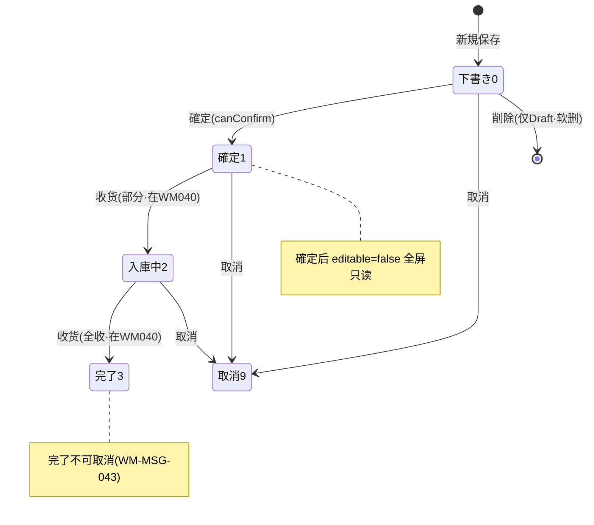

# 入庫指示 单页面操作 SOP（手把手版）

> **用途**：给**库管员/采购操作、培训老师讲、测试人员拆用例**。比模块总册（`03-库存物流WMS` §5.5）更细。
> **页面**：入庫指示（WM030 · 库存物流 WMS）　**路由**：`/wms/inbound-order`（带 `?no=` 取得既存单）　**前端**：`views/wms/InboundOrderView.vue`　**API**：`api/wms/inboundOrder.ts inboundOrderApi`　**后端**：`Wms/InboundOrderController` → `Services/Wms/InboundService`
> **基准**：分支 `feat/wfs-inbox-core`，2026-06-29；后端实测 `docs/codemap-wms/02-入庫.md`（2026-06-22 权威），UI 经实读 view。
> **样例数据**：入庫指示 `IN2026070001`、タイプ `1購買`、仕入先 `SUP01`、倉庫 `W01`、入荷予定日 今天、製品 `PRD2026070001`、予定数量 5000、予定棚 `RECV`、PO `PO2026070001`。

---

## 1. 页面一句话说明

**入庫指示，就是录入/编辑一张「入庫予定单」（头 + 明细）的地方——它只管单据自己的生命周期 `0下書き→1確定→9取消`，整个过程不触达任何库存（计划是计划）。** 真正把货收进来、让库存数字增加，是下一屏「入庫実績」（WM040）的事；本页保存得再多，库存一动不动。一句话：**这里写的是"打算收什么、收多少、收到哪"，不是"已经收到了"。**

---

## 2. 这个页面在业务流程中的位置

- **上游**：计划 / 采购 PO（PO No 可手填关联）；采购 GR 委托入庫会在后台自动建一张本单（`WmsReceiveServiceAdapter`，落 `RECV` 暂存位）。
- **本页**：录入/编辑/確定/取消/削除入庫予定单。**只管单据，不动库存。**
- **下游**：入庫実績（WM040）参照本单收货 → 真增库存。本页「入庫実績登録」按钮**只是导航过去**，不写库存。

---

## 3. 谁使用这个页面

| 角色 | 用途 |
|---|---|
| 库管员 | 录入/编辑入庫予定、確定、取消、删除草稿 |
| 采购 | 关联 PO、登记预计到货（PO No 手填） |

> 注：采购 GR 收货走后台委托（`WmsReceiveServiceAdapter` 自动建予定→確定→收货），无需在本屏手操。

---

## 4. 操作前准备

- [ ] 入庫倉庫（如 `W01`）已在仓库主数据建立。
- [ ] 明确品番（如 `PRD2026070001`）、予定数量（如 5000）、予定棚（如 `RECV`）。
- [ ] 若关联采购：备好 PO No（如 `PO2026070001`，**手填，非下拉选择**）。
- [ ] 清楚要建新单（新規）还是改既存单（列表「開く」带 `?no=` 进来）；**改既存单前先看状态——非下書き(0)即全屏只读**。

---

## 5. 页面区域说明

| 区域 | 内容 |
|---|---|
| 头卡（header-card） | 标题（新規 / `編集 [IN…]`）+ 状态 tag；7 个头字段：タイプ / 入庫倉庫 / 入荷予定日 / 仕入先CD / 仕入先名 / PO No / 備考 |
| 明细卡 | 9 列表格：行No / 製品CD / 製品名 / Lot / 予定数量 / **入庫済(累計·只读)** / 単位 / 予定棚 / 単価 / 操作（删行）；`editable` 时表头显「明細追加」 |
| 底部固定操作条（el-affix bottom） | 戻る / 保存 / 確定 / 取消 / 削除 / 入庫実績登録（按 `editable`/状态条件显隐） |

> 全屏可编辑性由 `editable = (status === 0)` 一个开关控制：**下書き(0) 全可编辑；確定(1)/入庫中(2)/完了(3)/取消(9) 全部只读**（头字段、明细行、明細追加/删行按钮一起锁死）。

---

## 6. 字段填写说明（口语版）

> 编辑性：所有输入控件 `:disabled="!editable"`，即仅 `status===0` 下書き可填。

**头字段**：

| 字段 | 控件 | 必填 | 怎么填 | 填错影响 |
|---|---|---|---|---|
| タイプ(inboundType) | 下拉 | **视觉星号** | 1購買 / 2外注戻 / 3返品 / 9その他（默认 1） | **onSave 不校验**，靠后端 |
| 入庫倉庫(warehouseCd) | 输入(≤10) | **视觉星号** | 仓库代码，如 `W01` | onSave 未强制，**空仓库也能提交**（盲点，见 §11） |
| 入荷予定日(expectedArrivalDate) | 日期(默认今天) | **视觉星号** | 预计到货日 | 同上未强制 |
| 仕入先CD(supplierCd) | 输入(≤20) | 否 | 供应商代码，如 `SUP01` | — |
| 仕入先名(supplierName) | 输入(≤100) | 否 | 供应商名 | — |
| PO No(poNo) | 输入(≤20) | 否 | **手填**关联采购单，如 `PO2026070001`（非下拉） | — |
| 備考(remarks) | 文本域 | 否 | 备注 | — |

**明细字段**（点「明細追加」加行）：

| 字段 | 控件 | 必填 | 怎么填 | 填错影响 |
|---|---|---|---|---|
| 製品CD(productCd) | 输入(≤20) | 实务必填 | 产品代码，如 `PRD2026070001` | 仅校验「明细行数>0」，单行空内容不前端拦 |
| 製品名(productName) | 输入(≤100) | 否 | 产品名 | — |
| Lot(lotNo) | 输入 | 否 | 批次（提示文 lotHint），可空 | — |
| 予定数量(expectedQty) | 数字(≥0,2位小数) | 实务必填 | 预计到货数，如 5000 | 后端 ≤0 → `WM-MSG-021`；是收货差额算法的基数 |
| **入庫済(累計)(receivedQty)** | **只读**（formatQty 展示） | — | **系统回填**已收量，本页不可改 | — |
| 単位(unitCd) | 输入(≤10) | 否 | 単位代码 | 带入收货行 |
| 予定棚(expectedLocationCd) | 输入(≤30) | 否 | 预定货位，如 `RECV`，**收货时带入** | — |
| 単価(unitPrice) | 数字(≥0,4位小数) | 否 | 単価 | 带入收货行 |

---

## 7. 按钮操作说明

| 按钮 | 显示/启用条件（computed） | 点了会怎样 |
|---|---|---|
| 明細追加 / 行删除 | `editable`（status===0） | 增删明细行（前端临时，保存才落库） |
| 戻る | 常显 | 返回入庫指示一览（`/wms/inbound-order-list`） |
| 保存(save) | `editable` | 新規→`create`、既存→`update`；**空明细→warning（`noDetail`）不发请求**；成功 toast，后端码 `WM-MSG-071` |
| 確定(confirm) | `canConfirm = !isNew && status===0` | 弹确认框→`confirm` API：0→1；后端须 `Draft`、明细 0→`WM-MSG-020` |
| 取消(cancel) | `canCancel = !isNew && status≠9 && status≠3` | 弹确认框→`cancel` API：→9；后端 `Completed(3)` 不可取消 |
| 削除(delete) | `canDelete = !isNew && status===0` | 弹确认框→`delete` API：**逻辑删**（仅 Draft 可删），删后回列表 |
| 入庫実績登録(receive) | `canReceive = !isNew && (status===1 ‖ 2)` | **仅导航**去 `/wms/inbound-receipt?inboundNo=`，**本页不写库存** |

> **关键**：①新建未保存（`isNew`）时只有「保存」「戻る」「明細追加」；②下書き(0) 既存单：保存/確定/取消/削除 都在，但**没有**入庫実績登録；③確定(1)/入庫中(2)：全屏只读，没有保存/確定/削除，只剩 取消(2 也可) + 入庫実績登録；④完了(3)/取消(9)：只剩 戻る。

---

## 8. 标准业务操作 SOP（照着点）

### 场景一：新規录入并保存（主流程·建草稿）
- **背景**：手工建一张入庫予定单。
- **样例数据**：タイプ `1購買`、倉庫 `W01`、仕入先 `SUP01`、PO `PO2026070001`、明细 製品 `PRD2026070001` / 予定数量 5000 / 予定棚 `RECV`。
- **前置**：仓库已建。
- **步骤**：1) 一览「新規」进本页（无 `?no=`，标题=新規、状态=下書き）；2) 填头（タイプ/倉庫/予定日/仕入先/PO）；3) 点「明細追加」加行→填製品CD/予定数量/予定棚/単位/単価；4) 点「保存」。
- **完成后检查**：成功 toast；地址栏变为 `?no=IN2026070001`，标题变 `編集 [IN2026070001]`，状态仍下書き(0)；**库存无任何变化**。
- **异常**：明细 0 行→warning（`noDetail`）不发请求。
- **用例**：TC-M06-INORDER-001~004、010。

### 场景二：確定（0→1，进入只读）
- **背景**：草稿核对无误，正式生效。
- **步骤**：既存下書き单（`?no=IN2026070001`）→点「確定」→确认框「确定」。
- **完成后检查**：状态 tag 0下書き→1確定；**全屏变只读**（头/明细/明細追加全锁）；操作条出现「入庫実績登録」，消失「保存/確定/削除」；列表状态同步。
- **异常**：明细 0 件確定→`WM-MSG-020`；非 Draft 再確定→`WM-MSG-043`。
- **用例**：TC-M06-INORDER-005、006、015。

### 场景三：编辑既存草稿（明细全删全插·保留累计）
- **背景**：草稿要改头/明细。
- **步骤**：列表「開く」带 `?no=` 进来（须 status=0）→改头字段或增删/改明细行→「保存」。
- **完成后检查**：保存成功；后端 `UpdateOrderAsync` 走**明细全删全插**（`RemoveRange` 后重建），但**既往 `ReceivedQty(入庫済累计)` 不会丢**（系统按行回填）。
- **异常**：状态非 `Draft‖Confirmed`→`UpdateOrderAsync` 抛 `WM-MSG-043`（但前端只读已先一步拦住编辑）。
- **用例**：TC-M06-INORDER-011、012、016。

### 场景四：取消入庫予定（→9）
- **背景**：这批不收了。
- **步骤**：既存单（下書き/確定/入庫中均可，即 status≠3 且 ≠9）→点「取消」→确认框「确定」。
- **完成后检查**：状态→9取消；操作条只剩「戻る」；列表状态同步。
- **异常**：`Completed(3)` 不可取消（按钮不显示；强发也被 `WM-MSG-043` 拦）。
- **用例**：TC-M06-INORDER-007、008、017。

### 场景五：削除草稿（逻辑删）
- **背景**：建错了的草稿要删掉。
- **步骤**：下書き(0) 既存单→点「削除」→确认框「确定」。
- **完成后检查**：软删（IsDeleted=true），跳回一览，列表查不到；**仅 Draft 可删**（确定后无削除按钮）。
- **异常**：非 Draft 删→`WM-MSG-043`（且按钮本就不显示）。
- **用例**：TC-M06-INORDER-009、018。

### 场景六：確定后去登记入庫実績（仅导航）
- **背景**：货到了，要真收货。
- **步骤**：確定(1) 或入庫中(2) 单→点「入庫実績登録」。
- **完成后检查**：跳到 `/wms/inbound-receipt?inboundNo=IN2026070001`（参照模式）；**本页没写任何库存**，真增库存在收货页「入庫確定」时发生（见 03-06 SOP）。
- **用例**：TC-M06-INORDER-013、014。

### 场景七：校验与状态守卫拦截
- **背景**：触发各类后端校验。
- **步骤**：①空明细保存→warning；②空明细確定→`WM-MSG-020`；③予定数量填 0/负→`WM-MSG-021`；④对不存在单号操作→`WM-MSG-070`；⑤对非法状态确定/更新→`WM-MSG-043`。
- **检查**：均不改单据；前端 toast / 后端 400。
- **用例**：TC-M06-INORDER-019~024。

### 场景八：盲点——空仓库也能提交
- **背景**：头字段「倉庫」只有视觉星号，onSave 只校验「明细行数>0」。
- **步骤**：清空入庫倉庫（保留至少 1 行明细）→「保存」。
- **检查**：**前端放行**（不拦），单据落库时倉庫为空；靠后端兜底。**这是已知盲点，培训务必强调手工确认必填头字段。**
- **用例**：TC-M06-INORDER-025。

---

## 9. 状态变化说明

- **editable 唯一开关**：`status===0` 才可编辑；1/2/3/9 全只读。
- 2入庫中、3完了 由**入庫実績(WM040)收货**驱动，本页不产生这两个迁移；本页只产生 0→1（確定）、→9（取消）、软删。

---

## 10. 按钮不可用 / 灰色（不显示）原因

| 现象 | 原因 |
|---|---|
| 看不到「保存 / 確定 / 削除 / 明細追加 / 行删除」 | 非下書き(0)，`editable=false`（确定后全只读） |
| 看不到「確定」 | `isNew`（未保存）或 status≠0 |
| 看不到「取消」 | status===9（已取消）或 ===3（完了，`Completed` 不可取消） |
| 看不到「削除」 | `isNew` 或 status≠0（仅 Draft 可删） |
| 看不到「入庫実績登録」 | `isNew` 或 status 非 1/2（须確定済或入庫中才能去收货） |
| 头字段/明细全部灰 | 单据已確定/入庫中/完了/取消，全屏只读 |
| 入庫済(累計) 列改不了 | 该列只读，系统按收货回填 |

---

## 11. 常见错误与处理

| 错误 / 现象 | 原因 | 处理 |
|---|---|---|
| 保存点了没反应、提示 noDetail | 明细 0 行 | 先「明細追加」加至少 1 行 |
| `WM-MSG-020`（明细0件） | 確定时明细为空 | 加明细再確定 |
| `WM-MSG-021`（予定数量≤0） | 明细予定数量填 0/负 | 改为正数 |
| `WM-MSG-043`（状态守卫） | 更新须 `Draft‖Confirmed`；確定须 `Draft`；`Completed` 不可取消 | 核对单据状态，按生命周期操作 |
| `WM-MSG-070`（入庫予定不存在） | 单号错 / 已被删 | 核对 `?no=` 单号 |
| 确定后想改字段，改不了 | `editable=status===0`，确定即全只读 | 如需改，须先在 Draft 阶段改；确定后只能取消重建 |
| 空仓库竟然能保存 | onSave 只校验明细行数>0，头必填仅视觉星号 | **人工确认头字段**（盲点，见 §8 场景八） |
| 删不掉确定后的单 | 仅 Draft 可删 | 改用「取消」（→9） |

---

## 12. 操作完成后的检查清单

- [ ] 新規保存：地址栏出现 `?no=IN…`、标题变「編集 [IN…]」、状态=下書き(0)；**库存零变化**。
- [ ] 確定：状态 tag→1確定；**全屏只读**；操作条出现「入庫実績登録」。
- [ ] 编辑保存：明细全删全插后**既往入庫済(累计)未丢**。
- [ ] 取消：状态→9；只剩「戻る」。
- [ ] 削除：列表查不到（软删）；仅 Draft 能删。
- [ ] 全过程**未触达库存**——真增库存须到入庫実績(WM040)「入庫確定」。

---

## 13. 页面级测试用例（≥25 条，可执行）

> 编号 `TC-M06-INORDER-xxx`；数据用样例（IN2026070001 / SUP01 / W01 / PRD2026070001 / 予定 5000 / 棚 RECV / PO PO2026070001）。

| 用例编号 | 用例名称 | 优先级 | 前置条件 | 测试数据 | 操作步骤 | 预期结果 | 下游检查 | 备注 |
|---|---|---|---|---|---|---|---|---|
| TC-M06-INORDER-001 | 新規页面初始态 | P1 | 一览「新規」 | — | 进 `/wms/inbound-order`（无 no） | 标题=新規、状态=下書き、タイプ默认1、予定日默认今天 | — | — |
| TC-M06-INORDER-002 | 明細追加 | P0 | 新規页 | — | 点「明細追加」 | 新增 1 行，行No=1，受影响列可编辑 | — | — |
| TC-M06-INORDER-003 | 明細行删除 | P1 | 已加2行 | — | 第2行「削除」 | 行删除、行No 重排 | — | — |
| TC-M06-INORDER-004 | 录入并保存(新規) | P0 | 新規+1明细 | W01/PRD2026070001/5000/RECV | 填头+明细→保存 | 成功 toast、URL 加 `?no=`、状态下書き | 库存不变 | 核心 |
| TC-M06-INORDER-005 | 確定(0→1) | P0 | 既存下書き单 | IN2026070001 | 確定→确认 | 状态→1確定、全屏只读 | 列表状态同步 | 核心 |
| TC-M06-INORDER-006 | 確定后操作条变化 | P1 | 確定后 | — | 看操作条 | 出现入庫実績登録、消失保存/確定/削除 | — | — |
| TC-M06-INORDER-007 | 取消(→9) | P0 | 下書き/確定单 | IN2026070001 | 取消→确认 | 状态→9取消、只剩戻る | 列表同步 | — |
| TC-M06-INORDER-008 | 完了单不可取消 | P1 | status=3 | — | 看操作条 | 无「取消」按钮 | — | WM-MSG-043 |
| TC-M06-INORDER-009 | 削除草稿(软删) | P0 | 下書き单 | IN2026070001 | 削除→确认 | 跳回列表、查不到 | IsDeleted=true | 仅Draft |
| TC-M06-INORDER-010 | 空明细保存被拦 | P0 | 新規无明细 | — | 保存 | warning(noDetail)、不发请求 | 不落库 | — |
| TC-M06-INORDER-011 | 编辑既存草稿头字段 | P1 | 下書き单 | 改仕入先名 | 改→保存 | 保存成功、头更新 | — | — |
| TC-M06-INORDER-012 | 明细全删全插保留累计 | P0 | 单有 ReceivedQty | 改明细 | 改明细→保存 | 既往入庫済(累计)未丢 | ReceivedQty 保留 | 一致性 |
| TC-M06-INORDER-013 | 確定单去登记实绩 | P0 | status=1 | IN2026070001 | 点入庫実績登録 | 跳 `/wms/inbound-receipt?inboundNo=` | 本页未写库存 | 仅导航 |
| TC-M06-INORDER-014 | 入庫中单可去实绩 | P1 | status=2 | — | 看按钮→点 | 入庫実績登録 可用、跳收货页 | — | canReceive 1‖2 |
| TC-M06-INORDER-015 | 空明细確定被拦 | P0 | 既存单明细0 | — | 確定 | WM-MSG-020 | 不改状态 | — |
| TC-M06-INORDER-016 | 非法状态更新被拦 | P1 | status=2 直发PUT | — | update | WM-MSG-043 | 前端只读已先拦 | 状态守卫 |
| TC-M06-INORDER-017 | 完了单确定/取消守卫 | P1 | status=3 | — | 强发 cancel | WM-MSG-043 | 不变 | — |
| TC-M06-INORDER-018 | 非Draft删除被拦 | P2 | status=1 | — | 强发 delete | WM-MSG-043 | 不删 | 仅Draft可删 |
| TC-M06-INORDER-019 | 予定数量≤0 | P0 | 新規/编辑 | 予定数量 0 | 保存/確定 | WM-MSG-021 | 不落库 | — |
| TC-M06-INORDER-020 | 单号不存在 | P2 | — | 错单号 | 直接调 confirm/cancel | WM-MSG-070 | — | — |
| TC-M06-INORDER-021 | 確定全屏只读 | P0 | status=1 | — | 试改头/明细 | 控件全 disabled | — | editable=false |
| TC-M06-INORDER-022 | 入庫済列只读 | P1 | 有累计 | — | 试改该列 | 不可编辑(展示值) | — | — |
| TC-M06-INORDER-023 | PO No 手填关联 | P2 | 新規 | PO2026070001 | 填 PO No | 文本输入(非下拉)、保存带回 | — | — |
| TC-M06-INORDER-024 | タイプ下拉四值 | P2 | 新規 | — | 展开タイプ | 1購買/2外注戻/3返品/9その他 | — | — |
| TC-M06-INORDER-025 | 盲点·空仓库可提交 | P1 | 新規+1明细 | 倉庫留空 | 保存 | 前端放行(不拦)、靠后端兜底 | — | 已知盲点 |
| TC-M06-INORDER-026 | 状态 tag 颜色映射 | P3 | 各状态单 | — | 看 tag | 0info/1primary/2warning/3success/9danger | — | — |
| TC-M06-INORDER-027 | 取消确认框可放弃 | P2 | 任意可取消单 | — | 取消→点「取消(放弃)」 | 不变状态 | — | ElMessageBox |
| TC-M06-INORDER-028 | 戻る返回一览 | P3 | 任意 | — | 戻る | 跳 `/wms/inbound-order-list` | — | — |
| TC-M06-INORDER-029 | 权限不足 | P2 | 无权账号 | — | 进页面/操作 | 待业务确认(隐藏/拒绝) | — | 权限 |
| TC-M06-INORDER-030 | 网络异常 | P2 | 断网 | — | 保存/確定 | 友好错误可重试 | — | — |

---

## 14. 培训讲解建议

| 顺序 | 讲什么 | 演示 | 易误解点 |
|---|---|---|---|
| 1 | 这页是"计划/预定"，不动库存 | §2 流程图 | 以为保存就收货了 |
| 2 | 生命周期 0→1→9 + 入庫中/完了 | §9 状态图 | 2/3 由收货页驱动，不在本页 |
| 3 | `editable=status===0` 一个开关 | 確定前后对比 | 确定后还想改字段 |
| 4 | 五个动作按钮的条件 | 各状态看操作条 | 完了不可取消、仅 Draft 可删 |
| 5 | 入庫実績登録只是导航 | 点按钮看跳转 | 以为这按钮就把货收了 |
| 6 | 必填仅视觉星号 = 盲点 | 演示空仓库提交 | 以为前端会拦 |
| 7 | 明细全删全插但累计不丢 | 改明细再看入庫済 | 担心改明细丢已收量 |

---

## 15. 与模块级手册的关系

对应 `03-库存物流WMS-最详细用户操作培训手册.md` §5.5（5.5.1~5.5.14）。本页是单据生命周期屏（不触库存），其下游真增库存屏见 §5.6 / `wms-pages/03-06-入庫実績-单页面操作SOP.md`。

---

## 16. 代码与文档来源

| 层 | 文件 |
|---|---|
| 逐行源码手册 | `docs/codemap-wms/02-入庫.md`（权威，2026-06-22） |
| 前端 view | `cp6.web/src/views/wms/InboundOrderView.vue`（`editable=status===0`、5 动作 computed） |
| 前端列表 | `cp6.web/src/views/wms/InboundOrderListView.vue` |
| API/类型 | `api/wms/inboundOrder.ts`（create/update/delete/confirm/cancel/get/search）、`types/wms/wms.ts`（`InboundOrder`/`InboundOrderDetail`） |
| 后端 Controller | `Controllers/Wms/InboundOrderController.cs`（成功 `WM-MSG-071`，`InvalidOperationException→400`） |
| 后端 Service | `Services/Wms/InboundService.cs`（`CreateOrderAsync`/`UpdateOrderAsync` 明细全删全插/`ConfirmOrderAsync`/`CancelOrderAsync`/`DeleteOrderAsync`/`ValidateOrder`） |
| 实体 | `DomainModels/Wms/InboundOrder.cs`（`T_InboundOrder`，PK `InboundNo`，状态 0/1/2/3/9，含 `PoNo`） |
| 错误码 | `WM-MSG-070`(不存在)/`WM-MSG-043`(状态守卫)/`WM-MSG-020`(明细0件)/`WM-MSG-021`(予定数量≤0) |

---

## 最后更新来源

- 代码：见 §16（codemap-wms 02 + `InboundOrderView.vue` 实读 + `inboundOrder.ts`/`wms.ts` 类型）。
- 基准：分支 `feat/wfs-inbox-core`，2026-06-29（codemap 2026-06-22）。
- 覆盖：16 节 / 8 场景 / 30 用例（TC-M06-INORDER-001~030）。
