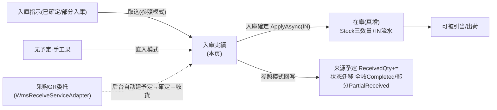
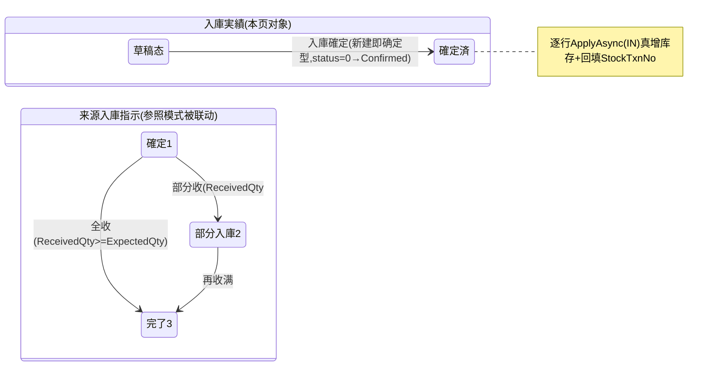

# 入庫実績 单页面操作 SOP（手把手版）

> **用途**：给**现场收货员/库管员操作、培训老师讲、测试人员拆用例**。比模块总册（`03-库存物流WMS` §5.6，含 5.6.1a~1e）更细。
> **页面**：入庫実績（WM040 · 库存物流 WMS）　**路由**：`/wms/inbound-receipt`（带 `?inboundNo=` 进参照模式）　**前端**：`views/wms/InboundReceiptView.vue`　**API**：`api/wms/inboundReceipt.ts inboundReceiptApi.confirm`　**后端**：`Wms/InboundReceiptController.Confirm` → `InboundService.ConfirmReceiptAsync`
> **基准**：分支 `feat/wfs-inbox-core`，2026-06-29；后端实测 `docs/codemap-wms/02-入庫.md`（2026-06-22 权威），UI 经实读 view。
> **样例数据**：入庫指示 `IN2026070001`、入庫実績 `RC2026070001`、製品 `PRD2026070001`、倉庫 `W01`、库位 `RECV`、LotNo `LOT2026070001`、供应商 `SUP01`、単価 `¥120`。

---

## 1. 页面一句话说明

**入庫実績，就是把"真的收到了货"登记进系统的地方——一点「入庫確定」，系统就把每一行明细逐条经 `IStockMovementService.ApplyAsync(IN)` 真增库存（单事务更新 Stock 三数量 + 追加一条不可改的 `T_StockTransaction` 流水），并回填 `StockTxnNo` 追溯。** 它是**整个 WMS 真正增加库存的唯一入口屏**——实绩收货 / 完成品入庫 / 采购 GR 委托，最终都汇聚到这一条 `ConfirmReceiptAsync` 路径，没有任何旁路直接写库存。

---

## 2. 这个页面在业务流程中的位置

- **上游**：已**確定(1)**或**部分入庫(2)**的入庫指示（参照模式取込）；或无予定直接手工录（直入模式）；或采购 GR 委托链后台代办。
- **本页**：登记实收并**当场确定+反映库存**。
- **下游**：在庫真增（可被引当出货）；参照模式回写来源予定 `ReceivedQty` 并迁移其状态。

---

## 3. 谁使用这个页面

| 角色 | 用途 |
|---|---|
| 收货员 | 到货后按予定取込核对、登记实收数 |
| 库管员 | 直入收货（无予定）、指定上架库位、批次、单价 |
| 系统（后台） | 采购 GR 收货经 `WmsReceiveServiceAdapter` 自动走同一 `ConfirmReceiptAsync`（不经本屏手操） |

---

## 4. 操作前准备

- [ ] **库存铁律先明白**：本页「入庫確定」=唯一真增库存动作，进单事务（更新 Stock 三数量 + 追加 `T_StockTransaction`），一旦确定即落库存，不可在本页撤销。
- [ ] **参照模式**：来源入庫指示状态须 `Confirmed(1)‖PartialReceived(2)`，否则「取込」被拒（`WM-MSG-043`）；下書き(0)/取消(9)/已完了(3)取不到。
- [ ] **上架库位**（locationCd，如 `RECV`）已在库位主数据存在；批次（LotNo，如 `LOT2026070001`）策略明确（无批次填空字符串）。
- [ ] **入庫数**清楚：参照模式系统按"予定数−已收数"差额自动回填，可改；直入模式逐行手填。
- [ ] **本页无列表/查询入口**——只能从入庫指示一覧/详情的「受入」按钮导航过来，或直接拼 URL `?inboundNo=` 进入。

---

## 5. 页面区域说明

| 区域 | 内容 |
|---|---|
| 头部卡（el-card） | 标题随模式变「入庫実績（直接入庫 / 予定参照）」；7 头字段：参照入庫指示No（带「取込」append 按钮，有值即锁死）/ 入庫区分 sourceType / **入庫倉庫(required)** / 入庫日時 / 担当者CD / 製造指図No / 備考 |
| 明细卡（el-card + el-table） | 「明細追加」常显；10 列：行号 / 参照行No(refOrderLineNo，直入显「—」) / 製品CD / 製品名 / ロット / 入庫数 / 単位 / 棚番(locationCd) / 単価 / 賞味期限 / 行削除 |
| 底部固定条（el-affix bottom） | 戻る（返回上一页）/ **入庫確定**（loading 态 saving） |

> 模式由 `form.inboundNo` 是否有值决定：有=参照(order)、空=直入(direct)；标题文案据此切换。

---

## 6. 字段填写说明（口语版）

**头部字段**：

| 字段 | 谁提供 | 怎么填 | 填错影响 |
|---|---|---|---|
| 参照入庫指示No(inboundNo) | 库管 | 填予定单号点「取込」；留空=直入；**已有值即只读锁死** | 取过号不可改 |
| 入庫区分(sourceType) | 系统/库管 | PURCHASE/PRODUCTION/RMA/MANUAL；**取込会强制改 PURCHASE**（覆盖手选） | 参照模式下手选失效 |
| 入庫倉庫(warehouseCd) | 库管 | 仓库代码，如 `W01`；**required 必填** | 空→`onConfirm` warning 中断，后端 `WM-MSG-031` |
| 入庫日時(receiveDateTime) | 系统 | 默认当前时刻，可改 | 作为 `ReceiveDate` 落流水 |
| 担当者CD(operatorCd) | 库管 | 收货人代码 | 空时后端用登录用户名兜底 |
| 製造指図No(workOrderNo) | 库管 | 完成品入庫时可填指図号关联 | — |

**明细字段**（每行）：

| 字段 | 哪种模式 | 怎么填 | 填错影响 |
|---|---|---|---|
| 参照行No(refOrderLineNo，只读) | 参照模式自动 | 取込时回填来源予定行号；直入显「—」 | 关联予定累计回写靠它命中 |
| 製品CD(productCd) | 全部 | 必填，如 `PRD2026070001` | 空→warning 中断，后端 `WM-MSG-031` |
| 製品名(productName) | 全部 | 可空（参照自动带） | — |
| ロット(lotNo) | 全部 | 批次，如 `LOT2026070001` | **类型必填但 UI 未校验、可空提交**（盲点） |
| 入庫数(receivedQty) | 全部 | **必填且 >0**；参照按"予定−已收"差额回填 | ≤0→warning 中断，后端 `WM-MSG-031`；IN 要求正数 `WM-MSG-021` |
| 単位(unitCd) | 全部 | 单位代码 | — |
| 棚番(locationCd) | 全部 | **必填**，上架库位如 `RECV` | 空→warning 中断，后端 `WM-MSG-031` |
| 単価(unitPrice) | 全部 | 入库单价，如 `¥120`，精度 4 位 | 落库存/流水成本 |
| 賞味期限(expiryDate) | 全部 | FEFO 引当用日期 | — |

---

## 7. 按钮操作说明

| 按钮 | 何时出现/启用 | 点了会怎样 |
|---|---|---|
| 取込（refNo append） | `form.inboundNo` 有值时可点（空则灰） | `loadOrder()`：拉来源予定，状态须 1‖2（否则 `WM-MSG-043` warning），逐行**只取未收满行**（予定−已收>0），按差额回填 receivedQty、带 refOrderLineNo、**强制 sourceType=PURCHASE**；不触库存 |
| 明細追加 | 常显 | 表尾增一空行（productCd/lotNo/locationCd 空、receivedQty=0） |
| 行削除 | 每行 | 删该行并重排行号 |
| 戻る | 常显 | `router.back()` 返回上一页（不保存） |
| **入庫確定** | 常显（loading 时禁用） | 前端校验通过→`confirm(form)`→后端 `ConfirmReceiptAsync`→逐行 `ApplyAsync(IN)` **真增库存**+回填 `StockTxnNo`→成功 toast `WM-MSG-071`(含 `RC…`)→跳回入庫指示一覧 |

> **本屏没有"改/删已确定实绩"的按钮**——确定即落库存，修正只能走盘点调整等其他屏。

---

## 8. 标准业务操作 SOP（照着点）

### 场景一：参照予定收货（主流程）
- **背景**：到货后对照入庫指示核对、整单收货。
- **样例数据**：入庫指示 `IN2026070001`（状态 Confirmed=1，明细 製品 `PRD2026070001` 予定 100、已收 0）、倉庫 `W01`、库位 `RECV`、LotNo `LOT2026070001`、単価 `¥120`。
- **前置**：来源予定状态 `Confirmed(1)‖PartialReceived(2)`；从入庫指示详情/一覧点「受入」进入（URL 带 `?inboundNo=IN2026070001`），onMounted 自动取込。
- **步骤**：1) 进页面（自动 `loadOrder`）→表格已按差额（100−0=100）回填明细、sourceType 被设为 PURCHASE、参照No 框锁死；2) 核对/补 LotNo `LOT2026070001`、确认库位 `RECV`、単価 `¥120`；3) 点「入庫確定」。
- **完成后检查**：toast `WM-MSG-071` 含 `RC2026070001`；跳回入庫指示一覧；去在庫照会（§5.3）查 `PRD2026070001@W01/RECV/LOT2026070001` → `PhysicalQty += 100`、行「履歴」见一条 `IN` 流水（`RelatedType=INBOUND`，`StockTxnNo` 回填到实绩明细）；来源予定 `ReceivedQty += 100`、状态自动迁移→**全收 `Completed(3)`**。
- **异常**：参照状态非 1/2→取込 `WM-MSG-043`；予定不存在→`WM-MSG-070`；仓库/行字段缺/数量≤0→`WM-MSG-031`。
- **可拆用例**：TC-M06-RECEIPT-001、002、003、010、011、012。

### 场景二：直入收货（无予定）
- **背景**：没有事先建入庫指示，临时收货直接录。
- **样例数据**：留空参照No；手工行：製品 `PRD2026070001`、库位 `RECV`、LotNo `LOT2026070001`、入庫数 50、倉庫 `W01`、単価 `¥120`。
- **前置**：直接 `/wms/inbound-receipt`（无 `?inboundNo=`）；sourceType 可手选（默认 PURCHASE）。
- **步骤**：1) 头部填倉庫 `W01`、按需选 sourceType；2) 点「明細追加」逐行填 製品/ロット/入庫数/棚番/単価；3) 点「入庫確定」。
- **完成后检查**：生成 `RC…`、`WM-MSG-071`；在庫照会查到 `PhysicalQty += 50` + 一条 `IN` 流水；**直入模式无来源予定，不回写 ReceivedQty**（refOrderLineNo 空）。
- **异常**：明细 0 件→`WM-MSG-031`/前端 `noDetail` warning；行字段缺→warning 中断不发请求。
- **可拆用例**：TC-M06-RECEIPT-004、013、014。

### 场景三：部分收货 → 予定状态迁移
- **背景**：货分批到，先收一部分。
- **样例数据**：`IN2026070001` 予定 100、已收 0；本次只收 60。
- **前置**：参照模式取込（差额回填 100）。
- **步骤**：1) 取込后把某行 `入庫数` 由 100 改为 60；2) 「入庫確定」。
- **完成后检查**：在庫 `+60`；来源予定 `ReceivedQty=60`、状态自动迁移→**部分入庫 `PartialReceived(2)`**；可再次「受入」收剩余 40（再取込差额回填 40），收满后→`Completed(3)`。
- **异常**：**超收（本次实收>差额）前端不拦**，靠后端逻辑——会照实增库存、予定可能出现 ReceivedQty>ExpectedQty（盲点，需业务侧约束）。
- **可拆用例**：TC-M06-RECEIPT-015、016、017。

### 场景四：收货校验拦截（前端 onConfirm）
- **背景**：点确定前漏填字段，被前端 warning 中断、**不发请求**。
- **样例数据**：仓库空 / 行缺库位 / 数量≤0 / 明细 0 件 任一。
- **前置**：在确定前故意留空。
- **步骤**：1) 制造一处缺失（如清空 warehouseCd 或某行 locationCd）；2) 点「入庫確定」。
- **完成后检查**：弹 warning（明细0→`noDetail`；仓库空→`required`；行字段缺/数量≤0→`requireAll`），**不调用 `confirm`、库存不变**；后端若被绕过同样 `ValidateReceipt`→`WM-MSG-031` 兜底。
- **异常**：—（本场景就是验证拦截本身）。
- **可拆用例**：TC-M06-RECEIPT-005、006、007、008。

### 场景五：采购 GR 委托入庫（后台自动链）
- **背景**：采购收货时不走本屏手操，由系统经 `WmsReceiveServiceAdapter` 代办，与本页同走 `ConfirmReceiptAsync`。
- **样例数据**：采购订单含供应商 `SUP01`、製品 `PRD2026070001`、数量 100；落收货暂存位 `RECV`。
- **前置**：采购侧执行 GR（`GoodsReceiptService` 调 `_wmsReceive.ReceiveAsync`）。
- **步骤（系统自动，无人工）**：1) 适配器建入庫予定（写 `PoNo` 钩子、InboundType=1 购买、供应商 `SUP01`）；2) 確定予定（Draft→Confirmed）；3) `ConfirmReceiptAsync`（sourceType=PURCHASE、库位 `RECV`、LotNo 空）真增库存。
- **完成后检查**：库存在 `RECV` 暂存位真增；采购回写 `GoodsReceipt.WmsInboundNo` + PO 三累计锚；后续按 InboundNo 查 QcInspection 检收。
- **异常**：链路任一步抛 `InvalidOperationException`→采购侧感知（IntegrationEvent 三态）。
- **可拆用例**：TC-M06-RECEIPT-018、019。

### 场景六：LotNo 漏填仍可提交（盲点验证）
- **背景**：UI 未把 LotNo 纳入必填校验，可空提交，后端按空 lot 建库存键。
- **样例数据**：行 製品 `PRD2026070001`、库位 `RECV`、入庫数 30、**LotNo 留空**。
- **前置**：直入或参照模式均可。
- **步骤**：1) 填齐其余必填、LotNo 不填；2) 「入庫確定」。
- **完成后检查**：确定**成功**（不被前端拦）；在庫照会该业务键 LotNo 为空字符串（`d.LotNo ?? ""`）；提示培训学员据批次管理策略人工把关。
- **异常**：—（本场景验证现状盲点）。
- **可拆用例**：TC-M06-RECEIPT-020。

---

## 9. 状态变化说明

- **实绩本身**：新建即确定型——提交即 `Confirmed`，没有可编辑的中间态。
- **来源予定**：仅参照模式联动；全收→`Completed(3)`、部分→`PartialReceived(2)`（`InboundService.cs:391-410`）。

---

## 10. 按钮不可用 / 灰色原因

| 现象 | 原因 |
|---|---|
| 「取込」灰 | `!form.inboundNo`（参照No 框为空，无予定号不可取） |
| 参照入庫指示No 框只读 | 已有值（`!!form.inboundNo`）——取过号即锁死不可改 |
| 点「入庫確定」无反应/被 warning 中断 | 前端校验不过：明细 0 件 / 仓库空 / 某行 製品·棚番空或入庫数≤0 |
| 找不到"改/删已确定实绩"按钮 | 确定即真增库存，本屏无修正入口（现状） |
| 找不到列表/查询入口 | **本页无列表/查询屏**，只能从入庫指示一覧/详情「受入」或 URL `?inboundNo=` 进 |

---

## 11. 常见错误与处理

| 错误 | 原因 | 处理 |
|---|---|---|
| 取込弹 `WM-MSG-043`（无效状态） | 来源予定状态非 `Confirmed(1)‖PartialReceived(2)` | 先到入庫指示确定该单，或确认未取消/未完了 |
| `WM-MSG-070` 予定不存在 | 参照No 填错/已删 | 核对入庫指示号 |
| `WM-MSG-031` | 仓库空 / 明细 0 件 / 行 製品·棚番缺 / 数量≤0 | 按提示补齐再确定 |
| `WM-MSG-021` | IN 数量非正数 | 入庫数填 >0 |
| 取込后 sourceType 自动变 PURCHASE | 设计如此：`loadOrder` **强制覆盖** | 参照模式以采购为准；如需别的区分用直入模式 |
| LotNo 漏填也提交了 | UI 未校验 LotNo（盲点） | 按批次策略人工把关；无批填空 |
| 超收没被拦 | 前端不校验实收≤差额（盲点） | 收货数据复核，靠后端/业务约束 |
| 确定后想撤销 | 本屏无撤销/改删 | 走盘点调整等其他屏修正 |

---

## 12. 操作完成后的检查清单（下游验证）

- [ ] 生成实绩NO（`RC…`，如 `RC2026070001`）、toast `WM-MSG-071`、自动跳回入庫指示一覧。
- [ ] **库存真增**：去在庫照会（§5.3）查 → 该业务键（製品/倉庫/库位/LotNo）`PhysicalQty += 入庫数`；行「履歴」见一条 `IN` 流水（`RelatedType=INBOUND`、`RelatedNo=RC…`），`StockTxnNo` 已回填到实绩明细（可追溯）。
- [ ] **参照模式**：来源入庫指示明细 `ReceivedQty += 入庫数`；予定状态自动迁移（全收→`Completed(3)` / 部分→`PartialReceived(2)`）。
- [ ] **直入模式**：无来源予定联动（refOrderLineNo 空，不回写）。
- [ ] **采购 GR 委托链**：库存落 `RECV` 暂存位、`PoNo` 钩子写入予定、采购侧回写 `WmsInboundNo` + PO 三累计。

---

## 13. 页面级测试用例（≥25 条，可执行）

> 编号 `TC-M06-RECEIPT-xxx`；数据用样例（IN2026070001 / RC2026070001 / PRD2026070001 / W01 / RECV / LOT2026070001 / SUP01 / ¥120）。

| 用例编号 | 用例名称 | 优先级 | 前置条件 | 测试数据 | 操作步骤 | 预期结果 | 下游检查 | 备注 |
|---|---|---|---|---|---|---|---|---|
| TC-M06-RECEIPT-001 | 参照模式自动取込 | P0 | 予定 IN2026070001 状态1 | `?inboundNo=IN2026070001` | 进页面 | 自动 loadOrder、按差额回填明细 | — | onMounted |
| TC-M06-RECEIPT-002 | 取込只取未收满行 | P1 | 予定有已收满行 | 混合行 | 取込 | 仅"予定−已收>0"行入表 | — | 过滤逻辑 |
| TC-M06-RECEIPT-003 | 取込强制 sourceType=PURCHASE | P1 | 手选 RMA 后取込 | RMA→取込 | 点取込 | sourceType 被改回 PURCHASE | — | 盲点 |
| TC-M06-RECEIPT-004 | 直入模式手工录 | P0 | 无予定 | PRD2026070001/RECV/50 | 明細追加→填→确定 | 生成 RC… | 在庫+50 | 直入 |
| TC-M06-RECEIPT-005 | 仓库空拦截 | P0 | 任意 | warehouseCd 空 | 入庫確定 | warning(required)不发请求 | 库存不变 | 前端校验 |
| TC-M06-RECEIPT-006 | 明细0件拦截 | P0 | 无明细 | details=[] | 入庫確定 | warning(noDetail)不发请求 | — | 前端校验 |
| TC-M06-RECEIPT-007 | 行缺库位拦截 | P0 | 有行 | locationCd 空 | 入庫確定 | warning(requireAll)不发请求 | — | 前端校验 |
| TC-M06-RECEIPT-008 | 入庫数≤0拦截 | P0 | 有行 | receivedQty=0 | 入庫確定 | warning(requireAll)不发请求 | — | 前端校验 |
| TC-M06-RECEIPT-009 | 后端校验兜底 | P1 | 绕过前端 | 缺字段 | 直接调 confirm | WM-MSG-031 | 不落库 | ValidateReceipt |
| TC-M06-RECEIPT-010 | 入庫確定真增库存 | P0 | 取込完成 | PRD2026070001/W01/RECV/100 | 入庫確定 | 成功 RC2026070001 | PhysicalQty+=100 | 核心 |
| TC-M06-RECEIPT-011 | 成功提示 WM-MSG-071 含RC号 | P1 | 校验通过 | — | 确定 | toast 含 RC… | — | — |
| TC-M06-RECEIPT-012 | StockTxnNo 回填 | P1 | 确定成功 | — | 查实绩明细 | StockTxnNo 非空 | 流水可追溯 | 不变ログ |
| TC-M06-RECEIPT-013 | 生成 IN 流水 | P0 | 确定成功 | — | 查在庫履歴 | 一条 IN(RelatedType=INBOUND) | — | T_StockTransaction |
| TC-M06-RECEIPT-014 | 单事务原子性 | P1 | 多行 | 多明细 | 确定 | 全部成功或全回滚 | — | 事务 |
| TC-M06-RECEIPT-015 | 部分收货→PartialReceived | P0 | 予定100已收0 | 收60 | 改入庫数60→确定 | 予定→PartialReceived(2) | ReceivedQty=60 | 状态迁移 |
| TC-M06-RECEIPT-016 | 全收→Completed | P0 | 予定100 | 收100 | 确定 | 予定→Completed(3) | ReceivedQty=100 | 状态迁移 |
| TC-M06-RECEIPT-017 | 二次收货取剩余差额 | P1 | 已部分收60 | 再受入 | 取込→确定40 | 差额回填40、收满→Completed | ReceivedQty=100 | — |
| TC-M06-RECEIPT-018 | 采购GR委托建予定+确定 | P1 | 采购GR | SUP01/PRD/100 | 采购收货 | 自动建IN→确定→收货 | 库存落 RECV | 适配器链 |
| TC-M06-RECEIPT-019 | PoNo 钩子写入 | P2 | GR委托 | PoNo | 收货后查予定 | InboundOrder.PoNo 有值 | — | 钩子 |
| TC-M06-RECEIPT-020 | LotNo 漏填可提交 | P1 | 有行 | LotNo 空 | 确定 | 成功(不拦)、空lot键 | 在庫LotNo空 | 盲点 |
| TC-M06-RECEIPT-021 | 参照No框取过即锁死 | P2 | 已取込 | — | 改参照No框 | 只读不可改 | — | UI |
| TC-M06-RECEIPT-022 | 取込状态非1/2被拒 | P1 | 予定状态0/3/9 | 下書き予定 | 取込 | warning WM-MSG-043 | 不入表 | loadOrder |
| TC-M06-RECEIPT-023 | 予定不存在 | P2 | 错号 | IN9999999999 | 取込→确定 | WM-MSG-070 | — | — |
| TC-M06-RECEIPT-024 | IN 非正数 | P2 | 绕过前端 | 负数 | confirm | WM-MSG-021 | 不落库 | ApplyAsync |
| TC-M06-RECEIPT-025 | 行削除重排行号 | P3 | 多行 | — | 删中间行 | 余行 lineNo 连续重排 | — | UI |
| TC-M06-RECEIPT-026 | 明細追加空行 | P3 | — | — | 点明細追加 | 增空行(qty=0) | — | UI |
| TC-M06-RECEIPT-027 | 戻る不保存 | P3 | 有未提交 | — | 戻る | router.back不落库 | 库存不变 | — |
| TC-M06-RECEIPT-028 | 超收前端不拦 | P2 | 差额100 | 收120 | 改120→确定 | 照实+120(不拦) | 予定可能溢出 | 盲点 |
| TC-M06-RECEIPT-029 | 担当者空后端兜底 | P3 | operatorCd 空 | — | 确定 | 用登录用户名 | 流水OperatorCd | — |
| TC-M06-RECEIPT-030 | 无列表入口 | P3 | — | — | 找查询屏 | 仅从指示导航/URL进 | — | 现状 |
| TC-M06-RECEIPT-031 | 单価带入流水成本 | P3 | 填单価 | ¥120 | 确定 | UnitPrice 落库存/流水 | 成本 | — |
| TC-M06-RECEIPT-032 | 网络异常可重试 | P2 | 断网 | — | 确定 | 友好错误、saving 复位 | — | finally |

---

## 14. 培训讲解建议

| 顺序 | 讲什么 | 演示 | 易误解点 |
|---|---|---|---|
| 1 | 这页是"真增库存的唯一入口" | §2 流程图（三来源汇聚一条路） | 以为别的屏也能加库存 |
| 2 | 两种模式：参照 vs 直入 | 带 `?inboundNo=` 取込 / 留空手录 | 以为只能参照 |
| 3 | 取込=按差额回填、强制 PURCHASE | 改予定数演示差额 | 以为取的是全量/sourceType 可保留 |
| 4 | 「入庫確定」=单事务真增+回填 StockTxnNo | 确定后看在庫照会+履歴 | 以为确定只是登记不影响库存 |
| 5 | 部分收货驱动予定状态迁移 | 收 60→PartialReceived | 以为一收就 Completed |
| 6 | 盲点：LotNo 未校验/超收不拦 | 留空 lot 提交 | 以为系统会拦 |
| 7 | 采购 GR 自动走同一路径 | 讲后台链 RECV+PoNo | 以为采购收货要本屏手操 |
| 8 | 确定不可撤销、无改删入口 | 讲修正走盘点 | 想在本屏"改上一条" |

---

## 15. 与模块级手册的关系

对应 `03-库存物流WMS-最详细用户操作培训手册.md` §5.6（含 5.6.1a~1e：业务前置/字段口径/灰按钮/完成后下游验证/详细场景）。相邻页：§5.7 完成品入庫（手工屏 ProductionInbound，复用同一 confirm，默认 W03/W04 与 MES 自动通道 W01/W01-FG 不一致）；上游 §5.4/§5.5 入庫指示一覧/详情（「受入」按钮导航来源）；库存铁律见 §5.3 在庫照会。

---

## 16. 代码与文档来源

| 层 | 文件 |
|---|---|
| 逐行源码手册 | `docs/codemap-wms/02-入庫.md`（权威，2026-06-22 实测） |
| 前端 view | `cp6.web/src/views/wms/InboundReceiptView.vue`（onConfirm 校验 :164-179、loadOrder 差额回填 :139-162） |
| 前端 API | `cp6.web/src/api/wms/inboundReceipt.ts`（confirm=受入登録同時確定+在庫反映） |
| 前端类型 | `cp6.web/src/types/wms/wms.ts`（`InboundReceipt`/`InboundReceiptDetail` 含 stockTxnNo :214-242） |
| 后端 Controller | `Controllers/Wms/InboundReceiptController.cs`（Confirm :36-47，成功 WM-MSG-071） |
| 后端 Service | `Services/Wms/InboundService.cs`（**ConfirmReceiptAsync :297-416** 真增核心 / ValidateReceipt :483-501 / ApplyAsync 调用 :337-357 / 予定状态迁移 :391-410） |
| 库存铁律 | `Services/Wms/StockMovementService.cs`（ApplyAsync IN :226-228） |
| 采购 GR 委托 | `Services/Pur/Contracts/WmsReceiveServiceAdapter.cs`（:24-66，RECV/PoNo 钩子） |
| 实体/DTO | `DomainModels/Wms/InboundReceipt.cs`(SourceType/WorkOrderNo) / `InboundReceiptDetail.cs`(StockTxnNo) / `IInboundService.cs`(InboundReceiptDto) |
| 测试佐证 | `CP6.Tests/WmsErpClosedLoopTests.cs` |

---

## 最后更新来源

- 代码：见 §16（codemap-wms 02 + InboundReceiptView.vue 实读 + inboundReceipt.ts/wms.ts 类型）。
- 基准：分支 `feat/wfs-inbox-core`，2026-06-29（codemap 2026-06-22 权威）。
- 覆盖：16 节 / 6 场景 / 32 用例（TC-M06-RECEIPT-001~032）。
- 诚实标注盲点：LotNo 类型必填但 UI 未校验可空提交；取込强制 sourceType=PURCHASE 覆盖手选；超收前端不拦靠后端；本页无列表/查询入口只能导航/URL 进；确定不可撤销无改删入口。
