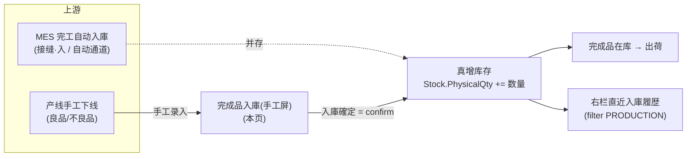

# 完成品入庫（手工屏）单页面操作 SOP（手把手版）

> **用途**：给**产线/仓管操作、培训老师讲、测试人员拆用例**。比模块总册（`03-库存物流WMS` §5.7）更细。
> **页面**：完成品入庫（ProductionInbound · WM040 · 库存物流 WMS）　**路由**：`/wms/product-inbound`　**前端**：`views/wms/ProductionInboundView.vue`　**API**：`api/wms/inboundReceipt.ts inboundReceiptApi.confirm`　**后端**：`Wms/InboundReceiptController.Confirm` → `InboundService.ConfirmReceiptAsync` → `StockMovementService.ApplyAsync(IN)`
> **基准**：分支 `feat/wfs-inbox-core`，2026-06-29；后端实测 `docs/codemap-wms/02-入庫.md`（2026-06-22 权威），UI 经实读 view。
> **样例数据**：製造指図 `WO2026070001`、製品 `PRD2026070001`、良品仓 `W03`、不良品仓 `W04`、数量 4800、LotNo `LOT2026070001`。

---

## 1. 页面一句话说明

**完成品入庫（手工屏）就是产线/仓管的"大字号扫码快录屏"——产线把刚下线的完成品（良品或不良品）手工登记入库，点一下巨型「入庫確定」按钮就直接写库存（复用 `inboundReceipt.confirm`，`sourceType=PRODUCTION`），成功后自动清屏、光标跳回 WO 扫码框，右边履历刷出刚入的那条。** 它是 MES 完工**自动入庫**（接缝(入)）之外的**手工补录通道**，二者并存。

---

## 2. 这个页面在业务流程中的位置

- **上游**：① MES 全工程完了→自动完成品入庫（落 `W01/W01-FG`，走后端幂等护栏）；② 产线手工把完成品录进**本页**（默认落 `W03/W04`，**不过护栏**）。两条**并存**，不互斥。
- **本页**：手工大字号快录，确定即写库存。
- **下游**：完成品在库→出荷（5.8/5.9 出庫）；右栏只读履历实时反映本页录入。

---

## 3. 谁使用这个页面

| 角色 | 用途 |
|---|---|
| 产线作业员 | 完成品下线后大字号快录入库（良品/不良品） |
| 仓管 | 补录/校正完成品入库、手改落仓与库位 |

---

## 4. 操作前准备

- [ ] 完成品已**实际下线**，数量已点清（本页只记录，不校验产量真实性）。
- [ ] 明确这批是**良品**还是**不良品**——决定默认落仓（GOOD→W03 / DEFECTIVE→W04）。
- [ ] 准备好 製品CD（必填）、ロット号（必填，可点「自動採番」生成）、落仓与棚番（必填）。
- [ ] 若 MES 自动通道已经入过这张指図的完成品——**本页再录会重复增加库存（无幂等护栏）**，先确认是否真的要补录（见 §11 盲点）。

---

## 5. 页面区域说明

| 区域 | 内容 |
|---|---|
| 左·簡易入庫フォーム（14 栏，大号控件 size=large） | WO 扫码框（带 `Aim` 图标、回车事件）→ 製品CD/製品名 → ロット（输入+「自動採番」）→ 数量（数字 ≥0）→ 品質（GOOD/DEFECTIVE 单选）→ 倉庫（带提示后缀）→ 棚番 → 賞味期限 → 備考 → 巨型「入庫確定」按钮（高 56px，占满整行） |
| 右·直近入庫履歴（10 栏，只读） | 表格 4 列：受入No / 製造指図No / 倉庫 / 入庫日時；右上「刷新」拉最近 20 条并 `filter(sourceType==='PRODUCTION')` |

> 本页**无检索区、无分页、无状态机**——它是"录入即落库"的单向快录屏。

---

## 6. 字段填写说明（口语版）

| 字段 | 控件 | 必填 | 怎么填 | 填错影响 |
|---|---|---|---|---|
| 製造指図No（workOrderNo） | 输入框（回车） | **否** | 扫码或手填，如 `WO2026070001`；**回车仅在 ロット为空时**拼一个建议 lot（`WO号-YYYYMMDD`，无随机后缀），**不查 MES、不校验工单存在** | 空也能确定（DTO 里此字段可缺省） |
| 製品CD（productCd） | 输入框 | **是** | 完成品料号，如 `PRD2026070001` | 空→onConfirm 拦截 `wms.common.required` |
| 製品名（productName） | 输入框 | 否 | 可空，仅写入明细备查 | — |
| ロット（lotNo） | 输入框 + 「自動採番」按钮 | **是** | 手填如 `LOT2026070001`，或点「自動採番」生成 `WO号-YYYYMMDD-随机4位`（WO 空时前缀用 `WO`） | 空→onConfirm 拦截 |
| 数量（receivedQty） | 数字（min=0，precision=2，large） | **是（>0）** | 本批完成数，如 4800 | ≤0→onConfirm 拦截 |
| **品質（quality）** | 单选 GOOD/DEFECTIVE | 是 | 选良品/不良品 | **切换即自动改倉庫**（GOOD→W03 / DEFECTIVE→W04）；**此字段本身不进 DTO**，良/不良只靠"落哪个仓"体现 |
| 倉庫（warehouseCd） | 输入框（large，append 提示） | **是** | 默认随品質联动（W03/W04，**硬编码**），**可手改** | 空→onConfirm 拦截 |
| 棚番（locationCd） | 输入框 | **是** | 库位号 | 空→onConfirm 拦截 |
| 賞味期限（expiryDate） | 日期选择 | 否 | 有效期/保质期，可空 | — |
| 備考（remarks） | 文本域（2 行） | 否 | 自由备注 | — |

> **要点**：`required` 标记只是 Element-Plus 的**视觉星号**，真正拦截靠 `onConfirm` 里一行手工 `if`（製品CD / ロット / 数量>0 / 倉庫 / 棚番 五项）；**製造指図No 不在校验内**。`onWoEnter`（回车）拼的 lot **无随机后缀**，`genLot`（自動採番按钮）拼的 lot **带随机 4 位**——两条路径格式略有差异，属现状。

---

## 7. 按钮操作说明

| 按钮 | 位置 | 点了会怎样 |
|---|---|---|
| 自動採番 | ロット行右侧 | 生成 `WO号-YYYYMMDD-随机4位` 填入 lotNo（WO 空→前缀 `WO`） |
| 入庫確定 | 表单底部巨型按钮（56px） | 五项手工校验通过→组 DTO（`sourceType=PRODUCTION`、`status=1` Confirmed、明细 1 行）→`inboundReceiptApi.confirm`→后端**真增库存**→成功 toast（含受入No）→**清屏 + 光标跳回 WO 框 + reload 履历** |
| 刷新 | 右栏履歴头部 | `search({pageSize:20})`→`filter(sourceType==='PRODUCTION')`→取前 20 条重载履历 |
| WO 扫码框回车 | WO 输入框 | 触发 `onWoEnter`：若 ロット为空→拼建议 lot（无随机）；**不查 MES**（实 MES 联动标注 `待实现`） |

> 本页**没有**保存草稿、確定/取消状态切换、改/删入口——每次「入庫確定」都是新建一张已确定（status=1）的入庫实绩并立即落库。

---

## 8. 标准业务操作 SOP（照着点）

### 场景一：良品完成品入庫（主流程）
- **背景**：产线把一批良品完成品下线，手工录入库。
- **样例数据**：WO `WO2026070001`、製品 `PRD2026070001`、ロット `LOT2026070001`、数量 4800、品質 GOOD。
- **前置**：完成品已下线、数量点清。
- **步骤**：1) 扫/填 WO `WO2026070001`（回车，若 lot 空会拼建议 lot）；2) 填製品CD `PRD2026070001`；3) ロット手填 `LOT2026070001` 或点「自動採番」；4) 数量填 4800；5) 品質选 GOOD（倉庫自动变 W03）；6) 棚番填库位；7) 点「入庫確定」。
- **完成后检查**：toast `WM-MSG-071`（含受入No `RC…`）；表单清空、光标回 WO 框；右栏履历顶部出现这条；在庫照会能查到 W03 的 4800 完成品库存。
- **异常**：製品/ロット/棚番空或数量≤0→`wms.common.required` 不提交。
- **用例**：TC-M06-PRODIN-001~006、010。

### 场景二：不良品入庫（旁路 QC）
- **背景**：本批是不良品，要单独入到不良品仓。
- **样例数据**：同上，品質改 DEFECTIVE、数量 4800。
- **步骤**：填完製品/ロット/数量后，品質选 **DEFECTIVE**（倉庫自动从 W03 跳到 **W04**）→棚番→「入庫確定」。
- **完成后检查**：库存进 W04；右栏履历倉庫列显示 W04。
- **盲点（务必知道）**：品質 DEFECTIVE **只改落仓**，DTO 里**没有"不良"标记**；后端**不**把库存置 `QcStatus=FAILED`——即**完全旁路 QC**，这批不良品在库可被正常引当出库（与 5.9 出庫的 FAILED 阻断逻辑不冲突，因为根本没置 FAILED）。
- **用例**：TC-M06-PRODIN-007、008、024、025。

### 场景三：ロット自動採番 / WO 回车拼 lot
- **背景**：现场不想手敲 lot。
- **步骤**：A) 留 ロット空，扫 WO 后回车→自动得到 `WO2026070001-20260629`（无随机）；B) 或点「自動採番」→得到 `WO2026070001-20260629-随机4位`。
- **检查**：两条路径都能填出 lot，但**格式不同**（回车无随机、按钮有随机）；ロット仍可被手工覆盖。
- **用例**：TC-M06-PRODIN-009、011、012。

### 场景四：必填校验拦截
- **背景**：漏填关键字段直接点确定。
- **步骤**：分别在製品CD空 / ロット空 / 数量=0 / 倉庫空 / 棚番空 五种情况下点「入庫確定」。
- **检查**：每种都弹 `wms.common.required` 警告、**不发请求、不落库**；製造指図No 空**不**拦截（可正常确定）。
- **用例**：TC-M06-PRODIN-013~018。

### 场景五：手工屏无幂等护栏（重复入庫）
- **背景**：同一张指图、同一 lot 连点两次确定，或 MES 自动通道已入过又来本页补录。
- **步骤**：用相同 WO `WO2026070001` + lot `LOT2026070001` + 数量 4800 连续「入庫確定」两次。
- **检查**：**两次都成功**，生成两张受入No，库存**累计增加 9600**——本页**没有任何防重/幂等护栏**（护栏只在后端自动通道 `CreateFinishedGoodsFromWorkOrderAsync`，键 `WorkOrderNo+PRODUCTION`、`WM-MSG-043`，本手工屏不经过）。
- **风险**：误操作会双倍入库，需靠库存盘点或人工冲销纠正（标注 `待业务确认`，现状无系统拦截）。
- **用例**：TC-M06-PRODIN-019、020、026。

### 场景六：默认落仓 W03/W04 ≠ 自动通道 W01/W01-FG
- **背景**：核对手工屏与 MES 自动入庫到底落哪个仓。
- **步骤**：本页 GOOD 确定→看库存在 W03；对照 MES 全工程完了的自动入庫→库存在 `W01/W01-FG`。
- **检查**：**两条通道落仓不一致**（手工 W03/W04 是前端硬编码默认值，自动通道 W01/W01-FG 是后端常量）；同一批完成品若两路都走，会分散在不同仓——这是已知差异，需业务侧统一口径（标注 `待业务确认`）。
- **用例**：TC-M06-PRODIN-021、027。

### 场景七：手改倉庫/棚番
- **背景**：默认仓不符实际，需手改。
- **步骤**：品質选 GOOD（默认 W03）后，把倉庫手工改成别的仓（如 W04 或其它），棚番填实际库位→确定。
- **检查**：以**手改后的仓**落库（联动只在切换品質那一刻发生，手改不会被回弹）；但再次切换品質会**再次覆盖**倉庫为 W03/W04。
- **用例**：TC-M06-PRODIN-022、023。

---

## 9. 状态变化说明

- **无状态机**：本页**没有**下書き/確定/取消的状态切换——每次确定**直接新建一张 `status=1`（Confirmed）的入庫实绩**并立即落库；不存在"保存后再确定""确定后撤回"。
- **直入模式**：本页不带 `?inboundNo=`，走 `ConfirmReceiptAsync` 的**直入分支**（不参照入庫予定、无予定累计回写/状态迁移）。

---

## 10. 按钮不可用 / 灰色原因

| 现象 | 原因 |
|---|---|
| 点「入庫確定」无反应/弹必填警告 | 製品CD / ロット / 数量>0 / 倉庫 / 棚番 任一缺失（前端手工 if 拦截） |
| 确定后按钮转圈不可再点 | `saving=true` 锁定，请求返回（成功或失败）后解锁 |
| 找不到"改/删/撤回"入口 | **本页无修改/删除/撤回端点**——录错只能再录冲销或走库存调整（现状） |
| 找不到"保存草稿" | 无草稿态，确定即落库 |
| WO 回车后没自动带出製品/工序 | **不查 MES**，仅在 lot 空时拼 lot（实 MES 联动 `待实现`） |

---

## 11. 常见错误与处理（含重点盲点）

| 错误 / 盲点 | 原因 | 处理 |
|---|---|---|
| `wms.common.required` 提示 | 五项必填之一空（製品/ロット/倉庫/棚番/数量≤0） | 补齐再确定 |
| 后端 `WM-MSG-031` | 后端再校验：仓库空 / 明细 0 件 / 行料号·库位空 / 数量≤0 | 与前端必填一致，补齐 |
| 后端 `WM-MSG-021` | `ApplyAsync(IN)` 要求数量为正数 | 数量须 >0 |
| ⚠️ **默认落仓 W03/W04 ≠ 自动通道 W01/W01-FG** | 手工屏前端硬编码 W03/W04，后端自动通道常量 W01/W01-FG | 业务侧统一落仓口径（`待业务确认`） |
| ⚠️ **手工屏无幂等/防重护栏** | 同一 WO+lot 可重复「入庫確定」多次，每次都新增库存 | 录入前确认是否已入过；误重复靠盘点/人工冲销（`待业务确认`） |
| ⚠️ **WO 扫码不联动 MES** | `onWoEnter` 仅拼 lot，不查工单 | 製品/数量须手工核对填写（`待实现`） |
| ⚠️ **不良品直入 W04 旁路 QC** | DEFECTIVE 只改落仓，不置 `QcStatus=FAILED` | 不良在库不会被自动阻断出库，需流程管控（`待业务确认`） |
| 录错改不掉 | 无修改/删除端点 | 再录一条冲销或走库存调整 |

---

## 12. 操作完成后的检查清单

- [ ] toast `WM-MSG-071` 含受入No（`RC…`），表单已清空、光标回到 WO 框。
- [ ] 右栏「直近入庫履歴」顶部新增本条（受入No/指図No/倉庫/入庫日時）。
- [ ] 在庫照会查到该製品在目标仓（GOOD→W03 / DEFECTIVE→W04 或手改仓）库存**真增加**对应数量。
- [ ] 库存流水有一条 `IN` 交易（`StockTransaction`），明细回填 `StockTxnNo`。
- [ ] 不良品入库**未**置 `QcStatus=FAILED`（旁路 QC，已知现状）。
- [ ] 若同批已走 MES 自动通道，确认未因本页补录造成**重复入库**（手工屏无幂等护栏）。

---

## 13. 页面级测试用例（≥25 条，可执行）

> 编号 `TC-M06-PRODIN-xxx`；数据用样例（WO `WO2026070001`、製品 `PRD2026070001`、lot `LOT2026070001`、良品仓 W03、不良品仓 W04、数量 4800）。

| 用例编号 | 用例名称 | 优先级 | 前置条件 | 测试数据 | 操作步骤 | 预期结果 | 下游检查 | 备注 |
|---|---|---|---|---|---|---|---|---|
| TC-M06-PRODIN-001 | 良品入庫主流程 | P0 | 页面已开 | WO2026070001/PRD2026070001/LOT2026070001/4800/GOOD | 填全→入庫確定 | toast WM-MSG-071 含受入No | W03 库存+4800 | 核心 |
| TC-M06-PRODIN-002 | 成功后清屏 | P1 | 同上 | — | 確定后看表单 | 製品/lot/数量/期限/备考清空、保留倉庫默认 | — | reset() |
| TC-M06-PRODIN-003 | 成功后聚焦 WO 框 | P2 | 同上 | — | 確定后看光标 | 光标回到 WO 扫码框 | — | nextTick focus |
| TC-M06-PRODIN-004 | 成功后履历刷新 | P1 | 同上 | — | 確定后看右栏 | 顶部出现本条 | reload | — |
| TC-M06-PRODIN-005 | 受入No 已生成 | P1 | 同上 | — | 看 toast/履历 | 受入No 形如 RC… | 采番 RC | — |
| TC-M06-PRODIN-006 | sourceType=PRODUCTION | P1 | 同上 | — | 确定后查实绩 | SourceType=PRODUCTION | — | DTO 固定 |
| TC-M06-PRODIN-007 | 不良品自动切 W04 | P0 | 页面已开 | 品質 DEFECTIVE | 选 DEFECTIVE | 倉庫自动变 W04 | — | watch 联动 |
| TC-M06-PRODIN-008 | 不良品入库旁路 QC | P1 | DEFECTIVE | 4800 | 确定 | 入 W04 库存，QcStatus 非 FAILED | 库存可被引当 | 盲点 |
| TC-M06-PRODIN-009 | WO 回车拼 lot（无随机） | P1 | ロット空 | WO2026070001 | WO 框回车 | lot=WO2026070001-YYYYMMDD | — | onWoEnter |
| TC-M06-PRODIN-010 | 良品默认仓 W03 | P1 | 页面已开 | GOOD | 看倉庫初值 | 默认 W03 | — | 初始值 |
| TC-M06-PRODIN-011 | 自動採番带随机 | P1 | — | WO2026070001 | 点自動採番 | lot=WO2026070001-YYYYMMDD-随机4位 | — | genLot |
| TC-M06-PRODIN-012 | WO 空时自動採番前缀 | P2 | WO 空 | 留 WO 空 | 点自動採番 | lot 前缀=WO- | — | fallback |
| TC-M06-PRODIN-013 | 製品CD 空拦截 | P0 | — | 製品空 | 入庫確定 | wms.common.required，不发请求 | 不落库 | — |
| TC-M06-PRODIN-014 | ロット空拦截 | P0 | — | lot 空 | 入庫確定 | required 拦截 | 不落库 | — |
| TC-M06-PRODIN-015 | 数量=0 拦截 | P0 | — | 数量 0 | 入庫確定 | required 拦截 | 不落库 | — |
| TC-M06-PRODIN-016 | 倉庫空拦截 | P0 | — | 倉庫清空 | 入庫確定 | required 拦截 | 不落库 | — |
| TC-M06-PRODIN-017 | 棚番空拦截 | P0 | — | 棚番空 | 入庫確定 | required 拦截 | 不落库 | — |
| TC-M06-PRODIN-018 | 製造指図No 空可确定 | P1 | 其余填全 | WO 留空 | 入庫確定 | 正常成功（WO 非必填） | 库存+ | DTO 可缺 WO |
| TC-M06-PRODIN-019 | 重复确定无护栏 | P0 | 已入过 | 同 WO+lot 第2次 | 再次入庫確定 | 第2次仍成功，新受入No | 库存累计+9600 | 盲点·无幂等 |
| TC-M06-PRODIN-020 | 与自动通道重复入 | P1 | MES 已自动入过 | 同指图本页补录 | 入庫確定 | 本页成功（不被 WM-MSG-043 拦） | 双通道重复入库 | 盲点 |
| TC-M06-PRODIN-021 | 落仓差异核对 | P1 | — | GOOD vs 自动 | 对比两通道落仓 | 手工 W03/W04 ≠ 自动 W01/W01-FG | — | 已知差异 |
| TC-M06-PRODIN-022 | 手改倉庫生效 | P1 | GOOD | 倉庫手改为他仓 | 改后确定 | 以手改仓落库 | 目标仓+ | 可手改 |
| TC-M06-PRODIN-023 | 切品質覆盖手改仓 | P2 | 已手改仓 | 再切品質 | 切 GOOD/DEFECTIVE | 倉庫被重置 W03/W04 | — | watch 覆盖 |
| TC-M06-PRODIN-024 | 不良数量入 W04 | P1 | DEFECTIVE | 4800 | 确定 | W04 库存+4800 | 库存 W04 | — |
| TC-M06-PRODIN-025 | quality 不进 DTO | P2 | DEFECTIVE | — | 查请求体 | DTO 无 quality 字段，仅 warehouseCd=W04 | — | 现状 |
| TC-M06-PRODIN-026 | 履历仅显 PRODUCTION | P1 | 有多来源入庫 | — | 点刷新 | 右栏只列 sourceType=PRODUCTION | filter | — |
| TC-M06-PRODIN-027 | 在庫照会可查 | P1 | 已入庫 | W03 | 到在庫照会查 | 命中该製品库存 | 在庫照会 | 下游 |
| TC-M06-PRODIN-028 | 库存流水 IN | P1 | 已入庫 | — | 查流水 | 一条 IN 交易、明细回填 StockTxnNo | StockTransaction | — |
| TC-M06-PRODIN-029 | 賞味期限可空 | P2 | — | 不填期限 | 确定 | 正常成功 | — | 选填 |
| TC-M06-PRODIN-030 | 网络异常友好提示 | P2 | 断网 | — | 入庫確定 | ElMessage.error，可重试 | 不落库 | catch 分支 |

---

## 14. 培训讲解建议

| 顺序 | 讲什么 | 演示 | 易误解点 |
|---|---|---|---|
| 1 | 这页是产线"手工补录"完成品的快录屏 | §2 流程图 | 以为是唯一入库口（其实和 MES 自动通道并存） |
| 2 | 录入即落库，无草稿无状态机 | 确定→右栏即出 | 以为还要再"确定/审核" |
| 3 | 品質 GOOD/DEFECTIVE 只改落仓 | 切换看 W03↔W04 | 以为不良会自动建不良单/置 FAILED |
| 4 | 默认仓 W03/W04 ≠ 自动通道 W01/W01-FG | 对照两通道 | 以为两路落同一仓 |
| 5 | 本页无幂等护栏，重复会双倍入库 | 连点两次看库存 | 以为系统会防重 |
| 6 | WO 扫码不查 MES，製品/数量要手核 | 回车只拼 lot | 以为扫 WO 会带出工单内容 |

---

## 15. 与模块级手册的关系

对应 `03-库存物流WMS-...md` §5.7（完成品入庫 · 5.7.1~5.7.14）。本页是 §5.7.5 左 14 栏简易入庫表单 + 右 10 栏直近履歴的逐字段/逐用例展开；§5.7.11/5.7.12 的四大盲点（落仓差异 / 无幂等护栏 / WO 不联 MES / 不良旁路 QC）在本文 §8 场景五·六、§11、§13 用例 019~021/024/025 落到可执行用例。完成品入庫汇聚的真增库存路径见 §16 与 `docs/codemap-wms/02-入庫.md`。

---

## 16. 代码与文档来源

| 层 | 文件 |
|---|---|
| 逐行源码手册 | `docs/codemap-wms/02-入庫.md`（权威，含完成品入庫接缝③/幂等护栏/落仓差异） |
| 模块总册 | `docs/manuals/user-training/03-库存物流WMS-最详细用户操作培训手册.md` §5.7 |
| 前端 view | `cp6.web/src/views/wms/ProductionInboundView.vue` |
| 前端 API/类型 | `cp6.web/src/api/wms/inboundReceipt.ts`（`confirm`）、`types/wms/wms.ts`（`InboundReceipt`/`InboundSourceType`） |
| 后端 Controller | `Controllers/Wms/InboundReceiptController.cs`（`Confirm`，成功 `WM-MSG-071`） |
| 后端 Service | `Services/Wms/InboundService.cs`（`ConfirmReceiptAsync` 297-416 直入分支 / 完成品自动通道 `CreateFinishedGoodsFromWorkOrderAsync` 418-463 幂等 `WM-MSG-043`） |
| 真增库存铁律 | `Services/Wms/StockMovementService.cs`（`ApplyAsync(IN)`，要求正数 `WM-MSG-021`） |
| 接缝(入)·自动通道 | `Services/Wms/WmsBridgeHook.cs`(:86-112) / `Mes/ProductionResultService.cs`(:256-258) |
| 测试 | `CP6.Tests/WmsErpClosedLoopTests.cs`（完成品入庫幂等 133-139，仅约束自动通道） |

---

## 最后更新来源

- 代码：见 §16（codemap-wms 02-入庫 权威 + `ProductionInboundView.vue` 实读 + `inboundReceipt.ts` 实读 + 总册 §5.7）。
- 基准：分支 `feat/wfs-inbox-core`，2026-06-29（codemap 2026-06-22）。
- 覆盖：16 节 / 7 场景 / 30 用例（TC-M06-PRODIN-001~030）。
- 诚实标注：手工屏无幂等护栏、WO 不联 MES（`待实现`）、不良旁路 QC、默认落仓 W03/W04≠自动通道 W01/W01-FG 均为现状，已标 `待业务确认`/`待实现`。
