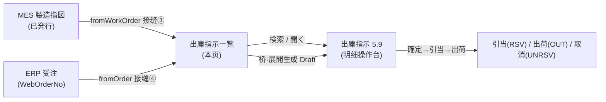
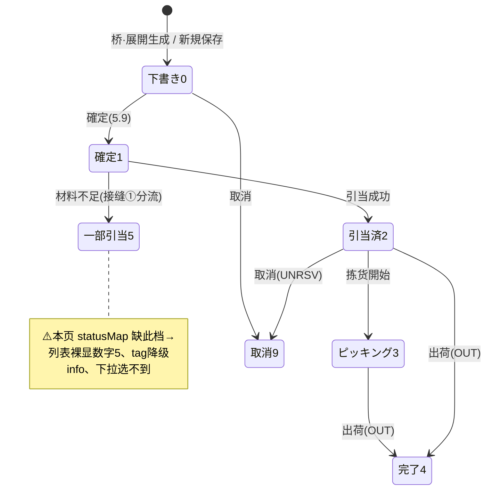

# 出庫指示一覧 单页面操作 SOP（手把手版）

> **用途**：给**出荷担当/库管操作、培训老师讲、测试人员拆用例**。比模块总册（`03-库存物流WMS` §5.8）更细。
> **页面**：出庫指示一覧（WM050 · 库存物流 WMS）　**路由**：`/wms/outbound-order-list`（`router/index.ts:112`）　**前端**：`views/wms/OutboundOrderListView.vue`　**API**：`api/wms/outboundOrder.ts outboundOrderApi`　**后端**：`Wms/OutboundOrderController` → `OutboundService.SearchOrdersAsync`（检索）/ `CreateFromWorkOrderAsync` / `CreateFromOrderAsync`（自動展開）
> **基准**：分支 `feat/wfs-inbox-core`，2026-06-29；后端实测 `docs/codemap-wms/03-出庫-出荷.md`（2026-06-22 权威），UI 经实读 view。
> **样例数据**：出庫指示 `OUT2026070001`、来源製造指図 `WO2026070001`、来源 Web受注 `WO20260701000001`、得意先 `CUST-A`。

---

## 1. 页面一句话说明

**出庫指示一覧，就是所有"出庫指示"（材料出庫 / 出荷 / 社内振替）的检索台账——上面输 6 个条件查、点行「開く」进 5.9 详情；它还兼着一座"自動展開桥"：填一个 MES 製造指図号或 ERP 受注号点「展開」，系统就替你一键生成一张草稿出庫指示（接缝③④）。** 它是 WMS 出库这条线的总入口，本身只读不动库存，真正的確定/引当/出荷都在 5.9 详情里做。

---

## 2. 这个页面在业务流程中的位置

- **上游**：手动新規，或被 MES 製造指図発行（接缝③）/ ERP 受注作成（接缝④）自动调；本页桥是**同一套端点的手动入口**。
- **本页**：检索台账 + 自動展開触发点（只读，不动库存）。
- **下游**：行「開く」→ 5.9 出庫指示详情，去走確定→引当→出荷→取消全生命周期。

---

## 3. 谁使用这个页面

| 角色 | 用途 |
|---|---|
| 出荷担当 | 查出荷指示进度、从受注展開出荷单 |
| 库管 | 查材料出庫/振替、从製造指図展開材料出庫单 |
| 计划/生产联络 | 核对某工单/某受注是否已生成出庫指示 |

---

## 4. 操作前准备

- [ ] 已有出庫数据可查，或手上有待展開的**製造指図号**（如 `WO2026070001`）/ **Web受注号**（如 `WO20260701000001`）。
- [ ] 清楚要展開的是材料出庫（来自製造指図）还是出荷（来自受注）。
- [ ] 知道展開出来的只是**草稿（Draft）**，要去 5.9 続け確定→引当才会真正动库存。
- [ ] 知道一个工单/受注**只能展開一次**（已有未取消单会被去重拦截）。

---

## 5. 页面区域说明

| 区域 | 内容 |
|---|---|
| 检索卡（search-card） | 6 个检索条件（出庫No / 種別 / ステータス / 製造指図No / Web受注No / 得意先CD）+「検索」「新規」「自動展開(桥)」3 按钮 |
| 结果表格 | 列：出庫No / 種別(tag) / ステータス(tag) / 製造指図No / Web受注No / 得意先名 / 倉庫 / 予定日 / 優先度 / 操作「開く」。`max-height=600`、`pageSize:100` **无分页**（>100 条会截断） |
| 自動展開対話框（bridgeDialog） | 500px；上半「製造指図から」输入 + 「展開」按钮（fromWorkOrder），下半「受注から」输入 + 「展開」按钮（fromOrder）；输入框占位符用明文 i18n key（`t('例: {sample}', …)`），样例号仅作提示 |

---

## 6. 字段填写说明（口语版）

**检索条件**（6 条，全部可空，组合 AND 检索，留空=不过滤）：

| 条件 | 对应字段 | 怎么填 | 说明 |
|---|---|---|---|
| 出庫No | `outboundNo` | 出庫指示号（如 `OUT2026070001`） | 精确/模糊视后端实现 |
| 種別 | `outboundType` 下拉 | 1材料 / 2出荷 / 3社内振替 / 9その他 | 下拉项来自 `typeMap`，4 项齐全 |
| ステータス | `status` 下拉 | 0下書き/1確定/2引当済/3ピッキング/4完了/9取消 | ⚠️ **下拉缺 `5 PartialAllocated`**——选不到"材料一部引当"这档 |
| 製造指図No | `workOrderNo` | 来源工单号（如 `WO2026070001`） | 仅材料出庫(type=1)有值 |
| Web受注No | `webOrderNo` | 来源受注号（如 `WO20260701000001`） | 仅出荷(type=2)有值 |
| 得意先CD | `customerCd` | 得意先代码（如 `CUST-A`） | — |

**自動展開対話框**：

| 字段 | 怎么填 | 填错影响 |
|---|---|---|
| 製造指図から | 填製造指図号 → 点「展開」 | 工单不存在/无材料→后端报错；已有未取消单→`WM-MSG-043` 去重拦截 |
| 受注から | 填 Web受注号 → 点「展開」 | 受注不存在/无明细→后端报错；已有未取消单→`WM-MSG-043` 去重拦截 |

> 占位符样例号（如 `WO20260522-0001` / `O20260522-0001`）只是 placeholder 提示，**不是真实数据**，须替换成实际工单/受注号。

---

## 7. 按钮操作说明

| 按钮 | 位置 | 点了会怎样 |
|---|---|---|
| 検索 | 检索卡 | 按当前 6 条件 `outboundOrderApi.search(query)` 拉列表（`reload()`，进页面 `onMounted` 自动跑一次） |
| 新規 | 检索卡 | 跳 `/wms/outbound-order?mode=new` 新建空白出庫指示（→5.9） |
| 自動展開 | 检索卡 | 打开 bridgeDialog（warning 色按钮） |
| 開く | 行操作列 | 跳 `/wms/outbound-order?no={outboundNo}` 进该单详情（→5.9） |
| 展開（製造指図から） | bridgeDialog | `fromWorkOrder(woNo)`→**接缝③**生成材料出庫 Draft→toast→关弹窗→跳新单详情 |
| 展開（受注から） | bridgeDialog | `fromOrder(webOrderNo)`→**接缝④**生成出荷 Draft→toast→关弹窗→跳新单详情 |

> 展開成功后 toast 用 `wms.outbound.bridge.expanded`（含新出庫No），并自动 `router.push` 到详情页；输入框空时点「展開」直接 return（无动作）。

---

## 8. 标准业务操作 SOP（照着点）

### 场景一：组合条件检索（主流程）
- **背景**：查某得意先未完成的出荷指示。
- **样例数据**：種別=2出荷、ステータス=2引当済、得意先CD=`CUST-A`。
- **步骤**：1) 检索卡选種別「出荷」；2) 选ステータス「引当済」；3) 得意先CD 填 `CUST-A`；4) 点「検索」。
- **完成后检查**：表格只列满足 AND 条件的行；種別/ステータス显 tag；条件留空=不过滤。
- **注意**：结果 `pageSize:100`，**无分页**，超 100 条会被截断（见场景七）。
- **用例**：TC-M06-OUTLIST-001~006。

### 场景二：从 MES 製造指図 自動展開材料出庫（接缝③）
- **背景**：工单発行了，要给它备料出库。
- **样例数据**：製造指図 `WO2026070001`。
- **前置**：该工单存在、有 `WorkOrderMaterials`、且尚无未取消的出庫指示。
- **步骤**：1) 点「自動展開」开桥；2) 上半「製造指図から」填 `WO2026070001`；3) 点「展開」。
- **完成后检查**：toast 提示新出庫No（如 `OUT2026070001`）；自动跳详情；新单 `種別=材料(1)`、`倉庫=W01`、`ステータス=下書き(0)`、`製造指図No=WO2026070001`；明细来自工单材料。
- **后续**：草稿单需在 5.9 続け **確定→引当** 才动库存。
- **用例**：TC-M06-OUTLIST-007、008、009。

### 场景三：从 ERP 受注 自動展開出荷指示（接缝④）
- **背景**：受注成立了，要安排出货。
- **样例数据**：Web受注 `WO20260701000001`。
- **前置**：该受注存在、有 `OrderDetails`、且尚无未取消的出庫指示。
- **步骤**：1) 点「自動展開」开桥；2) 下半「受注から」填 `WO20260701000001`；3) 点「展開」。
- **完成后检查**：toast 含新出庫No；跳详情；新单 `種別=出荷(2)`、`倉庫=W01`、`ステータス=下書き(0)`、`Web受注No=WO20260701000001`。
- **关键**：`WebOrderNo+出荷型`是后续出荷接缝②回写 ERP 的闭环钥匙。
- **用例**：TC-M06-OUTLIST-010、011、012。

### 场景四：自動展開去重拦截（WM-MSG-043）
- **背景**：同一工单/受注误点了两次展開。
- **步骤**：对已展開过（且未取消）的 `WO2026070001` 再次「展開」。
- **检查**：后端去重键 `WorkOrderNo`（受注侧为 `WebOrderNo`）命中已有未取消单→报 `WM-MSG-043`，**不重复生成**。
- **拆分**：製造指図去重 / Web受注去重 两条。
- **用例**：TC-M06-OUTLIST-013、014。

### 场景五：PartialAllocated(5) 裸显数字盲点排查
- **背景**：某材料出庫单引当材料不足，后端置 `Status=5`，回列表查看。
- **步骤**：检索后观察该单的「ステータス」列。
- **检查**：⚠️ 前端 `statusMap` **缺 `5`**→该格**裸显数字 `5`**（不是文字）、tag 类型 `statusTagOf(5)` 落到默认 `info`（灰）降级显示；ステータス下拉也选不到这档。这是**真实 UI 盲点**，须照实记 `待业务确认`。
- **用例**：TC-M06-OUTLIST-015、016、017。

### 场景六：新規 / 開く 跳转
- **背景**：手动新建一张出庫指示，或打开某行看详情。
- **步骤**：点「新規」→跳 `?mode=new`；或行「開く」→跳 `?no=OUT2026070001`。
- **检查**：均跳 `/wms/outbound-order`（5.9），带不同 query。
- **用例**：TC-M06-OUTLIST-018、019。

### 场景七：超 100 条无分页截断
- **背景**：数据量大时验证清单完整性。
- **步骤**：在 >100 条结果的条件下「検索」。
- **检查**：`query.pageSize=100` 写死、**无分页控件**，最多返回 100 行，其余被截断；须靠收紧检索条件定位目标，记 `待业务确认`（无分页）。
- **用例**：TC-M06-OUTLIST-020。

---

## 9. 状态变化说明

> 本页只**显示**出庫指示状态，状态迁移在 5.9 详情发生；下图为出庫指示全生命周期，便于理解列表上各 tag 的含义。

---

## 10. 按钮不可用 / 灰色原因

| 现象 | 原因 |
|---|---|
| bridgeDialog 点「展開」无反应 | 输入框为空（`onBridgeWo/onBridgeOrder` 空值直接 return） |
| 列表无行内"確定/引当/出荷/取消"按钮 | **本页是只读台账**，行操作只有「開く」；生命周期操作全在 5.9 |
| ステータス下拉选不到"材料一部引当" | statusMap 缺 `5`（UI 盲点，下拉只列 0/1/2/3/4/9） |
| 第 101 行起查不到 | `pageSize:100` 无分页，超额截断 |
| 找不到改/删 | 列表不提供改删；删草稿在 5.9（`status===0` 才可削除） |

---

## 11. 常见错误与处理

| 错误 | 原因 | 处理 |
|---|---|---|
| 展開报 `WM-MSG-043` | 该工单/受注已有未取消的出庫指示（去重） | 先去清单查现有单，勿重复展開 |
| 展開报"工单/受注不存在或无明细" | 号填错，或该单无 `WorkOrderMaterials`/`OrderDetails` | 核对製造指図号/Web受注号 |
| ステータス列出现裸数字 `5` | 前端 statusMap 缺 PartialAllocated=5 | UI 盲点，按 5=材料一部引当理解；记 `待业务确认` |
| 列表少了几行 | 超 100 条被截断（无分页） | 收紧检索条件再查 |
| 桥占位符号填进去查不到 | placeholder 只是示例 i18n 明文，非真实数据 | 替换成实际工单/受注号 |
| 展開的单不动库存 | 展開只生成 Draft | 去 5.9 続け確定→引当 |

---

## 12. 操作完成后的检查清单

- [ ] **检索**：6 条件 AND 生效；種別/ステータス显对应 tag；留空不过滤。
- [ ] **自動展開（接缝③）**：生成 `種別=材料`、`倉庫=W01`、`下書き(0)` 单，明细=工单材料，自动跳详情。
- [ ] **自動展開（接缝④）**：生成 `種別=出荷`、`倉庫=W01`、`下書き(0)` 单，带 `WebOrderNo`，明细=受注明细。
- [ ] **去重**：同工单/受注再展開被 `WM-MSG-043` 拦截，不重复生成。
- [ ] **后续**：展開出的 Draft 单**未动库存**，必须去 5.9 確定→引当才生效。
- [ ] **盲点确认**：`5 PartialAllocated` 在列表裸显数字、tag 灰、下拉缺档；>100 条无分页截断（均记 `待业务确认`）。

---

## 13. 页面级测试用例（≥25 条，可执行）

> 编号 `TC-M06-OUTLIST-xxx`；数据用样例（`OUT2026070001` / `WO2026070001` / `WO20260701000001` / `CUST-A`）。

| 用例编号 | 用例名称 | 优先级 | 前置条件 | 测试数据 | 操作步骤 | 预期结果 | 下游检查 | 备注 |
|---|---|---|---|---|---|---|---|---|
| TC-M06-OUTLIST-001 | 进页面默认加载 | P1 | 有出庫数据 | 无条件 | 进页面 | onMounted 自动检索，列表有数据 | — | — |
| TC-M06-OUTLIST-002 | 按出庫No检索 | P1 | 有目标单 | OUT2026070001 | 填出庫No→検索 | 命中该单 | — | — |
| TC-M06-OUTLIST-003 | 按種別检索 | P1 | 有材料单 | 種別=1材料 | 选種別→検索 | 仅材料出庫行 | — | typeMap 4 项 |
| TC-M06-OUTLIST-004 | 按ステータス检索 | P1 | 有引当済单 | status=2 | 选状态→検索 | 仅引当済行 | — | — |
| TC-M06-OUTLIST-005 | 按製造指図No检索 | P1 | 有材料单 | WO2026070001 | 填指図No→検索 | 命中来源工单单 | — | — |
| TC-M06-OUTLIST-006 | 多条件AND检索 | P1 | 混合数据 | 種別2+状态2+CUST-A | 三条件→検索 | 仅同时满足行 | — | 组合 |
| TC-M06-OUTLIST-007 | 製造指図展開成功 | P0 | 工单有材料无旧单 | WO2026070001 | 桥→填指図→展開 | 生成材料Draft+toast+跳详情 | 5.9 新单 | 接缝③ |
| TC-M06-OUTLIST-008 | 展開单种别/仓正确 | P0 | 同上 | — | 看新单 | 種別=材料(1)、倉庫=W01、状态=0 | — | — |
| TC-M06-OUTLIST-009 | 展開单明细来自工单 | P1 | 同上 | — | 看明细 | 明细=WorkOrderMaterials | — | — |
| TC-M06-OUTLIST-010 | 受注展開成功 | P0 | 受注有明细无旧单 | WO20260701000001 | 桥→填受注→展開 | 生成出荷Draft+toast+跳详情 | 5.9 新单 | 接缝④ |
| TC-M06-OUTLIST-011 | 展開单带WebOrderNo | P0 | 同上 | — | 看新单 | 種別=出荷(2)、WebOrderNo回填、状态0 | — | 接缝②钥匙 |
| TC-M06-OUTLIST-012 | 展開单明细来自受注 | P1 | 同上 | — | 看明细 | 明细=OrderDetails | — | — |
| TC-M06-OUTLIST-013 | 製造指図去重拦截 | P0 | 已展開过 | WO2026070001 | 再次展開 | WM-MSG-043，不重复生成 | 不新增单 | 去重 |
| TC-M06-OUTLIST-014 | 受注去重拦截 | P0 | 已展開过 | WO20260701000001 | 再次展開 | WM-MSG-043，不重复生成 | 不新增单 | 去重 |
| TC-M06-OUTLIST-015 | 状态5裸显数字 | P1 | 有一部引当单 | status=5单 | 检索看状态列 | 裸显"5"非文字 | — | UI盲点 |
| TC-M06-OUTLIST-016 | 状态5 tag降级info | P2 | 同上 | — | 看tag色 | statusTagOf(5)→info灰 | — | UI盲点 |
| TC-M06-OUTLIST-017 | 下拉缺状态5 | P2 | — | — | 展开状态下拉 | 仅0/1/2/3/4/9，无5 | — | 待业务确认 |
| TC-M06-OUTLIST-018 | 新規跳转 | P1 | — | — | 点新規 | 跳/wms/outbound-order?mode=new | 5.9 | — |
| TC-M06-OUTLIST-019 | 開く跳转 | P1 | 有行 | OUT2026070001 | 点行開く | 跳?no=OUT2026070001 | 5.9 | — |
| TC-M06-OUTLIST-020 | 超100条截断 | P2 | >100条 | 宽条件 | 検索 | 最多100行，无分页 | — | 待业务确认 |
| TC-M06-OUTLIST-021 | 空条件不过滤 | P2 | 有数据 | 全空 | 検索 | 返回全部(≤100) | — | — |
| TC-M06-OUTLIST-022 | 桥空值不动作 | P2 | — | 空输入 | 桥→直接点展開 | return，无请求 | — | — |
| TC-M06-OUTLIST-023 | 種別tag显示 | P3 | 有数据 | — | 看種別列 | 1=info、其余warning，文字来自typeMap | — | — |
| TC-M06-OUTLIST-024 | 工单不存在展開 | P2 | — | 错指図号 | 展開 | 后端报错(不存在/无材料) | 不生成 | — |
| TC-M06-OUTLIST-025 | 受注不存在展開 | P2 | — | 错受注号 | 展開 | 后端报错(不存在/无明细) | 不生成 | — |
| TC-M06-OUTLIST-026 | 占位符仅提示 | P3 | — | placeholder号 | 看输入框 | 灰示例文字，非真实数据 | — | 明文i18n key |
| TC-M06-OUTLIST-027 | 得意先名展示 | P3 | 有出荷单 | CUST-A | 检索 | customerName 列显名、overflow tooltip | — | — |
| TC-M06-OUTLIST-028 | 列表只读无改删 | P2 | 有数据 | — | 看操作列 | 仅「開く」，无改/删 | — | 现状 |
| TC-M06-OUTLIST-029 | 权限不足 | P2 | 无权账号 | — | 进页面/展開 | 待业务确认(隐藏/拒绝) | — | 权限 |
| TC-M06-OUTLIST-030 | 网络异常 | P2 | 断网 | — | 検索/展開 | 友好错误可重试，loading 复位 | — | — |

---

## 14. 培训讲解建议

| 顺序 | 讲什么 | 演示 | 易误解点 |
|---|---|---|---|
| 1 | 这页是出庫指示总台账+只读 | §2 流程图 | 以为能在列表直接確定/出荷 |
| 2 | 6 个检索条件怎么组合 | 多条件検索 | 留空=不过滤（不是必填） |
| 3 | 自動展開桥=接缝③④ | 桥→展開→跳详情 | 以为展開就出库了（其实只是 Draft） |
| 4 | 展開一单只能一次 | 重复展開报 043 | 误点两次以为生成两单 |
| 5 | 状态 5 裸数字是已知盲点 | 看 PartialAllocated 行 | 以为是脏数据（其实是 statusMap 缺档） |
| 6 | 无分页，超 100 截断 | 宽条件検索 | 以为数据丢了（实为截断，需收紧条件） |

---

## 15. 与模块级手册的关系

对应 `03-库存物流WMS-...md` §5.8（5.8.1~5.8.14）。本页是接缝③④的手动触发点（§5.8.2），行跳 §5.9 出庫指示详情（核心生命周期页）。展開生成的 Draft 单须在 §5.9 続け確定→引当（接缝①）→出荷（接缝②）。UI 盲点（statusMap 缺 5、无分页）与 §5.8.11/§5.8.14、§5.9.11 一致。

---

## 16. 代码与文档来源

| 层 | 文件 |
|---|---|
| 逐行源码手册 | `docs/codemap-wms/03-出庫-出荷.md`（权威，"出庫指示 一覧" / "展開入口" 节） |
| 前端 view | `views/wms/OutboundOrderListView.vue`（检索 `reload` `:124`、桥 `onBridgeWo/onBridgeOrder` `:135-157`、`statusMap` 缺5 `:106-113`、`statusTagOf` `:120-122`、`pageSize:100` `:91`） |
| API/类型 | `api/wms/outboundOrder.ts`（`search`/`fromWorkOrder`/`fromOrder`）、`types/wms/wms.ts`（`OutboundOrderSearchQuery`） |
| 后端检索 | `Controllers/Wms/OutboundOrderController.cs`、`Services/Wms/OutboundService.cs`（`SearchOrdersAsync` `:56-74`） |
| 后端展開（接缝③④） | `OutboundService.CreateFromWorkOrderAsync`（`:538`）/`CreateFromOrderAsync`（`:583`），去重 `WM-MSG-043` |
| 触发 Hook | `Services/Wms/WmsBridgeHook.cs`（`OnWorkOrderIssuedAsync`/`OnOrderCreatedAsync`，与本页桥共用端点） |
| 状态/种别枚举 | `DomainModels/Wms/WmsTxnType.cs`（`OutboundOrderStatus` `:83`，含 `PartialAllocated=5`；`OutboundType` `:97`） |

---

## 最后更新来源

- 代码：见 §16（codemap-wms 03 权威 + OutboundOrderListView.vue 实读 + outboundOrder.ts）。
- 基准：分支 `feat/wfs-inbox-core`，2026-06-29（codemap 2026-06-22）。
- 覆盖：16 节 / 7 场景 / 30 用例（TC-M06-OUTLIST-001~030）。
- 诚实标注：① 前端 statusMap/状态下拉缺 `PartialAllocated=5`→列表裸显数字 5、tag 降级 info（UI 盲点，记 `待业务确认`）；② `pageSize:100` 无分页，>100 条截断（记 `待业务确认`）；③ 桥输入框占位符用明文 i18n key（`t('例: {sample}', …)`），样例号仅提示非真实数据；④ 本页只读，確定/引当/出荷全在 5.9。
