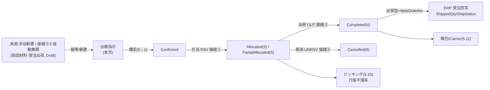

# 出庫指示 单页面操作 SOP（手把手版）

> **用途**：给**出荷担当/库管操作、培训老师讲、测试人员拆用例**。比模块总册（`03-库存物流WMS` §5.9）更细。
> **页面**：出庫指示（OutboundOrder · WM050 · 核心）　**路由**：`/wms/outbound-order`（带 `?no=` 取得单张）　**前端**：`views/wms/OutboundOrderView.vue`　**API**：`api/wms/outboundOrder.ts outboundOrderApi`　**后端**：`Wms/OutboundOrderController` → `OutboundService`（Create/Update/Confirm/Allocate/Ship/Cancel）
> **基准**：分支 `feat/wfs-inbox-core`，2026-06-28；后端实测 `docs/codemap-wms/03-出庫-出荷.md`（2026-06-22 权威），UI 经实读 view + api + types。
> **样例数据**：出庫指示 `OUT2026070001`、製品 `PRD2026070001`、倉庫 `W01`、库位 `RES-C-01`、LotNo `LOT2026070001`、来源 Web受注 `WO20260701000001`、来源指図 `WO2026070001`、客户 `CUST-A`、梱包 `PKG2026070001`。

---

## 1. 页面一句话说明

**出庫指示，就是单张出库单的"全生命周期操作台"——在这里把一张出库单从保存草稿，一步步推到確定→引当(锁库存 RSV)→出荷(真减库存 OUT)，或中途取消(解引当 UNRSV)；底部那条固定的操作栏会按当前状态自动换出能点的按钮。** 它是出库业务里"锁哪批货、出多少、回写不回写 ERP"的核心决策口，两类单子走法不同：材料型(1) 缺料只记看板不报错，出荷型(2) 缺料直接整批回滚。

---

## 2. 这个页面在业务流程中的位置



- **上游**：手动新建，或由 MES 指図発行（接缝③材料出庫）、ERP 受注作成（接缝④製品出荷）**自動展開**生成的 Draft 单。
- **本页**：单张单的录入 + 状态推进（保存/確定/引当/出荷/取消/削除）。
- **下游**：引当后供拣货（5.10，行级不落库）；出荷后真减库存、生成梱包、回写 ERP 受注（接缝②）；缺料写缺料看板（5.14）。

---

## 3. 谁使用这个页面

| 角色 | 用途 |
|---|---|
| 出荷担当 | 出荷指示確定→引当→出荷確定（接通接缝②回写 ERP） |
| 库管 | 材料出庫指示確定→引当（缺料反流看板）、取消解引当 |
| 计划/受注 | 核对自動展開来单、必要数、关联指図/受注 |

---

## 4. 操作前准备

- [ ] 想清这张单的 **種別(outboundType)**：1材料 / 2出荷 / 3社内振替 / 9その他——它决定下方字段显隐和缺料行为。
- [ ] **倉庫CD**（如 `W01`）准备好——引当源仓（多仓时由 routing 解析候选仓优先序）。
- [ ] 引当前懂库存铁律：引当=`RSV` 只动 `AllocatedQty`、PhysicalQty 不变、可用随减；出荷=`OUT` 同减 Physical+Allocated。
- [ ] 候选库存须满足：`QcStatus∉{FAILED,HOLD}`、`!RecallFlag`、`OwnerType=Self`、`AvailableQty≥需求`（第一版「1明细=1lot」单行须足）。
- [ ] 出荷型(2)要回写 ERP：须有 **WebOrderNo**（如 `WO20260701000001`）。

---

## 5. 页面区域说明

| 区域 | 内容 |
|---|---|
| 头卡 | 标题（新規 / `出庫指示 [OUT…]`）+ 状态 tag（statusMap）+ 种别 tag；表单：種別 / 倉庫CD / 予定日 / 優先度 + **按 type 动态字段**——材料(1)显「製造指図No」；出荷(2)显「Web受注No / 得意先CD / 得意先名 / 運送業者 / 配送先住所」 |
| 明细卡 | 可编辑表（状态0 时）：行号 / 製品CD / 製品名 / 必要数 / **引当済（只读，≥必要数变绿）** / **出荷済（只读）** / Lot / 棚番 / 単位 / 単価 / **TXN（RSV·OUT tag，hover 看流水号）** / 行削除；右上「明細追加」 |
| 底部固定操作栏 | `el-affix` 贴底：戻る + 按状态机切换的 保存/確定/引当/出荷/取消/削除 |
| shipDialog（出荷弹窗，500px） | 出荷型(2)显：CaseQty / 総重量Kg / 総体積m³ / 運送業者 / 追跡番号 / 備考；非出荷型显一句提示（materialNote） |

---

## 6. 字段填写说明（口语版）

**头卡**（按 type 显隐）：

| 字段 | 哪些 type 显示 | 谁提供 | 怎么填 | 填错影响 |
|---|---|---|---|---|
| 種別(outboundType) | 全部 | 库管 | 1材料/2出荷/3振替/9其他；**决定下方字段显隐** | — |
| 倉庫CD(warehouseCd) | 全部 | 库管 | 引当源仓，如 `W01`；**必填** | 空→裸文本「出庫倉庫CD必須」 |
| 予定日 / 優先度 | 全部 | 计划 | 日付；優先度 通常1/急2/特急3 | — |
| 製造指図No(workOrderNo) | **仅 type=1** | 计划 | 材料出庫关联工单，如 `WO2026070001` | — |
| Web受注No(webOrderNo) | **仅 type=2** | 受注 | 接缝②回写键，如 `WO20260701000001` | 缺→出荷不回写 ERP |
| 得意先CD/得意先名 | **仅 type=2** | 受注 | 如 `CUST-A` | — |
| 運送業者/配送先住所 | **仅 type=2** | 受注/物流 | 可空 | — |

**明细行**：

| 字段 | 谁填 | 怎么填 | 填错影响 |
|---|---|---|---|
| 製品CD(productCd) | 计划 | 如 `PRD2026070001`；**必填** | 空→裸文本 |
| 必要数(requiredQty) | 计划 | **>0**，如 100 | ≤0→`WM-MSG-021` |
| 引当済 / 出荷済 / Lot / 棚番 | 系统 | **只读**，引当/出荷后回填（如 Lot `LOT2026070001`、棚番 `RES-C-01`） | — |
| 単位 / 単価 | 计划 | 可填 | — |

> ★ 头卡/明细所有可编辑字段只在 `editable`（status=0 Draft）时可改；確定后全只读。

---

## 7. 按钮操作说明

| 按钮 | 何时出现（真实表达式） | 点了会怎样 |
|---|---|---|
| 戻る | 常显 | 回出庫指示一覧 |
| 保存 | `editable`(status===0) | 空明细→warning（noDetail，不提交）；否则 create（新規采番 OUT…）或 update（**明细全删全插、不做乐观锁**） |
| 確定 | `canConfirm = !isNew && status===0` | confirm：0→1（Confirmed） |
| 引当 | `canAllocate = !isNew && status===1` | allocate：FEFO+QC 过滤选批 **RSV 锁库存**；全足→Allocated(2)，材料缺料→PartialAllocated(5) |
| 出荷 | `canShip = !isNew && (status===2 \|\| status===3)` | 开 shipDialog→ship：逐明细 **OUT 减库存**+（出荷型）采梱包 PKG + 回写 ERP；→Completed(4) |
| 取消 | `canCancel = !isNew && status≠4 && status≠9` | cancel：Allocated/Picking 发 **UNRSV 解引当**；→Cancelled(9) |
| 削除 | `canDelete = !isNew && status===0` | delete 草稿，回一覧 |

> ⚠️ **状态5 PartialAllocated 没有「引当/出荷」按钮**（canAllocate 要 status===1、canShip 要 status===2/3，都不命中 5）——详见 §8 场景六、§10、§11。

---

## 8. 标准业务操作 SOP（照着点）

### 场景一：出荷指示全链（主流程，type=2）
- **背景**：一张出荷指示从录入一路推到出荷，并回写 ERP 受注。
- **样例数据**：种别 出荷(2)、倉庫 `W01`、Web受注 `WO20260701000001`、得意先 `CUST-A`、製品 `PRD2026070001`×100。
- **前置**：库内该製品有合格在庫（Lot `LOT2026070001`@`RES-C-01`，可用≥100）。
- **步骤**：1) 新規→種別选「出荷」→填倉庫/Web受注No/得意先；2) 明細追加→填製品CD+必要数100→「保存」（采番得 `OUT2026070001`）；3)「確定」(0→1)；4)「引当」→FEFO 选批锁库（1→2）；5)「出荷」开弹窗→填 CaseQty/重量/carrier/tracking→確定（OUT 减库，2→4）。
- **完成后检查**：① Status→Completed(4)；② 明细 引当済/出荷済 回填、TXN 显 RSV+OUT tag；③ 在庫照会该批 Physical+Allocated 同减；④ 生成梱包NO（`PKG2026070001`）；⑤ **接缝②**：ERP 受注 `OrderDetail.ShippedQty` 充当、`ShipStatus`（5部分/9全）、注文追溯有 WMS→ERP 事件。
- **异常**：库存不足→引当抛 `WM-MSG-040` 整批回滚；无可出明细→ship `WM-MSG-041`。
- **可拆用例**：TC-M06-OUTBOUND-001~008、015~018。

### 场景二：材料出庫引当不足反流（type=1 → PartialAllocated）
- **背景**：材料出庫单引当时某料无满足候选，**不报错**，写缺料看板并旁路到 5。
- **样例数据**：种别 材料(1)、倉庫 `W01`、製造指図 `WO2026070001`、製品 `PRD2026070001`×需求。
- **前置**：该製品在 `W01` 无满足单行（可用<需求 / 全被 QC FAILED·HOLD / RecallFlag / 非 Self）。
- **步骤**：1) 取得/新建材料单→確定(0→1)；2)「引当」。
- **完成后检查**：① 该缺料行 `continue` 不抛、其余可引当行正常 RSV；② Status→**PartialAllocated(5)**；③ 缺料看板（5.14）新增一条 OPEN（`RelatedOutboundNo=OUT…`、`AvailableQty=0` 硬编码）+ SignalR 通知。
- **异常**：⚠️ 本页 statusMap 缺 5 → 标题区状态 tag 显「—」；且 5 无前进按钮（见场景六）。
- **可拆用例**：TC-M06-OUTBOUND-009、010、024。

### 场景三：出荷型引当不足整批回滚（WM-MSG-040）
- **背景**：出荷/振替型缺料**不写看板、直接抛异常**整批回滚（与材料型相反）。
- **样例数据**：种别 出荷(2)、製品 `PRD2026070001`、需求大于可用。
- **前置**：候选库存不足。
- **步骤**：確定→「引当」。
- **完成后检查**：抛 `WM-MSG-040`（`InsufficientStockException`），**不部分引当**、不留 RSV、Status 保持 Confirmed(1)。
- **异常**：toast 显库存不足；单未被锁定，可补货后重引当。
- **可拆用例**：TC-M06-OUTBOUND-011、012。

### 场景四：取消解引当（接缝⑤ UNRSV）
- **背景**：已引当/拣货中的单要作废，须把锁定库存释放回去。
- **样例数据**：单 `OUT2026070001`，状态 Allocated(2) 或 Picking(3)。
- **前置**：status∈{2,3}（Completed 不可取消）。
- **步骤**：「取消」→确认。
- **完成后检查**：① 逐明细发 `UNRSV` 释放 `AllocatedQty - ShippedQty`（**已出货部分不退引当**）；② AllocatedQty 减回、在庫可用恢复；③ Status→Cancelled(9)。
- **异常**：Completed(4) 单点取消→`WM-MSG-043`「完了済の指示は取消不可」；Draft(0) 单取消只置 9 不发 UNRSV（无锁可解）。
- **可拆用例**：TC-M06-OUTBOUND-019~021。

### 场景五：自動展開来单确认（接缝③④落地）
- **背景**：MES 指図発行 / ERP 受注作成自动展开出的 Draft 单，需人工确认后接通引当。
- **样例数据**：接缝③材料单（源指図 `WO2026070001`，仓 `W01`）或接缝④出荷单（源 Web受注 `WO20260701000001`，仓 `W01`），均为 Draft。
- **前置**：一覧顶部「自動展開」或 Bridge 已生成 Draft 单。
- **步骤**：一覧选中→取得→核对种别/倉庫/明细→「確定」→「引当」。
- **完成后检查**：与场景一/二一致（出荷型走接缝②、材料型走缺料反流）；自動展開去重键=指図/受注上无未取消 OutboundOrder（重复展开→`WM-MSG-043`）。
- **异常**：展开后仍是 Draft，未確定不会触发引当。
- **可拆用例**：TC-M06-OUTBOUND-022、023。

### 场景六：★PartialAllocated(5) 死胡同（UI 盲点，务必演示）
- **背景**：材料单部分引当后落到 5，前端无法继续推进——这是真实未修复盲点。
- **样例数据**：场景二产生的 PartialAllocated(5) 单。
- **前置**：单已是 status=5。
- **步骤**：取得该单→看底部操作栏。
- **完成后检查**：① 标题状态 tag 渲染「—」（statusMap 无 5）、一覧裸显数字 5；② 底部**仅剩 戻る + 取消**——`canAllocate`(要1)、`canShip`(要2/3) 全不命中，**无 allocate/ship 前进按钮**；③ 该单除取消外无法在本页推进 → 记 `待业务确认`（补料后亦无重引当入口）。
- **异常**：唯一可做的是「取消」(→9) 或后台补料后由开发/数据层介入。
- **可拆用例**：TC-M06-OUTBOUND-025、026。

---

## 9. 状态变化说明

```mermaid
stateDiagram-v2
  [*] --> Draft0
  Draft0 --> Confirmed1: 確定
  Confirmed1 --> Allocated2: 引当(全足 RSV)
  Confirmed1 --> PartialAllocated5: 引当(材料缺料,写看板)
  Allocated2 --> Picking3: 開始(拣货页5.10)
  Allocated2 --> Completed4: 出荷(OUT)
  Picking3 --> Completed4: 出荷(OUT)
  Allocated2 --> Cancelled9: 取消(UNRSV)
  Picking3 --> Cancelled9: 取消(UNRSV)
  Draft0 --> Cancelled9: 取消(无锁可解)
  Confirmed1 --> Cancelled9: 取消
  note right of PartialAllocated5: ⚠️死胡同:无前进按钮,只能取消
  note right of Completed4: Completed不可取消(WM-MSG-043)
```

- 出荷型(2)缺料**不会**进 5，而是引当抛 `WM-MSG-040` 停在 Confirmed(1)。
- 5 仅由材料型(1)引当不足产生；进 5 后本页无 allocate/ship 入口。

---

## 10. 按钮不可用 / 灰色原因

| 现象 | 原因（真实表达式） |
|---|---|
| 头卡/明细字段全只读、无保存/明細追加/行削除 | `!editable`（status≠0） |
| 无「確定」 | `isNew` 或 status≠0（仅 Draft 可确定） |
| 无「引当」 | `isNew` 或 status≠1（仅 Confirmed 可引当） |
| 无「出荷」 | `isNew` 或 status∉{2,3}（仅 Allocated/Picking 可出荷） |
| 无「取消」 | `isNew` 或 status∈{4,9}（完了/已取消不可取消） |
| 无「削除」 | `isNew` 或 status≠0（仅 Draft 可删） |
| **status=5 只剩 戻る+取消** | ⚠️ canAllocate/canShip 均不命中 5 → **死胡同**（无前进按钮） |
| 状态 tag 显「—」 | statusMap 无 5（PartialAllocated 缺映射） |

---

## 11. 常见错误与处理

| 错误 | 原因 | 处理 |
|---|---|---|
| `WM-MSG-070`（不存在） | header 不存在/已删 | 核对出庫指示NO |
| `WM-MSG-043`（状态守卫） | 非 Draft/Confirmed 改、非 Confirmed 引当、非 Allocated/Picking 出荷、Completed 取消、自動展開重复生成 | 按状态机操作 |
| `WM-MSG-040`（库存不足） | 出荷/振替型引当候选不满足 | 补货/调整需求后重引当（**整批回滚**，未部分锁） |
| `WM-MSG-041`（无可出明细） | ship 时无 `ShippedQty<AllocatedQty` 行 | 先引当 |
| `WM-MSG-020`（明细0件） | 保存时无明细 | 加明细 |
| `WM-MSG-021`（数量≤0） | 必要数 ≤0 | 填 >0 |
| ⚠️ 状态裸显「5」/「—」 | statusMap 缺 PartialAllocated | UI 盲点，记 `待业务确认` |
| ⚠️ 材料单卡在 5 推不动 | 5 无前进按钮（死胡同） | 只能取消或后台介入（无重引当入口） |
| 引当后想改明细 | status≠0 全只读 | 取消后重建，或新单 |
| 改了明细但引当结果没保留 | 更新是**全删全插、无乐观锁** | 仅 Draft 改；引当后勿动 |

---

## 12. 操作完成后的检查清单

- [ ] 保存：采番 `OUT…`（如 `OUT2026070001`），草稿不动库存。
- [ ] 確定：Status 0→1，字段转只读。
- [ ] 引当：① Status→Allocated(2) **或** PartialAllocated(5)；② 明细 `AllocatedQty` 回填、Lot(`LOT2026070001`)/棚番(`RES-C-01`) 由 FEFO 选定回填、TXN 显 RSV tag；③ 在庫照会该批 `AvailableQty` 减少、**PhysicalQty 不变**。
- [ ] 出荷：① Status→Completed(4)；② 在庫 Physical+Allocated 同减、TXN 显 OUT tag；③ 出荷型生成梱包NO（`PKG2026070001`）；④ **接缝②**：ERP 受注 `OrderDetail.ShippedQty/ShipStatus` 回写。
- [ ] 取消：UNRSV 释放 `AllocatedQty-ShippedQty`、Status→9（已出货部分不退）。
- [ ] 材料不足：缺料看板（5.14）新增 OPEN、Status→PartialAllocated(5)、**确认 5 无前进按钮**（盲点）。

---

## 13. 页面级测试用例（≥25 条，可执行）

> 编号 `TC-M06-OUTBOUND-xxx`；数据用样例（`OUT2026070001`/`PRD2026070001`/`W01`/`RES-C-01`/`LOT2026070001`/`WO20260701000001`/`WO2026070001`/`CUST-A`/`PKG2026070001`）。

| 用例编号 | 用例名称 | 优先级 | 前置条件 | 测试数据 | 操作步骤 | 预期结果 | 下游检查 | 备注 |
|---|---|---|---|---|---|---|---|---|
| TC-M06-OUTBOUND-001 | 新建出荷指示保存采番 | P0 | — | type2,W01,WO20260701000001,PRD2026070001×100 | 填头+明細→保存 | 采番 OUT2026070001、Draft | — | — |
| TC-M06-OUTBOUND-002 | 空明细保存拦截 | P0 | 新規 | 明细0 | 保存 | warning noDetail，不提交 | 不落库 | — |
| TC-M06-OUTBOUND-003 | 必要数≤0 | P0 | 新規 | requiredQty=0 | 保存 | WM-MSG-021 | 不落库 | — |
| TC-M06-OUTBOUND-004 | 倉庫CD空 | P0 | 新規 | warehouseCd空 | 保存 | 裸文本「出庫倉庫CD必須」 | 不落库 | — |
| TC-M06-OUTBOUND-005 | type=1 显製造指図No | P1 | 新規 | type1 | 选種別材料 | 显 workOrderNo、隐 web/customer | — | 字段显隐 |
| TC-M06-OUTBOUND-006 | type=2 显Web受注/得意先 | P1 | 新規 | type2 | 选種別出荷 | 显 webOrderNo/customer/carrier/addr | — | 字段显隐 |
| TC-M06-OUTBOUND-007 | 更新全删全插 | P1 | Draft 单 | 改明细 | 保存(update) | 明细全删全插、无乐观锁 | — | 现状 |
| TC-M06-OUTBOUND-008 | 確定 0→1 | P0 | Draft | OUT2026070001 | 確定 | Status→Confirmed(1)、字段只读 | — | — |
| TC-M06-OUTBOUND-009 | 引当成功 RSV+FEFO | P0 | Confirmed,有合格库 | LOT2026070001@RES-C-01 | 引当 | Status→2、AllocatedQty回填、RSV tag、Lot/棚番回填 | 在庫可用减/Physical不变 | 接缝① |
| TC-M06-OUTBOUND-010 | FEFO+QC 过滤选批 | P0 | 多批,含FAILED/HOLD | 期限/入库/Lot 排序 | 引当 | 选 ExpiryDate→ReceiveDate→LotNo 最优、排除 FAILED/HOLD/Recall/非Self | — | 接缝① |
| TC-M06-OUTBOUND-011 | 出荷型不足整批回滚 | P0 | type2,库不足 | 需求>可用 | 引当 | WM-MSG-040、不部分引当、停 Confirmed | 无 RSV 残留 | — |
| TC-M06-OUTBOUND-012 | 非Confirmed引当守卫 | P1 | Draft 或 Allocated | — | 引当 | WM-MSG-043 | — | 状态守卫 |
| TC-M06-OUTBOUND-013 | header不存在引当 | P2 | 错NO | — | 引当 | WM-MSG-070 | — | — |
| TC-M06-OUTBOUND-014 | 单行须足（1明细1lot） | P1 | 单批<需求,合计够 | 跨批 | 引当 | 不拼批、视为不足（材料→看板/出荷→040） | — | 第一版限制 |
| TC-M06-OUTBOUND-015 | 出荷確定 OUT 减库 | P0 | Allocated,type2 | CaseQty/重量/carrier/tracking | 出荷→確定 | Status→4、OUT tag、Physical+Allocated同减 | 在庫双减 | 接缝② |
| TC-M06-OUTBOUND-016 | 出荷生成梱包NO | P0 | type2 出荷 | — | 出荷確定 | 返回 packageNo（PKG2026070001）、落 ShippingPackage | — | — |
| TC-M06-OUTBOUND-017 | 接缝②ERP回写 | P0 | type2+WebOrderNo | WO20260701000001 | 出荷確定 | OrderDetail.ShippedQty充当、ShipStatus 5/9、注文追溯有事件 | ERP受注 | 接缝② |
| TC-M06-OUTBOUND-018 | ship无可出明细 | P1 | Allocated,ShippedQty=Allocated | — | 出荷確定 | WM-MSG-041 | — | — |
| TC-M06-OUTBOUND-019 | 取消解引当 UNRSV | P0 | Allocated/Picking | OUT2026070001 | 取消 | UNRSV 释放 Allocated-Shipped、Status→9 | 在庫可用恢复 | 接缝⑤ |
| TC-M06-OUTBOUND-020 | 已出货部分不退 | P1 | 部分出荷后 | Shipped>0 | 取消 | 仅释放 Allocated-Shipped、已出不退 | — | — |
| TC-M06-OUTBOUND-021 | Completed不可取消 | P1 | Completed(4) | — | 取消 | WM-MSG-043「完了済…取消不可」 | — | — |
| TC-M06-OUTBOUND-022 | 自動展開材料单确认 | P1 | 接缝③ Draft | 源指図WO2026070001 | 確定→引当 | type1/W01、走缺料反流 | 缺料看板 | 接缝③ |
| TC-M06-OUTBOUND-023 | 自動展開重复去重 | P2 | 同指図已有未取消单 | — | 再展開 | WM-MSG-043 重複生成 | — | — |
| TC-M06-OUTBOUND-024 | 材料不足写缺料看板 | P0 | type1,无候选 | PRD2026070001 | 引当 | 不抛+continue、看板OPEN、Status→5 | 缺料看板(5.14) | 接缝① |
| TC-M06-OUTBOUND-025 | ★状态5裸显/tag「—」 | P1 | PartialAllocated(5) | — | 取得/看一覧 | 标题tag「—」、一覧裸显5 | — | UI盲点 |
| TC-M06-OUTBOUND-026 | ★状态5死胡同无前进 | P0 | PartialAllocated(5) | — | 看底部操作栏 | 仅戻る+取消、无allocate/ship | 待业务确认 | UI盲点核心 |
| TC-M06-OUTBOUND-027 | 削除草稿 | P2 | Draft | OUT2026070001 | 削除 | 删除、回一覧 | — | — |
| TC-M06-OUTBOUND-028 | 按钮随状态显隐 | P2 | 各状态单 | 0/1/2/5/9 | 看操作栏 | 0:保存·確定·削除·取消/1:引当·取消/2:出荷·取消/5:取消/9:无 | — | — |
| TC-M06-OUTBOUND-029 | 引当済≥必要数变绿 | P3 | 已引当 | — | 看明细 | allocatedQty≥requiredQty 显绿(.ok) | — | — |
| TC-M06-OUTBOUND-030 | TXN tag hover 流水号 | P3 | 引当/出荷后 | — | hover RSV/OUT tag | 显 RSV/OUT 流水号 | — | — |

---

## 14. 培训讲解建议

| 顺序 | 讲什么 | 演示 | 易误解点 |
|---|---|---|---|
| 1 | 这页是单张出库单的"操作台" | §2 流程图 | 以为是拣货页（拣货在 5.10） |
| 2 | 種別决定字段与缺料行为 | type1↔type2 切换 | 以为字段固定 |
| 3 | 库存铁律：RSV 锁 / OUT 减 | 引当后看在庫可用变、Physical 不变 | 以为引当就出库了 |
| 4 | 引当=FEFO+QC过滤选批 | 多批选最早期限、排除 FAILED/HOLD | 以为随便选批 |
| 5 | 材料 vs 出荷缺料两条路 | type1→看板+5；type2→040 回滚 | 以为都报错或都进看板 |
| 6 | ★状态5是死胡同 | 演示 5 单只剩取消 | 以为能继续引当（实际无入口） |
| 7 | 出荷才回写 ERP | 看 OrderDetail.ShippedQty | 以为引当就回写 |
| 8 | 取消只退未出货部分 | UNRSV=Allocated-Shipped | 以为全退 |

---

## 15. 与模块级手册的关系

对应 `03-库存物流WMS-...md` §5.9（含 5.9.1a~1e）。上游展开见 §5.8（自動展開桥）；拣货见 §5.10（行级不落库）；梱包出荷见 §5.11（两入口共用 ship 端点）；缺料看板见 §5.14；多仓 routing 见 §5.17。五接缝（①引当/②出荷回写/③材料出庫/④製品出荷/⑤取消级联）逐字见 codemap-wms 03。

---

## 16. 代码与文档来源

| 层 | 文件 |
|---|---|
| 逐行源码手册 | `docs/codemap-wms/03-出庫-出荷.md`（权威，2026-06-22 实测） |
| 前端 view | `views/wms/OutboundOrderView.vue`（本页）、`OutboundOrderListView.vue`、`PickingWorkView.vue`、`PackingShipView.vue` |
| API/类型 | `api/wms/outboundOrder.ts`（12 端点）、`types/wms/wms.ts`（OutboundOrder/OutboundOrderDetail/ShipRequest/OutboundOrderSearchQuery） |
| 后端核心 | `Services/Wms/OutboundService.cs`（Create 122/Update 171/**Cancel 254⑤**/StartPicking 302/**FindCandidate 325①QC**/**Allocate 342①分流**/**Ship 449②触发**/Validate 632） |
| 后端 Controller | `Controllers/Wms/OutboundOrderController.cs`（Allocate catch→400） |
| 库存铁律 | `Services/Wms/StockMovementService.cs`（OUT 229/RSV 243/UNRSV 246） |
| 接缝②回写 | `Services/Wms/ErpBridgeHook.cs`（OnShipmentConfirmedAsync 26-134） |
| 接缝③④展开 | `Services/Wms/WmsBridgeHook.cs` + `OutboundService.CreateFromWorkOrderAsync 538/CreateFromOrderAsync 583` |
| 缺料看板 | `Services/Wms/MaterialShortageService.cs`、`MaterialShortageNotifier.cs` |
| 实体 | `DomainModels/Wms/OutboundOrder.cs`、`OutboundOrderDetail.cs`、`ShippingPackage.cs`、`WmsTxnType.cs`（OutboundOrderStatus 83 / OutboundType 97） |

---

## 最后更新来源

- 代码：见 §16（codemap-wms 03 权威 + OutboundOrderView 实读 + outboundOrder.ts + wms.ts 类型）。
- 基准：分支 `feat/wfs-inbox-core`，2026-06-28（codemap 2026-06-22）。
- 覆盖：16 节 / 6 场景 / 30 用例（TC-M06-OUTBOUND-001~030）。
- 诚实标注：★ statusMap 缺 PartialAllocated=5（标题区 tag 显「—」、一覧裸显数字 5）+ 状态 5 死胡同（无 allocate/ship 前进按钮，部分引当订单本页无法推进，记 `待业务确认`）——均为真实未修复 UI 盲点。
