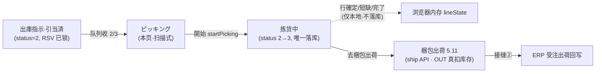
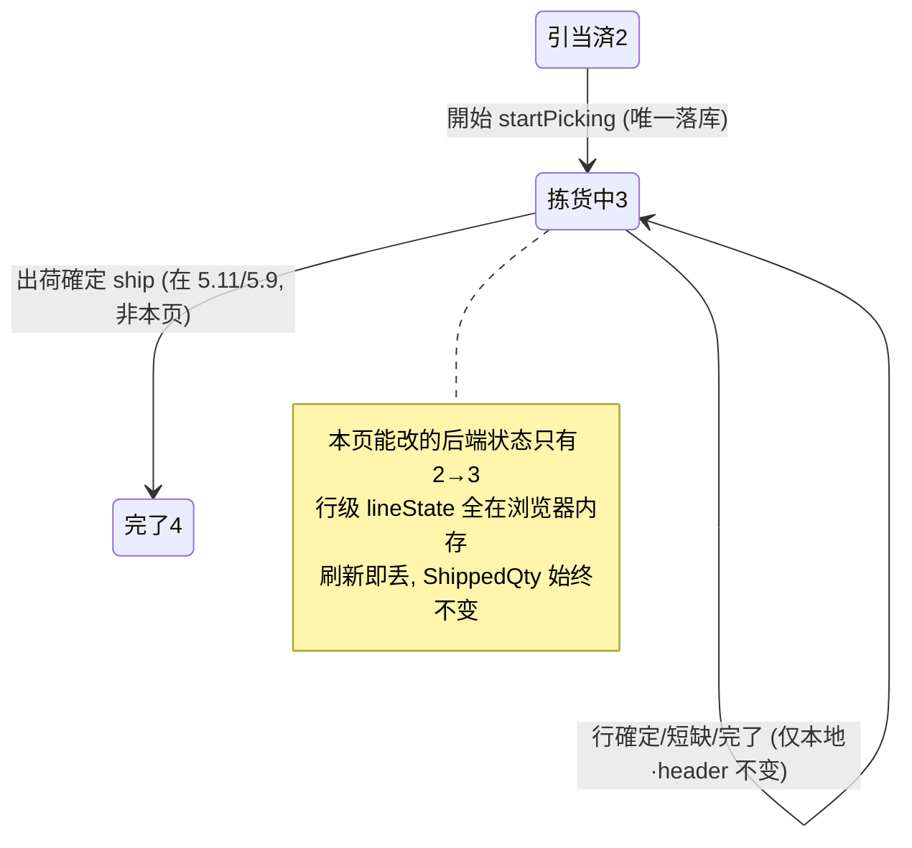

# ピッキング（拣货） 单页面操作 SOP（手把手版）

> **用途**：给**现场拣货员操作、培训老师讲、测试人员拆用例**。比模块总册（`03-库存物流WMS` §5.10，含 5.10.1a~1e）更细。
> **页面**：ピッキング（PickingWork · WM060 · 核心）　**路由**：`/wms/picking`　**前端**：`views/wms/PickingWorkView.vue`（扫描式作业台）　**API**：`api/wms/outboundOrder.ts`（共用出庫指示端点）　**后端**：`Wms/OutboundOrderController` → `OutboundService.StartPickingAsync` / `ShipAsync`
> **基准**：分支 `feat/wfs-inbox-core`，2026-06-29；后端实测 `docs/codemap-wms/03-出庫-出荷.md`（2026-06-22 权威），UI 经 agent 实读 view。
> **样例数据**：出庫指示 `OUT2026070001`（已引当 `status=2 引当済`）、製品 `PRD2026070001`、库位 `RES-C-01`、LotNo `LOT2026070001`、必要数 `5000`。
>
> ⚠️ **本页是 WMS 最易误解的一页，请先读一句话**：**这个屏幕只是"现场拣货指引板"，拣货「完了」并不出库、不扣库存、不落库——行级拣选/短缺确认全部只在浏览器内存里。真正出库在「梱包出荷」(5.11) 才发生。**

---

## 1. 页面一句话说明

**ピッキング，就是拣货员"按引当结果去库位取货"的扫描式作业台——左边一列任务队列、右边是当前任务的逐行拣货指引；点「開始」把出庫指示从"引当済"推进到"拣货中"（这是本页唯一一次真正落库），然后逐行扫库位+扫商品+填实数确认，或对缺货行做"短缺"登记。** 但请牢记：**除了「開始」，其余所有动作（行確定 / 短缺 / 完了）都只改浏览器里的本地状态，不发任何后端请求、不扣库存、不落库——真正出库要去「梱包出荷」(5.11) 或在出庫指示详情(5.9)点「出荷確定」。**

---

## 2. 这个页面在业务流程中的位置

- **上游**：已**引当済**（`status=2`）的出庫指示——引当时已发 `RSV` 锁定 `AllocatedQty`（PhysicalQty 不变）。
- **本页**：拣货员照引当回填的"库位 / 品番 / Lot / 数量"逐行取货确认；**唯一落库动作=「開始」**（header `status 2→3`）。
- **下游**：去**梱包出荷**(5.11) 或出庫指示详情(5.9) shipDialog 点「出荷確定」→ `ship` API 才发 `OUT`，**同时减 PhysicalQty + AllocatedQty**，真正出库并回写 ERP（接缝②）。

> 🔑 **核心接缝**：拣货「完了」与梱包出荷**脱钩**——本页的 `lineState`（拣了哪行、短缺多少）**不会传给出荷**；出荷按 `AllocatedQty - ShippedQty`（引当数）出货，不看拣货实绩。

---

## 3. 谁使用这个页面

| 角色 | 用途 |
|---|---|
| 现场拣货员 | 接队列任务、開始、逐行扫码拣货确认、短缺登记 |
| 仓库班组长 | 分派/核对队列优先级、跟进进度 |

---

## 4. 操作前准备

- [ ] 目标出庫指示已**引当済**（`status=2`）——引当未完成（Draft0/Confirmed1）的单**不进队列**。
- [ ] **`PartialAllocated(5)`（材料不足部分引当）也不进拣货队列**（队列只取 2、3）。
- [ ] 清楚要拣的是哪张单（如 `OUT2026070001`）、哪些行、各行库位/品番/Lot。
- [ ] 现场扫码枪可用（扫库位条码 / 扫商品条码）。
- [ ] 理解一条铁律：**本页除「開始」外不落库**——别指望"完了"会出库或写缺料表。

---

## 5. 页面区域说明

| 区域 | 内容 |
|---|---|
| 左·任务队列（md8） | 卡头「タスク一覧」+刷新按钮；空态 `el-empty`；每个任务项=出庫指示NO / 状态 tag（2=引当済绿、3=拣货中黄）/ 优先级 tag（priority=3 红「急」、priority=2 黄「↑」、=1 无）/ 客户名or指図NOor仓 / 📅予定日 |
| 右·作业区（md16）·未选任务 | `el-empty` 占位 |
| 右·作业区·头卡 | 出庫指示NO + 客户/指図NO + 进度条（已处理行/总行）+ 「開始」(status=2 显示) / 「完了」(status=3 且全行处理完显示) |
| 右·作业区·明细卡 | 每行 line-item：#行号 + 行状态 tag（引当済/✓拣货済/短缺）+ 棚番(locationCd)/商品(productCd+名)/Lot/必要数→実績数；行操作「行確定」「短缺」（仅 status=3 且行未处理时显示） |
| ピッキング確認 Dialog（500px） | 棚番(扫 scan.location)/商品(扫 scan.product)/実績数(scan.qty)；扫错弹红 alert |
| 短缺報告 Dialog（420px） | 実績数(actualQty) + 短缺理由(reason 文本域) |

---

## 6. 字段填写说明（口语版）

**ピッキング確認 Dialog（pick 弹窗）**：

| 字段 | 谁提供 | 怎么填 | 填错影响 |
|---|---|---|---|
| 棚番（扫 `scan.location`） | 现场扫码 | 扫库位条码，须 = 引当回填的 `locationCd`（如 `RES-C-01`） | ≠引当库位→红 alert「ロケ不一致」+ `pick 確定`灰 |
| 商品（扫 `scan.product`） | 现场扫码 | 扫商品条码，须 = 引当回填的 `productCd`（如 `PRD2026070001`） | ≠引当品番→红 alert「商品不一致」+ `pick 確定`灰 |
| 実績数（`scan.qty`） | 现场 | 打开弹窗默认**预填=必要数**（如 5000）；`min=0`、`max=必要数` | `qty>0` 才能确认（`canConfirmPick`）；为 0 时灰 |

**短缺報告 Dialog（short 弹窗）**：

| 字段 | 谁提供 | 怎么填 | 填错影响 |
|---|---|---|---|
| 実績数（`shortForm.actualQty`） | 现场 | 实际拣到的数（默认 0，`min0 max=必要数`） | **仅本地**：不落库、不写后端 |
| 短缺理由（`shortForm.reason`） | 现场 | 文本域填原因（如"实物破损"） | **仅本地**：⚠️ **不写 `MaterialShortage` 缺料表** |

> ⚠️⚠️ **最易误解**：短缺弹窗填的实数/理由**只存在浏览器内存里**——确认后只改本地 `lineState[lineNo]={short:true,...}` 并弹 toast，**没有任何后端调用，也不会进缺料看板**。缺料看板（MaterialShortage）的记录**只由"引当"时材料不足分支产生**，与本页无关。

---

## 7. 按钮操作说明

| 按钮 | 何时出现 / 可点 | 点了会怎样 | 是否落库 |
|---|---|---|---|
| 刷新（队列卡头） | 常显 | `reloadTasks`：并行拉 status=2 与 status=3 合并 + priority降序排序 | 否（只读） |
| 任务项（左队列） | 队列有任务 | `loadTask`：get 该单详情，重置本地 `lineState`（每行 done/short=false） | 否（只读 get） |
| 開始（右头卡） | 仅 `current.status===2` | `onStart`→`startPicking`：header `status 2→3`，成功 toast，reload+重载 | **是（唯一落库）** |
| 行確定（行操作） | `status===3` 且该行未 done/short | `openPickDialog`→扫码确认→`confirmPick`：仅改本地 `lineState[lineNo]={done:true,actualQty}`+toast | **否（仅本地）** |
| 短缺（行操作） | `status===3` 且该行未 done/short | `openShortDialog`→填实数/理由→`confirmShort`：仅改本地 `lineState[lineNo]={short:true,...}`+toast | **否（仅本地）** |
| pick 確定（弹窗内） | `canConfirmPick`（扫对+qty>0） | 同「行確定」落地：写本地 lineState | **否（仅本地）** |
| 完了（右头卡） | `status===3` 且 `allDone`（全行已 done/short） | `onComplete`：弹确认框→toast「全部完成 — {pack}へ移動」→**清空当前任务+reload** | **否（无 complete/ship 调用）** |

> 📌 **「完了」真相**：源码注释自承「ピッキング完了 — Ship/Pack 画面へ遷移するのが理想だが、ここではタスクから外す」。即「完了」**只是把这张单从屏幕上拿掉**，**不发 complete、不发 ship、不扣库存、不改 header 状态**（单仍是 `status=3`）。真正出库须另去 5.11。

---

## 8. 标准业务操作 SOP（照着点）

### 场景一：标准拣货全链（主流程）
- **背景**：一张已引当済的出庫指示，拣货员照单逐行取货。
- **样例数据**：出庫指示 `OUT2026070001`（status=2）、製品 `PRD2026070001`、库位 `RES-C-01`、Lot `LOT2026070001`、必要数 5000。
- **前置**：单已引当済（status=2，进入队列）。
- **步骤**：1) 左队列点 `OUT2026070001`（载入右作业区）；2) 右头卡点「開始」→ header `status 2→3`、toast 成功；3) 逐行点「行確定」→弹窗扫库位 `RES-C-01`+扫商品 `PRD2026070001`+确认実績数 5000→「pick 確定」（行变✓拣货済）；4) 全行 done 后头卡出现「完了」→点「完了」→确认框→toast「{pack}へ移動」→任务从屏幕移除。
- **完成后检查**：「開始」后 header 落库 `status=3`（刷新仍是 3）；行確定/短缺**只改本地**，刷新即丢；**库存数量不变**（仅引当锁定 RSV，PhysicalQty 不动）；后端 `ShippedQty` 仍为 0。
- **异常**：单非 Allocated 点開始→`WM-MSG-043`；扫错库位/品番→红 alert + pick 確定灰；qty=0→pick 確定灰。
- **可拆用例**：TC-M06-PICKING-001、003、004、010、016、020。

### 场景二：扫错拦截（防误拣）
- **背景**：拣货员扫到隔壁库位或拿错品。
- **样例数据**：行引当库位 `RES-C-01`、品番 `PRD2026070001`；误扫库位 `RES-C-99`。
- **前置**：单已開始（status=3），打开某行 pick 弹窗。
- **步骤**：1) 在棚番框扫 `RES-C-99`（≠引当 `RES-C-01`）；2) 观察红 alert「ロケ不一致」；3) 看「pick 確定」按钮。
- **完成后检查**：红 alert 显示、`canConfirmPick=false` → `pick 確定`置灰，无法确认；改回正确 `RES-C-01`+正确品番+qty>0 后 alert 消失、按钮亮。
- **异常**：商品扫错同理触发「商品不一致」红 alert；两者任一不符都灰。
- **可拆用例**：TC-M06-PICKING-005、006、007、017。

### 场景三：短缺登记（仅本地·不写缺料表）
- **背景**：某行库位实物不足，拣不满必要数。
- **样例数据**：行必要数 5000、实际只有 3200。
- **前置**：单已開始（status=3），该行未处理。
- **步骤**：1) 该行点「短缺」→弹短缺報告框；2) 填実績数 3200 + 理由"实物破损200/缺货"；3) 点确认（行变红「短缺」tag）。
- **完成后检查**：行本地 `lineState={short:true,actualQty:3200,reason}`、toast 黄色提示；**⚠️ 不写后端、不进缺料看板（MaterialShortage）、不改 `ShippedQty`**；刷新或切任务后该短缺记录**全部丢失**。
- **异常**：无（纯本地登记，无校验拦截）。
- **可拆用例**：TC-M06-PICKING-008、009、018、019。

### 场景四：切任务 / 刷新丢失本地态
- **背景**：拣到一半切去另一张单，或误刷新页面。
- **样例数据**：`OUT2026070001` 已拣 2 行 + 1 行短缺，未出荷。
- **前置**：单已開始（status=3），本地有 lineState。
- **步骤**：1) 左队列点另一张任务（或按 F5 刷新）；2) 回到 `OUT2026070001`。
- **完成后检查**：本地 `lineState` 被 `loadTask` 重置（全 false）→**之前拣货/短缺记录、短缺数量、理由全丢**；但 header `status` 仍是 3（「開始」已落库不丢）；后端 `ShippedQty` 始终 0。
- **异常**：无提示无拦截——这是设计现状（行级不持久化）。培训须强调"拣完别切走、要直接去出荷"。
- **可拆用例**：TC-M06-PICKING-012、013、021。

### 场景五：完了不出库（核心误区演示）
- **背景**：拣货员以为点了「完了」就出库扣库存了。
- **样例数据**：`OUT2026070001` 全行已 done。
- **前置**：status=3 且 allDone。
- **步骤**：1) 点「完了」→确认框→确定；2) 任务从屏幕移除；3) 去在庫照会查 `PRD2026070001`；4) 去出庫指示详情查该单状态与 `ShippedQty`。
- **完成后检查**：**库存 PhysicalQty 不变**（仍只是 RSV 锁定）；该出庫指示 **status 仍是 3（未变 Completed）**、`ShippedQty` 仍 0；说明「完了」**没出库**。真正出库要去 5.11/5.9 点「出荷確定」。
- **异常**：用户常误报"完了了为什么库存没减"——这是正确行为，须引导去出荷。
- **可拆用例**：TC-M06-PICKING-011、014、015、022。

### 场景六：衔接梱包出荷（真出库在哪）
- **背景**：拣完后完成真正出库。
- **样例数据**：`OUT2026070001`（status=3，type=2 出荷）。
- **前置**：单已開始（status=3）。
- **步骤**：1) 拣完（本页「完了」清屏，可选）；2) 去 5.11 梱包出荷，左队列按 `status=3 + outboundType=2` 取到该单；3) 填重量/carrier/tracking→「出荷確定」。
- **完成后检查**：`ship` API 逐明细发 `OUT`（**同减 PhysicalQty + AllocatedQty**）；header→Completed(4)；采梱包NO（PKG）；出荷型+WebOrderNo 触发接缝② ERP 出荷回写（`OrderDetail.ShippedQty`）。**此刻才真正出库**。
- **异常**：出荷数按 `AllocatedQty - ShippedQty`（引当数），**不看本页拣货实绩**；本页短缺数量不会传过去。
- **可拆用例**：TC-M06-PICKING-023、024、025。

---

## 9. 状态变化说明

- 本页**唯一**推进 header 状态：`Allocated(2) → Picking(3)`（「開始」）。
- "拣货完成 / 短缺"是**前端语义**，**无后端状态变化**；header 出库变 Completed(4) 发生在 5.11/5.9 的 `ship`。

---

## 10. 按钮不可用 / 灰色原因

| 现象 | 原因 |
|---|---|
| 头卡无「開始」 | `current.status≠2`（非引当済，已開始或更后） |
| 头卡无「完了」 | `!(status===3 && allDone)`——须拣货中**且全行已 done/short** |
| 行无「行確定/短缺」 | 该行已 done/short，或 `current.status≠3`（未開始） |
| 「pick 確定」灰 | `!canConfirmPick`：扫库位/品番任一≠引当回填，或 `scan.qty===0` |
| 队列里找不到某单 | 该单非 `status=2/3`（如 Draft0/Confirmed1/**PartialAllocated5**/Completed4/Cancelled9 都不进队列） |
| 找不到"出库 / 扣库存"按钮 | **本页无出库动作**，真正出库在 5.11 梱包出荷 / 5.9 详情 shipDialog |

---

## 11. 常见错误与处理

| 错误/疑问 | 原因 | 处理 |
|---|---|---|
| "完了了为什么库存没减" | 「完了」不落库不出库（仅清屏） | 去 5.11/5.9 点「出荷確定」才真出库 |
| "短缺登记了缺料看板没记录" | 短缺仅本地，**不写 MaterialShortage** | 缺料看板由"引当"材料不足分支产生，非本页 |
| "刷新后拣的全没了" | 行级不持久化（client-side） | 拣完别刷新/别切任务，直接去出荷；或理解这是设计现状 |
| 点「開始」报 `WM-MSG-043` | 单非 Allocated（已開始或状态不符） | 核对单状态，仅引当済(2)可開始 |
| 某单不在队列 | 非 status 2/3（如 PartialAllocated5） | 先处理引当/缺料；只有 2/3 进队列 |
| 任务项状态 tag 空白 | `statusMap` 只配了 2/3，其他状态渲染空（盲点） | 现状如此，队列本就只该有 2/3 |
| 「pick 確定」点不动 | 扫错或数量 0 | 扫对库位+品番、実績数>0 |

---

## 12. 操作完成后的检查清单

- [ ] 「開始」后 header 真落库 `status=3`（刷新仍为 3）——这是本页**唯一**持久化动作。
- [ ] 行確定/短缺/完了**均不落库**：刷新或切任务后本地 `lineState` 清空、短缺数量/理由丢失、后端 `ShippedQty` 不变。
- [ ] 拣货完成后**库存 PhysicalQty 不变**（仅引当 RSV 锁定 AllocatedQty）；出荷后才发 OUT 同减 Physical+Allocated。
- [ ] 短缺登记**不写 MaterialShortage 缺料表**（缺料看板由引当时产生）。
- [ ] 「完了」后该出庫指示状态**仍是 3**（未变 Completed）——真正出库/Completed 在 5.11/5.9。
- [ ] 队列只含 `status=2/3`；`PartialAllocated(5)` 不在队列。

---

## 13. 页面级测试用例（≥25 条，可执行）

> 编号 `TC-M06-PICKING-xxx`；数据用样例（`OUT2026070001`/`PRD2026070001`/`RES-C-01`/`LOT2026070001`/必要数 5000）。

| 用例编号 | 用例名称 | 优先级 | 前置条件 | 测试数据 | 操作步骤 | 预期结果 | 下游检查 | 备注 |
|---|---|---|---|---|---|---|---|---|
| TC-M06-PICKING-001 | 队列只收 status 2/3 | P0 | 有 2/3 单 | OUT2026070001 | 进页面看队列 | 仅 status=2/3 单进队列 | — | 核心 |
| TC-M06-PICKING-002 | PartialAllocated(5) 不进队列 | P0 | 有 status=5 单 | 部分引当单 | 进页面看队列 | status=5 不出现在队列 | — | 核心 |
| TC-M06-PICKING-003 | 队列排序 | P1 | 多任务 | priority/予定日 | 看队列顺序 | priority 降序 + plannedDate 升序 | — | — |
| TC-M06-PICKING-004 | 载入任务 | P1 | 队列有任务 | OUT2026070001 | 点任务项 | 右作业区载入详情、lineState 重置 | — | get 只读 |
| TC-M06-PICKING-005 | 開始落库 2→3 | P0 | status=2 | OUT2026070001 | 点「開始」 | header status 2→3、toast 成功 | 刷新仍为 3 | **唯一落库** |
| TC-M06-PICKING-006 | 非 Allocated 開始报错 | P0 | status≠2 | 已開始单 | 点「開始」 | `WM-MSG-043` | 不落库 | — |
| TC-M06-PICKING-007 | 開始按钮仅 status=2 显示 | P1 | status=3 | OUT2026070001 | 看头卡 | 无「開始」按钮 | — | — |
| TC-M06-PICKING-008 | 行確定写本地 done | P0 | status=3 | RES-C-01/PRD2026070001/5000 | 扫对+确认 | 行变✓拣货済、本地 lineState.done | **不发后端** | 核心 |
| TC-M06-PICKING-009 | 行確定不落库 | P0 | 行已 done | — | 刷新页面 | 本地 done 清空、ShippedQty 仍 0 | 后端不变 | 核心 |
| TC-M06-PICKING-010 | 扫库位不符拦截 | P0 | pick 弹窗 | 误扫 RES-C-99 | 扫错库位 | 红 alert「ロケ不一致」+確定灰 | — | — |
| TC-M06-PICKING-011 | 扫商品不符拦截 | P0 | pick 弹窗 | 误扫品番 | 扫错商品 | 红 alert「商品不一致」+確定灰 | — | — |
| TC-M06-PICKING-012 | 実績数预填=必要数 | P1 | 打开 pick 弹窗 | 必要数 5000 | 看 scan.qty | 默认预填 5000 | — | — |
| TC-M06-PICKING-013 | qty=0 不可确认 | P1 | pick 弹窗 | qty 设 0 | 看確定按钮 | `pick 確定`灰 | — | canConfirmPick |
| TC-M06-PICKING-014 | 数量上限=必要数 | P2 | pick 弹窗 | 输入>5000 | 输入超量 | 被 max=必要数 限制 | — | — |
| TC-M06-PICKING-015 | 扫对+qty>0 可确认 | P0 | pick 弹窗 | RES-C-01/PRD.../5000 | 扫对填数 | `pick 確定`亮、确认成功 | 行 done | — |
| TC-M06-PICKING-016 | 短缺登记仅本地 | P0 | status=3 行未处理 | 实数3200+理由 | 短缺→填→确认 | 行变红短缺 tag、本地 short | **不发后端** | 核心 |
| TC-M06-PICKING-017 | 短缺不写缺料表 | P0 | 已短缺 | — | 查 MaterialShortage | 无新增缺料记录 | 缺料看板 | 核心盲点 |
| TC-M06-PICKING-018 | 短缺数量/理由刷新丢失 | P1 | 已短缺 | — | 刷新 | 短缺数量/理由全丢 | 后端不变 | — |
| TC-M06-PICKING-019 | 切任务丢本地态 | P1 | 已拣部分行 | 另一任务 | 切到别单再回 | 本地 lineState 重置全丢 | header 仍 3 | — |
| TC-M06-PICKING-020 | 完了按钮显隐 | P1 | status=3 | — | 部分行未处理 | 无「完了」；全处理后才显 | — | allDone |
| TC-M06-PICKING-021 | 完了不出库 | P0 | status=3 allDone | OUT2026070001 | 点「完了」 | 清屏 reload、无 ship 调用 | status 仍 3 | **核心** |
| TC-M06-PICKING-022 | 完了后库存不变 | P0 | 已完了 | PRD2026070001 | 查在庫照会 | PhysicalQty 不变（仅 RSV） | 库存 | 核心 |
| TC-M06-PICKING-023 | 完了后 ShippedQty=0 | P0 | 已完了 | OUT2026070001 | 查出庫指示详情 | ShippedQty 仍 0、status 3 | 详情 | — |
| TC-M06-PICKING-024 | 行/短缺仅 status=3 可点 | P1 | status=2（未開始） | — | 看行操作 | 无「行確定/短缺」 | — | — |
| TC-M06-PICKING-025 | 已处理行无操作 | P2 | 行已 done/short | — | 看该行 | 无「行確定/短缺」按钮 | — | — |
| TC-M06-PICKING-026 | 进度条计算 | P2 | 多行 | 已处理2/总5 | 看进度 | 进度=已处理/总行 % | — | — |
| TC-M06-PICKING-027 | 衔接出荷真出库 | P0 | status=3 type=2 | OUT2026070001 | 去5.11出荷確定 | OUT 同减 Physical+Allocated、→Completed | 接缝② | 真出库 |
| TC-M06-PICKING-028 | 出荷按引当数非拣货实绩 | P1 | 有短缺登记 | 短缺3200 | 去出荷确认 | 出荷数=Allocated-Shipped（非3200） | 脱钩 | 关键 |
| TC-M06-PICKING-029 | statusMap 缺档渲染空 | P2 | — | 非2/3状态 | 看 tag | 其他状态 tag 渲染空 | — | 现状盲点 |
| TC-M06-PICKING-030 | 空队列空态 | P3 | 无2/3单 | — | 进页面 | el-empty「タスクなし」 | — | — |

---

## 14. 培训讲解建议

| 顺序 | 讲什么 | 演示 | 易误解点 |
|---|---|---|---|
| 1 | 这页是"拣货指引板"不是出库口 | §2 流程图 | 以为完了就出库 |
| 2 | 队列只收 2/3 | 看队列 | 找不到 status=5 的单 |
| 3 | 「開始」是唯一落库 | 開始后刷新仍为 3 | 以为每步都落库 |
| 4 | 行確定/短缺只在浏览器 | 拣后刷新→全丢 | 以为后端记了 |
| 5 | 短缺≠缺料看板 | 讲两者来源 | 以为短缺写了缺料表 |
| 6 | 真出库在 5.11 | 演示出荷確定扣库存 | 完了后库存不变是正常的 |
| 7 | 拣货与出荷脱钩 | 出荷用引当数非拣货实绩 | 以为短缺数会传到出荷 |

---

## 15. 与模块级手册的关系

对应 `03-库存物流WMS-...md` §5.10（含 5.10.1a~1e 业务前置/字段口径/灰按钮/完成后检查/SOP 场景）。下游出荷见 §5.11 梱包出荷、引当见 §5.9 出庫指示。错误码 `WM-MSG-043`（状态守卫）见 §5.10.8。

---

## 16. 代码与文档来源

| 层 | 文件 |
|---|---|
| 逐行源码手册 | `docs/codemap-wms/03-出庫-出荷.md`（权威·2026-06-22；含"拣货行级无后端持久化"关键发现） |
| 前端 view | `views/wms/PickingWorkView.vue`（扫描式·行级不落库） |
| API/类型 | `api/wms/outboundOrder.ts`（startPicking/ship 共用端点）、`types/wms/wms.ts`（OutboundOrder/Detail、priority 注释） |
| 后端 | `Controllers/Wms/OutboundOrderController.cs`、`Services/Wms/OutboundService.cs`（`StartPickingAsync` 302 仅 Allocated 可、`ShipAsync` 449 真出库） |
| 铁律 | `Services/Wms/StockMovementService.cs`（RSV 只动 AllocatedQty 243 / OUT 同减 Physical+Allocated 229） |
| 状态枚举 | `DomainModels/Wms/WmsTxnType.cs`（OutboundOrderStatus：Allocated=2/Picking=3/Completed=4/PartialAllocated=5） |
| i18n | `i18n/keys.generated.ts`（`wms.pick.*`；`t('急')`、`t('{pack}へ移動')` 为明文 key，现状） |

---

## 最后更新来源

- 代码：见 §16（codemap-wms 03 权威 + view 实读 + api/types 核对）。
- 基准：分支 `feat/wfs-inbox-core`，2026-06-29（codemap 2026-06-22）。
- 覆盖：16 节 / 6 场景（含可拆用例）/ 30 用例（TC-M06-PICKING-001~030）。
- 诚实标注盲点：①行级拣选/短缺/完了均不落库（仅本地 lineState）；②短缺不写 MaterialShortage 缺料表；③statusMap 只配 2/3 其他状态 tag 渲染空；④`t('急')`/`t('{pack}へ移動')` 为明文 i18n key；⑤拣货与出荷脱钩（出荷按引当数非拣货实绩）。
</content>
</invoke>
