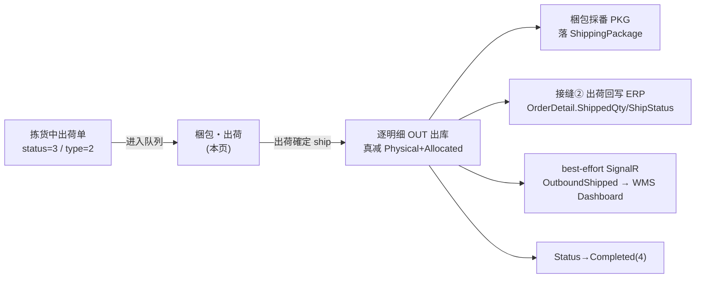
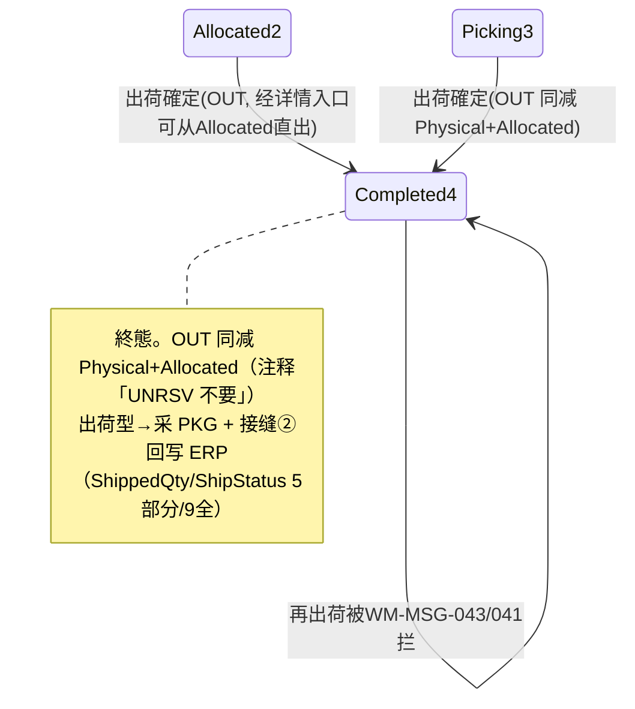

# 梱包・出荷 单页面操作 SOP（手把手版）

> **用途**：给**现场出荷担当操作、培训老师讲、测试人员拆用例**。比模块总册（`03-库存物流WMS` §5.11）更细。
> **页面**：梱包・出荷（PackingShip · WM070 · 核心 · 库存物流 WMS）　**路由**：`/wms/packaging`　**前端**：`views/wms/PackingShipView.vue`　**API**：`api/wms/outboundOrder.ts outboundOrderApi.ship`　**后端**：`Wms/OutboundOrderController` → `OutboundService.ShipAsync`
> **基准**：分支 `feat/wfs-inbox-core`，2026-06-28；后端实测 `docs/codemap-wms/03-出庫-出荷.md`（2026-06-22 权威，含 ShipAsync `OutboundService.cs:449-532`、接缝② `ErpBridgeHook.cs:26-134`），UI 经实读 view。
> **样例数据**：出庫指示 `OUT2026070001`（拣货中 status=3、出荷型 outboundType=2）、製品 `PRD2026070001`、库位 `RES-C-01`、客户 `CUST-A`、来源 Web受注 `WO20260701000001`、carrier `YAMATO`、出荷后采番 `PKG2026070001`。

---

## 1. 页面一句话说明

**梱包・出荷，就是把"拣货中的出荷单"打包、填运送信息、按一下绿色「出荷確定」真正发货的台子——左边是待梱包队列（固定只看 status=3 拣货中 + outboundType=2 出荷型），右边填梱包表单。点一下「出荷確定」，系统就逐明细做 `OUT` 出库（同时真减 Physical 和 Allocated 库存）、生成梱包NO（PKG）、并把出荷数回写 ERP 受注（接缝②）。** 它是出荷类订单"真正减库存、真正发出去"的唯一确定口。

---

## 2. 这个页面在业务流程中的位置

- **上游**：拣货中（status=3）且出荷型（outboundType=2）的出庫指示。引当（接缝①）→開始拣货后落到此队列。
- **本页**：梱包 + 出荷確定。一点 `ship` 完成"出库 + 采 PKG + 回写"。
- **下游**：库存真减（在庫照会可验）、ERP 受注出荷回写、运送便/Carrier（弱关联）、WMS Dashboard。

---

## 3. 谁使用这个页面

| 角色 | 用途 |
|---|---|
| 出荷担当（现场） | 选待梱包单、填重量/件数/carrier/追跡号、按「出荷確定」 |
| 仓库班组长 | 核对历史、复核部分出荷/分批出荷进度 |

---

## 4. 操作前准备

- [ ] 目标出庫指示已到 **拣货中（status=3）** 且为 **出荷型（outboundType=2）**——只有这两条同时满足才会出现在左队列（材料出庫 type=1 **不走此页**）。
- [ ] 明确出荷数口径：本页按 **引当数出货**，出荷数 = `AllocatedQty − ShippedQty`（**不是**拣货实绩，本页用 `allocatedQty` 而非拣货页的 lineState，与拣货页**脱钩**）。
- [ ] 准备好梱包实测信息：件数（CaseQty）、重量（Kg）、体积（m³）、運送業者、追跡番号。
- [ ] 若要触发 ERP 出荷回写（接缝②）：该单须为出荷型且 header 有 `WebOrderNo`（如 `WO20260701000001`）。

---

## 5. 页面区域说明

| 区域 | 内容 |
|---|---|
| 左·待梱包队列卡（md9） | 列出 `status=3 + outboundType=2` 的出荷单；每项显示 出庫指示NO / 状态 tag（拣货中 warning）/「急」tag（priority=3 danger）/ 客户名或工单号 / 明细条数；右上「刷新」。空态显 empty。 |
| 右·头卡（md15 顶部） | 选中单后显示 出庫指示NO + 客户名/工单号 + 明细条数 tag。未选单时整右侧显 empty。 |
| 右·商品列表卡 | 只读明细表：行№ / 製品CD / 製品名 / ロット / 库位 / 数量（**显示 `allocatedQty`**）。max-height 300。 |
| 右·梱包入力フォーム | パッケージNo(自動,只读) / CaseQty / 重量Kg / Volume m³ / 運送業者(下拉) / 追跡番号(带「採番」按钮) / 備考(textarea)；底部绿色大「出荷確定」按钮（高 56px）。 |
| 底·履歴卡 | 直近出荷済パッケージ表：梱包NO / 出庫指示NO / Cases / 重量 / 運送業者 / 追跡番号 / Departure。右上「刷新」。**直连 `http.get('/wms/shipping/packages')`**（绕过 api 模块，见 §11 盲点）。 |

---

## 6. 字段填写说明（口语版）

**梱包入力フォーム**（按出荷确定提交）：

| 字段 | 谁提供 | 怎么填 | 填错影响 |
|---|---|---|---|
| パッケージNo（autoPkgNo） | 系统 | **只读**（disabled），出荷确定**后**回填采番结果（如 `PKG2026070001`）；提交前显「—」 | — |
| CaseQty | 现场 | 默认 = 明细条数；`min=1`，整数 | <1 被 input-number 卡住 |
| 重量Kg（totalWeightKg） | 现场 | 实测，`min=0`，精度 3 位 | — |
| Volume m³（totalVolumeM3） | 现场 | 实测，`min=0`，精度 4 位 | — |
| 運送業者（carrierCd） | 现场 | 下拉：YAMATO/SAGAWA/JP/SELF/OTHER；选单时默认取该单 `carrierCd`，无则缺省 `YAMATO`；可清空 | 空则不传 carrier（PKG 记录 carrier 为空） |
| 追跡番号（trackingNo） | 现场/系统 | 手填（≤50），或点输入框右侧「採番」自动生成 `carrierCd-YYYYMMDD-随机6位`（如 `YAMATO-20260701-573201`） | — |
| 備考（remarks） | 现场 | 自由文本（textarea 2 行） | — |

> ⚠️ **数量口径**：右侧商品列表"数量"列显示的是 `allocatedQty`（引当数）。实际出荷数 = `AllocatedQty − ShippedQty`，由后端逐明细计算，**不取拣货实绩**。

---

## 7. 按钮操作说明

| 按钮 | 何时出现/可用 | 点了会怎样 |
|---|---|---|
| 队列「刷新」 | 左卡常显 | 重新拉 `status=3 + outboundType=2` 列表（`pageSize:50`） |
| 队列项（点击） | 列表项 | 加载该单明细到右侧；carrier 取单上或 YAMATO；CaseQty 置明细条数；重量/体积/追跡/備考清空 |
| 採番（追跡号） | 梱包表单常显 | 本地生成 `carrierCd-YYYYMMDD-随机6位` 填入追跡番号（纯前端，不调后端） |
| **出荷確定** | 已选单时可用 | 弹确认框→调 `ship` API：逐明细 `OUT` 真减库存 + 采 PKG + 回写 ERP；成功后回填 PKG 号 + toast + 该单移出队列 + 刷新历史 |
| 履歴「刷新」 | 历史卡常显 | 重新拉 `/wms/shipping/packages`（`page:1,pageSize:30`） |

> 未选队列项时右侧为空态，没有可点的「出荷確定」。パッケージNo 框**永久只读**（系统采番）。

---

## 8. 标准业务操作 SOP（照着点）

### 场景一：标准出荷確定（主流程）
- **背景**：一张拣货中的出荷单要打包发货。
- **样例数据**：出庫指示 `OUT2026070001`（status=3、type=2）、製品 `PRD2026070001`、库位 `RES-C-01`、客户 `CUST-A`、carrier `YAMATO`。
- **前置**：该单 status=3（拣货中）且 outboundType=2（出荷型），已在左队列出现。
- **步骤**：1) 左队列点选 `OUT2026070001`；2) 右侧核对商品列表（数量=allocatedQty）；3) 填 CaseQty（默认=明细条数）/重量Kg/Volume m³；4) 選運送業者 `YAMATO`；5) 填或「採番」追跡番号；6) 按绿色「出荷確定」→确认框点确定。
- **完成后检查**：① 弹出 toast 含采番 PKG 号（`PKG2026070001`），autoPkgNo 框回填；② 该单从左队列消失；③ 履歴卡刷新出现新 PKG 行；④ 去在庫照会该批 → `PhysicalQty` 和 `AllocatedQty` **同减**、行有 `OUT` tag（`ShipTxnNo`）；⑤ header Status→Completed(4)。
- **异常**：状态非 Allocated/Picking→`WM-MSG-043`；无可出明细→`WM-MSG-041`；header 不存在→`WM-MSG-070`。
- **可拆用例**：TC-M06-SHIP-001~006、009、010。

### 场景二：追跡番号自動採番
- **背景**：现场没有运单号，要系统先占一个。
- **样例数据**：carrier `YAMATO`。
- **前置**：已选单、已选運送業者。
- **步骤**：1) 选 carrier `YAMATO`；2) 点追跡番号框右侧「採番」；3) 生成 `YAMATO-20260701-573201` 自动填入；4) 出荷確定。
- **完成后检查**：追跡番号随 PKG 落 `ShippingPackage`；履歴卡可见该追跡号。
- **异常**：採番纯前端生成，不调后端；换 carrier 后再採番前缀随之变化。
- **可拆用例**：TC-M06-SHIP-011、012。

### 场景三：接缝②出荷回写 ERP 受注
- **背景**：出荷型且来源 Web 受注的单，出荷后要回写 ERP。
- **样例数据**：`OUT2026070001`、WebOrderNo `WO20260701000001`、製品 `PRD2026070001`。
- **前置**：该单 outboundType=2 且 header 有 `WebOrderNo`。
- **步骤**：1) 选单出荷確定；2) 完成后去 ERP 受注按 `WO20260701000001` 查。
- **完成后检查**：`OnShipmentConfirmedAsync` 按製品CD充当 `OrderDetail.ShippedQty`、`ShipStatus`（5=部分出荷 / 9=全出荷）、`LastOutboundNo`；ヘッダ rollup `order.ShipStatus`；注文追溯有出荷回写事件（Success）。**幂等靠累计 `ShippedQty`**。
- **异常**：回写是 best-effort（try/catch），失败不阻断出荷；任一前置（OutboundOrder/Order/出荷数明细）为空→事件 Skipped。
- **可拆用例**：TC-M06-SHIP-013、014、015。

### 场景四：部分出荷 / 分批出荷复核
- **背景**：一张单分两次出货。
- **样例数据**：明细引当 100、首次出 60、二次出 40。
- **前置**：首次出荷后单若仍可再出（视引当与已出荷量）。
- **步骤**：1) 第一次出荷確定（出荷数=Allocated−Shipped=60）；2) 后续再进入（如经出庫指示详情 shipDialog）；3) 第二次出荷（出荷数=40）。
- **完成后检查**：每次出荷数=`AllocatedQty − ShippedQty`；ERP `OrderDetail.ShippedQty` 累计增长，`ShipStatus` 由 5（部分）→ 9（全出）。
- **异常**：`ShipAsync` 取 `d.ShippedQty < d.AllocatedQty` 的明细，全部出完后无可出明细→`WM-MSG-041`。
- **可拆用例**：TC-M06-SHIP-016、017、018。

### 场景五：两入口共用 ship 端点
- **背景**：同一张单既能在本页出荷，也能在出庫指示详情页出荷。
- **样例数据**：`OUT2026070001`。
- **前置**：单 status 为 Allocated(2) 或 Picking(3)。
- **步骤**：1) 也可在 `/wms/outbound-order` 详情（`canShip = status 2||3`）点「出荷確定」走 shipDialog；2) 二者都调同一 `POST /{no}/ship`。
- **完成后检查**：无论哪个入口，结果一致（OUT + 采 PKG + 回写）；详情口径见模块手册 §5.9。
- **异常**：详情入口允许 status=2（Allocated，未经拣货）直接出荷；本页队列只收 status=3。
- **可拆用例**：TC-M06-SHIP-019、020。

### 场景六：状态守卫与异常拦截
- **背景**：误对已完了/非法状态的单点出荷。
- **样例数据**：已 Completed(4) 的单、不存在的 NO。
- **前置**：无。
- **步骤**：1) 尝试对 Completed 单出荷（经详情入口）；2) 对不存在 NO 调 ship。
- **完成后检查**：状态非 Allocated/Picking→`WM-MSG-043`；header 不存在→`WM-MSG-070`；无可出明细→`WM-MSG-041`；前端 catch `e.response.data.message` 弹错误 toast，单不出荷。
- **异常**：确认框取消→静默不报错。
- **可拆用例**：TC-M06-SHIP-021、022、023。

---

## 9. 状态变化说明

- 本页左队列只装 **Picking(3)**；详情入口还允许 **Allocated(2)** 直接出荷。
- 出荷確定后→ **Completed(4)**，终态，不可再出荷（再点被状态守卫拦）。

---

## 10. 按钮不可用 / 灰色原因

| 现象 | 原因 |
|---|---|
| 左队列空（empty） | 没有 `status=3 + outboundType=2` 的单（材料出庫 type=1 不在此页） |
| 右侧整体空态、无「出荷確定」 | 未选队列项 |
| パッケージNo 框不可输入 | 永久只读，系统采番（出荷后回填） |
| 找不到材料出庫单 | 本页固定只查出荷型；材料出庫请走出庫指示一覧/详情 |
| 出荷確定报 `WM-MSG-043` | 单状态非 Allocated/Picking（如已 Completed/Draft/Confirmed） |
| 出荷確定报 `WM-MSG-041` | 该单已无 `ShippedQty<AllocatedQty` 的可出明细 |

---

## 11. 常见错误与处理

| 错误 | 原因 | 处理 |
|---|---|---|
| `WM-MSG-043` | 状态非 Allocated/Picking（出荷確定守卫） | 确认单状态；已 Completed 不可再出 |
| `WM-MSG-041` | 无可出明细（全部 ShippedQty≥AllocatedQty） | 该单已出完，无需再出 |
| `WM-MSG-070` | header 不存在（NO 错） | 核对出庫指示NO |
| 出荷数对不上拣货实绩 | **本页与拣货页脱钩**，按 `AllocatedQty` 出货，非拣货 lineState（拣货页行级本就不落库） | 以引当数为准；差异在拣货阶段调整引当 |
| ERP 受注没看到回写 | 该单非出荷型或 header 无 `WebOrderNo`；或回写 best-effort 失败（Skipped/Failed） | 确认 type=2 + WebOrderNo；查注文追溯事件状态 |
| 历史不刷新/报错 | 履歴**直连 `http.get('/wms/shipping/packages')`，绕过 api 模块**；接口异常被 catch 吞掉 | 点历史「刷新」重试；后端 `ShippingController` 仅只读 |
| 想改已出荷的 PKG | 梱包记录由 `ShipAsync` 内部创建，本页无改/删入口 | append 性质，错了走业务流程冲正 |

---

## 12. 操作完成后的检查清单

- [ ] 出荷確定成功 toast（含采番 PKG 号，如 `PKG2026070001`），autoPkgNo 框回填。
- [ ] 逐明细 `OUT` 真减库存：在庫照会该批 `PhysicalQty` 和 `AllocatedQty` **同减**，行有 `OUT` tag（`ShipTxnNo`）（注释「UNRSV 不要」）。
- [ ] header Status→Completed(4)；该单移出左队列。
- [ ] 出荷型生成梱包记录落 `ShippingPackage`；履歴卡刷新可见（PKG/carrier/tracking/departureTime）。
- [ ] **接缝②（出荷型+WebOrderNo）**：ERP 受注 `OrderDetail.ShippedQty` 充当、`ShipStatus`（5部分/9全），注文追溯有出荷回写事件；幂等靠累计 `ShippedQty`。
- [ ] best-effort SignalR `OutboundShipped` 推 WMS Dashboard（失败不阻断）。
- [ ] 出荷数=`AllocatedQty − ShippedQty`（按引当数，非拣货实绩）。

---

## 13. 页面级测试用例（≥25 条，可执行）

> 编号 `TC-M06-SHIP-xxx`；数据用样例（`OUT2026070001` / `PRD2026070001` / `RES-C-01` / `CUST-A` / `WO20260701000001` / `YAMATO` / `PKG2026070001`）。

| 用例编号 | 用例名称 | 优先级 | 前置条件 | 测试数据 | 操作步骤 | 预期结果 | 下游检查 | 备注 |
|---|---|---|---|---|---|---|---|---|
| TC-M06-SHIP-001 | 队列固定 status3+type2 | P0 | 有出荷型拣货中单 | OUT2026070001 | 进页面看左队列 | 仅列 status=3 且 type=2 的单 | 材料出庫(type1)不出现 | 队列口径 |
| TC-M06-SHIP-002 | 选单加载明细 | P0 | 队列有单 | OUT2026070001 | 点队列项 | 右侧载头卡+商品列表 | 数量列显 allocatedQty | — |
| TC-M06-SHIP-003 | 商品列表显引当数 | P0 | 已选单 | allocated=100 | 看数量列 | 显 allocatedQty 非拣货实绩 | 与拣货脱钩 | 核心 |
| TC-M06-SHIP-004 | CaseQty 默认=明细条数 | P1 | 已选单 | 3 明细 | 看 CaseQty | 默认填 3 | min=1 | — |
| TC-M06-SHIP-005 | carrier 默认取单/YAMATO | P1 | 已选单 | 单无carrier | 看運送業者 | 缺省 YAMATO | 单上有则取单 | — |
| TC-M06-SHIP-006 | 标准出荷確定 | P0 | status3+type2 | 全字段填妥 | 出荷確定→确认 | OUT 真减库存+采 PKG | Status→Completed(4) | 主流程 |
| TC-M06-SHIP-007 | OUT 同减 Physical+Allocated | P0 | 已出荷 | OUT2026070001 | 查在庫照会 | Physical 与 Allocated 同减 | 注释「UNRSV 不要」 | 铁律 |
| TC-M06-SHIP-008 | ShipTxnNo 显 OUT tag | P1 | 已出荷 | — | 查在庫照会该批 | 行有 OUT tag(ShipTxnNo) | — | — |
| TC-M06-SHIP-009 | 采番 PKG 回填 | P0 | 出荷型出荷 | — | 出荷確定后 | toast 含 PKG 号、autoPkgNo 回填 | 落 ShippingPackage | — |
| TC-M06-SHIP-010 | 出荷后移出队列+刷历史 | P1 | 已出荷 | — | 出荷確定后 | 该单消失、履歴新增行 | — | — |
| TC-M06-SHIP-011 | 追跡号自動採番 | P1 | 已选 carrier | YAMATO | 点「採番」 | 生成 YAMATO-YYYYMMDD-rnd | 纯前端 | — |
| TC-M06-SHIP-012 | 採番前缀随 carrier 变 | P2 | 已选单 | 换 SAGAWA | 改 carrier 后採番 | 前缀=SAGAWA | — | — |
| TC-M06-SHIP-013 | 接缝②回写 ShippedQty | P0 | 出荷型+WebOrderNo | WO20260701000001 | 出荷確定后查 ERP | OrderDetail.ShippedQty 充当 | 按製品CD分组 | 接缝② |
| TC-M06-SHIP-014 | ShipStatus 5部分/9全 | P0 | 出荷型 | 部分/全出 | 出荷确定后查 ERP | 部分→5、全出→9 | ヘッダ rollup | — |
| TC-M06-SHIP-015 | 回写幂等累计 | P1 | 分批出荷 | 60+40 | 两次出荷 | ShippedQty 累计、不重复 | 幂等靠累计 | — |
| TC-M06-SHIP-016 | 出荷数=Allocated-Shipped | P0 | 已部分出荷 | allocated100/shipped60 | 再出荷 | 本次出荷数=40 | 非拣货实绩 | 核心口径 |
| TC-M06-SHIP-017 | 分批出荷复核 | P1 | 多批 | 60→40 | 两次出荷確定 | 累计=100、ShipStatus 5→9 | ERP | — |
| TC-M06-SHIP-018 | 全部出完无可出明细 | P1 | 已全出 | — | 再出荷 | WM-MSG-041 | 不落库 | — |
| TC-M06-SHIP-019 | 两入口共用 ship | P1 | status2/3 | OUT2026070001 | 在详情 shipDialog 出荷 | 同 ship 端点、结果一致 | §5.9 | — |
| TC-M06-SHIP-020 | 详情可从 Allocated 直出 | P2 | status=2 | — | 详情出荷 | Allocated 也可出荷 | 本页队列只收3 | 差异 |
| TC-M06-SHIP-021 | 状态守卫 WM-MSG-043 | P0 | Completed 单 | — | 再出荷 | WM-MSG-043 | 不落库 | — |
| TC-M06-SHIP-022 | header 不存在 WM-MSG-070 | P1 | — | 错NO | 调 ship | WM-MSG-070 | — | — |
| TC-M06-SHIP-023 | 确认框取消静默 | P2 | 已选单 | — | 出荷確定→取消 | 不报错、不出荷 | — | — |
| TC-M06-SHIP-024 | best-effort SignalR 推送 | P2 | 已出荷 | — | 出荷確定后看 Dashboard | OutboundShipped 推送 | 失败不阻断 | — |
| TC-M06-SHIP-025 | 重量/体积精度 | P2 | 已选单 | 1.234/0.0567 | 填重量/体积 | 重量3位、体积4位 | min=0 | — |
| TC-M06-SHIP-026 | 履歴直连 http | P2 | 有出荷历史 | — | 看/刷历史 | 调 /wms/shipping/packages | 绕过 api 模块 | 盲点 |
| TC-M06-SHIP-027 | 队列空态 | P2 | 无符合单 | — | 进页面 | 显 empty | — | — |
| TC-M06-SHIP-028 | パッケージNo 只读 | P2 | 已选单 | — | 试改 PKG 框 | 不可输入(disabled) | 系统采番 | — |
| TC-M06-SHIP-029 | 网络异常友好提示 | P2 | 断网 | — | 出荷確定 | 弹错误 toast 可重试 | 不出荷 | — |
| TC-M06-SHIP-030 | 权限不足 | P2 | 无权账号 | — | 进页面/出荷 | 待业务确认(隐藏/拒绝) | — | 权限 |

---

## 14. 培训讲解建议

| 顺序 | 讲什么 | 演示 | 易误解点 |
|---|---|---|---|
| 1 | 这页是出荷"真正发货"的确定口 | §2 流程图 | 以为只是打印面单 |
| 2 | 左队列固定 status3+type2 | 看队列只有出荷型 | 以为材料出庫也在这 |
| 3 | 出荷数=引当数，与拣货脱钩 | 商品列表数量列 | 以为按拣货实绩出 |
| 4 | 出荷確定 = OUT 同减 Physical+Allocated | 出荷后看在庫照会 | 以为还要单独 UNRSV |
| 5 | 出荷型会采 PKG + 回写 ERP | 看 PKG 号 + ERP ShippedQty | 以为出荷与受注脱节 |
| 6 | 部分出荷靠累计 ShippedQty 幂等 | 分批演示 5→9 | 以为会重复回写 |
| 7 | 历史绕过 api 直连 http（现状） | 讲盲点 | 以为走统一 api 模块 |

---

## 15. 与模块级手册的关系

对应 `03-库存物流WMS-最详细用户操作培训手册.md` §5.11（含 5.11.1a~1e：业务前置/字段口径/灰按钮/完成后下游/场景 SOP）。本页同源后端 `OutboundService.ShipAsync`（`OutboundService.cs:449-532`）+ 接缝② `ErpBridgeHook.OnShipmentConfirmedAsync`（`ErpBridgeHook.cs:26-134`），逐字见 `docs/codemap-wms/03-出庫-出荷.md`（§「⭐ 梱包/出荷確定 Ship（接缝②）」+ 专章五接缝②）。

---

## 16. 代码与文档来源

| 层 | 文件 |
|---|---|
| 逐行源码手册 | `docs/codemap-wms/03-出庫-出荷.md`（权威，Ship `OutboundService.cs:449`、接缝② `:525-529`、铁律 OUT `StockMovementService.cs:229-231`） |
| 前端 view | `views/wms/PackingShipView.vue`（左队列 status3+type2、右梱包表单、履歴直连 http、`genTracking`/`onShip`） |
| API/类型 | `api/wms/outboundOrder.ts`（`ship(no,req)` → `{packageNo}`）、`types/wms/wms.ts`（`ShipRequest`/`OutboundOrder`） |
| 后端核心 | `Controllers/Wms/OutboundOrderController.cs`、`Services/Wms/OutboundService.cs`（`ShipAsync` 449-532：状态守卫→逐明细 OUT→采 PKG→回写） |
| 铁律 | `Services/Wms/StockMovementService.cs`（OUT 同减 Physical+Allocated 229-231） |
| 接缝② | `Services/Wms/ErpBridgeHook.cs`（`OnShipmentConfirmedAsync` 26-134：按製品CD充当 ShippedQty/ShipStatus，幂等累计） |
| 历史只读 | `Controllers/Wms/ShippingController.cs`（仅只读 `/wms/shipping/packages`，梱包记录由 ShipAsync 内部创建） |
| 实体 | `DomainModels/Wms/OutboundOrder.cs`、`OutboundOrderDetail.cs`（WarehouseCd 实引当仓、ShippedQty/ShipTxnNo）、`ShippingPackage.cs`（PKG） |

---

## 最后更新来源

- 代码：见 §16（codemap-wms 03 权威 + PackingShipView.vue 实读 + outboundOrder.ts/ShipAsync）。
- 基准：分支 `feat/wfs-inbox-core`，2026-06-28（codemap 2026-06-22）。
- 覆盖：16 节 / 6 场景 / 30 用例（TC-M06-SHIP-001~030）。
- 诚实标注：①历史读 `/wms/shipping/packages` 绕过 api 模块直连 http；②本页与拣货页脱钩，用 `allocatedQty` 而非拣货实绩 lineState；③材料出庫(type1)不在此页，`ShippingController` 仅只读、梱包记录由 `ShipAsync` 内部创建；④接缝②回写为 best-effort（失败 Skipped/Failed 不阻断出荷）。
