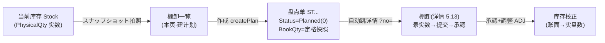
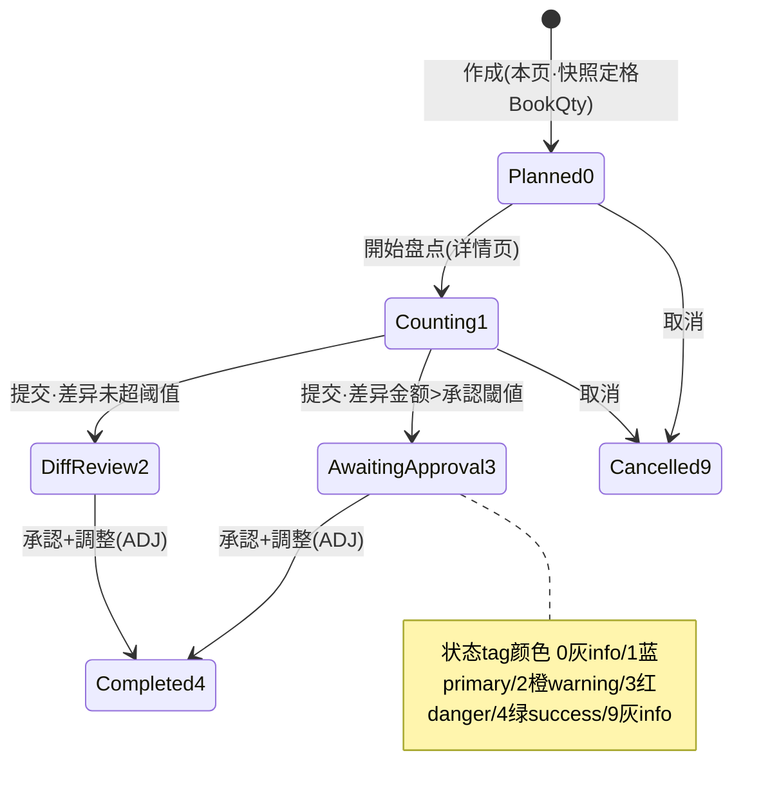

# 棚卸一覧 单页面操作 SOP（手把手版）

> **用途**：给**仓管/盘点负责人操作、培训老师讲、测试人员拆用例**。比模块总册（`03-库存物流WMS` §5.12）更细。
> **页面**：棚卸一覧（StockTakeList · WM090 · 库存物流 WMS）　**路由**：`/wms/stock-take-list`（详情跳 `/wms/stock-take?no=`）　**前端**：`views/wms/StockTakeListView.vue`　**API**：`api/wms/stockTake.ts stockTakeApi`　**后端**：`Wms/StockTakeController` → `StockTakeService.CreatePlanAsync`
> **基准**：分支 `feat/wfs-inbox-core`，2026-06-29；后端实测 `docs/codemap-wms/04-棚卸-補充-期限-QC.md`（2026-06-22 权威，§1.1 计划/快照创建），UI 经实读 view。
> **样例数据**：棚卸 `ST2026070001`、倉庫 `W01`、库位前缀 `RES-`、製品 `PRD2026070001`、承認閾値 `¥50000`。

---

## 1. 页面一句话说明

**棚卸一覧，就是查所有"盘点计划单"的台账，并且是新建一张盘点计划的唯一入口——点「スナップショット」填好范围（仓/库位前缀/品番）点「作成」，系统把当前库存的实际数量"拍照定格"成账面数（BookQty），生成一张 Planned 状态的盘点单，然后自动跳到详情页（5.13）开始录实盘数。** 这一步**只建单、只拍照，绝不动库存**——真正改库存要等详情页「承認+調整」。

---

## 2. 这个页面在业务流程中的位置

- **上游**：当前在庫数据（Stock 表，`PhysicalQty` 实际数量）。
- **本页**：列出盘点单台账 + 检索 + 建计划（快照定格账面）。**不动库存**。
- **下游**：建好直接跳 5.13 棚卸详情录入；真正改库存（ADJ 调整）在详情页「承認」阶段。

---

## 3. 谁使用这个页面

| 角色 | 用途 |
|---|---|
| 仓库管理员 / 仓管 | 发起盘点、建快照计划 |
| 盘点负责人 | 规划盘点范围（全棚/循环/临时）、设承认阈值 |
| 测试 / 培训 | 拆用例、讲台账与快照机制 |

---

## 4. 操作前准备

- [ ] 明确本次盘点范围：哪个**倉庫**（必填，如 `W01`）、是否限定**库位前缀**（如 `RES-` 只盘保管棚）、是否限定**单一品番**（如 `PRD2026070001`）。
- [ ] 确认该范围内**确有库存**——快照查询 0 件后端会抛错建不出单。
- [ ] 想清楚是否需要**承認閾値**：差异金额超过该值，提交时会进"承認待"需上级审批（如 `¥50000`）。
- [ ] 知道建单**不改库存**，只是把当前实数定格成账面数，后续在详情页录真实盘点数对比。

---

## 5. 页面区域说明

| 区域 | 内容 |
|---|---|
| 检索卡 | 4 个检索条件：棚卸NO / 種別 / 状態 / 倉庫 + 「検索」按钮 + 「スナップショット」按钮（开建计划弹窗） |
| 盘点单列表 | 表格列：棚卸NO / 種別 / 状態 tag / 対象倉庫 / 対象ロケ(前缀) / 対象製品 / 予定日 / 実施日 / 完了日 / 操作（行「開く」）。`pageSize:100` 一次拉 100 条，**无分页器** |
| 建计划弹窗 | 540px，标题「スナップショット」；7 个字段：種別 / 予定日 / 対象倉庫(必填) / 対象ロケ前缀 / 対象製品 / 承認閾値金額 / 備考；底部「キャンセル」「作成」 |

---

## 6. 字段填写说明（口语版）

**检索区**（都可空，组合过滤）：棚卸NO（精确/模糊单号）、種別（1全/2サイクル/3臨時）、状態（0~9）、倉庫（如 `W01`）。

**建计划弹窗**（点「作成」前填）：

| 字段 | 控件 | 必填 | 怎么填 | 填错影响 |
|---|---|---|---|---|
| 種別（stockTakeType） | 下拉，默认 1 | 否 | 1=全棚卸 / 2=サイクル / 3=臨時 | 留 0 后端自动转 1 |
| 予定日（plannedDate） | 日期，默认今日 | 否 | 计划盘点日 | 不填后端用今日 |
| 対象倉庫（targetWarehouseCd） | 输入，≤10 字 | **是** | 快照范围仓，如 `W01` | 空→前端 toast 拦截；即使绕过前端，后端也抛"対象倉庫CDは必須です" |
| 対象ロケ前缀（targetLocationPrefix） | 输入，≤30 字 | 否 | 如 `RES-` 只盘保管棚（StartsWith 匹配） | 不填=全仓库位 |
| 対象製品（targetProductCd） | 输入，≤20 字 | 否 | 如 `PRD2026070001` 限单品 | 不填=全品番 |
| 承認閾値金額（approvalThresholdAmount） | 数字，≥0，2 位小数 | 否 | 差异金额超此值→提交后需审批，如 `50000` | **前端零校验**，原样传后端 |
| 備考（remarks） | 文本域 | 否 | 自由说明 | — |

> **关键口径**：「作成」=拍当前 `Stock.PhysicalQty` 这一刻的快照，逐行定格为盘点单的 `BookQty`（账面数），同时记下 `UnitPrice`、`StockId`。**这一步不改任何库存数据**，只是建了一张可对比的"基准照片"。

---

## 7. 按钮操作说明

| 按钮 | 何时出现 | 点了会怎样 |
|---|---|---|
| 検索 | 检索区常显 | 按 4 条件查盘点单台账（`pageSize:100`，无分页） |
| スナップショット | 检索区常显 | 打开"建计划"弹窗 |
| 開く（行内） | 每行常显 | 跳详情 `/wms/stock-take?no=该单号`（5.13 录入） |
| キャンセル（弹窗） | 弹窗内 | 关闭弹窗，不建单 |
| 作成（弹窗） | 弹窗内 | 校验倉庫非空→`createPlan` 建 Planned(0) 单+快照定格 BookQty→toast 成功(含单号)→自动跳详情。**不动库存** |

---

## 8. 标准业务操作 SOP（照着点）

### 场景一：全棚卸建快照计划（主流程）
- **背景**：对整个 `W01` 仓做一次全面盘点。
- **样例数据**：種別 1全 / 倉庫 `W01` / 予定日今日。
- **步骤**：1) 点「スナップショット」；2) 種別选「全」；3) 対象倉庫填 `W01`；4) 库位前缀/品番留空（全仓）；5)「作成」。
- **完成后检查**：toast 成功含新单号（如 `ST2026070001`）；自动跳详情页；列表回来后出现该单，状态=Planned(info)；明细 BookQty=各库位当时 PhysicalQty。
- **异常**：范围内无库存→后端抛"対象 Stock が 0 件"。
- **用例**：TC-M06-STLIST-001、002、010、011。

### 场景二：限定范围（库位前缀+品番）的循环/临时盘点
- **背景**：只盘 `W01` 保管棚（`RES-`）里的某个品番。
- **样例数据**：種別 2サイクル / 倉庫 `W01` / 库位前缀 `RES-` / 製品 `PRD2026070001`。
- **步骤**：スナップショット→種別选サイクル→倉庫 `W01`→库位前缀 `RES-`→対象製品 `PRD2026070001`→作成。
- **检查**：快照只含 `RES-` 开头库位且该品番的库存行；明细行数 << 全仓。
- **用例**：TC-M06-STLIST-003、012、013。

### 场景三：设承認閾値的快照
- **背景**：高价值料，差异金额超 ¥50000 必须上级审批。
- **样例数据**：倉庫 `W01` / 承認閾値金額 `50000`。
- **步骤**：スナップショット→倉庫 `W01`→承認閾値金額填 `50000`→作成。
- **检查**：单建成功；阈值随单保存（详情页提交时若差异金额>¥50000→进"承認待(3)"）。
- **注意**：承認閾値**前端不校验**，填负数/超大值都原样传后端（控件 `:min=0` 仅限输入框 stepper，手输不拦）。
- **用例**：TC-M06-STLIST-014、015。

### 场景四：倉庫未填被拦截
- **背景**：忘填对象仓库就点作成。
- **步骤**：スナップショット→倉庫留空→作成。
- **检查**：前端 toast 警告（`wms.common.required`），不发请求；即使绕过前端直调 API，后端也抛"対象倉庫CDは必須です"。
- **用例**：TC-M06-STLIST-016、017。

### 场景五：快照范围 0 件
- **背景**：填了一个根本没库存的仓/库位前缀。
- **步骤**：スナップショット→倉庫填空库或库位前缀填不存在前缀→作成。
- **检查**：后端 `CreatePlanAsync` 查询 0 件→抛"対象 Stock が 0 件です。範囲を見直してください"（裸文本异常，非 WM-MSG 码）；不建单。
- **用例**：TC-M06-STLIST-018。

### 场景六：台账检索过滤
- **背景**：找特定盘点单。
- **步骤**：检索区填棚卸NO / 種別 / 状態 / 倉庫任意组合→検索。
- **检查**：列表按条件命中；状态/種別列经 map 显文字；`pageSize:100` 超 100 条看不全（无分页）。
- **用例**：TC-M06-STLIST-004~009、019。

### 场景七：状态 tag 识别 + 跳详情
- **背景**：从台账判断每张单进度并进入处理。
- **步骤**：看状态列颜色→点行「開く」。
- **检查**：3=承認待显 **danger 红**、9=取消显 info 灰、4=完了 success 绿；点開く跳 `/wms/stock-take?no=`。
- **用例**：TC-M06-STLIST-020~025、030。

---

## 9. 状态变化说明

> 本页只负责建出 **Planned(0)** 这一态；后续流转在详情页（5.13）。状态颜色由 `statusTagOf` 决定。

| 状态值 | 名称 | tag 颜色 |
|---|---|---|
| 0 | Planned（計画） | info（灰） |
| 1 | Counting（盘点中） | primary（蓝） |
| 2 | DiffReview（差异确认） | warning（橙） |
| 3 | AwaitingApproval（承認待） | **danger（红）** |
| 4 | Completed（完了） | success（绿） |
| 9 | Cancelled（取消） | **info（灰）** |

---

## 10. 按钮不可用 / 灰色原因

| 现象 | 原因 |
|---|---|
| 「作成」点了无反应/弹警告 | 対象倉庫为空，前端 `onCreatePlan` 拦截，不发请求 |
| 列表只有 100 行，后面看不到 | `query.pageSize:100` 写死，**无分页器**——超 100 条只能靠检索条件缩小 |
| 找不到"删除/修改盘点单"按钮 | 本页只建/查/跳，**无 PUT/DELETE 入口**；改实数/承认/取消都在详情页 |
| 承認閾値填了负数/超大值不报错 | 承認閾値**前端零校验**，原样传后端（仅 stepper 受 `:min=0` 限制，手输不拦） |
| 行内只有「開く」 | 本页定位为台账+建单入口，所有处理动作收口在详情页 |

---

## 11. 常见错误与处理

| 错误 | 原因 | 处理 |
|---|---|---|
| toast 警告"必填"（`wms.common.required`） | 対象倉庫空 | 填 `W01` 等仓库CD |
| "対象倉庫CDは必須です" | 绕过前端直调 API 且倉庫空 | 后端兜底拦截，正常走 UI 不会遇到 |
| "対象 Stock が 0 件です。範囲を見直してください" | 快照范围内无库存（仓/库位前缀/品番组合查不到） | 放宽范围（去掉前缀/品番）或换有库存的仓 |
| 建好单但库存没变 | **设计如此**——本页只拍快照定格 BookQty，不动库存 | 去详情页录实数→承認才调库存 |
| 列表数据看不全 | `pageSize:100` 无分页 | 用检索条件（種別/状態/倉庫）缩小结果 |
| 差异该审批却没进承認待 | 建单时没填承認閾値（为空=不触发阈值判定） | 重建快照时填承認閾値金额 |

---

## 12. 操作完成后的检查清单

- [ ] 「作成」后 toast 成功含新单号（如 `ST2026070001`），并自动跳详情页 `/wms/stock-take?no=ST2026070001`。
- [ ] 回到列表「検索」能看到该单，状态=Planned(info 灰)，種別/対象倉庫/対象ロケ/対象製品列与填入一致。
- [ ] 详情页明细行数 = 快照范围内的库存行数；每行 BookQty = 建单那一刻该库位 PhysicalQty（账面定格）。
- [ ] **库存未变**：去在庫照会看该范围 PhysicalQty 与建单前一致（本页不动库存）。
- [ ] 承認閾値（若填）已随单保存，详情页提交差异时按此判定是否进"承認待(3)"。

---

## 13. 页面级测试用例（≥25 条，可执行）

> 编号 `TC-M06-STLIST-xxx`；数据用样例（棚卸 `ST2026070001` / 倉庫 `W01` / 前缀 `RES-` / 製品 `PRD2026070001` / 閾値 `¥50000`）。

| 用例编号 | 用例名称 | 优先级 | 前置条件 | 测试数据 | 操作步骤 | 预期结果 | 下游检查 | 备注 |
|---|---|---|---|---|---|---|---|---|
| TC-M06-STLIST-001 | 进入页面默认加载 | P1 | 有盘点单 | — | 打开 /wms/stock-take-list | onMounted 自动 reload 显列表 | — | pageSize100 |
| TC-M06-STLIST-002 | 全棚卸建快照 | P0 | W01 有库存 | 種別1/倉庫W01 | スナップショット→填→作成 | 建 Planned 单+跳详情+toast含单号 | 详情明细=W01库存行数 | 主流程 |
| TC-M06-STLIST-003 | 限定库位前缀快照 | P0 | RES- 有库存 | 倉庫W01/前缀RES- | 作成 | 快照仅含 RES- 开头库位 | 明细行数变少 | StartsWith |
| TC-M06-STLIST-004 | 检索-按单号 | P1 | 有单 | ST2026070001 | 填棚卸NO→検索 | 命中该单 | — | — |
| TC-M06-STLIST-005 | 检索-按種別 | P1 | 有单 | 種別=2サイクル | 选種別→検索 | 仅サイクル单 | — | — |
| TC-M06-STLIST-006 | 检索-按状態 | P1 | 有单 | 状態=3承認待 | 选状態→検索 | 仅承認待单 | — | — |
| TC-M06-STLIST-007 | 检索-按倉庫 | P1 | 有单 | 倉庫=W01 | 填倉庫→検索 | 仅 W01 单 | — | — |
| TC-M06-STLIST-008 | 检索-组合条件 | P2 | 有单 | 種別1+倉庫W01 | 双条件→検索 | 同时满足 | — | — |
| TC-M06-STLIST-009 | 检索-清空回全量 | P2 | 有单 | 全清 | 清条件→検索 | 返回全部(≤100) | — | — |
| TC-M06-STLIST-010 | 作成成功 toast | P1 | W01 有库存 | 倉庫W01 | 作成 | toast 成功含 stockTakeNo | — | — |
| TC-M06-STLIST-011 | 作成后自动跳详情 | P0 | 同上 | — | 作成 | router 跳 /wms/stock-take?no=新单号 | 详情页打开 | — |
| TC-M06-STLIST-012 | 限定品番快照 | P1 | 品番有库存 | 製品PRD2026070001 | 作成 | 快照仅该品番 | 明细同品番 | — |
| TC-M06-STLIST-013 | 前缀+品番双限定 | P2 | 交集有库存 | RES-+PRD2026070001 | 作成 | 快照=前缀∩品番 | — | — |
| TC-M06-STLIST-014 | 设承認閾値建单 | P1 | W01 有库存 | 閾値50000 | 填閾値→作成 | 单含 approvalThresholdAmount | 详情提交按此判定 | — |
| TC-M06-STLIST-015 | 承認閾値前端零校验 | P2 | — | 閾値手输负/超大 | 手输异常值→作成 | 前端不拦，原样传后端 | — | 盲点 |
| TC-M06-STLIST-016 | 倉庫空-前端拦截 | P0 | — | 倉庫空 | 作成 | toast 必填警告，不发请求 | 不建单 | — |
| TC-M06-STLIST-017 | 倉庫空-后端兜底 | P2 | 绕过前端 | 倉庫空 | 直调 createPlan API | 抛"対象倉庫CDは必須です" | 不建单 | — |
| TC-M06-STLIST-018 | 快照0件抛错 | P0 | 空仓/不存在前缀 | 倉庫W99 | 作成 | 抛"対象 Stock が 0 件です…" | 不建单 | 裸文本异常 |
| TC-M06-STLIST-019 | 超100条无分页 | P2 | >100 单 | — | 検索 | 仅显前 100，无分页器 | — | 盲点 |
| TC-M06-STLIST-020 | 状态tag-Planned灰 | P2 | 有 Planned 单 | status0 | 看状态列 | info 灰 tag | — | — |
| TC-M06-STLIST-021 | 状态tag-Counting蓝 | P2 | 有盘点中单 | status1 | 看状态列 | primary 蓝 tag | — | — |
| TC-M06-STLIST-022 | 状态tag-DiffReview橙 | P2 | 有差异确认单 | status2 | 看状态列 | warning 橙 tag | — | — |
| TC-M06-STLIST-023 | 状态tag-承認待红 | P1 | 有承認待单 | status3 | 看状态列 | **danger 红 tag** | — | 关键 |
| TC-M06-STLIST-024 | 状态tag-完了绿 | P2 | 有完了单 | status4 | 看状态列 | success 绿 tag | — | — |
| TC-M06-STLIST-025 | 状态tag-取消灰 | P1 | 有取消单 | status9 | 看状态列 | **info 灰 tag** | — | 关键 |
| TC-M06-STLIST-026 | 種別文字映射 | P2 | 有各種别单 | 1/2/3 | 看種別列 | 全/サイクル/臨時 文字 | — | — |
| TC-M06-STLIST-027 | 日期列截 yyyy-MM-dd | P3 | 有单 | — | 看予定/実施/完了日 | 仅显日期，空显 — | — | slice(0,10) |
| TC-M06-STLIST-028 | 建单不动库存 | P0 | W01 有库存 | — | 作成前后查在庫 | PhysicalQty 不变 | 在庫照会 | 设计如此 |
| TC-M06-STLIST-029 | BookQty=定格快照 | P0 | 同上 | — | 作成后看详情明细 | BookQty=建单时 PhysicalQty | 详情 | 核心 |
| TC-M06-STLIST-030 | 行開く跳详情 | P1 | 有单 | ST2026070001 | 点行「開く」 | 跳 /wms/stock-take?no=该号 | 详情打开 | — |
| TC-M06-STLIST-031 | キャンセル不建单 | P2 | — | — | 弹窗→キャンセル | 关闭弹窗，不建单 | 列表不变 | — |
| TC-M06-STLIST-032 | 種別默认1/予定日默认今日 | P3 | — | 不改默认 | 打开弹窗 | 種別=全/予定日=今日 | — | 默认值 |

---

## 14. 培训讲解建议

| 顺序 | 讲什么 | 演示 | 易误解点 |
|---|---|---|---|
| 1 | 这页是盘点台账+建单入口 | §2 流程图 | 以为这里录实数（实数在详情页） |
| 2 | 快照=拍当前库存定格成账面 | 作成→详情看 BookQty | 以为建单会改库存（不会） |
| 3 | 范围三件套：仓/库位前缀/品番 | 填 RES- 缩范围 | 倉庫必填，前缀是 StartsWith |
| 4 | 承認閾値的意义 | 填 ¥50000 | 留空=不触发审批；前端不校验 |
| 5 | 状态颜色读盘 | 3 红=承認待、9 灰=取消 | 红色≠错误，是"待审批" |
| 6 | 看不全要用检索 | pageSize100 无分页 | 以为只有这么多单 |

---

## 15. 与模块级手册的关系

对应 `03-库存物流WMS-最详细用户操作培训手册.md` §5.12（棚卸一覧 5.12.1~5.12.14）。详情页（开始盘点→录实数→提交→承認调库存）见 §5.13 棚卸（StockTake）。差异确认与 ADJ 库存校正机制见总册 §4 状态流转 + §5.13.1d。

---

## 16. 代码与文档来源

| 层 | 文件 |
|---|---|
| 逐行源码手册 | `docs/codemap-wms/04-棚卸-補充-期限-QC.md` §1.1（计划/快照创建，权威） |
| 前端 | `views/wms/StockTakeListView.vue`（实读） |
| API/类型 | `api/wms/stockTake.ts`（stockTakeApi.search/createPlan）、`types/wms/wms.ts`（StockTake/StockTakePlanRequest/StockTakeSearchQuery） |
| 后端 | `CP6.Core/Services/Wms/StockTakeService.cs`（**CreatePlanAsync :103-161**：倉庫必填 + 快照查询 0 件抛错 + BookQty=PhysicalQty 定格） |
| 实体 | `DomainModels/Wms/StockTake.cs`（StockTakeStatus 0/1/2/3/4/9）、`StockTakeDetail.cs`（BookQty/UnitPrice/StockId） |
| 详情页（下游） | `views/wms/StockTakeView.vue`、总册 §5.13 |

---

## 最后更新来源

- 代码：见 §16（codemap-wms 04 §1.1 + StockTakeListView 实读 + StockTakeService.CreatePlanAsync 实读 + types 实读）。
- 基准：分支 `feat/wfs-inbox-core`，2026-06-29（codemap 2026-06-22）。
- 覆盖：16 节 / 7 场景 / 32 用例（TC-M06-STLIST-001~032）。
- 诚实标注：快照 0 件错误为后端裸文本 `InvalidOperationException`（"対象 Stock が 0 件です…"），非 WM-MSG 结构化码；倉庫必填后端兜底文本"対象倉庫CDは必須です"；承認閾値前端零校验、列表 `pageSize:100` 无分页均为现状盲点。
