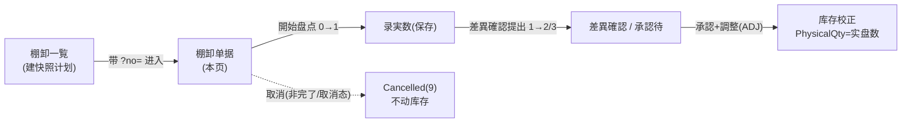

# 棚卸（盘点）单页面操作 SOP（手把手版）

> **用途**：给**盘点员/仓库管理员操作、培训老师讲、测试人员拆用例**。比模块总册（`03-库存物流WMS` §5.13）更细。
> **页面**：棚卸 单据画面（WM090 · 库存物流 WMS）　**路由**：`/wms/stock-take?no=ST…`（从「棚卸一覧」点行带 `?no=` 进入）　**前端**：`views/wms/StockTakeView.vue`　**API**：`api/wms/stockTake.ts stockTakeApi`　**后端**：`Wms/StockTakeController` → `StockTakeService`（`ApproveAndApplyAsync` 真正调库存）
> **基准**：分支 `feat/wfs-inbox-core`，2026-06-29；后端实测 `docs/codemap-wms/04-棚卸-補充-期限-QC.md`（2026-06-22 权威），UI 经实读 view。
> **样例数据**：棚卸 `ST2026070001`、倉庫 `W01`、库位 `RES-C-01`、製品 `PRD2026070001`、LotNo `LOT2026070001`、帳簿数 5000、实数 4980（差异 −20）、単価 `¥120`（差异金額 −¥2,400）。

---

## 1. 页面一句话说明

**棚卸单据画面，就是对一张盘点单走完整生命周期的地方——開始盘点(0→1)→逐行录实数并保存→差異確認提出(1→2 或 →3)→承認+調整(ADJ 校正库存,→4)；底部操作栏按状态显隐，五个动作里只有「承認+調整」真正动库存，把账面数校正到实盘数（不可逆）。** 录实数、看差异都不动库存，最后一步「承認」才把差异写进 Stock。

---

## 2. 这个页面在业务流程中的位置

- **上游**：「棚卸一覧」页点「スナップショット」建计划（定格当时各库位 `BookQty=PhysicalQty`），成功后跳本页带 `?no=`。
- **本页**：開始盘点→录实数→提出→承認，对单据做全生命周期。
- **下游**：承認对差异≠0 行发 `ADJ` 流水，把账面 Stock 校正到实盘数（`RelatedType="STOCKTAKE"` 成追溯钩子）。

---

## 3. 谁使用这个页面

| 角色 | 用途 |
|---|---|
| 盘点员 | 開始盘点、逐行录实数、填差异理由、提交差異確認 |
| 仓库管理员 / 上级 | 承認+調整（真正调库存）、取消盘点 |

---

## 4. 操作前准备

- [ ] 已在「棚卸一覧」建好快照计划，拿到棚卸NO（如 `ST2026070001`）并从一覧点行进入（带 `?no=`）。
- [ ] 清楚承認=对差异≠0 行调 `ApplyAsync(ADJ, Qty=符号差分)`→`ApplyDelta` ADJ 分支 `PhysicalQty += Qty`，把账面校正到实盘数，**不可逆**。
- [ ] 差异≠0 的行须填理由（否则提出被拦 `WM-MSG-061`）；未盘点行残留（`countedQty==null`）→提出被拦 `WM-MSG-060`。
- [ ] 知道阈值规则：差异金额超 `ApprovalThresholdAmount` → 提出后进 `AwaitingApproval(3)`，否则 `DiffReview(2)`（**后端判定，前端无提示**）。

---

## 5. 页面区域说明

| 区域 | 内容 |
|---|---|
| 头卡（el-descriptions） | 标题「棚卸 [单号]」+ 状态 tag + 种别 tag；8 项：対象倉庫 / 対象库位前缀 / 対象製品 / 阈值金額(¥) / 計画日 / 実棚日 / 完了日 / 承認者 |
| 明细卡 | 标题显「明细数 / 差异数(diffCount)」+ 右侧过滤框（製品/库位/Lot）；明细表列：行号 / 库位 / 製品 / Lot / 帳簿数 / **実数(可编辑)** / 差異 / 差異金額(¥) / 単価(¥) / **理由(可编辑)** / 行状态 tag / ADJ tag |
| 底部固定操作栏（el-affix bottom） | 戻る + 開始盘点 / 保存 / 差異確認提出 / 承認+調整 / 取消（5 按钮按状态显隐） |

---

## 6. 字段填写说明（口语版）

**明细行只有两个字段能填，且仅 `status===1`（盘点中）可编辑**（`:disabled="!editable"`，`editable=status===1`）：

| 字段 | 谁提供 | 怎么填 | 填错影响 |
|---|---|---|---|
| 実数（countedQty） | 盘点员 | el-input-number，实盘数（如 4980）；`@change` 调 `recalcDiff` 即时算差异显示 | **为 null 的行 `onSaveCounts` 不提交**；提出前若 null 残留→`WM-MSG-060` |
| 差異（diffQty，只读） | 系统 | 灰显 = 実数 − 帳簿（负=红、正=绿）；**服务端会重算 `DiffQty/DiffAmount`，不信前端** | 前端算的仅供显示 |
| 差異金額（diffAmount，只读） | 系统 | = 差異 × 単価（如 −20×120=−¥2,400） | 同上 |
| 単価（unitPrice，只读） | 系统（快照定格） | 建计划时从 Stock 定格 | — |
| 理由（diffReasonCd） | 盘点员 | el-input（**自由文本**，maxlength 20）；**非下拉枚举**（与"理由码"命名不符，实为自由文本） | 差异≠0 但理由空→提出 `WM-MSG-061` |
| 行状态 tag（approvalStatus） | 系统 | 0 待 / 1 自动 / 2 承認 / 9 却下；**前端无却下入口**（9 只能后端产生） | — |
| ADJ tag（adjustTxnNo） | 系统 | 承認后差异≠0 行回填，hover 看流水号 | 差异为 0 的行不发 Txn，无 ADJ |

---

## 7. 按钮操作说明

| 按钮 | 何时出现（真实表达式） | 动作 / API | 点了会怎样 |
|---|---|---|---|
| 戻る | 常显 | router → `/wms/stock-take-list` | 回棚卸一覧 |
| 開始盘点 | `canStartCount = status===0` | `startCount` | 0→1 Counting，进入可录实数态；**不动库存** |
| 保存 | `canSaveCounts = status===1` | `updateCounts`（仅传 `countedQty≠null` 行） | 存实数/理由，服务端重算差异；**不动库存** |
| 差異確認提出 | `canSubmit = status===1` | `submit`（先 confirm 弹窗） | 1→2(DiffReview) 或 →3(AwaitingApproval，按阈值后端判)；**不动库存** |
| 承認+調整 | `canApprove = status===2 ‖ status===3` | `approve`（先 confirm 弹窗） | **真调库存**：差异≠0 行发 ADJ 校正账面→4 Completed，写 ApproverCd/CompletedDate |
| 取消 | `canCancel = status≠4 && status≠9` | `cancel`（先 confirm 弹窗） | →9 Cancelled；**不动库存** |

> 五个动作里**只有「承認+調整」真正动库存**；開始/保存/提出/取消都不动库存。

---

## 8. 标准业务操作 SOP（照着点）

### 场景一：标准盘点全生命周期（主流程）
- **背景**：一张刚从一覧建好的盘点单，盘点员录实数、上级承認校正库存。
- **样例数据**：`ST2026070001`、倉庫 `W01`、行 `RES-C-01 / PRD2026070001 / LOT2026070001`、帳簿 5000、实数 4980、単価 ¥120。
- **前置**：从「棚卸一覧」点行进入本页，`status===0`（Planned）。
- **步骤**：1) 点「開始盘点」（0→1）；2) 在该行「実数」填 `4980`（差異即时显 −20 / −¥2,400）；3) 在「理由」填自由文本（如 `破損ロス`）；4) 点「保存」（服务端重算差异）；5) 点「差異確認提出」→ confirm（1→2，阈值内）；6) 上级点「承認+調整」→ confirm。
- **完成后检查**：状态→4 Completed；头卡 完了日/承認者 回填；差异≠0 行显 ADJ tag，hover 见流水号；去在庫照会该批 `PhysicalQty` 已变 4980（账面校正到实盘）；该行履歴见一条 `ADJ`（`RelatedType=STOCKTAKE`）。
- **异常**：未盘点行残留→`WM-MSG-060`；差异≠0 无理由→`WM-MSG-061`。
- **可拆用例**：TC-M06-STOCKTAKE-001、002、004、005、010、011、012、013、014。

### 场景二：超阈值进入「承認待ち」
- **背景**：差异金额超过单据设定的 `ApprovalThresholdAmount`，提出后须上级承認。
- **样例数据**：阈值 `¥1,000`；行差异金額 −¥2,400（绝对值 2400 > 1000）。
- **前置**：`status===1`，已录实数+理由。
- **步骤**：1) 点「差異確認提出」→ confirm；2) 后端 `needsApproval = threshold.HasValue && maxAbsDiffAmount > threshold` 命中 → Status=3(AwaitingApproval)。
- **完成后检查**：状态 tag 显「承認待」(danger 红)；底部仍只显「承認+調整」与「取消」（`canApprove` 覆盖 2‖3）；上级承認后→4。
- **异常**：前端**无任何提示**告知走 2 还是 3（后端按阈值默默判定）。
- **可拆用例**：TC-M06-STOCKTAKE-007、008。

### 场景三：差异行未填理由被拦
- **背景**：盘点员录了实数有差异，但忘了填理由就提出。
- **样例数据**：行 `RES-C-01` 实数 4980（差异 −20≠0），理由空。
- **前置**：`status===1`。
- **步骤**：1) 录实数不填理由；2) 保存；3) 点「差異確認提出」→ confirm。
- **完成后检查**：提出被拦，提示 `WM-MSG-061`（差異行未填理由）；状态仍 1；补填理由后重提即可。
- **异常**：差异为 0 的行不要求理由（只校验差异≠0 行）。
- **可拆用例**：TC-M06-STOCKTAKE-011。

### 场景四：未盘点残留被拦
- **背景**：多行快照里有的行还没录实数（`countedQty==null`）就想提出。
- **样例数据**：单据含 3 行，仅 2 行录了实数，第 3 行 `countedQty` 仍为空。
- **前置**：`status===1`。
- **步骤**：1) 录其中 2 行→保存；2) 点「差異確認提出」→ confirm。
- **完成后检查**：提出被拦 `WM-MSG-060`（未盘点残留）；状态仍 1；把第 3 行实数补全（盘到 0 也要填 0）后重提。
- **异常**：注意「保存」对 `countedQty==null` 行**不提交**，所以保存不报错，但提出会卡。
- **可拆用例**：TC-M06-STOCKTAKE-010、016。

### 场景五：差异为 0 不发 Txn（承認空跑）
- **背景**：盘点全对，实数=帳簿，承認后不应该动任何库存。
- **样例数据**：行 `RES-C-01` 实数 5000（=帳簿，差异 0）。
- **前置**：录实数 5000→保存→提出→进 2 DiffReview。
- **步骤**：1) 点「承認+調整」→ confirm。
- **完成后检查**：状态→4 Completed；该行**无 ADJ tag**（差异为 0 不发 Txn）；在庫照会 `PhysicalQty` 仍 5000 不变；ApplyDelta 未被调用。
- **异常**：无；这是"账实相符"的正常收尾。
- **可拆用例**：TC-M06-STOCKTAKE-015。

### 场景六：取消盘点（不动库存）
- **背景**：盘点单作废（建错/重盘）。
- **样例数据**：`ST2026070001`，当前任意非 4/9 态。
- **前置**：`status≠4 && status≠9`（`canCancel` 成立）。
- **步骤**：1) 点「取消」→ confirm。
- **完成后检查**：状态→9 Cancelled（tag info 灰）；**不动任何库存**；底部除「戻る」外按钮全隐（`canCancel` 失效、其余条件也不成立）。
- **异常**：已完了(4)或已取消(9)的单据看不到「取消」按钮（无法再取消）。
- **可拆用例**：TC-M06-STOCKTAKE-009、017。

---

## 9. 状态变化说明

```mermaid
stateDiagram-v2
  [*] --> Planned0
  Planned0 --> Counting1: 開始盘点
  Counting1 --> Counting1: 保存(录实数,不迁移)
  Counting1 --> DiffReview2: 差異確認提出(阈值内)
  Counting1 --> AwaitingApproval3: 差異確認提出(超阈值)
  DiffReview2 --> Completed4: 承認+調整(ADJ校正)
  AwaitingApproval3 --> Completed4: 承認+調整(ADJ校正)
  Planned0 --> Cancelled9: 取消
  Counting1 --> Cancelled9: 取消
  DiffReview2 --> Cancelled9: 取消
  AwaitingApproval3 --> Cancelled9: 取消
  note right of Completed4: 仅此步动库存; 差异为0行不发Txn
```

- 状态机：`0 Planned → 1 Counting → 2 DiffReview / 3 AwaitingApproval → 4 Completed`，旁路 `9 Cancelled`。
- 状态 tag 颜色：0 info / 1 primary / 2 warning / 3 danger（承認待·红）/ 4 success / 9 info（灰）。
- 行状态 tag（approvalStatus）：0 待 info / 1 自动 success / 2 承認 success / 9 却下 danger。

---

## 10. 按钮不可用 / 灰色原因

| 现象 | 原因（真实表达式） |
|---|---|
| 看不到「開始盘点」 | `status≠0`（仅 Planned 显） |
| 看不到「保存」「差異確認提出」 | `status≠1`（仅 Counting 显） |
| 看不到「承認+調整」 | 非 `status===2 ‖ 3`（仅差異確認/承認待显） |
| 看不到「取消」 | `status===4 ‖ 9`（完了/已取消不可取消） |
| 実数 / 理由 输入框灰（只读） | `!editable`，即 `status≠1`（仅盘点中可改） |
| 明细行无「却下」按钮 | **前端无 per 行却下入口**；`approvalStatus=9` 只能后端产生 |
| 找不到"改库存"按钮 | 库存只由「承認+調整」经 ADJ 改，无手工改库存入口 |

---

## 11. 常见错误与处理

| 错误 | 原因 | 处理 |
|---|---|---|
| `WM-MSG-060`（未盘点残留） | 提出时有行 `countedQty==null` | 把所有行实数补全（盘到 0 也填 0）再提出 |
| `WM-MSG-061`（差异行未填理由） | 差异≠0 行理由空 | 给每个差异≠0 行填理由（自由文本）再提出 |
| `WM-MSG-043`（状态守卫） | 在不允许的状态做动作（如非 2/3 承認、非 1 录数） | 按状态机顺序操作 |
| 保存了却没提交某行 | 该行 `countedQty==null`，`onSaveCounts` 主动过滤 | 录入实数后再保存 |
| 差异栏数字与承認结果对不上 | `recalcDiff` 前端算差异**仅供显示**；服务端会重算 | 以后端 approve 的实际调整为准 |
| 不知道会进 2 还是 3 | submit 走 DiffReview 还是 AwaitingApproval 由后端按阈值判定，**前端无提示** | 看提出后状态 tag（warning=2 / danger 承認待=3） |
| 想"撤销承認" | 承認经 ADJ 已改库存，**不可逆** | 只能再建一张盘点单反向校正 |
| 理由当成下拉选项找不到 | 字段名叫 `diffReasonCd` 但实为**自由文本**输入框 | 直接手打文本 |

---

## 12. 操作完成后的检查清单

- [ ] 開始盘点后状态=1，明细行「実数」「理由」变可编辑。
- [ ] 保存后差异/差異金額由服务端重算（不信前端即时算的值）；`countedQty==null` 行未提交。
- [ ] 提出后状态=2(DiffReview) 或 3(AwaitingApproval，超阈值)；提出前被 `WM-MSG-060`/`WM-MSG-061` 拦截过的需先补齐。
- [ ] 承認后状态=4 Completed；头卡 完了日 / 承認者 回填。
- [ ] **差异≠0 行**显 ADJ tag、`AdjustTxnNo` 回填；去在庫照会该批 `PhysicalQty` 已等于实盘数；履歴见一条 `ADJ`（`RelatedType=STOCKTAKE`）。
- [ ] **差异为 0 行不发 Txn**、无 ADJ tag、库存不变。
- [ ] 取消的单据状态=9，库存丝毫不动。

---

## 13. 页面级测试用例（≥25 条，可执行）

> 编号 `TC-M06-STOCKTAKE-xxx`；数据用样例（`ST2026070001` / `W01` / `RES-C-01` / `PRD2026070001` / `LOT2026070001` / 帳簿 5000 / 単価 ¥120）。

| 用例编号 | 用例名称 | 优先级 | 前置条件 | 测试数据 | 操作步骤 | 预期结果 | 下游检查 | 备注 |
|---|---|---|---|---|---|---|---|---|
| TC-M06-STOCKTAKE-001 | 带 ?no= 加载单据 | P1 | 一覧已建快照 | ST2026070001 | 一覧点行进入 | 头卡+明细表加载、状态 tag 正确 | — | 入口 |
| TC-M06-STOCKTAKE-002 | 開始盘点 0→1 | P0 | status=0 | — | 点開始盘点 | 状态→1 Counting，実数/理由变可编辑 | 不动库存 | 核心 |
| TC-M06-STOCKTAKE-003 | Planned 态字段只读 | P1 | status=0 | — | 看明细 | 実数/理由 `:disabled`（editable=false） | — | — |
| TC-M06-STOCKTAKE-004 | 录实数即时算差异 | P0 | status=1 | 实数4980 | 改实数 | 差異显−20、差異金額−¥2,400（红） | 仅显示 | recalcDiff |
| TC-M06-STOCKTAKE-005 | 保存实数+理由 | P0 | status=1 | 4980/破損ロス | 录入→保存 | 成功 toast，服务端重算差异 | 不动库存 | — |
| TC-M06-STOCKTAKE-006 | null 行不提交 | P1 | status=1 多行 | 1行空 | 录1行→保存 | 仅传 countedQty≠null 行；空行不提交 | — | onSaveCounts 过滤 |
| TC-M06-STOCKTAKE-007 | 提出超阈值→3 | P0 | status=1，阈值¥1000 | 差异金額−¥2400 | 差異確認提出 | 状态→3 AwaitingApproval（承認待 红） | — | 阈值分流 |
| TC-M06-STOCKTAKE-008 | 提出阈值内→2 | P0 | status=1，阈值¥1000 | 差异金額−¥600 | 差異確認提出 | 状态→2 DiffReview（warning） | — | 阈值分流 |
| TC-M06-STOCKTAKE-009 | 取消盘点→9 | P1 | status≠4&&≠9 | — | 取消→确认 | 状态→9 Cancelled（灰） | 不动库存 | — |
| TC-M06-STOCKTAKE-010 | 未盘点残留拦截 | P0 | status=1 有 null 行 | 1行未录 | 差異確認提出 | WM-MSG-060 拦截，状态仍 1 | 不落库 | — |
| TC-M06-STOCKTAKE-011 | 差异无理由拦截 | P0 | status=1 差异≠0 | 理由空 | 差異確認提出 | WM-MSG-061 拦截，状态仍 1 | 不落库 | — |
| TC-M06-STOCKTAKE-012 | 承認+調整全链 | P0 | status=2 | 差异−20 | 承認→确认 | 状态→4，完了日/承認者回填 | 见下游 | 主流程 |
| TC-M06-STOCKTAKE-013 | 承認发 ADJ 校正库存 | P0 | status=2 差异−20 | — | 承認 | 该行 ADJ tag+AdjustTxnNo 回填 | 在庫 PhysicalQty=实盘数(4980) | ApplyDelta ADJ |
| TC-M06-STOCKTAKE-014 | ADJ 流水可追溯 | P0 | 已承認 | — | 查履歴 | 一条 ADJ，RelatedType=STOCKTAKE | 钩子 | — |
| TC-M06-STOCKTAKE-015 | 差异为0不发Txn | P0 | status=2 实数=帳簿 | 5000 | 承認 | 状态→4，无 ADJ tag | 库存不变 | 空跑 |
| TC-M06-STOCKTAKE-016 | 盘到0也算已盘点 | P1 | status=1 | 实数0 | 录0→保存→提出 | 不触发 WM-MSG-060（0≠null） | — | 边界 |
| TC-M06-STOCKTAKE-017 | 完了/取消不可取消 | P1 | status=4 或 9 | — | 看操作栏 | 无「取消」按钮 | — | canCancel |
| TC-M06-STOCKTAKE-018 | 按钮随状态显隐 | P1 | 各状态单据 | — | 看底部栏 | 0→開始/1→保存·提出/2·3→承認/非4·9→取消 | — | — |
| TC-M06-STOCKTAKE-019 | 非1态录数被守卫 | P1 | status=2 | — | 试改实数 | 输入框只读（editable=false） | — | WM-MSG-043 兜底 |
| TC-M06-STOCKTAKE-020 | 非2·3态承認被守卫 | P1 | status=1 | — | （后端）approve | WM-MSG-043 状态守卫 | — | 后端 |
| TC-M06-STOCKTAKE-021 | 理由自由文本非枚举 | P2 | status=1 | 任意文本 | 在理由栏输入 | 接受任意≤20 字符文本 | — | 命名误导 |
| TC-M06-STOCKTAKE-022 | 无 per 行却下入口 | P2 | 任意 | — | 找却下按钮 | 前端无此入口（9 仅后端产生） | — | 盲点 |
| TC-M06-STOCKTAKE-023 | 提出前端无2/3提示 | P2 | status=1 | — | 提出前观察 | 前端不提示走 2 还是 3 | — | 盲点 |
| TC-M06-STOCKTAKE-024 | 差异数统计 diffCount | P2 | 有差异行 | — | 看明细卡标题 | 「明细数/差异数」中差异数正确 | — | — |
| TC-M06-STOCKTAKE-025 | 明细过滤框 | P2 | 多行 | RES-C-01 | 输入关键字 | 按製品/库位/Lot 过滤 | — | filteredDetails |
| TC-M06-STOCKTAKE-026 | 服务端重算差异 | P1 | 改前端差异 | 篡改 diffQty | 保存 | 服务端按 实数−帳簿 重算覆盖 | — | 不信前端 |
| TC-M06-STOCKTAKE-027 | 多行混合承認 | P1 | status=2 多行 | 部分差异/部分0 | 承認 | 仅差异≠0 行发 ADJ，0 行不发 | 库存对齐 | — |
| TC-M06-STOCKTAKE-028 | 承認不可逆 | P2 | 已承認(4) | — | 找撤销 | 无撤销入口，需反向新建盘点 | — | — |
| TC-M06-STOCKTAKE-029 | 戻る返回一覧 | P3 | 任意 | — | 点戻る | 跳 /wms/stock-take-list | — | — |
| TC-M06-STOCKTAKE-030 | 网络异常可重试 | P2 | 断网 | — | 保存/承認 | 友好错误，可重试不脏写 | — | 健壮性 |

---

## 14. 培训讲解建议

| 顺序 | 讲什么 | 演示 | 易误解点 |
|---|---|---|---|
| 1 | 这页是盘点单的"全生命周期" | §2 流程图 | 以为这里能建计划（计划在棚卸一覧建） |
| 2 | 五个动作里只有承認动库存 | 開始→保存→提出→承認 | 以为录实数/提出就改了库存 |
| 3 | 承認=把账面校正到实盘数 | §1.3 ADJ 校正 | 以为是"加减库存"，其实是对齐到实数且不可逆 |
| 4 | 差异为 0 行不发 Txn | 场景五空跑 | 以为每行都会写流水 |
| 5 | 提出两道闸 060/061 | 故意留空触发 | 盘到 0 ≠ 未盘点（0 也要填） |
| 6 | 阈值分流 2/3 无前端提示 | 看提出后状态 tag | 以为前端会告诉你要不要上级承認 |
| 7 | 理由是自由文本 + 无却下入口 | 指字段 / 找按钮 | 字段名带"Cd"误以为是选项；却下只能后端 |

---

## 15. 与模块级手册的关系

对应 `03-库存物流WMS-最详细用户操作培训手册.md` §5.13（含 5.13.1a~1e）。模块测试点见 §5.13.14（開始/录数/提出/承認全链、承認→ADJ 校正库存 `RelatedType=STOCKTAKE`、`WM-MSG-060`/`WM-MSG-061`、服务端重算差异、阈值分流 2·3、无 per 行却下）。底层 ADJ 写入口与 FEFO/补充/期限同源（`IStockMovementService.ApplyAsync`）。

---

## 16. 代码与文档来源

| 层 | 文件 |
|---|---|
| 逐行源码手册 | `docs/codemap-wms/04-棚卸-補充-期限-QC.md`（§1 棚卸 4 段流程，权威） |
| 前端 | `cp6.web/src/views/wms/StockTakeView.vue`（本页）、`StockTakeListView.vue`（建计划入口） |
| API/类型 | `api/wms/stockTake.ts`（startCount/updateCounts/submit/approve/cancel）、`types/wms/wms.ts`（StockTake/StockTakeDetail/StockTakeCountInput） |
| 后端 | `Wms/StockTakeController.cs`、`Services/Wms/StockTakeService.cs`（`CreatePlanAsync` 103 / `UpdateCounts` 178 / `SubmitForReview` 207 / **`ApproveAndApplyAsync` 254-300 经 ADJ 调库存** / `Cancel` 302） |
| 底层库存 | `Services/Wms/StockMovementService.cs`（`ApplyDelta` ADJ 分支 `PhysicalQty += Qty`） |
| 实体 | `DomainModels/Wms/StockTake.cs`（状态机 :12）、`StockTakeDetail.cs`（`BookQty`/`AdjustTxnNo`/`ApprovalStatus`） |

---

## 最后更新来源

- 代码：见 §16（codemap-wms 04 §1 + StockTakeView.vue 实读 + stockTake.ts/wms.ts 类型）。
- 基准：分支 `feat/wfs-inbox-core`，2026-06-29（codemap 2026-06-22 权威）。
- 覆盖：16 节 / 6 场景 / 30 用例（TC-M06-STOCKTAKE-001~030）。
- 诚实标注：理由 `diffReasonCd` 是自由文本（非下拉枚举，与"理由码"命名不符）；无 per 行「却下」按钮（`ApprovalStatus=9` 只能后端产生）；`recalcDiff` 前端算差异仅供显示，真正调整以后端 approve 为准；submit 走 2 还是 3 前端无提示；建快照计划在「棚卸一覧」页（本页从一覧带 `?no=` 进入）。
