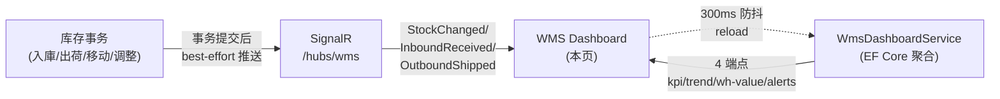
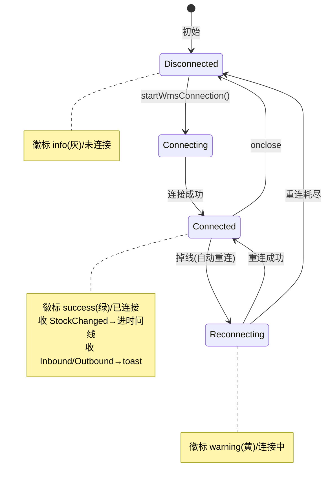

# WMS Dashboard（仓库看板）单页面操作 SOP（手把手版）

> **用途**：给**仓库主管/运营监看 KPI、培训老师讲、测试人员拆用例**。比模块总册（`03-库存物流WMS` §5.21）更细。
> **页面**：WMS Dashboard（WM · 库存物流 WMS）　**路由**：`/wms/dashboard`　**前端**：`views/wms/WmsDashboardView.vue`　**API**：`api/wms/wmsDashboard.ts`（4 端点 kpi/trend/warehouse-value/alerts）　**实时**：`utils/wmsHub.ts` → `/hubs/wms`　**后端**：`Wms/WmsDashboardController` → `WmsDashboardService`（**全 EF Core**）
> **基准**：分支 `feat/wfs-inbox-core`，2026-06-29；后端实测 `docs/codemap-wms/06-業界連携-报表.md`（§4 Dashboard / §5 SignalR，2026-06-22 权威），UI 经实读 view。
> **样例数据**：倉庫 `W01`、製品 `PRD2026070001`。

---

## 1. 页面一句话说明

**WMS Dashboard，就是仓库主管的"驾驶舱"——一屏看 8 项 KPI（总库存金额/活跃SKU/实物/引当/滞留SKU/今日入庫予定/今日出荷予定/未结棚卸）＋IN·OUT·ADJ 趋势柱状图＋各仓库存金额＋到期/延迟两块告警＋右上角实时事件流。** 它是**纯只读看板，没有任何写操作**：所有数字都是后端聚合查出来的，页面上没有"新增/编辑/删除/确定"按钮，唯一会动的是实时事件流（靠 SignalR 推）和几个本地切换（清空事件、切趋势天数）。

> **★ 全站唯一的 SignalR 消费者**：整个 WMS 只有这一页订阅 `/hubs/wms` 实时通道，库存一动它就有反应；其它页（含 IoT 监视）都不接 SignalR。

---

## 2. 这个页面在业务流程中的位置

- **上游**：所有会动库存的页面（入庫実績/梱包出荷/棚卸承認/RF MOVE…）→ 事务提交后 best-effort 推 SignalR；后端 4 个只读聚合端点喂数据。
- **本页**：聚合展示 + 实时事件流，**不回写任何业务**。
- **下游**：无。看板看完就是看完，是分析/监看终点。

---

## 3. 谁使用这个页面

| 角色 | 用途 |
|---|---|
| 仓库主管/运营 | 一屏监看库存金额、当日进出计划、滞留/到期/延迟风险 |
| 仓库管理员 | 盯实时库存变动事件流、看各仓金额分布 |
| 经营层/财务 | 看总库存金额（资产口径）与趋势 |
| 测试/培训 | 验证实时推送、防抖、KPI 着色 |

---

## 4. 操作前准备

- [ ] 有库存数据（否则 KPI 全 0、趋势显示「—」、各表空）。
- [ ] 想看实时事件流：浏览器能连上 `/hubs/wms`（右上角徽标显示"已连接"才有推送）。
- [ ] 想测实时：准备好"另一个端"去触发库存变动（如在入庫実績/梱包出荷页确定一单），本页不能自己造事件。
- [ ] 清楚 KPI 着色含义（盘点中/到期>0 变红、延迟入库>0 变黄）——见 §6。

---

## 5. 页面区域说明

| 区域 | 内容 |
|---|---|
| KPI 卡区（上 2 行 × 4 列） | 第 1 行：总库存金额（副标题=活跃SKU数 / 实物数量）、滞留SKU（恒橙）、今日入庫予定、今日出荷予定；第 2 行：引当数量、未结棚卸（盘点中，>0 红）、到期告警数（>0 红）、延迟入库数（>0 黄） |
| 实时事件流卡 | 标题右侧连接态徽标（success/warning/info 三态）＋「清空」按钮（仅有事件时显示）；下方 `el-timeline`：每条=种別 tag（IN绿/OUT红…）＋製品＋Lot＋倉庫-库位＋数量（正绿负红）＋关联单号 |
| 趋势卡（左 16 栏） | 标题=入出庫推移（天数）＋ 7/30/90 单选切换；CSS 柱状图：每天三柱 IN(绿)/OUT(红)/ADJ(灰)，悬停 title 显具体数；底部图例 |
| 各仓金额卡（右 8 栏） | `el-table`：倉庫CD / 倉庫名 / SKU数 / 在庫金额（取整） |
| 到期告警表（左 12 栏） | 製品 / Lot / 库位 / 有効期限 / DDay（<0 红、<7 橙）/ 数量 |
| 延迟入库表（右 12 栏） | 入庫NO / 仕入先 / 入荷予定日 / 延迟天数（红） |

> **数据来源拆分**：KPI 卡的 8 个数字来自 `/kpi` 端点；到期/延迟两块（含上面那 2 张告警计数卡）来自 `/alerts`；趋势来自 `/trend`；各仓金额来自 `/warehouse-value`。

---

## 6. 字段填写说明（口语版）

**本页没有任何输入框、没有表单、不需要填任何字段**——纯只读看板。下面解释"看到的数字/颜色是什么意思"。

**KPI 8 项（来自 `/kpi`）**：

| KPI | 含义 | 怎么算（后端 EF Core） | 着色规则 |
|---|---|---|---|
| 总库存金额 | 现有库存的金额合计 | `Σ(PhysicalQty × UnitPrice)`，一把 GroupBy；**取整到 0 位小数** | 常态黑 |
| 活跃SKU / 实物 | 副标题：有库存的品番数 / 实物总量 | 同上 GroupBy 出 Skus/Physical | — |
| 引当（Allocated） | 已被引当锁定的数量 | 同上 GroupBy 出 Allocated | 常态黑 |
| 滞留SKU | 近 90 天没动过的 SKU 数 | 全 SKU 与"近90天动过"的差集 | **恒橙**（卡片固定 `kpi-warn`） |
| 今日入庫予定 | 今天预计到货的入庫指示数 | 按予定日=今天 Count | 常态黑 |
| 今日出荷予定 | 今天预计出货的出庫指示数 | 按予定日=今天 Count | 常态黑 |
| 未结棚卸（盘点中） | 还没结的棚卸单数 | Count open 棚卸 | **>0 变红**（`kpi-danger`） |

**告警计数卡（来自 `/alerts`）**：

| 卡 | 含义 | 着色规则 |
|---|---|---|
| 到期告警 | 临近/已过有効期限的库存条数 | **>0 变红** |
| 延迟入库 | 入荷予定日已过仍未到货的入庫单数 | **>0 变黄**（`kpi-warn`） |

> 记法：**红=到期/盘点（要立刻处理的硬风险）**，**黄=延迟入库/滞留（要关注的软风险）**。

---

## 7. 按钮操作说明

> 全页**只有 2 个交互**，且都是本地/查询，**不写任何数据**。

| 操作 | 何时出现 | 点了会怎样 |
|---|---|---|
| 清空（实时事件流） | 仅当事件流里 ≥1 条事件时显示 | **只清本地内存里的事件列表**（`events = []`），不影响 KPI/告警/后端任何数据；下一条推送来了又会出现 |
| 趋势天数 7 / 30 / 90 | 趋势卡标题常显，默认 30 | 切换后调 `/trend?days=N` 重新拉该天数趋势并重绘柱状图 |

> **没有"刷新"按钮**：KPI/告警靠 SignalR 事件触发的 300ms 防抖自动 reload（见 §8 场景二）；趋势/各仓金额**只在进页面或切天数时**加载，**不随实时事件刷新**。

---

## 8. 标准业务操作 SOP（照着点）

### 场景一：打开看板（首屏加载 + 建连）
- **背景**：主管早上打开看板看全局。
- **样例数据**：倉庫 `W01`、製品 `PRD2026070001`。
- **步骤**：1) 进 `/wms/dashboard`；2) `onMounted` **并行**拉 4 端点（kpi/trend/warehouse-value/alerts）；3) 建立并启动 `/hubs/wms` 连接。
- **完成后检查**：8 项 KPI 卡有值；趋势默认 30 天柱状图；各仓金额表、到期/延迟两表渲染；右上角徽标显示"已连接"(success/绿)。
- **异常**：无库存→KPI 显 0、趋势显「—」、表空；连不上 Hub→徽标"未连接"(info/灰)，但**KPI/趋势/告警照常显示**（它们走 REST 不依赖 Hub）。
- **用例**：TC-M06-DASHBOARD-001~005、020、021。

### 场景二：实时事件流 + 300ms 防抖 reload（核心）
- **背景**：另一端确定了一笔入庫/出荷/移动，看板要"活"起来。
- **步骤**：1) 保持本页打开（已连接）；2) 在另一端触发库存变动（如梱包出荷确定）；3) 后端事务提交后 best-effort 推 `StockChanged`。
- **检查**：① 事件 `unshift` 进时间线顶部（最新在上），显示 种別tag＋製品＋Lot＋倉庫-库位＋数量＋关联单号；② 触发 `scheduleKpiReload`——**300ms 内多次事件最多只 reload 一次** KPI＋告警；③ **趋势图和各仓金额不变**（它们不随事件刷新）。
- **异常**：事件多于 50 条→数组只留前 50（截断）；时间线**只渲染前 10 条**（`events.slice(0,10)`）。
- **用例**：TC-M06-DASHBOARD-024~028。

### 场景三：入庫/出荷 toast 提示
- **背景**：希望显眼地知道"有货到了/有货发了"。
- **步骤**：另一端确定入庫実績 / 梱包出荷。
- **检查**：收到 `InboundReceived`→右上角弹绿色 toast（含 receiptNo）；收到 `OutboundShipped`→弹绿色 toast（含 outboundNo）；两者也各自触发 300ms 防抖 reload。
- **备注**：入庫/出荷事件**只弹 toast，不进时间线**（时间线只收 `StockChanged`）。
- **用例**：TC-M06-DASHBOARD-029、030。

### 场景四：趋势天数切换
- **背景**：想看更长周期的进出趋势。
- **步骤**：点趋势卡右上 `7` / `30` / `90`。
- **检查**：调 `/trend?days=N`，柱状图按新天数重绘；每天 IN(绿)/OUT(红)/ADJ(灰) 三柱，柱高按"该区间最大值"归一（min 2%）；ADJ 取绝对值算柱高；悬停 title 显当天具体 IN/OUT/ADJ。
- **异常**：该区间无数据→显示「—」。
- **用例**：TC-M06-DASHBOARD-006~010。

### 场景五：告警与 KPI 着色
- **背景**：靠颜色一眼识别风险。
- **步骤**：看第 2 行 KPI 卡与下方两张告警表。
- **检查**：到期告警>0→卡变红；未结棚卸>0→卡变红；延迟入库>0→卡变黄；滞留SKU 卡恒橙；到期表内 DDay<0 红字、<7 橙字；延迟表延迟天数红字。
- **用例**：TC-M06-DASHBOARD-013~019。

### 场景六：清空实时事件流（本地）
- **背景**：事件刷屏了，想清干净重新观察。
- **步骤**：点事件流卡右上「清空」。
- **检查**：时间线清空显"暂无事件"；**KPI/告警/趋势/各仓金额全不变**（清空只动本地事件数组）；下一条推送来「清空」按钮又出现。
- **用例**：TC-M06-DASHBOARD-031、032。

### 场景七：连接态徽标三态（断线重连）
- **背景**：网络抖动，想知道实时还通不通。
- **步骤**：观察右上徽标随连接状态变化（可断网模拟）。
- **检查**：Connected→success(绿)"已连接"；Connecting/Reconnecting→warning(黄)"连接中"；Disconnected→info(灰)"未连接"；底层 `withAutomaticReconnect([0,2000,5000,10000,30000])` 会自动重连。
- **用例**：TC-M06-DASHBOARD-021~023。

### 场景八：高频事件压测（防抖与不刷新项）
- **背景**：批量出库瞬间几十条 StockChanged。
- **步骤**：短时间连续触发多笔库存变动。
- **检查**：时间线连续 unshift（>50 截断、显前10）；但 KPI/告警**每 300ms 最多 reload 一次**（不会每条都打后端）；趋势/各仓金额完全不动。
- **用例**：TC-M06-DASHBOARD-025~028。

---

## 9. 状态变化说明

> 本页无业务状态机（纯只读），唯一"会变状态"的是 **SignalR 连接**与对应徽标。

---

## 10. 按钮不可用 / 灰色 / 找不到的原因

| 现象 | 原因 |
|---|---|
| 找不到"新增/编辑/删除/确定" | **本页纯只读看板，设计上就没有写操作** |
| 找不到"刷新"按钮 | KPI/告警靠 SignalR 事件 300ms 防抖自动 reload；趋势/各仓金额只在进页/切天数时加载 |
| 「清空」按钮看不到 | 实时事件流为空时隐藏（`v-if="events.length > 0"`），有事件才显示 |
| 时间线只看到 10 条但说留 50 | 内存留前 50（>50 截断），但模板只渲染前 10（`events.slice(0,10)`） |
| KPI 半天不更新 | Hub 未连接（徽标灰）→无事件→无防抖 reload；可刷新整页重新拉 REST |
| 趋势/各仓金额不随出入库变 | **设计如此**：实时事件只 reload KPI+告警，趋势/金额不刷新 |

---

## 11. 常见错误与处理

> **本页纯只读、无任何错误码**（后端 4 端点也无 WM-MSG 码）。下面是"看着不对劲"的排查。

| 现象 | 原因 | 处理 |
|---|---|---|
| KPI 全 0 / 表全空 | 无库存数据 | 先造/导库存 |
| 趋势显「—」 | 该天数区间无 IN/OUT/ADJ 流水 | 换更长天数或确认有流水 |
| 徽标一直"未连接"(灰) | Hub 连不上（鉴权/网络/服务未起） | 查 `/hubs/wms` 可达性；KPI 仍可看 |
| 另一端动了库存但时间线没反应 | 未连接，或事件非 StockChanged（入/出只弹 toast） | 看徽标；入/出看 toast 不看时间线 |
| 金额和报表中心对不上小数位 | **三处精度不一致**：Dashboard 取整(0 位)/VMI 2 位/报表中心 4 位 | 设计现状（`待业务确认`），按各页口径看 |
| 一次出库刷了一堆事件但 KPI 只更一次 | 300ms 防抖（高频下每 300ms 最多 reload 一次） | 正常，非 bug |

---

## 12. 操作完成后的检查清单

- [ ] 进页面 4 端点并行加载完成；8 项 KPI 有值，趋势默认 30 天。
- [ ] 徽标按连接态显 success/warning/info 三态。
- [ ] 触发库存变动→StockChanged 进时间线顶部、300ms 防抖 reload KPI+告警；趋势/各仓金额**不变**。
- [ ] 入庫/出荷事件→toast（不进时间线）。
- [ ] 着色：到期/盘点>0 红、延迟>0 黄、滞留恒橙；DDay<0 红、<7 橙。
- [ ] 「清空」只清本地事件流，不动其它数据。
- [ ] 全程**无任何写操作发生**（无新增/编辑/删除请求）。

---

## 13. 页面级测试用例（≥25 条，可执行）

> 编号 `TC-M06-DASHBOARD-xxx`；样例：倉庫 `W01`、製品 `PRD2026070001`。

| 用例编号 | 用例名称 | 优先级 | 前置条件 | 测试数据 | 操作步骤 | 预期结果 | 下游检查 | 备注 |
|---|---|---|---|---|---|---|---|---|
| TC-M06-DASHBOARD-001 | 进页面 4 端点并行加载 | P1 | 有库存 | — | 进 `/wms/dashboard` | kpi/trend/warehouse-value/alerts 并行返回 | 网络面板 4 请求 | onMounted |
| TC-M06-DASHBOARD-002 | 8 项 KPI 卡渲染 | P1 | 有库存 | — | 看 KPI 区 | 8 张卡有值（金额/活跃SKU/实物/引当/滞留/今入/今出/未结棚卸） | — | 核心 |
| TC-M06-DASHBOARD-003 | 总库存金额取整 | P2 | 有金额 | UnitPrice 带小数 | 看金额卡 | 显示取整(0 位)、`¥` 前缀 | — | 精度0 |
| TC-M06-DASHBOARD-004 | card1 副标题 SKU/实物 | P2 | 有库存 | — | 看第1卡 | 副标题=活跃SKU数 / 实物数量 | — | — |
| TC-M06-DASHBOARD-005 | 无库存空态 | P2 | 库存清空 | — | 进页面 | KPI 全 0、趋势「—」、表空 | — | 边界 |
| TC-M06-DASHBOARD-006 | 趋势默认 30 天 | P1 | 有流水 | — | 进页面看趋势 | 标题(30)、柱状图按 30 天 | — | — |
| TC-M06-DASHBOARD-007 | 趋势切 7 天 | P1 | 有流水 | — | 点 `7` | 调 trend?days=7 重绘 | 请求 days=7 | — |
| TC-M06-DASHBOARD-008 | 趋势切 90 天 | P2 | 有流水 | — | 点 `90` | 调 trend?days=90 重绘 | 请求 days=90 | — |
| TC-M06-DASHBOARD-009 | 趋势三色柱 | P2 | 有 IN/OUT/ADJ | — | 看柱状图 | IN绿/OUT红/ADJ灰 三柱+图例 | — | CSS 柱状 |
| TC-M06-DASHBOARD-010 | 趋势空数据 | P2 | 无流水 | — | 看趋势 | 显示「—」 | — | — |
| TC-M06-DASHBOARD-011 | 各仓金额表 | P1 | 多仓有库存 | W01… | 看各仓表 | 倉庫CD/名/SKU数/金额 | — | — |
| TC-M06-DASHBOARD-012 | 各仓金额取整 | P2 | 有金额 | — | 看金额列 | 取整(0 位) | — | 与报表4位不一致 |
| TC-M06-DASHBOARD-013 | 到期告警表 | P1 | 有临期库存 | — | 看到期表 | 製品/Lot/库位/期限/DDay/数量 | — | — |
| TC-M06-DASHBOARD-014 | 到期 DDay 着色 | P2 | DDay<0 与<7 | — | 看 DDay 列 | <0 红字、<7 橙字 | — | — |
| TC-M06-DASHBOARD-015 | 延迟入库表 | P1 | 有延迟入庫 | — | 看延迟表 | 入庫NO/仕入先/予定日/延迟天数(红) | — | — |
| TC-M06-DASHBOARD-016 | KPI 到期>0 变红 | P1 | expiry>0 | — | 看到期计数卡 | 卡变红(kpi-danger) | — | — |
| TC-M06-DASHBOARD-017 | KPI 盘点中>0 变红 | P1 | openStockTake>0 | — | 看未结棚卸卡 | 卡变红 | — | — |
| TC-M06-DASHBOARD-018 | KPI 延迟>0 变黄 | P1 | delayed>0 | — | 看延迟计数卡 | 卡变黄(kpi-warn) | — | — |
| TC-M06-DASHBOARD-019 | 滞留SKU 恒橙 | P3 | — | — | 看滞留卡 | 始终橙色(静态 kpi-warn) | — | — |
| TC-M06-DASHBOARD-020 | 建立 SignalR 连接 | P1 | Hub 可达 | — | 进页面 | 连 `/hubs/wms` 并 start | console `[WMS-Hub] Connected` | 唯一消费者 |
| TC-M06-DASHBOARD-021 | 徽标·已连接 | P1 | 已连接 | — | 看徽标 | success(绿)/已连接 | — | — |
| TC-M06-DASHBOARD-022 | 徽标·重连中 | P2 | 断网触发重连 | — | 断网 | warning(黄)/连接中 | onreconnecting | — |
| TC-M06-DASHBOARD-023 | 徽标·未连接 | P2 | Hub 不可达 | — | 停 Hub 进页面 | info(灰)/未连接，KPI 仍显示 | — | 降级 |
| TC-M06-DASHBOARD-024 | StockChanged 进时间线 | P0 | 已连接 | W01/PRD2026070001 | 另端动库存 | 事件 unshift 顶部，含种別/製品/Lot/库位/数量/单号 | — | 核心 |
| TC-M06-DASHBOARD-025 | 时间线>50 截断 | P2 | 已连接 | 连发>50 | 连续推送 | 数组只留前 50 | — | — |
| TC-M06-DASHBOARD-026 | 时间线仅渲染前 10 | P2 | >10 事件 | — | 看时间线 | 只显前 10 条 | — | slice(0,10) |
| TC-M06-DASHBOARD-027 | 300ms 防抖只 reload 一次 | P1 | 已连接 | 300ms 内多事件 | 短时连推 | KPI+告警最多 reload 1 次 | 请求次数 | 防抖 |
| TC-M06-DASHBOARD-028 | 趋势/金额不随事件刷新 | P1 | 已连接 | — | 推送 StockChanged | 趋势图/各仓金额不变 | 无 trend 请求 | 设计如此 |
| TC-M06-DASHBOARD-029 | InboundReceived toast | P1 | 已连接 | receiptNo | 另端确定入庫実績 | 绿 toast(含 receiptNo)，不进时间线 | — | — |
| TC-M06-DASHBOARD-030 | OutboundShipped toast | P1 | 已连接 | outboundNo | 另端确定梱包出荷 | 绿 toast(含 outboundNo)，不进时间线 | — | — |
| TC-M06-DASHBOARD-031 | 清空事件流 | P1 | 有事件 | — | 点「清空」 | 时间线清空显"暂无事件" | — | 本地 |
| TC-M06-DASHBOARD-032 | 清空不影响其它 | P2 | 有事件 | — | 点「清空」 | KPI/告警/趋势/金额全不变 | — | — |
| TC-M06-DASHBOARD-033 | 「清空」隐藏/出现 | P2 | 无/有事件 | — | 看按钮 | 空时隐藏，来事件再现 | — | v-if |
| TC-M06-DASHBOARD-034 | 数量正负着色 | P3 | 有 IN/OUT 事件 | — | 看事件数量 | 正(IN)绿、负(OUT)红、负带 `-` | — | — |
| TC-M06-DASHBOARD-035 | 纯只读无写入口 | P1 | — | — | 全页找写按钮 | 无新增/编辑/删除/确定，无写请求 | — | 现状 |
| TC-M06-DASHBOARD-036 | 卸载清理 | P2 | 已连接 | — | 离开页面 | off 解绑 handler、清 300ms timer | 无泄漏 | onBeforeUnmount |
| TC-M06-DASHBOARD-037 | 权限不足 | P2 | 无权账号 | — | 进页面 | 待业务确认(隐藏/拒绝) | — | 权限 |

---

## 14. 培训讲解建议

| 顺序 | 讲什么 | 演示 | 易误解点 |
|---|---|---|---|
| 1 | 这是只读"驾驶舱"，不写任何业务 | §1 + 全页找不到确定按钮 | 以为能在这里改库存 |
| 2 | 8 项 KPI 各代表什么 | §6 表 | 把"引当"当"实物" |
| 3 | 红=硬风险、黄/橙=软风险 | §8 场景五着色 | 滞留是恒橙非告警触发 |
| 4 | 全站唯一 SignalR 消费者 | 另端动库存→时间线活 | 以为 IoT 也是实时（IoT 是 30s 轮询） |
| 5 | 300ms 防抖 + 不刷新项 | §8 场景二/八 | 以为每条事件都打后端、以为趋势会跟着变 |
| 6 | 入/出弹 toast 不进时间线 | §8 场景三 | 等着在时间线找入/出 |
| 7 | 金额取整与报表精度不一致 | §11 | 拿 Dashboard 金额对报表对不上 |

---

## 15. 与模块级手册的关系

对应 `03-库存物流WMS-...md` §5.21（看板与报表类·表格概述，WMS Dashboard 行）。模块实时机制说明见 §5.20 末「实时机制两分」；测试矩阵 M06-023（Dashboard SignalR 实时）；可执行用例 TC-M06-014（Dashboard SignalR 实时）；验收 AC-M06-13（Dashboard SignalR+300ms 防抖 / IoT 30s 轮询）；精度不一致冲突单 C-M06-14（Dashboard 0 / VMI 2 / 报表 4）。

---

## 16. 代码与文档来源

| 层 | 文件 |
|---|---|
| 逐行源码手册 | `docs/codemap-wms/06-業界連携-报表.md`（§4 Dashboard KPI / §5 SignalR，权威） |
| 前端 view | `cp6.web/src/views/wms/WmsDashboardView.vue`（实读） |
| API | `cp6.web/src/api/wms/wmsDashboard.ts`（kpi/trend/warehouse-value/alerts 4 端点） |
| 类型 | `cp6.web/src/types/wms/wms.ts`（WmsKpi/WmsTrendPoint/WmsWarehouseValue/WmsAlerts） |
| 实时通道 | `cp6.web/src/utils/wmsHub.ts`（`/hubs/wms`，StockChanged/InboundReceived/OutboundShipped payload） |
| 后端 | `Wms/WmsDashboardController.cs`、`Services/Wms/WmsDashboardService.cs`（**全 EF Core**，GetKpiAsync 20-84，注释「Dapper 将来移行予定」） |
| SignalR 推送源 | `SignalRWmsNotifier.cs`、`StockMovementService.cs`(127-144，事务提交后 best-effort)、`WmsHub.cs` |

---

## 最后更新来源

- 代码：见 §16（codemap-wms 06 + view/api/types/wmsHub 实读）。
- 基准：分支 `feat/wfs-inbox-core`，2026-06-29（codemap 2026-06-22 权威）。
- 覆盖：16 节 / 8 场景 / 37 用例（TC-M06-DASHBOARD-001~037）。
