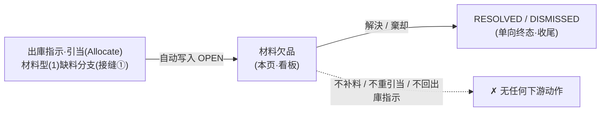
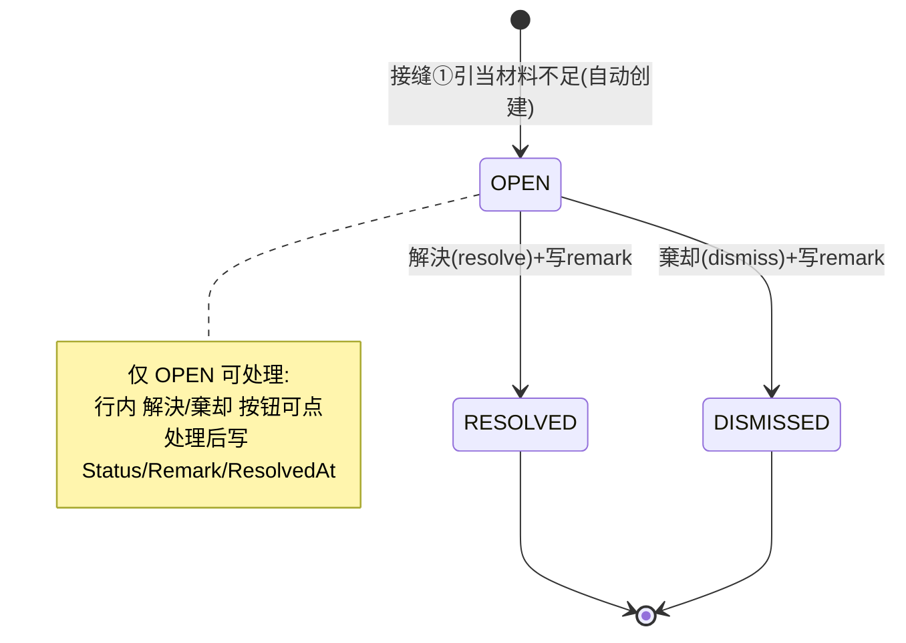

# 材料欠品 单页面操作 SOP（手把手版）

> **用途**：给**生产/仓库管理操作、培训老师讲、测试人员拆用例**。比模块总册（`03-库存物流WMS` §5.14）更细。
> **页面**：材料欠品（MaterialShortage · WM050 · 缺料看板）　**路由**：`/wms/material-shortage`（无 `?no=` 入口，列表式）　**前端**：`views/wms/MaterialShortageView.vue`　**API**：`api/wms/materialShortage.ts materialShortageApi`　**后端**：`Wms/MaterialShortageController` → `MaterialShortageService.TransitionAsync`（resolve/dismiss 共用）
> **基准**：分支 `feat/wfs-inbox-core`，2026-06-29；后端实测 `docs/codemap-wms/03-出庫-出荷.md`（2026-06-22 权威，「材料欠品 Resolve/Dismiss」节 + 接缝①），UI 经实读 view + api + types。
> **样例数据**：来源出庫指示 `OUT2026070001`、製造指図 `WO2026070001`、製品 `PRD2026070001`、LotNo `LOT2026070001`、不足数 `200`。

---

## 1. 页面一句话说明

**材料欠品，就是"引当（锁库存）时材料不够"被系统自动记下来的一块看板——你在这里只能"看"和"收尾"：把一条 OPEN（未处理）的缺料记录点成 解決（RESOLVED）或 棄却（DISMISSED）就算处理完了。** ⚠️ 它是**纯状态收尾**：解決 / 棄却**不会自动补料、不会重新引当、也不会回写出庫指示**，只是在看板上登记"这条我处理过了"。缺料记录**不能在本页新建**——唯一来源是上游出庫指示引当时材料不足（接缝①）自动写入。

---

## 2. 这个页面在业务流程中的位置

- **上游（唯一创建路径）**：出庫指示「引当（Allocate）」时，材料型出庫指示(OutboundType=1)某明细找不到满足单行的库存 → 后端 `AllocateAsync` 不抛异常、写一条 `MaterialShortage`(Status=OPEN) + 推送通知 + 把出庫指示置 `PartialAllocated(5)`。
- **本页**：缺料一览 + 收尾处理（解決 / 棄却）。
- **下游**：**无**。处理只改本记录的状态/备注，是看板登记，不联动库存、不联动出庫指示。

> 对比：出荷型/移管型出庫指示缺料**不写**本看板，而是直接整批回滚（`WM-MSG-040` 库存不足）。本看板只装"材料型"缺料。

---

## 3. 谁使用这个页面

| 角色 | 用途 |
|---|---|
| 生产管理 | 盯未处理缺料、决定这条缺料怎么收尾（已另行补料/无须处理） |
| 仓库管理 | 核对缺的是哪个製品/Lot、哪张出庫指示触发的 |

> 处理动作不会真正补料——补料/再引当要回**出庫指示**页另行操作，本页只做看板登记。

---

## 4. 操作前准备

- [ ] 已经有"引当产生的缺料记录"——即上游某张材料型出庫指示確定后做过「引当」，且有明细库存不足。**没有引当就没有缺料，本页也无法手动造数据**。
- [ ] 想清楚这条缺料要 **解決**（已妥善处理，如线下已补料）还是 **棄却**（不需要处理/误报），因为**两者都是单向终态、处理后不能反悔**。
- [ ] （可选）准备一句备注，说明你为什么这样收尾——会写进 remark 留痕。

---

## 5. 页面区域说明

| 区域 | 内容 |
|---|---|
| 检索卡 | 工程番号（workOrderNo，模糊）输入框 + 状态（status）下拉（ALL/OPEN/RESOLVED/DISMISSED）+「検索」「重置」按钮 |
| KPI 行 | 单卡「未处理件数（openCount）」；**openCount>0 时卡左边框变红**（`.danger`，提醒有未处理缺料） |
| 表格 | 工具条显示「合計: {total}」；表体 11 列（含**不足数红字** + 行尾「解決/棄却」操作列，`fixed=right`）；底部分页 50/100/200 |
| 处理对话框 | 520px；标题随动作变（解決確認 / 棄却確認）；仅一个「备注」多行文本框（≤500 字、show-word-limit）+ 底部「取消 / 確認」 |

> 表格列顺序：检知日時 / 工程番号 / 関連出庫No / 製品CD / LotNo / 必要数 / 利用可能数 / **不足数** / 状态(tag) / 备注 / 操作。

---

## 6. 字段填写说明（口语版）

**检索区**（决定你看到哪些缺料）：

| 字段 | 怎么填 | 说明 |
|---|---|---|
| 工程番号 workOrderNo | 选填，如 `WO2026070001` | 按触发缺料的製造指図号过滤；clearable |
| 状态 status | 下拉，**默认 OPEN** | ALL（空串=全部）/ OPEN / RESOLVED / DISMISSED |

**处理对话框**（解決 / 棄却 共用同一个框，只有标题不同）：

| 字段 | 何时显示 | 怎么填 | 填错影响 |
|---|---|---|---|
| 备注 remark | 解決/棄却均显示 | 选填，≤500 字（如"线下已紧急补料 200"） | 不填也能確認（前端不强校验）；填了会随状态一起写入 remark |

> **本页没有"数量/补料量/再引当"等任何字段**——它不补料。表格里看到的 **必要数 / 利用可能数 / 不足数都是只读展示**，不可编辑。

---

## 7. 按钮操作说明

| 按钮 | 何时出现 / 可点 | 点了会怎样 |
|---|---|---|
| 検索 | 检索卡常显 | 按当前 工程番号+状态 重新查（`query.page` 复位 1） |
| 重置 | 检索卡常显 | 状态回 **OPEN**、工程番号清空、重新查 |
| 解決（行内） | 行尾常显，**仅 `row.status==='OPEN'` 可点**（否则灰） | 打开「解決確認」对话框 |
| 棄却（行内） | 行尾常显，**仅 `row.status==='OPEN'` 可点**（否则灰） | 打开「棄却確認」对话框 |
| 取消（对话框） | 对话框底部 | 关框不提交 |
| 確認（对话框） | 对话框底部 | 解決→`POST .../{id}/resolve`、棄却→`POST .../{id}/dismiss`，带 remark；成功 toast + 关框 + 重新查 |
| 分页 50/100/200 | 表格底部 | 切页/改页大小都触发 `reload()` |

> **无新建、无编辑、无批量、无导出按钮**——本页只能"查 + 单条收尾"。

---

## 8. 标准业务操作 SOP（照着点）

### 场景一：查看未处理缺料（主流程·进页面默认）
- **背景**：进页面想先看有哪些缺料没处理。
- **样例数据**：默认状态 OPEN。
- **步骤**：1) 打开 `/wms/material-shortage`（`onMounted` 自动查一次）；2) 看 KPI「未处理件数」，>0 时卡变红边；3) 表格列出 OPEN 缺料，不足数列红字显示。
- **完成后检查**：列表与 KPI 来自**两次并行查询**（列表按当前条件、openCount 固定查 status=OPEN/pageSize=1 只取 total）；不足数=`max(0, 必要数-利用可能数)`。
- **用例**：TC-M06-SHORTAGE-001、002、003。

### 场景二：解決一条缺料（线下已补料，登记收尾）
- **背景**：缺的 200 已线下紧急补料，这条标记为已解决。
- **样例数据**：来源 `OUT2026070001` / 指図 `WO2026070001` / 製品 `PRD2026070001` / 不足数 200。
- **前置**：该行 `status==='OPEN'`。
- **步骤**：1) （可选）按 `WO2026070001` 检索缩小范围；2) 点该行「解決」→弹「解決確認」框；3) 备注填"线下已补料 200"；4)「確認」。
- **完成后检查**：toast 成功；状态 tag 由 OPEN(红)→RESOLVED(绿)；列表 reload 后（默认仍查 OPEN）该行从列表消失；openCount 减 1。
- **异常**：若该记录已被别人处理→重复提交返 `WM-MSG-SHORTAGE-409`（前端 409）。
- **用例**：TC-M06-SHORTAGE-004、005、006、007。

### 场景三：棄却一条缺料（误报/无须处理）
- **背景**：这条缺料判断为无须处理（如该出庫指示后续会取消）。
- **步骤**：1) 找到 OPEN 行；2) 点「棄却」→「棄却確認」框；3) 备注填原因；4)「確認」。
- **完成后检查**：状态→DISMISSED(灰 info tag)；openCount 减 1；与"解決"唯一差别是终态值，**同样不补料、不动库存**。
- **用例**：TC-M06-SHORTAGE-008、009。

### 场景四：重复处理被拦（单向终态·无反悔）
- **背景**：想把已经 RESOLVED 的缺料再改回去 / 再处理一次。
- **步骤**：1) 状态选 RESOLVED 检索；2) 看行尾「解決/棄却」按钮——已是灰的（`:disabled="row.status!=='OPEN'"`）。
- **检查**：前端按钮就点不动；即便绕过前端直接调接口，后端 `TransitionAsync` 对非 OPEN 记录返 `WM-MSG-SHORTAGE-409` → Controller 转 HTTP 409。**RESOLVED/DISMISSED 是终态，无法回到 OPEN**。
- **用例**：TC-M06-SHORTAGE-010、011、012。

### 场景五：理解缺料从哪来（本页无新建入口）
- **背景**：培训时常被问"怎么手动加一条缺料？"。
- **步骤**：讲解——缺料**只能由上游出庫指示引当(Allocate)材料不足自动产生**（接缝①），本页找不到任何"新建"按钮。
- **检查**：要造缺料 → 去出庫指示页：材料型出庫指示確定→引当，且某明细无满足单行库存，系统自动写一条 OPEN 缺料 + 把出庫指示置 PartialAllocated(5)。
- **用例**：TC-M06-SHORTAGE-013、014。

### 场景六：不足数与"利用可能数=0"的真相
- **背景**：表里"利用可能数"永远是 0，"不足数"看着等于"必要数"。
- **步骤**：观察任意行 利用可能数列。
- **检查**：后端 `MaterialShortage.AvailableQty` **硬编码 0**（命中即不缺、未命中只知无满足单行库存，故不回填实际可用量）；前端不足数=`max(0, 必要数-0)`=必要数。数量列经 `formatQty(n,4)`（4 位小数，如 `200.0000`）。这是已知展示口径，不是 bug。
- **用例**：TC-M06-SHORTAGE-015、016。

### 场景七：按状态/工程番号检索与重置
- **背景**：要在大量历史缺料里找特定的。
- **步骤**：1) 状态选 ALL + 工程番号填 `WO2026070001`→検索；2) 点「重置」。
- **检查**：ALL=空串查全状态；重置后状态回 OPEN、工程番号清空并重查。
- **用例**：TC-M06-SHORTAGE-017、018、019。

---

## 9. 状态变化说明

- 状态是**字符串** `OPEN / RESOLVED / DISMISSED`。
- 仅 `OPEN→RESOLVED` 或 `OPEN→DISMISSED` 两条路；**单向终态、无反悔**（没有 RESOLVED/DISMISSED 改回 OPEN 的入口）。
- tag 颜色：OPEN=danger(红)、RESOLVED=success(绿)、DISMISSED=info(灰)。

---

## 10. 按钮不可用 / 灰色原因

| 现象 | 原因 |
|---|---|
| 行「解決/棄却」是灰的 | 该行 `status!=='OPEN'`（已是 RESOLVED 或 DISMISSED 终态） |
| 整页找不到"新建缺料"按钮 | **本页无新建入口**——缺料只能由上游引当自动产生（接缝①） |
| 找不到"修改/删除/补料/再引当"按钮 | 设计如此：纯状态收尾，不补料、不重引当、不回出庫指示 |
| 找不到批量处理/导出 | **无批量入口、无导出**，只能逐条收尾 |

---

## 11. 常见错误与处理

| 错误 / 误解 | 原因 | 处理 |
|---|---|---|
| 以为「解決」会自动补料/重新引当 | 把看板当成了库存动作 | 解決只改状态；补料请回**出庫指示**页另行引当/出库 |
| 重复处理报 409（`WM-MSG-SHORTAGE-409`） | 记录已非 OPEN（被自己或他人处理过） | 刷新列表看最新状态；终态不可再处理 |
| 处理时报"不存在"（`WM-MSG-070`） | 记录 id 不存在（被并发清理/数据异常） | 重新检索确认该记录还在 |
| 觉得"利用可能数=0"是 bug | `AvailableQty` 后端硬编码 0 | 这是设计口径（命中即不缺），非缺陷 |
| 想手动加一条缺料 | 找不到新建入口 | 本页不支持；缺料由引当材料不足自动生成 |

---

## 12. 操作完成后的检查清单

- [ ] 处理成功有 toast（解決=`msg.resolved` / 棄却=`msg.dismissed`），对话框关闭。
- [ ] 该记录状态→RESOLVED 或 DISMISSED，并写入了 remark 与 ResolvedAt（处理时刻）。
- [ ] KPI「未处理件数（openCount）」相应减少；归零时红边消失。
- [ ] **确认未发生任何下游动作**：库存没动、出庫指示状态没变、没有新建任何单据——本页就是纯看板收尾。
- [ ] 若需真正补料，已另到出庫指示页处理（本页不负责）。

---

## 13. 页面级测试用例（≥25 条，可执行）

> 编号 `TC-M06-SHORTAGE-xxx`；数据用样例（`OUT2026070001` / `WO2026070001` / `PRD2026070001` / `LOT2026070001` / 不足数 200）。

| 用例编号 | 用例名称 | 优先级 | 前置条件 | 测试数据 | 操作步骤 | 预期结果 | 下游检查 | 备注 |
|---|---|---|---|---|---|---|---|---|
| TC-M06-SHORTAGE-001 | 进页面默认查 OPEN | P1 | 有 OPEN 缺料 | 默认 | 打开页面 | 列表显示 OPEN，工具条「合計」=条数 | — | onMounted reload |
| TC-M06-SHORTAGE-002 | KPI openCount 展示 | P1 | 有 OPEN 缺料 | — | 看 KPI 卡 | 显示未处理件数数值 | — | 来自并行查询 |
| TC-M06-SHORTAGE-003 | openCount>0 红边 | P2 | openCount>0 | — | 看 KPI 卡边框 | 左边框红色(`.danger`) | — | 视觉 |
| TC-M06-SHORTAGE-004 | 解決打开对话框 | P0 | 行 status=OPEN | OUT2026070001 行 | 点「解決」 | 弹"解決確認"框，仅备注字段 | — | 标题随动作 |
| TC-M06-SHORTAGE-005 | 解決提交成功 | P0 | OPEN | 备注"已补料" | 解決→確認 | toast 成功、状态→RESOLVED | 列表/KPI 刷新 | resolve 端点 |
| TC-M06-SHORTAGE-006 | 解決后默认列表移除 | P1 | 刚解決 | 默认 OPEN | 处理后看列表 | 该行不在 OPEN 列表（reload 查 OPEN） | openCount-1 | — |
| TC-M06-SHORTAGE-007 | 解決备注留空也可提交 | P2 | OPEN | 备注空 | 解決→確認(不填) | 成功（前端不强校验） | remark 为空 | — |
| TC-M06-SHORTAGE-008 | 棄却提交成功 | P0 | OPEN | 备注"误报" | 棄却→確認 | toast 成功、状态→DISMISSED | KPI 减少 | dismiss 端点 |
| TC-M06-SHORTAGE-009 | 棄却同样不动库存 | P1 | OPEN | — | 棄却后查库存/出庫指示 | 库存与出庫指示均无变化 | 纯状态 | 核心 |
| TC-M06-SHORTAGE-010 | 非 OPEN 行按钮灰 | P0 | RESOLVED/DISMISSED 行 | — | 看行尾按钮 | 解決/棄却均 disabled | — | `status!=='OPEN'` |
| TC-M06-SHORTAGE-011 | 重复处理后端 409 | P0 | 已处理记录 | 同 id | 绕前端再调 resolve | 返 WM-MSG-SHORTAGE-409(HTTP 409) | 不二次改 | — |
| TC-M06-SHORTAGE-012 | 终态不可反悔 | P1 | RESOLVED 行 | — | 找改回 OPEN 入口 | 无任何入口 | — | 单向 |
| TC-M06-SHORTAGE-013 | 本页无新建入口 | P1 | — | — | 找"新建"按钮 | 不存在 | — | 接缝①唯一来源 |
| TC-M06-SHORTAGE-014 | 缺料由引当自动产生 | P1 | 材料型出庫指示缺料 | OUT2026070001 | 出庫指示確定→引当(材料不足) | 自动写 OPEN 缺料、出庫指示→PartialAllocated(5) | 本页可见新行 | 接缝① |
| TC-M06-SHORTAGE-015 | 利用可能数恒为 0 | P2 | 任意行 | — | 看利用可能数列 | 显示 0（硬编码） | — | 设计口径 |
| TC-M06-SHORTAGE-016 | 不足数=max(0,必要-可用) 红字 | P1 | 必要数 200 | — | 看不足数列 | 红字 200.0000（=必要数，因可用 0） | — | formatQty 4 位 |
| TC-M06-SHORTAGE-017 | 按工程番号检索 | P1 | 多条缺料 | WO2026070001 | 填工程番号→検索 | 仅命中该指図缺料 | — | 模糊 |
| TC-M06-SHORTAGE-018 | 状态 ALL 查全部 | P1 | 各状态都有 | status=ALL | 选 ALL→検索 | OPEN/RESOLVED/DISMISSED 全列 | — | 空串 |
| TC-M06-SHORTAGE-019 | 重置回 OPEN | P2 | 改过条件 | — | 点「重置」 | 状态回 OPEN、工程番号清空、重查 | — | — |
| TC-M06-SHORTAGE-020 | 状态 tag 颜色 | P2 | 三态记录 | — | 看 status 列 | OPEN 红/RESOLVED 绿/DISMISSED 灰 | — | statusTag |
| TC-M06-SHORTAGE-021 | 表格列完整 | P2 | 有数据 | — | 看表头 | 检知日時/工程番号/関連出庫No/製品/Lot/必要数/利用可能数/不足数/状态/备注/操作 | — | 11 列 |
| TC-M06-SHORTAGE-022 | 関連出庫No 显示 | P2 | 有缺料 | OUT2026070001 | 看関連出庫No 列 | 显示来源出庫指示号 | — | relatedOutboundNo |
| TC-M06-SHORTAGE-023 | 检知日時格式 | P3 | 有缺料 | — | 看检知日時列 | `YYYY-MM-DD HH:mm:ss`（T→空格、截 19 位） | — | formatDateTime |
| TC-M06-SHORTAGE-024 | 分页切换 | P2 | 缺料>50 | pageSize 100 | 改页大小/翻页 | 触发 reload 重查 | — | 50/100/200 |
| TC-M06-SHORTAGE-025 | 列表+KPI 两次并行查询 | P2 | — | — | 抓网络请求 | 同时发 2 个 search（列表条件 + status=OPEN/pageSize=1） | — | Promise.all |
| TC-M06-SHORTAGE-026 | 分页字段大小写兼容 | P3 | 后端返 Items/Total | — | 检视 normalizePaged | items/Items、total/Total 均能解析 | — | 兼容层 |
| TC-M06-SHORTAGE-027 | 无批量入口 | P2 | 多条 OPEN | — | 找批量解決 | 不存在，只能逐条 | — | 现状 |
| TC-M06-SHORTAGE-028 | 解決不补料不重引当 | P0 | OPEN | — | 解決后查库存/引当 | 库存、AllocatedQty 均不变 | 出庫指示不变 | 核心铁律 |
| TC-M06-SHORTAGE-029 | 记录不存在 | P2 | 错误 id | 不存在 id | 调 resolve | 返 WM-MSG-070 | — | 404 类 |
| TC-M06-SHORTAGE-030 | 权限不足 | P2 | 无权账号 | — | 进页面/处理 | 待业务确认（隐藏/拒绝） | — | 权限 |
| TC-M06-SHORTAGE-031 | 网络异常可重试 | P2 | 断网 | — | 確認提交 | 友好错误、loading 归位可重试 | — | actionSaving |

---

## 14. 培训讲解建议

| 顺序 | 讲什么 | 演示 | 易误解点 |
|---|---|---|---|
| 1 | 这页是"缺料看板"不是"补料台" | §1 一句话 | 以为解決=自动补料 |
| 2 | 缺料从哪来（接缝①引当不足） | §2 流程图 | 想在本页手动新建 |
| 3 | 只能查 + 单条收尾（解決/棄却） | 行内两按钮 | 找改/删/批量 |
| 4 | 单向终态、无反悔 | 处理后按钮变灰 | 想把 RESOLVED 改回 OPEN |
| 5 | 重复处理会 409 | 讲 `WM-MSG-SHORTAGE-409` | 不知为何提交失败 |
| 6 | 利用可能数恒为 0 是设计 | 看表格列 | 当成数据 bug |
| 7 | 真要补料回出庫指示页 | 跳出庫指示 | 以为本页能联动库存 |

---

## 15. 与模块级手册的关系

对应 `03-库存物流WMS-最详细用户操作培训手册.md` §5.14（材料欠品 · WM050），逐条覆盖 5.14.1~5.14.14：业务目的（纯状态收尾）、流程位置（接缝①唯一创建路径）、页面区域（检索/KPI/表格/对话框）、字段检索（workOrderNo+status）、按钮（解決/棄却 `:disabled`）、校验（`WM-MSG-070` / `WM-MSG-SHORTAGE-409` / AvailableQty 硬编码 0）、状态流转（OPEN→RESOLVED/DISMISSED 单向）、注意事项（两次并行查询 / `normalizePaged` 兼容 / 无批量）。

---

## 16. 代码与文档来源

| 层 | 文件 |
|---|---|
| 逐行源码手册 | `docs/codemap-wms/03-出庫-出荷.md`（权威；「材料欠品 Resolve/Dismiss」节 + 接缝①引当分流 + 错误码表） |
| 前端 view | `cp6.web/src/views/wms/MaterialShortageView.vue`（KPI/列表/对话框 + `reload` 并行查询 + `submitAction`） |
| 前端 API | `cp6.web/src/api/wms/materialShortage.ts`（search / resolve / dismiss 三端点） |
| 前端类型 | `cp6.web/src/types/wms/materialShortage.ts`（`MaterialShortageStatus` / `MaterialShortagePaged` 大小写兼容字段） |
| 后端 Controller | `Controllers/Wms/MaterialShortageController.cs`（catch `WM-MSG-SHORTAGE-409`→409，其余→400） |
| 后端 Service | `Services/Wms/MaterialShortageService.cs`（`TransitionAsync` 78：不存在→070、非 OPEN→409、置 Status/Remark/ResolvedAt） |
| 创建路径 | `Services/Wms/OutboundService.cs AllocateAsync`(342)：材料型缺料分支 `_shortage.CreateAsync(...AvailableQty=0,Status=Open)` |
| 实体 | `DomainModels/Wms/MaterialShortage.cs`（`T_MaterialShortage`，状态 OPEN/RESOLVED/DISMISSED） |

---

## 最后更新来源

- 代码：见 §16（codemap-wms 03「材料欠品 Resolve/Dismiss」+ 接缝① + view/api/types 实读）。
- 基准：分支 `feat/wfs-inbox-core`，2026-06-29（codemap 2026-06-22 权威）。
- 覆盖：16 节 / 7 场景 / 31 用例（TC-M06-SHORTAGE-001~031）。
