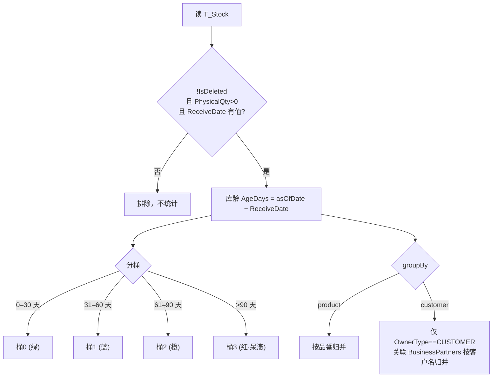

# 在庫滞留（呆滞分析）单页面操作 SOP（手把手版）

> **用途**：给**库存/经营层看呆滞、培训老师讲、测试人员拆用例**。比模块总册（`03-库存物流WMS` §5.17）更细。
> **页面**：在庫滞留（WM020 · 库存物流 WMS）　**路由**：`/wms/stock-dwell`　**前端**：`views/wms/StockDwellView.vue`　**API**：`api/wms/stockDwell.ts`（POST body）　**后端**：`Wms/StockDwellController` → `StockDwellService.GetSummaryAsync`
> **基准**：分支 `feat/wfs-inbox-core`，2026-06-29；后端实测 `docs/codemap-wms/01-库存核心-铁律.md`（在庫滞留分析节，2026-06-22 权威），UI 经实读 view。
> **样例数据**：倉庫 `W01`、製品 `PRD2026070001`、客户 `CUST-A`、截止日=今天、単価 `¥120`。

---

## 1. 页面一句话说明

**在庫滞留，就是给库存/经营层看"哪些货压了太久"的纯只读分析页——把现有库存按"品番"或"客户"分组，每组按"库龄"分成 0-30 / 31-60 / 61-90 / >90 天四个桶，看每桶的数量和金额，红色聚焦超过 90 天的呆滞货。** 它**只看不动**：不新增、不编辑、不删除、不改一丝库存，纯查询统计。

---

## 2. 这个页面在业务流程中的位置

- **上游**：`T_Stock` 现有库存（来自入庫/出庫等库存铁律写入，本页只读取）。
- **本页**：按截止日把库存按库龄分桶聚合，给人看。
- **下游**：**没有系统下游**——它输出的是给人看的呆滞情报，是否促销/退仓/报废由人工在别处决策。本页**不触发任何库存变动**。

---

## 3. 谁使用这个页面

| 角色 | 用途 |
|---|---|
| 库存管理 / 仓管主管 | 盯哪些品番压货、超 90 天呆滞清单 |
| 经营层 / 财务 | 看呆滞金额占比，做减值/清库决策 |
| 业务 / 客户经理 | 按客户分组看某客户寄存/自有货的滞留 |

> 全是"看报表"的角色——本页没有任何录入/审批动作。

---

## 4. 操作前准备

- [ ] 知道要从哪个角度看：**按品番**（哪些产品压货）还是**按客户**（哪个客户的货滞留）。
- [ ] 想清楚**截止日**（asOfDate）：默认今天；要做历史回溯（如"上月末的呆滞"）就改日期。
- [ ] 若要缩小范围，准备好倉庫CD（如 `W01`）/ 品番CD（如 `PRD2026070001`）/ 货主CD（如 `CUST-A`）——都是**精确匹配的自由文本**，填错只会查不到、无提示。
- [ ] 明确这是**只读页**：不要找新增/导出/操作按钮，没有。

---

## 5. 页面区域说明

| 区域 | 内容 |
|---|---|
| 检索条件卡 | 分组方式（品番/客户单选）+ 倉庫CD + 品番CD + 货主CD + 截止日 + 「検索」「リセット」按钮 |
| KPI 四卡 | 合計数量 / **>90天数量**(红框) / **>90天占比**(橙框) / 合計金額(绿框)；over90Value 不在此显示 |
| 库龄分桶图卡 | 仅渲染**前 8 个分组**的堆叠条（绿 0-30 / 蓝 31-60 / 橙 61-90 / 红 >90），右上角显示截止日；无数据时空态图 |
| 明细表卡 | 顶部「合計: N（分组数）」标签 + 全量表格：分组 / 合計数量 / 合計金額 / 四桶数量 / 最旧入庫日 / 最旧库龄(tag) |

> PC 显示表格；移动端（`isMobile`）自动切成精简卡片列表，只显分组 + 合計数量 + >90天数量 + 最旧库龄。

---

## 6. 字段填写说明（口语版）

**检索条件**（全部可空，POST body 一起发后端）：

| 字段 | 怎么填 | 说明 / 填错影响 |
|---|---|---|
| 分组方式 groupBy | 单选「按品番(product)」或「按客户(customer)」 | 默认按品番；按客户时仅统计货主类型=客户(OwnerType==CUSTOMER)的库存，按客户名归并 |
| 倉庫CD warehouseCd | 自由文本，如 `W01`，可空 | 留空=全仓；填错码→查无结果且无提示 |
| 品番CD productCd | 自由文本，如 `PRD2026070001`，可空 | 留空=全品番 |
| 货主CD ownerCd | 自由文本，如 `CUST-A`，可空 | **自由文本无下拉、无校验**，易填错→空结果无提示 |
| 截止日 asOfDate | 日期选择器，默认今天 | 算库龄的基准（库龄=截止日−入庫日）；清空后查询自动回退为今天 |

> 没有"分组键"以外的可填项——本页**不录入任何业务数据**，所有输入都只是筛选条件。

---

## 7. 按钮操作说明

| 按钮 | 位置 | 点了会怎样 |
|---|---|---|
| 検索（Search） | 检索条件卡 | 用当前条件 POST 查询，刷新 KPI + 分桶图 + 明细表；按钮带 loading |
| リセット（Reset） | 检索条件卡 | 分组回「品番」、清空仓/品番/货主、截止日回今天，并**立即重新查询** |
| 分组单选（品番/客户） | 检索条件卡 | 切换后**需再点「検索」**才生效（切换本身不自动刷新） |

> **本页只有这两个按钮**。没有新增、编辑、删除、CSV 导出、打印、过账等任何写/导出动作——它是纯只读分析页。页面打开时（onMounted）会用默认条件自动查一次。

---

## 8. 标准业务操作 SOP（照着点）

### 场景一：打开页面看整体呆滞（主流程）
- **背景**：仓管主管每天上班先扫一眼呆滞总览。
- **样例数据**：默认条件（按品番 + 今天）。
- **前置**：有库存数据（PhysicalQty>0 且有入庫日）。
- **步骤**：1) 打开 `/wms/stock-dwell`，页面自动加载默认查询；2) 看 KPI 四卡（合計数量 / >90天数量 / >90天占比 / 合計金額）；3) 看分桶图红段、看明细表。
- **完成后检查**：KPI 合計数量=明细各组数量之和；分桶图最多 8 条；表格顶部「合計: N」=分组数。
- **异常**：库里没有满足条件的库存→分桶图与表格显示空态，KPI 显示 `-` 或 0。
- **用例**：TC-M06-DWELL-001、009、013。

### 场景二：按客户角度看滞留
- **背景**：客户经理想看某客户寄存/自有货压了多久。
- **样例数据**：分组=客户、货主 `CUST-A`。
- **步骤**：1) 分组单选切「按客户」；2)（可选）货主CD 填 `CUST-A`；3) 点「検索」。
- **检查**：明细「分组」列变成客户名称；**只统计货主类型=CUSTOMER 的库存**（自有/其他类型不计入客户分组）。
- **易错**：切了分组没点「検索」→ 数据还是旧的（品番口径）。
- **用例**：TC-M06-DWELL-003、024。

### 场景三：聚焦 >90 天呆滞
- **背景**：经营层只关心"压了 3 个月以上"的货。
- **步骤**：1) 看 >90天数量（红框 KPI）和 >90天占比（橙框）；2) 在明细表看最右两列：>90天桶（红字）+ 最旧库龄 tag（>90 显红 danger）；3) 按需用品番/客户口径切换定位。
- **检查**：>90天占比=>90天数量÷合計数量（保留 1 位小数 %）；最旧库龄>90 的行 tag 变红。
- **盲点**：金额维度的 `over90Value` 后端算了但**页面不显示**，只能看 >90天**数量**。
- **用例**：TC-M06-DWELL-010、011、014、015。

### 场景四：缩小到某仓 / 某品番
- **背景**：只查 W01 仓里 PRD2026070001 的滞留。
- **步骤**：倉庫CD=`W01`、品番CD=`PRD2026070001`→「検索」。
- **检查**：结果仅含该仓该品番；其余条件留空即不过滤。
- **易错**：CD 大小写/拼写错→空结果且**无任何错误提示**（自由文本无校验）。
- **用例**：TC-M06-DWELL-004、005、027。

### 场景五：指定截止日做历史回溯
- **背景**：想看"上月末"那天的呆滞分布。
- **步骤**：截止日选过去某天→「検索」。
- **检查**：库龄=截止日−入庫日，越早的截止日库龄越小、>90桶可能变少；分桶图右上角截止日 tag 同步。
- **边界**：清空截止日再查→自动用今天。
- **用例**：TC-M06-DWELL-007、008。

### 场景六：分组超过 8 行时核对图表盲点
- **背景**：品番很多，图表看不全。
- **步骤**：让结果有 >8 个分组→观察分桶图 vs 明细表。
- **检查**：**分桶图只画前 8 个分组**（`rows.slice(0,8)`），第 9 行起**只在表格里**，图上完全没有、也没有"仅显示前 8 行"的提示——核对呆滞别只看图，要看表。
- **用例**：TC-M06-DWELL-016、028。

### 场景七：リセット恢复默认
- **背景**：改乱了条件想从头来。
- **步骤**：点「リセット」。
- **检查**：分组回品番、仓/品番/货主清空、截止日回今天，并立即重查。
- **用例**：TC-M06-DWELL-018。

---

## 9. 数据口径与库龄分桶逻辑（本页无状态机）

> 本页是**纯只读分析**，没有单据、没有状态流转，所以没有"状态变化"。这里说明它的**取数口径与分桶算法**（后端 `StockDwellService.GetSummaryAsync`）。

- **取数过滤**：`Stocks.Where(!IsDeleted && PhysicalQty>0 && ReceiveDate.HasValue)`——已删除、零/负库存、无入庫日的行**全部不计**。
- **库龄**：`AgeDays = asOfDate − ReceiveDate`，落入四桶之一。
- **分组**：product 按品番；customer 仅取货主类型=CUSTOMER 的库存，关联 `BusinessPartners` 按客户名归并（自有/其他货主不进客户口径）。
- **纯只读、无错误码**：后端不做写入、不抛 WM-MSG 业务码。

---

## 10. 按钮不可用 / 找不到的原因

| 现象 | 原因 |
|---|---|
| 找不到"新增/编辑/删除" | **本页纯只读**，没有任何写入端点 |
| 找不到"CSV 导出/打印" | 未提供导出功能（现状） |
| 「検索」转圈不出数 | 后端查询中（loading），等返回 |
| 切了分组数据没变 | 分组切换**不自动刷新**，需再点「検索」 |
| 图表只有几条、表格更多 | 图表**只画前 8 个分组**，是现状非 bug |

---

## 11. 常见疑问与处理（无错误码）

> 本页纯只读、后端**无 WM-MSG 错误码**；以下是"结果不符预期"的排查。

| 现象 | 原因 | 处理 |
|---|---|---|
| 查不到任何数据 | 仓/品番/货主CD 填错（自由文本无校验），或库里无符合条件库存 | 核对 CD 拼写大小写；清空条件重查 |
| 某客户的货没出现在客户分组 | 该库存货主类型≠CUSTOMER | 客户口径只统计 OwnerType==CUSTOMER |
| 零库存品番不显示 | 过滤 `PhysicalQty>0` | 正常，呆滞只看有货的 |
| 入庫日为空的货不统计 | 过滤 `ReceiveDate.HasValue` | 正常，无入庫日无法算库龄 |
| 金额看起来"少了货币符号" | 金额按 0 位**数量格式**输出，**无 ¥ 符号** | 现状；金额是数值，自行按本位币理解 |
| 想看 >90 天的金额 | `over90Value` 后端有但**页面未展示** | 现状盲点；页面只给 >90 天**数量** |
| 图表漏了分组 | 图表只画前 8 行 | 看明细表全量 |

---

## 12. 操作完成后的检查清单

- [ ] 库存**完全未变动**——本页只读，不产生任何 T_Stock / T_StockTransaction 写入。
- [ ] KPI 合計数量 = 明细各组 合計数量 之和；>90天占比 = >90天数量 ÷ 合計数量（1 位小数）。
- [ ] 四桶数量加总 = 该组合計数量；红桶(>90) = 该组 `bucketOver90Qty`。
- [ ] 分桶图分组数 ≤ 8；明细表分组数 = 顶部「合計: N」。
- [ ] 最旧库龄 tag：>90 显红(danger)，否则灰(info)；与最旧入庫日对得上。
- [ ] 截止日 = 检索条件里选的日期（清空则今天）；分桶图右上角 tag 同步。

---

## 13. 页面级测试用例（≥25 条，可执行）

> 编号 `TC-M06-DWELL-xxx`；样例数据：倉庫 `W01`、製品 `PRD2026070001`、客户 `CUST-A`、截止日今天、単価 `¥120`。本页只读，"下游检查"主要确认**库存零变动**。

| 用例编号 | 用例名称 | 优先级 | 前置条件 | 测试数据 | 操作步骤 | 预期结果 | 下游检查 | 备注 |
|---|---|---|---|---|---|---|---|---|
| TC-M06-DWELL-001 | 打开页面自动加载 | P1 | 有库存数据 | 默认条件 | 打开 /wms/stock-dwell | onMounted 自动查询，KPI+图+表出数 | 库存不变 | — |
| TC-M06-DWELL-002 | 默认分组=按品番 | P2 | — | — | 看分组单选 | 默认选中「品番(product)」 | — | — |
| TC-M06-DWELL-003 | 切换按客户分组 | P0 | 有客户货主库存 | groupBy=customer | 切客户→検索 | 分组列变客户名，按客户聚合 | 库存不变 | 切换需再検索 |
| TC-M06-DWELL-004 | 按仓库筛选 | P1 | W01 有库存 | warehouseCd=W01 | 填仓→検索 | 仅 W01 库存进统计 | 库存不变 | — |
| TC-M06-DWELL-005 | 按品番筛选 | P1 | 该品番有库存 | productCd=PRD2026070001 | 填品番→検索 | 仅该品番 | 库存不变 | — |
| TC-M06-DWELL-006 | 按货主筛选 | P2 | CUST-A 有货 | ownerCd=CUST-A | 填货主→検索 | 仅该货主库存 | 库存不变 | — |
| TC-M06-DWELL-007 | 指定截止日历史回溯 | P1 | — | asOfDate=过去日 | 选过去日→検索 | 库龄变小，分桶随之变 | 截止日 tag 同步 | — |
| TC-M06-DWELL-008 | 清空截止日回退今天 | P2 | — | asOfDate 清空 | 清空→検索 | payload 用今天 | — | 边界 |
| TC-M06-DWELL-009 | KPI 合計数量 | P1 | 有数据 | — | 看 KPI | 合計数量=各组之和 | — | 一致性 |
| TC-M06-DWELL-010 | KPI >90天数量(红框) | P0 | 有>90天货 | — | 看 danger 卡 | 显示 over90Qty | — | 呆滞核心 |
| TC-M06-DWELL-011 | KPI >90天占比 | P1 | 有数据 | — | 看 warning 卡 | =over90Qty÷totalQty，1位小数% | — | — |
| TC-M06-DWELL-012 | 合計金額无货币符号 | P1 | 有数据 | 単価¥120 | 看 value 卡 | 金额按 0 位数量格式，**无 ¥** | — | 盲点 |
| TC-M06-DWELL-013 | 库龄四桶分布 | P0 | 各库龄都有 | — | 看明细四桶列 | 按 asOfDate−ReceiveDate 落 0-30/31-60/61-90/>90 | — | 算法核心 |
| TC-M06-DWELL-014 | >90天列红色高亮 | P1 | 有>90天货 | — | 看表格 b3 列 | over90 数量红字(over90-text) | — | — |
| TC-M06-DWELL-015 | 最旧入庫日+库龄tag | P1 | — | — | 看末两列 | oldestReceiveDate + 库龄 tag(>90 红) | — | — |
| TC-M06-DWELL-016 | 图表只画前8行(盲点) | P1 | 分组>8 | 9+ 个品番有货 | 看图 vs 表 | 图仅前8组，表全量，无提示 | — | 现状 |
| TC-M06-DWELL-017 | 无数据空态 | P2 | 条件无命中 | 不存在的品番 | 検索 | 图与表显示空态 el-empty | — | — |
| TC-M06-DWELL-018 | リセット恢复默认 | P1 | 改过条件 | — | 点リセット | 回品番+今天+清空并重查 | — | — |
| TC-M06-DWELL-019 | 只读无增改删 | P0 | — | — | 找写按钮 | 无新增/编辑/删除入口 | — | 现状 |
| TC-M06-DWELL-020 | 操作不改库存 | P0 | 有库存 | 任意检索 | 多次検索 | 前后 T_Stock 完全不变 | 库存表对比 | 只读铁证 |
| TC-M06-DWELL-021 | 仅统计 PhysicalQty>0 | P1 | 有0库存品 | — | 検索 | 零/负库存不出现 | — | 过滤 |
| TC-M06-DWELL-022 | 无 ReceiveDate 不统计 | P2 | 有无入庫日货 | — | 検索 | 该行被排除 | — | 过滤 |
| TC-M06-DWELL-023 | 已删除库存排除 | P2 | 有 IsDeleted 行 | — | 検索 | 不计入 | — | 过滤 |
| TC-M06-DWELL-024 | 客户口径仅 OwnerType==CUSTOMER | P1 | 混合货主 | groupBy=customer | 検索 | 仅客户货主按客户名归并 | — | — |
| TC-M06-DWELL-025 | over90Value 页面不显(盲点) | P2 | 有>90天货 | — | 找金额维度>90 | 页面无该字段(后端有) | — | 现状 |
| TC-M06-DWELL-026 | 数量4位小数格式 | P3 | 有小数库存 | — | 看数量列 | formatQty 保留 4 位 | — | — |
| TC-M06-DWELL-027 | 货主CD填错→空结果无提示 | P2 | — | ownerCd=错码 | 検索 | 空结果，无错误提示 | — | 自由文本盲点 |
| TC-M06-DWELL-028 | 无分页全量渲染 | P2 | 分组很多 | — | 看表格 | 全量渲染无分页 | — | 现状 |
| TC-M06-DWELL-029 | POST body 查询 | P2 | — | — | 抓包 | POST /wms/stock-dwell/summary，条件在 body | — | — |
| TC-M06-DWELL-030 | 移动端卡片视图 | P3 | 窄屏 | — | isMobile | 切 mobile-list 精简卡片 | — | 响应式 |

---

## 14. 培训讲解建议

| 顺序 | 讲什么 | 演示 | 易误解点 |
|---|---|---|---|
| 1 | 这页是给经营/库存层看呆滞的**只读报表** | §2 流程图 | 以为能在这报废/调库存 |
| 2 | 两种视角：按品番 vs 按客户 | 切分组→検索 | 切了不検索数据不变 |
| 3 | 库龄四桶+红色聚焦 >90 天 | 看 KPI 红框+表红列 | 把"库龄"当"保质期"（不同概念） |
| 4 | 截止日是库龄基准 | 改日期看库龄变 | 不知道清空=今天 |
| 5 | 金额无货币符号、>90金额不显 | 看合計金額卡 | 以为缺货币是 bug |
| 6 | 图表只画前 8 行 | 让分组>8 对比图表 | 只看图漏掉呆滞 |
| 7 | CD 是自由文本，填错只是空结果 | 故意填错码 | 等"报错提示"（没有） |

---

## 15. 与模块级手册的关系

对应 `03-库存物流WMS-最详细用户操作培训手册.md` §5.17「库存分析与设置类」首行**在庫滞留 WM020(/stock-dwell)**（与出庫ルーティング/期限管理/ロットトレース并列）。总册以表格概述本页要点（只读不动库存、按品番/客户分库龄四桶、图表只画前 8 行、金额无货币符号、`over90Value` 后端有 UI 不显、无分页全量渲染、纯只读无错误码）；本 SOP 是其手把手展开版。

---

## 16. 代码与文档来源

| 层 | 文件 |
|---|---|
| 逐行源码手册 | `docs/codemap-wms/01-库存核心-铁律.md`（在庫滞留分析节，权威 2026-06-22） |
| 前端 | `cp6.web/src/views/wms/StockDwellView.vue`（实读） |
| API | `cp6.web/src/api/wms/stockDwell.ts`（POST `/wms/stock-dwell/summary`） |
| 类型 | `cp6.web/src/types/wms/stockDwell.ts`（StockDwellQuery/Row/Summary） |
| 后端 | `Controllers/Wms/StockDwellController.cs` → `Services/Wms/StockDwellService.GetSummaryAsync`（只读 `Stocks.Where(!IsDeleted && PhysicalQty>0 && ReceiveDate.HasValue)`，AgeDays 四桶，customer 用 OwnerType==CUSTOMER 关联 BusinessPartners） |
| 工具 | `cp6.web/src/utils/format.ts`（formatQty：4 位/金额 0 位无货币符号） |

---

## 最后更新来源

- 代码：见 §16（codemap-wms 01 在庫滞留节 + view/api/types 实读）。
- 基准：分支 `feat/wfs-inbox-core`，2026-06-29（codemap 2026-06-22 快照）。
- 覆盖：16 节 / 7 场景 / 30 用例（TC-M06-DWELL-001~030）。
- 诚实标注：图表只画前 8 行无提示、金额无货币符号、`over90Value` UI 不显、无分页全量渲染、货主CD 自由文本无校验、纯只读无 WM-MSG 错误码——均为现状非建议。
