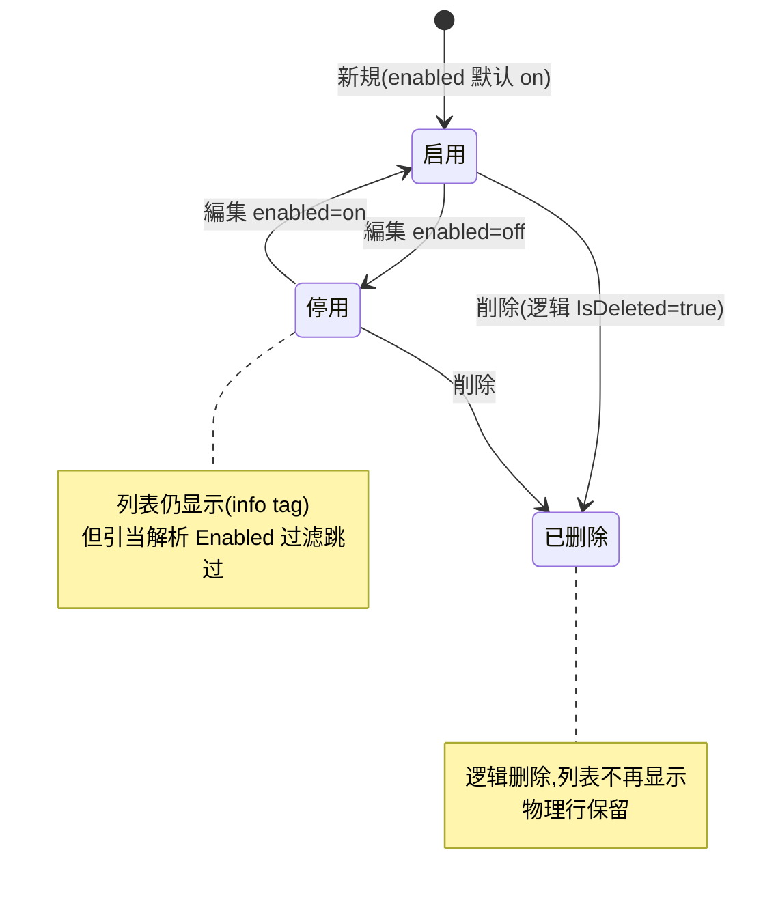

# 出庫ルーティング（多仓引当路由规则）单页面操作 SOP（手把手版）

> **用途**：给 **WMS 配置员/仓库管理员配置，培训老师讲，测试人员拆用例**。比模块总册（`03-库存物流WMS` §5.17）更细。
> **页面**：出庫ルーティング（多倉庫引当路由 · 库存物流 WMS）　**路由**：`/outbound-routing`　**前端**：`views/wms/OutboundRoutingView.vue`　**API**：`api/wms/outboundRouting.ts outboundRoutingApi`　**后端**：`Wms/OutboundRoutingController` → `OutboundRoutingService`（消费方=`OutboundService` 引当，见 5.9）
> **基准**：分支 `feat/wfs-inbox-core`，2026-06-29；UI 经 view 实读，后端经 `OutboundRoutingController.cs`/`OutboundRoutingService.cs` 实读。codemap-wms **无本页专章**，下游引当语义以总册 §5.17 + 后端服务实读为准；标「待业务确认」处为代码未发现或需业务定夺。
> **样例数据**：规则名 `优先W01`、目标仓 `W01`、客户 `CUST-A`、品番前缀 `PRD`、出库类型 `2 出荷`、sortOrder `100`、兜底仓 `W02`。

---

## 1. 页面一句话说明

**出庫ルーティング，就是 WMS 配置员维护一张"出库时该从哪个仓库引当"的路由规则表——每条规则用「客户 / 品番前缀 / 出库类型」做匹配条件，命中后给出一个目标仓库，多条规则按 sortOrder（越小越优先）排队；这页改的是"配置"不是库存，但它决定了下游 5.9 出庫指示引当时（`ResolveCandidateWarehousesAsync`）候选仓库的排队顺序。** 页面还带一个「プレビュー（候补仓库预览）」验证工具，填模拟条件就能看到这套规则当下会按什么顺序给出候选仓。

---

## 2. 这个页面在业务流程中的位置

```mermaid
flowchart LR
  CFG["WMS 配置员"] -->|新規/編集/削除| ROUTE["出庫ルーティング<br/>(本页·配置)"]
  ROUTE -->|保存| RULES[("路由规则表<br/>OutboundRoutingRules")]
  RULES -.读取.-> RESOLVE["出庫指示 引当(5.9)<br/>ResolveCandidateWarehousesAsync"]
  RESOLVE -->|按序候选仓列表| ALLOC["FEFO + QC 选批 → RSV 引当"]
  ROUTE -->|プレビュー(只读验证)| PV["候补仓库预览<br/>首选绿·其余灰"]
```

- **上游**：仓库主数据（倉庫マスタ，提供可选目标仓 + `OutboundPriority` 出库优先级）。
- **本页**：维护路由规则 + 预览验证（**不直接动库存**）。
- **下游**：5.9 出庫指示「引当」时调用 `ResolveCandidateWarehousesAsync`，按本页规则解析出**有序候选仓列表**，再在每个仓内做 FEFO+QC 选批锁库存（接缝① RSV）。改错规则 → 引当可能走错仓 / 找不到货。

---

## 3. 谁使用这个页面

| 角色 | 用途 |
|---|---|
| WMS 配置员 / 仓库管理员 | 维护多仓引当路由规则、调优先级、启停、预览验证 |
| 业务/物流主管 | 审视"哪个客户/品番从哪个仓发"的策略是否合理 |
| 测试人员 | 拆用例验证匹配优先级、预览、盲点 |

> 现场库管员（入出庫担当）一般**不**用本页——他们在 5.9 出庫指示直接引当，引当结果由这里的配置在背后决定。

---

## 4. 操作前准备

- [ ] 目标仓库已在**倉庫マスタ建档**（如 `W01`/`W02`）；下拉可选。⚠️ 本页目标仓输入框开了 `allow-create`，**就算填一个主档里不存在的仓库码也能保存**（无存在性校验），所以"先建档"是规范而非系统强制（见 §10/§11 盲点）。
- [ ] 想清这条规则的匹配条件：限哪个客户？限哪个品番前缀？限哪种出库类型？——三者**留空=任意（通配）**。
- [ ] 想清优先级 sortOrder：**数字越小越优先**，默认 100；多条规则命中时小号先排进候选。
- [ ] （可选）准备一组预览用数据：品番、客户、出库类型、兜底仓，用来在保存后立即验证排队结果。
- [ ] 确认部署已开启多仓路由开关（配置项 `OutboundRouting:Enabled`）。若为 false，后端走 `NoOpOutboundRoutingService`——引当只用兜底仓、且本页新増/編集/削除会被后端拒绝（"多倉庫ルーティングは無効です"）。当前部署是否开启=**待业务确认**。

---

## 5. 页面区域说明

| 区域 | 内容 |
|---|---|
| 页头 | 标题 + 副标题（`title`/`subtitle`） |
| 规则列表卡 | 工具条（「新規」`primary`、「更新/刷新」、合计 tag=`总数: N`）+ 表格：sortOrder / ruleName / customerCd（空显"任意"）/ productCdPrefix（空显"任意"）/ outboundType（空显"任意"，否则译文）/ targetWarehouseCd / enabled（启用=success tag/停用=info tag）/ remarks / 操作列（编集·删除，`fixed=right`）|
| 候補倉庫プレビュー卡 | 验证工具：品番(productCd)/客户(customerCd, clearable)/出库类型(下拉默认2, **无 clearable**)/兜底仓(fallbackWarehouseCd, clearable)+「プレビュー」按钮；结果区按序展示候选仓 tag（**第1个绿 success，其余灰 info**，形如 `1. W01`）|
| 作成／編集ダイアログ | 560px；标题随动作变（新規作成/編集）；字段=ruleName(必填) / sortOrder(数字 0~9999) / customerCd(clearable, 占位"任意") / productCdPrefix(clearable, 占位"任意") / outboundType(下拉 clearable, 占位"任意") / targetWarehouseCd(下拉 filterable **allow-create**, 必填) / enabled(开关) / remarks(文本域)；底部 取消 / 確定 |

---

## 6. 字段填写说明（口语版）

**规则字段**（作成／編集对话框）：

| 字段 | 必填? | 怎么填 | 空值含义 / 填错影响 |
|---|---|---|---|
| ruleName（规则名） | ✅ 必填 | 起个能看懂的名字，如 `优先W01`；最长 100 字 | 空→前端拦 `wms.outboundRouting.msg.required`；后端 `WM-MSG-021` |
| sortOrder（优先级） | 否（默认100） | 数字 0~9999，**越小越优先**；同号再按创建时间先后 | 留默认即可；想插队就给更小的数 |
| customerCd（客户CD） | 否 | 限定客户，如 `CUST-A`；最长 20 字 | **空=匹配任意客户** |
| productCdPrefix（品番前缀） | 否 | 限定品番开头，如 `PRD`（前缀匹配，大小写不敏感）；最长 20 字 | **空=匹配任意品番**；非空时按"以此开头"判定 |
| outboundType（出库类型） | 否 | 下拉选 1材料 / 2出荷 / 3社内振替 | **空=匹配任意类型**。⚠️ 下拉**缺 9 その他**（仅 1/2/3，见 §10 盲点） |
| targetWarehouseCd（目标仓） | ✅ 必填 | 命中后引当走的仓，如 `W01`；下拉可选已建档仓，也可手输 | 空→前端拦/后端 `WM-MSG-021`。⚠️ **allow-create**：可输主档不存在的仓库码且不报错 |
| enabled（启用） | 否（默认开） | 开=参与引当解析；关=列表仍显示但解析时被跳过 | 停用规则不影响匹配，相当于临时下线 |
| remarks（备考） | 否 | 说明用途；最长 500 字 | — |

**预览字段**（候補倉庫プレビュー）：

| 字段 | 必填? | 怎么填 | 备注 |
|---|---|---|---|
| productCd（品番） | ✅ 必填 | 模拟一个完整品番，如 `PRD-001` | 空→前端拦 `wms.outboundRouting.preview.needProduct` |
| customerCd（客户） | 否 | 模拟客户，如 `CUST-A`；clearable | 空→后端按"任意客户"规则匹配 |
| outboundType（出库类型） | —（默认2） | 下拉 1/2/3，**默认2、无 clearable** | ⚠️ 不能清空成"任意"，与对话框可清空不一致（§10 盲点） |
| fallbackWarehouseCd（兜底仓） | 否 | 模拟出庫指示头上的仓，如 `W02`；clearable | 作为候选列表最后的保险仓追加 |

> **后端候选仓解析顺序（`ResolveCandidateWarehousesAsync`，预览=同一逻辑）**：① 命中规则（启用+未删+客户匹配+类型匹配，再按品番前缀 StartsWith 过滤）按 sortOrder↑→创建时间↑ 取目标仓 → ② 其余所有仓按倉庫マスタ `OutboundPriority`↑→仓库码 追加 → ③ 兜底仓追加。**全程按仓库码去重（大小写不敏感），第一个=首选（绿）。** 所以只要系统里有仓库或填了兜底仓，预览基本不会空。

---

## 7. 按钮操作说明

| 按钮 | 位置 | 点了会怎样 |
|---|---|---|
| 新規 | 列表工具条 | 清空表单（sortOrder=100/enabled=on 默认）→开对话框「新規作成」 |
| 更新/刷新 | 列表工具条 | 重新拉取列表（`list(includeDisabled=true)`，含停用规则） |
| 編集 | 行内 | 载入该行→开对话框「編集」 |
| 削除 | 行内 | 弹确认框→确认后**逻辑删除**（后端 `IsDeleted=true`），列表不再显示 |
| プレビュー | 预览卡 | 用当前预览条件调后端解析→渲染有序候选仓 tag（首绿其余灰） |
| 確定（对话框） | 对话框底 | 前端先校验 ruleName/targetWarehouseCd→新建走 `create`/编辑走 `update`→toast 成功→关框→刷新列表 |
| 取消（对话框） | 对话框底 | 关框不保存（保存中禁用） |

> 后端控制器返回码：新建 `WM-MSG-072`、更新 `WM-MSG-073`、删除 `WM-MSG-074`；但**前端 toast 用自己的 i18n 文案**（`msg.created`/`msg.updated`/`msg.deleted`），并不显示这些 WM 码。

---

## 8. 标准业务操作 SOP（照着点）

### 场景一：新建一条"客户+品番前缀→指定仓"规则（主流程）
- **背景**：客户 CUST-A 的 PRD 系列出货，要优先从 W01 仓引当。
- **样例数据**：规则名 `优先W01`、customerCd `CUST-A`、productCdPrefix `PRD`、outboundType `2 出荷`、targetWarehouseCd `W01`、sortOrder `100`。
- **前置**：W01 已在倉庫マスタ建档；多仓路由开关开启。
- **步骤**：1) 点「新規」；2) 填规则名 `优先W01`；3) sortOrder 留 100；4) 客户填 `CUST-A`；5) 品番前缀填 `PRD`；6) 出库类型选 `2 出荷`；7) 目标仓下拉选 `W01`；8) 启用开关 on；9)「確定」。
- **完成后检查**：列表新增一行，enabled=启用 tag；可立即用「プレビュー」（品番 `PRD-001`/客户 `CUST-A`/类型 2/兜底 `W02`）验证 W01 排第一（绿）。
- **异常**：规则名或目标仓空→`wms.outboundRouting.msg.required`（后端 `WM-MSG-021`）。
- **用例**：TC-M06-ROUTING-001~006。

### 场景二：プレビュー验证候选仓排队顺序
- **背景**：配完规则，想确认引当真会按预期排队。
- **样例数据**：品番 `PRD-001`、客户 `CUST-A`、出库类型 `2`、兜底仓 `W02`。
- **步骤**：1) 在预览卡填品番（必填）；2) 客户/类型/兜底仓按需填；3) 点「プレビュー」。
- **检查**：结果区出现有序 tag，命中规则的目标仓（W01）`1.` 绿色排第一；其余仓按 `OutboundPriority` 灰色跟随；兜底仓在末尾（已出现则去重）。
- **异常**：品番空→`wms.outboundRouting.preview.needProduct` 警告，不调用。
- **用例**：TC-M06-ROUTING-010~013。

### 场景三：调整优先级（让另一条规则插队）
- **背景**：临时想让 W03 比 W01 更优先匹配同一客户。
- **样例数据**：新增规则 `优先W03`、customerCd `CUST-A`、目标仓 `W03`、sortOrder `50`（比 100 小）。
- **步骤**：1)「新規」建 `优先W03` sortOrder=50；2)「確定」；3)「プレビュー」同条件复看。
- **检查**：预览中 W03 现在排在 W01 之前（sortOrder 50 < 100）；改回大号即可让位。
- **用例**：TC-M06-ROUTING-014、015。

### 场景四：停用 / 删除规则
- **背景**：某规则暂时不想生效，或彻底作废。
- **步骤（停用）**：行「編集」→关 enabled 开关→「確定」。
- **步骤（删除）**：行「削除」→确认框→确认。
- **检查**：停用后该行仍在列表（info tag），但「プレビュー」里它的目标仓不再因该规则提前（解析按 `Enabled` 过滤）；删除后行消失（逻辑删除，物理保留）。
- **用例**：TC-M06-ROUTING-016~019。

### 场景五：通配规则（条件全留空=兜底全匹配）
- **背景**：想做一条"所有出货默认先看某仓"的兜底路由。
- **样例数据**：规则名 `全局默认W01`、客户/品番前缀/出库类型**全留空**、目标仓 `W01`、sortOrder `900`（放低优先级当兜底）。
- **步骤**：1)「新規」；2) 只填规则名+目标仓+较大 sortOrder；3)「確定」。
- **检查**：任意品番/客户/类型预览，W01 都会作为命中目标出现（在更小 sortOrder 的专用规则之后）。
- **用例**：TC-M06-ROUTING-020、021。

### 场景六：allow-create 误填不存在仓（盲点演示，务必讲）
- **背景**：操作员手输了一个主档里没有的仓库码。
- **样例数据**：目标仓输入 `W99`（未建档），其余照填。
- **步骤**：1)「新規」；2) 目标仓下拉里直接敲 `W99` 回车（allow-create 接受）；3)「確定」。
- **检查**：**保存成功、无报错**（后端只校验非空）。⚠️ 这条规则命中后会把引当指向一个空仓 `W99`，下游引当那一仓必然找不到候选→可能整批不足。需要靠规范/复核避免，系统当前不拦（缺口 C-M06-08，待业务确认是否补存在性校验）。
- **用例**：TC-M06-ROUTING-022、023。

---

## 9. 状态变化说明

> 本页无单据状态机；规则只有"启用/停用/逻辑删除"三态 + sortOrder 优先级。



匹配优先级（引当解析时）：`sortOrder ↑（越小越先）→ CreateDate ↑（同号先建先用）`，再叠加条件过滤（客户/类型 DB 端、品番前缀内存端 StartsWith）。

---

## 10. 按钮不可用 / 灰色原因

| 现象 | 原因 |
|---|---|
| 「確定」点了无反应/弹必填警告 | 规则名或目标仓为空（前端 `submit` 仅校验这两项） |
| 「プレビュー」点了弹警告 | 品番(productCd)未填 |
| 出库类型下拉**只有 1/2/3，没有 9 その他** | UI 下拉硬编码 1材料/2出荷/3社内振替，**漏了 9 その他**（盲点：9 类出库无法配专用规则，只能靠"任意"覆盖）—— 待业务确认是否补 |
| 预览出库类型**不能清空** | 预览下拉无 `clearable`、默认2，无法模拟"任意类型"场景；与对话框可清空(空=任意)不一致（盲点） |
| 列表里看到一堆停用规则、没有"只看启用"开关 | 列表恒以 `includeDisabled=true` 拉取、**无过滤开关**（盲点）；停用规则只是 info tag |
| 目标仓敲了不存在的码却没拦 | `allow-create` + 后端无存在性校验（盲点 C-M06-08） |
| 找不到"恢复已删除规则"入口 | 删除为逻辑删除，但前端无恢复 UI（物理行在，需后端处理）=待业务确认 |

---

## 11. 常见错误与处理

| 错误/现象 | 原因 | 处理 |
|---|---|---|
| `wms.outboundRouting.msg.required`（前端警告） | 规则名或目标仓空 | 补填两个必填项 |
| 后端 `WM-MSG-021` | 服务端 `Validate` 拦空规则名/空目标仓 | 同上（前端一般已先拦） |
| 后端 `WM-MSG-070`（编辑/删除时） | 规则 Id 不存在或已删 | 刷新列表后重试 |
| 预览没出结果/弹"需填品番" | productCd 未填 | 填一个完整品番再预览 |
| 规则配了但引当不走它 | 规则被停用 / 条件没命中（客户、类型、品番前缀不匹配）/ 被更小 sortOrder 的规则抢先 | 用「プレビュー」同条件复盘排队；检查 enabled 与三条件 |
| 引当那一仓老是不足/没货 | 目标仓填了不存在仓或空仓（allow-create 副作用） | 核对 targetWarehouseCd 是否为已建档实仓 |
| 新増/編集/削除全部报"多倉庫ルーティングは無効です" | 部署 `OutboundRouting:Enabled=false`，走 NoOp 实现 | 联系管理员开启多仓路由开关=待业务确认 |
| 改了规则但担心并发覆盖 | 更新为整字段覆盖、**无乐观锁** | 避免多人同时改同一规则；以最后保存为准 |

---

## 12. 操作完成后的检查清单

- [ ] 新建/编辑后列表出现/更新该行，sortOrder、条件列、enabled tag、目标仓正确。
- [ ] 条件留空的列表显示为"任意"（customerCd/productCdPrefix/outboundType）。
- [ ] 用「プレビュー」以真实条件验证：命中规则目标仓排第一（绿），顺序符合 sortOrder 预期。
- [ ] 目标仓是**已建档实仓**（非 allow-create 误填的空码）。
- [ ] 停用规则确认在预览里不再提前其目标仓；删除规则确认列表已消失。
- [ ] 与下游 5.9 出庫指示引当对账：实际引当走的仓与预览首选一致；走错仓时回本页查规则命中。
- [ ] （配置层确认）`OutboundRouting:Enabled` 已开，否则规则不生效、CRUD 被拒。

---

## 13. 页面级测试用例（≥25 条，可执行）

> 编号 `TC-M06-ROUTING-xxx`；数据用样例（规则名 `优先W01`/目标仓 `W01`/客户 `CUST-A`/前缀 `PRD`/类型 `2`/sortOrder `100`/兜底 `W02`）。

| 用例编号 | 用例名称 | 优先级 | 前置条件 | 测试数据 | 操作步骤 | 预期结果 | 下游检查 | 备注 |
|---|---|---|---|---|---|---|---|---|
| TC-M06-ROUTING-001 | 打开新規对话框默认值 | P2 | 进入页面 | — | 点新規 | 标题"新規作成"、sortOrder=100、enabled=on | — | 默认值 |
| TC-M06-ROUTING-002 | 新建完整规则成功 | P0 | W01 已建档 | 优先W01/CUST-A/PRD/2/W01/100 | 填全→確定 | toast 成功+列表新增行 | — | 主流程 |
| TC-M06-ROUTING-003 | 规则名空被拦 | P0 | 新規 | 规则名空/目标仓W01 | 確定 | `msg.required` 警告，不提交 | 不落库 | 前端校验 |
| TC-M06-ROUTING-004 | 目标仓空被拦 | P0 | 新規 | 规则名优先W01/目标仓空 | 確定 | `msg.required` 警告 | 不落库 | 前端校验 |
| TC-M06-ROUTING-005 | 后端 Validate 兜底 | P1 | 直调 API | ruleName 空 | POST 规则 | 返回 `WM-MSG-021` | 不落库 | 服务端 |
| TC-M06-ROUTING-006 | 条件全留空保存 | P1 | 新規 | 全局默认W01/条件全空/W01/900 | 填→確定 | 列表三条件列显"任意" | — | 通配规则 |
| TC-M06-ROUTING-007 | 编辑规则成功 | P0 | 有规则 | 改 remarks/目标仓 | 編集→改→確定 | toast 更新+行刷新 | — | — |
| TC-M06-ROUTING-008 | 编辑不存在规则 | P2 | 直调 API | 随机 Id | PUT | `WM-MSG-070` | — | 服务端 |
| TC-M06-ROUTING-009 | 更新无乐观锁 | P2 | 两端同改 | 同一规则 | 并发更新 | 后写覆盖前写，无冲突提示 | — | 现状 |
| TC-M06-ROUTING-010 | 预览基本命中 | P0 | 有 优先W01 规则 | PRD-001/CUST-A/2/W02 | プレビュー | W01 排第1(绿)，其余仓灰 | — | 核心 |
| TC-M06-ROUTING-011 | 预览品番空被拦 | P1 | 预览卡 | 品番空 | プレビュー | `preview.needProduct` 警告 | 不调用 | — |
| TC-M06-ROUTING-012 | 预览顺序=候选解析 | P1 | 多仓+多规则 | 同上 | プレビュー | 顺序=规则目标→OutboundPriority→兜底,去重 | 对账引当 | 解析逻辑 |
| TC-M06-ROUTING-013 | 兜底仓追加末尾 | P1 | 预览 | 兜底 W02 | プレビュー | W02 出现在候选列表(去重后) | — | fallback |
| TC-M06-ROUTING-014 | sortOrder 小者优先 | P0 | 两规则同客户 | 优先W03 sortOrder50 vs 优先W01 100 | 建W03→预览 | W03 排在 W01 之前 | — | 优先级 |
| TC-M06-ROUTING-015 | 同 sortOrder 按创建序 | P2 | 两规则同号 | 均 sortOrder100 | 预览 | 先创建者先排 | — | ThenBy CreateDate |
| TC-M06-ROUTING-016 | 停用规则 | P1 | 有规则 | enabled=off | 編集→关→確定 | 行 tag=停用(info)，仍在列表 | — | — |
| TC-M06-ROUTING-017 | 停用规则不参与解析 | P1 | 已停用 优先W01 | 同预览条件 | プレビュー | W01 不再因该规则提前 | 引当对账 | Enabled 过滤 |
| TC-M06-ROUTING-018 | 删除规则 | P1 | 有规则 | — | 削除→确认 | toast 删除+行消失 | — | 逻辑删除 |
| TC-M06-ROUTING-019 | 删除为逻辑删除 | P2 | 已删 | — | 查 DB/再删 | IsDeleted=true，列表不显示 | — | 现状 |
| TC-M06-ROUTING-020 | 通配规则全匹配 | P1 | 条件全空规则 | 任意品番/客户/类型 | 预览 | 该目标仓总作为命中出现 | — | 兜底策略 |
| TC-M06-ROUTING-021 | 品番前缀 StartsWith | P1 | 前缀 PRD 规则 | 品番 PRD-001 vs ABC-001 | 预览两次 | PRD-001 命中、ABC-001 不命中 | — | 大小写不敏感 |
| TC-M06-ROUTING-022 | allow-create 填不存在仓 | P0 | 新規 | 目标仓 W99(未建档) | 输入→確定 | **保存成功无报错** | 引当指向空仓 | 盲点 C-M06-08 |
| TC-M06-ROUTING-023 | 指向空仓引当后果 | P1 | 规则指 W99 | 该客户出货 | 5.9 引当 | W99 无候选→可能不足/缺料 | 出庫指示 | 联动盲点 |
| TC-M06-ROUTING-024 | 出库类型缺 9 | P1 | 新規/预览 | 看类型下拉 | 展开下拉 | 仅 1材料/2出荷/3社内振替，**无9その他** | — | 盲点 |
| TC-M06-ROUTING-025 | 预览类型不可清空 | P2 | 预览卡 | 类型下拉 | 尝试清空 | 无 clearable、默认2、清不掉 | — | 盲点(与对话框不一致) |
| TC-M06-ROUTING-026 | 列表恒含停用规则 | P2 | 有停用规则 | — | 看列表/刷新 | 停用规则始终显示、无过滤开关 | — | 盲点 |
| TC-M06-ROUTING-027 | 客户条件匹配 | P1 | 限 CUST-A 规则 | 预览 CUST-A vs CUST-B | 预览两次 | 仅 CUST-A 命中该规则 | — | 条件 |
| TC-M06-ROUTING-028 | 出库类型条件匹配 | P1 | 限类型2 规则 | 预览 类型2 vs 类型1 | 预览两次 | 仅类型2 命中该规则 | — | 条件 |
| TC-M06-ROUTING-029 | 多仓路由开关关闭 | P2 | OutboundRouting:Enabled=false | 任意 | 新規/预览 | CRUD 抛"多倉庫…無効"；预览只返兜底仓 | — | NoOp/待业务确认 |
| TC-M06-ROUTING-030 | 引当实际走预览首选 | P1 | 规则齐+有库存 | 同条件 | 5.9 引当 | 实引当仓=预览首选仓(W01) | 出庫指示状态 | 端到端联动 |

---

## 14. 培训讲解建议

| 顺序 | 讲什么 | 演示 | 易误解点 |
|---|---|---|---|
| 1 | 这页改的是"配置"不是库存 | §2 流程图 | 以为这里能调库存/引当具体批次 |
| 2 | 三条件 + 留空=任意 | 新建一条 CUST-A/PRD/2→W01 | 留空≠不匹配，留空=通配 |
| 3 | sortOrder 越小越优先 | 建 sortOrder 50 让它插队 | 以为数字大=优先 |
| 4 | 预览先验证再上线 | プレビュー 看绿色首选 | 不验证就上线，引当走错仓才发现 |
| 5 | 候选仓三层来源 | 规则目标→OutboundPriority→兜底 | 以为只有规则命中的仓才会被引当 |
| 6 | allow-create 是把双刃剑 | 故意填 W99 演示不报错 | 以为系统会拦不存在仓 |
| 7 | 停用 vs 删除 | 关开关 vs 削除 | 以为停用=删除；停用仍在列表 |
| 8 | 缺 9 その他/无启用过滤 | 展开类型下拉 | 当成完整功能用 |

---

## 15. 与模块级手册的关系

对应 `03-库存物流WMS-最详细用户操作培训手册.md` **§5.17**（库存分析与设置类·表格概述，"出庫ルーティング"行）与 **§5.9.12**（出庫指示注意事项：多仓引当由 `OutboundRoutingService` 解析候选仓）。盲点登记见总册缺口表 **C-M06-08**（targetWarehouseCd allow-create 可填不存在仓→是否补存在性校验，开发确认）。关键机制（FEFO/QC 过滤在 `OutboundService.FindCandidateStockAsync`）见 §5.17「关键机制」段。

---

## 16. 代码与文档来源

| 层 | 文件 |
|---|---|
| 前端 view | `cp6.web/src/views/wms/OutboundRoutingView.vue`（实读） |
| API | `cp6.web/src/api/wms/outboundRouting.ts`（list/preview/create/update/remove） |
| 类型 | `cp6.web/src/types/wms/outboundRouting.ts`（OutboundRoutingRule）；出库类型枚举 `cp6.web/src/types/wms/wms.ts:261`（`1=材料 2=出荷 3=社内振替 9=その他`） |
| 后端控制器 | `CP6.WebApi/Controllers/Wms/OutboundRoutingController.cs`（route `api/wms/outbound-routing`；注释"多倉庫引当 Gap 4.2 / T14"） |
| 后端服务 | `CP6.Core/Services/Wms/OutboundRoutingService.cs`（`ResolveCandidateWarehousesAsync` 三层解析 + CRUD + `Validate`）、`IOutboundRoutingService.cs`、同文件 `NoOpOutboundRoutingService`（开关关闭时） |
| 消费方 | `CP6.Core/Services/Wms/OutboundService.cs`（5.9 引当调用候选仓解析） |
| 测试 | `CP6.Tests/OutboundRoutingTests.cs` |
| 模块手册 | `docs/manuals/user-training/03-库存物流WMS-最详细用户操作培训手册.md` §5.17 / §5.9.12 / C-M06-08 |

> 说明：codemap-wms 无本页专章；下游引当语义以总册 §5.17 + 后端服务实读为准。本页物理表名、`OutboundRouting:Enabled` 当前部署值、删除规则恢复 UI、是否补目标仓存在性校验/出库类型 9/启用过滤开关等，标注为"待业务确认"。

---

## 最后更新来源

- 代码：见 §16（OutboundRoutingView.vue + outboundRouting.ts/types + OutboundRoutingController.cs + OutboundRoutingService.cs 全实读；出库类型枚举来自 wms.ts:261）。
- 文档：总册 §5.17（出庫ルーティング行）、§5.9.12、缺口 C-M06-08。
- 基准：分支 `feat/wfs-inbox-core`，2026-06-29。
- 覆盖：16 节 / 6 场景 / 30 用例（TC-M06-ROUTING-001~030）。
</content>
</invoke>
