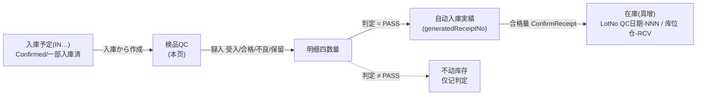
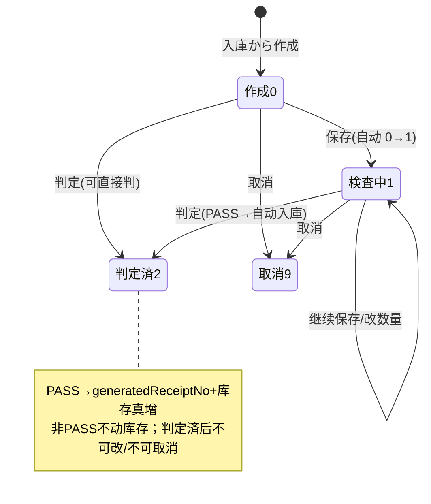

# 検品QC（入荷検品）单页面操作 SOP（手把手版）

> **用途**：给**入荷品检员操作、培训老师讲、测试人员拆用例**。比模块总册（`03-库存物流WMS` §5.15）更细。
> **页面**：検品QC / 入荷検品（MSBBWM · WM100）　**路由**：`/wms/inspection`（前端）　**API 基址**：`/wms/qc-inspection`　**前端**：`views/wms/QcInspectionView.vue`　**API**：`api/wms/qcInspection.ts qcInspectionApi`　**后端**：`Wms/QcInspectionController` → `QcInspectionService`（`CreateFromInbound` / `SaveItems` / `Judge` / `Cancel`）
> **基准**：分支 `feat/wfs-inbox-core`，2026-06-29；后端实测 `docs/codemap-wms/04-棚卸-補充-期限-QC.md` §6（权威），UI 经实读 view。
> **样例数据**：検品 `QC2026070001`、入庫指示（入庫予定）`IN2026070001`、製品 `PRD2026070001`、仕入先 `SUP01`、合格数 4800、不良数 200、入庫先倉庫 `W01`。

---

## 1. 页面一句话说明

**検品QC 就是"货到了先验再入库"的地方——品检员从一张入庫予定一键拉出待检明细，逐行录"受入/合格/不良/保留"四个数量，最后下一个判定；判定 = PASS 时系统会自动拿"合格数"去生成入庫実績、真把货计入库存（LotNo 自动取 `QC日期-序号`、库位 `仓库-RCV`），其余判定（CONDITIONAL/HOLD/FAIL/RETURN）一律不动库存。** 它是"这批入荷到底收多少、好品多少、坏品多少、放不放行"的唯一录入与放行口。

---

## 2. 这个页面在业务流程中的位置

- **上游**：一张状态为 **Confirmed（確定）/ PartialReceived（一部入庫済）** 的入庫予定（否则 `WM-MSG-043` 不让建检验单）。
- **本页**：从入庫予定建检验单 → 录四数量 → 下判定。
- **下游**：判定 PASS → 后端自动生成入庫実績 `generatedReceiptNo` → 合格量真增库存；非 PASS → 不动库存，只留判定记录。

---

## 3. 谁使用这个页面

| 角色 | 用途 |
|---|---|
| 入荷品检员 | 建检验单、录受入/合格/不良/保留数、下判定 |
| 仓管 | 配合品检放行，确认 PASS 后货物入哪个仓 |
| 质量主管 | 决定 CONDITIONAL/HOLD/FAIL/RETURN（不放行）口径 |

---

## 4. 操作前准备

- [ ] 目标**入庫予定已确认**（状态 Confirmed / PartialReceived）——下書き/草稿态建不了检验单（`WM-MSG-043`）。
- [ ] 知道这批货的**入庫予定 NO**（如 `IN2026070001`），「入庫から作成」要用它拉明细。
- [ ] 清楚每个品番**实际收了多少（受入）、好品多少（合格）、坏品多少（不良）、待定多少（保留）**，以及最终放不放行（判定）。
- [ ] PASS 放行时，想好货入**哪个仓**（入庫先倉庫，空=用原入庫予定仓 `W01`）。

---

## 5. 页面区域说明

> 本页是**单页内 list ↔ detail 双模式**：默认 list（检索+列表），点「開く」切 detail（头描述+明细+底部动作条），另有两个弹窗。

| 区域 | 模式 | 内容 |
|---|---|---|
| 检索卡 | list | 検品NO / 入庫NO / 状态 / 判定 四条件 + 「検索」按钮 + 「入庫から作成」按钮 |
| 结果表 | list | 検品NO / 状态 tag / 判定 tag / 入庫NO / 仕入先 / 到着日時 / **生成入庫NO（generatedReceiptNo）** / 操作（開く） |
| 头描述卡 | detail | 検品NO + 状态 tag + 判定 tag；3 列描述：入庫NO / 仕入先 / 到着日時 / 検査員 / 生成入庫NO / 判定理由 |
| 明细卡 | detail | 9 列：行 / 製品CD / 製品名 / 入庫予定数(expectedQty,只读) / **受入数 / 合格数 / 不良数 / 保留数**（仅 editable 可改）/ 不良理由CD(手填≤20) |
| 底部动作条 | detail | 固定吸底：戻る / 保存(仅 editable) / 判定(仅 canJudge) / 取消(仅 canCancel) |
| 入庫から作成 弹窗 | — | 500px；输入入庫NO → 「展開」→ createFromInbound 建单并自动跳 detail |
| 判定 弹窗 | — | 540px；判定下拉(必填·默认 PASS) / 判定理由(文本域) / **入庫先倉庫(仅 PASS 显)** + PASS 自动入庫提示 |

---

## 6. 字段填写说明（口语版）

**检索区（list）**：検品NO、入庫NO、状态（作成/検査中/判定済/取消）、判定（PASS/CONDITIONAL/HOLD/FAIL/RETURN）——任填即筛。

**明细卡四数量（detail，仅 editable=状态∈{作成0,検査中1} 时可改）**：

| 字段 | 怎么填 | 必填 | 填错影响 |
|---|---|---|---|
| 入庫予定数（expectedQty） | 系统从入庫予定带入，**只读** | — | — |
| 受入数（receivedQty） | 实际到货多少（如 5000） | 否（控件不强制） | 仅录入，**前端不与合格/不良/保留勾稽** |
| 合格数（acceptedQty） | 验合格多少（如 4800）——PASS 时这个数真入库存 | 否 | PASS 时此数=入库量；为 0 则 PASS 不生成入庫実績 |
| 不良数（rejectedQty） | 验出坏品多少（如 200） | 否 | 仅记录，不入库存 |
| 保留数（pendingQty） | 待定/复检多少 | 否 | 仅记录 |
| 不良理由CD（defectReasonCd） | **手输文本**（≤20，非下拉，如 `D01`） | 否 | 自由文本，无主数据校验 |

> ⚠️ **数量勾稽盲点**：受入 ≠ 合格+不良+保留 时**前端零校验**，合格甚至可以 > 受入（最终靠后端兜底/库存逻辑）。培训务必强调录数自检。

**判定弹窗（judge）**：

| 字段 | 怎么填 | 必填 | 说明 |
|---|---|---|---|
| 判定（finalJudgement） | 下拉选 PASS/CONDITIONAL/HOLD/FAIL/RETURN | 标 required·**默认 PASS** | UI 已预填，难送空；后端兜底 `WM-MSG-102` |
| 判定理由（reason） | 文本域，填判定说明 | 否（UI 不强制） | — |
| 入庫先倉庫（acceptWarehouseCd） | **仅判定=PASS 时显示**；填货入哪个仓（如 `W01`） | 否 | **空=用原入庫予定的倉庫** |

---

## 7. 按钮操作说明

| 按钮 | 出现位置/条件 | 点了会怎样 |
|---|---|---|
| 検索 | list 常显 | 按四条件查检验单 |
| 入庫から作成 | list 常显 | 开 500px 弹窗→输入庫NO→展開→`createFromInbound`（入庫予定须 Confirmed/PartialReceived，否则 `WM-MSG-043`）→建检验单(状态作成0)并自动跳 detail |
| 展開（弹窗内） | 入庫から作成 弹窗 | 触发建单；入庫NO 为空则不发请求 |
| 開く | list 行内 | 切 detail，加载该检验单头+明细 |
| 戻る | detail 底部常显 | 回 list |
| 保存 | detail 底部，**仅 editable（状态∈{0,1}）** | `saveItems` 逐行写受入/合格/不良/保留+不良理由；状态作成0 会自动推进到検査中1 |
| 判定 | detail 底部，**仅 canJudge（状态≠2且≠9）** | 开 540px 判定弹窗 |
| 確定（判定弹窗） | 弹窗内 | `judge`：写判定→状态→判定済2；**PASS 时自动生成入庫実績真增库存**，toast 带 `generatedReceiptNo` |
| 取消 | detail 底部，**仅 canCancel（状态≠2且≠9）** | 二次确认后 `cancel`→状态取消9 |

---

## 8. 标准业务操作 SOP（照着点）

### 场景一：从入庫予定建检验单（入庫から作成 · 唯一建单入口）
- **背景**：货到了，要对这张入庫予定开检。
- **样例数据**：入庫NO `IN2026070001`（状态 Confirmed）。
- **前置**：入庫予定状态 Confirmed / PartialReceived。
- **步骤**：1) list 点「入庫から作成」；2) 弹窗填入庫NO `IN2026070001`；3) 点「展開」。
- **完成后检查**：自动建 `QC…` 检验单（状态=作成0），并自动跳进 detail；明细按入庫予定逐行带入（expectedQty 只读）。
- **异常**：入庫予定非 Confirmed/PartialReceived（如下書き）→ `WM-MSG-043`；入庫NO 空 → 不发请求。
- **用例**：TC-M06-QC-001、002、015。

### 场景二：录入四数量并保存
- **背景**：逐行验货，录受入/合格/不良/保留。
- **样例数据**：製品 `PRD2026070001`、受入 5000 / 合格 4800 / 不良 200 / 保留 0、不良理由 `D01`。
- **前置**：检验单状态∈{作成0,検査中1}（editable）。
- **步骤**：1) detail 在明细行录受入 5000、合格 4800、不良 200、保留 0；2) 不良理由CD 手填 `D01`；3) 底部「保存」。
- **完成后检查**：四数量落库；状态若为作成0 自动→検査中1（之后仍 editable，可继续改）。
- **异常**：明细为空 → `WM-MSG-020`；状态已判定済2/取消9 → 无「保存」按钮（非 editable）。
- **用例**：TC-M06-QC-003、004、016、020。

### 场景三：判定 PASS → 自动入庫真增库存（核心主流程）
- **背景**：验完合格放行，货进库存。
- **样例数据**：合格 4800、入庫先倉庫 `W01`。
- **前置**：检验单 canJudge（状态≠2且≠9），合格数>0。
- **步骤**：1) detail 点「判定」；2) 弹窗判定选 `PASS`；3) 入庫先倉庫填 `W01`（留空=用原入庫予定仓）；4) 判定理由可填；5)「確定」。
- **完成后检查**：状态→判定済2；后端取**合格数>0**的明细组入庫実績并 `ConfirmReceipt` 真实入库 → 头卡回填 `generatedReceiptNo`、toast 带该单号；在库照会可见新库存（数量=合格 4800，**LotNo 自动 `QC{yyyyMMdd}-NNN`**，库位 `W01-RCV`）。
- **异常**：库存逻辑异常时 controller 捕 `InsufficientStockException` 转友好错误。
- **用例**：TC-M06-QC-005、006、007、008、021、022。

### 场景四：判定非 PASS（不放行 · 不动库存）
- **背景**：货有问题，CONDITIONAL/HOLD/FAIL/RETURN 之一。
- **步骤**：1)「判定」；2) 选 `FAIL`（或 HOLD/CONDITIONAL/RETURN）——**此时不显入庫先倉庫字段**；3)「確定」。
- **完成后检查**：状态→判定済2；**不生成入庫実績、库存零变动**；`generatedReceiptNo` 为空。
- **用例**：TC-M06-QC-009、010、011、023。

### 场景五：判定理由/判定值校验（WM-MSG-102）
- **背景**：判定值缺失的后端兜底。
- **步骤**：UI 判定下拉默认 PASS 且标 required，正常**难以送空**；经直调 API / 异常路径送空判定 → `WM-MSG-102`。
- **完成后检查**：不落判定、状态不变；提示判定（理由）必填。
- **诚实标注**：此码主要是**后端兜底**，前端常规操作触发不到。
- **用例**：TC-M06-QC-012、024。

### 场景六：取消检验单
- **背景**：建错或作废这张检验单。
- **步骤**：1) detail（状态≠2且≠9）点「取消」；2) 二次确认。
- **完成后检查**：状态→取消9；之后保存/判定/取消按钮全消失。
- **异常**：已判定済2 → 无「取消」按钮（canCancel=false）。
- **用例**：TC-M06-QC-013、014、025。

### 场景七：数量勾稽盲点核对（培训/测试专用）
- **背景**：验证前端不拦不合理录数。
- **步骤**：明细录受入 4000、合格 4800（合格>受入）→ 保存。
- **完成后检查**：前端**不报错**直接落库（靠后端/库存兜底）；提醒操作员录数须自检。
- **用例**：TC-M06-QC-017、018。

---

## 9. 状态变化说明

- editable（可改/可保存）= 状态∈{作成0, 検査中1}
- canJudge（可判定）= 状态≠判定済2 且 ≠取消9
- canCancel（可取消）= 状态≠判定済2 且 ≠取消9

---

## 10. 按钮不可用 / 灰色原因

| 现象 | 原因 |
|---|---|
| detail 无「保存」 | 非 editable（状态已判定済2 或 取消9） |
| 明细四数量框灰、不可编辑 | 同上，`:disabled="!editable"` |
| detail 无「判定」 | 非 canJudge（状态=判定済2 或 取消9） |
| detail 无「取消」 | 非 canCancel（状态=判定済2 或 取消9） |
| 判定弹窗无「入庫先倉庫」字段 | 当前判定值非 PASS（仅 `finalJudgement==='PASS'` 显示） |
| 「入庫から作成」展開报错 | 入庫予定非 Confirmed/PartialReceived（`WM-MSG-043`） |
| 找不到"脱离入庫单直接建检验单"入口 | api 有 `createDirect` 但 **UI 未实现该入口**，只能「入庫から作成」 |
| 找不到货位选择 | PASS 自动入庫**无货位字段**（`acceptLocations` 类型有 UI 无，落位 `{wh}-RCV` 由后端定） |
| 找不到上传照片 | `photoUrls` 类型有但 **UI 未实现**（`待实现`） |

---

## 11. 常见错误与处理

| 错误 | 原因 | 处理 |
|---|---|---|
| `WM-MSG-043`（状态守卫） | 入庫予定非 Confirmed/PartialReceived 建单；或对判定済2/取消9 单 保存/判定 | 先确认入庫予定；已判定/取消单不可再操作 |
| `WM-MSG-020`（无明细） | 检验单无任何明细行 | 检查入庫予定是否有明细，重新「入庫から作成」 |
| `WM-MSG-070`（单据不存在） | 检品NO/入庫NO 不存在 | 核对单号 |
| `WM-MSG-102`（判定必填） | 判定值（finalJudgement）为空 | UI 默认 PASS 难触发；如经 API 须带判定值（后端兜底） |
| PASS 后没看到入庫单号 | 所有明细合格数=0，PASS 不生成入庫実績 | 录入合格数>0 再判定 |
| 录的合格>受入也不报错 | **前端零勾稽校验**（现状） | 操作员录数自检；以后端为准 |
| 弹窗占位符出现 `IN20260523-00001` 等 | **裸 i18n key 含硬编码示例号**（`'例: {sample}'` / `'（空=元入庫予定の倉庫）'`） | 现状，无功能影响（培训告知即可） |

---

## 12. 操作完成后的检查清单

- [ ] 建单：「入庫から作成」后生成 `QC…` 检验单（状态作成0），明细按入庫予定带入。
- [ ] 录数：保存成功；作成0 自动→検査中1；四数量与不良理由落库。
- [ ] 判定 PASS：状态→判定済2；头卡 `generatedReceiptNo` 回填、toast 带单号；**在库真增**（数量=合格数、LotNo `QC日期-NNN`、库位 `仓-RCV`）。
- [ ] 判定非 PASS：状态→判定済2；**库存零变动**、`generatedReceiptNo` 空。
- [ ] 判定済后：保存/判定/取消按钮全消失（终态）。
- [ ] 复核：不良数/保留数**不入库存**；仅合格数计入。

---

## 13. 页面级测试用例（≥25 条，可执行）

> 编号 `TC-M06-QC-xxx`；数据用样例（QC2026070001 / IN2026070001 / PRD2026070001 / SUP01 / 合格4800 / 不良200 / W01）。

| 用例编号 | 用例名称 | 优先级 | 前置条件 | 测试数据 | 操作步骤 | 预期结果 | 下游检查 | 备注 |
|---|---|---|---|---|---|---|---|---|
| TC-M06-QC-001 | 入庫から作成建检验单 | P0 | 入庫予定 Confirmed | IN2026070001 | 入庫から作成→填NO→展開 | 建 QC…单(作成0)+自动跳 detail | 明细按入庫予定带入 | 唯一建单入口 |
| TC-M06-QC-002 | 入庫予定非确认禁建 | P0 | 入庫予定下書き | 草稿入庫NO | 展開 | WM-MSG-043 | 不建单 | 状态守卫 |
| TC-M06-QC-003 | 录四数量并保存 | P0 | 状态作成0/検査中1 | 受入5000/合格4800/不良200/保留0 | 录数→保存 | 落库成功 | 作成0→検査中1 | 核心 |
| TC-M06-QC-004 | 不良理由CD手填 | P1 | editable | D01 | 录不良理由→保存 | 文本落库(≤20) | 无主数据校验 | 自由文本 |
| TC-M06-QC-005 | 判定 PASS 自动入庫 | P0 | canJudge·合格4800 | PASS·入庫先W01 | 判定→PASS→W01→確定 | 状态→判定済2+generatedReceiptNo回填 | **在库真增4800** | 核心主流程 |
| TC-M06-QC-006 | PASS 入库 LotNo/库位规则 | P0 | 已 PASS | — | 查在库照会 | LotNo `QC日期-NNN`、库位 `W01-RCV` | 在库照会 | 自动采番 |
| TC-M06-QC-007 | PASS 入庫先空=原仓 | P1 | canJudge | PASS·入庫先空 | 判定→PASS→留空→確定 | 入原入庫予定仓 | 在库照会 | 缺省口径 |
| TC-M06-QC-008 | PASS toast 带入庫单号 | P1 | canJudge | PASS·合格4800 | 確定 | toast 含 generatedReceiptNo | — | — |
| TC-M06-QC-009 | 判定 FAIL 不动库存 | P0 | canJudge | FAIL | 判定→FAIL→確定 | 状态→判定済2、不生成入庫 | **库存零变动** | 非 PASS |
| TC-M06-QC-010 | 判定 HOLD 不动库存 | P1 | canJudge | HOLD | 判定→HOLD→確定 | 同上不动库存 | — | — |
| TC-M06-QC-011 | 非 PASS 不显入庫先倉庫 | P1 | 判定弹窗 | CONDITIONAL/RETURN | 选非 PASS 值 | 入庫先倉庫字段隐藏 | — | UI 条件显示 |
| TC-M06-QC-012 | 判定值空兜底 | P2 | 直调 API | 空 finalJudgement | 送判定 | WM-MSG-102 | 不落判定 | UI 难触发·后端兜底 |
| TC-M06-QC-013 | 取消检验单 | P1 | 状态≠2且≠9 | QC2026070001 | 取消→确认 | 状态→取消9 | 按钮全消失 | — |
| TC-M06-QC-014 | 判定済不可取消 | P1 | 状态判定済2 | — | 看底部条 | 无「取消」按钮 | canCancel=false | — |
| TC-M06-QC-015 | 入庫NO空不发请求 | P2 | 弹窗 | 空 | 展開 | 不发 createFromInbound | — | 守卫 |
| TC-M06-QC-016 | 明细为空判定 | P2 | 无明细 | — | 判定/保存 | WM-MSG-020 | 不落库 | — |
| TC-M06-QC-017 | 合格>受入不报错 | P1 | editable | 受入4000/合格4800 | 录数→保存 | 前端不拦直接落库 | 靠后端兜底 | 勾稽盲点 |
| TC-M06-QC-018 | 受入≠合格+不良+保留 | P1 | editable | 受入5000/合格4000/不良200/保留0 | 保存 | 前端不校验勾稽 | — | 现状 |
| TC-M06-QC-019 | 列表四条件检索 | P1 | 有数据 | 検品NO/入庫NO/状态/判定 | 検索 | 命中过滤 | — | list |
| TC-M06-QC-020 | 判定済明细只读 | P2 | 状态判定済2 | — | 看明细 | 四数量框灰、无保存 | editable=false | — |
| TC-M06-QC-021 | 合格数=0 时 PASS | P2 | canJudge·合格0 | PASS | 判定→PASS→確定 | 状态→判定済2 但不生成入庫实绩 | 库存不增 | 取 AcceptedQty>0 |
| TC-M06-QC-022 | PASS 库存异常兜底 | P2 | 库存逻辑异常 | — | 判定 PASS | 友好错误(InsufficientStockException) | 不入库 | controller catch |
| TC-M06-QC-023 | 非 PASS generatedReceiptNo 空 | P1 | 已判 FAIL | — | 看头卡 | generatedReceiptNo 为空 | — | — |
| TC-M06-QC-024 | 判定理由可空 | P2 | canJudge | PASS·理由空 | 確定 | 允许（UI 不强制 reason） | — | 与判定值区分 |
| TC-M06-QC-025 | 取消后终态 | P2 | 已取消9 | — | 看 detail | 保存/判定/取消全消失 | — | — |
| TC-M06-QC-026 | createDirect 无 UI 入口 | P2 | — | — | 找直建入口 | 仅「入庫から作成」 | api 有 UI 无 | 现状 |
| TC-M06-QC-027 | 货位字段缺失 | P3 | PASS | — | 找货位选择 | 无货位字段、落 `仓-RCV` | acceptLocations 类型有UI无 | 现状 |
| TC-M06-QC-028 | 照片上传未实现 | P3 | — | — | 找照片入口 | 无 photoUrls UI | 待实现 | 现状 |
| TC-M06-QC-029 | 裸 i18n 占位符 | P3 | 弹窗 | — | 看占位符 | 含 `IN20260523-00001` 硬编码 | 无功能影响 | i18n 现状 |
| TC-M06-QC-030 | 权限不足 | P2 | 无权账号 | — | 进页面/判定 | 待业务确认(隐藏/拒绝) | — | 权限 |

---

## 14. 培训讲解建议

| 顺序 | 讲什么 | 演示 | 易误解点 |
|---|---|---|---|
| 1 | 这页是"货到先验再入库" | §2 流程图 | 以为这里直接收货（其实上游是入庫予定） |
| 2 | 只能从入庫予定建检验单 | 入庫から作成 | 想脱离入庫单直建（createDirect 无 UI 入口） |
| 3 | 四数量含义+录数自检 | 受入/合格/不良/保留 | 以为前端会校验勾稽（不会，合格可>受入） |
| 4 | 判定 PASS = 自动入库 | PASS→W01→確定→看在库 | 以为不良/保留也入库（只合格入） |
| 5 | 非 PASS 不动库存 | 判定 FAIL | 以为判了就算收货 |
| 6 | 入庫先倉庫只 PASS 显、空=原仓 | 切判定值看字段显隐 | 找不到货位字段（无货位，落 `仓-RCV`） |
| 7 | 判定済/取消是终态 | 看按钮消失 | 想改已判定单 |

---

## 15. 与模块级手册的关系

对应 `03-库存物流WMS-最详细用户操作培训手册.md` §5.15（検品QC · 5.15.1~5.15.14）。逐行后端来源见 `docs/codemap-wms/04-棚卸-補充-期限-QC.md` §6（QC検品 — 录入+判定·PASS 自动入库）。

---

## 16. 代码与文档来源

| 层 | 文件 |
|---|---|
| 逐行源码手册 | `docs/codemap-wms/04-棚卸-補充-期限-QC.md` §6（权威；JudgeAsync `:180-240` PASS→ConfirmReceipt） |
| 模块总册 | `docs/manuals/user-training/03-库存物流WMS-最详细用户操作培训手册.md` §5.15 |
| 前端 view | `cp6.web/src/views/wms/QcInspectionView.vue` |
| API | `cp6.web/src/api/wms/qcInspection.ts`（search/get/createFromInbound/createDirect/saveItems/judge/cancel） |
| 类型 | `cp6.web/src/types/wms/wms.ts`（QcInspection/QcInspectionItem/QcJudgeRequest/QcJudgeResult） |
| 路由 | `cp6.web/src/router/index.ts:141`（`/wms/inspection`） |
| 后端 | `Wms/QcInspectionController.cs`、`Services/Wms/QcInspectionService.cs`（CreateFromInbound/SaveItems/Judge/Cancel） |
| 入庫接缝 | `InboundService.ConfirmReceiptAsync`（PASS 时被 Judge 调用，经 `IStockMovementService` 走 IN 真增库存） |
| 实体 | `DomainModels/Wms/QcInspection.cs`、`QcInspectionItem.cs` |

---

## 最后更新来源

- 代码：见 §16（codemap-wms 04 §6 + QcInspectionView.vue 实读 + qcInspection.ts/wms.ts 类型 + router 实证）。
- 基准：分支 `feat/wfs-inbox-core`，2026-06-29。
- 覆盖：16 节 / 7 场景 / 30 用例（TC-M06-QC-001~030）。
- 诚实标注：createDirect 无 UI 入口、PASS 无货位字段（落 `仓-RCV`）、photoUrls 待实现、数量勾稽前端零校验、裸 i18n key 含硬编码示例号、WM-MSG-102 为后端兜底 UI 难触发——均为现状如实记录。
