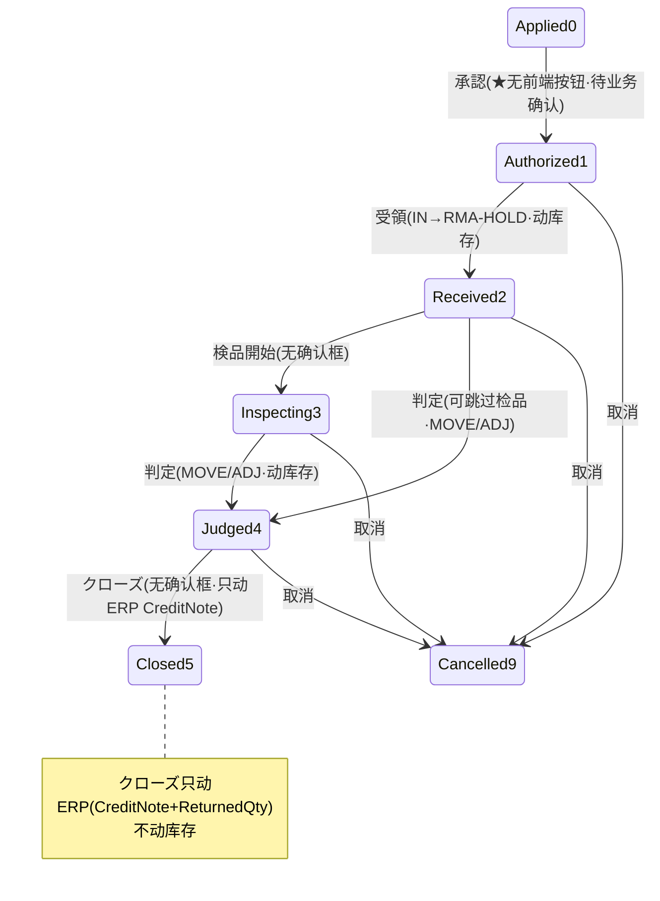

# 返品RMA 单页面操作 SOP（手把手版）

> **用途**：给**客服建退货单、仓管收退货货物、检品判定处分、培训老师讲、测试人员拆用例**。比模块总册（`03-库存物流WMS` §5.16）更细。
> **页面**：返品RMA（WM150 · 库存物流 WMS）　**路由**：`/wms/rma`　**前端**：`views/wms/RmaView.vue`　**API**：`api/wms/rma.ts rmaApi`　**后端**：`Wms/RmaController` → `RmaService`（受領/检品/判定/クローズ）；クローズ接缝 `ErpBridgeHook.OnReturnConfirmedAsync`
> **基准**：分支 `feat/wfs-inbox-core`，2026-06-29；后端实测 `docs/codemap-wms/06-業界連携-报表.md` §3（2026-06-22 权威），UI 经 agent 实读 view。
> **样例数据**：RMA `RMA2026070001`、顾客 `CUST-A`、製品 `PRD2026070001`、LotNo `LOT2026070001`、倉庫 `W01`、RMA保留位 `W01-RMA-HOLD`、元出荷No `OUT2026070001`、来源 Web受注 `WO20260701000001`、退货数 100。

---

## 1. 页面一句话说明

**返品RMA，就是客户退货从受理到结案的全流程单——建単→受領（货 IN 到 `{倉庫}-RMA-HOLD` 保留位）→検品開始→判定处分（再販/修理走 MOVE 移到良品位，廃棄/仕入先返品走 ADJ 减库）→クローズ（结案时才触发 ERP 开一张赤伝 CreditNote 退款 + 回填受注的 `ReturnedQty`，但不动库存）。** 记住一句口诀：**「判定処分才动库存，クローズ只动 ERP」。**

---

## 2. 这个页面在业务流程中的位置

- **上游**：客户提出退货 + 原始出货单（`元出荷No` 是クローズ追溯 WebOrderNo 的钥匙）。
- **本页**：建单→受領→检品→判定→クローズ五步推进。
- **下游**：受領/判定**动库存**（保留位/良品位/减库）；クローズ**只动 ERP**（CreditNote 退款 + ReturnedQty），不动库存。

---

## 3. 谁使用这个页面

| 角色 | 用途 |
|---|---|
| 客服 | 受理退货、建単（填顾客/仓/元出荷/明细）、取消 |
| 仓管 | 受領（收退货货物入 RMA-HOLD）、按判定执行移库 |
| 检品担当 | 検品開始、逐行判定处分（RESELL/REPAIR/SCRAP/SUPPLIER_RETURN） |
| 财务（下游核对） | クローズ后到 ERP 核对 CreditNote 赤伝与 ReturnedQty |

---

## 4. 操作前准备

- [ ] 顾客CD（如 `CUST-A`）、退货收货倉庫（如 `W01`）准备好——**建单必填**。
- [ ] 原始出货单号（如 `OUT2026070001`）——**クローズ追溯 WebOrderNo（如 `WO20260701000001`）的键**，缺了回写可能 Skipped。
- [ ] 退货明细：製品CD（`PRD2026070001`）、LotNo（`LOT2026070001`）、退货数（100）、货物状态 NEW/OPEN/DAMAGED。
- [ ] 收货前确认 `{倉庫}-RMA-HOLD` 保留位已存在（受領会把货 IN 到这里）。
- [ ] 若要走赤伝退款：确认 `ErpBridge:Enabled=true`（=false 时クローズ仅返 SKIPPED，不生成 CreditNote）。

---

## 5. 页面区域说明

| 区域 | 内容 |
|---|---|
| 列表模式（list）检索卡 | RMA-No / 顧客CD / 元出荷No / 状态下拉；「検索」+「新規」按钮 |
| 列表模式表格 | RMA-No / 状态 tag / 顧客CD·名 / 元出荷No / 申請日 / 倉庫 / 返品理由 / 行内「開く」 |
| 明细模式（detail）头卡 | 顧客CD·名 / 申請日 / 倉庫 / 元出荷No / 返品理由——**`!isNew` 时全部只读**（建单后锁定） |
| 明细模式明细卡 | 每行：行 / 製品CD·名 / Lot / 数量 / 状态(condition) / 判定(judgement) / 移動先(destLoc) / TXN(IN·DISP tag)；`isNew` 时可「明細追加 / 削除」 |
| 底部固定操作条（el-affix） | 戻る / 保存 / 受領 / 検品開始 / 判定 / クローズ / 取消（按状态显隐） |

---

## 6. 字段填写说明（口语版）

**头部字段**（全部 `:disabled="!isNew"`，建单后锁定，防改已受理退货）：

| 字段 | 谁提供 | 怎么填 | 填错影响 |
|---|---|---|---|
| 顧客CD（customerCd） | 客服 | 必填，退货客户如 `CUST-A`；建单后锁 | 空→`onSave` 拦截（`wms.common.required`） |
| 顧客名（customerName） | 客服 | 可空 | — |
| 申請日（appliedDate） | 客服 | 默认今天 | — |
| 倉庫（warehouseCd） | 库管 | 必填，收退货仓如 `W01`；建单后锁 | 空→`onSave` 拦截 |
| 元出荷No（originalShippingNo） | 客服 | 原始出货单如 `OUT2026070001`（クローズ追溯 WebOrderNo 的键） | 缺→クローズ回写可能 Skipped |
| 返品理由（returnReason） | 客服 | 文本域，会带进 CreditNote 的 Reason | — |

**明细行字段**：

| 字段 | 哪些档可填 | 怎么填 | 填错影响 |
|---|---|---|---|
| 製品CD / 製品名 / Lot / 数量 | 仅建单（`isNew`） | 製品 `PRD2026070001`、Lot `LOT2026070001`、数量 100 | 明细空→`onSave` 拦截（`wms.inbound.msg.noDetail`） |
| 状态 conditionLevel | 仅建单（`:disabled="!isNew"`） | `NEW`新品 / `OPEN`開封 / `DAMAGED`破損 | — |
| 判定 judgement | 仅 `canJudge`（status 2/3，`:disabled="!canJudge"`） | `RESELL`再販 / `REPAIR`修理 / `SCRAP`廃棄 / `SUPPLIER_RETURN`仕入先返品 | 判定时全行须有判定，否则 `judgementRequired` 警告拦截 |
| 移動先 destLocationCd | 仅 `canJudge` | 判定后入库目标良品位（RESELL/REPAIR 用） | — |
| TXN 列（只读 tag） | — | 受領后显 IN（tooltip=inboundTxnNo）；判定后显 DISP（tooltip=dispositionTxnNo） | — |

---

## 7. 按钮操作说明

| 按钮 | 真实显示条件（computed） | 点了会怎样 | 是否动库存 |
|---|---|---|---|
| 保存（保存） | `isNew`（`current` 有值且无 `rmaNo`） | create 建单，落 status=0 | 否 |
| 受領（btn.receive） | `canReceive = status===1` | 退货货物 IN 入 `{倉庫}-RMA-HOLD`，status 1→2；**带确认框** | **是（IN）** |
| 検品開始（btn.startInspection） | `canStartInsp = status===2` | status 2→3；**无确认框**⚠️ | 否 |
| 判定（btn.judge） | `canJudge = status===2 ‖ status===3` | 逐行判定处分→MOVE/ADJ，status→4；**带确认框（借出庫文案 key）** | **是（MOVE/ADJ）** |
| クローズ（btn.close） | `canClose = status===4` | status 4→5；触发 ERP CreditNote+ReturnedQty；**无确认框**⚠️ | 否（只动 ERP） |
| 取消（outbound.btn.cancel） | `canCancel = status≠5 && status≠9 && !isNew` | status→9 Cancelled；**带确认框** | 否 |
| 戻る | 常显 | 回列表模式 | 否 |

> ⚠️ **承認盲点（务必知道）**：建单 `openCreate` 落 status=**0**（Applied），但「受領」要求 status===**1**（Authorized），**中间的 0→1（承認）在本页没有任何前端按钮**。疑后端 create 时自动置 1，或确实缺「承認」入口——`待业务确认`（**需后端确认 RmaService.CreateAsync 是否落 1**）。
> ⚠️ **确认框不一致**：受領/判定/取消 都弹 `ElMessageBox.confirm`，但**検品開始、クローズ 直接执行无确认框**——误点クローズ会直接结案并触发赤伝，培训时务必强调。
> ⚠️ **判定确认框文案非 RMA 专属**：`onJudge` 复用了出庫的 `wms.outbound.msg.allocateAsk` 文案 key，弹窗文字可能写「引当」之类，属已知文案借用。

---

## 8. 标准业务操作 SOP（照着点）

### 场景一：标准退货全链（主流程）
- **背景**：客户退回一批货，从建单一路走到结案开赤伝。
- **样例数据**：RMA `RMA2026070001`、顾客 `CUST-A`、倉庫 `W01`、元出荷No `OUT2026070001`、製品 `PRD2026070001`、Lot `LOT2026070001`、退货数 100。
- **前置**：原出货单 `OUT2026070001` 已存在（对应 Web受注 `WO20260701000001`）；`{W01}-RMA-HOLD` 保留位存在；`ErpBridge:Enabled=true`。
- **步骤**：1) 列表点「新規」；2) 头卡填 `CUST-A` / `W01` / `OUT2026070001` / 返品理由；3)「明細追加」填 `PRD2026070001` / `LOT2026070001` / 数量 100 / 状态 OPEN；4)「保存」→生成 `RMA2026070001`（status 0）；5)（承認 0→1 见盲点，确认到 status 1 后）「受領」→確認→货 IN 到 `W01-RMA-HOLD`（status→2，行显 IN tag）；6)「検品開始」（status→3）；7) 逐行选判定（如 RESELL）+移動先良品位→「判定」→確認→MOVE/ADJ（status→4，行显 DISP tag）；8)「クローズ」→status→5 + ERP CreditNote。
- **完成后检查**：受領后在庫照会能看到 `W01-RMA-HOLD` 多 100；判定后货搬到良品位/减库；クローズ后去 ERP 看一张 `CreditNote(Refund)`（单号 `CN{yyyyMMdd}-{GUID前4}`）+ `WO20260701000001` 明细 `ReturnedQty += 100`，落一条 `IntegrationEvent`。
- **异常**：顾客/仓空→`onSave` 拦截；明细空→`wms.inbound.msg.noDetail`；未判定就クローズ→`WM-MSG-043`。
- **用例**：TC-M06-RMA-001~008。

### 场景二：再販判定（RESELL→MOVE 回良品位）
- **背景**：退回的货检品后完好，可再次销售。
- **样例数据**：同上，明细判定 `RESELL`，移動先 `W01-A-01`（良品位）。
- **前置**：RMA 已受領（status 2）或已検品（status 3），货在 `W01-RMA-HOLD`。
- **步骤**：1) 明细行「判定」列选 `RESELL`；2) 移動先填 `W01-A-01`；3) 底部「判定」→確認。
- **完成后检查**：触发 **MOVE**（RMA-HOLD OUT + 良品位 IN）；行 dispositionTxnNo 显 DISP tag；该 Lot 可被后续出库引当。
- **异常**：有行未填判定→`judgementRequired` 警告，整批不提交。
- **可拆用例**：TC-M06-RMA-009、010、011。

### 场景三：廃棄判定（SCRAP→ADJ 减库）
- **背景**：退货已破损无法再用，直接报废。
- **样例数据**：明细状态 `DAMAGED`，判定 `SCRAP`，退货数 100。
- **前置**：RMA 已受領/検品（status 2/3）。
- **步骤**：1) 明细判定列选 `SCRAP`（移動先可空）；2)「判定」→確認。
- **完成后检查**：触发 **ADJ −Qty**（`W01-RMA-HOLD` 减 100）；行显 DISP tag；货不入可用库存。
- **异常**：同场景二未判定拦截。
- **可拆用例**：TC-M06-RMA-012、013（SUPPLIER_RETURN 同走 ADJ −Qty）。

### 场景四：クローズ生成赤伝（接缝出·只动 ERP）
- **背景**：判定完成后结案，给客户开退款赤伝。
- **样例数据**：`RMA2026070001`（status 4 Judged），元出荷 `OUT2026070001`→`WO20260701000001`。
- **前置**：status===4；`ErpBridge:Enabled=true`。
- **步骤**：1) 确认状态 tag 为「判定済」；2) 点「クローズ」（**直接执行，无确认框，谨慎**）。
- **完成后检查**：status 4→5；**库存不动**；ERP 每退货明细一张 `CreditNote(Refund)`（单号 `CN{yyyyMMdd}-{GUID前4}`，Type=Refund，Reason=返品理由）+ `OrderDetail.ReturnedQty += 退货量`；落 `IntegrationEvent(Success)`。
- **异常**：非 Judged 点クローズ→`WM-MSG-043`；桥接异常**不回滚**（已落 Closed，只 LogWarning，`IntegrationEvent` 记 Failed）；前端**无 CreditNote 单号回显/跳转**，须人工去 ERP 核对。
- **可拆用例**：TC-M06-RMA-014~018。

### 场景五：ErpBridge 关闭 / 追溯失败 → クローズ照样结案（Skipped）
- **背景**：演示环境或未配出库单，クローズ仍需推进状态。
- **样例数据**：`ErpBridge:Enabled=false`，或元出荷No 解析不到 WebOrderNo。
- **前置**：status===4。
- **步骤**：1)「クローズ」。
- **完成后检查**：status 仍 4→5（**结案不被桥接阻断**）；`ErpBridge:Enabled=false`→`NoOpErpBridgeHook` 返 SKIPPED；RMA 查不到→`WM-MSG-RMA-404`（转 Skipped）；明细空→`WM-MSG-020`（转 Skipped）；ERP 无 CreditNote，`IntegrationEvent` 记 Skipped。
- **异常**：误以为「クローズ没报错=赤伝已开」——实为 Skipped，需查 IntegrationEvent 确认。
- **可拆用例**：TC-M06-RMA-019、020、021。

### 场景六：取消退货单
- **背景**：客户撤回退货申请，或建错单。
- **样例数据**：`RMA2026070001`，任意非 Closed/Cancelled 态。
- **前置**：status ≠ 5 且 ≠ 9 且非建单中（`canCancel`）。
- **步骤**：1) 点「取消」→確認。
- **完成后检查**：status→9 Cancelled（tag 红 danger）；已 Closed(5)/Cancelled(9) 不显示取消按钮。
- **异常**：已结案想取消→无按钮（按 5.16.10 不可逆）。
- **可拆用例**：TC-M06-RMA-022、023。

### 场景七（盲点验证）：0→1 承認无前端入口
- **背景**：验证建单后能否直接受領。
- **样例数据**：刚保存的 `RMA2026070001`（status 0）。
- **前置**：保存成功后页面 `openDetail` 回显。
- **步骤**：1) 观察底部操作条；2) 找「承認」或「受領」按钮。
- **完成后检查**：若回显 status===1→「受領」出现（疑后端 create 自动置 1）；若 status===0→**无任何推进按钮**（缺承認入口，`待业务确认`，需后端确认 `RmaService.CreateAsync`）。
- **异常**：卡在 status 0 无法操作。
- **可拆用例**：TC-M06-RMA-024、025。

---

## 9. 状态变化说明

- 状态 tag 颜色：0/1=info/primary，2/3=warning，4/5=success，9=danger。
- `canJudge = status 2 ‖ 3`：**判定可从「受領(2)」直接做，跳过检品**；也可先「検品開始(3)」再判。
- 5 Closed、9 Cancelled 为终态（不再显示推进/取消按钮）。

---

## 10. 按钮不可用 / 灰色原因

| 现象 | 原因（真实表达式） |
|---|---|
| 头字段 + 状态(condition) 列只读 | `!isNew`——建单后锁定，防改已受理退货 |
| 判定 / 移動先 不可填 | `!canJudge`——仅 status 2/3（受領/检品档）可填判定 |
| 无「受領」 | `status ≠ 1`（仅 Authorized 可受領） |
| 无「検品開始」 | `status ≠ 2` |
| 无「判定」 | 非 `status 2 ‖ 3` |
| 无「クローズ」 | `status ≠ 4`（仅 Judged 可クローズ） |
| 无「取消」 | `status === 5 ‖ 9`，或建单中（`isNew`） |
| 建单后无任何推进按钮（卡 status 0） | **0→1 承認无前端入口**（盲点，`待业务确认`） |

---

## 11. 常见错误与处理

| 错误 | 原因 | 处理 |
|---|---|---|
| `onSave` 拦截（`wms.common.required`） | 顾客CD 或 倉庫 空 | 补填头部必填 |
| `wms.inbound.msg.noDetail` | 明细 0 行 | 「明細追加」至少一行 |
| `judgementRequired` 警告 | 判定时有行未选判定 | **全行**都选判定后再「判定」 |
| `WM-MSG-043` | 非 Judged 就クローズ（`CloseAsync` 守卫） | 先「判定」到 status 4 |
| クローズ无报错但 ERP 无赤伝 | `ErpBridge:Enabled=false` 或元出荷解析失败→Skipped | 查 `IntegrationEvent` 状态；开桥接或补元出荷No |
| `WM-MSG-RMA-404`（Skipped） | 接缝按 rmaNo 查不到 RMA | 核对单号；不阻断结案 |
| `WM-MSG-020`（Skipped） | 接缝时明细为空 | 核对明细；不阻断结案 |
| クローズ后想撤销 | クローズ best-effort 已落 Closed，不回滚 | 走 ERP CreditNote 冲销，不在本页 |
| 建单后无法受領（卡 status 0） | 0→1 承認无前端入口 | `待业务确认`，需后端确认 create 是否自动置 1 |

---

## 12. 操作完成后的检查清单

- [ ] 建单：生成 `RMA…` 单号，status=0（注意承認盲点）。
- [ ] 受領：status 1→2；货 **IN 到 `{倉庫}-RMA-HOLD`**；行 inboundTxnNo 显 IN tag；在庫照会可见保留库存。
- [ ] 判定：status→4；RESELL/REPAIR→**MOVE** 到良品位、SCRAP/SUPPLIER_RETURN→**ADJ −Qty** 减库；行 dispositionTxnNo 显 DISP tag。
- [ ] クローズ：status 4→5；**库存不动**；ERP 每退货明细一张 `CreditNote(Refund)`（`CN{yyyyMMdd}-{GUID前4}`）+ `OrderDetail.ReturnedQty += 退货量`；落 `IntegrationEvent`。
- [ ] best-effort：桥接异常不回滚（已 Closed），只 LogWarning；`ErpBridge` off / 追溯失败→Skipped，前端**无 CreditNote 单号回显**，须人工去 ERP 核对。

---

## 13. 页面级测试用例（≥25 条，可执行）

> 编号 `TC-M06-RMA-xxx`；数据用样例（RMA `RMA2026070001` / `CUST-A` / `PRD2026070001` / `LOT2026070001` / `W01` / `W01-RMA-HOLD` / `OUT2026070001` / `WO20260701000001` / 退货数 100）。

| 用例编号 | 用例名称 | 优先级 | 前置条件 | 测试数据 | 操作步骤 | 预期结果 | 下游检查 | 备注 |
|---|---|---|---|---|---|---|---|---|
| TC-M06-RMA-001 | 列表检索 | P1 | 有 RMA 单 | rmaNo/顾客/元出荷/状态 | 填条件→検索 | 命中列表 | — | — |
| TC-M06-RMA-002 | 打开新規建单页 | P1 | — | — | 新規 | 进 detail，头字段可编辑，status 0 | — | isNew=true |
| TC-M06-RMA-003 | 建单保存成功 | P0 | — | CUST-A/W01/OUT2026070001/明细100 | 填头+明細追加→保存 | 生成 RMA2026070001，toast 含单号 | — | 核心 |
| TC-M06-RMA-004 | 顾客空拦截 | P0 | 建单中 | 顾客空/W01 | 保存 | `wms.common.required` 警告 | 不落库 | onSave |
| TC-M06-RMA-005 | 倉庫空拦截 | P0 | 建单中 | CUST-A/仓空 | 保存 | `wms.common.required` 警告 | 不落库 | — |
| TC-M06-RMA-006 | 明细空拦截 | P0 | 建单中 | 0 行明细 | 保存 | `wms.inbound.msg.noDetail` 警告 | 不落库 | — |
| TC-M06-RMA-007 | 头字段建单后锁定 | P1 | 已保存 | RMA2026070001 | 重开 detail | 头+状态列只读（`!isNew`） | — | 防改已受理 |
| TC-M06-RMA-008 | 明细可增删（仅建单） | P2 | 建单中 | — | 明細追加/削除 | 行增删，lineNo 重排 | — | isNew 限定 |
| TC-M06-RMA-009 | 受領入 RMA-HOLD | P0 | status 1 | RMA2026070001 | 受領→確認 | status 1→2，货 IN W01-RMA-HOLD | 在庫照会保留位+100，行 IN tag | 动库存 |
| TC-M06-RMA-010 | 受領带确认框 | P2 | status 1 | — | 点受領 | 弹 ElMessageBox 确认 | — | 与检品/クローズ对比 |
| TC-M06-RMA-011 | 検品開始 | P1 | status 2 | RMA2026070001 | 検品開始 | status 2→3，**无确认框** | — | UI 盲点 |
| TC-M06-RMA-012 | 判定 RESELL→MOVE | P0 | status 2/3 | 判定RESELL+移動先W01-A-01 | 判定→確認 | status→4，MOVE 到良品位 | 行 DISP tag，良品位+100 | 动库存 |
| TC-M06-RMA-013 | 判定 REPAIR→MOVE | P1 | status 2/3 | 判定REPAIR | 判定→確認 | status→4，MOVE | DISP tag | 同 MOVE |
| TC-M06-RMA-014 | 判定 SCRAP→ADJ 减库 | P0 | status 2/3 | 判定SCRAP | 判定→確認 | status→4，ADJ −100 | RMA-HOLD 减 100，不入可用 | 动库存 |
| TC-M06-RMA-015 | 判定 SUPPLIER_RETURN→ADJ | P1 | status 2/3 | 判定SUPPLIER_RETURN | 判定→確認 | status→4，ADJ −Qty | 减库 | 同 ADJ |
| TC-M06-RMA-016 | 判定缺拦截 | P0 | status 2/3 | 有行未选判定 | 判定 | `judgementRequired` 警告 | 整批不提交 | 全行校验 |
| TC-M06-RMA-017 | 判定可从受領直接做 | P2 | status 2（未检品） | 判定RESELL | 判定 | status 2→4 成功 | — | canJudge=2‖3 |
| TC-M06-RMA-018 | 判定确认框借出庫文案 | P3 | status 2/3 | — | 点判定 | 弹框文案为 allocateAsk（非RMA专属） | — | 已知文案借用 |
| TC-M06-RMA-019 | クローズ生成 CreditNote | P0 | status 4，桥接开 | RMA2026070001→WO20260701000001 | クローズ | status 4→5 | ERP 每明细 CreditNote(Refund)+ReturnedQty+100 | 接缝出·核心 |
| TC-M06-RMA-020 | クローズ不动库存 | P0 | status 4 | — | クローズ后查在庫 | 库存无变化 | 只动 ERP | 口诀 |
| TC-M06-RMA-021 | クローズ无确认框 | P2 | status 4 | — | 点クローズ | 直接执行无确认 | — | UI 盲点 |
| TC-M06-RMA-022 | 非 Judged クローズ拦截 | P0 | status≠4 | status 2 单 | （强制调）クローズ | `WM-MSG-043` | 不结案 | CloseAsync 守卫 |
| TC-M06-RMA-023 | 桥接异常不回滚 | P1 | status 4，桥接抛异常 | — | クローズ | status 仍→5，LogWarning | IntegrationEvent=Failed | best-effort |
| TC-M06-RMA-024 | ErpBridge off→Skipped | P1 | status 4，Enabled=false | — | クローズ | status→5，无 CreditNote | IntegrationEvent=Skipped | NoOp 返 SKIPPED |
| TC-M06-RMA-025 | RMA 查无→Skipped | P2 | 接缝 rmaNo 查不到 | 错误单号 | クローズ | `WM-MSG-RMA-404`转 Skipped | 不阻断结案 | — |
| TC-M06-RMA-026 | 明细空→Skipped | P2 | 接缝明细空 | — | クローズ | `WM-MSG-020`转 Skipped | 不阻断结案 | — |
| TC-M06-RMA-027 | クローズ后无单号回显 | P2 | 已クローズ | — | 看页面 | 无 CreditNote 单号/跳转 | 须人工去 ERP 核对 | UI 盲点 |
| TC-M06-RMA-028 | 取消退货单 | P1 | status≠5/9 且非建单 | RMA2026070001 | 取消→確認 | status→9 Cancelled（红 tag） | — | — |
| TC-M06-RMA-029 | 已结案无取消按钮 | P2 | status 5/9 | — | 看操作条 | 无「取消」 | — | canCancel 守卫 |
| TC-M06-RMA-030 | 承認盲点验证 | P1 | 刚保存 status 0 | RMA2026070001 | 看操作条 | status1→出受領；status0→无推进按钮 | `待业务确认`（需后端确认） | UI 盲点 |
| TC-M06-RMA-031 | 状态 tag 颜色 | P3 | 各状态单 | — | 看列表 tag | 0/1 info/primary,2/3 warning,4/5 success,9 danger | — | — |
| TC-M06-RMA-032 | TXN 列 IN/DISP tag | P2 | 已受領/判定 | — | 看明细 TXN 列 | IN（inboundTxnNo）+DISP（dispositionTxnNo） | tooltip 显流水号 | — |

---

## 14. 培训讲解建议

| 顺序 | 讲什么 | 演示 | 易误解点 |
|---|---|---|---|
| 1 | 这页是客户退货的全流程单 | §2 流程图 | 以为只是入库单 |
| 2 | 五步推进：建单→受領→检品→判定→クローズ | 走一遍场景一 | 跳步/顺序乱 |
| 3 | **判定処分才动库存，クローズ只动 ERP** | 受領 IN→判定 MOVE/ADJ→クローズ赤伝 | 以为クローズ会退库存 |
| 4 | 判定四类去向 | RESELL/REPAIR→MOVE；SCRAP/SUPPLIER_RETURN→ADJ− | 廃棄也想移回良品位 |
| 5 | クローズ=开赤伝退款（接缝出） | 看 ERP CreditNote+ReturnedQty | 以为退款在本页 |
| 6 | ⚠️ 检品/クローズ无确认框 | 对比受領/判定有确认 | 误点クローズ直接结案 |
| 7 | ⚠️ 承認 0→1 无前端入口 | 看保存后操作条 | 卡 status 0 不知如何受領（`待业务确认`） |
| 8 | クローズ无单号回显 | 去 ERP/IntegrationEvent 核对 | 以为没报错=赤伝已开（可能 Skipped） |

---

## 15. 与模块级手册的关系

对应 `03-库存物流WMS-最详细用户操作培训手册.md` §5.16（含 5.16.1a~1e、5.16.2~5.16.14）。后端权威逐行手册见 `docs/codemap-wms/06-業界連携-报表.md` §3（⭐ RMA·返品クローズ→ERP CreditNote 接缝）。

---

## 16. 代码与文档来源

| 层 | 文件 |
|---|---|
| 逐行源码手册 | `docs/codemap-wms/06-業界連携-报表.md` §3（CloseAsync 237/Judge 160，OnReturnConfirmed 136-232，权威） |
| 模块总册 | `docs/manuals/user-training/03-库存物流WMS-最详细用户操作培训手册.md` §5.16 |
| 前端 view | `cp6.web/src/views/wms/RmaView.vue`（list/detail 双模式，computed 按钮显隐） |
| API/类型 | `cp6.web/src/api/wms/rma.ts`（rmaApi：search/get/create/receive/startInspection/judge/close/cancel）、`cp6.web/src/types/wms/wms.ts`（RmaHeader/RmaDetail/RmaDispositionInput） |
| 后端 | `Wms/RmaController.cs`、`Services/Wms/RmaService.cs`（受領 IN→RMA-HOLD / 判定 MOVE·ADJ / `CloseAsync` 守卫 WM-MSG-043） |
| 接缝（出） | `ErpBridgeHook.OnReturnConfirmedAsync`（CreditNote 生成 182-205，单号 `CN{yyyyMMdd}-{GUID前4}`，回填 `OrderDetail.ReturnedQty`，落 `IntegrationEvent`）/ `NoOpErpBridgeHook`（Enabled=false→SKIPPED） |
| 实体/DTO | `DomainModels/Wms/RmaHeader.cs`、`RmaDetail.cs`、`CreditNote.cs`、`IntegrationEvent.cs` |

---

## 最后更新来源

- 代码：见 §16（codemap-wms 06 §3 + RmaView.vue 实读 + rma.ts/wms.ts 类型枚举）。
- 基准：分支 `feat/wfs-inbox-core`，2026-06-29（codemap 2026-06-22 权威）。
- 覆盖：16 节 / 7 场景（含可拆用例）/ 32 用例（TC-M06-RMA-001~032）。
- 诚实标注：承認 0→1 无前端入口（`待业务确认`，需后端确认 `RmaService.CreateAsync` 是否落 1）；検品開始/クローズ无确认框；クローズ后无 CreditNote 单号回显；onJudge 确认框借用出庫文案 key。
