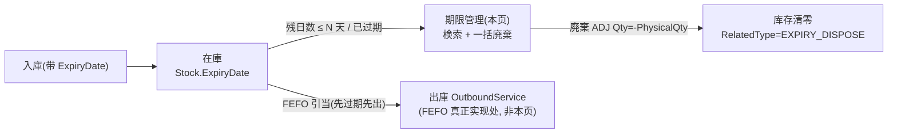
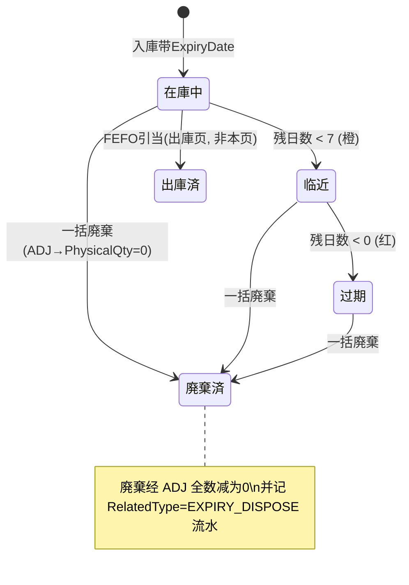

# 期限管理（FEFO・近効期） 单页面操作 SOP（手把手版）

> **用途**：给**质量担当/仓管操作、培训老师讲、测试人员拆用例**。比模块总册（`03-库存物流WMS` §5.17）更细。
> **页面**：期限管理（WM170 · 库存物流 WMS）　**路由**：`/wms/expiry`　**前端**：`views/wms/ExpiryView.vue`　**API**：`api/wms/expiry.ts expiryApi`　**后端**：`Wms/ExpiryController` → `ExpiryService`（`GetExpiringStocksAsync` 查询 + `DisposeAsync` 一括廃棄）
> **基准**：分支 `feat/wfs-inbox-core`，2026-06-29；后端实测 `docs/codemap-wms/04-棚卸-補充-期限-QC.md` §3/§4（2026-06-22 权威），UI 经实读 view + api + types。
> **样例数据**：製品 `PRD2026070001`、倉庫 `W01`、库位 `RES-C-01`、LotNo `LOT2026070001`、賞味期限近 7 天、単価 `¥120`。

---

## 1. 页面一句话说明

**期限管理，就是质量/仓管「看哪些库存快到期或已过期、然后一括把选中的库存廃棄掉」的地方——按 N 天内检索近效期库存（残日数 <7 标橙、<0 已过期标红），勾选后点「廃棄」会对每一行库存调底层 `ApplyAsync(ADJ, Qty=-PhysicalQty)` 把数量全数减为 0，并记一条 `RelatedType=EXPIRY_DISPOSE` 的调整流水。** 它是「近效期盘看 + 一括报废」的统一入口；**FEFO 先过期先出的「引当」逻辑不在本页，而在出庫**。

---

## 2. 这个页面在业务流程中的位置

- **上游**：带 `ExpiryDate` 的在庫（入庫/QC 入库时落的賞味期限）。
- **本页**：①查询 N 天内近效期 + 已过期库存；②对选中库存一括廃棄（走 ADJ 减为 0）。
- **下游**：廃棄→库存被校正为 0 + 一条 `EXPIRY_DISPOSE` 调整流水（可供财务/追溯）；FEFO 引当在出庫页按 `ExpiryDate ASC` 自动「先过期先出」。

---

## 3. 谁使用这个页面

| 角色 | 用途 |
|---|---|
| 质量担当（品質管理） | 盘看近效期/已过期，决定报废 |
| 仓管（在庫担当） | 执行一括廃棄、核对损失金额 |
| 经营/财务（旁观） | 看過期件数、損失合計做呆滞/损耗分析 |

---

## 4. 操作前准备

- [ ] 想清楚「检索口径」：往后看几天（days，默认 30，范围 1~365），是否限定某个倉庫（如 `W01`）。
- [ ] 明确：检索结果**含已过期**（残日数 < 0 也会出现在列表里），不是只看「还没过期但快到期」的。
- [ ] 廃棄前确认：选中的库存是真要报废的——**廃棄不可撤销、只有两步确认（弹框 + 理由），无单条无草稿，且把整行 `PhysicalQty` 全数减为 0**。
- [ ] 知道默认廃棄理由是 `賞味期限切れ廃棄`（日文，硬编码 key），需要别的理由就在第二步弹框里改。

---

## 5. 页面区域说明

| 区域 | 内容 |
|---|---|
| 検索条件卡 | `日数以内`（el-input-number，1~365，默认 30）+ `倉庫`（文本框，可空=全仓）+「検索」按钮 +「廃棄(N)」按钮（红色 danger，N=已选数，选 0 时灰） |
| 汇总标签行 | `合計: <行数>` 灰 tag；過期数 >0 时显红 tag `過期: <数>`；損失合計 >0 时显黄 tag `損失合計: ¥<金额>` |
| 近効期一覧表 | 多选列 + 製品 / ロット / 倉庫 / 库位 / 実数量 / 賞味期限(取前 10 位 yyyy-MM-dd) / 残日数(<0 红粗/<7 橙) / 単価(¥, 空显 —) / 損失金額(¥, 空显 —) |

> 本页**没有详情对话框、没有单据编辑区**——它是一张库存盘看表 + 一个一括廃棄动作。

---

## 6. 字段填写说明（口语版）

**検索条件**（只有两个输入）：

| 字段 | 怎么填 | 填错/边界影响 |
|---|---|---|
| 日数以内（days） | 整数 1~365，默认 30；表示「賞味期限 ≤ 今天+days」的库存（**含已过期**） | el-input-number 限 1~365，超界被组件钳制；填 7 只看一周内（含已过期） |
| 倉庫（warehouseCd） | 仓库 CD，如 `W01`；可清空=查全仓 | 空字符串→后端按「全仓」查；填不存在的仓→结果为空表 |

**廃棄理由**（点「廃棄」后第二步弹框 `ElMessageBox.prompt` 才填）：

| 字段 | 怎么填 | 说明 |
|---|---|---|
| 廃棄理由（reason） | 默认带入 `賞味期限切れ廃棄`（日文硬编码 key），可改成任意文本 | 取消该弹框（reason==null）→**整个廃棄中止**，不动库存 |

> 列表里的「残日数 / 損失金額 / 単価」都是**后端算好/库存带出的只读列**，不需要也不能在本页编辑。

---

## 7. 按钮操作说明

| 按钮 | 何时可点 | 点了会怎样 |
|---|---|---|
| 検索 | 常显 | 按 days + 倉庫 调 `expiryApi.expiring`，刷新列表与汇总（后端按賞味期限升序、最多取 500 行） |
| 廃棄(N) | **选中行数 N>0 才可点**（N=0 时 disabled 灰） | ①确认框 `confirmDispose(N)`；②理由弹框（默认日文理由）；③调 `expiryApi.dispose({stockIds, reason})`→对每行 `ApplyAsync(ADJ, Qty=-PhysicalQty)`；④toast `<disposed> 件廃棄`；⑤自动 `reload()` 重查 |
| 多选框（行/表头） | 常显 | 勾选要廃棄的行；`selection-change` 实时更新已选数，驱动「廃棄(N)」的 N 与灰/亮 |

> 进入页面 `onMounted` 自动跑一次 `reload()`（默认 days=30、全仓），不用先点検索。

---

## 8. 标准业务操作 SOP（照着点）

### 场景一：检索 N 天内近效期库存（主流程）
- **背景**：质量每天盘看一周内要到期的库存。
- **样例数据**：days=`7`、倉庫 `W01`。
- **步骤**：1) 日数以内填 `7`；2) 倉庫填 `W01`；3) 点「検索」。
- **完成后检查**：列表只列賞味期限 ≤ 今天+7 天且 `PhysicalQty>0` 的库存，按賞味期限升序；汇总显示合計件数；样例 `PRD2026070001 / LOT2026070001 / RES-C-01` 应出现，残日数标橙。
- **异常/边界**：days 超 365 被钳制；倉庫填错→空表。
- **用例**：TC-M06-EXPIRY-001~004、010、011。

### 场景二：过期与临近的颜色判读 + 汇总
- **背景**：要一眼分清「已过期（必须立刻处理）」与「临近（提前预警）」。
- **样例数据**：days=`30`、全仓。
- **步骤**：1) days 填 `30`，倉庫留空；2) 検索；3) 看残日数列颜色与顶部 tag。
- **检查**：残日数 `<0` 红色加粗（已过期）、`<7` 橙色（临近）、其余正常；顶部 `過期: <数>` 红 tag = 残日数<0 的行数，`損失合計: ¥<金额>` 黄 tag = 各行 lossAmount 之和（前端 `Math.round` 取整后展示）。
- **用例**：TC-M06-EXPIRY-005、006、007、024。

### 场景三：一括廃棄选中近效期库存（走 ADJ 减为 0）
- **背景**：确认某几行确实要报废。
- **样例数据**：勾选 `PRD2026070001 / LOT2026070001 / RES-C-01`（实数量假设 50、単価 `¥120`）。
- **前置**：先検索出该行。
- **步骤**：1) 勾选目标行（「廃棄(N)」由灰变红，N=1）；2) 点「廃棄(1)」；3) 确认框点确定；4) 理由弹框保留默认 `賞味期限切れ廃棄`→确定。
- **完成后检查**：toast `1 件廃棄`；页面自动 `reload()`，该行因 `PhysicalQty=0` 不再出现；后端对该 stockId 发 `ApplyAsync(ADJ, Qty=-50, RelatedType="EXPIRY_DISPOSE")`，Stock.PhysicalQty 校正为 0，生成一条 ADJ 调整流水。
- **异常**：选 0 行时按钮灰，点不动。
- **用例**：TC-M06-EXPIRY-008、009、012、013、014、015。

### 场景四：自定义廃棄理由
- **背景**：报废原因不是「賞味期限切れ」而是「破损/召回」。
- **步骤**：1) 勾选行→点廃棄→确认；2) 在理由弹框把默认文本改成 `破損のため廃棄`→确定。
- **检查**：dispose 请求 `reason="破損のため廃棄"`，写入 ADJ 流水 Remark；toast 正常。
- **用例**：TC-M06-EXPIRY-016。

### 场景五：取消两步确认（中途放弃廃棄）
- **背景**：误点廃棄，或临时改主意。
- **步骤（两条分支）**：
  - 5a：点廃棄→**第一步确认框点取消** → 不弹理由框，不动库存。
  - 5b：确认框点确定→**第二步理由框点取消（reason==null）** → 廃棄中止，不动库存。
- **检查**：两种都不调 dispose、库存不变、无 toast。
- **用例**：TC-M06-EXPIRY-017、018。

### 场景六：廃棄按钮灰（未选行）
- **背景**：理解为什么按钮点不动。
- **步骤**：检索出结果但不勾任何行→看「廃棄(0)」。
- **检查**：按钮 `disabled`（`selected.length===0`）灰色，且 `onDispose` 入口处也有 `length===0` 早返回兜底。
- **用例**：TC-M06-EXPIRY-019。

### 场景七：倉庫过滤与全仓切换
- **背景**：只处理某仓 / 看全公司。
- **步骤**：1) 倉庫填 `W01` 検索（只看 W01）；2) 清空倉庫再検索（全仓）。
- **检查**：结果集随倉庫参数变化；空倉庫=全仓。
- **用例**：TC-M06-EXPIRY-010、011。

### 场景八：理解 FEFO 在哪（概念演示）
- **背景**：学员常误以为本页负责「先过期先出」。
- **步骤**：讲解——本页 `ExpiryService` 只做「查询 + 一括廃棄」；真正的 FEFO 引当在 `OutboundService.FindCandidateStockAsync`（`ExpiryDate ASC→ReceiveDate ASC→LotNo ASC` + 过滤 `!RecallFlag / AvailableQty>=needed / OwnerType==Self / QcStatus∉{Failed,Hold}`）。
- **检查**：在出庫页对同品做引当，会优先吃賞味期限最近的批次（不在本页操作）。
- **用例**：TC-M06-EXPIRY-020、021。

---

## 9. 状态变化说明

> **本页无单据状态机**——它是一张库存盘看视图。下图画的是「库存数据的生命周期」，帮助理解残日数颜色与廃棄的位置。

---

## 10. 按钮不可用 / 灰色原因

| 现象 | 原因 |
|---|---|
| 「廃棄」按钮灰、点不动 | 未勾选任何行（`selected.length===0`），且入口处再做一次 length 兜底 |
| 列表为空 | days 太小/倉庫填错/确实无近效期库存；或目标库存 `PhysicalQty<=0`、`ExpiryDate` 为空（不进结果） |
| 找不到「单条廃棄」「编辑」「撤销」 | **本页只有一括廃棄，无单条、无编辑、无撤销**（不可逆，靠两步确认兜底） |
| 列表最多只到 500 行 | 后端 `Take(500)` 上限（按賞味期限升序，最紧迫的优先） |
| days 填超 365 或小于 1 | el-input-number 限 `min=1 / max=365`，越界被组件钳制 |

---

## 11. 常见错误与处理

| 错误/疑问 | 原因 | 处理 |
|---|---|---|
| 廃棄完想找回 | 廃棄经 ADJ 把库存减为 0，**不可撤销** | 只能反向用库存调整（ADJ 正数）补回，本页不提供 |
| 已过期库存还能被出庫吃到 | 本页廃棄是手动的；没廃棄前库存仍在，FEFO 只是「优先」出最近的 | 及时廃棄，或在出庫页靠 FEFO/召回排除 |
| 損失合計对不上财务 | 顶部 `損失合計` 是前端把各行 lossAmount 求和后 `Math.round` 取整展示 | 以后端 ADJ 流水金额为准，前端汇总仅作盘看 |
| 默认理由是日文，看不懂 | `inputValue: t('賞味期限切れ廃棄')` 是硬编码日文 key（直接当文本带入） | 在理由弹框改成本地语言文本即可 |
| 残日数为负还出现在「N 天内」 | 检索口径是 `ExpiryDate ≤ 今天+days`，**含已过期** | 正常；红色行即已过期，优先处理 |
| 纯查询/廃棄无业务错误码 | `ExpiryService` 不抛 `WM-MSG` 业务码（只查询 + 调底层 ApplyAsync） | 失败一般是网络/底层异常，重试或查日志 |

---

## 12. 操作完成后的检查清单

- [ ] 検索：列表只含 `PhysicalQty>0 && ExpiryDate!=null && ExpiryDate<=今天+days`，按賞味期限升序，最多 500 行。
- [ ] 颜色：残日数 `<0` 红粗（已过期）、`<7` 橙（临近）；汇总 `合計/過期/損失合計` 与列表一致。
- [ ] 廃棄：对每个选中 stockId 发 `ApplyAsync(ADJ, Qty=-PhysicalQty, RelatedType="EXPIRY_DISPOSE")`，Stock.PhysicalQty 被减为 0。
- [ ] 廃棄后：toast `<disposed> 件廃棄`，页面自动 `reload()`，已廃棄行不再出现。
- [ ] 不可逆：无单条/无编辑/无撤销；只有两步确认；取消任一步都不动库存。
- [ ] FEFO：本页不做引当；「先过期先出」在出庫 `OutboundService.FindCandidateStockAsync`。

---

## 13. 页面级测试用例（≥25 条，可执行）

> 编号 `TC-M06-EXPIRY-xxx`；数据用样例（製品 `PRD2026070001` / 倉庫 `W01` / 库位 `RES-C-01` / LotNo `LOT2026070001` / 単価 `¥120`）。

| 用例编号 | 用例名称 | 优先级 | 前置条件 | 测试数据 | 操作步骤 | 预期结果 | 下游检查 | 备注 |
|---|---|---|---|---|---|---|---|---|
| TC-M06-EXPIRY-001 | 进页自动检索 | P1 | 有近效期库存 | 默认 days=30 | 打开 /wms/expiry | onMounted 自动 reload、列表与汇总出现 | — | — |
| TC-M06-EXPIRY-002 | 按 days 检索 | P0 | 有库存 | days=7 | 填7→検索 | 仅賞味期限≤今+7 的行 | — | 核心 |
| TC-M06-EXPIRY-003 | days 默认30 | P1 | — | days=30 | 検索 | 列出30天内（含已过期） | — | — |
| TC-M06-EXPIRY-004 | days 含已过期 | P0 | 有过期库存 | days=7 | 検索 | 残日数<0 的行也出现 | — | 口径=≤今+days |
| TC-M06-EXPIRY-005 | 残日数<0 标红 | P0 | 有过期行 | — | 看残日数列 | 红色加粗(overdue) | — | — |
| TC-M06-EXPIRY-006 | 残日数<7 标橙 | P1 | 有临近行 | LOT2026070001 | 看残日数列 | 橙色(soon) | — | — |
| TC-M06-EXPIRY-007 | 汇总过期/损失 | P1 | 有过期+金额 | — | 看顶部tag | 過期数=红行数、損失合計=Σloss(取整) | — | — |
| TC-M06-EXPIRY-008 | 单行勾选亮按钮 | P0 | 列表有行 | 勾1行 | 勾选 | 廃棄(1) 由灰变红 | — | — |
| TC-M06-EXPIRY-009 | 多行勾选计数 | P1 | ≥3行 | 勾3行 | 勾选 | 廃棄(3)、N=3 | — | — |
| TC-M06-EXPIRY-010 | 倉庫过滤 | P1 | W01有库存 | warehouse=W01 | 填W01→検索 | 仅W01库存 | — | — |
| TC-M06-EXPIRY-011 | 全仓检索 | P1 | 多仓库存 | 倉庫空 | 清空→検索 | 全仓库存 | — | 空=全仓 |
| TC-M06-EXPIRY-012 | 一括廃棄成功 | P0 | 勾选1行(qty50) | 默认理由 | 廃棄→确认→理由确定 | toast「1 件廃棄」、reload | Stock.PhysicalQty=0 | 核心 |
| TC-M06-EXPIRY-013 | 廃棄走ADJ全数减 | P0 | 勾选行 | qty=50 | 廃棄确定 | ApplyAsync(ADJ,Qty=-50) | 一条ADJ流水 | 铁律 |
| TC-M06-EXPIRY-014 | 廃棄打EXPIRY_DISPOSE | P0 | 勾选行 | — | 廃棄确定 | 流水 RelatedType=EXPIRY_DISPOSE | 追溯钩子 | — |
| TC-M06-EXPIRY-015 | 廃棄后行消失 | P1 | 廃棄成功 | — | 看列表 | PhysicalQty=0 不再列出 | — | reload |
| TC-M06-EXPIRY-016 | 自定义廃棄理由 | P1 | 勾选行 | reason=破損のため廃棄 | 改理由→确定 | dispose reason=自定义、写入Remark | 流水Remark | — |
| TC-M06-EXPIRY-017 | 取消第一步确认 | P1 | 勾选行 | — | 廃棄→确认框取消 | 不弹理由、不调dispose | 库存不变 | — |
| TC-M06-EXPIRY-018 | 取消理由弹框 | P1 | 勾选行 | reason=null | 确认→理由框取消 | 廃棄中止、不调dispose | 库存不变 | reason==null早返回 |
| TC-M06-EXPIRY-019 | 未选行按钮灰 | P0 | 列表有行 | 不勾选 | 看廃棄按钮 | disabled、点不动 | — | length===0 |
| TC-M06-EXPIRY-020 | FEFO 不在本页 | P2 | — | — | 查看本页动作 | 仅查询+廃棄、无引当 | — | 概念 |
| TC-M06-EXPIRY-021 | FEFO 在出庫 | P2 | 有多批次 | — | 出庫引当 | 优先賞味期限最近批次 | OutboundService | 区别 |
| TC-M06-EXPIRY-022 | 仅PhysicalQty>0 | P1 | 有0库存行 | — | 検索 | PhysicalQty<=0 不列出 | — | — |
| TC-M06-EXPIRY-023 | ExpiryDate空不列 | P1 | 有无效期库存 | — | 検索 | ExpiryDate=null 不出现 | — | — |
| TC-M06-EXPIRY-024 | 賞味期限取前10位 | P2 | 有结果 | — | 看賞味期限列 | 显示 yyyy-MM-dd | — | slice(0,10) |
| TC-M06-EXPIRY-025 | 単価空显— | P2 | 单价缺 | unitPrice=null | 看単価列 | 显示 —（非¥0） | — | — |
| TC-M06-EXPIRY-026 | 損失金額空显— | P2 | loss缺 | lossAmount=null | 看損失金額列 | 显示 —（非¥0） | — | — |
| TC-M06-EXPIRY-027 | 金额取整展示 | P2 | 有小数金额 | ¥120.4 | 看损失合計 | Math.round 整数 | — | — |
| TC-M06-EXPIRY-028 | 最多500行 | P2 | >500近效期 | days=365 | 検索 | 仅前500（按期限升序） | — | Take(500) |
| TC-M06-EXPIRY-029 | days越界钳制 | P2 | — | days=400 | 输入 | 被钳到365（max） | — | input-number |
| TC-M06-EXPIRY-030 | 无单条无撤销 | P1 | 有库存 | — | 找单条/撤销入口 | 仅一括、无撤销 | — | 不可逆 |
| TC-M06-EXPIRY-031 | 廃棄不可撤销 | P1 | 廃棄成功 | — | 找回廃棄 | 无撤销、只能反向ADJ补 | — | — |
| TC-M06-EXPIRY-032 | 权限不足 | P2 | 无权账号 | — | 进页/廃棄 | 待业务确认(隐藏/拒绝) | — | 权限 |
| TC-M06-EXPIRY-033 | 网络异常 | P2 | 断网 | — | 検索/廃棄 | 友好错误可重试 | — | — |

---

## 14. 培训讲解建议

| 顺序 | 讲什么 | 演示 | 易误解点 |
|---|---|---|---|
| 1 | 这页是「盘近效期 + 一括报废」的地方 | §2 流程图 | 以为它负责「先过期先出」（错，那在出庫） |
| 2 | 检索口径含已过期 | days=7 检索看红行 | 以为只看「还没过期」的 |
| 3 | 颜色含义 | <0 红 / <7 橙 | 不看颜色直接全选 |
| 4 | 廃棄=ADJ 全数减为 0 | 廃棄一行看库存归零 | 以为只减一部分 |
| 5 | 廃棄不可撤销、两步确认 | 演示取消两步 | 误点一次就报废 |
| 6 | 只一括、无单条无草稿 | 看按钮区 | 找不到单条/编辑/撤销 |
| 7 | 損失合計只是盘看汇总 | 对照后端流水 | 拿前端取整值当财务口径 |

---

## 15. 与模块级手册的关系

对应 `03-库存物流WMS-最详细用户操作培训手册.md` §5.17「库存分析与设置类」中的 **期限管理 WM170(/expiry)** 行：质量/仓管看 N 天内近效期+已过期、勾选「一括廃棄」走 ADJ 减库存；关键机制注（FEFO 真正实现在 `OutboundService.FindCandidateStockAsync`）见 §5.17「关键机制」段。模块测试矩阵对应 M06-018（期限管理·一括廃棄 ADJ）。

---

## 16. 代码与文档来源

| 层 | 文件 |
|---|---|
| 逐行源码手册 | `docs/codemap-wms/04-棚卸-補充-期限-QC.md` §3（期限 Expiry）/§4（FEFO 引当）（权威，2026-06-22 实测） |
| 前端 | `cp6.web/src/views/wms/ExpiryView.vue`（reload `:82-88` / onDispose `:90-106` / dayClass `:73-77` / 汇总 `:70-71`） |
| API/类型 | `cp6.web/src/api/wms/expiry.ts`（expiring / dispose）、`cp6.web/src/types/wms/wms.ts`（`ExpiryStock` `:332-345` / `ExpiryDisposeRequest` `:347-350`） |
| 后端 | `Wms/ExpiryController.cs`、`Services/Wms/ExpiryService.cs`（`GetExpiringStocksAsync` 查询 + `DisposeAsync` 经 ADJ 全数减为 0，无 WM-MSG 业务码） |
| 底层（库存唯一写入口） | `StockMovementService.cs ApplyAsync`（ADJ 分支 `PhysicalQty += Qty`） |
| FEFO 引当（非本页） | `OutboundService.FindCandidateStockAsync`（`ExpiryDate ASC→ReceiveDate ASC→LotNo ASC` + 过滤 `!RecallFlag/AvailableQty>=needed/OwnerType==Self/QcStatus∉{Failed,Hold}`） |

---

## 最后更新来源

- 代码：见 §16（codemap-wms 04 §3/§4 + ExpiryView.vue 实读 + expiry.ts/wms.ts 类型）。
- 基准：分支 `feat/wfs-inbox-core`，2026-06-29（codemap 2026-06-22 权威）。
- 覆盖：16 节 / 8 场景 / 33 用例（TC-M06-EXPIRY-001~033）。
- 诚实标注：①廃棄请求前端只读取 `res.data.disposed`（件数）→toast，損失合計为前端各行 lossAmount 求和取整展示，非廃棄返回值；②本页无单据状态机（库存视图）；③`ExpiryService` 纯查询/调底层，不抛 WM-MSG 业务码；④默认廃棄理由 `t('賞味期限切れ廃棄')` 为硬编码日文 key；⑤FEFO 引当不在本页。
</content>
</invoke>
