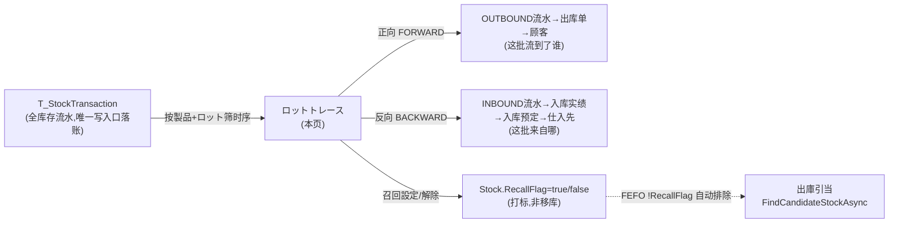
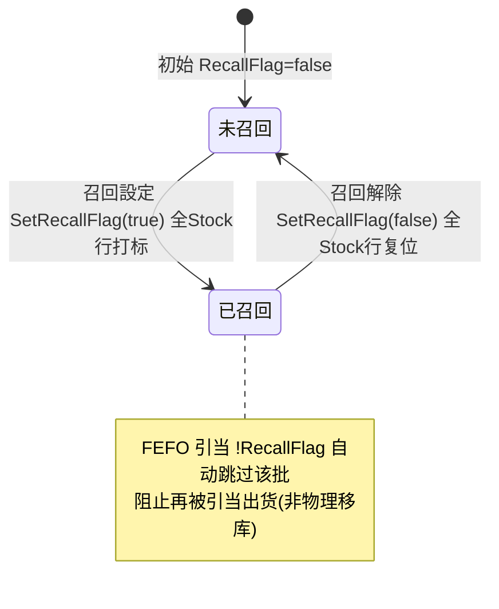

# ロットトレース（批次追溯） 单页面操作 SOP（手把手版）

> **用途**：给**质量/召回负责人查、品保用、培训老师讲、测试人员拆用例**。比模块总册（`03-库存物流WMS` §5.17）更细。
> **页面**：ロットトレース（MSBBWM160 · 库存物流 WMS）　**路由**：`/wms/lot-trace`　**前端**：`views/wms/LotTraceView.vue`　**API**：`api/wms/lotTrace.ts`(lotTraceApi)　**后端**：`Wms/LotTraceController` → `LotTraceService`（纯查询）
> **基准**：分支 `feat/wfs-inbox-core`，2026-06-29；后端实测 `docs/codemap-wms/04-棚卸-補充-期限-QC.md` §5（2026-06-22 权威），UI 经实读 view + types + api。
> **样例数据**：製品 `PRD2026070001`、ロット `LOT2026070001`、客户 `CUST-A`、仕入先 `SUP01`。

---

## 1. 页面一句话说明

**ロットトレース（批次追溯），就是质量/召回负责人输入"製品 + ロット + 方向"，一键查出这批货【正向 FORWARD→流到了哪些顾客】或【反向 BACKWARD→来自哪个仕入先】，同时看这批货的全时序库存流水时间线；查到摘要后还能对该批次设/解"召回标记"，召回打标后该批被出库 FEFO 引当自动排除（阻出货）。** 它**纯查 `T_StockTransaction`（库存流水表），没有专用追溯表**，追溯就是把这批货的流水按时序串起来再反查出库单/入库实绩。

---

## 2. 这个页面在业务流程中的位置

- **上游**：所有实物移动（入荷 IN / 出荷 OUT / 移动 MOVE / 引当 RSV / 调整 ADJ）都经库存唯一写入口落到 `T_StockTransaction`，本页只读取，不产生流水。
- **本页**：按 製品 + ロット 把这批货的流水拉成时序时间线，并反查上下游主体（顾客 / 仕入先）；可对该批次打/解召回标记。
- **下游**：召回打标后，出库 FEFO 引当 `FindCandidateStockAsync` 的 `!RecallFlag` 过滤条件自动跳过该批 → 阻止该批被引当出货（这是召回的真正作用，**不是物理隔离也不是回收工单**）。

---

## 3. 谁使用这个页面

| 角色 | 用途 |
|---|---|
| 召回负责人 / 品保 | 出问题批次正向追到受影响顾客（通知/召回）、反向追到来源仕入先（追责） |
| 质量 / 仓管 | 查某批货当前在哪些库位、总实物/可用量、近效期、是否已召回 |
| 客服 / 业务 | 配合召回，确认这批货发给了哪些客户、各发了多少 |

---

## 4. 操作前准备

- [ ] 拿到要追溯的 **製品CD**（如 `PRD2026070001`）和 **ロットNO**（如 `LOT2026070001`）——两者都**必填**，缺一个查不了。
- [ ] 想清楚要哪个方向：**正向 FORWARD**=这批流到哪些顾客（召回通知用）；**反向 BACKWARD**=这批来自哪个仕入先（追责用）。
- [ ] 若要设召回：先明确该批是否真要召回（召回会让该批**整体被 FEFO 排除、不能再引当出货**），并知会业务/客服。
- [ ] 注意：**召回是"打标"不是物理隔离**，货还在原库位、数量不变，只是引当时被跳过。

---

## 5. 页面区域说明

| 区域 | 内容 |
|---|---|
| 检索卡（顶部） | 製品（el-input）+ ロット（el-input）+ 方向（FORWARD/BACKWARD 单选 radio-button）+「追溯」按钮 +「サマリ」按钮 |
| サマリ卡（追溯后/サマリ后出现） | 卡头：标题 + 召回按钮（红「召回設定」or 黄「召回解除」）；卡身：製品 / ロット / 实物数 / 可用数 / 库位数 / 賞味期限 / 召回 tag |
| 影响一览（左，10/24 宽） | 卡头随方向变："影响顾客一览"(FORWARD) 或 "来源仕入先一览"(BACKWARD) + 件数 tag；表格列随方向切换；空→el-empty |
| 时序トランザクション（右，14/24 宽） | 卡头：时间线标题 + 节点数 tag；el-timeline 按时序列每条流水：txnType tag + 倉庫-库位 + 数量(+/-着色) + [关联类型]关联NO + 备注；空→el-empty |

> サマリ卡 + 影响/时间线两栏都是 `v-if` 控制：没查之前整页只有检索卡；点「追溯」后三块一起出来（追溯会顺带拉サマリ），点「サマリ」只出サマリ卡。

---

## 6. 字段填写说明（口语版）

**检索区**：

| 字段 | 怎么填 | 填错影响 |
|---|---|---|
| 製品（productCd） | 必填，如 `PRD2026070001` | 空→点追溯弹 `wms.common.required` 警告；サマリ按钮灰；后端直调返 400 |
| ロット（lotNo） | 必填，如 `LOT2026070001` | 同上 |
| 方向（direction） | 单选：FORWARD（正向→顾客）/ BACKWARD（反向→仕入先）；默认 FORWARD | 选错→影响一览查的是另一个方向 |

> **关于"必填"的真实实现（诚实标注）**：el-input 上**没有 HTML `required` 属性**；必填是靠三道软校验把关——①「追溯」按钮点下后在 `trace()` 里判 `if (!productCd || !lotNo)` 弹 `ElMessage.warning`；②「サマリ」按钮 `:disabled="!productCd || !lotNo"` 直接置灰；③后端 forward/backward Controller 对空参返 `400 productCd and lotNo are required`。

**召回确认框**（点召回按钮后弹出）：无输入字段，只是二次确认，文案为 `召回設定/解除: 製品 / ロット`，确认即执行。

---

## 7. 按钮操作说明

| 按钮 | 何时出现 / 可用 | 点了会怎样 |
|---|---|---|
| 追溯 | 检索卡常显（无 disabled） | `trace()`：空製品/ロット弹必填警告；否则按方向调 forward/backward 拉影响一览+时间线，**并顺带自动拉サマリ**（成功才显召回按钮） |
| サマリ | 检索卡常显，但 `:disabled="!productCd || !lotNo"` | `loadSummary()`：只查在库摘要（实物/可用/库位数/期限/召回 flag），不查影响一览/时间线 |
| 召回設定（红） | **仅当サマリ卡已出现且 `summary.recallFlag=false`** | 弹确认框→`recall(...,true)`：把该(製品,ロット)**全部 Stock 行 `RecallFlag=true` 打标**→toast 含被打标行数→重载サマリ（按钮变黄「召回解除」） |
| 召回解除（黄） | **仅当サマリ卡已出现且 `summary.recallFlag=true`** | 弹确认框→`recall(...,false)`：全 Stock 行 `RecallFlag=false` 复位→该批恢复可被 FEFO 引当 |

> **召回按钮藏在サマリ卡卡头里**：所以**必须先「追溯」或「サマリ」让サマリ卡出来，召回按钮才会出现**。サマリ卡靠 `v-if="summary"`，summary 为 null（如该批已无在库）时整张卡不显，自然也点不到召回。

---

## 8. 标准业务操作 SOP（照着点）

### 场景一：正向追溯——这批货流到了哪些顾客（召回影响面分析，主流程）
- **背景**：某批货发现质量问题，召回负责人要知道发给了哪些客户、各发了多少，好逐家通知。
- **样例数据**：製品 `PRD2026070001`、ロット `LOT2026070001`、方向 FORWARD。
- **前置**：该批有过出库流水（`RelatedType=OUTBOUND` 的 OUT 或 MOVE 源）。
- **步骤**：1) 製品填 `PRD2026070001`；2) ロット填 `LOT2026070001`；3) 方向选 **FORWARD（正向）**；4) 点「追溯」。
- **完成后检查**：左栏"影响顾客一览"列出 客户CD（`CUST-A`）/ 客户名 / 出库单NO / 数量 / 出荷时刻（按出荷时刻倒序）；右栏时间线按时序列全流水；サマリ卡顺带出现（实物/可用/库位/期限/召回）。
- **后端机制**：筛时间线节点 `RelatedType=OUTBOUND && (OUT || (MOVE && Qty<0))`→去重 `RelatedNo`→反查 `OutboundOrders`→取 客户/WebOrderNo；qty=该单 OUT+MOVE源绝对值合计。
- **异常**：该批从没出过库→影响一览空（el-empty"无影响"）；製品/ロット空→必填警告。
- **用例**：TC-M06-LOTTRACE-001、007、009、021、025。

### 场景二：反向追溯——这批货来自哪个仕入先（来源溯源/追责）
- **背景**：召回后要追责到源头，确认这批料是哪个供应商、哪张入库进来的。
- **样例数据**：製品 `PRD2026070001`、ロット `LOT2026070001`、方向 BACKWARD。
- **步骤**：1) 填製品+ロット；2) 方向选 **BACKWARD（反向）**；3) 点「追溯」。
- **完成后检查**：左栏"来源仕入先一览"列出 仕入先CD（`SUP01`）/ 仕入先名 / 入库实绩NO / 数量 / 受入时刻（按受入时刻倒序）。
- **后端机制**：筛 `IN && RelatedType=INBOUND`→去重 `RelatedNo`(=入库实绩 ReceiptNo)→`InboundReceipts`→`InboundOrders`→取 仕入先；qty=IN 数量合计。
- **异常**：该批是生产完工/QC 自动入库等非"采购入荷"来源（无 INBOUND 实绩）→来源一览可能空。
- **用例**：TC-M06-LOTTRACE-002、022、026。

### 场景三：设召回标记（阻引当）
- **背景**：确认该批要召回，要让它"立刻不能再发货"。
- **前置**：先「追溯」或「サマリ」让サマリ卡出来，且当前 `recallFlag=false`（卡头是红「召回設定」）。
- **步骤**：1) 完成场景一/二或单点「サマリ」；2) 点卡头红「召回設定」；3) 确认框（`召回設定: PRD2026070001 / LOT2026070001`）点确定。
- **完成后检查**：toast 提示已对 N 行打标（N=该批 Stock 行数）；サマリ自动重载，召回 tag 变红"已召回"，按钮变黄「召回解除」。
- **下游验证（接缝）**：到出庫引当时，该批因 FEFO `!RecallFlag` 被自动排除，**引不到、发不出**（货仍在原库位、数量不变）。
- **异常**：确认框点取消→不打标；サマリ卡没出来→根本看不到召回按钮。
- **用例**：TC-M06-LOTTRACE-010、011、012、013、015、023。

### 场景四：解除召回标记（恢复可发货）
- **背景**：经判定该批可放行/误召回，要恢复其可引当状态。
- **前置**：当前 `recallFlag=true`（卡头是黄「召回解除」）。
- **步骤**：点黄「召回解除」→确认框点确定。
- **完成后检查**：全 Stock 行 `RecallFlag=false`，召回 tag 回"—"，按钮回红「召回設定」；该批恢复可被 FEFO 引当。
- **用例**：TC-M06-LOTTRACE-014。

### 场景五：只看在库摘要（サマリ单独查）
- **背景**：只想快速看这批货现在还有多少、在几个库位、有没有被召回，不需要影响面。
- **步骤**：填製品+ロット→点「サマリ」（不点追溯）。
- **完成后检查**：只出サマリ卡（实物数/可用数/库位数/最早賞味期限/召回 tag），不出影响一览和时间线。
- **异常**：製品或ロット空→サマリ按钮灰，点不动。
- **用例**：TC-M06-LOTTRACE-004、005、006、027、028。

### 场景六：查无此批 / 该批已无在库
- **背景**：填了不存在的批，或该批已全数出货/废弃（无 Stock 行）。
- **步骤**：填一个无在库的製品+ロット→点「サマリ」或「追溯」。
- **完成后检查**：サマリ返 `404 WM-MSG-070`→前端 `catch` 把 summary 置 null→**サマリ卡不出现**→连带**召回按钮也出不来**（即使时间线里还有历史流水，也无法对它召回，因为没有 Stock 行可打标）。
- **用例**：TC-M06-LOTTRACE-016、024。

### 场景七：必填漏填校验
- **背景**：没填全就点。
- **步骤**：清空製品或ロット→点「追溯」/看「サマリ」。
- **完成后检查**：「追溯」弹 `wms.common.required` 警告、不发请求；「サマリ」按钮置灰点不了；若绕过前端直调 forward/backward API→后端返 `400 productCd and lotNo are required`。
- **用例**：TC-M06-LOTTRACE-007、008、029。

---

## 9. 状态变化说明

本页是**只读追溯 + 召回打标**，唯一会变的"状态"是该批次的召回标记（Stock.RecallFlag）：

- 追溯（forward/backward）和サマリ（summary）都是**纯查询，绝不改库存、不改流水、不动状态**。
- 召回設定/解除**只改 Stock.RecallFlag 这一个布尔位**，不发库存流水、不移库、不建任何工单。

---

## 10. 按钮不可用 / 灰色原因

| 现象 | 原因 |
|---|---|
| 「サマリ」按钮灰 | 製品或ロット为空（`:disabled="!productCd||!lotNo"`） |
| 「追溯」点了没反应只弹警告 | 製品或ロット为空（`trace()` 内 `ElMessage.warning(required)`） |
| 看不到召回按钮 | サマリ卡没出来——**还没「追溯」或「サマリ」**，或该批无在库（summary=null，卡不显） |
| 召回按钮一直是红「召回設定」 | 该批 `recallFlag=false`（未召回）；打标成功后才变黄 |
| 没有"修改/删除流水"入口 | 追溯**纯读 `T_StockTransaction`**，流水不可改不可删（库存账只增不改） |
| 没有"召回工单/回收单"入口 | **召回仅打标 RecallFlag**，前端无回收工单流程（诚实标注） |

---

## 11. 常见错误与处理

| 错误 / 现象 | 原因 | 处理 |
|---|---|---|
| 必填警告（`wms.common.required`） | 製品/ロット空时点追溯 | 两者都填上再点 |
| サマリ 404（`WM-MSG-070`） | 该(製品,ロット)无在库 Stock 行 | 核对製品/ロット；若确已全数出库，用「追溯」看历史时间线（仍可查），但无法对其召回 |
| 后端 400 productCd/lotNo required | 绕过前端直调 API 空参 | 传齐两个参数 |
| 影响一览空（el-empty） | 该批无对应方向流水（正向无 OUTBOUND / 反向无 INBOUND） | 正常现象，换方向或确认该批流向 |
| 时间线 txnType 显示成 `IN/OUT/MOVE/ADJ` 等英文裸码 | **时间线 tag 直接渲染 `n.txnType` 未走 i18n**（已知盲点） | 培训时口头解释码义：IN 入/OUT 出/RSV 引当/UNRSV 解引/MOVE 移库/ADJ 调整 |
| 召回了货还在原库位 | 召回是"打标"非物理隔离 | 正常：靠 FEFO `!RecallFlag` 阻引当，物理隔离需另行作业 |

---

## 12. 操作完成后的检查清单

- [ ] 追溯/サマリ操作**未产生任何库存流水**（`T_StockTransaction` 行数不变）、未改库存数量。
- [ ] 正向：影响顾客一览 客户/出库单/数量/出荷时刻 与实际出货一致（qty=OUT+MOVE源绝对值合计）。
- [ ] 反向：来源仕入先一览 仕入先/入库实绩/数量/受入时刻 与实际入荷一致（qty=IN 合计）。
- [ ] 召回設定后：该(製品,ロット)**全部 Stock 行 RecallFlag=true**（toast 行数=该批库位数），サマリ召回 tag 变红。
- [ ] 召回设定后下游：到出庫引当该批被 FEFO 自动排除（引不到、不计入候选）。
- [ ] 召回解除后：全 Stock 行 RecallFlag 复位，该批恢复可引当。
- [ ] 时间线按 `TxnDateTime` 升序、数量正绿负红、显示 [关联类型]关联NO 与备注。

---

## 13. 页面级测试用例（≥25 条，可执行）

> 编号 `TC-M06-LOTTRACE-xxx`；数据用样例（製品 `PRD2026070001`、ロット `LOT2026070001`、客户 `CUST-A`、仕入先 `SUP01`）。

| 用例编号 | 用例名称 | 优先级 | 前置条件 | 测试数据 | 操作步骤 | 预期结果 | 下游检查 | 备注 |
|---|---|---|---|---|---|---|---|---|
| TC-M06-LOTTRACE-001 | 正向追溯加载顾客+时间线 | P0 | 该批有出库流水 | PRD2026070001/LOT2026070001/FORWARD | 填→FORWARD→追溯 | 影响顾客一览(CUST-A)+时间线+サマリ出现 | 不动库存 | 主流程 |
| TC-M06-LOTTRACE-002 | 反向追溯加载仕入先+时间线 | P0 | 该批有入库流水 | 同上/BACKWARD | 填→BACKWARD→追溯 | 来源仕入先一览(SUP01)+时间线 | 不动库存 | 主流程 |
| TC-M06-LOTTRACE-003 | 方向切换重查 | P1 | 已查过 FORWARD | 切 BACKWARD | 改方向→追溯 | 左栏列头从"顾客"变"仕入先" | — | — |
| TC-M06-LOTTRACE-004 | サマリ按钮单查 | P1 | 该批有在库 | PRD/LOT | 填→点サマリ | 仅出サマリ卡(实物/可用/库位/期限/召回) | 无影响一览/时间线 | — |
| TC-M06-LOTTRACE-005 | サマリ空製品禁用 | P1 | — | 製品空 | 看サマリ按钮 | disabled 置灰 | — | — |
| TC-M06-LOTTRACE-006 | サマリ空ロット禁用 | P2 | — | ロット空 | 看サマリ按钮 | disabled 置灰 | — | — |
| TC-M06-LOTTRACE-007 | 追溯空製品弹必填 | P0 | — | 製品空 | 点追溯 | wms.common.required 警告、不发请求 | 不查询 | — |
| TC-M06-LOTTRACE-008 | 追溯空ロット弹必填 | P1 | — | ロット空 | 点追溯 | required 警告 | 不查询 | — |
| TC-M06-LOTTRACE-009 | 追溯顺带带出サマリ | P1 | 该批有在库 | PRD/LOT/FORWARD | 追溯 | 影响+时间线+サマリ卡同时出 | — | trace内自动loadSummary |
| TC-M06-LOTTRACE-010 | 召回設定打标 | P0 | サマリ已出/未召回 | PRD/LOT | 点红召回設定→确定 | 全Stock行RecallFlag=true、tag变红 | FEFO排除 | 核心 |
| TC-M06-LOTTRACE-011 | 召回确认框取消 | P1 | 同上 | — | 点召回設定→取消 | 不打标、状态不变 | — | — |
| TC-M06-LOTTRACE-012 | 召回成功toast含行数 | P1 | 同上 | 该批N个库位 | 召回設定→确定 | toast recallApplied(n=N) | — | — |
| TC-M06-LOTTRACE-013 | 召回后按钮切换为解除 | P1 | 刚打标 | — | 看卡头 | 红「召回設定」→黄「召回解除」 | 重载summary | — |
| TC-M06-LOTTRACE-014 | 召回解除复位 | P0 | 当前已召回 | PRD/LOT | 点黄解除→确定 | 全行RecallFlag=false、tag回— | 恢复可引当 | — |
| TC-M06-LOTTRACE-015 | 召回打标阻FEFO引当 | P0 | 已召回 | 该批 | 去出庫对该批引当 | 该批被!RecallFlag排除、引不到 | 接缝 | 召回真作用 |
| TC-M06-LOTTRACE-016 | サマリ无在库返404 | P1 | 无在库批 | 不存在LOT | 点サマリ | 404 WM-MSG-070→summary=null、卡不显 | — | — |
| TC-M06-LOTTRACE-017 | 时间线时序升序 | P1 | 多条流水 | PRD/LOT | 追溯 | 节点按TxnDateTime升序 | — | — |
| TC-M06-LOTTRACE-018 | 时间线txnType裸码 | P2 | 有流水 | PRD/LOT | 看时间线tag | 显示IN/OUT/MOVE等裸码(未i18n) | — | 已知盲点 |
| TC-M06-LOTTRACE-019 | 时间线数量正负着色 | P2 | 有出入库 | — | 看时间线 | 入正绿(+)、出负红(-) | — | — |
| TC-M06-LOTTRACE-020 | 时间线显示关联单据 | P2 | 有关联 | — | 看时间线 | [关联类型]关联NO + 备注显示 | — | — |
| TC-M06-LOTTRACE-021 | 正向无出库→空 | P2 | 该批没出过库 | 未出库LOT/FORWARD | 追溯 | 影响顾客一览 el-empty | — | — |
| TC-M06-LOTTRACE-022 | 反向无入库→空 | P2 | 非采购来源批 | 完工批/BACKWARD | 追溯 | 来源仕入先一览 el-empty | — | — |
| TC-M06-LOTTRACE-023 | 无サマリ则无召回按钮 | P1 | 未追溯/サマリ | — | 进页只填不查 | 召回按钮不出现(卡未显) | — | 须先trace/summary |
| TC-M06-LOTTRACE-024 | 全数出货后无在库 | P2 | 该批已全出 | 已清空LOT | 追溯 | 时间线有历史、サマリ404、无召回按钮 | — | nuance |
| TC-M06-LOTTRACE-025 | 正向qty=出库量 | P2 | 有OUT+MOVE | PRD/LOT/FORWARD | 追溯看qty | qty=OUT+MOVE源绝对值合计 | — | — |
| TC-M06-LOTTRACE-026 | 反向qty=入库量 | P2 | 有IN | PRD/LOT/BACKWARD | 追溯看qty | qty=IN数量合计 | — | — |
| TC-M06-LOTTRACE-027 | サマリ期限取最早 | P3 | 多库位多期限 | PRD/LOT | サマリ | 賞味期限=各库位最早(非null) | — | — |
| TC-M06-LOTTRACE-028 | サマリ召回tag=任一行 | P2 | 部分行已召回 | PRD/LOT | サマリ | recallFlag=任一Stock行为true即红 | — | Any语义 |
| TC-M06-LOTTRACE-029 | 后端必填400 | P2 | — | 空参直调API | GET forward 空参 | 400 productCd and lotNo required | — | 绕前端 |
| TC-M06-LOTTRACE-030 | 纯查询不动库存 | P1 | 有库存 | PRD/LOT | 追溯+サマリ后查库存 | 实物/可用/流水行数不变 | 在庫照会 | 只读铁律 |
| TC-M06-LOTTRACE-031 | 未登录/无权限 | P2 | 无权账号 | — | 进页/调API | [Authorize]拦截(401/拒绝) | — | 权限 |

---

## 14. 培训讲解建议

| 顺序 | 讲什么 | 演示 | 易误解点 |
|---|---|---|---|
| 1 | 这页是召回时"查影响面+设召回"的地方 | §2 流程图 | 以为能改库存（其实只读+打标） |
| 2 | 正向 vs 反向 | FORWARD→顾客 / BACKWARD→仕入先 | 方向选反查错对象 |
| 3 | 追溯纯查流水表 | 讲 `T_StockTransaction` 无专用表 | 以为有独立追溯表 |
| 4 | 召回=打标不是隔离 | 设召回→去出庫看引不到 | 以为货被物理搬走/有回收工单 |
| 5 | 召回按钮要先查才出来 | 先追溯/サマリ再指卡头按钮 | 进页找不到召回按钮 |
| 6 | 没在库就召回不了 | 演示无在库批 404 | 以为历史出过货就能召回 |
| 7 | 时间线英文码 | 指 IN/OUT/MOVE 裸码 | 看不懂码义（未 i18n） |

---

## 15. 与模块级手册的关系

对应 `03-库存物流WMS-最详细用户操作培训手册.md` **§5.17**「库存分析与设置类（表格概述）」中的 **ロットトレース WM160(/lot-trace)** 行（召回负责人正向/反向追溯 + 设/解召回；纯查 `T_StockTransaction`；4 个 UI 盲点）。关键机制见 §5.17 末「FEFO + 召回 RecallFlag 排除引当」；召回阻出货链路另见 §5.20 场景八「Lot 召回阻出货」。

---

## 16. 代码与文档来源

| 层 | 文件 |
|---|---|
| 逐行源码手册 | `docs/codemap-wms/04-棚卸-補充-期限-QC.md` §5「Lot追溯」（权威） |
| 前端 view | `cp6.web/src/views/wms/LotTraceView.vue`（实读） |
| API/类型 | `cp6.web/src/api/wms/lotTrace.ts`(lotTraceApi: forward/backward/summary/recall)、`cp6.web/src/types/wms/wms.ts`(LotTraceResult/LotTraceNode/LotAffectedCustomer/LotAffectedSupplier/LotStockSummary) |
| 后端 Controller | `CP6.WebApi/Controllers/Wms/LotTraceController.cs`（forward/backward 空参 400、summary 404 WM-MSG-070、recall 返 WM-MSG-071+affectedStocks） |
| 后端 Service | `CP6.Core/Services/Wms/LotTraceService.cs`（GetNodesAsync 77 / ResolveCustomersAsync 98 / ResolveSuppliersAsync 144 / SetRecallFlagAsync 42 / GetStockSummaryAsync 57） |
| FEFO 接缝 | `OutboundService.FindCandidateStockAsync`（`!RecallFlag` 过滤排除召回批） |
| 测试 | `CP6.Tests/LotTraceServiceTests.cs` |

---

## 最后更新来源

- 代码：见 §16（codemap-wms 04 §5 + LotTraceView.vue/lotTrace.ts/wms.ts 实读 + LotTraceController/LotTraceService 实读）。
- 基准：分支 `feat/wfs-inbox-core`，2026-06-29（codemap 2026-06-22）。
- 覆盖：16 节 / 7 场景 / 31 用例（TC-M06-LOTTRACE-001~031）。
</content>
</invoke>
