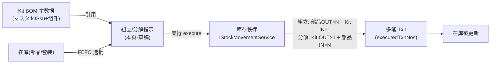
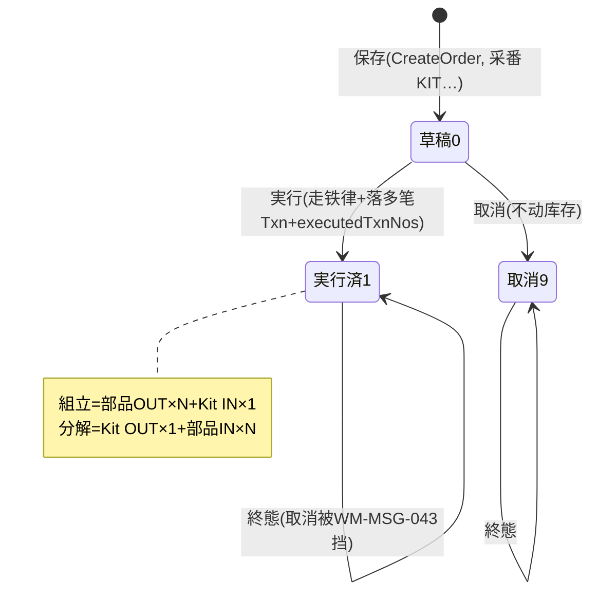

# キット（套件 組立 / 分解）单页面操作 SOP（手把手版）

> **用途**：给**仓管/套件作业担当操作、培训老师讲、测试人员拆用例**。比模块总册（`03-库存物流WMS` §5.18）更细。
> **页面**：キット（WM140 · 库存物流 WMS）　**路由**：`/wms/kit`　**前端**：`views/wms/KitView.vue`　**API**：`api/wms/kitting.ts kittingApi`　**后端**：`Wms/KittingController` → `KittingService`（マスタ CRUD + `CreateOrderAsync` / `ExecuteAsync` / `CancelAsync`）
> **基准**：分支 `feat/wfs-inbox-core`，2026-06-29；后端逐行手册 `docs/codemap-wms/05-紙器特化.md` §5（2026-06-22 权威），UI 经实读 `KitView.vue` / `kitting.ts` / `types/wms/wms.ts`。
> **样例数据**：Kit SKU `KIT2026070001`（套装品）、组件 `PRD2026070001`（部品，BOM 1 行）、倉庫 `W01`、Kit 库位 `W01-FG`、数量 100、套件批 `KITLOT2026070001`（分解时填已有套件批）。

---

## 1. 页面一句话说明

**キット 页面就是"把多个部品按 BOM 装成 1 个套装 SKU、或反向把套装拆回部品"的作业台——先在『マスタ管理』维护 Kit BOM 主数据（一个 kitSku 配 1~N 个组件），再在『組立指示』下一张組立(ASSEMBLE)或分解(DISASSEMBLE)指示并『実行』。** 一旦実行，系统**真正经库存铁律 `IStockMovementService`** 生成多笔 IN/OUT 流水：組立=部品 OUT×N + Kit 品 IN×1；分解=Kit 品 OUT×1 + 部品 IN×N。它是套件这类组合品"账实同步"的唯一入口。

---

## 2. 这个页面在业务流程中的位置

- **上游**：Kit BOM 主数据（必须先建、且至少 1 个组件）；以及部品/套装的现有在库。
- **本页**：先维护主数据，再下指示并実行。
- **下游**：実行后落多笔库存流水（与一般入出库共用 `StockTransaction`），可在库存查询/流水查询看到 IN/OUT；套装 SKU 自身也变成可再出库/再分解的在库。

---

## 3. 谁使用这个页面

| 角色 | 用途 |
|---|---|
| 套件作业担当（仓管/现场） | 下組立/分解指示、実行、核对生成的流水 |
| 主数据维护人员 | 维护 Kit BOM（kitSku + 组件清单 + 默认仓） |
| 班组长/主管 | 取消未実行的草稿指示、核对账实 |

---

## 4. 操作前准备

- [ ] 目标 **Kit BOM 主数据已建**，且 `activeFlg=ON`（指示页下拉只列启用的主数据），至少 1 个组件行。
- [ ] **組立**前：各组件部品在该倉庫有足量在库（`AvailableQty ≥ requiredQty × qty`、自社持有、未召回）。⚠️ 前端**不预检**，缺料要等実行时后端拦。
- [ ] **分解**前：要拆的套装批（`kitLotNo`，如 `KITLOT2026070001`）在 Kit 库位有足量在库，且这个批号**必须手填**（前端只 placeholder 提示，不强校验）。
- [ ] 清楚倉庫CD（`W01`）、Kit 库位CD（`W01-FG`）、数量。

---

## 5. 页面区域说明

整页是**双 Tab**：`マスタ管理` 与 `組立指示`，各 Tab 内部又分**列表态(list)**与**明细态(detail)**。

| 区域 | 内容 |
|---|---|
| マスタ管理·列表 | 搜索卡：kitSku 关键字 + 「検索」「新規」；表格列：kitSku / kitName / 既定倉庫 / 有効(ON/OFF tag) / 操作(開く·削除) |
| マスタ管理·明细 | 上卡=主数据表单(kitSku〔新規时可改,既存灰〕/ kitName / 既定倉庫 / 有効开关 / 備考)；下卡=BOM 构成表(行号 / 構成部品CD / 部品名 / 必要数 / 単位 / 削除)+「行追加」；底部吸附条「戻る」「保存」 |
| 組立指示·列表 | 搜索卡：指示NO / kitSku / 方向(ASSEMBLE·DISASSEMBLE) / 状態(草稿·実行済·取消) + 「検索」「新規」；表格列：指示NO / 方向 tag / 状態 tag / kitSku / kitName / 数量 / 倉庫 / Kit 库位 / 套件批 / 実行日時 / 操作(開く) |
| 組立指示·明细 | 表单(kitSku 下拉〔仅 active〕/ 方向 / 数量 / 倉庫 / Kit 库位 / 套件批〔placeholder 随方向变〕/ 備考)；実行済后显示 `executedTxnNos` 成功条(含笔数)；底部吸附条「戻る」「保存(新規时)」「実行(草稿时)」「取消(草稿时)」 |

> 明细态字段在**保存后全部变灰只读**（`:disabled="!isNewOrder"`）——指示一旦存盘，内容锁死，只能実行或取消。

---

## 6. 字段填写说明（口语版）

**マスタ管理·主数据**：

| 字段 | 怎么填 | 填错影响 |
|---|---|---|
| kitSku（套装SKU） | 必填，新規时可输（如 `KIT2026070001`），既存编辑时灰掉不可改 | 空→前端 `必須` 提示；后端重复→`WM-MSG-001` |
| kitName（套装名） | 必填 | 空→前端 `必須` 提示 |
| 既定倉庫（defaultWarehouseCd） | 可空，仅备查 | — |
| 有効(activeFlg) | 开关；OFF 后指示页下拉不再列出 | OFF 误关→下不了新指示 |
| BOM 行·構成部品CD | 必填（如 `PRD2026070001`） | 空/必要数≤0→`WM-MSG-021`（保存时后端校验） |
| BOM 行·必要数(requiredQty) | >0，1 套装消耗多少部品（精度 4 位） | ≤0→`WM-MSG-021` |
| BOM 行·単位/部品名/備考 | 可空 | — |

> ⚠️ **保存必须 ≥1 BOM 行**：前端 `components.length===0` 直接 `wms.inbound.msg.noDetail` 警告挡下；后端 `WM-MSG-020`。

**組立指示·表单**（保存后全灰）：

| 字段 | 怎么填 | 填错影响 |
|---|---|---|
| kitSku | 下拉选 active 主数据（可搜） | 空→前端 `必須` |
| 方向(direction) | ASSEMBLE(組立·绿) / DISASSEMBLE(分解·橙)，**新規后不可改** | — |
| 数量(qty) | >0（如 100）；精度 2 位 | ≤0→前端 `必須`；后端 `WM-MSG-021` |
| 倉庫(warehouseCd) | 必填（如 `W01`） | 空→前端 `必須` |
| Kit 库位(kitLocationCd) | 必填，套装入/出的库位（如 `W01-FG`） | 空→前端 `必須` |
| 套件批(kitLotNo) | **組立**：留空则実行时自动采番 `KIT{日期}-{指示NO尾4}`；**分解**：必填已有套件批（如 `KITLOT2026070001`） | ⚠️ 分解漏填→前端**不挡**，実行时后端 `KitLotNo is required for DISASSEMBLE`（非 WM-MSG 码） |
| 備考(remarks) | 可空 | — |

---

## 7. 按钮操作说明

| 按钮 | 何时出现 | 点了会怎样 |
|---|---|---|
| 検索（マスタ/指示） | 列表态常显 | 按条件刷新表格 |
| 新規（マスタ） | 列表态 | 进主数据明细（空表单，kitSku 可输，BOM 空） |
| 行追加 / 削除（BOM） | 主数据明细 | 增/删一行 BOM；删后行号自动重排 |
| 保存（マスタ） | 主数据明细 | 校验 kitSku/kitName/≥1 行→新建或全量替换组件→回列表 |
| 削除（マスタ列表） | 每行 | 确认后软删；**有未取消的指示→`WM-MSG-043` 删不掉** |
| 新規（指示） | 列表态 | 进指示明细（空表单，默认 ASSEMBLE，status0） |
| 保存（指示·新規） | 明细且 isNewOrder | 校验 kitSku/倉庫/库位/qty>0→采番 `KIT…`→toast 带指示NO→重新载入(字段转灰) |
| 実行(execute) | 明细且 `canExecute`(已存盘且 status=0) | 确认框→走铁律生成多笔流水→status→1 実行済→显示 `executedTxnNos` |
| 取消(cancel) | 明细且 `canCancelOrder`(已存盘且 status=0) | 确认框→status→9 取消；**実行済不可取消**(`WM-MSG-043`) |
| 開く（列表→明细） | 每行 | 载入该指示明细 |
| 戻る | 明细 | 回列表态 |

> 実行済(1)/取消(9)的指示：明细底部只剩「戻る」，无保存/実行/取消按钮（草稿态独占可写动作）。

---

## 8. 标准业务操作 SOP（照着点）

### 场景一：维护 Kit BOM 主数据（前置主流程）
- **背景**：第一次为某套装建 BOM。
- **样例数据**：kitSku `KIT2026070001`、kitName `紙箱A セット`、组件 `PRD2026070001`×必要数 1。
- **步骤**：1) マスタ管理 Tab→「新規」；2) 填 kitSku/kitName，有効=ON；3) BOM「行追加」→填 `PRD2026070001` 必要数 1；4) 「保存」。
- **完成后检查**：列表出现该 kitSku、有効 ON；编辑再打开时 kitSku 灰掉。
- **异常**：BOM 0 行→`noDetail` 警告；kitSku 重复→`WM-MSG-001`；部品CD 空/必要数≤0→`WM-MSG-021`。
- **用例**：TC-M06-KIT-001~005、023。

### 场景二：組立指示并実行（核心·走铁律）
- **背景**：把 100 套部品装成 100 个套装 SKU。
- **样例数据**：kitSku `KIT2026070001`、方向 ASSEMBLE、qty 100、倉庫 `W01`、Kit 库位 `W01-FG`、套件批留空。
- **前置**：`PRD2026070001` 在 `W01` 有 ≥100（×必要数）可用在库。
- **步骤**：1) 組立指示 Tab→「新規」；2) 下拉选 `KIT2026070001`，方向 ASSEMBLE，qty 100，倉庫 `W01`，库位 `W01-FG`，套件批留空；3) 「保存」（拿到 `KIT…` 指示NO，字段转灰）；4) 「実行」→确认。
- **完成后检查**：status→1 実行済；`executedTxnNos` 成功条显示 2 笔（部品 1 行→OUT 1 笔 + Kit IN 1 笔）；部品在库 -100、套装 `KIT2026070001` 批 `KIT{日期}-{尾4}` 在库 +100。
- **异常**：部品不足→`InsufficientStockException`（実行失败，状态留草稿）。
- **用例**：TC-M06-KIT-006~010、015、016。

### 场景三：分解指示并実行（反向退料）
- **背景**：把已组好的 1 个套装批拆回部品。
- **样例数据**：kitSku `KIT2026070001`、方向 DISASSEMBLE、qty 100、倉庫 `W01`、Kit 库位 `W01-FG`、套件批 `KITLOT2026070001`（已有套装在库批）。
- **前置**：`KIT2026070001` 在 `W01-FG` 批 `KITLOT2026070001` 有 ≥100 在库。
- **步骤**：1) 「新規」→选 kitSku，方向 DISASSEMBLE，qty 100，倉庫/库位，**套件批必填 `KITLOT2026070001`**；2) 「保存」；3) 「実行」→确认。
- **完成后检查**：套装批 OUT 100；每个部品按 `DKIT{日期}-{指示NO尾4}-{行号2位}` 新批 IN（如 `DKIT20260701-0001-01`）；`executedTxnNos` 笔数=1(Kit OUT)+组件数。
- **异常**：套件批漏填→実行时 `KitLotNo is required for DISASSEMBLE`（前端不预挡）；套装批在库不足→`InsufficientStockException`。
- **用例**：TC-M06-KIT-011、012、017、018。

### 场景四：取消未実行的草稿指示
- **背景**：填错了想作废一张还没実行的指示。
- **步骤**：打开 status=0 的指示→底部「取消」→确认。
- **检查**：status→9 取消；列表状态 tag 变红；不动任何库存。
- **异常**：已実行(1)的指示点不到取消，强行调端点→`WM-MSG-043`（実行済は取消不可，需反向指示对冲）。
- **用例**：TC-M06-KIT-013、019。

### 场景五：缺料/批号缺失实行被拦（异常链）
- **背景**：组件库存不够、或分解漏填套件批。
- **步骤**：A) 組立 qty 远超在库→「実行」；B) 分解套件批留空→「実行」。
- **检查**：A→`InsufficientStockException`，状态仍草稿、零流水；B→`KitLotNo is required for DISASSEMBLE`，零流水。修正(补料/填批)后可再実行。
- **用例**：TC-M06-KIT-015、017、020。

### 场景六：主数据被引用无法删除
- **背景**：想删一个已经下过指示的 Kit BOM。
- **步骤**：マスタ列表→对有未取消指示的 kitSku 点「削除」→确认。
- **检查**：`WM-MSG-043`（関連する指示が存在するため削除不可）；先把相关指示全取消，或保留主数据。
- **用例**：TC-M06-KIT-024、025。

### 场景七：実行済流水核对
- **背景**：确认実行后账实一致。
- **步骤**：打开実行済指示→读 `executedTxnNos`→去库存流水查询按这些 Txn 号核对。
- **检查**：組立=N 笔 OUT(部品)+1 笔 IN(套装)；分解=1 笔 OUT(套装)+N 笔 IN(部品)；方向/数量/库位一致。
- **用例**：TC-M06-KIT-021、022。

---

## 9. 状态变化说明

- **0 草稿**：可保存(仅新規一次)、可実行、可取消。
- **1 実行済**：終態，库存已动，不可取消（要回滚只能下反方向指示对冲）。
- **9 取消**：終態，从未动库存。

---

## 10. 按钮不可用 / 灰色原因

| 现象 | 原因 |
|---|---|
| 指示明细字段全灰 | 已保存(`!isNewOrder`)——指示存盘后内容锁死 |
| 无「実行」「取消」 | status≠0（已実行/已取消），或还没保存拿到指示NO |
| 无「保存」 | 已是既存指示（仅新規态显示保存） |
| kitSku 输入灰（マスタ） | 既存主数据编辑——kitSku 是主键不可改 |
| マスタ「削除」失败 | 存在未取消的关联指示（`WM-MSG-043`） |
| 指示下拉选不到某 kitSku | 该主数据 `activeFlg=OFF`（仅 active 进下拉） |
| 找不到"改/删指示"入口 | 指示无更新/删除端点；草稿只能取消，実行済只能反向对冲 |

---

## 11. 常见错误与处理

| 错误 | 原因 | 处理 |
|---|---|---|
| `WM-MSG-001` | kitSku 已存在 | 换 kitSku 或编辑既存 |
| `WM-MSG-020` | BOM 0 行（构成部品マスタ空） | 至少加 1 行 BOM |
| `WM-MSG-021` | 部品CD 空 / 必要数≤0 / 指示 qty≤0 | 补部品CD、必要数>0、数量>0 |
| `WM-MSG-043`（删主数据） | 有未取消的关联指示 | 先取消相关指示 |
| `WM-MSG-043`（実行） | 指示非草稿（重复実行） | 刷新看状态，已実行勿再点 |
| `WM-MSG-043`（取消） | 実行済不可取消 | 下反方向指示对冲库存 |
| `WM-MSG-070` | 指示/主数据不存在 | 核对 NO/kitSku |
| `InsufficientStockException` | 某部品(組立)或套装批(分解)在库不足 | 先补料/确认批号在库，再実行 |
| `KitLotNo is required for DISASSEMBLE` | 分解漏填套件批（前端不预挡） | 填已有套件批后再実行 |
| 保存提示 `noDetail` | BOM 0 行 | 加 BOM 行 |

> ⚠️ 注意：`InsufficientStockException` 与 `KitLotNo is required…` 是**后端运行期异常**，前端不预检——属已知盲点，培训时要强调"実行前自己确认料/批"。

---

## 12. 操作完成后的检查清单

- [ ] 主数据：列表可见、有効正确、kitSku+LineNo 唯一（UK），编辑时 kitSku 灰。
- [ ] 指示保存：拿到 `KIT…` 指示NO，toast 成功，字段转灰，状态=0 草稿。
- [ ] 実行（組立）：status=1；部品按 FEFO（ExpiryDate→ReceiveDate）单批 OUT×N；套装 IN×1，套件批=填值或自动 `KIT{日期}-{尾4}`；`executedTxnNos` 笔数=组件数+1。
- [ ] 実行（分解）：status=1；套装 OUT×1；部品各按新批 `DKIT{日期}-{尾4}-{行号}` IN×N；`executedTxnNos` 笔数=1+组件数。
- [ ] 取消：status=9，库存零变化。
- [ ] 所有 IN/OUT 都经 `IStockMovementService`（满足库存铁律），可在库存流水查询核对。

---

## 13. 页面级测试用例（≥25 条，可执行）

> 编号 `TC-M06-KIT-xxx`；数据用样例（kitSku `KIT2026070001`、组件 `PRD2026070001`、倉庫 `W01`、库位 `W01-FG`、qty 100、套件批 `KITLOT2026070001`）。

| 用例编号 | 用例名称 | 优先级 | 前置条件 | 测试数据 | 操作步骤 | 预期结果 | 下游检查 | 备注 |
|---|---|---|---|---|---|---|---|---|
| TC-M06-KIT-001 | 新建 Kit BOM 主数据 | P0 | マスタ Tab | kitSku/kitName+1 行 BOM | 新規→填→保存 | 列表新增、有効 ON | — | 主流程 |
| TC-M06-KIT-002 | 主数据 0 行 BOM 挡保存 | P0 | 新建主数据 | BOM 空 | 不加行→保存 | `noDetail` 警告，不落库 | — | 前端挡 |
| TC-M06-KIT-003 | kitSku 重复 | P0 | 已有同 kitSku | KIT2026070001 | 再建同 kitSku | `WM-MSG-001` | 不落库 | — |
| TC-M06-KIT-004 | 部品CD 空/必要数≤0 | P0 | 新建主数据 | 部品空 或 数量0 | 保存 | `WM-MSG-021` | 不落库 | 后端逐行校验 |
| TC-M06-KIT-005 | 编辑主数据 kitSku 灰 | P1 | 既存主数据 | — | 開く | kitSku 输入禁用 | — | 主键不可改 |
| TC-M06-KIT-006 | 組立指示保存 | P0 | active 主数据 | ASSEMBLE/qty100/W01/W01-FG | 新規→填→保存 | 采番 `KIT…`、字段转灰、status0 | — | — |
| TC-M06-KIT-007 | 指示 qty≤0 | P0 | 新建指示 | qty 0 | 保存 | 前端 `必須`/后端 `WM-MSG-021` | 不落库 | — |
| TC-M06-KIT-008 | 倉庫/库位空 | P0 | 新建指示 | 倉庫空 | 保存 | 前端 `必須` | 不落库 | — |
| TC-M06-KIT-009 | kitSku 下拉仅 active | P1 | 有 OFF 主数据 | — | 看下拉 | OFF 主数据不在列表 | — | — |
| TC-M06-KIT-010 | 組立実行走铁律 | P0 | 部品足量 | qty100 | 保存→実行 | status1+部品OUT×N+Kit IN×1 | 库存流水/在库变化 | **核心** |
| TC-M06-KIT-011 | 分解指示保存 | P0 | 套装在库 | DISASSEMBLE+套件批 | 新規→填批→保存 | 采番、字段转灰 | — | — |
| TC-M06-KIT-012 | 分解実行走铁律 | P0 | 套装批足量 | KITLOT2026070001 | 実行 | Kit OUT×1+部品新批 IN×N | 部品批 `DKIT…-行号` | 反向 |
| TC-M06-KIT-013 | 取消草稿指示 | P0 | status0 | — | 取消→确认 | status9、零库存变化 | — | — |
| TC-M06-KIT-014 | 方向 tag 颜色 | P2 | 列表有两向 | — | 看 tag | ASSEMBLE 绿/DISASSEMBLE 橙 | — | UI |
| TC-M06-KIT-015 | 組立缺料拦截 | P0 | 部品不足 | qty 远超在库 | 実行 | `InsufficientStockException`、状态留草稿 | 零流水 | 盲点·后端拦 |
| TC-M06-KIT-016 | 組立自动采套件批 | P1 | 套件批留空 | ASSEMBLE | 実行 | 批=`KIT{日期}-{尾4}` | 套装 IN 批 | 自动采番 |
| TC-M06-KIT-017 | 分解漏填套件批 | P1 | DISASSEMBLE | 套件批空 | 保存→実行 | `KitLotNo is required…`（前端不预挡） | 零流水 | 盲点 |
| TC-M06-KIT-018 | 部品新批命名规则 | P2 | 分解実行后 | — | 查部品在库 | `DKIT{日期}-{尾4}-{行号2位}` | 库存批 | 防混 |
| TC-M06-KIT-019 | 実行済不可取消 | P1 | status1 | — | 调 cancel 端点 | `WM-MSG-043` | 不变 | 終態 |
| TC-M06-KIT-020 | 実行后字段全灰 | P2 | status0 已存盘 | — | 看明细 | 表单只读、只剩戻る | — | UI |
| TC-M06-KIT-021 | executedTxnNos 回显 | P1 | 実行済 | — | 看成功条 | 笔数与方向匹配、Txn 串 `;` 分隔 | 流水核对 | — |
| TC-M06-KIT-022 | FEFO 选批 | P1 | 多批部品 | 不同 ExpiryDate | 組立実行 | 取最早 Expiry→最早 ReceiveDate 单批 | 该批 OUT | 铁律选批 |
| TC-M06-KIT-023 | BOM 行删后重排号 | P2 | 多行 BOM | — | 删中间行 | 行号自动 1..N 连续 | — | UI |
| TC-M06-KIT-024 | 主数据被引用禁删 | P1 | 有未取消指示 | — | 削除 | `WM-MSG-043` | 不删 | 守卫 |
| TC-M06-KIT-025 | 取消全部指示后可删主数据 | P2 | 指示全取消 | — | 削除 | 软删成功 | 列表消失 | — |
| TC-M06-KIT-026 | 指示列表检索 | P1 | 有指示 | NO/kitSku/方向/状態 | 検索 | 按条件命中 | — | 列表 |
| TC-M06-KIT-027 | 状態 tag 颜色 | P2 | 三态指示 | — | 看 tag | 草稿 info/実行済 success/取消 danger | — | UI |
| TC-M06-KIT-028 | 召回/他社在库不被选 | P2 | RecallFlag/非 Self | — | 組立実行 | 跳过召回·他社批，按需选 Self 单批 | — | 选批条件 |
| TC-M06-KIT-029 | 权限不足 | P2 | 无权账号 | — | 进页/実行 | 待业务确认(隐藏/拒绝) | — | 权限 |
| TC-M06-KIT-030 | 网络异常 | P2 | 断网 | — | 保存/実行 | 友好错误可重试 | — | — |

---

## 14. 培训讲解建议

| 顺序 | 讲什么 | 演示 | 易误解点 |
|---|---|---|---|
| 1 | 这页是"装套件/拆套件"的作业台 | §2 流程图 | 以为只是个登记表（其实真动库存） |
| 2 | 先建 BOM 主数据，再下指示 | マスタ→指示两 Tab | 不建主数据/下拉空 |
| 3 | 組立=部品 OUT×N + Kit IN×1 | 場景二实操 | 以为只 IN 不扣部品 |
| 4 | 分解=反向，部品新采 lot 防混 | 場景三实操 | 套件批漏填→実行才报错 |
| 5 | 実行前自己确认料/批 | 演示缺料拦截 | 以为前端会预检 |
| 6 | 草稿可取消，実行済只能反向对冲 | 場景四 | 想"撤销"已実行 |
| 7 | 全程经库存铁律 | 看 executedTxnNos | 以为绕开了正常库存账 |

---

## 15. 与模块级手册的关系

对应 `03-库存物流WMS-...md` §5.18（物流优化作业类·キット WM140 行）。模块测试矩阵中 `M06-020`（キット execute 走铁律）、可执行用例 `TC-M06-013`（キット組立走铁律）、验收 `AC-M06-11`（紙器特化解耦：Kit/CrossDock 走铁律）。逐行源码见 `docs/codemap-wms/05-紙器特化.md` §5。

---

## 16. 代码与文档来源

| 层 | 文件 |
|---|---|
| 逐行源码手册 | `docs/codemap-wms/05-紙器特化.md` §5（权威，2026-06-22 实测） |
| 前端 | `cp6.web/src/views/wms/KitView.vue`（双 Tab/list·detail） |
| API/类型 | `cp6.web/src/api/wms/kitting.ts`（kittingApi）、`cp6.web/src/types/wms/wms.ts`（KitMaster/KitMasterComponent/KitOrder/KitOrderSearchQuery） |
| 后端 | `CP6/Controllers/Wms/KittingController.cs`、`CP6.Core/Services/Wms/KittingService.cs`（マスタ CRUD + CreateOrder/Execute/Cancel） |
| 铁律 | `IStockMovementService.ApplyAsync`（ASSEMBLE: 部品 OUT×N + Kit IN×1；DISASSEMBLE: Kit OUT×1 + 部品 IN×N） |
| 实体 | `DomainModels/Wms/KitMaster.cs`、`KitMasterComponent.cs`（UK KitSku+LineNo）、`KitOrder.cs`（Direction/KitLotNo/ExecutedTxnNos/Status） |
| 采番 | `WmsSequenceService.NextAsync("KIT")`；自动套件批 `KIT{yyyyMMdd}-{尾4}`；分解部品批 `DKIT{yyyyMMdd}-{尾4}-{行号2位}` |

---

## 最后更新来源

- 代码：见 §16（codemap-wms 05 §5 + KitView.vue 实读 + kitting.ts/types 枚举 + KittingService.cs 逐行）。
- 基准：分支 `feat/wfs-inbox-core`，2026-06-29（codemap 2026-06-22）。
- 覆盖：16 节 / 7 场景 / 30 用例（TC-M06-KIT-001~030）。
- 诚实标注：①前端不预检组件库存（缺料后端 `InsufficientStockException` 拦）；②分解 kitLotNo "必填"仅 placeholder 提示，前端未强校验（实行期后端抛 `KitLotNo is required for DISASSEMBLE`，非 WM-MSG 码）；③Mix/Slotting 等部分校验用本地中日文 message——本页指示/主数据用 `WM-MSG-001/020/021/043/070` 结构化码。
