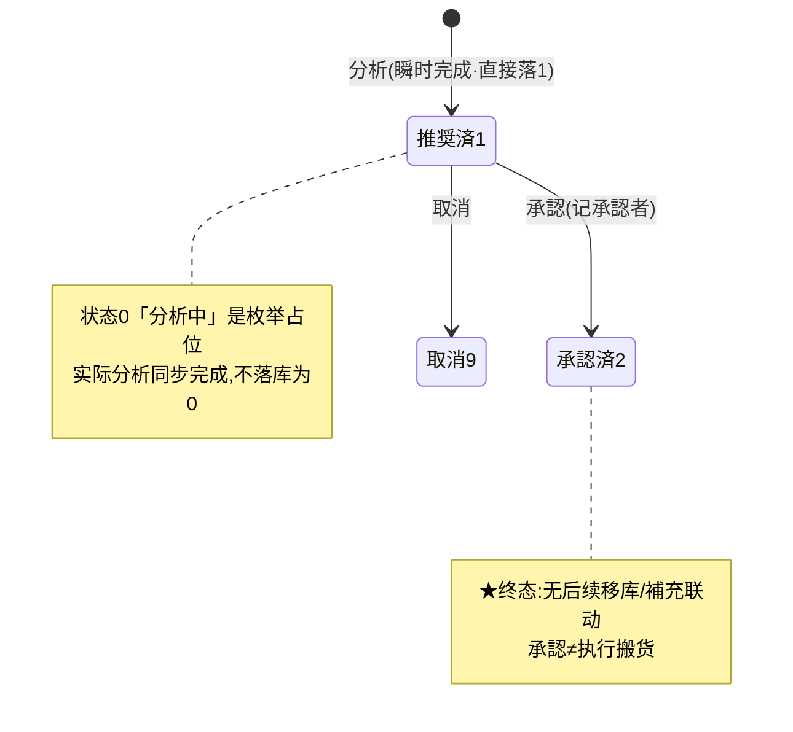

# スロッティング（ABC 仓位优化）单页面操作 SOP（手把手版）

> **用途**：给**仓储优化主管操作、培训老师讲、测试人员拆用例**。比模块总册（`03-库存物流WMS` §5.18）更细。
> **页面**：スロッティング（WM110 · 库存物流 WMS）　**路由**：`/wms/slotting`（页内 `mode` 切 list/detail，无独立详情路由）　**前端**：`views/wms/SlottingView.vue`　**API**：`api/wms/logistics.ts slottingApi`　**后端**：`Wms/SlottingController` → `SlottingService`（`AnalyzeAsync`/`ApproveAsync`/`CancelAsync`）
> **基准**：分支 `feat/wfs-inbox-core`，2026-06-29；后端实测 `docs/codemap-wms/05-紙器特化.md` §6（2026-06-22 权威）+ `SlottingService.cs` 逐行核对，UI 经实读 view。
> **样例数据**：计划 `SLP2026070001`、倉庫 `W01`、製品 `PRD2026070001`、分析天数 `90`。

---

## 1. 页面一句话说明

**スロッティング，就是仓储主管"按近 N 日出库频次给製品排 ABC、自动推荐高频 A 品该挪到靠出口拣货位"的地方——点一次「分析」立刻生成一份带推荐明细的计划（纯建议，不动一分实库存、没有库存流水），主管看完觉得合理就「承認」，不合理就「取消」。** 它只产出"该怎么摆"的建议清单，落地搬货要人工另去补充/移库页面做。

---

## 2. 这个页面在业务流程中的位置

- **上游**：历史**库存流水**里的 OUT（出库）记录——分析只看 OUT 频次，不看 IN。
- **本页**：跑 ABC、出推荐、主管承認/取消。
- **下游（★关键盲点）**：承認**只是把状态置为"承認済"，系统不会自动生成移库单/補充任务**——建议归建议，真要把高频 A 品挪到 `PIK-A-*` 库位，得人工去 5.18 補充页/RF 移动页另做。

---

## 3. 谁使用这个页面

| 角色 | 用途 |
|---|---|
| 仓储优化主管 | 定期跑 ABC 分析、审阅推荐、承認/取消计划 |
| 仓库管理员 | 看承認済计划的明细，据此到別页手工执行移库 |
| 仓储改善/IE 人员 | 用 outCount/outQty 数据评估动线改善效果 |

---

## 4. 操作前准备

- [ ] 目标倉庫CD（如 `W01`）准备好——**分析时必填**。
- [ ] 该倉庫近 N 日确有出库流水；若期间内零 OUT，分析仍会生成计划但推荐明细为空（`sampleCount=0`）。
- [ ] 想好分析天数（默认 90，范围 1~365）——天数越大覆盖越全但越"平均"，旺季可缩短到 30 看近期热度。
- [ ] 清楚 ABC 推荐**只是建议**：承認后不会自动搬货，需自行安排移库执行。

---

## 5. 页面区域说明

页面只有一个路由 `/wms/slotting`，内部用 `mode` 在两种视图间切换：

| 模式/区域 | 内容 |
|---|---|
| **列表模式（list）·检索卡** | 倉庫CD 输入框 + 状态下拉（分析中/推奨済/承認済/取消）+「検索」按钮 +「分析」按钮（开对话框） |
| **列表模式·计划表** | 每行：计划NO / 状态 tag / 倉庫 / 分析日数 / サンプル件数 / 推奨件数 / 分析日時 / 承認者 / 操作（開く） |
| **明细模式（detail）·头部卡** | 标题「スロッティング [SLP…]」+ 状态 tag；描述区：倉庫 / 分析日数 / サンプル件数 / 推奨件数 / 分析日時 / 承認者 |
| **明细模式·推荐明细卡** | 标题「推奨ロケーション」+ 黄色「要移動: N」tag；表格：行号 / ランクABC（着色 tag）/ 製品 / 出庫回数 / 出庫数量 / 現在ロケ / 推奨パターン / 要移動 |
| **明细模式·底部操作条** | el-affix 吸底：戻る / 承認（仅推奨済1显示）/ 取消（status≠承認済2 且 ≠取消9 时显示） |
| **分析对话框** | 500px：倉庫CD（required，maxlength 10）+ 分析日数（数字框 min1/max365）+ 蓝色提示 alert；底部 キャンセル / 分析 |

---

## 6. 字段填写说明（口语版）

**检索区（列表模式）**：

| 字段 | 怎么填 | 说明 |
|---|---|---|
| 倉庫CD（filterWh） | 选填，如 `W01` | 空=不限倉庫 |
| 状态（filterStatus） | 选填下拉 | 分析中0/推奨済1/承認済2/取消9；空=全部 |

**分析对话框（onAnalyze）**：

| 字段 | 怎么填 | 填错影响 |
|---|---|---|
| 倉庫CD（warehouseCd） | **必填**，如 `W01`，最长 10 字 | 前端空→ElMessage 警告"必填"，不发请求；后端空→`warehouseCd required`（本地 message，非 WM-MSG 码） |
| 分析日数（analysisDays） | 数字，默认 90，范围 1~365 | 后端兜底：传 ≤0 自动按 90 算 |

> 推荐明细表（製品/ランク/出庫回数/出庫数量/現在ロケ/推奨パターン/要移動）**全部系统算出，不可手填**——这页没有任何"录入推荐"的入口，只有分析→看→承認/取消。

---

## 7. 按钮操作说明

| 按钮 | 何时出现 | 点了会怎样 |
|---|---|---|
| 検索（search） | 列表模式常显 | 按倉庫CD+状态过滤，倒序取最近 200 条计划 |
| 分析（analyze） | 列表模式常显 | 开分析对话框 |
| 分析（对话框内确定） | 对话框内 | 跑 ABC → 生成计划（直接落「推奨済1」）→ 成功 toast `成功: SLP…` → 自动跳进该计划明细 |
| 開く（open） | 计划表每行 | 进明细模式，加载头部+推荐明细 |
| 戻る（back） | 明细模式 | 回列表模式 |
| 承認（approve） | 明细模式 **仅 status===1（推奨済）** | 二次确认 → 计划→承認済2、记承認者；状态非1 后端拦 `WM-MSG-043` |
| 取消（cancel） | 明细模式 **status≠2 且 ≠9 时** | 二次确认 → 计划→取消9（后端无状态守卫，仅不存在→`WM-MSG-070`） |

> 这页**没有「执行/移库/生成任务」按钮**——承認后没有任何后续落地动作（见 §2 盲点）。

---

## 8. 标准业务操作 SOP（照着点）

### 场景一：跑一次 ABC 分析（主流程）
- **背景**：主管想看 W01 仓近 90 天哪些製品出得最勤、该靠出口摆。
- **样例数据**：倉庫 `W01`、分析日数 `90`。
- **前置**：W01 近 90 天有 OUT 流水。
- **步骤**：1) 列表模式点「分析」；2) 倉庫CD 填 `W01`、分析日数保持 90；3) 点对话框「分析」。
- **完成后检查**：toast `成功: SLP2026070001`；自动进明细；状态=**推奨済1**（不是"分析中"，分析瞬时完成直接落推奨済）；サンプル件数=期间内 OUT 笔数合计；推荐明细按 出庫回数降序、同回数再按 出庫数量降序排。
- **拆用例**：TC-M06-SLOTTING-001、002、010。

### 场景二：读懂 ABC 分级与推荐库位
- **背景**：看明细里每个製品为什么被判 A/B/C、该挪哪。
- **样例数据**：製品 `PRD2026070001`。
- **步骤**：1) 進明细；2) 看「推奨ロケーション」表的 ランク 列（绿A/橙B/灰C）；3) 对照 推奨パターン（A→`PIK-A-*`、B→`PIK-B-*`、C→`RES-C-*`）与 現在ロケ。
- **检查**：累计出庫回数构成比 `≤0.80→A`、`≤0.95→B`、`其余→C`（帕累托 80/95）；現在ロケ取该製品在库**数量最大**的库位；現在ロケ前缀与推荐前缀不一致的行，「要移動」打黄 tag，头部「要移動: N」=这种行的条数。
- **拆用例**：TC-M06-SLOTTING-003、004、011、012、013。

### 场景三：承認推荐计划
- **背景**：主管认可这版推荐，正式承認。
- **前置**：计划状态=推奨済1。
- **步骤**：1) 進明细；2) 底部点「承認」；3) 弹确认框点确定。
- **检查**：状态→承認済2；承認者列填当前用户；底部「承認」「取消」按钮都消失（status=2 两者条件都不满足）。**★注意：承認不触发任何移库/補充任务，要搬货需人工另做。**
- **异常**：对非推奨済（如已承認/已取消）计划调承認→后端 `WM-MSG-043`。
- **拆用例**：TC-M06-SLOTTING-005、006、014。

### 场景四：取消推荐计划
- **背景**：这版分析数据不准（如赶上停产），主管弃用。
- **前置**：计划状态=推奨済1（承認済2 看不到取消按钮）。
- **步骤**：1) 進明细；2) 点「取消」；3) 确认。
- **检查**：状态→取消9；按钮按规则隐藏。
- **拆用例**：TC-M06-SLOTTING-007、015。

### 场景五：异常与边界
- **用例 5a 倉庫CD 空**：分析对话框不填倉庫CD 点分析→前端弹"必填"警告不发请求（TC-M06-SLOTTING-008）。
- **用例 5b 期间内零出库**：选个近 90 天没出库的倉庫→计划仍生成但 サンプル件数=0、推荐明细空（TC-M06-SLOTTING-016）。
- **用例 5c 分析日数边界**：日数填 1 / 365 正常；数字框限制不让填 0/366（TC-M06-SLOTTING-017、018）。
- **用例 5d 計划不存在**：对不存在的 planNo 承認/取消→`WM-MSG-070`（TC-M06-SLOTTING-019）。
- **用例 5e 全 A 极端**：仅一个製品有出库→累计构成比一开始就是 1.0，按 `≤0.80→A` 它落 A（单品恒为 A）（TC-M06-SLOTTING-020）。

### 场景六：承認后无落地联动（认知校验·★盲点）
- **背景**：让学员明确"承認≠搬货"。
- **步骤**：1) 承認一份要移動>0 的计划；2) 去看库存流水/补充单/移库任务。
- **检查**：**没有**任何新流水/補充单/移库任务被自动生成；实库存与库位**纹丝不动**；要落地必须人工到 5.18 補充页或 RF 移动页操作。
- **拆用例**：TC-M06-SLOTTING-021、022。

---

## 9. 状态变化说明

> 状态映射：0 分析中（占位，几乎不出现）/ 1 推奨済 / 2 承認済 / 9 取消。状态 tag 配色：0 info / 1 primary / 2 success / 9 danger。

---

## 10. 按钮不可用 / 灰色原因

| 现象 | 原因 |
|---|---|
| 明细底部无「承認」 | 计划状态≠推奨済1（仅 status===1 才显示承認） |
| 明细底部无「取消」 | 计划状态=承認済2 或 取消9（前端条件 `status≠2 且 ≠9`） |
| 承認済计划既无承認也无取消 | status=2 时两按钮条件都不满足（只剩「戻る」） |
| 分析点了没反应 | 倉庫CD 没填，前端弹"必填"警告未发请求 |
| 全页找不到"执行/搬货/生成任务" | **本就没有**——纯分析建议页，无 execute 端点、无库存流水 |
| 推荐明细列填不进去 | 全部系统算出，只读 |

---

## 11. 常见错误与处理

| 错误/现象 | 原因 | 处理 |
|---|---|---|
| 前端"必填"警告 | 倉庫CD 空 | 填倉庫CD 再分析 |
| `warehouseCd required`（后端本地 message） | 绕前端直接调 API 且倉庫空 | 带上 warehouseCd |
| `WM-MSG-043: 推奨完了以外は承認不可` | 对非推奨済1计划调承認 | 只承認推奨済计划 |
| `WM-MSG-070` | planNo 不存在（承認/取消时） | 核对计划NO |
| 推荐明细为空 | 期间内零 OUT 流水 | 换有出库的倉庫或加大分析日数 |
| 承認了仓库没动 | **设计如此**：承認不搬货 | 人工到補充/移库页执行 |
| 现在ロケ为空(—) | 该製品当前无在库 | 正常，无在库即无"当前库位" |

---

## 12. 操作完成后的检查清单

- [ ] 分析成功生成计划NO（`SLP…`）、toast `成功: SLP…`、自动进明细、状态=推奨済1。
- [ ] サンプル件数=期间内 OUT 笔数合计；推荐件数=明细行数；分析日時落库。
- [ ] ABC 分级符合帕累托：累计出庫回数构成比 ≤0.80=A / ≤0.95=B / 其余=C；A 绿/B 橙/C 灰着色正确。
- [ ] 推荐パターン：A→`PIK-A-*`、B→`PIK-B-*`、C→`RES-C-*`；現在ロケ前缀不符的行「要移動」打黄 tag，头部「要移動: N」计数正确。
- [ ] 承認：状态→承認済2、记承認者；**确认实库存/库位未变、无新流水、无移库/補充任务自动生成**（盲点）。
- [ ] 取消：状态→取消9；按钮按状态正确显隐。

---

## 13. 页面级测试用例（≥25 条，可执行）

> 编号 `TC-M06-SLOTTING-xxx`；数据用样例（W01 / PRD2026070001 / 90 天 / SLP2026070001）。

| 用例编号 | 用例名称 | 优先级 | 前置条件 | 测试数据 | 操作步骤 | 预期结果 | 下游检查 | 备注 |
|---|---|---|---|---|---|---|---|---|
| TC-M06-SLOTTING-001 | 分析生成计划 | P0 | W01 有 OUT 流水 | W01/90 | 分析→填倉庫→分析 | 生成 SLP…、toast 成功、自动进明细 | 计划落库状态1 | 核心 |
| TC-M06-SLOTTING-002 | 分析直接落推奨済 | P0 | 同上 | W01/90 | 分析后看状态 | 状态=推奨済1（非分析中0） | — | 同步完成 |
| TC-M06-SLOTTING-003 | ABC 帕累托分级 | P0 | 多製品出库 | W01/90 | 看 ランク 列 | ≤0.80=A/≤0.95=B/其余=C | — | 阈值核对 |
| TC-M06-SLOTTING-004 | 推荐パターン对应 | P0 | 有 A/B/C 各档 | — | 看 推奨パターン | A→PIK-A-*/B→PIK-B-*/C→RES-C-* | — | — |
| TC-M06-SLOTTING-005 | 承認推奨済计划 | P0 | 计划状态1 | SLP2026070001 | 承認→确认 | 状态→承認済2、记承認者 | 实库存不变 | 核心 |
| TC-M06-SLOTTING-006 | 非推奨済承認被拦 | P0 | 已承認/取消 | 状态2/9 | 调承認 | WM-MSG-043 | 状态不变 | — |
| TC-M06-SLOTTING-007 | 取消推奨済计划 | P1 | 状态1 | SLP… | 取消→确认 | 状态→取消9 | — | — |
| TC-M06-SLOTTING-008 | 倉庫CD 空前端拦 | P0 | — | 空倉庫 | 分析→直接确定 | 弹"必填"警告、不发请求 | 不生成计划 | — |
| TC-M06-SLOTTING-009 | 倉庫CD 空后端拦 | P1 | 绕前端 | 空倉庫 | 直接调 analyze API | warehouseCd required | 不落库 | 本地 message |
| TC-M06-SLOTTING-010 | サンプル件数=OUT笔数 | P1 | 已知 OUT 笔数 | W01/90 | 分析后看件数 | =期间内 OUT 笔数合计 | — | — |
| TC-M06-SLOTTING-011 | 排序按回数·数量 | P1 | 多製品 | — | 看明细顺序 | 出庫回数降序、同回数按数量降序 | — | — |
| TC-M06-SLOTTING-012 | 現在ロケ取最大在库 | P1 | 製品多库位 | PRD2026070001 | 看現在ロケ | =在库数量最大的库位 | — | PhysicalQty |
| TC-M06-SLOTTING-013 | 要移動标记正确 | P1 | 現ロケ前缀≠推荐 | — | 看 要移動 列+头部 | 不符行打黄 tag、头部计数=黄 tag 数 | — | needsRelocation |
| TC-M06-SLOTTING-014 | 承認后按钮隐藏 | P2 | 承認后 | 状态2 | 看底部 | 承認/取消都消失、仅戻る | — | — |
| TC-M06-SLOTTING-015 | 取消按钮显隐规则 | P2 | 状态2/9 | — | 看底部 | 状态2/9 不显示取消 | — | — |
| TC-M06-SLOTTING-016 | 零出库空明细 | P1 | 倉庫近90天无OUT | W99/90 | 分析 | 计划生成、件数0、明细空 | — | 边界 |
| TC-M06-SLOTTING-017 | 日数边界1/365 | P2 | — | 1 / 365 | 分析 | 正常生成 | — | — |
| TC-M06-SLOTTING-018 | 日数框限制 | P2 | — | 0/366 | 改数字框 | 框 min1/max365 不让越界 | — | el-input-number |
| TC-M06-SLOTTING-019 | 计划不存在承認/取消 | P1 | 错 planNo | SLP9999999999 | 调承認/取消 | WM-MSG-070 | — | — |
| TC-M06-SLOTTING-020 | 单品恒为 A | P2 | 仅1製品出库 | W01/90 | 分析 | 该品 ランク=A | — | 构成比1.0≤0.80? 见备注 |
| TC-M06-SLOTTING-021 | 承認无移库联动 | P1 | 要移動>0 已承認 | SLP… | 承認后查移库任务 | 无自动移库/補充任务 | 移库任务表空 | ★盲点 |
| TC-M06-SLOTTING-022 | 承認无库存流水 | P1 | 同上 | SLP… | 承認后查流水 | 无新增 StockTransaction | 实库存不变 | ★盲点 |
| TC-M06-SLOTTING-023 | 列表检索倉庫过滤 | P2 | 多倉庫计划 | filterWh=W01 | 検索 | 仅 W01 计划 | — | — |
| TC-M06-SLOTTING-024 | 列表检索状态过滤 | P2 | 多状态计划 | 状态=承認済2 | 検索 | 仅承認済 | — | — |
| TC-M06-SLOTTING-025 | 列表倒序取最近 | P2 | >200 计划 | — | 检索 | 按分析日時倒序取最近200 | — | — |
| TC-M06-SLOTTING-026 | 開く进明细 | P2 | 有计划 | SLP… | 点開く | 进明细模式、载头部+明细 | — | — |
| TC-M06-SLOTTING-027 | 戻る回列表 | P3 | 明细模式 | — | 点戻る | 回列表模式 | — | — |
| TC-M06-SLOTTING-028 | ABC 着色正确 | P3 | 有 ABC 行 | — | 看 ランク tag | A 绿/B 橙/C 灰 | — | rankTagOf |
| TC-M06-SLOTTING-029 | 跨模块借词条显示 | P3 | 任意明细 | — | 看承認者/承認/取消标签 | 借 stocktake/outbound 词条正常显示 | — | 现状 |
| TC-M06-SLOTTING-030 | 权限不足 | P2 | 无权账号 | — | 进页面/承認 | 待业务确认（隐藏/拒绝） | — | 权限 |

> TC-020 备注：单品出库时累计构成比从第一条即为 1.0，按 `ratio<=0.80→A` 判断 1.0 不 ≤0.80，逻辑上应落 C；但 totalCount 仅含该品时 cumulative 等于 totalCount，需以实测为准——若产品要求"出库最频品恒为 A"，属待业务确认的边界（建议测试时实跑确认，诚实标注）。

---

## 14. 培训讲解建议

| 顺序 | 讲什么 | 演示 | 易误解点 |
|---|---|---|---|
| 1 | 这页是"排 ABC、出搬货建议"的地方 | §2 流程图 | 以为它会自动搬货 |
| 2 | 分析=点一下立刻出推荐 | 分析→自动进明细 | 以为要等"分析中"很久 |
| 3 | ABC 怎么算的 | 帕累托 80/95 + 推荐パターン | 以为按金额/库存量分 |
| 4 | 要移動 tag 的含义 | 現ロケ vs 推荐前缀 | 以为黄 tag=系统已排移库 |
| 5 | 承認≠执行（★核心盲点） | 承認后看库存没动 | 以为承認就搬完了 |
| 6 | 落地要人工另做 | 指到 5.18 補充/RF 移动页 | 找不到"执行"按钮以为是 bug |

---

## 15. 与模块级手册的关系

对应 `03-库存物流WMS-最详细用户操作培训手册.md` §5.18「物流优化作业类」スロッティング行（WM110 /slotting）。该表已标注三大事实：①只分析建议**不搬货**（不走库存铁律）；②状态 0分析中→1推奨済→2承認済/9取消；③**承認后无生成移库/補充任务联动**（建议≠执行）+ 帕累托阈值 0.80/0.95 + 多处借 `wms.stocktake`/`wms.outbound` 词条。模块约束登记见 §C-M06-11（分析承認无后续落地联动，待产品确认是否补移库任务）、验收 §AC-M06-11（紙器特化解耦：Slotting 用独立专用表不走铁律）。

---

## 16. 代码与文档来源

| 层 | 文件 |
|---|---|
| 逐行源码手册 | `docs/codemap-wms/05-紙器特化.md` §6 Slotting（权威，2026-06-22） |
| 前端 | `cp6.web/src/views/wms/SlottingView.vue`（list/detail 双模式 + 分析对话框） |
| API/类型 | `api/wms/logistics.ts`(slottingApi: search/get/analyze/approve/cancel)、`types/wms/wms.ts`(SlottingPlan/SlottingRecommendation/SlottingPlanResult) |
| 后端 | `CP6.Core/Services/Wms/SlottingService.cs`(AnalyzeAsync 帕累托 ABC + ApproveAsync/CancelAsync)、`Controllers/Wms/SlottingController.cs` |
| 实体/常量 | `Entity/DomainModels/Wms/SlottingPlan.cs`、`WmsTxnType.cs`(SlottingStatus/AbcRank 常量、采番前缀 `SLP`) |
| 路由 | `cp6.web/src/router/index.ts`(`/wms/slotting`) |
| 模块总册 | `docs/manuals/user-training/03-库存物流WMS-最详细用户操作培训手册.md` §5.18 |

---

## 最后更新来源

- 代码：见 §16（codemap-wms 05 §6 + SlottingView.vue 实读 + SlottingService.cs 逐行 + types/api 核对）。
- 基准：分支 `feat/wfs-inbox-core`，2026-06-29（codemap 2026-06-22 权威）。
- 关键事实校验：分析瞬时落「推奨済1」（状态0为枚举占位）；ABC 帕累托 0.80/0.95、A→PIK-A-*/B→PIK-B-*/C→RES-C-*、現在ロケ取在库 PhysicalQty 最大库位、needsRelocation 按前缀不符；承認仅 status1→2 否则 `WM-MSG-043`，取消/不存在 `WM-MSG-070`；倉庫空后端 `warehouseCd required`（本地 message 非 WM-MSG）；**★承認后无移库/補充任务联动、无 execute、无库存流水**（设计如此）；ABC 着色 A 绿/B 橙/C 灰；多处借 `wms.stocktake.*`/`wms.outbound.*`/`wms.inbound.*` 词条。
- 覆盖：16 节 / 6 场景（含 5a~5e、6 拆用例）/ 30 用例（TC-M06-SLOTTING-001~030）。
