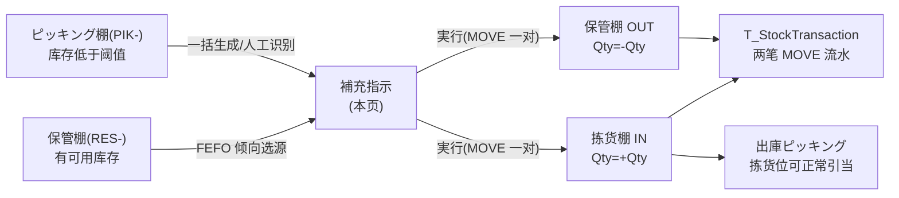
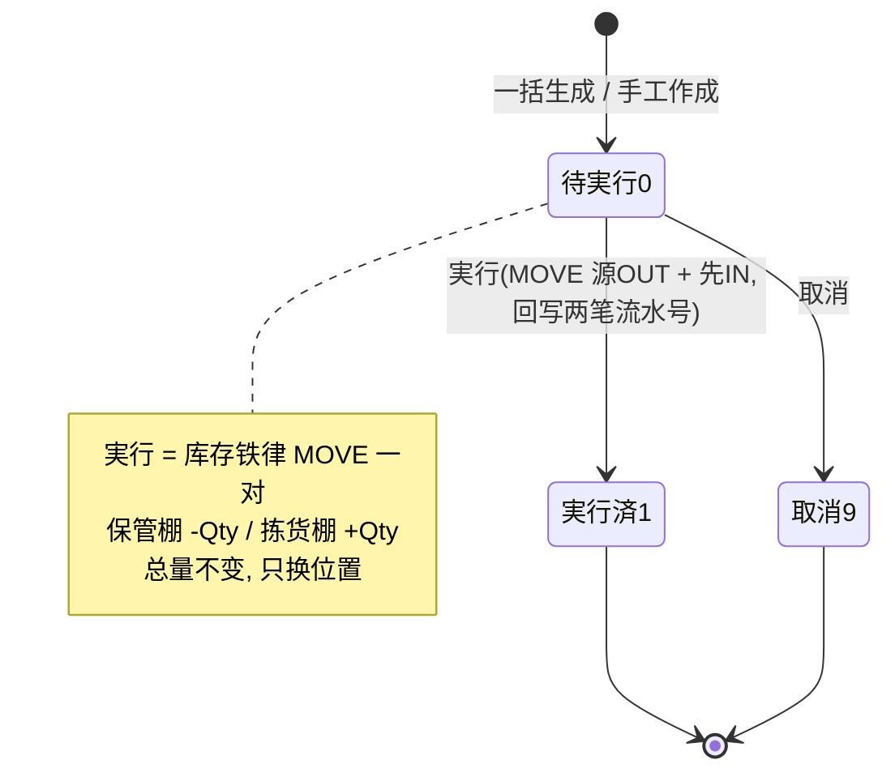

# 補充（库位补充）单页面操作 SOP（手把手版）

> **用途**：给**仓管/库内作业担当操作、培训老师讲、测试人员拆用例**。比模块总册（`03-库存物流WMS` §5.18）更细。
> **页面**：補充指示（MSBBWM120 · 库存物流 WMS）　**路由**：`/wms/replenish`　**前端**：`views/wms/ReplenishView.vue`　**API**：`api/wms/logistics.ts replenishApi`　**后端**：`Wms/ReplenishController` → `ReplenishService`（采番 `RPL`）
> **基准**：分支 `feat/wfs-inbox-core`，2026-06-29；后端实测 `docs/codemap-wms/04-棚卸-補充-期限-QC.md` §2（2026-06-22 权威），UI 经实读 view。
> **样例数据**：補充 `RPL2026070001`、製品 `PRD2026070001`、倉庫 `W01`、移動元（保管棚）`RES-C-01`、移動先（拣货棚）`PIK-A-01`、数量 `500`。

---

## 1. 页面一句话说明

**補充指示，就是仓管把"保管棚（`RES-`）"里的货搬一部分到"拣货棚（`PIK-`）"，让拣货位别空——可以一括自动生成、也可以手工建单；建好的单点「実行」时，系统走库存铁律发一对 MOVE 流水（保管棚先扣、拣货棚再加），并把两笔流水号回写到单据。** 它是"把货从库区补到拣货面"的唯一录入口，本身不增减库存总量，只是位置搬移。

---

## 2. 这个页面在业务流程中的位置

- **上游**：拣货棚（`PIK-`）库存低于补货阈值（minQty），且同品保管棚（`RES-`）有可用库存。
- **本页**：建補充指示（一括/手工）+ 実行（搬货）。
- **下游**：拣货棚被补足 → 出庫ピッキング能正常引当；生成两笔 MOVE 流水（源 OUT + 先 IN），库存**总量不变**只换位。

---

## 3. 谁使用这个页面

| 角色 | 用途 |
|---|---|
| 仓管 / 库内作业担当 | 一括生成补货单、手工建单、点実行搬货、取消误建单 |
| 班组长 / 库内主管 | 按阈值批量生成、核对拣货位补货进度 |

---

## 4. 操作前准备

- [ ] 清楚要补哪个倉庫（如 `W01`）、拣货棚命名是否以 `PIK-` 前缀、保管棚是否以 `RES-` 前缀（**前缀是一括生成识别"拣货位/保管位"的唯一依据**）。
- [ ] 一括生成前想好补货阈值 minQty（默认 10）：拣货棚 `PhysicalQty < minQty` 的才会被生成补货单。
- [ ] 手工建单要准备好：製品CD、倉庫CD、移動元（`RES-…`）、移動先（`PIK-…`）、数量（**必须 > 0**）。
- [ ] 知道補充源是**自有库存（OwnerType=Self）**、**未召回（!RecallFlag）**、**AvailableQty > 0** 才会被选中。

---

## 5. 页面区域说明

| 区域 | 内容 |
|---|---|
| 检索条 | 補充NO / 製品CD / 倉庫CD / 状态下拉；按钮：检索 / 作成（手工建）/ **補充指示一括生成** |
| 補充指示一覧表 | 每行：補充NO / 状态 tag / 優先度 tag / トリガ tag / 製品CD / 移動元 / 移動先 / Lot / 数量 / 実行日時 / 操作（実行·取消，仅 status0） |
| 一括生成对话框 | 500px；倉庫CD（必填）+ 補充閾值 minQty（input-number，min 1，默认 10）+ 说明提示 |
| 手工作成对话框 | 500px；優先度（至急/通常）/ 製品CD / 倉庫CD / 移動元（占位 `RES-A-01`）/ 移動先（占位 `PIK-A-01`）/ Lot / 数量（input-number，**min 0**） |

---

## 6. 字段填写说明（口语版）

**检索条**：補充NO（模糊）、製品CD（精确）、倉庫CD（精确）、状态（待実行/実行済/取消）。检索条**没有優先度/日期过滤**（后端支持 priority，UI 未放）。

**一括生成对话框**：

| 字段 | 怎么填 | 填错影响 |
|---|---|---|
| 倉庫CD | 必填，如 `W01` | 空→前端 toast「必須」(不发请求)；若绕过→后端 `warehouseCd required` |
| 補充閾值 minQty | 默认 10；拣货棚 `PhysicalQty < minQty` 才生成 | 填 ≤0（仅绕过前端 min=1 时）→后端回退默认 10 |

**手工作成对话框**：

| 字段 | 怎么填 | 填错影响 |
|---|---|---|
| 優先度 | 至急(1)/通常(2)，默认通常 | 不填默认通常(后端 0→2) |
| 製品CD | 必填，如 `PRD2026070001` | 空→`Required fields missing` |
| 倉庫CD | 必填，如 `W01` | 空→`Required fields missing` |
| 移動元（保管棚）| 必填，`RES-…`，如 `RES-C-01` | 空→`Required fields missing` |
| 移動先（拣货棚）| 必填，`PIK-…`，如 `PIK-A-01` | 空→`Required fields missing` |
| Lot | 可空 | 空存为 `""` |
| 数量 | **必须 > 0**，如 `500`（前端 min=0 不拦 0）| **填 0 或负→后端 `WM-MSG-021`** |

> ⚠️ 盲点：手工作成数量框 `min=0`，前端**允许输入 0**（设计上应是 min=1），靠后端 `WM-MSG-021` 兜底拦截。

---

## 7. 按钮操作说明

| 按钮 | 在哪 / 何时出现 | 点了会怎样 |
|---|---|---|
| 检索 | 检索条常显 | 按条件查補充指示列表 |
| 作成 | 检索条常显 | 弹手工建单对话框；保存成功 toast 含補充NO（`RPL…`），状态=待実行(0)、トリガ=MANUAL |
| 補充指示一括生成 | 检索条常显 | 弹一括生成对话框；填倉庫+阈值→生成 N 条（トリガ=BATCH），toast 含生成条数 |
| 実行 | 行内，**仅 status=0** | 确认后走库存铁律 MOVE 一对：保管棚 OUT(`-Qty`) + 拣货棚 IN(`+Qty`)，回写 OutTxnNo/InTxnNo，状态→実行済(1)、记実行日時 |
| 取消 | 行内，**仅 status=0** | 确认后状态→取消(9)（不动库存）；**实行済不可取消** |

> status=1（実行済）/9（取消）的行，操作列只显示「—」。実行/取消前都有 `ElMessageBox` 确认弹窗（取消单的确认文案借用 `wms.inbound.msg.cancelAsk`，属轻量 i18n 复用）。

---

## 8. 标准业务操作 SOP（照着点）

### 场景一：一括生成補充指示（主流程·按阈值批量）
- **背景**：早班开工前，把拣货面（`PIK-`）低于阈值的货一次性补足。
- **样例数据**：倉庫 `W01`、阈值 minQty `10`。
- **前置**：`W01` 下有 `PIK-` 拣货棚 `PhysicalQty<10`，且同品 `RES-` 保管棚 `AvailableQty>0`。
- **步骤**：1) 点「補充指示一括生成」；2) 填倉庫CD `W01`、補充閾值 `10`；3) 点「補充指示一括生成」按钮。
- **完成后检查**：toast 提示生成条数；列表新增若干 トリガ=BATCH（绿 tag）、優先度=通常、状态=待実行(0) 的单；每条 `数量=Min(阈值-拣货现量, 源可用量)`。
- **机制**：拣货棚取 `PIK-` 前缀 + `PhysicalQty<minQty` + Self + !RecallFlag；补充源取同品 `RES-` 前缀 + `AvailableQty>0`，按 `ExpiryDate ASC→ReceiveDate ASC`（FEFO 倾向）取一条。
- **异常**：倉庫空→toast「必須」；无源/已存在 Pending 单→该品跳过（不生成）。
- **用例**：TC-M06-REPLENISH-004~010。

### 场景二：手工建補充指示（临时单条补货）
- **背景**：现场发现某个拣货位快空了，临时手工开一张补货单。
- **样例数据**：製品 `PRD2026070001`、倉庫 `W01`、移動元 `RES-C-01`、移動先 `PIK-A-01`、数量 `500`、優先度 至急。
- **步骤**：1) 点「作成」；2) 选優先度=至急；3) 填製品/倉庫/移動元/移動先/数量；4) 点「保存」。
- **完成后检查**：toast 显示新補充NO（`RPL2026070001`）；列表新增 トリガ=MANUAL（灰 tag）、優先度=至急（红 tag）、状态=待実行(0) 的单。
- **异常**：必填（製品/倉庫/移動元/移動先）缺→`Required fields missing`；数量 ≤0→`WM-MSG-021`。
- **用例**：TC-M06-REPLENISH-011~015。

### 场景三：単条実行 → 库存铁律 MOVE 一对（★核心）
- **背景**：把待実行单据真正搬货。
- **样例数据**：補充 `RPL2026070001`（数量 500，元 `RES-C-01`→先 `PIK-A-01`）。
- **前置**：单据状态=待実行(0)，源 `RES-C-01` 可用量 ≥500。
- **步骤**：1) 在待実行行点「実行」；2) 确认弹窗点「确定」。
- **完成后检查**：① 保管棚 `RES-C-01` 发一笔 MOVE OUT（`Qty=-500`）、拣货棚 `PIK-A-01` 发一笔 MOVE IN（`Qty=+500`），`RelatedType="REPLENISH"`、`RelatedNo=RPL…`；② 单据回写 OutTxnNo/InTxnNo、状态→実行済(1)、记実行日時；③ 库存**总量不变**（净变化 0），只是位置从 RES 移到 PIK。
- **异常**：源库存不足→`InsufficientStockException`（控制器拦），单据仍待実行(0)。
- **用例**：TC-M06-REPLENISH-016、017、026、027。

### 场景四：取消误建補充指示
- **背景**：建错单或不需要了，在搬货前取消。
- **样例数据**：補充 `RPL2026070001`（待実行）。
- **步骤**：1) 待実行行点「取消」；2) 确认弹窗点「确定」。
- **完成后检查**：状态→取消(9)，不动库存；操作列变「—」。
- **异常**：実行済(1)单点取消→`WM-MSG-043`（实行済不可取消）。
- **用例**：TC-M06-REPLENISH-019、020、021。

### 场景五：実行失败——源库存不足
- **背景**：単据数量大于源保管棚实际可用量（如人工建单时填多了）。
- **样例数据**：補充 `RPL2026070001` 数量 500，但 `RES-C-01` 仅剩 300。
- **步骤**：点「実行」→确认。
- **完成后检查**：后端 MOVE OUT 触发 `InsufficientStockException`，控制器返回错误；**单据仍为待実行(0)**，无两笔流水产生。
- **盲点**：**没有专门的"失败重试"入口**——补足源库存或改数量后，只能在同一行**再次点「実行」**（无自动重试/批量重试）。
- **用例**：TC-M06-REPLENISH-017、029。

### 场景六：FEFO 倾向选源 + 去重 + 取小量（一括生成内部逻辑核对）
- **背景**：验证一括生成"挑哪个 RES 源、补多少、会不会重复建"。
- **步骤**：1) 同品有两个 `RES-` 源（一个近效期、一个远效期）；2) 已存在一张同品同拣货位的待実行单；3) 跑一括生成。
- **完成后检查**：① 选**近效期（ExpiryDate 小）**的源（FEFO 倾向）；② 已有 Pending 单的拣货位→**跳过不重复生成**；③ 当源可用量 < 需要量时，`数量=源可用量`（取小，部分补）。
- **用例**：TC-M06-REPLENISH-006、007、008、009。

---

## 9. 状态变化说明

- 状态值：`0 待実行(Pending) → 1 実行済(Executed) → 9 取消(Cancelled)`。
- **実行**只允许 status=0（否则 `WM-MSG-043`）；**取消**拒绝 status=1 実行済（否则 `WM-MSG-043`）。
- 实行済/取消均为终态，无回退入口。

---

## 10. 按钮不可用 / 灰色原因

| 现象 | 原因 |
|---|---|
| 行内无「実行」「取消」，只显示「—」 | 该单已**実行済(1)** 或**取消(9)**（仅 status=0 显示操作按钮） |
| 一括生成提示「必須」不发请求 | 倉庫CD 没填（前端 onGenerateBatch 校验） |
| 一括生成跑完一条都没生成 | 该倉庫无 `PIK-` 低于阈值的库存，或同品 `RES-` 无可用源，或都已有 Pending 单 |
| 手工建单保存被拦 | 製品/倉庫/移動元/移動先 缺一（`Required fields missing`）或数量 ≤0（`WM-MSG-021`） |
| 列表翻不了页 | **无分页控件**（一次取 pageSize=100，靠检索条件收窄） |

---

## 11. 常见错误与处理

| 错误 | 原因 | 处理 |
|---|---|---|
| `WM-MSG-021` | 手工作成数量 ≤0（前端 min=0 没拦） | 数量填 > 0（如 500） |
| `Required fields missing` | 製品/倉庫/移動元/移動先 有空 | 四个必填补齐，移動元用 `RES-…`、移動先用 `PIK-…` |
| `WM-MSG-043`（実行） | 対单据非待実行(0) 还点実行 | 只对待実行单実行；已処理单不可重复实行 |
| `WM-MSG-043`（取消） | 実行済(1)单点取消 | 実行済不可取消（已搬货）；如要回退需另开反向移库 |
| `WM-MSG-070` | 補充NO 不存在（get/实行/取消找不到单） | 核对補充NO |
| `InsufficientStockException` | 実行时源保管棚可用量 < 数量 | 补足源库存或改数量后**再点实行**（无自动重试入口） |
| 倉庫CD 空 toast「必須」 | 一括生成没填倉庫 | 填倉庫CD（如 `W01`）再生成 |

---

## 12. 操作完成后的检查清单

- [ ] 一括生成：toast 含生成条数；新单 トリガ=BATCH（绿）、優先度=通常、状态=待実行(0)；数量=`Min(阈值-拣货现量, 源可用量)`。
- [ ] 手工作成：toast 含补充NO（`RPL…`）；トリガ=MANUAL（灰）；状态=待実行(0)。
- [ ] 実行后：单据 OutTxnNo/InTxnNo 已回写、状态=実行済(1)、有実行日時；`T_StockTransaction` 出现**两笔 MOVE**（源 `-Qty` / 先 `+Qty`，`RelatedType=REPLENISH`）。
- [ ] 库存守恒：実行**不改库存总量**（净变化 0），仅 RES→PIK 换位；拣货棚 PhysicalQty 增加。
- [ ] 取消：状态=取消(9)、**不动库存**；実行済单不可取消（`WM-MSG-043`）。

---

## 13. 页面级测试用例（≥25 条，可执行）

> 编号 `TC-M06-REPLENISH-xxx`；数据用样例（補充 `RPL2026070001`、製品 `PRD2026070001`、倉庫 `W01`、元 `RES-C-01`、先 `PIK-A-01`、数量 500）。

| 用例编号 | 用例名称 | 优先级 | 前置条件 | 测试数据 | 操作步骤 | 预期结果 | 下游检查 | 备注 |
|---|---|---|---|---|---|---|---|---|
| TC-M06-REPLENISH-001 | 检索全部補充 | P1 | 有補充单 | 空条件 | 检索 | 列出補充单（按優先度→建立日序） | — | — |
| TC-M06-REPLENISH-002 | 按状态过滤待実行 | P1 | 有多状态 | 状态=待実行 | 检索 | 仅 status0 命中 | — | — |
| TC-M06-REPLENISH-003 | 按製品过滤 | P2 | 有補充单 | 製品=PRD2026070001 | 检索 | 仅该製品命中 | — | — |
| TC-M06-REPLENISH-004 | 一括生成-正常 | P0 | PIK低于阈值+RES有源 | W01/minQty=10 | 一括生成 | 生成 N 条 BATCH 待実行单 | 列表新增 | 核心 |
| TC-M06-REPLENISH-005 | 一括生成-倉庫空 | P0 | — | 倉庫空 | 点生成 | 前端 toast「必須」不发请求 | 不生成 | 前端校验 |
| TC-M06-REPLENISH-006 | 一括生成-FEFO选源 | P0 | 同品两RES源 | 近/远效期各一 | 一括生成 | 选近效期(ExpiryDate小)源 | — | FEFO 倾向 |
| TC-M06-REPLENISH-007 | 一括生成-去重跳过 | P0 | 已有同品同拣货位Pending | — | 一括生成 | 该拣货位跳过不重复建 | — | 防重复 |
| TC-M06-REPLENISH-008 | 一括生成-无源跳过 | P1 | PIK低但RES无可用 | — | 一括生成 | 该品不生成 | — | — |
| TC-M06-REPLENISH-009 | 一括生成-取小量 | P0 | 源可用<需要量 | 需要500源300 | 一括生成 | 数量=300(Min) | — | actualQty |
| TC-M06-REPLENISH-010 | 一括生成-阈值回退 | P2 | 绕过前端 min | minQty=0 | 一括生成 | 后端回退默认10 | — | 兜底 |
| TC-M06-REPLENISH-011 | 手工建-正常 | P0 | — | 全字段+数量500 | 作成→保存 | toast含RPL号、MANUAL待実行 | 列表新增 | — |
| TC-M06-REPLENISH-012 | 手工建-数量0 | P0 | — | 数量0 | 作成→保存 | WM-MSG-021 | 不落库 | 盲点 |
| TC-M06-REPLENISH-013 | 手工建-必填缺失 | P0 | — | 移動先空 | 作成→保存 | Required fields missing | 不落库 | — |
| TC-M06-REPLENISH-014 | 手工建-默认通常 | P2 | — | 不选優先度 | 作成→保存 | 優先度=通常(2) | — | — |
| TC-M06-REPLENISH-015 | 手工建-至急 | P2 | — | 優先度=至急 | 作成→保存 | 優先度tag=至急(红) | — | — |
| TC-M06-REPLENISH-016 | 単条実行-MOVE一对 | P0 | 待実行+源足 | RPL2026070001 | 実行→确认 | 源OUT(-500)+先IN(+500)、status1 | 两笔MOVE流水 | ★核心 |
| TC-M06-REPLENISH-017 | 実行-库存不足 | P0 | 源<数量 | 源300需500 | 実行→确认 | InsufficientStockException | 仍待実行、无流水 | — |
| TC-M06-REPLENISH-018 | 実行-非待実行 | P1 | 已実行済 | RPL…(status1) | 再点実行 | WM-MSG-043 | 不重复搬 | — |
| TC-M06-REPLENISH-019 | 取消-待実行 | P1 | 待実行 | RPL2026070001 | 取消→确认 | status9、不动库存 | — | — |
| TC-M06-REPLENISH-020 | 取消-已実行 | P1 | 実行済 | RPL…(status1) | 取消 | WM-MSG-043 | 库存不变 | — |
| TC-M06-REPLENISH-021 | 取消-确认弹窗点否 | P2 | 待実行 | — | 取消→点取消 | 不变更、保持待実行 | — | — |
| TC-M06-REPLENISH-022 | 操作按钮随状态显隐 | P2 | 各状态单 | — | 看操作列 | status0显実行/取消、1/9显「—」 | — | — |
| TC-M06-REPLENISH-023 | トリガtag颜色 | P3 | 多来源单 | BATCH/MANUAL/ALERT | 看列表 | 绿/灰/橙三色 | — | — |
| TC-M06-REPLENISH-024 | 優先度tag颜色 | P3 | 至急+通常 | — | 看列表 | 至急红、通常info | — | — |
| TC-M06-REPLENISH-025 | 実行日時列 | P2 | 実行前后 | — | 看列表 | 未実行「—」、実行后显时刻 | — | — |
| TC-M06-REPLENISH-026 | 回写流水号 | P1 | 実行后 | RPL2026070001 | 实行后查单 | OutTxnNo/InTxnNo 已回写 | T_StockTransaction | — |
| TC-M06-REPLENISH-027 | 库存守恒净变化0 | P1 | 実行后 | 数量500 | 比对总量 | RES-500/PIK+500、总量不变 | 库存照会 | — |
| TC-M06-REPLENISH-028 | 无分页 | P3 | 单>100 | — | 看列表 | 一次取100、无分页控件 | — | 现状 |
| TC-M06-REPLENISH-029 | 失败后重试 | P2 | 实行失败后补源 | — | 补源后再点実行 | 同行再実行成功（无专用重试入口） | — | 盲点 |
| TC-M06-REPLENISH-030 | 不存在補充NO | P2 | — | 错单号 | get/实行/取消 | WM-MSG-070 | — | — |

---

## 14. 培训讲解建议

| 顺序 | 讲什么 | 演示 | 易误解点 |
|---|---|---|---|
| 1 | 这页是把货从"保管棚"补到"拣货棚" | §2 流程图 | 以为是入库/出库（其实只换位） |
| 2 | 两种建单：一括生成 vs 手工作成 | 各演一遍 | 一括靠 `PIK-`/`RES-` 前缀+阈值识别 |
| 3 | 一括生成怎么挑源（FEFO 倾向、取小量、去重） | 准备两个 RES 源 | 以为按数量/字母挑源 |
| 4 | 実行=库存铁律 MOVE 一对 | 实行后看两笔流水 | 以为会改库存总量（其实净变化 0） |
| 5 | 状态守卫：实行/取消只对待実行 | 拿実行済单试取消 | 想取消已搬货的单 |
| 6 | 数量必须 >0、失败要再点実行 | 演 qty=0 与库存不足 | 前端 min=0 能输 0；没有自动重试 |

---

## 15. 与模块级手册的关系

对应 `03-库存物流WMS-最详细用户操作培训手册.md` §5.18「物流优化作业类」首行【補充 WM120(/replenish)】。模块总册以表格概述（核心动作/动库存铁律/状态机/UI盲点），本页为其逐步骤手把手细化。库存铁律底层见 §5.2 与 `docs/codemap-wms/01-库存核心-铁律.md`。

---

## 16. 代码与文档来源

| 层 | 文件 |
|---|---|
| 逐行源码手册 | `docs/codemap-wms/04-棚卸-補充-期限-QC.md` §2（補充 Replenish，权威，2026-06-22） |
| 前端 | `cp6.web/src/views/wms/ReplenishView.vue` |
| API/类型 | `cp6.web/src/api/wms/logistics.ts`（replenishApi）、`cp6.web/src/types/wms/wms.ts`（ReplenishOrder/ReplenishSearchQuery） |
| 后端 | `CP6.WebApi/Controllers/Wms/ReplenishController.cs`、`CP6.Core/Services/Wms/ReplenishService.cs`（GenerateBatch 60-122 / Execute 124-162 MOVE 一对 / Cancel 164-173） |
| 库存铁律 | `CP6.Core/Services/Wms/StockMovementService.cs`（`ApplyAsync` 唯一写入口，MOVE 分支） |
| 实体 | `CP6.Entity/DomainModels/Wms/ReplenishOrder.cs`（ReplenishStatus 0/1/9、ReplenishTrigger Batch/Manual/Alert） |

---

## 最后更新来源

- 代码：见 §16（codemap-wms 04 §2 + ReplenishView 实读 + ReplenishService/Controller 实读 + types/api 核对）。
- 基准：分支 `feat/wfs-inbox-core`，2026-06-29（codemap 2026-06-22）。
- 覆盖：16 节 / 6 场景 / 30 用例（TC-M06-REPLENISH-001~030）。
