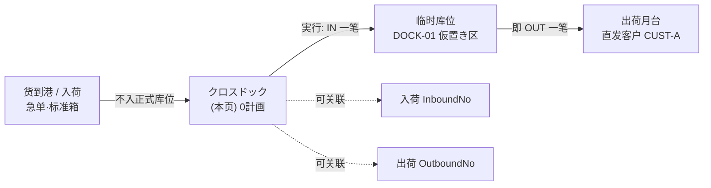
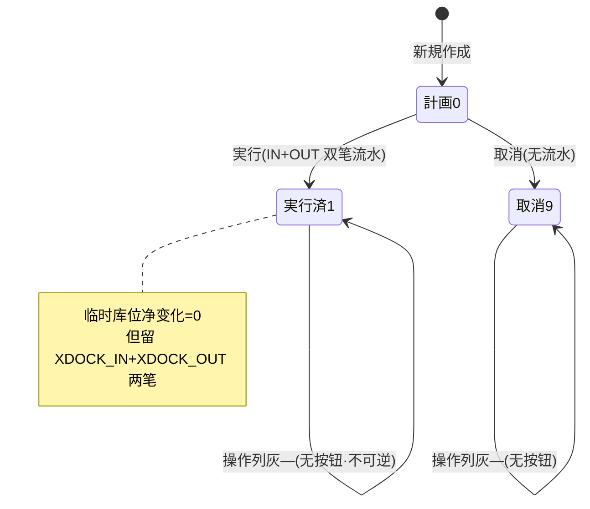

# クロスドック（越库直发）单页面操作 SOP（手把手版）

> **用途**：给**收发货调度/仓管担当操作、培训老师讲、测试人员拆用例**。比模块总册（`03-库存物流WMS` §5.18）更细。
> **页面**：クロスドック（越库直发 · WM130 · 物流优化作业）　**路由**：`/wms/cross-dock`　**前端**：`views/wms/CrossDockView.vue`　**API**：`api/wms/logistics.ts crossDockApi`　**后端**：`Wms/CrossDockController` → `CrossDockService`（`CreateAsync`/`ExecuteAsync`/`CancelAsync`）
> **基准**：分支 `feat/wfs-inbox-core`，2026-06-29；后端实测 `docs/codemap-wms/05-紙器特化.md` §7（2026 权威）+ `CrossDockService.cs` 实读，UI 经 view 实读。
> **样例数据**：越库单 `XD2026070001`、製品 `PRD2026070001`、倉庫 `W01`、临时库位 `DOCK-01`、数量 `1000`、仕入先 `SUP01`、客户 `CUST-A`、入荷月台 `DOCK-IN-01`、出荷月台 `DOCK-OUT-01`。

---

## 1. 页面一句话说明

**クロスドック（越库直发），就是"货到港不进正式库位、经一个临时库位（月台仮置き区）一进一出直接转去发货"的调度单——建单时只是计划（0計画），点「実行」时系统走库存铁律一次性产生 IN+OUT 两笔流水（同一个临时库位先收进、立刻再发出），净库存变化为 0，但留下两条互相关联的 Stock 流水把"这批货从哪来、去哪去"全程串起来。** 它专为急单/标准箱"免上架、免拣货"的直发场景而设。

---

## 2. 这个页面在业务流程中的位置

- **上游**：货到港（急单/标准箱），按业务判断"无需上架直接转发"。
- **本页**：建越库单（计划）→ 実行（一进一出）。
- **下游**：货从临时库位 OUT 后即上发货月台直发客户；IN/OUT 两笔流水进 Stock 流水台账，可由「ロット追溯」「入出庫履历」串起入荷↔出荷。

---

## 3. 谁使用这个页面

| 角色 | 用途 |
|---|---|
| 收发货调度担当 | 建越库直发单、点実行让货一进一出 |
| 仓管/月台担当 | 把到港货搬到临时库位再转出，核对单据 |
| 物流主管 | 看哪些急单走了越库、核对入荷↔出荷关联 |

---

## 4. 操作前准备

- [ ] 已确认这批货"免上架直发"（急单/标准箱），有明确的来料和去向。
- [ ] 临时库位（如 `DOCK-01`）已存在且可收发（月台仮置き区）——**必填**。
- [ ] 製品CD（如 `PRD2026070001`）、倉庫（如 `W01`）、数量（如 `1000`）准备好——**都必填**。
- [ ] 知道仕入先（来料方 `SUP01`）、客户（去向 `CUST-A`），可选填便于追溯。
- [ ] 清楚 lotNo 留空即由系统采番（前端占位提示 `auto: XD<date>-<seq>`）。

---

## 5. 页面区域说明

| 区域 | 内容 |
|---|---|
| 检索区（顶部卡片） | 越库NO / 製品CD / 状态下拉（計画/実行済/取消）+「検索」+「新規」按钮 |
| 列表表格 | 每行：越库NO / 状态 tag / 製品CD / 数量 / 仕入先 / 客户 / 入荷月台(fromDock) / 出荷月台(toDock) / 临时库位 / 実行日時 / 操作列 |
| 新規对话框 | 560px；标题"クロスドック作成"；製品CD·数量·倉庫·临时库位（必填，带红星）+ 製品名/ロット/入荷月台/出荷月台/仕入先/客户/備考（可空） |

> **盲点提醒**：表格**没有** inTxnNo/outTxnNo 列——実行后产生的两笔流水号在 UI 上看不到，只能去 Stock 流水/ロット追溯查；操作列在非 0（計画）状态只显一个灰色裸 `—`，没有任何按钮。

---

## 6. 字段填写说明（口语版）

**检索区**：越库NO（模糊匹配）、製品CD（精确）、状态（計画0/実行済1/取消9，可空=全部）。

**新規对话框**（建单只是落计划，不动库存）：

| 字段 | 必填? | 怎么填 | 填错影响 |
|---|---|---|---|
| 製品CD（product） | ✅ | 如 `PRD2026070001` | 空→前端 `wms.common.required` 提示，不提交（后端兜底 `ProductCd required`） |
| 製品名（productName） | — | 可空，便于辨识 | — |
| 数量（qty） | ✅ | >0，如 `1000`（控件 `:min=0` 允许 0，但 0 会被后端拦） | =0/负→后端 `WM-MSG-021` |
| 倉庫（warehouse） | ✅ | 如 `W01` | 空→前端 `wms.common.required`（后端兜底 `WarehouseCd required`） |
| 临时库位（tempLoc） | ✅ | 月台仮置き区，如 `DOCK-01` | 空→前端 `wms.common.required`（后端兜底 `TempLocationCd required`） |
| ロット（lot） | — | 留空=系统采番；占位提示 `auto: XD<date>-<seq>` | 留空时実行采 `XD<yyyyMMdd>-<越库NO末4位>` |
| 入荷月台（fromDock） | — | 来料月台，如 `DOCK-IN-01` | — |
| 出荷月台（toDock） | — | 去向月台，如 `DOCK-OUT-01` | — |
| 仕入先（supplierCd） | — | 来料方，如 `SUP01`（标签借入荷词条） | — |
| 客户（customerCd） | — | 去向客户，如 `CUST-A`（标签借出荷词条） | — |
| 備考（remarks） | — | 自由文本 | — |

> ⚠️ **诚实标注**：①新規对话框**不暴露** inboundNo/outboundNo 输入框——这两个"关联入荷/出荷单"字段只能由 API/DTO 带入，UI 表单里只填仕入先/客户（借词条显示）；②前端仅对 製品CD/倉庫/临时库位 三项做非空校验，**数量为 0 在前端能过、到后端才被 `WM-MSG-021` 拦**；③ lotNo 占位说 `<seq>`，实际后端采番用的是**越库NO的末 4 位**而非独立序号。

---

## 7. 按钮操作说明

| 按钮 | 何时出现 | 点了会怎样 |
|---|---|---|
| 検索 | 检索区常显 | 按越库NO/製品/状态查列表 |
| 新規 | 检索区常显 | 弹作成对话框 |
| 保存（对话框） | 对话框内 | 提交建单；成功 toast `成功: <越库NO>`（如 `成功: XD2026070001`），状态=0計画 |
| 取消（对话框） | 对话框内 | 关闭不保存 |
| 実行（行内） | **仅 status=0 計画** | 二次确认→走库存铁律 **IN（临时库位收进）+ OUT（同库位即发出）两笔流水**；回填 inTxnNo/outTxnNo/lot/実行日時；状态→1実行済 |
| 取消（行内） | **仅 status=0 計画** | 二次确认→状态→9取消（不产生流水） |
| 裸 `—`（灰） | status≠0（実行済/取消） | 非按钮，纯占位，无任何操作 |

> 列表操作列只在 0計画 显「実行」「取消」两个 link 按钮；实行済(1)/取消(9) 行只有灰色 `—`。
> 后端守卫：実行要求 status=0（否则 `WM-MSG-043: 計画状态でないため実行不可`）；取消的后端守卫是"**実行済不可取消**"（`WM-MSG-043: 実行済は取消不可`，即只拦 status=1），但 UI 上取消按钮只在 status=0 露出，所以实操等价于"仅計画可取消"。

---

## 8. 标准业务操作 SOP（照着点）

### 场景一：新規建越库直发单（主流程·建计划）
- **背景**：急单标准箱到港，调度判断免上架直发，先建一张越库单。
- **样例数据**：製品 `PRD2026070001`、数量 `1000`、倉庫 `W01`、临时库位 `DOCK-01`、入荷月台 `DOCK-IN-01`、出荷月台 `DOCK-OUT-01`、仕入先 `SUP01`、客户 `CUST-A`。
- **前置**：临时库位存在。
- **步骤**：1) 点「新規」；2) 填製品CD/数量/倉庫/临时库位（红星四项）；3) 选填月台/仕入先/客户/備考，ロット留空；4)「保存」。
- **完成后检查**：toast `成功: XD2026070001`；列表新增一行，状态 tag=計画（info 灰蓝）；操作列显「実行」「取消」；実行日時列空显 `—`。
- **异常**：必填空→`wms.common.required`；数量 0→后端 `WM-MSG-021`。
- **用例**：TC-M06-XDOCK-001~004、007。

### 场景二：実行越库直发（核心·IN+OUT 双笔流水）
- **背景**：货已到临时库位，点実行让它一进一出。
- **样例数据**：越库单 `XD2026070001`（計画中）。
- **前置**：单为 0計画。
- **步骤**：1) 列表找到該行；2) 点行内「実行」；3) 确认弹窗。
- **完成后检查**：toast 成功；状态→実行済（success 绿）；实行日時列出现时间；**临时库位 `DOCK-01` 净库存变化为 0**（先 +1000 再 −1000）；后台 Stock 流水新增**两条**：IN（RelatedType=`XDOCK_IN`）+ OUT（RelatedType=`XDOCK_OUT`），均 RelatedNo=`XD2026070001`、同 lot；越库单回填 inTxnNo/outTxnNo/lot（如 `XD20260706-0001`）。
- **盲点**：UI 表格看不到 inTxnNo/outTxnNo（无此列）；要确认两笔流水需去「ロット追溯」或「入出庫履历」按 lot/RelatedNo 查。
- **异常**：非計画再点（理论上按钮已不显）→后端 `WM-MSG-043`。
- **用例**：TC-M06-XDOCK-005、006、008、009、010。

### 场景三：取消计划单
- **背景**：建错或急单取消，作废这张越库计划。
- **样例数据**：`XD2026070001`（計画中）。
- **步骤**：列表行内「取消」→确认。
- **检查**：状态→取消（danger 红）；**不产生任何库存流水**；操作列变灰 `—`。
- **异常**：已実行的单 UI 不露取消按钮；若经 API 强取消实行済单→后端 `WM-MSG-043: 実行済は取消不可`。
- **用例**：TC-M06-XDOCK-011、012。

### 场景四：実行后追溯两笔流水（盲点补救）
- **背景**：实行済后想核对"这批货确实一进一出且可追溯"。
- **步骤**：1) 记下该单 lot（如 `XD20260706-0001`）；2) 到「ロット追溯」WM160 或「入出庫履历」按 lot/越库NO 查。
- **检查**：能看到 IN（XDOCK_IN）+ OUT（XDOCK_OUT）两条，RelatedNo=越库NO，金额/数量对得上；越库单本身在本页表格仍看不到流水号（需后台/履历查）。
- **用例**：TC-M06-XDOCK-013、014。

### 场景五：数量为 0 被后端拦（前端漏网）
- **背景**：数量控件最小值是 0，建单时手滑留 0。
- **步骤**：新規填製品/倉庫/临时库位，数量保持 0→保存。
- **检查**：前端三项非空校验**通过**（不拦数量），请求发到后端→`WM-MSG-021: Qty must be > 0`，单未落库。
- **用例**：TC-M06-XDOCK-015。

### 场景六：必填项前端拦截
- **背景**：漏填製品/倉庫/临时库位之一。
- **步骤**：新規漏填其一→保存。
- **检查**：前端 `wms.common.required` 警告，对话框不关、请求不发。
- **用例**：TC-M06-XDOCK-016、017、018。

### 场景七：状态/按钮可见性核对
- **背景**：确认操作列按状态显隐正确。
- **步骤**：分别看 計画/実行済/取消 三种行的操作列。
- **检查**：計画=「実行」「取消」；実行済=灰 `—`；取消=灰 `—`。
- **用例**：TC-M06-XDOCK-019、020。

---

## 9. 状态变化说明

- 0計画→1実行済（实行，唯一产生库存流水的动作）。
- 0計画→9取消（作废，不动库存）。
- 1実行済**不可逆**（后端拦取消）；9取消为终态。

---

## 10. 按钮不可用 / 灰色原因

| 现象 | 原因 |
|---|---|
| 行内无「実行」「取消」、只一个灰 `—` | 该单非 0計画（已実行済或已取消） |
| 实行済单想再实行 | 已是终态，按钮不显；强发后端 `WM-MSG-043` |
| 实行済单想取消 | UI 不露取消；后端 `WM-MSG-043: 実行済は取消不可` |
| 表格找不到流水号列 | **设计如此**，inTxnNo/outTxnNo 不在表格列，需履历/追溯查 |
| 新規对话框找不到"关联入荷/出荷单"输入 | UI 不暴露 inboundNo/outboundNo，仅 API/DTO 可带 |
| 数量填 0 保存却报错 | 前端不校验数量，后端 `WM-MSG-021` |

---

## 11. 常见错误与处理

| 错误 | 原因 | 处理 |
|---|---|---|
| `wms.common.required` 警告 | 製品CD/倉庫/临时库位 有空 | 补齐三项必填 |
| `WM-MSG-021: Qty must be > 0` | 数量 ≤ 0（前端漏网） | 数量填 >0 重提交 |
| `WM-MSG-043: 計画状态でないため実行不可` | 对非計画单点実行 | 仅計画(0)单可実行 |
| `WM-MSG-043: 実行済は取消不可` | 取消已実行单 | 実行済不可逆，无需取消 |
| `WM-MSG-070` | 越库单不存在（NO 错/已删） | 核对越库NO |
| 实行后表格看不到流水号 | UI 无 inTxnNo/outTxnNo 列 | 去ロット追溯/入出庫履历按 lot 查 |
| OUT 报库存不足（极少） | 异常并发下临时库位被他途扣减 | 核对临时库位无其他占用；正常 IN 在前 OUT 在后不会缺 |

---

## 12. 操作完成后的检查清单

- [ ] 建单：toast `成功: <越库NO>`，列表新行状态=計画，実行日時空。
- [ ] 実行：状态→実行済；実行日時有值；越库单回填 inTxnNo/outTxnNo/lot（如 `XD20260706-0001`）。
- [ ] 库存：临时库位 `DOCK-01` 对該製品·lot **净变化为 0**（IN 与 OUT 抵消）。
- [ ] 流水：Stock 流水新增**两条**——`XDOCK_IN`（IN）+`XDOCK_OUT`（OUT），RelatedNo=越库NO，同 lot，可经追溯串起入荷↔出荷。
- [ ] 取消：状态→取消，**无任何库存流水**。
- [ ] 终态：実行済/取消行操作列只有灰 `—`，不可再操作。

---

## 13. 页面级测试用例（≥25 条，可执行）

> 编号 `TC-M06-XDOCK-xxx`；数据用样例（越库 `XD2026070001`/製品 `PRD2026070001`/倉庫 `W01`/临时库位 `DOCK-01`/数量 `1000`/仕入先 `SUP01`/客户 `CUST-A`）。

| 用例编号 | 用例名称 | 优先级 | 前置条件 | 测试数据 | 操作步骤 | 预期结果 | 下游检查 | 备注 |
|---|---|---|---|---|---|---|---|---|
| TC-M06-XDOCK-001 | 打开页面加载列表 | P1 | 有越库单 | — | 进 `/wms/cross-dock` | 列表渲染、状态 tag 正确 | — | — |
| TC-M06-XDOCK-002 | 检索按越库NO | P2 | 有单 | XD2026070001 | 填NO→検索 | 命中該单 | — | 模糊匹配 |
| TC-M06-XDOCK-003 | 检索按状态 | P2 | 多状态单 | 状态=計画 | 选状态→検索 | 仅計画单 | — | — |
| TC-M06-XDOCK-004 | 新規建单成功 | P0 | 临时库位存在 | PRD2026070001/1000/W01/DOCK-01 | 新規→填→保存 | toast `成功: XD…`、新行=計画 | 落库 status0 | 主流程 |
| TC-M06-XDOCK-005 | 実行产生 IN+OUT 双笔 | P0 | 計画单 | XD2026070001 | 実行→确认 | 状态→実行済、実行日時有值 | Stock 新增 XDOCK_IN+XDOCK_OUT 两条 | **核心** |
| TC-M06-XDOCK-006 | 临时库位净变化为0 | P0 | 実行后 | DOCK-01/PRD…/lot | 查临时库位库存 | 该製品·lot 净量 0（先+1000再−1000） | 在库台账 | 铁律 |
| TC-M06-XDOCK-007 | 成功提示带越库NO | P1 | — | — | 保存 | toast 含 `XD…` 号 | — | — |
| TC-M06-XDOCK-008 | 回填流水号与lot | P1 | 実行后 | — | 查该单(API/履历) | inTxnNo/outTxnNo/lot 已回填 | DB | UI无列 |
| TC-M06-XDOCK-009 | lot 留空自动采番 | P1 | lot空 | 越库NO末4=0001 | 留空保存→実行 | lot=`XD<yyyyMMdd>-0001` | DB | 末4位非独立seq |
| TC-M06-XDOCK-010 | lot 手填则沿用 | P2 | lot填值 | LOT-X | 填lot→保存→実行 | 流水用 LOT-X | 流水 | — |
| TC-M06-XDOCK-011 | 取消计划单 | P1 | 計画单 | XD2026070001 | 取消→确认 | 状态→取消、无流水 | 无 Stock 变化 | — |
| TC-M06-XDOCK-012 | 取消不产生流水 | P1 | 計画单 | — | 取消后查流水 | 无 XDOCK_* 流水 | 流水台账 | — |
| TC-M06-XDOCK-013 | ロット追溯串入出 | P1 | 実行后 | lot | 追溯查 lot | 见 IN+OUT 关联越库NO | WM160 | 盲点补救 |
| TC-M06-XDOCK-014 | 入出庫履历可查 | P2 | 実行后 | 越库NO | 履历按RelatedNo查 | 两条 RelatedNo=越库NO | 履历 | — |
| TC-M06-XDOCK-015 | 数量0后端拦 | P0 | — | qty=0 | 新規数量0→保存 | `WM-MSG-021`，不落库 | 前端漏网 | **关键** |
| TC-M06-XDOCK-016 | 製品CD空前端拦 | P0 | — | 製品空 | 漏填製品→保存 | `wms.common.required`、不发请求 | — | — |
| TC-M06-XDOCK-017 | 倉庫空前端拦 | P0 | — | 倉庫空 | 漏填倉庫→保存 | `wms.common.required` | — | — |
| TC-M06-XDOCK-018 | 临时库位空前端拦 | P0 | — | 临时库位空 | 漏填→保存 | `wms.common.required` | — | — |
| TC-M06-XDOCK-019 | 計画行显两按钮 | P2 | 計画单 | — | 看操作列 | 「実行」「取消」 | — | — |
| TC-M06-XDOCK-020 | 终态行显灰— | P2 | 実行済/取消单 | — | 看操作列 | 仅灰 `—`，无按钮 | — | — |
| TC-M06-XDOCK-021 | 実行非計画单被拦 | P1 | 実行済单 | — | API 强发 execute | `WM-MSG-043:計画状态でない…` | 无新流水 | 绕UI |
| TC-M06-XDOCK-022 | 取消実行済被拦 | P1 | 実行済单 | — | API 强发 cancel | `WM-MSG-043:実行済は取消不可` | 状态不变 | 绕UI |
| TC-M06-XDOCK-023 | 越库单不存在 | P2 | — | 错NO | execute 错NO | `WM-MSG-070` | — | — |
| TC-M06-XDOCK-024 | 表格无流水号列 | P2 | 実行后 | — | 看表格列 | 无 inTxnNo/outTxnNo 列 | — | 现状盲点 |
| TC-M06-XDOCK-025 | 対话框无关联单输入 | P2 | — | — | 看新規对话框 | 无 inboundNo/outboundNo 框 | — | 仅API带 |
| TC-M06-XDOCK-026 | 仕入先/客户借词条显示 | P3 | — | SUP01/CUST-A | 看列/对话框标签 | 标签复用入荷/出荷词条 | — | i18n |
| TC-M06-XDOCK-027 | 実行日時空显— | P3 | 計画单 | — | 看実行日時列 | 空显 `—` | — | — |
| TC-M06-XDOCK-028 | 状态 tag 配色 | P3 | 三状态 | — | 看 tag | 計画info/実行済success/取消danger | — | — |
| TC-M06-XDOCK-029 | 权限不足 | P2 | 无权账号 | — | 进页面/操作 | 待业务确认(隐藏/拒绝) | — | 权限 |
| TC-M06-XDOCK-030 | 网络异常 | P2 | 断网 | — | 保存/実行 | 友好错误可重试 | — | — |

---

## 14. 培训讲解建议

| 顺序 | 讲什么 | 演示 | 易误解点 |
|---|---|---|---|
| 1 | 越库=货不进正式库位直转 | §2 流程图 | 以为像普通入库要上架 |
| 2 | 建单只是计划，不动库存 | 新規→看 status0 | 以为建单就发货了 |
| 3 | 実行=一进一出两笔流水 | 実行→看状态+追溯 | 以为只有一笔/净变化非0 |
| 4 | 临时库位净变化为 0 | 查库存台账 | 以为临时库位会累积库存 |
| 5 | 流水号在 UI 看不到 | 讲去履历/追溯查 | 在表格找流水号列 |
| 6 | 数量0前端不拦 | 演示后端 WM-MSG-021 | 以为前端会拦所有必填 |
| 7 | 実行不可逆 | 实行済无取消按钮 | 想"撤销"已実行单 |

---

## 15. 与模块级手册的关系

对应 `03-库存物流WMS-最详细用户操作培训手册.md` §5.18「物流优化作业类（表格概述）」中「**クロスドック** WM130(/cross-dock)」一行（含关键机制段：CrossDock 同库位连发 IN+OUT 净变化 0 但留两条 Txn 关联入荷/出荷）。相关：测试矩阵 AC-M06-11（紙器特化解耦：Kit/CrossDock 走铁律），培训路线「7 物流优化」（Kit/CrossDock 走铁律,Slotting 不落地）。同组 §5.18 另三页：補充 WM120、スロッティング WM110、キット WM140。

---

## 16. 代码与文档来源

| 层 | 文件 |
|---|---|
| 逐行源码手册 | `docs/codemap-wms/05-紙器特化.md` §7 Cross-Dock（权威） |
| 前端 | `cp6.web/src/views/wms/CrossDockView.vue` |
| API/类型 | `cp6.web/src/api/wms/logistics.ts`(crossDockApi)、`cp6.web/src/types/wms/wms.ts`(CrossDockOrder/CrossDockSearchQuery) |
| 后端 | `Wms/CrossDockController.cs`、`CP6.Core/Services/Wms/CrossDockService.cs`（CreateAsync/ExecuteAsync/CancelAsync）|
| 库存铁律 | `IStockMovementService.ApplyAsync`（IN+OUT 各一笔，RelatedType=`XDOCK_IN`/`XDOCK_OUT`）|
| 采番 | `WmsSequenceService.NextAsync("XD")`；lot 兜底 `XD<yyyyMMdd>-<越库NO末4>` |
| 实体 | `CP6.Entity/DomainModels/Wms/CrossDockOrder.cs`、`CrossDockStatus`(Planned0/Executed1/Cancelled9) |

---

## 最后更新来源

- 代码：见 §16（codemap-wms 05 §7 + `CrossDockService.cs` 实读 + view/types/api 实读）。
- 基准：分支 `feat/wfs-inbox-core`，2026-06-29。
- 覆盖：16 节 / 7 场景 / 30 用例（TC-M06-XDOCK-001~030）。
- 关键事实校验：①越库直发=货到港不入正式库位经临时库位直转；②実行走库存铁律一次产生 IN+OUT 两笔流水（同临时库位净变化 0，回填 inTxnNo/outTxnNo）；③状态 0計画→1実行済/9取消，実行仅 status0、取消后端拦実行済；④必填 productCd/qty/warehouseCd/tempLocationCd，lot 留空采番 `XD<date>-<末4>`；⑤校验 `WM-MSG-070/043/021`；盲点：表格无 inTxnNo/outTxnNo 列、终态操作列裸 `—`、数量0前端漏网、对话框不暴露 inboundNo/outboundNo。
</content>
</invoke>
