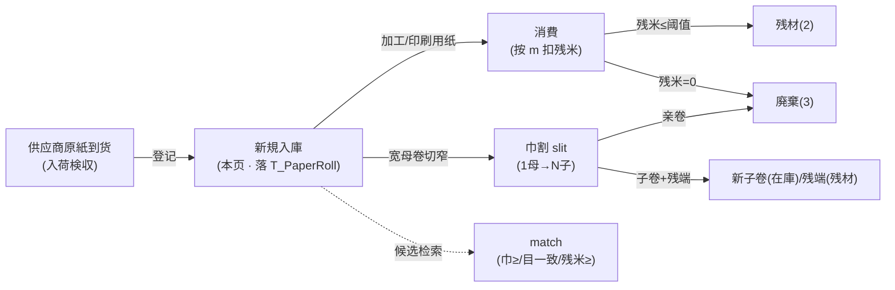
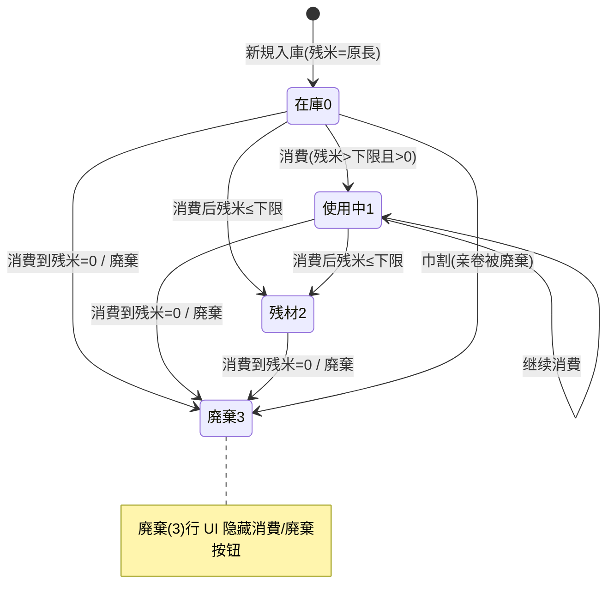

# 原紙ロール 单页面操作 SOP（手把手版）

> **用途**：给**调墨/纸器担当现场操作、培训老师讲、测试人员拆用例**。比模块总册（`03-库存物流WMS` §5.19）更细。
> **页面**：原紙ロール管理（MSBBWM200 · 库存物流 WMS）　**路由**：`/wms/paper-roll`　**前端**：`views/wms/PaperRollView.vue`　**API**：`api/wms/paperIndustry.ts paperRollApi`　**后端**：`Wms/PaperRollController` → `PaperRollService`（CreateAsync/ConsumeAsync/SlitAsync/DisposeAsync/MatchAsync）
> **基准**：分支 `feat/wfs-inbox-core`，2026-06-29；后端实测 `docs/codemap-wms/05-紙器特化.md` §1（2026-06-22 权威），UI 经实读 `PaperRollView.vue`。
> **样例数据**：原紙 `ROLL2026070001`、紙質（grade）`K280`、巾 `1600mm`、目（grain）`T`、原長 `5000m`、倉庫 `W01`、巾割子巾 `905,390`（残端 305mm）。

---

## 1. 页面一句话说明

**原紙ロール管理，就是把整卷未裁的原纸当成"按米算的连续资产"来管账的地方——入庫登记一卷原紙（记巾/目/原長），加工时用多少就"消費"扣多少残米，残米到设定的下限自动变"残材"、扣到 0 自动"廃棄"；要把一卷宽母卷物理切成几卷窄子卷时用"巾割（スリッター）"，1 母卷拆成 N 子卷并保留父子血缘。** 它和主库存（Stock）**两套账、互不影响**：原紙走自己的专用表 `T_PaperRoll`，**不走库存铁律**，状态只在本表内迁移。

---

## 2. 这个页面在业务流程中的位置

- **上游**：供应商原紙到货、入荷検収后在本页**新規入庫**登记（独立专用表，不经入庫指示/実績主线）。
- **本页**：原紙库管——新規 / 消費 / 巾割 slit / 廃棄。
- **下游**：消費供 MES 印刷·製函加工领用；巾割产出窄子卷继续加工；残端/短料转**残材管理**（WM210）回用。
- **旁路**：`match` 候选检索（巾≥必要巾、目一致、残米≥必要長）——**后端有端点，本页无 UI 入口**（见 §10）。

---

## 3. 谁使用这个页面

| 角色 | 用途 |
|---|---|
| 调墨/纸器担当（紙器担当） | 原紙入庫登记、加工消費扣米、巾割切卷、报废 |
| 现场加工作业者 | 领用原紙时按米消費、确认残米/血缘 |
| 仓库主管 | 核对残材回用、报废核准、库位 |

---

## 4. 操作前准备

- [ ] 入荷検収完成，拿到原紙的**紙質(grade)/巾(mm)/目(T或Y)/原長(m)/倉庫·ロケ**。
- [ ] 想好该卷的**残材下限 `DisposeThresholdM`**（可空；填了之后消費到≤此值自动变"残材"触发回用）。
- [ ] 巾割前：确认母卷 NO、各子巾(mm)、子巾合计**不得超过母卷巾**、是否保留残端。
- [ ] 清楚：本表与主 Stock **不联动**——这里消費/巾割**不会**生成 StockTransaction、不动主库存数量。

---

## 5. 页面区域说明

| 区域 | 内容 |
|---|---|
| 检索卡 | 原紙NO / 紙質 / 巾 / 目(T·Y) / 状态 + 「検索」「新規」「巾割(スリッター)」三个按钮 |
| 一覧表 | 每行：原紙NO / 状态 tag / 紙質 / 巾 / 目 / 坪量 / 残米·原長(m)+进度条 / 紙管径(″) / ロケ / 親ロールNO / 操作（消費·廃棄） |
| 入庫 Dialog | 600px；紙質*·巾*·坪量·目·原長*·紙管径·倉庫*·ロケ*·製造日·製造ロット·残材下限 |
| 消費 Dialog | 420px；只读残米 tag + 消費長(m)* 输入 |
| スリッター(巾割) Dialog | 500px；親ロールNO* + 子巾(逗号串) + 残端を保持(开关) |

---

## 6. 字段填写说明（口语版）

**检索卡**：原紙NO（模糊）、紙質（精确）、巾（精确）、目（T/Y 下拉）、状态（在庫/使用中/残材/廃棄）。

**入庫 Dialog**（新規）：

| 字段 | 必填 | 怎么填 | 填错影响 |
|---|---|---|---|
| 紙質 grade | 是 | 如 `K280` | 空→后端裸串 `PaperGrade required`（**非 WM-MSG 码**） |
| 巾 widthMm | 是 | >0，如 `1600` | ≤0→后端裸串 `WidthMm must be > 0` |
| 坪量 basisWeight | 否 | g/m²，如 `280` | — |
| 目 grain | 否 | `T`(縦) 或 `Y`(横)，默认 `T` | — |
| 原長 lengthM | 是 | >0，如 `5000`；入庫时**残米=原長** | ≤0→后端裸串 `OriginalLengthM must be > 0` |
| 紙管径 coreInch | 否 | 寸，默认 `3` | — |
| 倉庫 / ロケ | 是 | 如 `W01` / 库位 | 任一空→后端裸串 `Warehouse / Location required` |
| 製造日 / 製造ロット | 否 | 追溯用 | — |
| 残材下限 disposeThresholdM | 否 | 残米≤此值自动转"残材" | 不填则不自动转残材 |

> ⚠️ Dialog 上的 `required` 只是**红星装饰**（未挂校验规则）；空字段照样能点保存，**由后端拦并返回上面那些英文裸串**（不是 WM-MSG i18n 文案）。

**消費 Dialog**：消費長(m) 必填、>0（前端 `consumeLen≤0` 会先弹"必填"挡住；消費長>残米由后端拦 `WM-MSG-202`）。

**スリッター Dialog**：親ロールNO 必填；子巾用逗号串（如 `905,390`，自动 split→取整→滤掉≤0）；残端を保持 开关默认开。

---

## 7. 按钮操作说明

| 按钮 | 何时出现 | 点了会怎样 |
|---|---|---|
| 検索 | 检索卡常显 | 按条件刷新一覧 |
| 新規 | 检索卡常显 | 开入庫 Dialog（默认巾905/坪量280/目T/紙管径3） |
| 巾割(スリッター) | 检索卡常显 | 开巾割 Dialog（独立，不依赖选行） |
| 消費 | 行 status≠3(非廃棄) | 开消費 Dialog；扣残米+自动状态迁移 |
| 廃棄 | 行 status≠3(非廃棄) | 二次确认→该卷 Status=3 廃棄 |
| 保存(入庫 Dialog) | — | 提交新規，成功 toast 含新 `ROLL…`NO |
| 消費(消費 Dialog) | — | 提交消費，成功 toast；残米/状态刷新 |
| 巾割(スリッター Dialog) | — | 提交巾割，成功 toast 含"建了 N 卷" |

> **廃棄(3)行**：消費、廃棄两个操作按钮**都隐藏**（`v-if status!==3`）——廃棄済卷在 UI 上不能再消費/再廃棄。

---

## 8. 标准业务操作 SOP（照着点）

### 场景一：原紙新規入庫（登记一卷母卷）
- **背景**：供应商原紙到货检收完，登记入账。
- **样例数据**：紙質 `K280`、巾 `1600`、目 `T`、原長 `5000`、坪量 `280`、紙管径 `3`、倉庫 `W01`、残材下限 `200`。
- **步骤**：1) 「新規」；2) 填紙質/巾/原長/倉庫/ロケ（带星必填）+ 目/坪量/紙管径/残材下限；3) 「保存」。
- **完成后检查**：生成 `ROLL2026070001`（采番 `ROLL{yyyyMM}{NNNN}` 月级连番）；入庫**残米=原長=5000**；状态=`在庫(0)` 绿 tag；进度条 100%。
- **异常（可拆用例）**：紙質空→`PaperGrade required`；巾≤0→`WidthMm must be > 0`；原長≤0→`OriginalLengthM must be > 0`；倉庫/ロケ空→`Warehouse / Location required`（**均英文裸串非 WM-MSG**）。
- **用例**：TC-M06-PAPERROLL-001~006。

### 场景二：加工消費（按米扣残长 + 自动状态迁移）
- **背景**：印刷/製函领用该卷原紙，用多少扣多少。
- **样例数据**：`ROLL2026070001` 残米 5000，本次消費 `1000`。
- **步骤**：在该行点「消費」→Dialog 显残米 tag→填消費長(m)→「消費」。
- **检查（三档迁移，可拆用例）**：
  - 在庫(0)首次消費→残米 4000、状态自动 `使用中(1)`；
  - 继续消費到残米≤残材下限(200)→自动 `残材(2)` 橙 tag（触发残材回用）；
  - 消費到残米=0→自动 `廃棄(3)` 红 tag（完全消費）。
- **异常**：消費長≤0→前端"必填"挡住；消費長>残米→后端 `WM-MSG-202`（前端无前置校验）。
- **用例**：TC-M06-PAPERROLL-007~011。

### 场景三：巾割 slit（1 母卷切成 N 子卷）
- **背景**：把 1600mm 宽母卷切成 905mm、390mm 两卷窄料，残端留用。
- **样例数据**：親 `ROLL2026070001`(巾1600/残米5000)、子巾 `905,390`、残端を保持=开。
- **步骤**：1)「巾割(スリッター)」；2) 填親ロールNO；3) 子巾填 `905,390`；4) 残端を保持 开；5)「巾割」。
- **检查**：建 **3** 卷——2 子卷(905、390，状态`在庫0`，**原長=亲卷残米=5000**，带 `親ロールNO=ROLL2026070001`) + 1 残端卷(巾 `305`=1600-905-390，状态`残材2`)；**亲卷 ROLL2026070001 → 廃棄(3)、残米=0**；toast 提示"建了 3 卷"。
- **变体（可拆用例）**：残端を保持=关→只建 2 子卷，**不建残端卷**；子巾串为空/非数字→前端"必填"挡住。
- **用例**：TC-M06-PAPERROLL-013、014、016、019、020。

### 场景四：★巾割超亲巾（盲点：前端无校验）
- **背景**：子巾合计超过母卷巾，物理上切不出来。
- **样例数据**：親 `ROLL2026070001`(巾1600)、子巾 `905,800`（合计 1705 > 1600）。
- **步骤**：「巾割」→填親NO→子巾 `905,800`→「巾割」。
- **检查**：**前端无任何前置校验**（只校验親NO非空+子巾串非空+至少一个>0），子巾合计是否超亲巾**只由后端拦**→返回 `WM-MSG-203: 子ロール巾合計(1705) > 親巾(1600)`；且 **`WM-MSG-203` 需求文档无文案**，前端按裸码显示（不友好）。
- **盲点结论**：建议产品补"子巾合计 ≤ 母卷巾"的前端即时校验 + 友好文案（对应总册 C-M06-10）。
- **用例**：TC-M06-PAPERROLL-015。

### 场景五：原紙廃棄（报废）
- **背景**：受潮/破损/呆滞原紙报废。
- **步骤**：在非廃棄行点「廃棄」→二次确认弹窗→确定。
- **检查**：该卷 Status=`廃棄(3)` 红 tag；之后该行消費/廃棄按钮**消失**；廃棄済卷再消費(经 API)→`WM-MSG-043`。
- **变体（可拆用例）**：确认弹窗点"取消"→状态不变。
- **用例**：TC-M06-PAPERROLL-021、022、012。

### 场景六：检索与血缘/进度核对
- **背景**：找某批原紙、看残米进度、追母子血缘。
- **步骤**：检索卡填 原紙NO/紙質/巾/目/状态→「検索」；看一覧的残米·原長进度条与"親ロールNO"列。
- **检查**：进度条=`残米/原長×100%`（四舍五入）；子卷"親ロールNO"列回指母卷；状态 tag 颜色 0绿/1蓝/2橙/3红。
- **用例**：TC-M06-PAPERROLL-023、024、025、026。

---

## 9. 状态变化说明

- **颜色**：在庫(0)=success 绿、使用中(1)=primary 蓝、残材(2)=warning 橙、廃棄(3)=danger 红。
- **巾割**：亲卷直接 → 廃棄(3)、残米=0；子卷起始 在庫(0)；残端卷起始 残材(2)。

---

## 10. 按钮不可用 / 灰色原因

| 现象 | 原因 |
|---|---|
| 行无"消費/廃棄"按钮 | 该卷已 廃棄(3)（`v-if status!==3` 隐藏） |
| 找不到"巾割候选/匹配选卷"入口 | `match` 端点后端有、**本页无 UI**（巾≥必要/目一致/残米≥必要長，残米最小优先 take 20，仅 API 可调） |
| 巾割超亲巾点了才报错 | 前端**无**子巾合计校验，只后端 `WM-MSG-203` 拦 |
| 消費長输框点确认无反应 | 消費長≤0，前端弹"必填"未发请求 |
| 改不了已建子卷血缘 | 巾割一次性建账，无改父子关系入口 |

---

## 11. 常见错误与处理

| 错误 | 原因 | 处理 |
|---|---|---|
| `PaperGrade required` | 紙質空（英文裸串，非 WM-MSG） | 填紙質 |
| `WidthMm must be > 0` | 巾≤0 | 填正巾 |
| `OriginalLengthM must be > 0` | 原長≤0 | 填正原長 |
| `Warehouse / Location required` | 倉庫或ロケ空 | 两者都填 |
| `WM-MSG-202`（消費長>残米 / ≤0） | 消費超残米 | 改小消費長（≤残米） |
| `WM-MSG-043`（廃棄済不可消費/巾割） | 对廃棄卷消費或巾割 | 换非廃棄卷 |
| `WM-MSG-203`（子巾合计>亲巾） | 巾割超母卷巾，**前端无校验+无文案** | 子巾合计调到 ≤母卷巾（裸码不友好，待产品补文案） |
| `WM-MSG-070`（卷不存在） | 親NO/原紙NO 错 | 核对 NO |
| 消費/巾割没动主库存 | 设计如此：专用表与主 Stock 解耦、不走铁律 | 正常，无需对账主 Stock |

---

## 12. 操作完成后的检查清单

- [ ] 新規：生成 `ROLL{yyyyMM}{NNNN}` NO；残米=原長；状态在庫(0) 绿。
- [ ] 消費：残米按米递减；自动迁移 在庫→使用中→(≤下限)残材→(=0)廃棄；**未生成 StockTransaction、未动主 Stock**。
- [ ] 巾割：子卷数=子巾数(+残端1)；子卷"親ロールNO"回指母卷、原長=亲卷残米；**亲卷 Status=3、残米=0**。
- [ ] 廃棄：Status=3；该行消費/廃棄按钮消失。
- [ ] 进度条 = 残米/原長×100%；状态 tag 颜色 0绿/1蓝/2橙/3红。

---

## 13. 页面级测试用例（≥25 条，可执行）

> 编号 `TC-M06-PAPERROLL-xxx`；数据用样例（`ROLL2026070001`/K280/1600/T/5000/W01/子巾 905,390）。

| 用例编号 | 用例名称 | 优先级 | 前置条件 | 测试数据 | 操作步骤 | 预期结果 | 下游检查 | 备注 |
|---|---|---|---|---|---|---|---|---|
| TC-M06-PAPERROLL-001 | 原紙新規入庫成功 | P0 | 已检收 | K280/1600/T/5000/W01 | 新規→填→保存 | 生成 ROLL2026070001、残米=原長=5000、状态在庫(0) | 一覧出现新行 | 采番 ROLL 月级 |
| TC-M06-PAPERROLL-002 | 紙質空被拦 | P0 | — | 紙質空 | 新規→保存 | `PaperGrade required`（英文裸串） | 不落库 | 非 WM-MSG |
| TC-M06-PAPERROLL-003 | 巾≤0 被拦 | P0 | — | 巾=0 | 新規→保存 | `WidthMm must be > 0` | 不落库 | 非 WM-MSG |
| TC-M06-PAPERROLL-004 | 原長≤0 被拦 | P0 | — | 原長=0 | 新規→保存 | `OriginalLengthM must be > 0` | 不落库 | 非 WM-MSG |
| TC-M06-PAPERROLL-005 | 倉庫/ロケ空被拦 | P0 | — | 倉庫空 | 新規→保存 | `Warehouse / Location required` | 不落库 | 非 WM-MSG |
| TC-M06-PAPERROLL-006 | 必填星号无实际校验 | P2 | — | 全空 | 直接保存 | 不被前端拦、由后端报英文裸串 | — | UI 现状 |
| TC-M06-PAPERROLL-007 | 消費 在庫→使用中 | P0 | 在庫卷残米5000 | 消費1000 | 行→消費→1000→确认 | 残米4000、状态自动使用中(1) | 不动主 Stock | 自动迁移 |
| TC-M06-PAPERROLL-008 | 消費致残米≤下限→残材 | P0 | 残材下限200、残米300 | 消費150 | 消費150 | 残米150、状态自动残材(2)橙 | 触发残材回用 | 阈值迁移 |
| TC-M06-PAPERROLL-009 | 消費致残米=0→廃棄 | P0 | 残米150 | 消費150 | 消費150 | 残米0、状态自动廃棄(3)红 | — | 完全消費 |
| TC-M06-PAPERROLL-010 | 消費長>残米被拦 | P0 | 残米4000 | 消費9999 | 消費9999→确认 | `WM-MSG-202`（前端无前置校验） | 不落库 | 后端拦 |
| TC-M06-PAPERROLL-011 | 消費長≤0 前端拦 | P1 | 任意 | 消費0 | 消費0→确认 | 前端弹"必填"，不发请求 | 不落库 | 前端守卫 |
| TC-M06-PAPERROLL-012 | 廃棄済不可消費 | P1 | 廃棄卷 | 经 API 消費 | API 调 consume | `WM-MSG-043` | — | UI 按钮已隐藏 |
| TC-M06-PAPERROLL-013 | 巾割正常 1→N+残端 | P0 | 母卷1600/残米5000 | 子巾905,390/保留残端 | 巾割→填→提交 | 建3卷(905·390在庫+305残材)、toast"3卷" | 亲卷→廃棄(3) | 核心 |
| TC-M06-PAPERROLL-014 | 巾割不保留残端 | P1 | 同上 | 残端を保持=关 | 巾割→提交 | 只建2子卷、无残端卷 | 亲卷→廃棄(3) | — |
| TC-M06-PAPERROLL-015 | ★巾割超亲巾(盲点) | P0 | 母卷1600 | 子巾905,800(=1705) | 巾割→提交 | `WM-MSG-203`(1705>1600)，**前端无校验+裸码** | 不落库 | C-M06-10 |
| TC-M06-PAPERROLL-016 | 巾割子巾串空被拦 | P1 | 母卷 | 子巾空 | 巾割→提交 | 前端弹"必填"，不发请求 | — | 前端守卫 |
| TC-M06-PAPERROLL-017 | 巾割亲卷不存在 | P1 | — | 親NO=ROLL9999 | 巾割→提交 | `WM-MSG-070` | 不落库 | — |
| TC-M06-PAPERROLL-018 | 巾割廃棄済亲卷 | P1 | 親卷已廃棄 | — | 巾割→提交 | `WM-MSG-043` | 不落库 | — |
| TC-M06-PAPERROLL-019 | 子卷继承属性+血缘 | P1 | 巾割成功 | — | 查子卷 | 紙質/坪量/目/紙管径=亲卷、親ロールNO 回指 | 一覧親列 | 父子血缘 |
| TC-M06-PAPERROLL-020 | 子卷原長=亲卷残米 | P1 | 母卷残米5000 | — | 查子卷 | 子卷原長=残米=5000、进度100% | — | — |
| TC-M06-PAPERROLL-021 | 廃棄成功 | P1 | 在庫/使用中卷 | — | 廃棄→确认 | Status=廃棄(3)红、按钮消失 | — | — |
| TC-M06-PAPERROLL-022 | 廃棄确认取消 | P2 | 任意卷 | — | 廃棄→取消 | 状态不变 | — | — |
| TC-M06-PAPERROLL-023 | 状态 tag 颜色 | P2 | 各状态卷 | — | 看状态列 | 0绿/1蓝/2橙/3红 | — | — |
| TC-M06-PAPERROLL-024 | 残米进度条 | P2 | 有残米卷 | 残米4000/原長5000 | 看残米列 | 显示 4000/5000 m + 80% 条 | — | round% |
| TC-M06-PAPERROLL-025 | 检索 原紙NO 模糊 | P1 | 有数据 | ROLL2026 | 填NO→検索 | 命中含该串的卷 | — | Contains |
| TC-M06-PAPERROLL-026 | 检索 紙質+巾+目+状态 | P1 | 有数据 | K280/1600/T/在庫 | 填条件→検索 | 精确命中 | — | grade 精确 |
| TC-M06-PAPERROLL-027 | 廃棄行隐藏操作 | P2 | 廃棄卷 | — | 看操作列 | 消費/廃棄按钮均不显示 | — | UI 现状 |
| TC-M06-PAPERROLL-028 | placeholder 硬编码 | P3 | — | — | 看巾割子巾框 | placeholder 走 `t('例:{sample}')` 把中文当 key | — | 硬编码缺陷 |
| TC-M06-PAPERROLL-029 | match 候选无 UI 入口 | P3 | — | — | 找匹配选卷 | 页面无入口、仅 `/match` API | — | 现状 |
| TC-M06-PAPERROLL-030 | 专用表解耦不动主 Stock | P1 | 消費/巾割后 | — | 查 StockTransaction/主 Stock | 无新 Txn、主库存不变 | T_PaperRoll 自管理 | 铁律例外 |
| TC-M06-PAPERROLL-031 | 采番 ROLL 月级连番 | P2 | 同月多次新規 | — | 连建多卷 | NO=ROLL{yyyyMM}{NNNN} 递增 | — | — |

---

## 14. 培训讲解建议

| 顺序 | 讲什么 | 演示 | 易误解点 |
|---|---|---|---|
| 1 | 原紙=按米算的连续资产，两套账 | §1 + §2 流程图 | 以为和主库存联动（其实解耦不走铁律） |
| 2 | 新規=残米起始等于原長 | 新規入庫 | 必填星号无实际校验、空了报英文裸串 |
| 3 | 消費=用多少扣多少+三档自动迁移 | 在庫→使用中→残材→廃棄 | 残材下限不填就不会自动转残材 |
| 4 | 巾割=1 母卷物理切 N 子卷+血缘 | 905,390+残端 | 子卷原長=亲卷残米、亲卷被廃棄 |
| 5 | ★巾割超亲巾前端不挡 | 故意填 905,800 | 以为前端会校验（只后端裸码 WM-MSG-203） |
| 6 | 廃棄行按钮会消失 | 廃棄一卷再看操作列 | 想再消費廃棄卷 |

---

## 15. 与模块级手册的关系

对应 `03-库存物流WMS-...md` §5.19（紙器業特化类·表格概述），本页=该表"**原紙ロール WM200(/paper-roll)**"行：核心动作 新規/消費/巾割slit/廃棄、状态机 0在庫→1使用中→2残材→3廃棄、特化点"连续长度资产+剩余/原始进度条+母子卷血缘"、UI 盲点"**巾割超亲巾前端无校验(`WM-MSG-203` 只后端拦+需求无文案)、placeholder `t('例:{sample}')` 硬编码**"。关联：决策项 **C-M06-10**（巾割超亲巾是否补前端校验+文案，开发/产品确认）、验收 **AC-M06-11**（紙器特化解耦：原紙/残材/版型/インキ/パレット/サンプル 独立专用表不走铁律）。

---

## 16. 代码与文档来源

| 层 | 文件 |
|---|---|
| 逐行源码手册 | `docs/codemap-wms/05-紙器特化.md` §1 原紙ロール（权威，2026-06-22 快照） |
| 模块总册 | `docs/manuals/user-training/03-库存物流WMS-最详细用户操作培训手册.md` §5.19 |
| 前端 | `cp6.web/src/views/wms/PaperRollView.vue` |
| API/类型 | `api/wms/paperIndustry.ts`(paperRollApi)、`types/wms/wms.ts`(PaperRoll/PaperRollSearchQuery/SlitRequest) |
| 路由 | `cp6.web/src/router/index.ts`（`/wms/paper-roll` → PaperRollView.vue） |
| 后端 | `CP6.WebApi/Controllers/Wms/PaperRollController.cs`、`CP6.Core/Services/Wms/PaperRollService.cs`（Create/Consume/Slit/Dispose/Match） |
| 实体/枚举 | `PaperRoll`（RemainingLengthM/DisposeThresholdM/int Status）、`PaperRollStatus`(InStock0/InUse1/Remnant2/Disposed3)、采番 `ROLL` |

---

## 最后更新来源

- 代码：见 §16（codemap-wms 05 §1 + PaperRollView.vue 实读 + PaperRollService.cs/Controller 逐行 + types/router 核对）。
- 基准：分支 `feat/wfs-inbox-core`，2026-06-29（codemap 2026-06-22 快照）。
- 覆盖：16 节 / 6 场景（含可拆用例）/ 31 用例（TC-M06-PAPERROLL-001~031）。
- 诚实标注：①巾割超亲巾前端无前置校验，`WM-MSG-203` 仅后端拦且需求文档无文案（裸码显示）；②入庫必填为红星装饰、无校验规则，空字段由后端返回英文裸串（`PaperGrade required` 等，非 WM-MSG）；③巾割子巾框 placeholder 走 `t('例: {sample}')` 把中文当 i18n key（硬编码）；④`match` 候选检索端点后端存在、本页无 UI 入口；⑤本表 `T_PaperRoll` 与主 Stock 解耦，消費/巾割不生成 StockTransaction、不走库存铁律。
