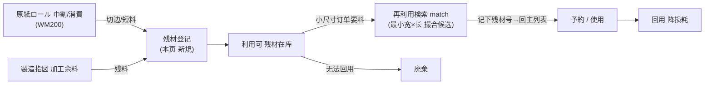
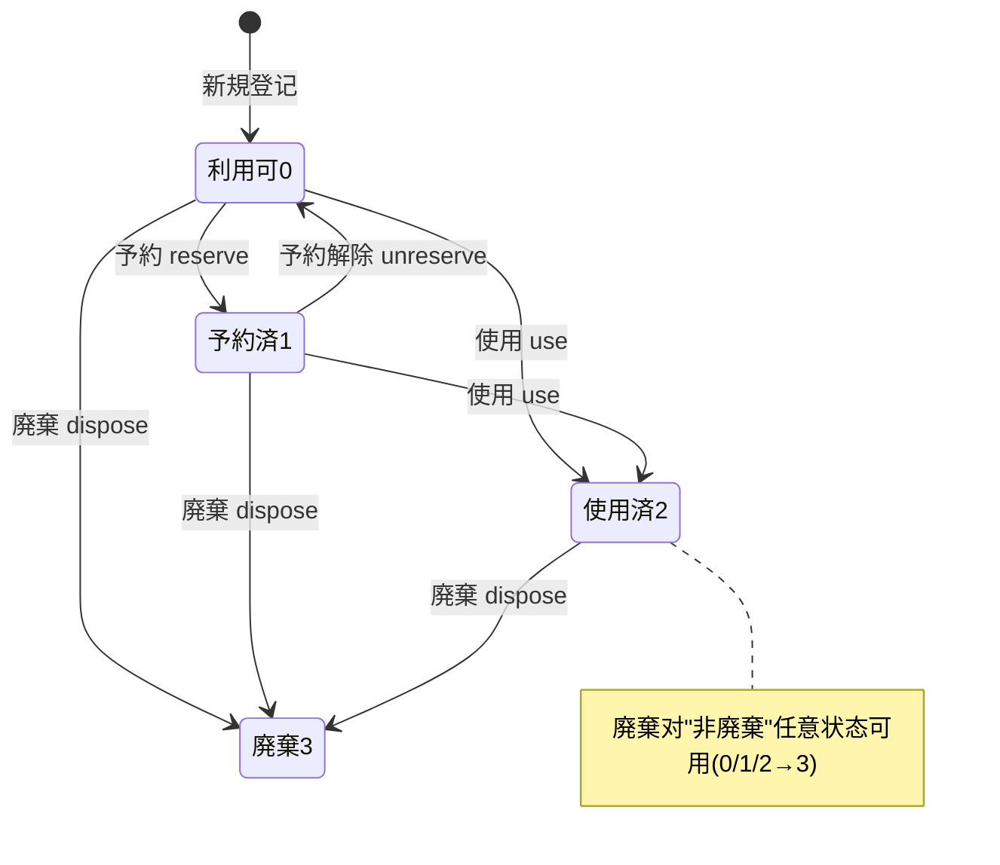

# 残材管理 单页面操作 SOP（手把手版）

> **用途**：给**纸器担当/库管现场登记加工余料、培训老师讲、测试人员拆用例**。比模块总册（`03-库存物流WMS` §5.19）更细。
> **页面**：残材管理（MSBBWM210 · 库存物流 WMS）　**路由**：`/wms/remnant`　**前端**：`views/wms/RemnantView.vue`　**API**：`api/wms/paperIndustry2.ts remnantApi`　**后端**：`Wms/RemnantController` → `RemnantService`
> **基准**：分支 `feat/wfs-inbox-core`，2026-06-29；后端实测 `docs/codemap-wms/05-紙器特化.md §4`（2026-06-22 权威），UI 经实读 view。
> **样例数据**：残材 `REM2026070001`、材質 `PAPER`、巾 `905mm`、長 `1200mm`、来源工单 `WO2026070001`、来源母卷 `ROLL2026070001`、倉庫 `W01`。

---

## 1. 页面一句话说明

**残材管理，就是把原紙巾割/裁切/加工后剩下的"切边、短料、非标碎料"现场登记成一笔残材库存，再按"最小宽×最小长"撮合给小尺寸订单回用——能复用就别当垃圾扔，降低损耗。** 残材走**专用表（`T_RemnantMaterial`）自管理，与主 `Stock` 表完全解耦、不走库存铁律**，状态只在自己表里迁移（利用可→予約済→使用済→廃棄）。

---

## 2. 这个页面在业务流程中的位置

- **上游**：原紙巾割/消費（WM200）或现场加工后产生的余料、切边、短料。
- **本页**：登记残材库存 + 撮合回用 + 状态流转。
- **下游**：被小尺寸订单回用（予約占用 / 使用消账）；无法回用则廃棄。**不联动主库存、不生成出库单**——纯独立专用表自管理。

---

## 3. 谁使用这个页面

| 角色 | 用途 |
|---|---|
| 纸器/调墨担当 | 巾割/裁切后登记切边·短料为残材库存 |
| 库管员 | 维护残材库位、撮合查询、予約/使用/廃棄 |
| 现场作业者 | 取小尺寸订单时先撮合查有无可用残材 |

---

## 4. 操作前准备

- [ ] 手里有要登记的残材实物：知道**材質（PAPER/FILM/OTHER）、巾(widthMm)、長(lengthMm)、数量、单位**。
- [ ] 备好**倉庫CD + 库位CD**（如 `W01` + 具体库位）——新建时**必填**。
- [ ] 能追溯来源的，记下**来源工单(sourceWorkOrderNo)/来源母卷(sourceRollNo)**（如 `WO2026070001` / `ROLL2026070001`，可空但建议填，便于血缘回溯）。
- [ ] 撮合回用前，清楚目标订单需要的**最小宽×最小长**（撮合按"≥下限"匹配）。

---

## 5. 页面区域说明

| 区域 | 内容 |
|---|---|
| 検索条件卡 | 残材NO / 材質 / 材質グレード / 状态 / 来源工单 + 「検索」「新規」「再利用検索」按钮 |
| 残材一覧表 | 每行：残材NO / 状态tag / 材質 / グレード / 巾mm / 長mm / 厚μm / 数量·単位 / 来源工单 / 来源母卷 / 倉庫 / 库位 / 予約先 / 登记时刻 + 行内操作按钮 |
| 新規 Dialog | 600px；材質*/グレード/巾*/長*/厚/数量*/単位/来源工单/来源母卷/倉庫*/库位*/备考（`*`必填） |
| 予約 Dialog | 420px；只有一个「予約先(reservedFor)」必填框 |
| 再利用検索 Dialog | 700px；顶部蓝色提示条 + 材質*/最小巾*/最小長* + 「検索」；下方候选表（**仅展示，无行内操作**） |

---

## 6. 字段填写说明（口语版）

**検索条件卡**：残材NO（模糊 contains）、材質（下拉 PAPER/FILM/OTHER）、材質グレード（精确）、状态（利用可/予約済/使用済/廃棄）、来源工单（精确）。

**新規 Dialog**：

| 字段 | 必填 | 怎么填 | 填错影响 |
|---|---|---|---|
| 材質(materialType) | 必填 | 下拉 PAPER/FILM/OTHER（默认 PAPER） | — |
| 材質グレード(materialGrade) | 可空 | 如 `K280`，≤20 字 | — |
| 巾(widthMm) | 必填 | >0，整数 mm（如 905） | ≤0→`Width / Length > 0` |
| 長(lengthMm) | 必填 | >0，整数 mm（如 1200） | ≤0→`Width / Length > 0` |
| 厚(thicknessUm) | 可空 | μm | — |
| 数量(quantity) | 必填 | >0，小数 4 位（默认 1） | ≤0→`Quantity > 0` |
| 単位(unitCd) | 可空 | 默认 `SHT`，≤10 字 | — |
| 来源工单(sourceWorkOrderNo) | 可空 | 如 `WO2026070001`，≤25 字（追溯） | — |
| 来源母卷(sourceRollNo) | 可空 | 如 `ROLL2026070001`，≤25 字（血缘追溯） | — |
| 倉庫(warehouseCd) | 必填 | 如 `W01`，≤10 字 | 空→`Warehouse / Location 必須` |
| 库位(locationCd) | 必填 | ≤30 字 | 空→`Warehouse / Location 必須` |
| 备考(remarks) | 可空 | 自由文本 | — |

**予約 Dialog**：予約先(reservedFor) 必填——填占用方（订单号/客户/工单等），空则前端 `wms.common.required` 提示，后端兜底 `reservedFor required`。

**再利用検索 Dialog**：材質*（默认 PAPER）、最小巾(minWidthMm)*（默认 500）、最小長(minLengthMm)*（默认 700）——撮合规则是"同材質 且 巾≥最小巾 且 長≥最小長 且 仅利用可"。

---

## 7. 按钮操作说明

| 按钮 | 位置 / 何时出现（按 status） | 点了会怎样 |
|---|---|---|
| 検索 | 検索卡常显 | 按条件刷新一覧（按登记时刻倒序，pageSize 100） |
| 新規 | 検索卡常显 | 开新規 Dialog；保存成功 toast `成功: REM号`（采番 `REM…`，status=利用可0） |
| 再利用検索 | 検索卡常显 | 开撮合 Dialog；输入材質+下限「検索」列候选 |
| 予約(reserve) | 行 status=0 利用可 | 弹予約先框；提交→status→予約済1、记 reservedFor |
| 予約解除(unreserve) | 行 status=1 予約済 | 确认→status→利用可0、清 reservedFor |
| 使用(use) | 行 status=0 或 1 | 确认→status→使用済2（消账，标记已回用） |
| 廃棄(dispose) | 行 status≠3（即 0/1/2 均可） | 确认→status→廃棄3 |

> 一覧行内**没有"编辑/删除"按钮**——Update/Delete 后端端点存在但 UI 未暴露（见 §10）。
> 再利用検索的候选表**只读、无任何行内按钮**——撮合到合适残材后，须**记下残材号→回主一覧**对该残材做予約/使用（无一键联动）。

---

## 8. 标准业务操作 SOP（照着点）

### 场景一：登记一笔残材（新規 · 主流程）
- **背景**：原紙巾割后剩一块 905×1200 的切边，要登记成残材备用。
- **样例数据**：材質 `PAPER`、巾 `905`、長 `1200`、数量 `1`、単位 `SHT`、来源工单 `WO2026070001`、来源母卷 `ROLL2026070001`、倉庫 `W01`、库位 `W01-REM-01`。
- **步骤**：1) 点「新規」；2) 填材質/巾/長/数量；3) 填来源工单·来源母卷（追溯）；4) 填倉庫`W01`+库位；5) 保存。
- **完成后检查**：toast `成功: REM2026070001`（采番 `REM`）；一覧顶部出现新行；状态 tag=**利用可（绿）**；不影响主 `Stock` 在库。
- **异常**：巾/長≤0→`Width / Length > 0`；倉庫或库位空→`Warehouse / Location 必須`；数量≤0→`Quantity > 0`。
- **用例**：TC-M06-REMNANT-006~010。

### 场景二：再利用撮合查询（match · 找可回用残材）
- **背景**：来了个小尺寸订单，要 ≥800×≥1000 的 PAPER，先看库里有没有现成残材。
- **步骤**：1) 点「再利用検索」；2) 材質选 `PAPER`、最小巾填 `800`、最小長填 `1000`；3)「検索」；4) 候选表列出**所有利用可且 巾≥800 且 長≥1000 的 PAPER**（按巾、長升序，优先用最贴近尺寸的）。
- **检查**：候选含 `REM2026070001`（905×1200 满足）；**予約済/使用済/廃棄的不出现**；候选表**无操作按钮**——记下 `REM2026070001`。
- **盲点**：撮合**不消費、不下单、不锁定**，仅展示候选；要占用/消账须回主一覧操作（见场景三/四）。
- **用例**：TC-M06-REMNANT-011~015。

### 场景三：予約占用 + 予約解除（reserve / unreserve）
- **背景**：撮合到 `REM2026070001`，先占住防止被别人抢；后来订单取消，释放。
- **步骤（予約）**：主一覧找到该利用可残材→「予約」→填予約先（如订单号 `SO2026070088`）→保存。
- **步骤（解除）**：对予約済残材→「予約解除」→确认。
- **检查**：予約→status=**予約済（橙）**、予約先列显示 `SO2026070088`；解除→回**利用可（绿）**、予約先清空。
- **异常**：予約先空→`wms.common.required` 提示（不提交）；对非利用可残材予約→`WM-MSG-043: 利用可のみ予約可`；对非予約済残材解除→`WM-MSG-043: 予約済のみ解除可`。
- **用例**：TC-M06-REMNANT-016~020。

### 场景四：使用消账（use · 回用落地）
- **背景**：残材真的被裁去用了，标记使用済。
- **步骤**：对**利用可或予約済**残材→「使用」→确认。
- **检查**：status=**使用済（灰）**；该残材不再出现在再利用検索候选；使用済仍可廃棄（非3均可）。
- **异常**：对已使用済/廃棄残材再「使用」→`WM-MSG-043: 既に終了状态`。
- **用例**：TC-M06-REMNANT-021~023。

### 场景五：廃棄（dispose · 无法回用）
- **背景**：残材脏污/受潮无法回用，作废。
- **步骤**：任意**非廃棄**残材（利用可/予約済/使用済均可）→「廃棄」→确认。
- **检查**：status=**廃棄（红）**；行内只剩……无可用按钮（status=3 不显示任何操作）。
- **异常**：对已廃棄残材再「廃棄」→`WM-MSG-043: 既に廃棄`。
- **用例**：TC-M06-REMNANT-024、025。

### 场景六：条件检索/筛选（search）
- **背景**：找某来源工单产出的全部残材，或只看利用可的。
- **步骤**：検索卡填残材NO（模糊）/材質/状态/来源工单→「検索」。
- **检查**：命中按登记时刻倒序；状态筛选精确匹配。
- **用例**：TC-M06-REMNANT-001~005。

### 场景七：状态守卫错误链（WM-MSG-043 复用验证）
- **背景**：验证四个迁移动作的状态前置都被后端守卫。
- **步骤**：分别对"非利用可予約 / 非予約済解除 / 已终了使用 / 已廃棄廃棄"触发动作。
- **检查**：全部返回 `WM-MSG-043`（同一码、不同文案），状态不变、不落库。
- **用例**：TC-M06-REMNANT-018、020、023、025。

---

## 9. 状态变化说明

| status | 名称 | tag 颜色 | 可用动作 |
|---|---|---|---|
| 0 | 利用可(Available) | 绿(success) | 予約 / 使用 / 廃棄 |
| 1 | 予約済(Reserved) | 橙(warning) | 予約解除 / 使用 / 廃棄 |
| 2 | 使用済(Used) | 灰(info) | 廃棄 |
| 3 | 廃棄(Disposed) | 红(danger) | （无） |

> **守卫规则**：予約仅 status0 / 予約解除仅 status1 / 使用仅 status0‖1 / 廃棄仅非3。违反一律 `WM-MSG-043`。

---

## 10. 按钮不可用 / 灰色原因

| 现象 | 原因 |
|---|---|
| 行内无「予約」 | 非利用可(0) |
| 行内无「予約解除」 | 非予約済(1) |
| 行内无「使用」 | 已使用済(2)或廃棄(3) |
| 行内无「廃棄」 | 已廃棄(3) |
| 廃棄行无任何按钮 | status=3 终态 |
| 全页找不到"编辑/删除" | **UI 未暴露 Update/Delete 入口**（后端 `PUT/DELETE /wms/remnant/{no}` 存在，但 view 无按钮；登记后想改字段当前只能走 API 或重登记） |
| 再利用検索候选无"预约/使用" | **撮合表设计为只读**，无一键联动（记残材号回主一覧操作） |

---

## 11. 常见错误与处理

| 错误 | 原因 | 处理 |
|---|---|---|
| `Width / Length > 0` | 新建巾或長≤0 | 填正整数尺寸 |
| `Warehouse / Location 必須` | 倉庫或库位空 | 两者都必填 |
| `Quantity > 0` | 数量≤0 | 填>0 数量 |
| `wms.common.required`（予約先必填） | 予約时予約先空 | 填占用方 |
| `WM-MSG-043: 利用可のみ予約可` | 对非利用可残材予約 | 仅利用可可予約 |
| `WM-MSG-043: 予約済のみ解除可` | 对非予約済残材解除 | 仅予約済可解除 |
| `WM-MSG-043: 既に終了状态` | 对使用済/廃棄再使用 | 终态不可再使用 |
| `WM-MSG-043: 既に廃棄` | 对已廃棄再廃棄 | 已是终态 |
| `WM-MSG-070` | 残材NO 不存在 | 核对残材号（GetTracked 抛此码） |
| 登记后字段填错改不掉 | UI 无编辑入口 | 走 API 改 / 廃棄后重登记 |

---

## 12. 操作完成后的检查清单

- [ ] 新規：toast `成功: REM号`、采番 `REM…`、一覧顶部出现新行、status=利用可(0)。
- [ ] 残材**独立专用表自管理**：登记/予約/使用/廃棄**均不动主 `Stock`**、不生成库存流水 Txn（不走铁律）。
- [ ] 予約：status→1、予約先列有值；解除：status→0、予約先清空。
- [ ] 使用：status→2，该残材从再利用候选中消失。
- [ ] 廃棄：status→3，行内无可用按钮。
- [ ] 再利用検索：仅列**利用可且≥下限**候选，**不消費/不下单/不锁定**；候选无行内操作。
- [ ] 状态守卫：四个非法迁移全部 `WM-MSG-043`、不落库。

---

## 13. 页面级测试用例（≥25 条，可执行）

> 编号 `TC-M06-REMNANT-xxx`；数据用样例（残材 `REM2026070001`、PAPER、905×1200、来源工单 `WO2026070001`、来源母卷 `ROLL2026070001`、倉庫 `W01`）。

| 用例编号 | 用例名称 | 优先级 | 前置条件 | 测试数据 | 操作步骤 | 预期结果 | 下游检查 | 备注 |
|---|---|---|---|---|---|---|---|---|
| TC-M06-REMNANT-001 | 一覧加载倒序 | P1 | 有残材数据 | — | 进页面 | 按登记时刻倒序、pageSize 100 | — | onMounted reload |
| TC-M06-REMNANT-002 | 按残材NO模糊检索 | P1 | 有残材 | REM2026 | 填NO→検索 | 含该串的命中 | — | contains |
| TC-M06-REMNANT-003 | 按材質筛选 | P2 | 多材質 | PAPER | 选材質→検索 | 仅 PAPER | — | 精确 |
| TC-M06-REMNANT-004 | 按状态筛选 | P2 | 多状态 | 利用可0 | 选状态→検索 | 仅 status=0 | — | 精确 |
| TC-M06-REMNANT-005 | 按来源工单检索 | P2 | 有来源 | WO2026070001 | 填来源工单→検索 | 该工单产出残材 | — | 追溯 |
| TC-M06-REMNANT-006 | 新建残材成功 | P0 | — | PAPER/905/1200/W01 | 新規→填→保存 | `成功: REM号`、status=利用可0 | 不动 Stock | 核心 |
| TC-M06-REMNANT-007 | 巾≤0 拦截 | P0 | 新規 | 巾=0 | 保存 | `Width / Length > 0` | 不落库 | — |
| TC-M06-REMNANT-008 | 長≤0 拦截 | P0 | 新規 | 長=0 | 保存 | `Width / Length > 0` | 不落库 | — |
| TC-M06-REMNANT-009 | 仓库/库位空拦截 | P0 | 新規 | 倉庫空 | 保存 | `Warehouse / Location 必須` | 不落库 | — |
| TC-M06-REMNANT-010 | 数量≤0 拦截 | P0 | 新規 | 数量=0 | 保存 | `Quantity > 0` | 不落库 | — |
| TC-M06-REMNANT-011 | 撮合命中候选 | P0 | 有利用可残材 | PAPER/800/1000 | 再利用検索→検索 | 列 905×1200 等≥下限 | — | match |
| TC-M06-REMNANT-012 | 撮合下限筛除 | P1 | 残材巾<下限 | 最小巾=1000 | 検索 | 巾905的不出现 | — | ≥下限 |
| TC-M06-REMNANT-013 | 撮合仅利用可 | P0 | 有予約済/使用済 | PAPER/500/700 | 検索 | 仅 status=0 候选 | — | 状态过滤 |
| TC-M06-REMNANT-014 | 撮合排序 | P2 | 多候选 | — | 検索 | 按巾→長升序 | — | OrderBy |
| TC-M06-REMNANT-015 | 撮合无联动 | P1 | 有候选 | — | 看候选表 | 无预约/使用行内按钮 | — | 盲点 |
| TC-M06-REMNANT-016 | 予約成功 | P0 | status=0 | 予約先 SO2026070088 | 予約→填→保存 | status→予約済1、予約先有值 | 不动 Stock | — |
| TC-M06-REMNANT-017 | 予約先空拦截 | P0 | status=0 | 予約先空 | 予約→保存 | `wms.common.required` 提示 | 不提交 | 前端+后端兜底 |
| TC-M06-REMNANT-018 | 非利用可予約拦截 | P1 | status≠0 | 予約済残材 | 触发 reserve | `WM-MSG-043: 利用可のみ予約可` | 不落库 | 守卫 |
| TC-M06-REMNANT-019 | 予約解除成功 | P1 | status=1 | — | 予約解除→确认 | status→利用可0、予約先清空 | — | — |
| TC-M06-REMNANT-020 | 非予約済解除拦截 | P1 | status≠1 | 利用可残材 | 触发 unreserve | `WM-MSG-043: 予約済のみ解除可` | 不落库 | 守卫 |
| TC-M06-REMNANT-021 | 利用可→使用 | P0 | status=0 | — | 使用→确认 | status→使用済2 | 撮合不再出现 | — |
| TC-M06-REMNANT-022 | 予約済→使用 | P1 | status=1 | — | 使用→确认 | status→使用済2 | — | 0‖1 均可 |
| TC-M06-REMNANT-023 | 终了状态再使用拦截 | P1 | status=2/3 | 使用済残材 | 触发 use | `WM-MSG-043: 既に終了状态` | 不落库 | 守卫 |
| TC-M06-REMNANT-024 | 廃棄成功 | P1 | status≠3 | 利用可/予約済/使用済 | 廃棄→确认 | status→廃棄3 | — | 非3均可 |
| TC-M06-REMNANT-025 | 重复廃棄拦截 | P1 | status=3 | 已廃棄残材 | 触发 dispose | `WM-MSG-043: 既に廃棄` | 不落库 | 守卫 |
| TC-M06-REMNANT-026 | 按钮随状态显隐 | P2 | 各状态残材 | — | 看操作列 | 0=予約·使用·廃棄/1=解除·使用·廃棄/2=廃棄/3=无 | — | UI |
| TC-M06-REMNANT-027 | 状态tag颜色 | P3 | 各状态 | — | 看状态列 | 0绿/1橙/2灰/3红 | — | — |
| TC-M06-REMNANT-028 | 采番 REM 顺采 | P2 | 连续新建 | — | 连建两笔 | 残材号 REM 连号唯一 | — | NextAsync |
| TC-M06-REMNANT-029 | 来源母卷追溯显示 | P2 | 有来源 | ROLL2026070001 | 看一覧 | 来源母卷列显示 | — | 血缘 |
| TC-M06-REMNANT-030 | registeredAt 借词条 | P3 | — | — | 看登记时刻列 | 用 `wms.sample.fld.registeredAt` | — | 诚实标注·借 sample 词条 |
| TC-M06-REMNANT-031 | 不走库存铁律 | P1 | 有 Stock | 全动作 | 登记/予約/使用/廃棄 | 主 Stock 与流水 Txn 不变 | 在庫照会核对 | 解耦 |
| TC-M06-REMNANT-032 | 不存在残材操作 | P2 | — | 错残材号 | 任意动作 | `WM-MSG-070` | — | GetTracked |
| TC-M06-REMNANT-033 | 权限不足 | P2 | 无权账号 | — | 进页面/操作 | 待业务确认(隐藏/拒绝) | — | 权限 |
| TC-M06-REMNANT-034 | 网络异常 | P2 | 断网 | — | 保存 | 友好错误可重试 | — | — |

---

## 14. 培训讲解建议

| 顺序 | 讲什么 | 演示 | 易误解点 |
|---|---|---|---|
| 1 | 残材=别扔的余料 | §2 流程图 | 以为残材会进主库存 |
| 2 | 独立表不走铁律 | 登记后看 Stock 不变 | 以为登记=入库 |
| 3 | 撮合是"找候选"不是"下单" | 再利用検索演示 | 以为撮合会自动锁料/出库 |
| 4 | 撮合后要回主列表操作 | 记残材号→予約 | 找一键"预约/使用"按钮 |
| 5 | 四状态四动作的守卫 | 演四个 WM-MSG-043 | 任意状态都能随便点 |
| 6 | 登记后 UI 改不了 | 讲无编辑/删除入口 | 想直接改字段 |

---

## 15. 与模块级手册的关系

对应 `03-库存物流WMS-最详细用户操作培训手册.md` §5.19 紙器業特化类「残材管理 WM210(/remnant)」行。验收 §8 关联 AC-M06-11（紙器特化解耦：残材独立专用表不走铁律）。同 §5.19 兄弟页：原紙ロール WM200 / 版型在庫 WM220 / インキ WM230 / パレット WM240 / サンプル WM260。

---

## 16. 代码与文档来源

| 层 | 文件 |
|---|---|
| 逐行源码手册 | `docs/codemap-wms/05-紙器特化.md §4 残材`（权威，2026-06-22） |
| 前端 | `cp6.web/src/views/wms/RemnantView.vue` |
| API/类型 | `cp6.web/src/api/wms/paperIndustry2.ts`(remnantApi)、`cp6.web/src/types/wms/wms.ts`(RemnantMaterial/RemnantSearchQuery) |
| 后端 | `CP6.WebApi/Controllers/Wms/RemnantController.cs`、`CP6.Core/Services/Wms/RemnantService.cs` |
| 实体/常量 | `RemnantMaterial.cs`、`RemnantStatus`(Available0/Reserved1/Used2/Disposed3)、`WmsSequenceService`(采番 `REM`) |
| i18n | `cp6.web/src/i18n/keys.generated.ts`(`wms.remnant.*`；登记时刻列借 `wms.sample.fld.registeredAt`) |

---

## 最后更新来源

- 代码：见 §16（codemap-wms 05 §4 + RemnantService/Controller 实读 + view/types/api 实读 + router 确认路由 `/wms/remnant`）。
- 基准：分支 `feat/wfs-inbox-core`，2026-06-29（codemap 2026-06-22）。
- 覆盖：16 节 / 7 场景 / 34 用例（TC-M06-REMNANT-001~034）。
- 诚实标注：①UI 无编辑/删除按钮（后端 PUT/DELETE 存在）；②再利用検索候选表只读无一键联动；③登记时刻列借用 `wms.sample.fld.registeredAt` 词条；④新规校验为裸文本（`Width / Length > 0` 等）非 WM-MSG 码，仅状态守卫/不存在用 `WM-MSG-043/070`。
