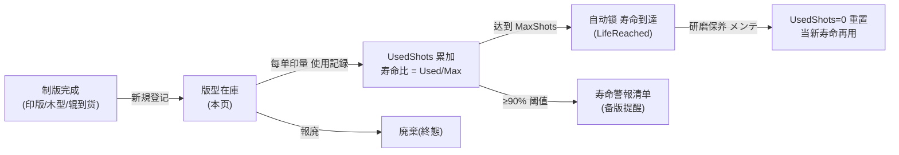

# 版型在庫（印版・木型） 单页面操作 SOP（手把手版）

> **用途**：给**制版/资产担当操作、培训老师讲、测试人员拆用例**。比模块总册（`03-库存物流WMS` §5.19）更细。
> **页面**：版型在庫（WM220 · 库存物流 WMS · 紙器業特化）　**路由**：`/wms/plate-mold-stock`　**前端**：`views/wms/PlateMoldView.vue`　**API**：`api/wms/paperIndustry2.ts plateMoldApi`　**后端**：`Wms/PlateMoldController` → `PlateMoldService`（`RecordUsageAsync` / `CompleteMaintenanceAsync` / `WarningListAsync`）
> **基准**：分支 `feat/wfs-inbox-core`，2026-06-29；后端实测 `docs/codemap-wms/05-紙器特化.md` §9（2026-06-22 权威），UI 经实读 `PlateMoldView.vue` + `types/wms/wms.ts`。
> **样例数据**：版型 `PLT2-2026070001`、種別 `PLATE`(印版)、客户 `CUST-A`、製品 `PRD2026070001`、最大打数 MaxShots `100000`、当前 UsedShots `95000`（已用 95%）。

---

## 1. 页面一句话说明

**版型在庫，就是制版/资产担当登记并管理"印版・木型・圆压辊"这类印刷工装资产的地方——每块版按"shots(打数/耐印数)"记寿命，每印一单把印量计入 `UsedShots`，累计到 `MaxShots` 系统自动把它锁成"寿命到達"防误用；接近寿命（默认 90%）会进寿命警報清单提醒备版；研磨保养后打数清零、当新寿命重新起算。** 它是版型这类专用资产"还能印多少、要不要换/磨"的唯一台账。

> ⚠️ **不走库存铁律**：版型用**独立专用表**（`T_PlateMoldStock`）自管理在库，**不**经 `IStockMovementService`、**不**写主 `Stock` 表、**不**产生库存 Txn，状态只在自身表内迁移（与原紙/インキ/パレット/残材/サンプル一致）。

---

## 2. 这个页面在业务流程中的位置

- **上游**：制版完成 / 工装到货——人工"新規"登记版型卡（含種別、客户、製品、MaxShots）。
- **本页**：登记、使用记录(累加 shots)、寿命预警、保养重置、廃棄。
- **下游**：无系统接缝（不联动主库存、不联动 MES/受注）；寿命到達/警報供现场人工决策"换版/备版/磨版"。

---

## 3. 谁使用这个页面

| 角色 | 用途 |
|---|---|
| 制版/资产担当 | 新規登记版型、按单记使用打数、保养、廃棄 |
| 印刷現場担当 | 印完一单后录入本单印量（使用記録） |
| 生产/调度 | 看寿命警報清单，提前备版换版 |

---

## 4. 操作前准备

- [ ] 版型实物已制版完成 / 到货，知道它的種別（PLATE/MOLD/CYL/OTHER）。
- [ ] 知道该版的最大耐印数 `MaxShots`（如 `100000`）——**不填则永不自动锁寿命**（系统只在 `MaxShots` 有值时才判到达）。
- [ ] 记使用打数前，确认目标版处于**使用可(0)** 状态（仅此状态可记录）。
- [ ] 客户CD（如 `CUST-A`）、製品CD（如 `PRD2026070001`）准备好，便于检索归集。

---

## 5. 页面区域说明

| 区域 | 内容 |
|---|---|
| 检索条 | 版型NO / 種別(下拉) / 客户CD / 製品CD / 状态(下拉) + 「检索」「新規」「寿命警報」三按钮 |
| 一覧表 | 每行：版型NO / 状态 tag / 種別 / 客户 / 製品CD / 製品名 / 色数 / サイズ / **寿命比(进度条 Used/Max)** / 最終使用 / 次回保養 + 操作列 |
| 新規 Dialog | 700px；蓝色提示"寿命自动累计"；種別/色数/客户/製品/サイズ/制作日/制作原価/MaxShots/次回保養/倉庫/ロケ/備考 |
| 使用記録 Dialog | 420px；显示当前 `Used/Max` tag + 本次打数 shots（≥1 必填） |
| メンテ開始 Dialog | 420px；橙色警告"保养完了将重置打数"；次回保養日 |
| 寿命警報 Dialog | 800px；列出 Used/Max ≥ 90% 的版型（降序），带寿命进度条 |

---

## 6. 字段填写说明（口语版）

**检索条**：版型NO（模糊）、種別（PLATE 印版/MOLD 木型/CYL 圆压辊/OTHER 其他）、客户CD、製品CD、状态（使用可/保養中/寿命到達/廃棄）。

**新規 Dialog**：

| 字段 | 必填 | 怎么填 | 说明 |
|---|---|---|---|
| 種別 plateType | ✅ | 下拉选 PLATE/MOLD/CYL/OTHER | 默认 PLATE |
| 色数 colorCount | — | 1~12（默认 4） | 印版色数 |
| 客户CD customerCd | — | 如 `CUST-A` | 归集用 |
| 客户名 customerName | — | 如 `A 社` | **借用 vmi 词条 `wms.vmi.fld.customerName`**（见 §盲点） |
| 製品CD productCd | — | 如 `PRD2026070001` | |
| 製品名 productName | — | 文本 | |
| サイズ sizeNote | — | 如 `540×750` | 自由文本 |
| 制作日 madeDate | — | 日期 | |
| 制作原価 madeCost | — | ≥0，2 位小数 | 资产成本 |
| **最大打数 maxShots** | — | 如 `100000` | **不填→永不自动锁寿命** |
| 次回保養日 nextMaintenanceDate | — | 日期 | |
| 倉庫CD / ロケCD | — | 存放位置文本 | 仅记录、不引主库位 |
| 備考 remarks | — | 文本 | |

> 新建后系统自动采番 `PLT2-yyyymm####`，状态=使用可(0)，UsedShots=0。

**使用記録 Dialog**：

| 字段 | 必填 | 怎么填 | 填错影响 |
|---|---|---|---|
| 本次打数 shots | ✅ | ≥1（如 `5000`） | 前端 `≤0` 直接前端拦"必填"提示，不发请求 |

**メンテ開始 Dialog**：次回保養日（可空）。

---

## 7. 按钮操作说明

| 按钮 | 何时出现（按行 status） | 点了会怎样 |
|---|---|---|
| 检索 | 检索条常显 | 按条件刷新一覧 |
| 新規 | 检索条常显 | 开新規 Dialog；保存成功 toast `成功: {版型NO}` |
| 寿命警報 | 检索条常显 | 拉 `warnings(0.9)`，列出 Used/Max≥90% 版型（降序） |
| 使用記録 | **仅 0 使用可** | 累加 `UsedShots += shots`、写最終使用时刻；若 `MaxShots` 有值且累计`≥MaxShots`→自动锁**寿命到達(2)** |
| メンテ開始 | **0 使用可 / 2 寿命到達** | 状态→保養中(1)，记次回保養日 |
| メンテ完了 | **仅 1 保養中** | 状态→使用可(0)、**`UsedShots=0` 重置**（翻新后当新寿命起算） |
| 廃棄 | **status≠3** | 二次确认后状态→廃棄(3)（終態，不可逆） |

> - 使用記録只在"使用可(0)"出现：保養中/寿命到達/廃棄均**无**此按钮（后端再加 `WM-MSG-043` 兜底）。
> - 寿命到達(2)想再用，须走"メンテ開始→メンテ完了"翻新闭环（重置打数）。
> - 一覧的「廃棄」走 `POST .../discard`（软状态置 3）；API 另有硬 `DELETE` 端点但**前端无入口**。

---

## 8. 标准业务操作 SOP（照着点）

### 场景一：新規登记一块印版
- **背景**：新制版的印版入台账。
- **样例数据**：種別 `PLATE`、客户 `CUST-A`、製品 `PRD2026070001`、サイズ `540×750`、MaxShots `100000`。
- **前置**：无。
- **步骤**：1) 点「新規」；2) 選種別 PLATE，填客户/製品/サイズ/MaxShots；3) 点「保存」。
- **完成后检查**：toast `成功: PLT2-2026070001`；一覧出现新行，状态=**使用可(绿 tag)**，寿命比 `0 / 100,000`，进度条 0% 绿。
- **异常**：種別必填，未选无法保存；MaxShots 不填→该版永不自动锁寿命。
- **用例**：TC-M06-PLATEMOLD-001~003。

### 场景二：印完一单 记使用打数（正常累加）
- **背景**：印刷現場印完一单，把本单印量计入版寿命。
- **样例数据**：`PLT2-2026070001`（当前 90,000/100,000）、本次 `shots=5000`。
- **前置**：版处于使用可(0)。
- **步骤**：1) 检索出该版；2) 行「使用記録」；3) 填本次打数 5000；4) 「使用記録」确定。
- **完成后检查**：toast 成功；UsedShots 90,000→**95,000**，最終使用=当前时刻；寿命比 `95,000 / 100,000`，进度条 95% **橙色(warning)**；状态仍使用可(0)。
- **异常**：本次打数 ≤0→前端"必填"拦截、不发请求。
- **用例**：TC-M06-PLATEMOLD-004、005、006、016。

### 场景三：累计达到 MaxShots 自动锁"寿命到達"
- **背景**：又印一单，恰好到/超耐印数。
- **样例数据**：`PLT2-2026070001`（95,000/100,000）、本次 `shots=6000`。
- **前置**：版使用可(0)，有 MaxShots。
- **步骤**：行「使用記録」→填 6000→确定。
- **完成后检查**：UsedShots=101,000 **≥ MaxShots 100,000**→状态自动锁**寿命到達(2，红 tag)**；进度条封顶 100% **异常色(exception)**；「使用記録」按钮消失，再点不到。
- **异常**：若 MaxShots 为空，则永不触发自动锁（一直停使用可）。
- **用例**：TC-M06-PLATEMOLD-007、008。

### 场景四：寿命警報——提前备版
- **背景**：调度想看哪些版快到寿命该备版。
- **样例数据**：阈值固定 0.9。
- **前置**：库内有 Used/Max≥90% 的版。
- **步骤**：点「寿命警報」。
- **完成后检查**：弹框列出所有 `UsedShots/MaxShots ≥ 0.9` 的版（**降序**），含寿命进度条；`PLT2-2026070001`(95%)在列。
- **异常**：**阈值 0.9 前端写死、无 UI 可调**（见盲点）；无 MaxShots 的版不参与（除以 Max 无意义）。
- **用例**：TC-M06-PLATEMOLD-009、010、011。

### 场景五：研磨保养闭环——打数重置
- **背景**：版面磨损，送研磨翻新。
- **样例数据**：`PLT2-2026070001`、次回保養日 `2026-09-30`。
- **前置**：版处于使用可(0) 或 寿命到達(2)。
- **步骤**：1) 行「メンテ開始」→填次回保養日→确定（状态→**保養中(1)**）；2) 研磨回厂后行「メンテ完了」→二次确认→确定。
- **完成后检查**：状态→**使用可(0)**；**UsedShots 归 0**（`0 / 100,000`，进度条 0% 绿）；翻新后当新寿命重新计。
- **异常**：保養中(1) 只剩「メンテ完了」「廃棄」；非保養中点不到「メンテ完了」。
- **用例**：TC-M06-PLATEMOLD-012、013、014、017。

### 场景六：寿命到達版翻新再用
- **背景**：已锁寿命到達的版，研磨后想继续用。
- **样例数据**：`PLT2-2026070001`（寿命到達 2）。
- **前置**：状态=寿命到達(2)。
- **步骤**：「メンテ開始」(2→1)→研磨→「メンテ完了」(1→0，打数清零)。
- **完成后检查**：从寿命到達(2)绕回使用可(0)，可再次「使用記録」。
- **异常**：寿命到達(2) 状态下**不能直接**使用記録（无按钮 + 后端 `WM-MSG-043`），必须经翻新闭环。
- **用例**：TC-M06-PLATEMOLD-018、019。

### 场景七：在非使用可状态记使用被拦
- **背景**：误对保養中/寿命到達的版记使用。
- **步骤**：（绕过 UI 直发 `POST .../use`）对 status≠0 的版记 shots。
- **检查**：后端 `RecordUsageAsync` 抛 `WM-MSG-043`（使用可状态のみ記録可），不累加。
- **用例**：TC-M06-PLATEMOLD-020、021。

### 场景八：版報廃
- **背景**：版裂/客户停产，永久作废。
- **样例数据**：`PLT2-2026070001`。
- **前置**：status≠3。
- **步骤**：行「廃棄」→二次确认。
- **完成后检查**：状态→**廃棄(3，灰 tag)**；该行只剩状态展示、无任何动作按钮（終態不可逆）。
- **用例**：TC-M06-PLATEMOLD-022、023。

---

## 9. 状态变化说明

```mermaid
stateDiagram-v2
  [*] --> 使用可0: 新規登记(UsedShots=0)
  使用可0 --> 使用可0: 使用記録(UsedShots+=shots, 未到MaxShots)
  使用可0 --> 寿命到達2: 使用記録(UsedShots>=MaxShots 自动锁)
  使用可0 --> 保養中1: メンテ開始
  寿命到達2 --> 保養中1: メンテ開始(翻新)
  保養中1 --> 使用可0: メンテ完了(UsedShots=0 重置)
  使用可0 --> 廃棄3: 廃棄
  保養中1 --> 廃棄3: 廃棄
  寿命到達2 --> 廃棄3: 廃棄
  廃棄3 --> [*]
  note right of 寿命到達2: 仅 MaxShots 有值才会到达;\n寿命到達不能直接使用記録,\n须经 メンテ開始→完了 翻新
```

- 寿命进度条三色：`Used/Max < 90%` 绿(success)；`≥90% 且 <100%` 橙(warning)；`≥100%` 异常红(exception)。
- 无 `MaxShots` 的行不显示进度条（分母为空）。

---

## 10. 按钮不可用 / 灰色原因

| 现象 | 原因 |
|---|---|
| 行无「使用記録」 | 非使用可(0)（保養中/寿命到達/廃棄都没有） |
| 行无「メンテ完了」 | 非保養中(1) |
| 行无「メンテ開始」 | 非使用可(0) 且非寿命到達(2) |
| 行无「廃棄」 | 已是廃棄(3，終態) |
| 寿命警報阈值改不了 | **前端写死 0.9，无 UI 入口**（见盲点） |
| 想"编辑"已有版的字段 | API 有 `PUT`，但**前端无编辑入口**（只能新規/使用記録/保养/廃棄） |
| 找硬删除 | API 有 `DELETE`，但前端「廃棄」走软状态 `discard`，**无硬删入口** |

---

## 11. 常见错误与处理

| 错误 | 原因 | 处理 |
|---|---|---|
| `WM-MSG-043`（使用可状態のみ記録可） | 对非使用可(0)版记使用 | 先看状态；寿命到達须先翻新(メンテ開始→完了) |
| `WM-MSG-070` | 版型不存在/版型NO 错 | 核对版型NO |
| 前端"必填"提示（不发请求） | 使用打数 ≤0 | 填 ≥1 的打数 |
| 记了使用寿命没变 | 看错版/未刷新 | 重新检索确认 UsedShots/最終使用 |
| 到 MaxShots 没自动锁 | 该版 **MaxShots 为空** | 编辑录入 MaxShots（注意前端无编辑入口，需后端/重建） |
| 保养后还显示旧打数 | 未点「メンテ完了」(只点了開始) | 完成研磨后必须「メンテ完了」才重置 |

---

## 12. 操作完成后的检查清单

- [ ] 新規：toast `成功: {版型NO}`（采番 `PLT2-…`），状态=使用可(0)，UsedShots=0。
- [ ] 使用記録：`UsedShots` 增加 = 本次 shots；最終使用=当前时刻；进度条/三色随比例更新。
- [ ] 自动锁寿命：`UsedShots ≥ MaxShots`（且 MaxShots 有值）→状态=寿命到達(2)，「使用記録」消失。
- [ ] 保养闭环：メンテ開始→保養中(1)；メンテ完了→使用可(0) 且 **UsedShots=0**。
- [ ] 寿命警報：列出 Used/Max≥0.9（降序），无 MaxShots 的不在列。
- [ ] 廃棄：状态=廃棄(3)，無動作按钮、不可逆。
- [ ] **全程不影响主库存**：无 Stock Txn、不写主 Stock 表（专用表自管理）。

---

## 13. 页面级测试用例（≥25 条，可执行）

> 编号 `TC-M06-PLATEMOLD-xxx`；数据用样例（`PLT2-2026070001` / `PLATE` / `CUST-A` / `PRD2026070001` / MaxShots 100000 / UsedShots 95000）。

| 用例编号 | 用例名称 | 优先级 | 前置条件 | 测试数据 | 操作步骤 | 预期结果 | 下游检查 | 备注 |
|---|---|---|---|---|---|---|---|---|
| TC-M06-PLATEMOLD-001 | 新規登记印版 | P0 | 无 | PLATE/CUST-A/PRD2026070001/Max100000 | 新規→填→保存 | toast`成功:PLT2-…`、状态使用可0、Used0 | 不写主Stock | 采番PLT2 |
| TC-M06-PLATEMOLD-002 | 種別必填 | P1 | 新規Dialog | 不选種別 | 保存 | 種別 required 拦截 | — | 默认PLATE |
| TC-M06-PLATEMOLD-003 | 不填MaxShots | P1 | 无 | maxShots空 | 新規保存 | 成功;进度条不显示;永不自动锁 | — | 边界 |
| TC-M06-PLATEMOLD-004 | 使用記録累加 | P0 | 使用可0 | 90000→shots5000 | 使用記録→5000→确定 | Used→95000、最終使用更新 | 无Txn | 核心 |
| TC-M06-PLATEMOLD-005 | 使用後寿命比橙色 | P1 | Used95000/Max100000 | — | 看进度条 | 95%橙色warning | — | 三色 |
| TC-M06-PLATEMOLD-006 | 打数≤0前端拦 | P0 | 使用記録Dialog | shots=0 | 确定 | "必填"提示、不发请求 | 不落库 | 前端校验 |
| TC-M06-PLATEMOLD-007 | 累计达MaxShots自动锁 | P0 | Used95000有Max | shots6000 | 使用記録→确定 | Used101000、状态→寿命到達2 | — | 自动锁 |
| TC-M06-PLATEMOLD-008 | 到达后进度条异常色 | P1 | 寿命到達2 | Used≥Max | 看进度条 | 封顶100%异常红 | — | exception |
| TC-M06-PLATEMOLD-009 | 寿命警報列近寿命 | P1 | 有≥90%版 | 阈值0.9 | 点寿命警報 | 列出Used/Max≥0.9降序 | — | warnings(0.9) |
| TC-M06-PLATEMOLD-010 | 警報降序排列 | P2 | 多版≥90% | 95%/92% | 看弹框 | 高比例在前 | — | 降序 |
| TC-M06-PLATEMOLD-011 | 无MaxShots不入警報 | P2 | 版Max空 | — | 点寿命警報 | 该版不在列 | — | 分母空 |
| TC-M06-PLATEMOLD-012 | メンテ開始转保養中 | P0 | 使用可0 | 次回保養2026-09-30 | メンテ開始→确定 | 状态→保養中1、记保養日 | — | — |
| TC-M06-PLATEMOLD-013 | メンテ完了重置打数 | P0 | 保養中1 | — | メンテ完了→确认 | 状态→使用可0、Used=0 | — | 重置 |
| TC-M06-PLATEMOLD-014 | 重置后进度条归零 | P1 | 刚メンテ完了 | — | 看进度条 | 0/100000、0%绿 | — | — |
| TC-M06-PLATEMOLD-015 | 检索按種別 | P1 | 有数据 | type=PLATE | 选種別→检索 | 仅PLATE行 | — | 列表 |
| TC-M06-PLATEMOLD-016 | 检索按状态 | P1 | 有数据 | status=寿命到達 | 选状态→检索 | 仅状态2行 | — | — |
| TC-M06-PLATEMOLD-017 | 保養中只剩完了/廃棄 | P2 | 保養中1 | — | 看操作列 | 无使用記録/メンテ開始 | — | 按钮显隐 |
| TC-M06-PLATEMOLD-018 | 寿命到達不能直接使用 | P0 | 寿命到達2 | — | 看操作列 | 无「使用記録」按钮 | — | 须翻新 |
| TC-M06-PLATEMOLD-019 | 寿命到達翻新再用 | P1 | 寿命到達2 | — | メンテ開始(2→1)→完了(1→0) | 回使用可0、可再使用記録 | — | 闭环 |
| TC-M06-PLATEMOLD-020 | 非使用可记使用被拦 | P0 | 保養中1 | 直发POST/use | 记shots | WM-MSG-043 | 不累加 | 后端守卫 |
| TC-M06-PLATEMOLD-021 | 寿命到達记使用被拦 | P1 | 寿命到達2 | 直发POST/use | 记shots | WM-MSG-043 | 不累加 | — |
| TC-M06-PLATEMOLD-022 | 廃棄置終態 | P1 | status≠3 | PLT2-2026070001 | 廃棄→确认 | 状态→廃棄3 | — | 不可逆 |
| TC-M06-PLATEMOLD-023 | 廃棄后无动作按钮 | P2 | 廃棄3 | — | 看操作列 | 仅状态、无按钮 | — | 終態 |
| TC-M06-PLATEMOLD-024 | 版型不存在 | P2 | — | 错版型NO | 使用記録 | WM-MSG-070 | — | — |
| TC-M06-PLATEMOLD-025 | 不走库存铁律 | P0 | 任意动作 | — | 使用/保养/廃棄后查Stock | 无StockTxn、主Stock不变 | 专用表 | 解耦 |
| TC-M06-PLATEMOLD-026 | 状态tag颜色 | P3 | 各状态版 | — | 看tag | 0绿/1橙/2红/3灰 | — | — |
| TC-M06-PLATEMOLD-027 | 客户名借vmi词条 | P3 | 新規Dialog | customerName | 看字段label | 显示但键=vmi.fld.customerName | — | 盲点 |
| TC-M06-PLATEMOLD-028 | 阈值不可调 | P3 | 寿命警報 | — | 找阈值输入 | 无UI、固定0.9 | — | 硬编码 |
| TC-M06-PLATEMOLD-029 | 无编辑入口 | P2 | 已有版 | — | 找编辑按钮 | 无PUT入口(仅新規/使用/保养/廃棄) | — | 现状 |
| TC-M06-PLATEMOLD-030 | 種別四类切换 | P2 | 新規Dialog | PLATE/MOLD/CYL/OTHER | 切種別 | 四类可选、列表正确显示译名 | — | — |
| TC-M06-PLATEMOLD-031 | 权限不足 | P2 | 无权账号 | — | 进页面/记使用 | 待业务确认(隐藏/拒绝) | — | 权限 |

---

## 14. 培训讲解建议

| 顺序 | 讲什么 | 演示 | 易误解点 |
|---|---|---|---|
| 1 | 这页管"印版/木型/辊"这类工装资产，按打数算寿命 | §2 流程图 | 以为是普通库存（其实**不走铁律**） |
| 2 | 使用記録=把本单印量计入寿命 | 90000→95000 | 以为会改主库存 |
| 3 | 到 MaxShots 自动锁寿命到達 | 故意印超 | 没填 MaxShots 就永不锁 |
| 4 | 寿命警報=备版提醒 | 点警報看 95% | 阈值固定 0.9 改不了 |
| 5 | 保养=研磨翻新+**打数清零** | メンテ開始→完了 | 只点開始不点完了不会重置 |
| 6 | 寿命到達想再用必须先翻新 | 2→1→0 闭环 | 以为能直接对寿命到達记使用 |
| 7 | 采番 `PLT2` 的由来 | 讲 PLT 被パレット占 | 以为是写错 |

---

## 15. 与模块级手册的关系

对应 `03-库存物流WMS-最详细用户操作培训手册.md` §5.19（紙器業特化类·表格概述，版型在庫 WM220 行）。同章错误码段（`WM-MSG-070/043`）、解耦验收 §AC-M06-11（紙器特化专用表不走铁律）、培训路径 §"8 紙器特化"。后端逐行权威见 `docs/codemap-wms/05-紙器特化.md` §9。

---

## 16. 代码与文档来源

| 层 | 文件 |
|---|---|
| 逐行源码手册 | `docs/codemap-wms/05-紙器特化.md` §9（版型在庫，2026-06-22 权威） |
| 前端 | `cp6.web/src/views/wms/PlateMoldView.vue`（实读） |
| API/类型 | `api/wms/paperIndustry2.ts`(`plateMoldApi`)、`types/wms/wms.ts`(`PlateMoldStock`/`PlateMoldSearchQuery`) |
| 后端 | `Wms/PlateMoldController.cs`、`Services/Wms/PlateMoldService.cs`(`RecordUsageAsync`/`CompleteMaintenanceAsync`/`WarningListAsync`/`StartMaintenanceAsync`/`DiscardAsync`) |
| 实体 | `DomainModels/Wms/PlateMoldStock.cs`（`MaxShots`/`UsedShots`/`PlateMoldStatus` Usable0/Maintenance1/LifeReached2/Discarded3）；专用表 `T_PlateMoldStock` 不走 `IStockMovementService` |
| 路由 | `cp6.web/src/router/index.ts` → `/wms/plate-mold-stock`（API base `/wms/plate-mold`） |

---

## 最后更新来源

- 代码：见 §16（codemap-wms 05 §9 + `PlateMoldView.vue` 实读 + `types/wms/wms.ts` 接口 + `paperIndustry2.ts` 端点 + router 实读）。
- 基准：分支 `feat/wfs-inbox-core`，2026-06-29（codemap 2026-06-22）。
- 关键事实校验：使用記録仅 Usable 可（否则 `WM-MSG-043`）/`UsedShots += shots`/`≥MaxShots` 自动锁 LifeReached/メンテ完了重置 `UsedShots=0`/warnings 默认阈值 0.9/状态 0→1→2→3/寿命三色 90%·100%/種別 PLATE·MOLD·CYL·OTHER。
- 已诚实标注盲点：采番 `PLT2`（PLT 被パレット占，后端不可见）、寿命警報阈值 0.9 前端写死无 UI 可调、customerName 借 vmi 词条、前端无编辑(PUT)/硬删(DELETE)入口。
- 覆盖：16 节 / 8 场景 / 31 用例（TC-M06-PLATEMOLD-001~031）。
