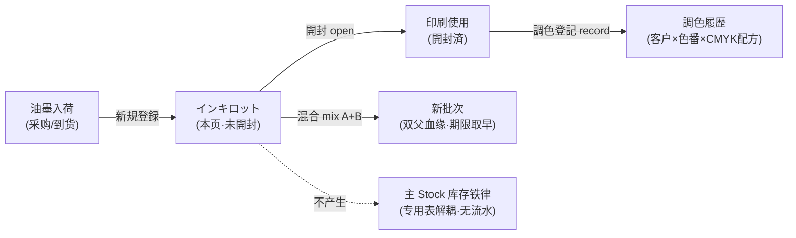
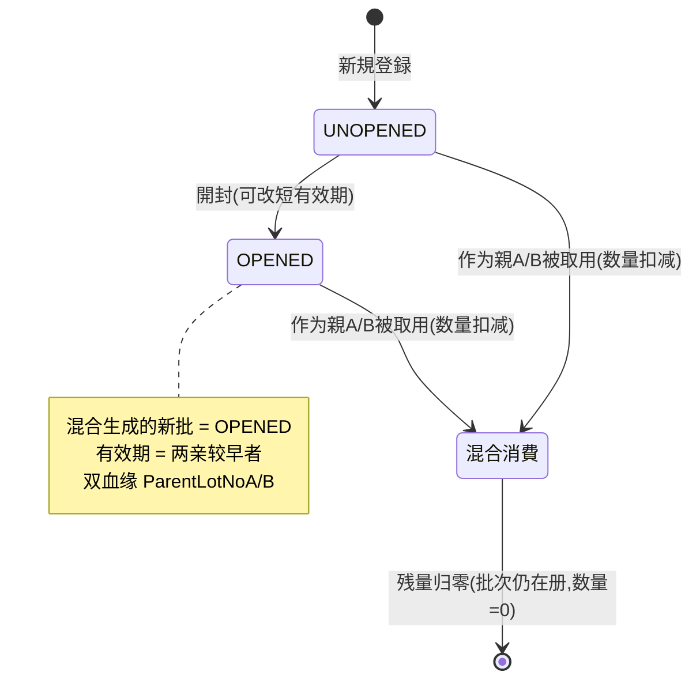

# インキロット（油墨批次・調色）单页面操作 SOP（手把手版）

> **用途**：给**印刷/调色师操作、培训老师讲、测试人员拆用例**。比模块总册（`03-库存物流WMS` §5.19 インキ行）更细。
> **页面**：インキロット（WM230 · 紙器業特化 / 库存物流 WMS）　**路由**：`/wms/ink-lot`　**前端**：`views/wms/InkLotView.vue`　**API**：`api/wms/paperIndustry.ts inkApi`　**后端**：`Wms/InkController` → `InkService`（`MixLotsAsync`/`RecordMatchAsync` 等）
> **基准**：分支 `feat/wfs-inbox-core`，2026-06-29；后端实测 `docs/codemap-wms/05-紙器特化.md` §2（2026-06-22 权威），UI 经实读 `InkLotView.vue` + `types/wms/wms.ts` + `api/wms/paperIndustry.ts`。
> **样例数据**：インキ `INK2026070001`、色番 `DIC-123`、墨種 `OFFSET`、有效期、数量 `20kg`、亲A `INK2026070001`、亲B `INK2026070002`、客户 `CUST-A`。

---

## 1. 页面一句话说明

**インキロット，就是印刷/调色师管"油墨批次"的地方——新到一桶墨登记一条批次（未開封·有效期），用前点"開封"，两桶不同批的墨可以"混合"按比例调成一桶专色新批次，并把"给哪个客户调了什么色、CMYK 配方是多少"登记进調色履歴。** 它只管油墨这一类特殊物料的批次台账，**用独立专用表 `T_InkLot` 自管理在库，不走 WMS 主库存铁律**（不产生 Stock 流水）。

---

## 2. 这个页面在业务流程中的位置

- **上游**：油墨到货后人工登记批次（本页"新規"），不经入庫指示/入庫実績。
- **本页**：批次台账（一覧）+ 開封 + 混合 + 調色履歴（双 Tab）。
- **下游**：调好的专色用于印刷工程；調色履歴供下次同客户同色复用配方。
- **关键解耦**：本页所有动作**只改 `T_InkLot` / `T_InkColorMatchHistory` 自身表**，与主 `Stock` 表无关，不触发库存铁律、不生成 `StockTransaction`。

---

## 3. 谁使用这个页面

| 角色 | 用途 |
|---|---|
| 印刷/调色师（调墨担当） | 登记新墨、開封、两墨混合调专色、登记调色配方 |
| 紙器在库管理 | 查有效期/开封状态、30 日内到期巡检 |
| 品保/营业 | 按客户×色番查历史调色配方（履歴 Tab） |

---

## 4. 操作前准备

- [ ] 已知本桶墨的 **色番（colorCode，如 `DIC-123`）、墨種（OFFSET/FLEXO/UV/OTHER）、有效期、数量+单位（如 20 kg）**。
- [ ] 混合前：两亲批次号都已登记在册（如 `INK2026070001` / `INK2026070002`），且**各自残量足够**本次取用量。
- [ ] 調色登記前：知道**客户CD（如 `CUST-A`）、色番、消耗量、CMYK 配方**（手填 JSON，如 `{"M":50,"Y":30,"K":20}`）。
- [ ] 知道"专用表不走铁律"——本页不会影响主库存数，找不到 Stock 流水属正常。

---

## 5. 页面区域说明

| 区域 | 内容 |
|---|---|
| ロット一覧 Tab | 检索区（ロットNO / 色番 / 墨種 / 開封状態 / **「30日以内に期限切れ」复选**）+ 按钮（検索 / 新規 / 混合）；表格列：ロットNO / 色番 / 墨種 / 開封状態 tag / 有効期（着色）/ 数量+单位 / 粘度 / 固形分 / ロケ / 仕入先 / 操作（**仅未開封行显示「開封」**）|
| 調色履歴 Tab | 检索区（客户CD / 色番）+「調色登記」按钮；表格列：調色NO / 客户CD / 客户名 / 色番 / 消耗量 / 調色日時 / 担当者 / 備考 |
| 新規ロット Dialog（600px）| 色番* / 墨種* / 有効期* / 数量* / 単位 / 粘度 / 固形分 / ロケ / 仕入先 / 備考 |
| 開封 Dialog（420px）| 现有效期（只读 tag）+ 新有効期（可改）+ 提示「開封後は保質期が短くなります」info 条 |
| 混合 Dialog（600px）| 親ロットA* / 親数量A* / 親ロットB* / 親数量B* / 新色番 / 新ロケ / 備考 |
| 調色登記 Dialog（600px）| 客户CD* / 客户名 / 色番* / 消耗量* / **配方JSON（多行文本框）** / 備考 |

> 带 `*` 为前端 `required` 标记字段。

---

## 6. 字段填写说明（口语版）

**新規ロット**：

| 字段 | 怎么填 | 填错影响 |
|---|---|---|
| 色番 colorCode | 必填，如 `DIC-123`（最长 20） | 空→保存被 `wms.common.required` 拦（前端 element required 提示）|
| 墨種 inkType | 必选，OFFSET/FLEXO/UV/OTHER，默认 OFFSET | — |
| 有効期 expiryDate | 必填日期 `YYYY-MM-DD` | 决定一覧着色与 30 日巡检命中 |
| 数量 quantity | 必填，≥0，精度 3 位 | — |
| 単位 unitCd | 默认 `kg`，可改（最长 10） | **混合时不校验两亲单位是否一致**（盲点见 §11）|
| 粘度 viscosityCp / 固形分 solidContent | 可空（数值，固形分 0–100）| 仅展示用 |
| ロケ locationCd / 仕入先 supplierCd / 備考 | 可空 | — |

成功后采番返回 **`INK…`** 批次号（toast `成功: INK2026070001`）。新批 `OpenStatus=UNOPENED`。

**開封**：只需选「新有効期」（默认带入当前有效期）。語义=开封后保质期通常缩短，可在此把有效期**改短**。确定后该批 `UNOPENED → OPENED`。

**混合**（最核心，见 §8 场景三）：親A/親B 批次号 + 各自取用量。新色番/新ロケ可空（空则按后端默认）。

**調色登記**：客户CD* + 色番* + 消耗量* + 配方JSON。**配方JSON 是纯文本框手填**，占位示例 `{"M":50,"Y":30,"K":20}`，**前端不做 JSON 结构/格式校验**（见 §11）。成功采番返回 **`ICM…`** 調色NO。

> ⚠️ 客户CD/客户名两字段**借用 VMI 的词条**（`wms.vmi.fld.customerCd/customerName`），label 文案与 VMI 页一致，属现状非 bug。

---

## 7. 按钮操作说明

| 按钮 | 位置 / 何时出现 | 点了会怎样 |
|---|---|---|
| 検索 | 一覧 Tab 检索区 | 按 ロットNO/色番/墨種/開封状態/30日复选 过滤 `inkApi.searchLots` |
| 新規 | 一覧 Tab | 开新規 Dialog；保存 `createLot` 返回 `INK…`，`UNOPENED` |
| 混合 | 一覧 Tab | 开混合 Dialog；確定 `mix` 返回新 `newLotNo` |
| 開封 | 一覧表行内（**仅 `UNOPENED` 行可见**）| 开開封 Dialog；確定 `openLot(no,newExpiry)` → `OPENED` |
| 検索（履歴）| 調色履歴 Tab | 按 客户CD/色番 过滤 `searchMatches` |
| 調色登記 | 調色履歴 Tab | 开調色 Dialog；保存 `recordMatch` 返回 `ICM…` |
| キャンセル | 各 Dialog | 关闭不提交 |
| 保存/混合/開封 | 各 Dialog footer | 提交对应动作，成功 toast，刷新列表 |

> 一覧无"编辑/删除"行内按钮——**批次只有 新規 / 開封 / 混合 三种写入端点，无 PUT/DELETE 修改入口**；調色履歴 append-only（只增）。

---

## 8. 标准业务操作 SOP（照着点）

### 场景一：登记一桶新到的油墨（主流程·新規）
- **背景**：仓库新到一桶 DIC 专色墨。
- **样例数据**：色番 `DIC-123`、墨種 `OFFSET`、有效期（如半年后）、数量 `20 kg`、仕入先若干。
- **步骤**：1) 一覧 Tab →「新規」；2) 填色番 `DIC-123`、墨種 OFFSET、有効期、数量 20、単位 kg；3) 选填粘度/固形分/ロケ/仕入先；4)「保存」。
- **完成后检查**：toast `成功: INK2026070001`（采番 `INK`）；列表新增一行，**開封状態=未開封（绿 tag）**；有效期按剩余天数着色。
- **异常**：色番/墨種/有効期/数量任一空→element `required` 提示，不提交。
- **用例**：TC-M06-INK-001~004。

### 场景二：开封一桶墨（開封·改短有效期）
- **背景**：要用某桶未開封墨，开封后保质期缩短。
- **步骤**：1) 一覧找到 `UNOPENED` 行→行内「開封」；2) Dialog 显示现有效期（只读 tag）；3) 把「新有効期」改到更近的日期（如缩短到 1 个月后）；4)「開封」。
- **检查**：状态 `未開封(绿) → 開封済(橙)`；有效期更新为新值；info 条提示"開封後は保質期が短くなります"。
- **异常**：已 `OPENED` 行**不显示開封按钮**（无法重复开封）。
- **用例**：TC-M06-INK-005~007。

### 场景三：两墨混合调专色（最核心·mix）
- **背景**：两桶不同批油墨按比例混成一桶专色。
- **样例数据**：親A `INK2026070001` 取 5 kg、親B `INK2026070002` 取 5 kg，新色番 `DIC-123-MIX`。
- **前置**：两亲批次都在册，各自**残量 ≥ 取用量**。
- **步骤**：1) 一覧「混合」；2) 填親ロットA=`INK2026070001`、親数量A=5；3) 填親ロットB=`INK2026070002`、親数量B=5；4) 选填新色番/新ロケ/備考；5)「混合」。
- **完成后检查**：toast `成功: INK20260700xx`（新批采番 `INK`）；新批 `OpenStatus=開封済`，**数量=5+5=10 kg**；**有效期=两亲中较早者**（保守安全）；新批保留 **双血缘 `ParentLotNoA`/`ParentLotNoB`**；两亲批次各自数量被扣减（A −5、B −5）。
- **异常**：見 场景六。
- **用例**：TC-M06-INK-008~013。

### 场景四：登记调色配方履历（調色登記·record）
- **背景**：给某客户调好一版专色，记录配方便于下次复用。
- **样例数据**：客户 `CUST-A`、色番 `DIC-123`、消耗量、配方 `{"M":50,"Y":30,"K":20}`。
- **步骤**：1) 切「調色履歴」Tab →「調色登記」；2) 填客户CD `CUST-A`、（客户名可空）、色番 `DIC-123`、消耗量；3) 配方JSON 框手填 `{"M":50,"Y":30,"K":20}`；4)「保存」。
- **检查**：toast `成功: ICM…`（采番 `ICM`）；履歴 Tab 新增一行；按客户/色番可检索复用。
- **异常**：客户CD 或 色番 空→`wms.common.required` 警告，不提交。
- **用例**：TC-M06-INK-014~017。

### 场景五：有效期巡检与开封状态筛选（検索·着色）
- **背景**：班前巡检快到期/已过期/已开封的墨。
- **步骤**：1) 一覧 Tab 勾「30日以内に期限切れ」→「検索」；2) 或选「開封状態=開封済」过滤；3) 看有效期着色。
- **检查**：有效期 **过期=红字加粗**、**30 日内=橙字加粗**、其余正常；开封状态 `未開封=绿 / 開封済=橙`；墨種下拉 OFFSET/FLEXO/UV/OTHER 过滤生效。
- **用例**：TC-M06-INK-018~022。

### 场景六：混合异常与盲点（残量·同一ロット·不兼容）
- **背景**：混合时填了不合规组合。
- **步骤与检查**：
  - 親A=親B 同一批次号→后端拦"同一ロット同士の混合は不可"（**本地中日文 message，非 WM-MSG 码**）；
  - 親A 取用量 > 親A 残量→后端拦"親A 残量不足"（親B 同理）；
  - 任一親批次号空 / 取用量 ≤0→**前端** `wms.common.required` 警告，不发请求；
  - ⚠️ **不兼容混合（盲点）**：親A=OFFSET、親B=UV，或两亲单位不同（kg vs g）→**系统照常放行**（混合只校验"两父非空且量>0"，不校验墨種/单位兼容）。
- **用例**：TC-M06-INK-023~027。

---

## 9. 状态变化说明

- 开封状态只有两态：`UNOPENED 未開封(绿)` ⇄ 单向 → `OPENED 開封済(橙)`，**无逆转**。
- **有效期不是状态机**：过期/30 日内只是**前端按当前日期实时着色**，批次状态**不会自动变**（无"失效"态、不自动下架）。
- 混合不删除亲批次，只**扣减亲批数量**；新批是独立新行。

---

## 10. 按钮不可用 / 灰色原因

| 现象 | 原因 |
|---|---|
| 某行无「開封」按钮 | 该行已 `OPENED`（仅 `UNOPENED` 行显示開封）|
| 一覧找不到"编辑/删除" | **批次无 PUT/DELETE 端点**，只有 新規/開封/混合 三种写入 |
| 履歴行无任何操作 | 調色履歴 **append-only**，只增不改不删 |
| 混合「混合」点了无反应 | 前端校验未过（親批次号空 / 取用量 ≤0）→ 只弹 `wms.common.required`，不发请求 |
| 找不到本页产生的库存流水 | **专用表解耦**，本页不走主 Stock 铁律、不产生 StockTransaction |

---

## 11. 常见错误与处理

| 错误/现象 | 原因 | 处理 |
|---|---|---|
| "同一ロット同士の混合は不可" | 親A=親B 同一批次 | 选两个不同批次 |
| "親A 残量不足" / "親B 残量不足" | 取用量 > 该亲批残量 | 减小取用量或先补墨 |
| 混合/保存点了不提交 | 前端必填项空（`wms.common.required`）| 补全親批次号/取用量/必填字段 |
| 新批有效期比想象的短 | **设计如此**：混合新批有效期=两亲较早者（保守安全）| 正常，按最早亲批管控 |
| 配方JSON 写歪了也存进去 | **formulaJson 纯文本框，前端无 JSON 格式/结构校验** | 人工核对配方文本（无结构化编辑器）|
| 把 OFFSET 和 UV 混到一起没拦 | **盲点**：混合不校验墨種/单位兼容 | 现场自律核对墨種·单位一致后再混 |
| 客户CD label 看着像 VMI 的 | 借用 `wms.vmi.fld.*` 词条 | 现状，非 bug |
| 过期了批次状态没变 | 有效期仅前端着色，无自动失效态 | 人工依红/橙着色判废 |

> ⚠️ **错误码现状**：混合的"同一ロット""残量不足"等校验用**本地中日文 message（非 `WM-MSG` 结构化码）**；与原紙的 `WM-MSG-202/203`、各页通用 `WM-MSG-070/043` 不同。诚实标注：本页混合分支**无统一错误码前缀**。

---

## 12. 操作完成后的检查清单

- [ ] 新規：toast 含 `INK…` 采番、列表新增、`UNOPENED(绿)`、有效期着色正确。
- [ ] 開封：状态 `UNOPENED→OPENED`、有效期更新为新值、不可重复开封。
- [ ] 混合：新批 `INK…`、`OPENED`、**数量=A+B**、**有效期=两亲较早**、双血缘 `ParentLotNoA/B`、两亲数量各被扣减。
- [ ] 調色登記：toast 含 `ICM…`、履歴新增、按客户/色番可检索。
- [ ] 解耦确认：本页所有动作**不**生成主 Stock 流水（专用表自管理）。
- [ ] 盲点已知：墨種/单位兼容、JSON 格式均**未**被系统校验，靠人工把关。

---

## 13. 页面级测试用例（≥25 条，可执行）

> 编号 `TC-M06-INK-xxx`；数据用样例（`INK2026070001`/`DIC-123`/`OFFSET`/`20kg`/亲A `INK2026070001`/亲B `INK2026070002`/客户 `CUST-A`）。

| 用例编号 | 用例名称 | 优先级 | 前置条件 | 测试数据 | 操作步骤 | 预期结果 | 下游检查 | 备注 |
|---|---|---|---|---|---|---|---|---|
| TC-M06-INK-001 | 新規ロット登録成功 | P0 | 一覧 Tab | DIC-123/OFFSET/20kg/有效期 | 新規→填→保存 | toast `成功: INK…`、列表新增、未開封 | 専用表新行 | 采番 INK |
| TC-M06-INK-002 | 色番空被拦 | P0 | 新規 Dialog | 色番空 | 保存 | element required 提示 | 不落库 | — |
| TC-M06-INK-003 | 墨種默认 OFFSET | P2 | 新規 Dialog | 不改墨種 | 看默认值 | 墨種=OFFSET | — | — |
| TC-M06-INK-004 | 新批未開封绿 tag | P1 | 已新建 | — | 看一覧 | 開封状態=未開封(绿) | — | — |
| TC-M06-INK-005 | 開封成功转橙 | P0 | 存在 UNOPENED 行 | INK2026070001 | 開封→確定 | 状态→開封済(橙) | open 端点 | — |
| TC-M06-INK-006 | 開封改短有效期 | P1 | UNOPENED 行 | 新有效期更近 | 開封→改日期→確定 | 有效期更新为新值 | — | 保质期缩短 |
| TC-M06-INK-007 | 已開封无開封按钮 | P1 | OPENED 行 | — | 看行内操作 | 无「開封」按钮 | — | 不可重复 |
| TC-M06-INK-008 | 混合成功生新批 | P0 | 两亲在册有量 | A=5/B=5 | 混合→填→混合 | toast `成功: INK…`、新批開封済 | 新批专用表行 | 核心 |
| TC-M06-INK-009 | 新批数量=A+B | P0 | 同上 | A5+B5 | 看新批数量 | 数量=10kg | — | — |
| TC-M06-INK-010 | 新批有效期取早 | P0 | A/B 有效期不同 | A早于B | 看新批有效期 | =较早者(A) | — | 保守安全 |
| TC-M06-INK-011 | 新批双血缘 | P0 | 混合后 | — | 查新批 | ParentLotNoA/B 均填 | — | 可回溯 |
| TC-M06-INK-012 | 两亲数量被扣减 | P0 | 混合后 | A取5/B取5 | 查两亲 | A−5、B−5 | — | — |
| TC-M06-INK-013 | 新批含新色番/ロケ | P2 | 混合 | DIC-123-MIX | 填新色番 | 新批色番=DIC-123-MIX | — | 可空 |
| TC-M06-INK-014 | 調色登記成功 | P0 | 履歴 Tab | CUST-A/DIC-123/配方 | 調色登記→保存 | toast `成功: ICM…`、履歴新增 | 采番 ICM | — |
| TC-M06-INK-015 | 客户CD空被拦 | P0 | 調色 Dialog | 客户空 | 保存 | required 警告 | 不落库 | — |
| TC-M06-INK-016 | 色番空被拦 | P0 | 調色 Dialog | 色番空 | 保存 | required 警告 | 不落库 | — |
| TC-M06-INK-017 | 配方JSON 存原文 | P1 | 調色 Dialog | `{"M":50,"Y":30,"K":20}` | 填→保存 | formulaJson 原样落库 | — | — |
| TC-M06-INK-018 | 30日内到期筛选 | P1 | 有快到期批 | 勾复选 | 检索 | 仅列 30 日内到期 | — | — |
| TC-M06-INK-019 | 过期红字 | P1 | 有过期批 | — | 看一覧 | 有效期红字加粗 | — | 前端着色 |
| TC-M06-INK-020 | 30日内橙字 | P1 | 30 日内到期 | — | 看一覧 | 有效期橙字加粗 | — | — |
| TC-M06-INK-021 | 開封状態过滤 | P1 | 混合开封状态 | 開封済 | 过滤检索 | 仅列開封済 | — | — |
| TC-M06-INK-022 | 墨種过滤 | P2 | 多墨種 | OFFSET | 过滤检索 | 仅列 OFFSET | — | — |
| TC-M06-INK-023 | 同一ロット混合拦 | P0 | 一亲在册 | A=B=同号 | 混合→混合 | 后端"同一ロット…不可" | 不落库 | 本地 message |
| TC-M06-INK-024 | 亲A 残量不足 | P0 | A 残量<取用 | A取量过大 | 混合 | 后端"親A 残量不足" | 不落库 | 本地 message |
| TC-M06-INK-025 | 亲B 残量不足 | P0 | B 残量<取用 | B取量过大 | 混合 | 后端"親B 残量不足" | 不落库 | — |
| TC-M06-INK-026 | 亲批号空前端拦 | P1 | 混合 Dialog | A 号空 | 混合 | required 警告、不发请求 | — | 前端 |
| TC-M06-INK-027 | 取用量≤0 前端拦 | P1 | 混合 Dialog | A 量=0 | 混合 | required 警告、不发请求 | — | 前端 |
| TC-M06-INK-028 | 不兼容墨種放行(盲点) | P2 | OFFSET+UV 两亲 | A=OFFSET/B=UV | 混合 | 系统放行生成新批 | — | 已知盲点 |
| TC-M06-INK-029 | 不同单位放行(盲点) | P2 | kg+g 两亲 | 单位不一致 | 混合 | 系统放行不拦 | — | 已知盲点 |
| TC-M06-INK-030 | 配方JSON 无格式校验 | P2 | 調色 Dialog | 写非法 JSON | 保存 | 仍可保存(无校验) | — | 已知盲点 |
| TC-M06-INK-031 | 无改/删入口 | P2 | 有批次 | — | 找改删 | 一覧无编辑/删除按钮 | — | 现状 |
| TC-M06-INK-032 | 不产生主库存流水 | P1 | 任意写入 | — | 查 StockTransaction | 本页动作无 Stock 流水 | 主库存 | 专用表解耦 |
| TC-M06-INK-033 | 履歴按客户检索 | P2 | 有履歴 | CUST-A | 履歴 Tab 检索 | 命中 CUST-A 行 | — | — |

---

## 14. 培训讲解建议

| 顺序 | 讲什么 | 演示 | 易误解点 |
|---|---|---|---|
| 1 | 这页只管"油墨批次台账" | §2 流程图 | 以为会动主库存（实际专用表解耦）|
| 2 | 新規→開封 两态 | 建一桶→開封 | 開封不可逆、保质期会改短 |
| 3 | 混合是核心：A+B→新批 | 混合演示 | 数量相加、**有效期取早**、双血缘 |
| 4 | 混合的"拦"与"不拦" | 同号/残量不足拦；墨種/单位不拦 | 以为系统会防不兼容墨混合 |
| 5 | 調色履歴=配方台账 | 登记 CMYK JSON | 配方框无格式校验，要人工核对 |
| 6 | 有效期是"着色"非"状态" | 看红/橙着色 | 以为过期会自动失效/下架 |

---

## 15. 与模块级手册的关系

对应 `03-库存物流WMS-最详细用户操作培训手册.md` **§5.19 紙器業特化类**（インキ WM230 `/ink-lot` 行）。相关验收 §8 `AC-M06-11`（紙器特化解耦：原紙/残材/版型/**インキ**/パレット/サンプル 用独立专用表不走铁律；Kit/CrossDock 走铁律）。采番清单见 codemap-wms §0（`INK` 批次 / `ICM` 調色）。

---

## 16. 代码与文档来源

| 层 | 文件 |
|---|---|
| 逐行源码手册 | `docs/codemap-wms/05-紙器特化.md` §2 インキ（权威，2026-06-22）|
| 前端 | `cp6.web/src/views/wms/InkLotView.vue`（实读）|
| API/类型 | `cp6.web/src/api/wms/paperIndustry.ts`（`inkApi`）、`cp6.web/src/types/wms/wms.ts`（`InkLot`/`InkLotSearchQuery`/`InkColorMatchHistory`/`MixInkRequest`）|
| 后端 | `Wms/InkController.cs`、`Services/Wms/InkService.cs`（`MixLotsAsync` `:72-115`、`RecordMatchAsync` `:125-144`）|
| 实体 | `DomainModels/Wms/InkLot.cs`（`OpenStatus`/`ExpiryDate`/`Quantity`/`ParentLotNoA/B`）、`InkColorMatchHistory.cs`（`FormulaJson`）|
| 采番 | `WmsSequenceService`：`INK`（批次）/ `ICM`（調色履歴）|
| 模块手册 | `docs/manuals/user-training/03-库存物流WMS-最详细用户操作培训手册.md` §5.19 |

---

## 最后更新来源

- 代码：见 §16（codemap-wms 05 §2 + `InkLotView.vue` 实读 + `paperIndustry.ts inkApi` + `types/wms/wms.ts` 接口）。
- 基准：分支 `feat/wfs-inbox-core`，2026-06-29（codemap 2026-06-22）。
- 覆盖：16 节 / 6 场景（含可拆用例）/ 33 用例（TC-M06-INK-001~033）。
- 诚实标注：混合不校验墨種·单位兼容、formulaJson 无格式校验、混合校验用本地中日文 message（非 WM-MSG 码）、客户CD/名借 VMI 词条、专用表不走库存铁律——均为现状。
</content>
</invoke>
