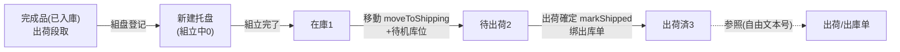
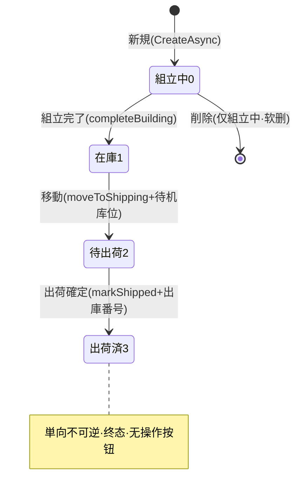

# パレット（托盘）单页面操作 SOP（手把手版）

> **用途**：给**出荷段取担当/仓管操作、培训老师讲、测试人员拆用例**。比模块总册（`03-库存物流WMS` §5.19）更细。
> **页面**：パレット（WM240 · 紙器業特化 / 库存物流 WMS）　**路由**：`/wms/pallet`　**前端**：`views/wms/PalletView.vue`　**API**：`api/wms/paperIndustry.ts palletApi`　**后端**：`Wms/PalletController` → `PalletService`
> **基准**：分支 `feat/wfs-inbox-core`，2026-06-29；后端实测 `docs/codemap-wms/05-紙器特化.md` §3（2026-06-22 权威 + 本次实读 `PalletService.cs` 逐行），UI 经实读 view。
> **样例数据**：托盘 `PLT2026070001`、製品 `PRD2026070001`、LotNo `LOT2026070001`、ケース数 40、倉庫 `W01`、库位 `W01-FG`、出荷番号 `OUT2026070001`。

---

## 1. 页面一句话说明

**パレット，就是给"已经做好的完成品"建一个整托盘台账，并管它从"組立中→在庫→待出荷→出荷済"四段单向生命周期的地方——一托盘只能装一个製品 + 一个 LotNo（结构性禁混载，从根上做不到混着堆），出荷确定时把托盘绑到一张出库单上。** 它是出荷段取（备货）时盘点成品托盘的专用管理台账。

> ★ **关键**：本页用**独立专用表 `T_Pallet` 自管理在库，不走 WMS"库存铁律"**（不产生 `Stock` 流水、不联动主库存数量）。状态只在自身表里迁移，是一本"成品托盘履历账"，不是出库扣账动作。

---

## 2. 这个页面在业务流程中的位置

- **上游**：完成品已入库，出荷备货时把整托盘登记成一条托盘记录。
- **本页**：管托盘四段生命周期（组盘→在库→待出→已出）。
- **下游**：出荷確定时记录 `ShippedOutboundNo`（出库单号，**自由文本、不做外键校验、不触发主库存出库**）。

---

## 3. 谁使用这个页面

| 角色 | 用途 |
|---|---|
| 出荷段取担当 / 仓管 | 组盘登记、组立完了、移到待机区、出荷确定绑单 |
| 纸器特化在库担当 | 维护成品托盘履历、按製品/Lot/倉庫检索 |
| 班组长 | 核对待出荷托盘、清理误建草稿 |

---

## 4. 操作前准备

- [ ] 明确这托盘装的是**哪一个製品 + 哪一个 LotNo**（一托盘只能一品一批，提前确认不混）。
- [ ] 准备 ケース数（箱数，必填 >0）；可选：重量 kg、高さ mm、最大段積層数。
- [ ] 准备倉庫CD（如 `W01`）与库位CD（如 `W01-FG`，均必填）。
- [ ] 出荷确定前准备好对应的**出库单号**（如 `OUT2026070001`）。

---

## 5. 页面区域说明

| 区域 | 内容 |
|---|---|
| 检索区（顶部卡） | パレットNO / 製品 / ロット / 倉庫 / 状態（下拉 4 状态）+「検索」「新規」按钮 |
| 一覧表 | 每行：パレットNO / 状態 tag / 製品CD·製品名 / ロット / ケース数 / 重量 / 高さ / 最大段積 / 倉庫 / 库位 / 出荷番号 / 操作列（按状态显隐按钮） |
| 新規 Dialog（600px） | 製品CD\*·製品名 / ロット\* / ケース数\* / 重量 / 高さ / 最大段積 / 倉庫\* / 库位\* / 備考 |
| 移動 Dialog（420px） | 移動先库位（出荷待機库位，必填） |
| 出荷確定 Dialog（420px） | 出荷番号（出库单号，必填） |

> `*` = 必填。**整页没有"编辑/訂正"按钮**（update 端点存在但 UI 未暴露），改不了已建托盘的明细，只能按状态机推进或（组立中时）删除重建。

---

## 6. 字段填写说明（口语版）

**新規 Dialog**（建托盘=组盘登记）：

| 字段 | 必填 | 怎么填 | 填错影响 |
|---|---|---|---|
| 製品CD | ✅ | 这托装的唯一製品，如 `PRD2026070001` | 空→`ProductCd / LotNo 必須（混載禁止原則）`（注：**纯文本消息，非 WM-MSG 码**） |
| 製品名 | — | 可空，便于辨识 | — |
| ロット（LotNo） | ✅ | 这托装的唯一批次，如 `LOT2026070001` | 空→同上"混載禁止原則" |
| ケース数（cartonQty） | ✅ | 箱数，最小 1，如 40 | ≤0→`CartonQty > 0`（纯文本消息） |
| 重量（weightKg） | — | kg，2 位小数 | — |
| 高さ（heightMm） | — | mm | — |
| 最大段積（maxStackLayers） | — | 防压塌的最大堆叠层，如 5；**只存档不在 UI 做堆叠校验** | — |
| 倉庫CD | ✅ | 如 `W01` | 空→`Warehouse / Location 必須`（纯文本消息） |
| 库位CD | ✅ | 如 `W01-FG` | 空→同上 |
| 備考 | — | 自由文本 | — |

**移動 Dialog**：移動先库位（必填，填出荷待機区库位，如 `W01-SHIP`）——空时前端直接提示必填、**不发请求**。

**出荷確定 Dialog**：出荷番号（必填，如 `OUT2026070001`）——空时前端提示必填、**不发请求**；此号为**自由文本，最长 25 字，后端不校验该出库单是否真实存在**。

> ★★ **禁混载是"结构性"的，不是弹窗校验**：实体 `Pallet` 只有**单个** `ProductCd` / 单个 `LotNo` 字段；新規 Dialog 也只有**一个**製品框 + **一个**ロット框，**UI 根本没有"追加第二个製品 / 第二个批次"的入口**——所以混着装从数据结构上做不到。后端 `CreateAsync` 再强制 製品/ロット 必填兜底。

---

## 7. 按钮操作说明

| 按钮 | 何时出现（按 row.status） | 点了会怎样 | 守卫 |
|---|---|---|---|
| 検索 | 检索区常显 | 按条件刷新一覧 | — |
| 新規 | 检索区常显 | 打开新規 Dialog 建托盘（建出来=組立中0） | 製品/ロット/倉庫/库位/ケース数 校验 |
| 組立完了（complete） | status=0 組立中 | 托盘 0→1 在庫 | 仅組立中可，否则 `WM-MSG-043` |
| 移動→出荷区（moveToShipping） | status=1 在庫 | 弹移動 Dialog；确定后库位改为待机库位 + 1→2 待出荷 | 仅在庫可，否则 `WM-MSG-043`；移動先必填 |
| 出荷確定（markShipped） | status=2 待出荷 | 弹出荷 Dialog；确定后 2→3 出荷済 + 记 `ShippedOutboundNo` | 出荷番号必填 |
| 削除（delete） | status=0 組立中 | 软删该托盘（确认框） | 仅組立中行显删除 |

> **诚实标注（UI 按钮 vs 后端守卫的差异）**：
> - **出荷確定**：UI 按钮**只在 status=2** 出现；但后端 `MarkShippedAsync` 实际**也允许 status=1 在庫直发**（`在庫 or 出荷待機のみ出荷化可`），只是 UI 没给"在库直接出荷"入口。
> - **削除**：UI 按钮**只在 status=0** 出现；但后端 `DeleteAsync` 实际允许删除**除出荷済(3)外**的任意状态（出荷済→`WM-MSG-043: 出荷済は削除不可`），只是 UI 没暴露删在库/待出荷。
> - **訂正/編集**：后端有 `UpdateAsync`（出荷済不可訂正；組立中以外不可改製品/ロット），但**前端没有任何编辑按钮**，普通用户改不了。

---

## 8. 标准业务操作 SOP（照着点）

### 场景一：新建托盘 = 组盘登记（主流程起点）
- **背景**：完成品做好了，出荷备货时把整托登记成一条托盘记录。
- **样例数据**：製品 `PRD2026070001`、ロット `LOT2026070001`、ケース数 40、倉庫 `W01`、库位 `W01-FG`、最大段積 5。
- **步骤**：1) 点「新規」；2) 填製品CD、ロット、ケース数、倉庫、库位（带 `*` 必填）；3) 可选填重量/高さ/最大段積/備考；4) 「保存」。
- **完成后检查**：toast 显示新采番（`PLT…`，如 `PLT2026070001`，**采番规则后端不可见**）；列表新增一行，状态 tag=**組立中**（灰/info）。
- **异常**：缺製品或ロット→"混載禁止原則"；缺倉庫/库位→"Warehouse / Location 必須"；ケース数≤0→"CartonQty > 0"。
- **用例**：TC-M06-PALLET-002~006。

### 场景二：組立完了（組立中 0 → 在庫 1）
- **背景**：托盘码好了，确认组盘完成。
- **步骤**：在組立中行点「組立完了」→确认框「確定」。
- **检查**：状态 tag 由 組立中→**在庫**（绿/success）；此时该行不再显"組立完了/削除"，改显"移動→出荷区"。
- **异常**：对非組立中托盘调用→`WM-MSG-043: 組成中以外は完成化不可`。
- **用例**：TC-M06-PALLET-007、008。

### 场景三：移動至出荷待機区（在庫 1 → 待出荷 2）
- **背景**：要出货了，把托盘物理移到出荷待機库位。
- **样例数据**：移動先库位 `W01-SHIP`。
- **步骤**：在庫行点「移動→出荷区」→在移動 Dialog 填移動先库位→「確定」。
- **检查**：库位列更新为 `W01-SHIP`；状态 tag→**待出荷**（橙/warning）。
- **异常**：移動先空→前端提示必填、不发请求；对非在庫托盘→`WM-MSG-043: 保管中のみ出荷待機へ移動可`。
- **用例**：TC-M06-PALLET-009~011。

### 场景四：出荷確定·绑出库单（待出荷 2 → 出荷済 3）
- **背景**：实际发货，确认出荷并绑定出库单号。
- **样例数据**：出荷番号 `OUT2026070001`。
- **步骤**：待出荷行点「出荷確定」→填出荷番号→「確定」。
- **检查**：状态 tag→**出荷済**（蓝/primary）；出荷番号列显示 `OUT2026070001`；该行不再有任何操作按钮（终态）。
- **异常**：出荷番号空→前端提示必填、不发请求。
- **注意**：**这一步不动主库存、不产生 `Stock` 出库流水**——只是把托盘台账标成已出并记一个出库单号（自由文本，不校验出库单真实存在）。
- **用例**：TC-M06-PALLET-012、013、022。

### 场景五：删除误建的草稿托盘（仅組立中可删）
- **背景**：组盘信息建错了，想删掉重建。
- **步骤**：在組立中行点「削除」→确认框「確定」（软删 `IsDeleted`）。
- **检查**：列表移除该行；已組立完了/在庫/待出荷/出荷済的行，UI 没有「削除」按钮。
- **异常**：（后端层）对出荷済托盘删除→`WM-MSG-043: 出荷済は削除不可`（UI 已先隐藏按钮）。
- **用例**：TC-M06-PALLET-015、016。

### 场景六：禁混载结构性验证（想混着装→根本没入口）
- **背景**：现场想把两个製品（或同製品两个 Lot）码到一个托盘里。
- **步骤**：打开「新規」Dialog，找"再加一个製品 / 再加一行批次"的按钮。
- **检查**：**找不到**——Dialog 只有一个製品框 + 一个ロット框；实体也只有单个 `ProductCd`/`LotNo` 字段。混载从数据结构上做不到，不是靠弹窗拦的。
- **用例**：TC-M06-PALLET-018、019。

### 场景七：检索成品托盘
- **背景**：查某製品/某批次/某仓的托盘当前在哪个状态。
- **步骤**：在检索区填 パレットNO / 製品 / ロット / 倉庫 / 状態（任意组合）→「検索」。
- **检查**：列表按条件过滤；状態下拉 4 选项=組立中/在庫/待出荷/出荷済。
- **用例**：TC-M06-PALLET-001、026。

### 场景八：状态守卫误操作（状态不符）
- **背景**：误对在庫托盘想"組立完了"，或对組立中托盘想"出荷確定"。
- **步骤**：UI 上对应按钮不出现（按 status 显隐）；若经后端/接口直调则被守卫拦。
- **检查**：后端抛 `WM-MSG-043`（各状态守卫）；不存在的 パレットNO→`WM-MSG-070`。
- **用例**：TC-M06-PALLET-021、024、028、029。

---

## 9. 状态变化说明

- 四段**单向推进**：0→1→2→3，UI 不提供回退。
- **后端额外能力（UI 未暴露）**：`markShipped` 也允许 在庫1→出荷済3（在库直发）；`delete` 也允许删 在庫1/待出荷2（仅出荷済3 禁删）。
- **不走库存铁律**：状态迁移只改 `T_Pallet` 自身，无 `Stock` 流水、无主库存数量联动。

---

## 10. 按钮不可用 / 灰色原因

| 现象 | 原因 |
|---|---|
| 某行无「組立完了」 | 该托盘非組立中(0) |
| 某行无「移動→出荷区」 | 该托盘非在庫(1) |
| 某行无「出荷確定」 | 该托盘非待出荷(2)（UI 限定 status=2） |
| 某行无「削除」 | 该托盘非組立中(0)（UI 限定 status=0） |
| 出荷済行完全没操作按钮 | 终态，单向不可逆 |
| 整页找不到「编辑/訂正」 | UI 未暴露 update（端点存在但无按钮） |
| 移動/出荷 Dialog 点确定无反应 | 移動先库位 / 出荷番号 必填项为空（前端拦，不发请求） |

---

## 11. 常见错误与处理

| 错误 | 触发 | 处理 |
|---|---|---|
| `ProductCd / LotNo 必須（混載禁止原則）` | 新建缺製品或ロット | 两者都填（纯文本消息，非 WM-MSG 码） |
| `Warehouse / Location 必須` | 新建缺倉庫/库位 | 补倉庫CD、库位CD |
| `CartonQty > 0` | 新建ケース数≤0 | 填正数箱数 |
| `WM-MSG-043: 組成中以外は完成化不可` | 对非組立中托盘做組立完了 | 仅組立中可完成化 |
| `WM-MSG-043: 保管中のみ出荷待機へ移動可` | 对非在庫托盘做移動 | 先組立完了到在庫 |
| `WM-MSG-043: 在庫 or 出荷待機のみ出荷化可` | 对組立中托盘做出荷化 | 先推进到在庫/待出荷 |
| `WM-MSG-043: 出荷済は削除不可` / `…訂正不可` | 删/改已出荷托盘 | 出荷済为终态，不可删改 |
| `WM-MSG-070` | パレットNO 不存在 | 核对托盘号 |
| 移動/出荷确定无反应 | 必填库位/出荷番号为空 | 前端 required 提示，补填 |

---

## 12. 操作完成后的检查清单

- [ ] 新建后：列表出现新行、采番 `PLT…`、状态=組立中。
- [ ] 一托盘只有**一个**製品CD + **一个** LotNo（混载结构性不可能）。
- [ ] 状态按 0→1→2→3 单向推进，tag 颜色：組立中(灰)/在庫(绿)/待出荷(橙)/出荷済(蓝)。
- [ ] 移動后库位列更新为待机库位；出荷確定后出荷番号列显示出库单号。
- [ ] **本页全程不产生 `Stock` 流水、不联动主库存数量**（独立专用表 `T_Pallet`）。
- [ ] 最大段積（maxStackLayers）只是存档值，UI 不做堆叠层数校验。

---

## 13. 页面级测试用例（≥25 条，可执行）

> 编号 `TC-M06-PALLET-xxx`；数据用样例（托盘 `PLT2026070001` / 製品 `PRD2026070001` / Lot `LOT2026070001` / 倉庫 `W01` / 库位 `W01-FG` / 出荷番号 `OUT2026070001`）。

| 用例编号 | 用例名称 | 优先级 | 前置条件 | 测试数据 | 操作步骤 | 预期结果 | 下游检查 | 备注 |
|---|---|---|---|---|---|---|---|---|
| TC-M06-PALLET-001 | 检索托盘一覧 | P1 | 有托盘数据 | 空条件 | 进页面/点検索 | 列出托盘行，状态 tag 正确 | — | — |
| TC-M06-PALLET-002 | 新建托盘成功 | P0 | — | PRD…/LOT…/40/W01/W01-FG | 新規→填必填→保存 | toast 含 `PLT…`，新行=組立中 | 列表+1 | 核心 |
| TC-M06-PALLET-003 | 缺製品CD拦截 | P0 | 新規开 | 製品空 | 保存 | "混載禁止原則"消息，不落库 | 不新增 | 纯文本非WM码 |
| TC-M06-PALLET-004 | 缺LotNo拦截 | P0 | 新規开 | ロット空 | 保存 | "混載禁止原則"消息，不落库 | 不新增 | — |
| TC-M06-PALLET-005 | 缺倉庫/库位拦截 | P0 | 新規开 | 倉庫或库位空 | 保存 | "Warehouse / Location 必須" | 不新增 | — |
| TC-M06-PALLET-006 | ケース数≤0拦截 | P0 | 新規开 | ケース数 0 | 保存 | "CartonQty > 0" | 不新增 | input-number min=1 兜底 |
| TC-M06-PALLET-007 | 組立完了 0→1 | P0 | 托盘=組立中 | PLT2026070001 | 組立完了→確定 | 状态→在庫(绿) | — | — |
| TC-M06-PALLET-008 | 非組立中完成化拦截 | P1 | 托盘=在庫 | 接口直调complete | 调用 | WM-MSG-043(組成中以外…) | 状态不变 | UI 已隐藏按钮 |
| TC-M06-PALLET-009 | 移動 1→2 | P0 | 托盘=在庫 | 移動先 W01-SHIP | 移動→填→確定 | 库位更新、状态→待出荷(橙) | — | — |
| TC-M06-PALLET-010 | 移動先为空 | P1 | 移動 Dialog 开 | 库位空 | 確定 | 前端必填提示，不发请求 | 状态不变 | — |
| TC-M06-PALLET-011 | 非在庫移動拦截 | P1 | 托盘=組立中 | 接口直调move | 调用 | WM-MSG-043(保管中のみ…) | 状态不变 | UI 已隐藏按钮 |
| TC-M06-PALLET-012 | 出荷確定 2→3 绑单 | P0 | 托盘=待出荷 | OUT2026070001 | 出荷確定→填→確定 | 状态→出荷済(蓝)，记出荷番号 | 出荷番号列显示 | 核心 |
| TC-M06-PALLET-013 | 出荷番号为空 | P1 | 出荷 Dialog 开 | 番号空 | 確定 | 前端必填提示，不发请求 | 状态不变 | — |
| TC-M06-PALLET-014 | 出荷番号自由文本 | P2 | 托盘=待出荷 | 不存在的出库号 | 出荷確定 | 成功，号原样存入 | 不校验出库单实在 | 现状 |
| TC-M06-PALLET-015 | 删除組立中托盘 | P1 | 托盘=組立中 | PLT… | 削除→確定 | 软删，列表移除 | IsDeleted=true | — |
| TC-M06-PALLET-016 | 出荷済不可删 | P1 | 托盘=出荷済 | PLT… | 看操作列/接口直调delete | UI 无删按钮；后端 WM-MSG-043 | 仍在 | — |
| TC-M06-PALLET-017 | 状态单向不可逆 | P1 | 各状态托盘 | — | 找回退入口 | 无回退按钮 | — | — |
| TC-M06-PALLET-018 | 禁混载无追加入口 | P0 | 新規开 | — | 找"加第二製品/批次" | 找不到，仅单製品+单Lot | — | 结构性 |
| TC-M06-PALLET-019 | 一托=单製品单Lot | P0 | 有托盘 | — | 看实体/列 | 仅单 productCd+单 lotNo | — | 结构性 |
| TC-M06-PALLET-020 | 最大段積只存不校验 | P2 | 新規开 | maxStackLayers=5 | 填→保存 | 存档显示，无堆叠校验 | — | UI 盲点 |
| TC-M06-PALLET-021 | 按状态显隐按钮 | P1 | 4 状态各一 | — | 看操作列 | 0→完了/削除;1→移動;2→出荷確定;3→无 | — | — |
| TC-M06-PALLET-022 | 出荷不动主库存 | P1 | 托盘=待出荷 | OUT… | 出荷確定后查 Stock | 无 Stock 流水/数量变化 | 主库存表 | 解耦专用表 |
| TC-M06-PALLET-023 | 采番 PLT 自动生成 | P2 | — | — | 新建 | 号以 PLT 开头、连号 | — | 规则后端不可见 |
| TC-M06-PALLET-024 | 不存在托盘号 | P2 | — | 错误NO | 接口操作 | WM-MSG-070 | — | — |
| TC-M06-PALLET-025 | 状态 tag 颜色 | P3 | 各状态 | — | 看 tag | 灰/绿/橙/蓝 对应 0/1/2/3 | — | — |
| TC-M06-PALLET-026 | 按製品/Lot/倉庫/状态筛选 | P1 | 多条数据 | 製品+状态 | 检索 | 命中过滤结果 | — | — |
| TC-M06-PALLET-027 | 出荷済不可訂正 | P2 | 托盘=出荷済 | 接口直调update | 调用 | WM-MSG-043(出荷済は訂正不可) | — | UI 无编辑入口 |
| TC-M06-PALLET-028 | 后端允许在庫直发 | P2 | 托盘=在庫 | 接口直调markShipped | 调用 | 成功→出荷済 | UI 未暴露此入口 | 诚实标注 |
| TC-M06-PALLET-029 | 后端允许删在庫/待出荷 | P2 | 托盘=在庫/待出荷 | 接口直调delete | 调用 | 成功软删 | UI 未暴露此入口 | 诚实标注 |
| TC-M06-PALLET-030 | 权限不足 | P2 | 无权账号 | — | 进页面/操作 | 待业务确认(隐藏/拒绝) | — | 权限 |
| TC-M06-PALLET-031 | 网络异常 | P2 | 断网 | — | 保存/確定 | 友好错误，可重试 | — | — |

---

## 14. 培训讲解建议

| 顺序 | 讲什么 | 演示 | 易误解点 |
|---|---|---|---|
| 1 | 这页是成品托盘的"履历台账"，不是出库扣账 | §1/§2 流程图 | 以为出荷确定会扣主库存（错，不走铁律） |
| 2 | 一托=一品一批，禁混载 | 打开新規找不到第二製品入口 | 以为靠弹窗拦（其实是结构性做不到） |
| 3 | 四段单向：組立中→在庫→待出荷→出荷済 | 逐段点完了/移動/出荷確定 | 想回退（无回退） |
| 4 | 移動=改库位+进待机区 | 移動 Dialog 填待机库位 | 以为只是改状态不改库位 |
| 5 | 出荷確定绑出库单号是自由文本 | 填 OUT… | 以为会校验出库单真实存在 |
| 6 | 删除只在組立中、编辑无入口 | 看各状态操作列 | 想改已建托盘明细（UI 不给） |
| 7 | 最大段積只存不校验 | 填 maxStackLayers | 以为系统会拦超层堆叠 |

---

## 15. 与模块级手册的关系

对应 `03-库存物流WMS-最详细用户操作培训手册.md` §5.19（紙器業特化类表格概述，パレット WM240 行）。相关验收 §8（AC-M06-11 紙器特化解耦：原紙/残材/版型/インキ/パレット/サンプル 独立专用表不走铁律）；培训路线 §「8 紙器特化」12min（含パレット禁混载）。错误码总览见 §5.19 末（`WM-MSG-070/043` 各页状态守卫/不存在；混载/必填校验用本地纯文本消息非 WM-MSG 码）。

---

## 16. 代码与文档来源

| 层 | 文件 |
|---|---|
| 逐行源码手册 | `docs/codemap-wms/05-紙器特化.md` §3 パレット（权威） |
| 前端 | `cp6.web/src/views/wms/PalletView.vue`（实读） |
| API/类型 | `cp6.web/src/api/wms/paperIndustry.ts`(`palletApi`)、`cp6.web/src/types/wms/wms.ts`(`Pallet`/`PalletSearchQuery`) |
| 路由 | `cp6.web/src/router/index.ts`：`/wms/pallet` → `PalletView.vue` |
| 后端 | `CP6.Core/Services/Wms/PalletService.cs`（`CreateAsync`/`CompleteBuildingAsync`/`MoveToShippingWaitAsync`/`MarkShippedAsync`/`DeleteAsync`/`UpdateAsync` 逐行实读）、`Wms/PalletController` |
| 实体/状态 | `CP6.Entity/DomainModels/Wms/Pallet.cs`、`WmsTxnType.cs` 内 `PalletStatus`(Building0/InStock1/WaitingShip2/Shipped3) |
| 采番 | `WmsSequenceService`（前缀 `PLT`，规则后端不可见） |

---

## 最后更新来源

- 代码：见 §16（codemap-wms 05 §3 + `PalletService.cs` 逐行实读 + view/api/types/router 实读）。
- 基准：分支 `feat/wfs-inbox-core`，2026-06-29（codemap 2026-06-22 权威）。
- 覆盖：16 节 / 8 场景 / 31 用例（TC-M06-PALLET-001~031）。
- 诚实标注：①混载/必填校验抛**纯文本消息**（"混載禁止原則"/"Warehouse / Location 必須"/"CartonQty > 0"），非 WM-MSG 码；②UI 按钮显隐比后端守卫更严（markShipped/delete 后端允许更多状态、UI 未暴露；update 端点存在但无编辑按钮）；③出荷番号自由文本不校验出库单真实存在；④最大段積只存不做 UI 堆叠校验；⑤本页不走库存铁律、不产生 Stock 流水。
