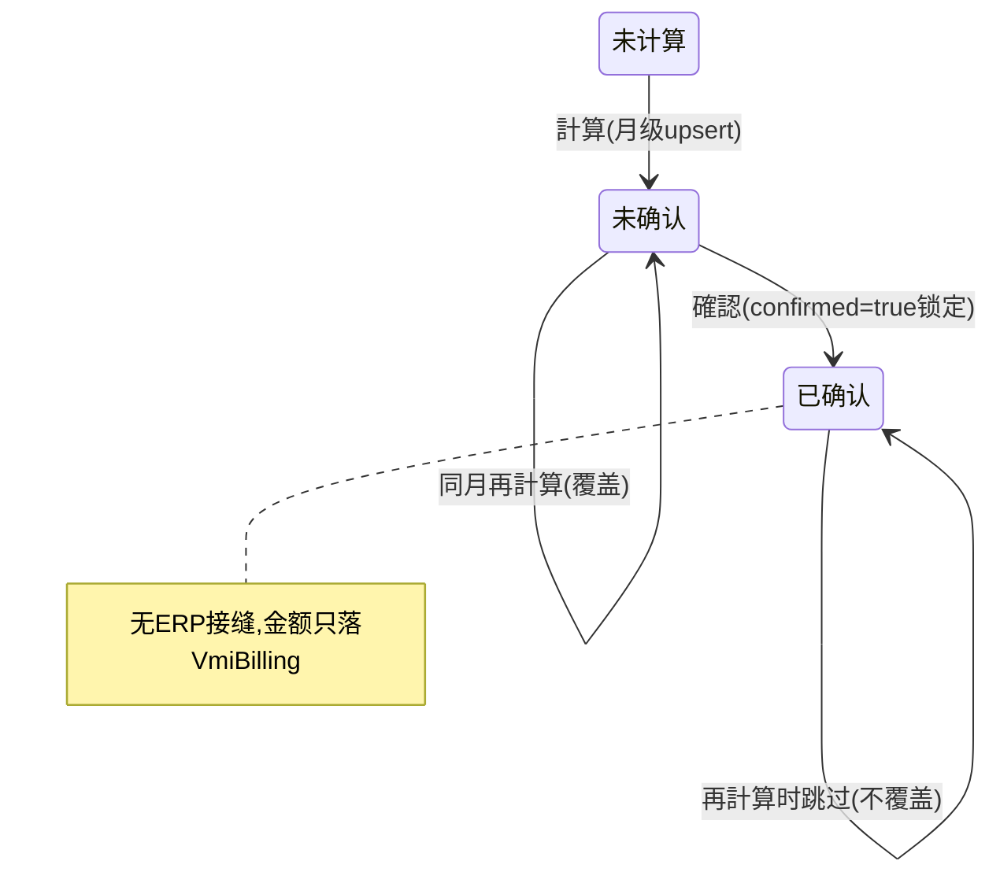

# VMI（寄售/客先在库 + 月次保管料）单页面操作 SOP（手把手版）

> **用途**：给**寄售业务担当操作、财务核对保管料、培训老师讲、测试人员拆用例**。比模块总册（`03-库存物流WMS` §5.20）更细。
> **页面**：VMI（WM250 · 库存物流 WMS）　**路由**：`/wms/vmi`　**前端**：`views/wms/VmiView.vue`　**API**：`api/wms/paperIndustry2.ts vmiApi`　**后端**：`Wms/VmiController` → `VmiService`（`CalculateMonthlyBillingAsync` / `ConfirmBillingAsync`）
> **基准**：分支 `feat/wfs-inbox-core`，2026-06-29；后端实测 `docs/codemap-wms/06-業界連携-报表.md`（2026-06-22 权威），UI 经 agent 实读 view。
> **样例数据**：客户 `CUST-A`、製品 `PRD2026070001`、LotNo `LOT2026070001`、倉庫 `W01`、年月 `202607`、日保管费率 `1.0`、账单 `VMI2026070001`。

---

## 1. 页面一句话说明

**VMI 就是"客户的货寄存在我方仓库"（VMI=Vendor Managed Inventory）的看板与月度保管料结算口——这里只看 `OwnerType=Customer` 的库存（按客户汇总 + 逐 Lot 明细），并按"月平均在库 × 日费率 × 当月天数"算出每个客户的月次保管料、确认锁定。** ⚠️ 它**只算钱、不开账**：保管料**只写进 `VmiBilling` 表，不会自动开应收(AR)、不会生成凭证、不回写财务模块**，商业闭环靠人工把这张表的金额拿去财务开单。

---

## 2. 这个页面在业务流程中的位置

- **上游**：入庫时标 `OwnerType=Customer`+`OwnerCd`（客供库存，见在庫照会 5.3）。
- **本页**：客户汇总 / 明细 / 月次保管料计算与确认。
- **下游**：⚠️ **无 ERP 接缝**——保管料只落 `VmiBilling`，开应收/凭证需人工。

---

## 3. 谁使用这个页面

| 角色 | 用途 |
|---|---|
| 寄售业务担当 | 看客户寄存在库、算月度保管料 |
| 财务/会计 | 取保管料金额去财务开应收单（人工） |
| 仓库主管 | 核对客供库存规模 |

---

## 4. 操作前准备

- [ ] 已有 `OwnerType=Customer` 的库存（入庫时标客供 + `OwnerCd`=客户码，如 `CUST-A`）。
- [ ] 明确结算年月（`YYYYMM`，如 `202607`）与日保管费率（如 `1.0` 元/件/天）。
- [ ] 理解一句口诀：**本页只算钱不开账**——确认后金额不会自动进财务，需人工开应收。

---

## 5. 页面区域说明

| 区域 | 内容 |
|---|---|
| 三个页签（el-tabs type=card） | ① 客户汇总 ② 明细 ③ 保管料 |
| ① 客户汇总 Tab | 检索（customerCd）+ 客户汇总表（客户码/名/SKU 数/在库/引当/可用/估值/[查看明细]） |
| ② 明细 Tab | **无选中客户则 disabled**；显示选中客户 tag + 刷新 + 明细表（产品/Lot/仓/库位/在库/可用/入库日/到期日） |
| ③ 保管料 Tab | 检索（customerCd/yearMonth/已确认）+ 計算按钮 + 账单表（账单号/客户/年月/SKU 数/期初/期末/平均/日费率/**保管料金额**/计算时刻/已确认 tag/[确认]） |
| 计算对话框 | 年月（maxlen7）+ 日保管费率（min0 precision4，默认 1.0） |

---

## 6. 字段填写说明（口语版）

**客户汇总 Tab·检索**：customerCd（客户码模糊，空=全部客户）。

**明细 Tab**：只读展示选中客户的逐 Lot 客供库存；到期日着色——过期红 / 30 天内黄（前端按本地时间自算天数）。

**保管料 Tab·检索**：customerCd / yearMonth / 已确认（select：`true`=已确认 / `false`=「—」未确认）。

**计算对话框**（`openCalc` 默认本月）：

| 字段 | 控件 | 必填 | 怎么填 | 填错影响 |
|---|---|---|---|---|
| 年月（yearMonth） | 输入(≤7) | 是 | `YYYYMM`，如 `202607` | 非 YYYYMM→`yearMonth must be YYYYMM` |
| 日保管费率（dailyStorageRate） | 数字(≥0,4位) | 是 | 元/件/天，默认 `1.0` | ≤0→后端拒（费率须>0） |

> **保管料公式**（后端 `CalculateMonthlyBillingAsync`）：`AvgQty = (BeginQty + EndQty) / 2`，`BillingAmount = AvgQty × dailyStorageRate × daysInMonth`（当月天数）。

---

## 7. 按钮操作说明

| 按钮 | 何时出现 | 点了会怎样 |
|---|---|---|
| 検索（各 Tab） | 常显 | 重拉对应数据（客户汇总/明细/账单） |
| 查看明细（客户行） | 客户汇总行 | 切到明细 Tab + 拉该客户逐 Lot 明细 |
| 計算（保管料 Tab） | 保管料 Tab | 打开计算对话框 |
| 計算执行（对话框确定） | 对话框 | `vmiApi.calculate(yearMonth,dailyRate)` **月级 upsert**（重算覆盖同月，已 Confirmed 客户跳过），toast upserted 条数 |
| 確認（账单行） | `!row.confirmed` 才显示 | `ElMessageBox.confirm`→`vmiApi.confirm(billingNo)`→`confirmed=true` 锁定；**无 ERP/财务接缝** |

---

## 8. 标准业务操作 SOP（照着点）

### 场景一：看客户寄存在库（主流程）
- **背景**：核对 A 社寄存在我方多少货。
- **样例数据**：客户 `CUST-A`。
- **前置**：已有 `OwnerType=Customer`+`OwnerCd=CUST-A` 的库存。
- **步骤**：1) 客户汇总 Tab→（可填 `CUST-A`）検索；2) 看该客户 SKU 数/在库/引当/可用/估值；3) 点行「查看明细」。
- **完成后检查**：切到明细 Tab，逐 Lot 列出该客户库存；到期日近的红/黄高亮。
- **异常**：无客供库存→列表空。
- **用例**：TC-M06-VMI-001~004。

### 场景二：算月度保管料（核心）
- **背景**：月底给 A 社结算 7 月保管料。
- **样例数据**：年月 `202607`、日费率 `1.0`。
- **前置**：该月有客供库存。
- **步骤**：1) 保管料 Tab→「計算」；2) 填年月 `202607`+日费率 `1.0`；3) 确定。
- **完成后检查**：toast 显 upserted 条数；账单表出现各客户一行：期初/期末/平均/日费率/**保管料金额**=平均×费率×当月天数（7 月=31 天）。
- **异常**：年月非 YYYYMM→`yearMonth must be YYYYMM`；费率≤0→后端拒。
- **用例**：TC-M06-VMI-005~012。

### 场景三：确认锁定账单
- **背景**：金额核对无误，锁定本月账单。
- **步骤**：保管料 Tab→某未确认行「確認」→确认框→确定。
- **完成后检查**：该行 `confirmed=true`（tag 变已确认）；「確認」按钮消失；再计算同月时该客户被跳过。
- **异常**：对已确认行再确认→`WM-MSG-043`（既确定）。
- **用例**：TC-M06-VMI-013~016。

### 场景四：月级 upsert 重算覆盖
- **背景**：月中库存有变，重算同月。
- **步骤**：同月（未确认状态）再「計算」一次。
- **完成后检查**：同月账单被**覆盖更新**（upsert，非新增重复行）；已 Confirmed 客户不被覆盖（跳过）。
- **用例**：TC-M06-VMI-017、018。

### 场景五：保管料无 ERP 接缝核对（⚠️ 重点）
- **背景**：确认后以为财务自动开了应收。
- **步骤**：确认账单后→去财务模块查应收/凭证。
- **完成后检查/盲点**：⚠️ **财务无任何自动应收/凭证**——保管料**只落 `VmiBilling` 表**，商业闭环靠人工把金额拿去财务开单（`待业务确认` 是否补接缝）。
- **用例**：TC-M06-VMI-019、020。

### 场景六：按确认状态筛选
- **背景**：查未确认/已确认账单。
- **步骤**：保管料 Tab→已确认 select 选 `false`（标签「—」）或 `true`→検索。
- **完成后检查**：列表按确认状态过滤；注意 `false` 标签显「—」易误解为"无数据"。
- **用例**：TC-M06-VMI-021、022。

---

## 9. 状态变化说明

---

## 10. 按钮不可用 / 灰色原因

| 现象 | 原因 |
|---|---|
| 明细 Tab 不可点/为空 | **未选中客户**（明细 Tab `disabled` 直到从客户汇总点「查看明细」） |
| 账单行无「確認」按钮 | 已确认（`row.confirmed===true`，`v-if !row.confirmed`） |
| 確認后报错 | 对已确认账单再确认→`WM-MSG-043` |

---

## 11. 常见错误与处理

| 错误 | 原因 | 处理 |
|---|---|---|
| `yearMonth must be YYYYMM` | 年月格式错 | 填 6 位 `YYYYMM`（如 `202607`） |
| 费率被拒 | dailyStorageRate≤0 | 填 >0 的费率 |
| `WM-MSG-043` | 对已确认账单再确认 | 已锁定不可重复确认 |
| `WM-MSG-070` | 数据不存在 | 核对客户/账单 |
| 以为确认就开了应收 | **无 ERP 接缝** | 人工去财务开应收单 |
| 已确认 select「—」看不懂 | `confirmed=false` 标签显「—」 | 「—」=未确认（UI 文案盲点） |

---

## 12. 操作完成后的检查清单

- [ ] 客户汇总/明细：客供库存（`OwnerType=Customer`）正确按客户/Lot 列出。
- [ ] 計算：账单表生成各客户一行，`BillingAmount = AvgQty×dailyRate×当月天数`；同月重算为**覆盖**非新增。
- [ ] 確認：`confirmed=true` 锁定，再计算该客户被跳过。
- [ ] ⚠️ **下游核对**：财务**无**自动应收/凭证（保管料只落 `VmiBilling`，需人工开单）。
- [ ] 数量精度 2 位（与报表中心 4 位 / Dashboard 0 位**不一致**，记 `待业务确认`）。

---

## 13. 页面级测试用例（≥25 条，可执行）

> 编号 `TC-M06-VMI-xxx`；数据用样例。

| 用例编号 | 用例名称 | 优先级 | 前置条件 | 测试数据 | 操作步骤 | 预期结果 | 下游检查 | 备注 |
|---|---|---|---|---|---|---|---|---|
| TC-M06-VMI-001 | 客户汇总检索 | P1 | 有客供库存 | CUST-A | 客户汇总検索 | 命中该客户行 | — | — |
| TC-M06-VMI-002 | 汇总列字段 | P2 | 有数据 | — | 看汇总表 | SKU数/在库/引当/可用/估值正确 | — | — |
| TC-M06-VMI-003 | 查看明细跳转 | P1 | 客户行 | CUST-A | 点查看明细 | 切明细 Tab+拉该客户明细 | — | — |
| TC-M06-VMI-004 | 明细 Tab 未选客户禁用 | P2 | 未选客户 | — | 直接点明细 Tab | disabled/空提示 | — | UI |
| TC-M06-VMI-005 | 算保管料主流程 | P0 | 该月有库存 | 202607/1.0 | 計算→填→确定 | 账单生成+toast条数 | VmiBilling表 | 核心 |
| TC-M06-VMI-006 | 保管料公式正确 | P0 | — | 平均×费率×天数 | 计算后核对 | Amount=Avg×1.0×31 | — | 7月31天 |
| TC-M06-VMI-007 | AvgQty 算法 | P1 | 有期初期末 | — | 计算 | Avg=(Begin+End)/2 | — | — |
| TC-M06-VMI-008 | 年月格式校验 | P0 | — | `2026-07` | 計算 | yearMonth must be YYYYMM | 不落库 | — |
| TC-M06-VMI-009 | 费率≤0 校验 | P1 | — | 费率0 | 計算 | 后端拒(费率须>0) | 不落库 | — |
| TC-M06-VMI-010 | 默认本月+费率1.0 | P2 | — | 默认 | 打开计算对话框 | 年月本月/费率1.0预填 | — | — |
| TC-M06-VMI-011 | 多客户各一行 | P1 | 多客户库存 | — | 計算 | 每客户一行账单 | — | — |
| TC-M06-VMI-012 | toast 显条数 | P2 | — | — | 计算后 | toast upserted N 件 | — | — |
| TC-M06-VMI-013 | 确认锁定 | P0 | 未确认账单 | VMI2026070001 | 確認→确定 | confirmed=true,tag变 | — | — |
| TC-M06-VMI-014 | 确认后无按钮 | P2 | 已确认 | — | 看行 | 「確認」消失(v-if) | — | — |
| TC-M06-VMI-015 | 重复确认拦截 | P1 | 已确认 | — | 再确认 | WM-MSG-043 | — | — |
| TC-M06-VMI-016 | 确认带二次确认框 | P2 | 未确认 | — | 確認 | ElMessageBox 弹确认 | — | — |
| TC-M06-VMI-017 | 月级 upsert 覆盖 | P0 | 同月已算 | 202607 | 再計算 | 覆盖更新非新增重复 | VmiBilling | 关键 |
| TC-M06-VMI-018 | 已确认客户跳过 | P1 | 某客户已确认 | 同月 | 再計算 | 已确认客户不覆盖 | — | — |
| TC-M06-VMI-019 | 无 ERP 接缝(应收) | P0 | 确认账单 | — | 查财务应收 | 无自动应收 | 财务 | 盲点 |
| TC-M06-VMI-020 | 无自动凭证 | P1 | 确认账单 | — | 查凭证 | 无自动凭证 | 财务 | 盲点 |
| TC-M06-VMI-021 | 按确认状态筛选 | P2 | 有账单 | true/false | 已确认 select | 列表过滤 | — | — |
| TC-M06-VMI-022 | confirmed=false 标签「—」 | P3 | — | — | 看 select | false 显「—」 | — | UI 盲点 |
| TC-M06-VMI-023 | 明细到期着色 | P2 | 近效期客供库存 | — | 看明细到期日 | 过期红/30天内黄 | — | 前端自算 |
| TC-M06-VMI-024 | 仅客供库存计入 | P1 | 有自社+客供 | — | 看 VMI | 仅 OwnerType=Customer | — | — |
| TC-M06-VMI-025 | 数量精度2位 | P3 | — | — | 看数量 | 2位小数 | — | 与报表4位不一 |
| TC-M06-VMI-026 | 账单号采番 | P2 | 计算后 | — | 看账单号 | 系统生成 billingNo | — | — |
| TC-M06-VMI-027 | 数据不存在 | P2 | — | 错客户/账单 | 操作 | WM-MSG-070 | — | — |
| TC-M06-VMI-028 | 无实时刷新 | P3 | — | — | 停留观察 | onMounted 拉一次,无轮询 | — | — |
| TC-M06-VMI-029 | 权限不足 | P2 | 无权账号 | — | 进页面/计算 | 待业务确认(隐藏/拒绝) | — | 权限 |
| TC-M06-VMI-030 | 网络异常 | P2 | 断网 | — | 計算 | 友好错误可重试 | — | — |

---

## 14. 培训讲解建议

| 顺序 | 讲什么 | 演示 | 易误解点 |
|---|---|---|---|
| 1 | VMI=客户的货寄存在我方 | §2 流程图 | 以为是自社库存 |
| 2 | 三个 Tab 的分工 | 汇总→明细→保管料 | 明细要先从汇总点进 |
| 3 | 保管料公式 | 算一次 202607 | 平均=(期初+期末)/2 |
| 4 | 月级 upsert vs 确认锁定 | 重算+确认 | 重算会覆盖、确认后跳过 |
| 5 | **只算钱不开账** | 讲无 ERP 接缝 | 以为确认就进财务了 |
| 6 | 已确认「—」标签 | 讲 select 文案 | 「—」=未确认 |

---

## 15. 与模块级手册的关系

对应 `03-库存物流WMS-...md` §5.20（業界連携・寄售类表格概述）。模块测试矩阵 §7、术语 §9（OwnerType=Customer/VMI）、待确认 §10（C-M06-12 VMI 无 ERP 接缝、C-M06-14 数量精度三处不一致）。

---

## 16. 代码与文档来源

| 层 | 文件 |
|---|---|
| 逐行源码手册 | `docs/codemap-wms/06-業界連携-报表.md`（VMI 节，权威） |
| 前端 | `views/wms/VmiView.vue`（3 Tab + 计算对话框） |
| API/类型 | `api/wms/paperIndustry2.ts`(vmiApi)、`types/wms/wms.ts`(VmiCustomerSummary/VmiStockDetail/VmiBilling) |
| 后端 | `Wms/VmiController.cs`、`Services/Wms/VmiService.cs`（CalculateMonthlyBillingAsync/ConfirmBillingAsync） |
| 实体 | `DomainModels/Wms/VmiBilling.cs`、`Stock.cs`(OwnerType=Customer) |

---

## 最后更新来源

- 代码：见 §16（codemap-wms 06 + view 实读 + types 枚举）。
- 基准：分支 `feat/wfs-inbox-core`，2026-06-29（codemap 2026-06-22）。
- 覆盖：16 节 / 6 场景 / 30 用例（TC-M06-VMI-001~030）。
