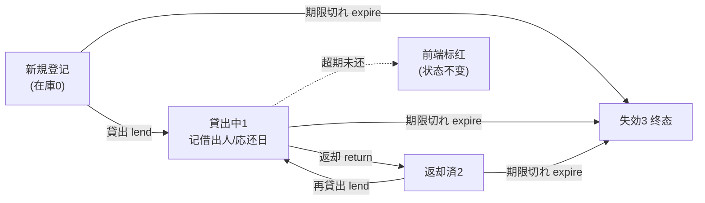
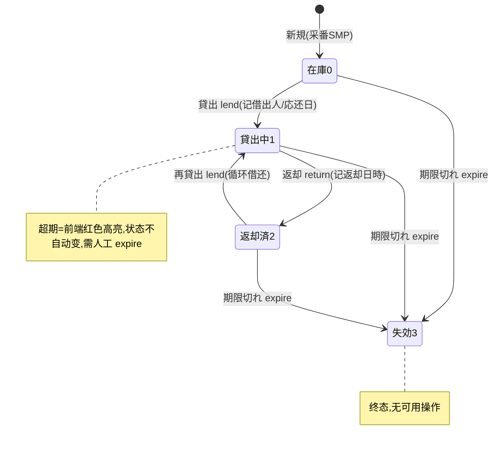

# サンプル在庫 单页面操作 SOP（手把手版）

> **用途**：给**营业/样品室担当操作、培训老师讲、测试人员拆用例**。比模块总册（`03-库存物流WMS` §5.19）更细。
> **页面**：サンプル在庫（MSBBWM260 · 库存物流 WMS · 紙器業特化）　**路由**：`/wms/sample-stock`　**前端**：`views/wms/SampleStockView.vue`　**API**：`api/wms/paperIndustry2.ts sampleApi`（base `/api/wms/sample-stock`）　**后端**：`Wms/SampleStockController` → `SampleStockService`
> **基准**：分支 `feat/wfs-inbox-core`，2026-06-29；后端实测 `docs/codemap-wms/05-紙器特化.md` §8（2026-06-22 权威）+ `SampleStockService.cs`/`SampleStockController.cs` 逐行核对，UI 经实读 view。
> **样例数据**：样品 `SMP2026070001`、種別 `PROTO`（試作）、客户 `CUST-A`、製品 `PRD2026070001`、数量 5、貸出先 `CUST-A 田中`、返却予定日 = 今日 +7 天。

---

## 1. 页面一句话说明

**サンプル在庫，就是营业/样品室登记并管理"样品"（試作 PROTO / 色見本 COLOR / ダミー DUMMY / その他 OTHER）的地方——把样品箱借给客户（貸出）、记下借给谁和应还日，对方还回来时点返却，谁逾期未还可一键查到并标红，整批不要了就期限切れ作废。** 它用**独立专用表 `SampleStock`，不走 WMS 库存铁律**，状态只在自身表内迁移，所以一只样品可以**循环借还**（还回来后还能再借）。

---

## 2. 这个页面在业务流程中的位置

- **上游**：营业/样品室登记样品（无 ERP/MES 接缝，纯样品台账）。
- **本页**：貸出↔返却循环 + 超期检出 + 失効作废。
- **下游**：**无**——本页是独立专用表，不动主 `Stock`、不入凭证、不触发任何跨模块联动。

---

## 3. 谁使用这个页面

| 角色 | 用途 |
|---|---|
| 营业担当 | 把試作箱/色見本借给客户、催收逾期未还 |
| 样品室/サンプル室担当 | 登记样品入库、收回返却、作废失効品 |
| 业务管理 | 看哪些样品借出中、谁超期未还 |

---

## 4. 操作前准备

- [ ] 样品已物理到位（試作箱/色見本/ダミー），知道種別（PROTO/COLOR/DUMMY/OTHER）、数量、单位。
- [ ] 貸出前：清楚**借给谁**（貸出先，必填，如 `CUST-A 田中`）与**应还日**（返却予定日，可空）。
- [ ] 知道目标样品当前状态——**只有"在庫/返却済"能貸出**，"貸出中"才能返却，已"失効"什么都不能做。
- [ ] 明白本页**不走库存铁律**：貸出不会扣主仓 `Stock`，只在样品台账内改状态。

---

## 5. 页面区域说明

| 区域 | 内容 |
|---|---|
| 検索卡（顶部） | 样品NO / 種別下拉 / 客户CD / 製品CD / 状态下拉 / **超期のみ**复选框 / 「検索」/「新規」按钮 |
| 一覧表 | 每行：样品NO / 状态 tag / 種別 / 客户CD·客户名 / 製品CD·製品名 / 数量+単位 / ロケ / 貸出先 / 貸出日時 / **返却予定日（超期红色高亮）** / 返却日時 / 操作列 |
| 操作列（行内按钮） | 貸出（status 0/2 显示）/ 返却（status 1 显示）/ 期限切れ（status≠3 显示）。**无编辑、无删除按钮** |
| 新規 Dialog（600px） | 種別必填 / 数量必填 / 客户CD·名 / 製品CD·名 / 単位 / 倉庫 / ロケ / 備考 |
| 貸出 Dialog（460px） | 貸出先（必填）/ 返却予定日（日付选择器 YYYY-MM-DD） |

> ⚠️ **诚实标注**：后端有 `update`(PUT)、`delete`(DELETE)、`/overdue`(GET) 三个端点，但**此 view 的操作列不渲染编辑/删除按钮**，超期复选框走的是検索过滤（`overdueOnly`）而非 `/overdue` 端点（见 §6、§10）。

---

## 6. 字段填写说明（口语版）

**検索卡**：

| 字段 | 怎么填 | 说明 |
|---|---|---|
| 样品NO | 模糊（Contains） | 后端 `SampleNo.Contains` |
| 種別 | 下拉 PROTO/COLOR/DUMMY/OTHER | 精确匹配 |
| 客户CD / 製品CD | 精确（==） | 后端 `==` 匹配 |
| 状态 | 下拉 在庫0/貸出中1/返却済2/失効3 | 精确匹配 |
| **超期のみ** | 复选框 | 勾上→只看"貸出中且返却予定日 < **服务器今日**"的样品（`SearchAsync` 的 overdueOnly 过滤，**与 `/overdue` 端点同谓词但不是同一调用**） |

**新規 Dialog**（默认：種別=PROTO、数量=1、単位=PCS）：

| 字段 | 必填 | 怎么填 | 填错影响 |
|---|---|---|---|
| 種別 sampleType | ✅ | 下拉选 PROTO/COLOR/DUMMY/OTHER | 空→后端 `SampleType required`（裸文案，非 WM-MSG 码） |
| 数量 quantity | ✅ | `>0`，精度 4 位（如 5） | `≤0`→后端 `Quantity > 0`（裸文案） |
| 客户CD/名、製品CD/名 | ✖ | 可空 | — |
| 単位 unitCd | ✖ | 默认 PCS | — |
| 倉庫/ロケ | ✖ | 可空 | — |
| 備考 | ✖ | 自由文本 | — |

**貸出 Dialog**：

| 字段 | 必填 | 怎么填 | 填错影响 |
|---|---|---|---|
| 貸出先 lentTo | ✅ | 借给谁，如 `CUST-A 田中`（≤60 字） | 空→前端先弹 `wms.common.required` 拦下；后端兜底 `lentTo required` |
| 返却予定日 expectedReturnDate | ✖ | 日付，如今日 +7 天 | 空→可借但**不会进超期名单**（超期判定要求该日期非空） |

---

## 7. 按钮操作说明

| 按钮 | 何时出现（按 status） | 点了会怎样 |
|---|---|---|
| 検索 | 常显 | 按条件查样品（含超期のみ过滤） |
| 新規 | 常显 | 开新規 Dialog；保存成功 toast `成功: SMP…`（含采番号），采番前缀 **SMP**，初始状态=在庫0 |
| 貸出 lend | status 0(在庫) 或 2(返却済) | 开貸出 Dialog；確定后→**貸出中1**，记貸出先/貸出日時(now)/返却予定日，且清空上次返却日時 |
| 返却 return | status 1(貸出中) | 二次确认→**返却済2**，记返却日時(now) |
| 期限切れ expire | status ≠ 3 | 二次确认→**失効3**（终态） |

> 后端成功统一返回 `WM-MSG-071`；新規额外返回 `sampleNo`。前端貸出/返却/期限切れ成功 toast 用 `wms.common.success`。

---

## 8. 标准业务操作 SOP（照着点）

### 场景一：登记新样品（新規）
- **背景**：样品室收到一批試作样品，要建台账。
- **样例数据**：種別 `PROTO`、数量 5、単位 PCS、客户 `CUST-A`、製品 `PRD2026070001`。
- **步骤**：1) 点「新規」；2) 種別选 PROTO、数量填 5、补客户/製品；3) 「保存」。
- **完成后检查**：toast `成功: SMP2026070001`；列表新增一行，状态 tag = **在庫（绿色）**；状态字段=0。
- **异常**：種別空→`SampleType required`；数量≤0→`Quantity > 0`（均为裸文案，非 WM-MSG 码）。
- **用例**：TC-M06-SAMPLE-001~004。

### 场景二：样品貸出给客户
- **背景**：营业把試作箱借给客户评估。
- **样例数据**：`SMP2026070001`、貸出先 `CUST-A 田中`、返却予定日=今日 +7 天。
- **前置**：样品状态=在庫0 或 返却済2。
- **步骤**：1) 行内点「貸出」；2) 填貸出先 `CUST-A 田中`、选返却予定日；3) 「貸出」確定。
- **完成后检查**：状态→**貸出中（橙色）**；貸出先/貸出日時/返却予定日落库；返却日時被清空。
- **异常**：貸出先空→前端 `wms.common.required` 拦下；对在庫/返却済以外状态点貸出→`WM-MSG-043: 保管中/返却済のみ貸出可`。
- **用例**：TC-M06-SAMPLE-005~008。

### 场景三：样品返却（收回）
- **背景**：客户把样品还回来了。
- **前置**：状态=貸出中1。
- **步骤**：行内点「返却」→二次确认。
- **完成后检查**：状态→**返却済（蓝色）**；返却日時=now；返却予定日的红色高亮消失（因高亮只在貸出中1判定）。
- **异常**：对非貸出中点返却→`WM-MSG-043: 貸出中のみ返却可`。
- **用例**：TC-M06-SAMPLE-009、010。

### 场景四：循环借还（返却済再貸出）
- **背景**：同一只样品下次再借给别的客户——**专用表不走铁律，可重复借还**。
- **前置**：状态=返却済2。
- **步骤**：对返却済样品再点「貸出」→填新貸出先→確定。
- **完成后检查**：状态从 2 重新回到**貸出中1**；新貸出先/貸出日時覆盖旧值，返却日時清空。证明"已返可再借"成立。
- **用例**：TC-M06-SAMPLE-011、012。

### 场景五：超期未还查询与红色高亮（★核心盲点）
- **背景**：检查谁借了样品逾期没还。
- **前置**：有"貸出中且返却予定日已过"的样品（把場景二样品返却予定日设为昨天）。
- **步骤**：1) 不勾超期，看列表——逾期那行的**返却予定日单元格显示红色加粗**；2) 勾「超期のみ」→「検索」，列表只剩逾期且貸出中的行。
- **完成后检查（务必理解两套逻辑）**：
  - **红色高亮**＝纯前端 `overdueClass`：仅当 `status===1` 且 `new Date(返却予定日) < new Date()`（**客户端当前时刻、本地时区**）才标红；
  - **超期のみ过滤**＝后端 `SearchAsync`：`status==貸出中 && 返却予定日 < DateTime.Today`（**服务器今日、整日粒度**）；
  - **★两者是两套独立逻辑**，跨日界/时区可不一致：例如返却予定日=今日，下午看会**标红**（今日0点 < 现在），但**不进超期のみ名单**（今日 不 < 今日）。
- **★最关键盲点**：**超期不会自动改状态**——逾期样品仍是"貸出中1"，红色只是提醒，**需人工点「期限切れ」**才会变失効。系统不存在到期自动失效/自动催还。
- **异常**：返却予定日为空的样品永不进超期名单、永不标红（判定要求该日期非空）。
- **用例**：TC-M06-SAMPLE-013~018。

### 场景六：期限切れ作废（失効）
- **背景**：样品损坏/过时/客户不还了，整只作废。
- **前置**：状态≠失効3（在庫/貸出中/返却済都能作废）。
- **步骤**：行内点「期限切れ」→二次确认。
- **完成后检查**：状态→**失効（灰色）**，终态；此后该行无任何可用操作按钮（貸出仅0/2、返却仅1、期限切れ仅≠3）。
- **异常**：对已失効再点→`WM-MSG-043: 既に失効`。
- **用例**：TC-M06-SAMPLE-019~021。

### 场景七：状态守卫综合（拦截非法迁移）
- **背景**：验证状态机各守卫。
- **步骤/检查**：在庫品点返却→`貸出中のみ返却可`；貸出中点貸出→`保管中/返却済のみ貸出可`；失効品任何操作按钮都不出现。
- **用例**：TC-M06-SAMPLE-022~024。

---

## 9. 状态变化说明

| 状态 | 值 | tag 颜色 | 含义 |
|---|---|---|---|
| 在庫 InStock | 0 | 绿（success） | 在库可借 |
| 貸出中 LentOut | 1 | 橙（warning） | 借出中（超期会红高亮） |
| 返却済 Returned | 2 | 蓝（primary） | 已还、可再借 |
| 失効 Expired | 3 | 灰（info） | 作废终态 |

---

## 10. 按钮不可用 / 灰色原因

| 现象 | 原因 |
|---|---|
| 行内无「貸出」 | 状态非 在庫0 / 返却済2 |
| 行内无「返却」 | 状态非 貸出中1 |
| 行内无「期限切れ」 | 状态已是 失効3（终态） |
| 失効行完全无按钮 | 三个按钮条件都不满足（貸出仅0/2、返却仅1、期限切れ仅≠3） |
| 整页找不到「编辑」「削除」 | **此 view 操作列未渲染编辑/删除按钮**（后端 PUT/DELETE 端点存在但 UI 无入口） |
| 「超期のみ」与红色高亮对不上 | **两套逻辑**：过滤用服务器 `DateTime.Today`（整日），高亮用前端 `new Date()`（当前时刻/本地时区）；跨日界可不一致 |
| 逾期样品状态仍是"貸出中" | **超期不自动改状态**，红色仅提醒，需人工点「期限切れ」 |

---

## 11. 常见错误与处理

| 错误 | 原因 | 处理 |
|---|---|---|
| `SampleType required`（裸文案） | 新規種別空 | 选種別 |
| `Quantity > 0`（裸文案） | 新規数量≤0 | 填正数（精度 4 位） |
| 前端 `wms.common.required` | 貸出先空 | 填貸出先（再点確定）；后端兜底 `lentTo required` |
| `WM-MSG-043: 保管中/返却済のみ貸出可` | 对非 在庫/返却済 状态貸出 | 仅 0/2 可借 |
| `WM-MSG-043: 貸出中のみ返却可` | 对非貸出中返却 | 仅 1 可返却 |
| `WM-MSG-043: 既に失効` | 对已失効再失効 | 失効是终态，无需重复 |
| `WM-MSG-043: 失効品は訂正不可` | 改失効品（PUT update） | 失効品不可訂正（且 UI 无编辑入口） |
| `WM-MSG-043: 貸出中は削除不可（先に返却）` | 删貸出中样品（DELETE） | 先返却再删（UI 无删除入口，仅 API 层） |
| `WM-MSG-070` | 样品NO 不存在 | 核对样品NO |

> `WM-MSG-043` 在本服务出现 **5 处**：貸出守卫 / 返却守卫 / 期限切れ守卫 / 訂正守卫(失効) / 削除守卫(貸出中)。`WM-MSG-070`=样品不存在。成功统一 `WM-MSG-071`。

---

## 12. 操作完成后的检查清单

- [ ] 新規：toast `成功: SMP…`、采番前缀 SMP、状态=在庫0（绿）。
- [ ] 貸出：状态→貸出中1（橙）、貸出先/貸出日時/返却予定日落库、返却日時清空。
- [ ] 返却：状态→返却済2（蓝）、返却日時=now、红色高亮消失。
- [ ] 再貸出：返却済2→貸出中1 成立（循环借还），新貸出先覆盖旧值。
- [ ] 期限切れ：状态→失効3（灰）、终态无按钮。
- [ ] **不动主库存**：全程不产生 `Stock`/`StockTransaction` 记录、不入凭证（专用表解耦、不走铁律）。
- [ ] **超期=两套逻辑**：理解过滤(服务器 Today) vs 高亮(前端 now) 可不一致；超期**不自动改状态**。

---

## 13. 页面级测试用例（≥25 条，可执行）

> 编号 `TC-M06-SAMPLE-xxx`；数据用样例（样品 `SMP2026070001`、種別 PROTO、客户 CUST-A、製品 PRD2026070001、貸出先 `CUST-A 田中`）。

| 用例编号 | 用例名称 | 优先级 | 前置条件 | 测试数据 | 操作步骤 | 预期结果 | 下游检查 | 备注 |
|---|---|---|---|---|---|---|---|---|
| TC-M06-SAMPLE-001 | 新規登记样品 | P0 | — | PROTO/数量5/PCS | 新規→填→保存 | toast `成功: SMP…`、状态=在庫0 | 不动主Stock | 核心 |
| TC-M06-SAMPLE-002 | 采番前缀 SMP | P1 | — | 连续新建 | 新規×2 | 采番 SMP+流水递增 | — | — |
| TC-M06-SAMPLE-003 | 種別空拦截 | P0 | 新規 Dialog | 種別清空 | 保存 | `SampleType required`（裸文案） | 不落库 | 非WM码 |
| TC-M06-SAMPLE-004 | 数量≤0拦截 | P0 | 新規 Dialog | 数量0 | 保存 | `Quantity > 0`（裸文案） | 不落库 | 非WM码 |
| TC-M06-SAMPLE-005 | 在庫品貸出 | P0 | 状态=在庫0 | 貸出先 CUST-A 田中/応还+7天 | 貸出→填→確定 | 状态→貸出中1、记借出人/日時/応还日 | 返却日時清空 | 核心 |
| TC-M06-SAMPLE-006 | 貸出先空拦截 | P0 | 貸出 Dialog | 貸出先空 | 確定 | 前端 `wms.common.required` 拦下 | 不提交 | — |
| TC-M06-SAMPLE-007 | 貸出先后端兜底 | P2 | 绕过前端 | 空 lentTo | 直调API | `lentTo required` | 不落库 | API层 |
| TC-M06-SAMPLE-008 | 应还日可空 | P1 | 在庫0 | 返却予定日空 | 貸出 | 借成功、但永不进超期名单 | — | 判定要求非空 |
| TC-M06-SAMPLE-009 | 貸出中返却 | P0 | 状态=貸出中1 | — | 返却→确认 | 状态→返却済2、返却日時=now | 红高亮消失 | 核心 |
| TC-M06-SAMPLE-010 | 非貸出中返却拦截 | P0 | 状态=在庫0 | — | 返却 | `WM-MSG-043: 貸出中のみ返却可` | 不变更 | — |
| TC-M06-SAMPLE-011 | 返却済再貸出 | P0 | 状态=返却済2 | 新貸出先 | 貸出→確定 | 状态 2→貸出中1，可循环借还 | 旧返却日時清空 | ★循环 |
| TC-M06-SAMPLE-012 | 再貸出覆盖旧借出人 | P1 | 返却済2 | 新貸出先 B | 貸出 | 貸出先/貸出日時更新为新值 | — | — |
| TC-M06-SAMPLE-013 | 超期红色高亮 | P0 | 貸出中1 | 返却予定日=昨天 | 看列表 | 返却予定日单元格红色加粗 | — | ★前端样式 |
| TC-M06-SAMPLE-014 | 超期不自动改状态 | P0 | 貸出中且逾期 | — | 等待/刷新 | 状态仍=貸出中1（不自动失效） | 需人工expire | ★盲点 |
| TC-M06-SAMPLE-015 | 超期のみ过滤 | P0 | 有逾期样品 | 勾超期のみ | 検索 | 仅列"貸出中且返却予定日<服务器今日" | — | 后端过滤 |
| TC-M06-SAMPLE-016 | 过滤vs高亮不一致 | P1 | 返却予定日=今日 | 下午查看 | 看列表 | 标红但不在超期のみ名单 | — | ★两套逻辑 |
| TC-M06-SAMPLE-017 | 返却済不标红 | P2 | 状态=返却済2 | 返却予定日已过 | 看列表 | 不标红（高亮仅 status1） | — | — |
| TC-M06-SAMPLE-018 | 应还日空不标红 | P2 | 貸出中1 | 返却予定日空 | 看列表 | 不标红、不入超期 | — | — |
| TC-M06-SAMPLE-019 | 在庫品期限切れ | P1 | 状态=在庫0 | — | 期限切れ→确认 | 状态→失効3（终态） | — | — |
| TC-M06-SAMPLE-020 | 貸出中期限切れ | P1 | 状态=貸出中1 | — | 期限切れ→确认 | 状态→失効3 | 不要求先返却 | — |
| TC-M06-SAMPLE-021 | 已失効再失効拦截 | P1 | 状态=失効3 | — | （无按钮）/直调API | `WM-MSG-043: 既に失効` | 不变更 | 终态 |
| TC-M06-SAMPLE-022 | 状态守卫:貸出非法 | P0 | 状态=貸出中1 | — | 貸出 | `WM-MSG-043: 保管中/返却済のみ貸出可` | 不变更 | — |
| TC-M06-SAMPLE-023 | 失効行无操作按钮 | P1 | 状态=失効3 | — | 看操作列 | 貸出/返却/期限切れ全不显示 | — | — |
| TC-M06-SAMPLE-024 | 样品不存在 | P2 | — | 错样品NO | 直调lend/return | `WM-MSG-070` | — | — |
| TC-M06-SAMPLE-025 | 按样品NO模糊检索 | P1 | 有样品 | SMP2026 | 検索 | Contains 命中 | — | — |
| TC-M06-SAMPLE-026 | 按種別检索 | P2 | 有样品 | 種別=PROTO | 検索 | 精确命中 | — | — |
| TC-M06-SAMPLE-027 | 按状态检索 | P2 | 多状态 | 状态=貸出中1 | 検索 | 仅貸出中 | — | — |
| TC-M06-SAMPLE-028 | 按客户/製品检索 | P2 | 有样品 | CUST-A/PRD2026070001 | 検索 | 精确(==)命中 | — | — |
| TC-M06-SAMPLE-029 | 失効品訂正拦截 | P2 | 失効3 | 任意改 | PUT update | `WM-MSG-043: 失効品は訂正不可` | UI无编辑入口 | API层 |
| TC-M06-SAMPLE-030 | 貸出中删除拦截 | P2 | 貸出中1 | — | DELETE | `WM-MSG-043: 貸出中は削除不可（先に返却）` | UI无删除入口 | API层 |
| TC-M06-SAMPLE-031 | 不走库存铁律 | P1 | 全流程 | — | 新規/貸出/返却 | 无 Stock/StockTransaction 产生 | 专用表解耦 | 核对 |
| TC-M06-SAMPLE-032 | 列表只读字段展示 | P3 | 有样品 | — | 看列表 | 貸出先/貸出日時/返却日時 正确显示 | — | — |

---

## 14. 培训讲解建议

| 顺序 | 讲什么 | 演示 | 易误解点 |
|---|---|---|---|
| 1 | 这页管"样品借还台账" | §2 流程图 | 以为会扣主库存（不会，专用表解耦） |
| 2 | 四状态+颜色 | 在庫绿/貸出中橙/返却済蓝/失効灰 | 失効是终态 |
| 3 | 貸出→返却→再貸出 | 演示循环借还 | 以为还回来就不能再借 |
| 4 | **超期=红高亮但状态不变** | 设过期日看红+查状态仍貸出中 | 以为系统会自动失效/催还 |
| 5 | **过滤 vs 着色 两套逻辑** | 设返却予定日=今日看差异 | 以为标红的一定进超期名单 |
| 6 | 状态守卫 | 在庫点返却报错 | 以为任何状态都能任意操作 |
| 7 | UI 无编辑/删除 | 看操作列只有 3 个按钮 | 以为能在列表改/删（仅 API 有） |

---

## 15. 与模块级手册的关系

对应 `03-库存物流WMS-最详细用户操作培训手册.md` §5.19（紙器業特化 · サンプル在庫 WM260 行）。模块验收 §8（AC-M06-11 紙器特化解耦：原紙/残材/版型/インキ/パレット/サンプル 独立专用表不走铁律）、培训路径 §8 紙器特化 12min。逐行源码见 `docs/codemap-wms/05-紙器特化.md` §8。

---

## 16. 代码与文档来源

| 层 | 文件 |
|---|---|
| 逐行源码手册 | `docs/codemap-wms/05-紙器特化.md` §8（权威，2026-06-22 实测） |
| 前端 | `cp6.web/src/views/wms/SampleStockView.vue`（实读） |
| API/类型 | `cp6.web/src/api/wms/paperIndustry2.ts`(sampleApi)、`cp6.web/src/types/wms/wms.ts`(SampleStock/SampleSearchQuery) |
| 路由 | `cp6.web/src/router/index.ts`（`/wms/sample-stock`） |
| 后端 | `CP6.WebApi/Controllers/Wms/SampleStockController.cs`（MSBBWM260）、`CP6.Core/Services/Wms/SampleStockService.cs`（Lend/Return/Expire/Overdue/守卫逐行核对） |
| 实体/状态常量 | `CP6.Entity/DomainModels/Wms/SampleStock.cs`、`WmsTxnType.cs`(`SampleStatus` InStock0/LentOut1/Returned2/Expired3) |

---

## 最后更新来源

- 代码：见 §16（codemap-wms 05 §8 + view/api/types/router 实读 + Service/Controller 逐行核对）。
- 基准：分支 `feat/wfs-inbox-core`，2026-06-29（codemap 2026-06-22）。
- 覆盖：16 节 / 7 场景 / 32 用例（TC-M06-SAMPLE-001~032）。
- 关键事实校验：WM-MSG-043 五处守卫、WM-MSG-070 不存在、WM-MSG-071 成功、采番 SMP、专用表不走铁律、可循环借还、★超期不自动改状态、★过滤(服务器Today)与着色(前端now)两套逻辑——均与源码一致。
