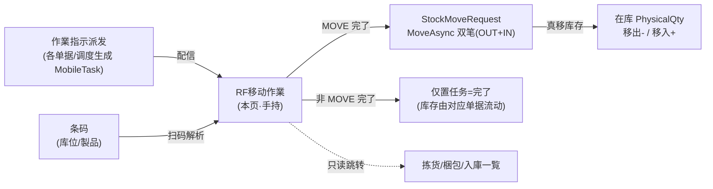
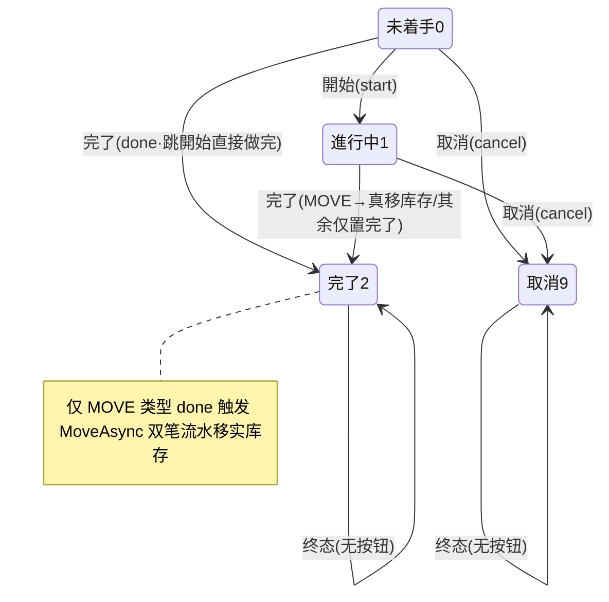

# RF移动作業（手持终端）单页面操作 SOP（手把手版）

> **用途**：给**现场仓库作业员用手持机操作、培训老师讲、测试人员拆用例**。比模块总册（`03-库存物流WMS` §5.20）更细。
> **页面**：RF移动作業 / モバイル作業指示（WM300 · 库存物流 WMS）　**路由**：`/wms/mobile-task`　**前端**：`views/wms/MobileTaskView.vue`　**API**：`api/wms/mobile.ts mobileApi`　**后端**：`Wms/MobileController` → `MobileService.CompleteAsync`（**MOVE 分支真移库存**）
> **基准**：分支 `feat/wfs-inbox-core`，2026-06-29；后端实测 `docs/codemap-wms/06-業界連携-报表.md` §2（2026-06-22 权威），UI 经实读 `MobileTaskView.vue` + `mobile.ts` + `types/wms/wms.ts`。
> **样例数据**：作业 `MOB2026070001`（MOVE 移库）、製品 `PRD2026070001`、移出库位 `RES-C-01`、移入库位 `PIK-A-01`、LotNo `LOT2026070001`、数量 500。

---

## 1. 页面一句话说明

**RF移动作業，就是现场作业员拿手持机（或扫码枪）干活的统一入口——上面扫一条码看这是哪个库位/哪个製品、还有多少在库；下面分 5 个 tab（作業指示/拣货/梱包/入库/盘点）看派给自己的活，对「作業指示」tab 里的任务做「開始 / 完了 / 取消」。** 它最关键的一点：**只有 MOVE（移库）类型的任务，「完了」时会真的把库存从移出库位搬到移入库位（生成出/入两笔流水）；其余类型（收货/上架/拣货/盘点/贴标）的「完了」只把任务标成完了，不动库存**——那些库存由各自的单据流（入庫実績、出荷確定等）去动。

---

## 2. 这个页面在业务流程中的位置

- **上游**：各业务/调度生成的 `MobileTask`（作業指示），含类型、移出/移入库位、製品、数量。
- **本页**：作业员扫码核对 + 对作業指示「開始/完了/取消」。
- **下游**：**MOVE 完了**→`MoveAsync` 真移库存（出/入两笔流水）；其余类型完了不动库存。拣货/梱包/入库 tab 仅是只读列表，点了**跳到对应专用页**操作。

---

## 3. 谁使用这个页面

| 角色 | 用途 |
|---|---|
| 现场仓库作业员（手持机/扫码枪） | 扫码核对库位/製品、对派发的任务開始/完了/取消、MOVE 移库 |
| 班组长 | 看本班待办任务量（顶部统计）、替班完成 |

---

## 4. 操作前准备

- [ ] 手持机已登录、能访问 `/wms/mobile-task`（页面 `max-width:600px`，为手持竖屏排版）。
- [ ] 要做的任务已被派发（作業指示 tab 里能看到，如 `MOB2026070001`）。
- [ ] **MOVE 移库任务**：确认任务上已带齐 仓库 / 移出库位 / 移入库位 / 製品（缺了完了会被 `WM-MSG-303` 拦）。
- [ ] 清楚本次实际搬/做了多少数量——「完了」时要手输实绩数。
- [ ] 知道**本页无实时刷新**：别人改了状态后，要手动点右上角刷新按钮才更新。

---

## 5. 页面区域说明

| 区域 | 内容 |
|---|---|
| 顶部卡（标题区） | 标题 + 当前时刻；右上角圆形**刷新按钮**（唯一手动刷新入口，`reload`） |
| 扫码条 scan-bar | 大号输入框（回车或点「スキャン」触发 `doScan`）；占位 `wms.mobile.scan.ph` |
| 扫码结果 scan-result | 彩色卡：**LOCATION 绿** / **PRODUCT 蓝** / **UNKNOWN 黄**；显库位名/blocked 标签 或 製品CD；带在库小表（库位/製品/Lot/实物数） |
| 统计条 | 5 个数字格：作業指示 / ピッキング / 梱包 / 入庫 / 棚卸 的待办计数 |
| 5 个作业 tab | task（作業指示·**唯一可操作**）/ pick / pack / inbound / **stocktake（恒空占位）** |
| 任务卡 task-card | 任务NO + 优先级(至急)/状态 tag + 类型 tag + 指示文/製品 + 移出⬅/移入➡/数量 + 操作按钮 |
| 完了输入框 | `ElMessageBox.prompt` 弹框，让作业员输实绩数量（`scannedQty`） |

---

## 6. 字段填写说明（口语版）

**扫码条**：扫一条码（或手输）→回车/点按钮。系统解析为 **LOCATION（库位）/PRODUCT（製品）/UNKNOWN（认不出）** 三种，并带出该库位/製品的在库明细。前端只做"空扫直接忽略"（`if(!code) return`），真正解析在后端。

**完了输入框**（点任务「完了」后弹出）：

| 字段 | 何时出现 | 怎么填 | 填错影响 |
|---|---|---|---|
| 实绩数量（scannedQty） | 点「完了」时弹出 | 必填，正数（默认带入任务计划数 `m.qty`，如 500） | 校验正则 `^\d*\.?\d+$`，非数字不让确定；MOVE 时 ≤0→`WM-MSG-031` |

> 「開始」「取消」**不弹输入框**，点了直接调接口。任务的 仓库/移出/移入/製品/Lot 等字段是**派发时就带好的**，本页不编辑（无新建/编辑表单，create 接口存在但页面未提供入口）。

---

## 7. 按钮操作说明

| 按钮 | 何时出现（按任务 status） | 点了会怎样 |
|---|---|---|
| 刷新（右上圆钮） | 常显 | 重新拉 5 类数据（`reload`）；**唯一手动刷新入口** |
| スキャン（扫码） | 常显 | 解析条码→显示 LOCATION/PRODUCT/UNKNOWN 卡 + 在库明细；UNKNOWN 弹 warning |
| 開始（start） | 仅 status=0 未着手 | `POST /task/{no}/start`，任务 0→1 進行中，toast `startOk` |
| 完了（done） | status≠2 且 ≠9（即 0/1 都显示） | 弹框输实绩数→`POST /task/{no}/done {scannedQty}`；**MOVE→真移库存**；其余仅置完了(2)；toast `doneOk` |
| 取消（cancel） | status≠2 且 ≠9 | `POST /task/{no}/cancel`，任务→9 取消，toast `cancelOk` |
| 卡片点击（pick/pack/inbound tab） | 这三个 tab | **跳转**到 `/wms/picking` `/wms/packaging` `/wms/inbound-receipt`，不在本页操作 |

> 已完了(2)、已取消(9)的任务**不显示任何操作按钮**（`v-if="m.status !== 2 && m.status !== 9"`）。`stocktake`（盘点）tab **没有任何任务卡，恒为空占位**。

---

## 8. 标准业务操作 SOP（照着点）

### 场景一：扫码识别库位 / 製品 / 认不出
- **背景**：作业员到货架前，先扫一条码确认"我站对地方/拿对货了没"。
- **样例数据**：分别扫库位 `RES-C-01`、製品 `PRD2026070001`、一张乱码。
- **步骤**：1) 在扫码条输入/扫入条码→回车；2) 看返回的彩色结果卡。
- **完成后检查**：
  - 库位条码→**绿卡 LOCATION**，显 `RES-C-01` + 库位名 + 该库位在库明细小表（被冻结库位另带 blocked 红标）；
  - 製品条码→**蓝卡 PRODUCT**，显 `PRD2026070001` + 该製品各库位在库；
  - 认不出→**黄卡 UNKNOWN** + 顶部弹 warning，仅回显原始条码、无在库表。
- **异常**：空扫（没输内容）直接被忽略，不发请求；后端侧空扫/解析不能/与指示不一致分别对应 `WM-MSG-300/301/302`。
- **用例**：TC-M06-MOBILE-001~005。

### 场景二：MOVE 移库任务全流程（開始→完了真移库存）★核心
- **背景**：系统派了一条把货从储位搬到拣货位的 MOVE 任务。
- **样例数据**：作业 `MOB2026070001`（类型 MOVE）、製品 `PRD2026070001`、移出 `RES-C-01`→移入 `PIK-A-01`、Lot `LOT2026070001`、计划 500。
- **前置**：任务 status=0、且带齐 仓库/移出/移入/製品。
- **步骤**：1) 在「作業指示」tab 找到 `MOB2026070001`；2) 点「開始」（0→1 進行中）；3) 实际搬完货；4) 点「完了」→弹框默认带入 500→（少搬可改实绩数）→确认。
- **完成后检查**：任务→2 完了；**后端 `MoveAsync` 生成出库(OUT)+入库(IN)两笔流水**：移出库位 `RES-C-01` 实物 -500、移入库位 `PIK-A-01` 实物 +500；任务回填 `OutTxnNo`/`InTxnNo`。可到在庫照会核对两库位余额。
- **异常**：缺仓库/移出/移入/製品→`WM-MSG-303`；实绩数≤0→`WM-MSG-031`；对已完了任务再点完了→`WM-MSG-043`（状态守卫）。
- **用例**：TC-M06-MOBILE-006~012。

### 场景三：非 MOVE 任务完了（只改状态不动库存）
- **背景**：派来的是 RECEIVE/PUTAWAY/PICK/COUNT/LABEL 之类任务（不是 MOVE）。
- **步骤**：「開始」（若 status=0）→干活→「完了」→输实绩数→确认。
- **完成后检查**：任务→2 完了；**库存不变**（前端完了对所有类型统一调 `done({scannedQty})`，后端 `CompleteAsync` 只对 `TaskType==Move` 走 `MoveAsync`，其余类型只置 Completed）；真正的库存增减由对应单据流（入庫実績確定 / 出荷確定等）负责。
- **异常**：重复完了→`WM-MSG-043`。
- **用例**：TC-M06-MOBILE-013~015。

### 场景四：任务取消
- **背景**：任务派错了 / 现场不做了。
- **步骤**：在任务卡点「取消」（text 灰按钮）。
- **检查**：任务→9 取消；卡片不再显示任何操作按钮；取消任务**不动库存**。
- **异常**：对已完了/已取消任务无取消按钮；后端再取消→`WM-MSG-043`。
- **用例**：TC-M06-MOBILE-016、017。

### 场景五：MOVE 完了的校验拦截
- **背景**：测试 MOVE 完了的三道校验。
- **步骤**：①拿一条缺移入库位的 MOVE 任务点完了；②实绩数输 0；③对已完了任务再点完了。
- **检查**：①`WM-MSG-303`（字段不足）；②`WM-MSG-031`（数量≤0）——注意正则只挡非数字，`0` 能过前端但被后端拦；③`WM-MSG-043`（重复完了）。三种都不改库存、错误经 toast 显示。
- **用例**：TC-M06-MOBILE-018~021。

### 场景六：无实时——手动刷新才更新
- **背景**：别的作业员/单据流改了任务状态，本页屏幕没动。
- **步骤**：点右上角刷新按钮（或重进页面 `onMounted`）。
- **检查**：本页**无 SignalR、无轮询**，状态/计数只在 `reload`（刷新钮/进入页面/每次动作成功后自动 reload）时更新；不刷新会看到旧状态。
- **用例**：TC-M06-MOBILE-022、023。

### 场景七：其它 tab——只读跳转与盘点占位
- **背景**：理解 pick/pack/inbound/stocktake 四个 tab 不是在本页干活。
- **步骤**：分别点 ピッキング / 梱包 / 入庫 tab 里的卡片；再切到 棚卸 tab。
- **检查**：前三个 tab 的卡片点击会**跳转**到 `/wms/picking`、`/wms/packaging`、`/wms/inbound-receipt`（本页不操作）；**棚卸（stocktake）tab 恒为空占位（`待实现`，计数恒 0）**。
- **用例**：TC-M06-MOBILE-024~027。

---

## 9. 状态变化说明

- 状态码：**0 未着手 / 1 進行中 / 2 完了 / 9 取消**（顶部计数 taskCount 只数 0、1 的任务）。
- 优先级：`priority=1` 显**至急**红标（`t('至急')`，见 §盲点），其余为通常。
- 扫码结果 kind：**LOCATION（绿）/ PRODUCT（蓝）/ UNKNOWN（黄）**。

---

## 10. 按钮不可用 / 找不到的原因

| 现象 | 原因 |
|---|---|
| 任务卡没有「開始」 | 任务非 0 未着手（仅 status=0 显示開始） |
| 任务卡完全没有操作按钮 | 任务已 2 完了 或 9 取消（终态隐藏全部按钮） |
| 找不到「新建/编辑任务」入口 | 页面只读消费派发的任务，create 接口存在但**未提供 UI 入口**（任务由后台/单据派发） |
| 棚卸 tab 永远空 | **盘点 tab 是占位（`待实现`），无任何数据** |
| 拣货/梱包/入库点了跳走 | 这三个 tab 是只读引导，操作在各自专用页 |
| MOVE 完了点不动/报错 | 字段不全 `WM-MSG-303` / 数量≤0 `WM-MSG-031` / 重复 `WM-MSG-043` |

---

## 11. 常见错误与处理

| 错误 | 原因 | 处理 |
|---|---|---|
| `WM-MSG-303` | MOVE 任务缺 仓库/移出/移入/製品 | 让派发方补全任务字段再完了 |
| `WM-MSG-031` | MOVE 完了实绩数 ≤0 | 输入正数实绩 |
| `WM-MSG-043` | 对已完了/已取消任务再操作（状态守卫） | 刷新看真实状态，别重复点 |
| `WM-MSG-070` | 任务/对象不存在 | 核对任务NO，刷新列表 |
| `WM-MSG-300/301/302` | 扫码：空扫 / 解析不能 / 与指示不一致 | 重扫正确条码 |
| 扫出黄卡 UNKNOWN | 条码不是已登记的库位/製品 | 确认条码来源；换条码 |
| 完了框确认不了 | 实绩数填了非数字（正则 `^\d*\.?\d+$`） | 只填数字 |
| 屏幕状态没更新 | **无实时**，需手动刷新 | 点右上刷新钮 |
| MOVE 完了后库存没变 | 误把非 MOVE 任务当 MOVE | 只有 MOVE 类型才动库存，看任务类型 tag |

---

## 12. 操作完成后的检查清单

- [ ] 任务状态推进正确：開始 0→1、完了→2、取消→9；终态无操作按钮。
- [ ] **MOVE 完了**：移出库位实物 -实绩数、移入库位实物 +实绩数；生成 OUT+IN 两笔流水；任务回填 `OutTxnNo`/`InTxnNo`。
- [ ] **非 MOVE 完了**：库存**不变**，仅任务置完了（库存由对应单据流去动）。
- [ ] 取消任务不动库存。
- [ ] 扫码结果颜色与类型对应（库位绿/製品蓝/认不出黄），在库明细正确。
- [ ] 顶部计数随刷新更新（无实时，须手动刷新）。

---

## 13. 页面级测试用例（≥25 条，可执行）

> 编号 `TC-M06-MOBILE-xxx`；数据用样例（`MOB2026070001` / `PRD2026070001` / `RES-C-01`→`PIK-A-01` / `LOT2026070001` / 数量 500）。

| 用例编号 | 用例名称 | 优先级 | 前置条件 | 测试数据 | 操作步骤 | 预期结果 | 下游检查 | 备注 |
|---|---|---|---|---|---|---|---|---|
| TC-M06-MOBILE-001 | 扫库位→绿卡 | P0 | 库位存在 | RES-C-01 | 扫码→回车 | LOCATION 绿卡+库位名+在库表 | — | — |
| TC-M06-MOBILE-002 | 扫製品→蓝卡 | P0 | 製品存在 | PRD2026070001 | 扫码 | PRODUCT 蓝卡+各库位在库 | — | — |
| TC-M06-MOBILE-003 | 扫乱码→黄卡 | P1 | — | 乱码串 | 扫码 | UNKNOWN 黄卡+warning，无在库表 | — | — |
| TC-M06-MOBILE-004 | 空扫被忽略 | P2 | — | 空 | 不输直接回车 | 不发请求、无反应 | — | `if(!code)return` |
| TC-M06-MOBILE-005 | 冻结库位 blocked 标 | P2 | 库位 isBlocked | 被冻结库位 | 扫码 | 绿卡带 danger「冻结」标 | — | — |
| TC-M06-MOBILE-006 | MOVE 開始 | P0 | 任务 status=0 | MOB2026070001 | 開始 | 任务 0→1，toast startOk | — | — |
| TC-M06-MOBILE-007 | MOVE 完了真移库存 | P0 | status=1 MOVE | 数量500 | 完了→输500→确认 | 任务→2，OUT+IN 双笔 | RES-C-01 -500 / PIK-A-01 +500 | ★核心 |
| TC-M06-MOBILE-008 | 完了默认带计划数 | P1 | MOVE 任务 | qty=500 | 点完了看默认值 | 输入框默认 500 | — | `inputValue=m.qty` |
| TC-M06-MOBILE-009 | 完了回填流水号 | P1 | 完了后 | — | 查任务 | OutTxnNo/InTxnNo 已写 | — | — |
| TC-M06-MOBILE-010 | 部分数量移库 | P1 | MOVE 任务 | 输300 | 完了→改300 | 移出-300/移入+300 | 在库照会 | 少搬 |
| TC-M06-MOBILE-011 | 完了框输非数字 | P2 | MOVE 任务 | abc | 完了→输 abc | 正则拦截不让确认 | — | `^\d*\.?\d+$` |
| TC-M06-MOBILE-012 | 完了 toast | P2 | 完了成功 | — | 完了 | toast doneOk + 自动 reload | — | — |
| TC-M06-MOBILE-013 | 非 MOVE 完了不动库存 | P0 | PICK/RECEIVE 任务 | 任意数 | 完了 | 任务→2，库存不变 | 在库照会无变化 | 关键区别 |
| TC-M06-MOBILE-014 | 各类型 tag 显示 | P2 | 多类型任务 | RECEIVE/PUTAWAY/PICK/COUNT/MOVE/LABEL | 看卡片 | 类型 tag 正确 | — | — |
| TC-M06-MOBILE-015 | 跳開始直接完了 | P2 | status=0 | — | 直接点完了 | 0→2，完了按钮 status0 也显 | — | done 在 !=2&&!=9 都显 |
| TC-M06-MOBILE-016 | 取消任务 | P1 | status 0/1 | MOB2026070001 | 取消 | 任务→9，toast cancelOk | 库存不变 | — |
| TC-M06-MOBILE-017 | 终态无按钮 | P1 | status 2 或 9 | — | 看卡片 | 无開始/完了/取消按钮 | — | — |
| TC-M06-MOBILE-018 | MOVE 缺字段拦截 | P0 | MOVE 缺移入 | 无 toLocation | 完了 | WM-MSG-303 | 不移库存 | — |
| TC-M06-MOBILE-019 | MOVE 数量≤0 | P0 | MOVE 任务 | 输0 | 完了→确认 | WM-MSG-031 | 不移库存 | 后端拦 |
| TC-M06-MOBILE-020 | 重复完了 | P0 | 已完了任务 | — | 后端再 done | WM-MSG-043 | 不重复移库 | 状态守卫 |
| TC-M06-MOBILE-021 | 任务不存在 | P2 | 错任务NO | 错NO | 操作 | WM-MSG-070 | — | — |
| TC-M06-MOBILE-022 | 无实时·手动刷新 | P1 | 他端改状态 | — | 点刷新钮 | 状态/计数更新 | — | 无 SignalR/轮询 |
| TC-M06-MOBILE-023 | 进入页面自动拉 | P2 | — | — | 打开页面 | onMounted reload 5 类数据 | — | — |
| TC-M06-MOBILE-024 | 拣货 tab 跳转 | P1 | 有拣货单 | — | 点拣货卡 | 跳 /wms/picking | — | 只读引导 |
| TC-M06-MOBILE-025 | 梱包 tab 跳转 | P2 | 有梱包单 | — | 点梱包卡 | 跳 /wms/packaging | — | — |
| TC-M06-MOBILE-026 | 入库 tab 跳转 | P2 | 有入库 | — | 点入库卡 | 跳 /wms/inbound-receipt | — | — |
| TC-M06-MOBILE-027 | 盘点 tab 恒空 | P1 | — | — | 切棚卸 tab | 空占位、计数恒 0 | — | `待实现` |
| TC-M06-MOBILE-028 | 至急优先级标 | P2 | priority=1 | — | 看卡片 | 红「至急」标（硬编码 key） | — | `t('至急')` 盲点 |
| TC-M06-MOBILE-029 | 顶部计数=待办 | P2 | 多状态任务 | — | 看统计条 | 作業指示数=status 0/1 计数 | — | taskCount |
| TC-M06-MOBILE-030 | 权限/断网 | P2 | 无权/断网 | — | 进页面/完了 | 待业务确认/友好错误可重试 | — | — |

---

## 14. 培训讲解建议

| 顺序 | 讲什么 | 演示 | 易误解点 |
|---|---|---|---|
| 1 | 这页是手持机现场作业入口 | §2 流程图 | 以为像 PC 端能新建/编辑任务 |
| 2 | 先扫码核对再干活 | 扫库位绿/製品蓝/乱码黄 | 黄卡不是报错是"没登记" |
| 3 | **只有 MOVE 完了真移库存** | MOVE 完了看两库位余额变化 | 以为所有完了都动库存 |
| 4 | 非 MOVE 完了只标状态 | PICK 完了看库存不变 | 以为拣货完了就出库了 |
| 5 | 完了要输实绩数 | 弹框默认计划数可改 | 直接确认默认数=没核对实数 |
| 6 | 无实时，要手动刷新 | 改状态后点刷新 | 以为屏幕会自动更新 |
| 7 | 盘点 tab 是空占位 | 切棚卸看空 | 以为盘点也在这做 |

---

## 15. 与模块级手册的关系

对应 `03-库存物流WMS-最详细用户操作培训手册.md` **§5.20**（業界連携·寄售类，RF移动作業 WM300 行）：核心动作「開始/**完了(MOVE→MoveAsync 真移库存)**/取消」、动库存仅 MOVE 双笔、状态机 0/1/2/9 无实时、盲点 `t('至急')` 硬编码 + 盘点 tab 占位 + MOVE 校验码 `WM-MSG-303/031/043`。模块级实时机制两分见 §5.20 末（唯一 SignalR 消费者是 Dashboard）。

---

## 16. 代码与文档来源

| 层 | 文件 |
|---|---|
| 逐行源码手册 | `docs/codemap-wms/06-業界連携-报表.md` §2「RF手持·作业完了（MOVE 落实库存）」（权威） |
| 前端 | `cp6.web/src/views/wms/MobileTaskView.vue`（扫码 `doScan` / `startTask` / `doneTask`(prompt) / `cancelTask` / `reload`） |
| API/类型 | `cp6.web/src/api/wms/mobile.ts`(mobileApi: tasks/get/create/start/scan/done/cancel)、`cp6.web/src/types/wms/wms.ts`(MobileTask/MobileScanResult/MobileCompleteRequest) |
| 后端 | `Wms/MobileController.cs`(Done :57-67 catch→400)、`Services/Wms/MobileService.cs`(**CompleteAsync :137-176 MOVE 分支 MoveAsync 双笔**) |
| 库存铁律 | `StockMovementService.MoveAsync`(对 IN/OUT 各 `ApplyAsync`，提交后 best-effort SignalR) |
| 路由 | `cp6.web/src/router/index.ts:158` `/wms/mobile-task` → `MobileTaskView.vue` |

---

## 最后更新来源

- 代码：见 §16（codemap-wms 06 §2 + view 实读 + api/mobile.ts + types/wms.ts 枚举）。
- 基准：分支 `feat/wfs-inbox-core`，2026-06-29（codemap 2026-06-22 权威）。
- 覆盖：16 节 / 7 场景 / 30 用例（TC-M06-MOBILE-001~030）。
- 诚实标注盲点：**无 SignalR、无轮询，仅手动 reload**；`t('至急')` 中文字面量当 i18n key（硬编码）；盘点（stocktake）tab 恒为空占位（`待实现`）；仅 MOVE 类型完了真移库存，其余类型完了只置状态。
