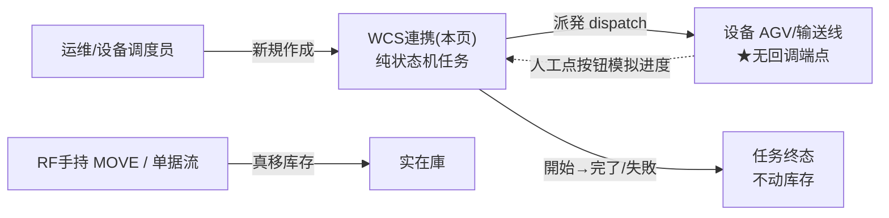
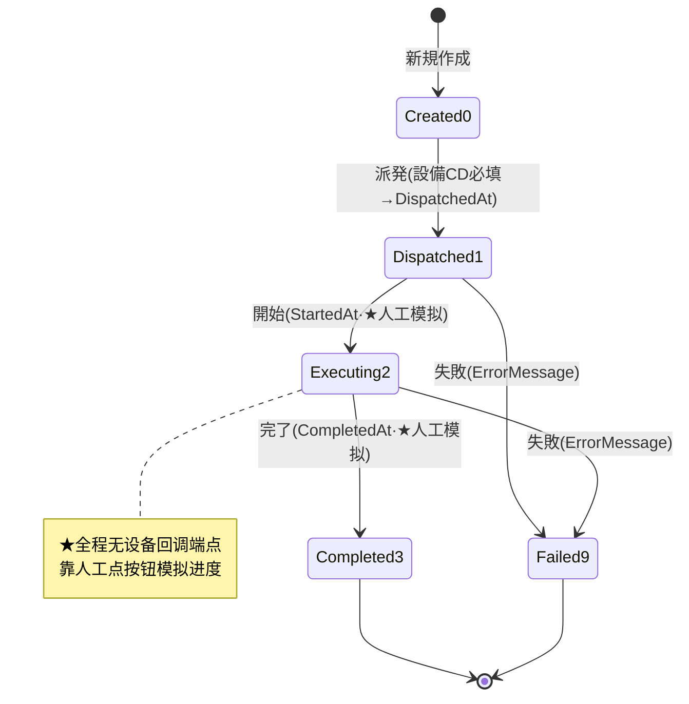

# WCS連携（自动化设备任务）单页面操作 SOP（手把手版）

> **用途**：给**运维/设备调度员操作、培训老师讲、测试人员拆用例**。比模块总册（`03-库存物流WMS` §5.20）更细。
> **页面**：WCS連携（WM310 · 库存物流 WMS）　**路由**：`/wms/wcs-task`　**前端**：`views/wms/WcsTaskView.vue`　**API**：`api/wms/connectivity.ts wcsApi`　**后端**：`Wms/WcsTaskController` → `WcsService`（Dispatch/Start/Complete/Fail）
> **基准**：分支 `feat/wfs-inbox-core`，2026-06-29；后端实测 `docs/codemap-wms/06-業界連携-报表.md` §1（2026-06-22 权威），UI 经 view 实读。
> **样例数据**：任务 `WCS2026070001`、taskType `MOVE`、设备 `AGV01`、製品 `PRD2026070001`、From `RES-C-01`、To `PIK-A-01`、数量 500。

---

## 1. 页面一句话说明

**WCS連携，就是给自动化设备（AGV / 输送线 / 堆垛机）下发搬运任务、并跟踪它做到哪一步的地方——调度员手工建任务 → 派発（dispatch）到某台设备 → 開始 → 完了 / 失敗，全程是一条「纯状态机」，本页面动作只改任务状态、不动一分库存。** 真正的库存移动由 RF 手持 MOVE 或单据流去做。

> **★最大盲点（务必先讲清）**：**本系统没有外部 WCS 设备回调端点 / webhook / 消息队列入站**。设备真把货搬完了，系统不会自动知道——「開始 → 執行中 → 完了」**全靠人在本页面点按钮手工模拟设备进度**。本页面所有调用都是前端内向调，**不是设备主动上报**。

---

## 2. 这个页面在业务流程中的位置

- **上游**：调度员手工新建（可填 relatedNo 弱关联某出库/移库单，仅文本，无外键）。
- **本页**：派発设备、模拟执行、记录成败——**只迁状态，不碰库存**。
- **下游**：无。库存搬动另由 RF 手持 MOVE（`MoveAsync` 真移库存）或单据确定流去做，与本页**解耦**。

---

## 3. 谁使用这个页面

| 角色 | 用途 |
|---|---|
| 运维 / 设备调度员 | 建 WCS 任务、派発到设备、跟踪/模拟执行、登记失败 |
| 仓库主管 | 查看自动化设备任务进度（多为只读监看） |

---

## 4. 操作前准备

- [ ] 想清楚任务类型：MOVE（搬运）/ PICK（拣取）/ PUT（上架）/ COUNT（盘点）。
- [ ] 知道要派给哪台设备的**设备编码**（如 `AGV01`、`CONV-A`）——**纯手敲文本，系统不校验设备是否存在、无主数据下拉**。
- [ ] 起讫位置（From 仓/位、To 仓/位）、製品、数量按需准备（均可空，纯登记字段）。
- [ ] 明确：**本页面不会让设备真动起来**，执行进度需要你/上位系统手工点按钮推进。

---

## 5. 页面区域说明

| 区域 | 内容 |
|---|---|
| 检索条 | 任务NO / 種別(下拉 MOVE/PICK/PUT/COUNT) / 設備CD / 状態(下拉) + 「検索」「新規」按钮 |
| 任务列表 | 任务NO / 状態 tag / 種別 / 優先度(急·↑·—) / 設備 / From(仓/位) / To(仓/位) / 製品 / 数量 / 関連NO / 作成·完了日時 / 操作列(按状态显隐 派発/開始/完了/失敗) |
| 新規 Dialog | 600px；種別(必填) / 優先度(1~3) / 関連NO·Related Type / From WH·Loc / To WH·Loc / 製品 / Lot / 数量 / Unit / 備考 |
| 派発 Dialog | 420px；只有一个**設備CD** 文本框（placeholder `AGV01 / CONV-A / ...`） |
| 失败 Dialog | 420px；只有一个**エラー内容**（errorMessage）多行文本框 |

---

## 6. 字段填写说明（口语版）

**检索条**：任务NO（模糊）、種別、設備CD、状態，点「検索」过滤；不填=全部（`pageSize:100`，无分页器）。

**新規 Dialog**（建任务）：

| 字段 | 必填 | 怎么填 | 填错影响 |
|---|---|---|---|
| 種別 taskType | ★必填 | 下拉选 MOVE/PICK/PUT/COUNT（默认 MOVE） | 空→后端 `TaskType required` |
| 優先度 priority | 默认 1 | 1~3 数字（3=急 红 / 2=↑ 黄 / 1=普通 —） | 越界被 input-number 卡在 1~3 |
| 関連NO relatedNo | 否 | 弱关联单号(≤25)，**纯文本无外键校验** | — |
| Related Type | 否 | 关联类型(≤20)；**label 是硬编码英文** | — |
| From WH / From Loc | 否 | 起点 仓CD(≤10) / 库位CD(≤30)；**label 硬编码英文** | — |
| To WH / To Loc | 否 | 终点 仓CD / 库位CD；**label 硬编码英文** | — |
| 製品 productCd | 否 | 如 `PRD2026070001`(≤20) | — |
| Lot lotNo | 否 | 批次(≤30) | — |
| 数量 qty | 否 | ≥0，精度 4 位（如 500） | — |
| Unit unitCd | 否 | 単位(≤10)；**label 硬编码英文** | — |
| 備考 remarks | 否 | 自由文本 | — |

**派発 Dialog**：

| 字段 | 必填 | 怎么填 | 填错影响 |
|---|---|---|---|
| 設備CD deviceCd | ★必填 | 手敲设备编码如 `AGV01`；**纯文本，无设备主数据下拉、不校验存在** | 空→前端先弹 `wms.common.required`；绕过→后端 `deviceCd required` |

**失败 Dialog**：

| 字段 | 必填 | 怎么填 | 填错影响 |
|---|---|---|---|
| エラー内容 errorMessage | ★必填 | 多行写失败原因（如「AGV01 通信タイムアウト」） | 空→前端静默不提交（无 toast） |

---

## 7. 按钮操作说明

| 按钮 | 何时出现（按任务 status） | 点了会怎样 |
|---|---|---|
| 検索 | 常显 | 按条件刷新列表 |
| 新規 | 常显 | 打开新規 Dialog（默认 MOVE / 优先度 1 / 数量 0） |
| 保存（Dialog） | 新規 Dialog | 建任务，status=0 Created，成功 toast 含生成的**任务NO** |
| 派発 dispatch | **仅 status 0 Created** | 打开派発 Dialog；填設備CD→status→1 Dispatched，记 DeviceCd + DispatchedAt |
| 開始 start | **仅 status 1 Dispatched** | **无确认框，单击直接**→status→2 Executing，记 StartedAt（★人工模拟设备开干） |
| 完了 complete | **仅 status 2 Executing** | **无确认框，单击直接**→status→3 Completed，记 CompletedAt（★人工模拟搬完） |
| 失敗 fail | **status 1 或 2**（Dispatched/Executing） | 打开失败 Dialog；填 errorMessage→status→9 Failed，记 ErrorMessage |

> **注意**：①開始 / 完了 **没有二次确认**，点了立刻迁状态，**误点无法撤回**（无回退按钮）；②終態 Completed(3) / Failed(9) 行**无任何操作按钮**；③列表**没有删除按钮**（`wcsApi.delete` 端点存在但 UI 未暴露）。

---

## 8. 标准业务操作 SOP（照着点）

### 场景一：新建 WCS 任务（建任务）
- **背景**：调度员要给 AGV 安排一笔从备货位到拣货位的搬运。
- **样例数据**：種別 `MOVE`、優先度 1、From `RES-C-01`、To `PIK-A-01`、製品 `PRD2026070001`、数量 500。
- **步骤**：1) 点「新規」；2) 種別选 MOVE；3) 填 From/To 仓位、製品、数量；4) 点「保存」。
- **完成后检查**：列表新增一行，**任务NO 自动生成**（样例 `WCS2026070001`）、状態=Created（info 灰）、操作列只有「派発」。
- **异常**：種別清空保存→`TaskType required`。
- **用例**：TC-M06-WCS-001、002、003。

### 场景二：派発到设备（dispatch）
- **背景**：把已建的 Created 任务下发给一台 AGV。
- **样例数据**：任务 `WCS2026070001`、設備 `AGV01`。
- **前置**：任务 status=0 Created。
- **步骤**：1) 列表该行点「派発」；2) 派発 Dialog 填設備CD `AGV01`；3) 点「派発」。
- **完成后检查**：状態→Dispatched（warning 黄）、設備列显 `AGV01`、记 DispatchedAt；操作列变为「開始 / 失敗」。
- **异常**：設備CD 留空→前端弹必填警告，不提交。
- **用例**：TC-M06-WCS-004、005。

### 场景三：模拟设备执行——開始 → 完了（★核心盲点）
- **背景**：设备开始搬、搬完了。**但系统不会自动知道**，需调度员手工点。
- **样例数据**：任务 `WCS2026070001`。
- **前置**：任务 status=1 Dispatched。
- **步骤**：1) 点「開始」（无确认，立刻 status→2 Executing/primary 蓝，记 StartedAt）；2) 设备实际搬完后，点「完了」（无确认，status→3 Completed/success 绿，记 CompletedAt）。
- **完成后检查**：状態 Dispatched→Executing→Completed 全靠这两次点击推进；CompletedAt 落库；操作列清空（终态）。
- **关键认知**：这两步是**人工模拟**，无设备回调；点错即生效，无法回退。
- **用例**：TC-M06-WCS-006、007、008。

### 场景四：任务失敗（fail，记 ErrorMessage）
- **背景**：设备在派発后或执行中出故障/通信失败。
- **样例数据**：任务 `WCS2026070001`、エラー内容「AGV01 通信タイムアウト」。
- **前置**：任务 status=1 或 2。
- **步骤**：1) 点「失敗」；2) 失败 Dialog 填 errorMessage；3) 点「失敗」。
- **完成后检查**：状態→Failed（danger 红）、ErrorMessage 落库；操作列清空（终态，**不可恢复为执行中**）。
- **异常**：errorMessage 留空→前端静默不提交。
- **用例**：TC-M06-WCS-009、010、011。

### 场景五：deviceCd 空派発被拦
- **背景**：派発时忘填设备编码。
- **步骤**：Created 任务点「派発」→不填設備CD→点「派発」。
- **检查**：前端先弹 `wms.common.required` 必填提示，不发请求；若绕过前端直调 API→后端 `deviceCd required`。
- **用例**：TC-M06-WCS-012、013。

### 场景六：完整全链核对（Created→Dispatched→Executing→Completed）
- **背景**：跑通一条任务的完整生命周期，核对每段状态/时间戳。
- **步骤**：新規→派発(AGV01)→開始→完了，逐段截图。
- **检查**：CreatedAt/DispatchedAt/StartedAt/CompletedAt 四个时间戳依次落库；状態 tag 灰→黄→蓝→绿；操作列按 §7 显隐。
- **用例**：TC-M06-WCS-014、015。

### 场景七：优先级展示与急件识别
- **背景**：急单要让设备先做。
- **样例数据**：優先度 3。
- **步骤**：新規时優先度填 3 → 保存。
- **检查**：列表優先度列显**红色「急」tag**（优先度 2 显黄色「↑」，1 显「—」）。
- **盲点**：「急」标签的 i18n key 是中文字面量 `t('急')`，非标准 key；排序/调度不自动按优先级，仅视觉提示。
- **用例**：TC-M06-WCS-016、017。

---

## 9. 状态变化说明

- **0 Created → 1 Dispatched**：仅 Created 可派発（否则 `WM-MSG-043`），需設備CD。
- **1 Dispatched → 2 Executing**：仅 Dispatched 可「開始」。
- **2 Executing → 3 Completed**：仅 Executing 可「完了」。
- **1/2 → 9 Failed**：Dispatched 或 Executing 可「失敗」，记 ErrorMessage。
- **3 / 9 为终态**：不可再迁移，无回退。

---

## 10. 按钮不可用 / 灰色原因

| 现象 | 原因 |
|---|---|
| 行无「派発」 | 非 Created(0) |
| 行无「開始」 | 非 Dispatched(1) |
| 行无「完了」 | 非 Executing(2) |
| 行无「失敗」 | 非 Dispatched/Executing（Created/Completed/Failed 无失敗） |
| 终态行操作列全空 | Completed(3) / Failed(9) 终态 |
| 整个页面找不到「删除」 | UI 未暴露删除按钮（`wcsApi.delete` 端点存在但无入口） |
| 找不到「回退/撤销」 | 状态机单向，无回退动作 |

---

## 11. 常见错误与处理

| 错误 | 原因 | 处理 |
|---|---|---|
| `deviceCd required` | 派発时設備CD 空（绕过前端） | 派発 Dialog 填設備CD |
| 前端必填警告(`wms.common.required`) | 派発設備CD 空 | 填設備CD 再提交 |
| `WM-MSG-070` | 任务NO 不存在（任务被删/传错号） | 核对任务NO |
| `WM-MSG-043` | 派発非 Created 任务（状态守卫，尾巴带各状态） | 只对 Created 任务派発 |
| `TaskType required` | 新規未选種別 | 種別下拉选 MOVE/PICK/PUT/COUNT |
| 失败 Dialog 点了没反应 | errorMessage 空→前端静默 return | 先填エラー内容 |
| WM-MSG / 英文 label 显示原文 | WM-MSG 码内联裸码未入 i18n；多处 label 硬编码（Related Type/From WH/From Loc/To WH/To Loc/Unit） | 现状已知，按字面理解 |
| 开始/完了点错了 | 无二次确认、无回退 | 现状无法撤销；如错可新建修正任务（或走 DB 处理） |

---

## 12. 操作完成后的检查清单

- [ ] 新規成功：列表新增行，**任务NO 自动生成**、状態=Created、操作列只有「派発」。
- [ ] 派発成功：状態→Dispatched、設備列显设备CD、DispatchedAt 落库。
- [ ] 開始/完了：状態依次 Executing→Completed，StartedAt/CompletedAt 落库——**全程纯状态机，未产生任何库存流水**。
- [ ] 失敗：状態→Failed、ErrorMessage 落库、终态无操作。
- [ ] 时间戳四件套：CreatedAt / DispatchedAt / StartedAt / CompletedAt 按推进逐个出现。
- [ ] **确认本页未动库存**：到在庫照会 / 库存流水核对——WCS 任务不产生 IN/OUT/MOVE 流水（库存搬动归 RF 手持 MOVE / 单据流）。

---

## 13. 页面级测试用例（≥25 条，可执行）

> 编号 `TC-M06-WCS-xxx`；数据用样例（任务 `WCS2026070001`、設備 `AGV01`、製品 `PRD2026070001`、From `RES-C-01`、To `PIK-A-01`、数量 500）。

| 用例编号 | 用例名称 | 优先级 | 前置条件 | 测试数据 | 操作步骤 | 预期结果 | 下游检查 | 备注 |
|---|---|---|---|---|---|---|---|---|
| TC-M06-WCS-001 | 新建 MOVE 任务 | P0 | 进入页面 | 種別MOVE/From RES-C-01/To PIK-A-01/数量500 | 新規→填→保存 | 列表新增、任务NO自动生成、状態Created | 不动库存 | 核心 |
| TC-M06-WCS-002 | 新建带优先级/関連NO | P1 | 同上 | 優先度2/関連NO任填 | 新規→保存 | 优先度列显「↑」黄 | — | — |
| TC-M06-WCS-003 | 種別空保存被拦 | P0 | 新規Dialog | 種別清空 | 保存 | `TaskType required` | 不落库 | — |
| TC-M06-WCS-004 | 派発到设备 | P0 | 任务 Created | 設備AGV01 | 派発→填→派発 | 状態→Dispatched、設備=AGV01、记DispatchedAt | — | 核心 |
| TC-M06-WCS-005 | 派発后操作列变化 | P1 | 已派発 | — | 看操作列 | 由「派発」变「開始/失敗」 | — | — |
| TC-M06-WCS-006 | 開始(模拟执行) | P0 | 任务 Dispatched | — | 单击開始 | 无确认、状態→Executing、记StartedAt | 无库存流水 | ★人工模拟 |
| TC-M06-WCS-007 | 完了(模拟完成) | P0 | 任务 Executing | — | 单击完了 | 无确认、状態→Completed、记CompletedAt | 无库存流水 | ★人工模拟 |
| TC-M06-WCS-008 | 終態无操作按钮 | P1 | 任务 Completed | — | 看操作列 | 操作列为空 | — | — |
| TC-M06-WCS-009 | Dispatched 失敗 | P1 | 任务 Dispatched | エラー内容文本 | 失敗→填→失敗 | 状態→Failed、记ErrorMessage | — | — |
| TC-M06-WCS-010 | Executing 失敗 | P1 | 任务 Executing | エラー内容文本 | 失敗→填→失敗 | 状態→Failed、记ErrorMessage | — | — |
| TC-M06-WCS-011 | 失敗 errorMessage 空 | P1 | 失败Dialog | 留空 | 点失敗 | 前端静默不提交、状態不变 | 不落库 | — |
| TC-M06-WCS-012 | 派発設備CD空(前端) | P0 | 任务 Created | 留空 | 派発→不填→派発 | 前端弹必填、不发请求 | 不落库 | — |
| TC-M06-WCS-013 | 派発設備CD空(后端) | P2 | 任务 Created | 空 deviceCd | 直调API | `deviceCd required` | 不落库 | 绕前端 |
| TC-M06-WCS-014 | 全链生命周期 | P0 | 新任务 | 全套样例 | 新規→派発→開始→完了 | 状態灰→黄→蓝→绿全推进 | 四时间戳齐 | E2E |
| TC-M06-WCS-015 | 时间戳四件套 | P1 | 全链跑完 | — | 查任务详情 | Created/Dispatched/Started/CompletedAt 依次落 | — | — |
| TC-M06-WCS-016 | 急件红tag | P1 | — | 優先度3 | 新規→保存 | 优先度列红「急」 | — | t('急')中文key |
| TC-M06-WCS-017 | 普通优先级显「—」 | P2 | — | 優先度1 | 看列表 | 优先度列显「—」 | — | — |
| TC-M06-WCS-018 | 派発非Created被拦 | P1 | 任务 Dispatched | — | 直调dispatch API | `WM-MSG-043`(状态守卫) | 不迁移 | — |
| TC-M06-WCS-019 | 任务不存在 | P2 | — | 错任务NO | 调dispatch/start | `WM-MSG-070` | — | — |
| TC-M06-WCS-020 | 按状态显隐操作列 | P1 | 各状态任务 | — | 看操作列 | 0派発/1開始·失敗/2完了·失敗/3·9空 | — | 状态机 |
| TC-M06-WCS-021 | 検索按種別 | P1 | 有数据 | 種別MOVE | 検索 | 仅 MOVE 命中 | — | — |
| TC-M06-WCS-022 | 検索按設備CD | P1 | 有数据 | AGV01 | 検索 | 仅该设备命中 | — | — |
| TC-M06-WCS-023 | 検索按状態 | P1 | 有数据 | Completed | 検索 | 仅完了命中 | — | — |
| TC-M06-WCS-024 | 設備CD无主数据校验 | P1 | 派発 | 乱填 NOTEXIST99 | 派発 | 照常成功(不校验设备存在) | — | 盲点 |
| TC-M06-WCS-025 | 任务全程不动库存 | P0 | 全链跑完 | — | 查库存流水 | 无 IN/OUT/MOVE 流水 | 在庫照会一致 | ★核心区别 |
| TC-M06-WCS-026 | 无删除按钮 | P2 | 有任务 | — | 找删除 | UI 无删除入口 | — | 现状 |
| TC-M06-WCS-027 | 開始/完了无回退 | P2 | Completed任务 | — | 找回退 | 无回退/撤销动作 | — | 单向 |
| TC-M06-WCS-028 | 英文label硬编码 | P2 | 新規Dialog | — | 看字段名 | Related Type/From WH/From Loc/To WH/To Loc/Unit 英文 | — | i18n缺口 |
| TC-M06-WCS-029 | 新規成功提示含任务NO | P1 | 新規 | — | 保存 | toast 显「成功: WCS…」含生成号 | — | — |
| TC-M06-WCS-030 | 权限不足 | P2 | 无权账号 | — | 进页面/派発 | 待业务确认(隐藏/拒绝) | — | 权限 |

---

## 14. 培训讲解建议

| 顺序 | 讲什么 | 演示 | 易误解点 |
|---|---|---|---|
| 1 | 这页是给自动化设备下任务的地方 | §2 流程图 | 以为本页会真搬库存（其实不动） |
| 2 | 四种任务类型 MOVE/PICK/PUT/COUNT | 新規 Dialog | 以为类型决定库存动作 |
| 3 | 状态机四段+失败旁路 | 跑全链 §8 场景六 | 以为能回退 |
| 4 | **★无设备回调，全靠人工模拟** | 開始/完了点给学员看 | 以为设备会自动上报进度 |
| 5 | 派発必填設備CD，但不校验设备 | 乱填也能成功 | 以为有设备主数据下拉 |
| 6 | 急件只是红标签、不自动调度 | 优先度 3 演示 | 以为系统会自动排前 |
| 7 | 本页不产生库存流水 | 跑完查在庫照会 | 与 RF 手持 MOVE 混淆 |

---

## 15. 与模块级手册的关系

对应 `03-库存物流WMS-最详细用户操作培训手册.md` §5.20「業界連携・寄售类」中 **WCS連携 WM310(/wcs-task)** 一行（表格概述）。状态机速查见总册 §5（5.20 标题段）；测试矩阵 §7（M06-024 IoT/WCS 轮询·无回调）；待确认清单 §10（C-M06-13 WCS 无设备回调端点·是否接真实设备/SignalR，集成评估）。

---

## 16. 代码与文档来源

| 层 | 文件 |
|---|---|
| 逐行源码手册 | `docs/codemap-wms/06-業界連携-报表.md` §1 WCS（权威，2026-06-22 实测） |
| 前端 view | `cp6.web/src/views/wms/WcsTaskView.vue`（状态显隐/三 Dialog/优先级 tag） |
| API/类型 | `api/wms/connectivity.ts`(`wcsApi`：search/create/dispatch/start/complete/fail/delete)、`types/wms/wms.ts`(`WcsTask`/`WcsTaskSearchQuery`) |
| 后端 | `Wms/WcsTaskController.cs`（Dispatch 内嵌 DispatchReq）、`Services/Wms/WcsService.cs`（DispatchAsync 56-67：deviceCd 非空→GetTracked(`WM-MSG-070`)→仅 Created 可払出(`WM-MSG-043`)→Status=Dispatched+DeviceCd+DispatchedAt；Start/Complete/Fail 状态机） |
| 实体 | `DomainModels/Wms/WcsTask.cs`（status 0/1/2/3/9） |

---

## 最后更新来源

- 代码：见 §16（codemap-wms 06 §1 + WcsTaskView.vue 实读 + connectivity.ts/wms.ts 类型）。
- 基准：分支 `feat/wfs-inbox-core`，2026-06-29（codemap 2026-06-22）。
- 覆盖：16 节 / 7 场景 / 30 用例（TC-M06-WCS-001~030）。
- 诚实标注：**无外部 WCS 设备回调端点/webhook，start→complete 全人工模拟**；deviceCd 纯文本无设备主数据校验；多处英文 label 硬编码（Related Type/From WH/From Loc/To WH/To Loc/Unit）；`t('急')` 中文字面量当 key；WM-MSG 码内联裸码未入 i18n；UI 无删除/无回退按钮（`wcsApi.delete` 端点存在但未暴露）。
